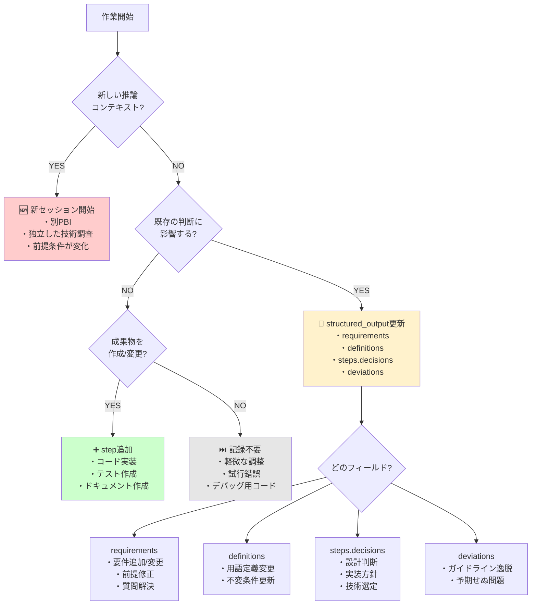

# AI監査ログ クイック判断ガイド - 開発中の迷い解消

---
document_type: quick_reference_guide
target_audience:
  - AIエージェント（Devin, Cursor等）
  - AI作業実行者
  - プロジェクトマネージャー
priority: critical
scope: audit_log_decision_making
version: 1.0
last_updated: 2026-03-10
related_documents:
  - AI-WORKLOG-ENFORCEMENT-GUIDE.md
  - AICQ_AUDIT_LOG_SCHEMA.md
  - AI-WORKLOG-GRANULARITY-GUIDE.md
---

## 📋 1. このガイドの目的

このガイドは、AI開発中に「今、記録すべき？」「どこに記録すべき？」と迷った時に、**30秒で判断できる**実践的なリファレンスです。

**提供する価値:**
- ✅ **即座判断**: 30秒フローチャートで迷いを解消
- ✅ **典型例網羅**: よくある20シナリオの判断例
- ✅ **Over-logging推奨**: 「迷ったら記録」の安全原則
- ✅ **実践的**: 理論ではなく、現場で使える具体的な指針

**使用タイミング:**
- 開発作業中に記録判断で迷った時（常時参照）
- セッション開始時の確認（クイックリファレンス）
- チーム内での監査ログ品質向上（レビュー基準）

---

## ⚡ 2. 30秒判断フローチャート



### 🎯 最速判断（10秒版）

```
新PBI？ → 新セッション
判断変更？ → structured_output更新
コード変更？ → step追加
デバッグのみ？ → 記録不要（迷ったら記録）
```

---

## 🔍 3. 判断基準の詳細

### 3.1 「新しい推論コンテキスト」とは？

#### ✅ YES判定（新セッション開始）
- **別のPBI/チケットに着手**
  - 例: PROJ-123（ユーザー登録）→ PROJ-124（商品検索）
- **全く独立した技術調査**
  - 例: React実装中 → 新ライブラリ（GraphQL）の評価
- **前提条件の根本的変化**
  - 例: MVP版（単一サーバー）→ 本格版（マイクロサービス）
- **別ドメイン・別レイヤーの設計**
  - 例: UI設計完了 → バックエンドAPI設計開始

#### ❌ NO判定（同セッション継続）
- **同じPBI内のサブタスク**
  - 例: ユーザー登録の入力フォーム → バリデーション → 送信処理
- **既存実装の継続・拡張**
  - 例: UserService → UserService.updateProfile()追加
- **同じ技術選定内での詳細実装**
  - 例: JWT認証 → refresh token実装
- **関連するバグ修正・リファクタリング**
  - 例: 認証ロジック実装中 → 認証関連のバグ発見・修正

### 3.2 「既存の判断に影響」とは？

#### ✅ YES判定（structured_output更新）
- **要件の追加・変更・明確化**
  - 例: 「パスワードは8文字以上」→「8文字以上、大小英数字必須」
- **設計判断の変更・撤回**
  - 例: SQLite → PostgreSQL へ変更決定
- **技術選定の見直し**
  - 例: REST API → GraphQL API への方針転換
- **前提条件の修正**
  - 例: 「シングルテナント」→「マルチテナント」前提に変更
- **ガイドライン違反の検知**
  - 例: セキュリティガイドライン違反を発見

#### ❌ NO判定（更新不要）
- **判断結果の実行**（既に決定済みの実装）
  - 例: PostgreSQL選定済み → テーブル作成
- **デバッグ用の一時的変更**
  - 例: console.log追加、一時的なログ出力
- **コメント・ログ出力の追加**
  - 例: コード可読性向上のためのコメント追記
- **フォーマット修正**
  - 例: インデント調整、スペース統一

### 3.3 「成果物の作成/変更」とは？

#### ✅ YES判定（step追加）
- **プロダクションコードの作成・修正**
  - 例: UserController.js 作成、認証ミドルウェア追加
- **テストケースの作成**
  - 例: user.test.js、統合テスト追加
- **APIドキュメントの作成**
  - 例: OpenAPI spec、Postmanコレクション
- **データベーススキーマ変更**
  - 例: migration file、テーブル定義変更
- **設定ファイル更新**
  - 例: package.json、docker-compose.yml、環境変数

#### ❌ NO判定（step不要）
- **デバッグ用console.log追加**
  - 例: console.log("debug:", data)
- **試行錯誤のための一時コード**
  - 例: 動作確認用の仮実装
- **IDE設定の調整**
  - 例: .vscode/settings.json の個人設定
- **ビルドキャッシュのクリア**
  - 例: npm cache clean、docker system prune

---

## 📊 4. 典型20シナリオの即座判断表

| # | シナリオ | 判断 | 記録先 | 理由 |
|---|---------|------|--------|------|
| 1 | 新しいPBI着手 | 新セッション | - | 推論コンテキスト変化 |
| 2 | 要件の曖昧さ発見 | 更新 | requirements.questions | 要件理解への影響 |
| 3 | 技術選定（React vs Vue） | 更新 | steps.decisions | 設計判断 |
| 4 | 選定済みReactでコンポーネント実装 | step追加 | steps[].outputs | 成果物作成 |
| 5 | 実装中にバグ発見 | 更新 | deviations | 逸脱検知 |
| 6 | バグ修正実施 | step追加 | steps[] | 成果物変更 + deviation.recovered |
| 7 | コードレビュー指摘で設計変更 | 更新 | steps.decisions, definitions.changes | 判断変更 |
| 8 | 変更後の実装 | step追加 | steps[] | 成果物変更 |
| 9 | テストケース作成 | step追加 | steps[] | 成果物作成 |
| 10 | テスト失敗 → 修正 | 更新+追加 | deviations + steps[] | 逸脱+修正 |
| 11 | リファクタリング判断 | 更新 | steps.decisions | 技術的判断 |
| 12 | リファクタリング実行 | step追加 | steps[] | 成果物変更 |
| 13 | 用語定義の変更 | 更新 | definitions.changes | 内部定義変更 |
| 14 | 依存ライブラリAPI変更判明 | 更新 | requirements.assumptions | 前提条件変更 |
| 15 | パフォーマンス問題発見 | 更新 | deviations | 非機能要件逸脱 |
| 16 | 最適化実施 | step追加 | steps[] | 成果物変更 |
| 17 | ガイドライン違反検知 | 更新 | guidelines.checks, deviations | コンプライアンス |
| 18 | デバッグ用console.log追加 | 記録不要 | - | 軽微・一時的 |
| 19 | コメント・インデント修正 | 記録不要 | - | 判断不要の作業 |
| 20 | 別PBIの調査開始 | 新セッション | - | 推論コンテキスト変化 |

---

## 📝 5. フィールド選択ガイド

### 5.1 requirements（要件関連）

**更新すべきケース:**
- ユーザーストーリー追加・変更
- 受入基準の明確化
- 前提条件（assumptions）の追加・修正・撤回
- 未解決質問（questions）の追加・解決

**記録例:**
```json
{
  "requirements": {
    "req_items": [{
      "req_id": "REQ-002",
      "text": "ログイン試行は5回まで、以降30分ロック",
      "type": "functional",
      "priority": "must",
      "acceptance": ["5回連続失敗でロック", "30分後に自動解除", "管理者による手動解除可能"]
    }],
    "assumptions": [{
      "assumption_id": "ASM-003",
      "text": "単一サーバー前提 → 分散環境に変更",
      "status": "revised",
      "reason": "スケーラビリティ要件の追加",
      "risk": "high"
    }],
    "questions": [{
      "q_id": "Q-001",
      "question": "ロック後の通知方法は？",
      "status": "answered",
      "answer": "メール通知 + アプリ内通知"
    }]
  }
}
```

### 5.2 definitions（定義関連）

**更新すべきケース:**
- 技術用語の定義追加・変更
- 不変条件（invariants）の設定・修正
- 用語の揺れ・変更履歴の記録

**記録例:**
```json
{
  "definitions": {
    "terms": [{
      "term": "アクティブユーザー",
      "definition": "過去30日以内にログインしたユーザー",
      "scope": "全システム共通",
      "source_ref": "REQ-USER-001"
    }],
    "invariants": [
      "ユーザーIDは一意である",
      "パスワードは暗号化して保存する",
      "セッションは24時間で自動期限切れ"
    ],
    "changes": [{
      "change_id": "DEF-CHG-001",
      "term": "セッション管理",
      "before": "セッション: メモリ保持",
      "after": "セッション: Redis保持",
      "reason": "スケーラビリティ要件への対応",
      "impact": "セッション管理実装の全面変更",
      "approved_by": "user"
    }]
  }
}
```

### 5.3 steps.decisions（判断関連）

**更新すべきケース:**
- アーキテクチャ判断
- 設計判断
- 実装方針判断
- テスト戦略判断
- 技術選定

**記録例:**
```json
{
  "steps": [{
    "step_id": "DESIGN-003",
    "phase": "design",
    "goal": "認証方式の決定",
    "reasoning_summary": {
      "summary": "JWT vs Session Cookie を比較検討",
      "alternatives_considered": ["JWT", "Session Cookie", "OAuth2のみ"],
      "assumptions_used": ["ASM-001"],
      "risks": ["JWT秘密鍵漏洩リスク"]
    },
    "decisions": [{
      "decision_id": "DESIGN-003-D1",
      "decision": "認証方式: JWT採用",
      "rationale": "ステートレス、スケーラブル、SPA適性、既存事例豊富",
      "req_links": ["REQ-AUTH-001"]
    }],
    "evidence": [{
      "type": "doc_ref",
      "ref": "JWT Best Practices RFC",
      "result": "セキュリティガイドライン準拠確認"
    }]
  }]
}
```

### 5.4 deviations（逸脱関連）

**更新すべきケース:**
- ガイドライン違反
- パフォーマンス基準未達
- セキュリティ懸念
- 予期せぬエラー・バグ
- 技術的制約による妥協

**記録例:**
```json
{
  "deviations": [{
    "dev_id": "DEV-002",
    "type": "performance",
    "severity": "medium",
    "description": "クエリ応答時間が目標500ms → 実測800ms",
    "detected_at_step": "TEST-005",
    "recovered": true,
    "root_cause": "N+1クエリ問題による性能劣化"
  }]
}
```

---

## ⚖️ 6. 「迷ったら記録」の原則

### 6.1 Over-logging推奨の理由

**監査ログの性質上、「足りない」は致命的、「多すぎる」は許容:**

- ✅ **後から削除・統合は可能** だが、記録漏れは取り返せない
- ✅ **AICQメトリクスは「記録がある」ことが前提** で算出
- ✅ **監査・トラブルシューティング時** に詳細ログが救世主になる
- ✅ **品質向上のPDCAサイクル** には豊富なデータが必要

**実践的な指針:**
```
「これ記録すべき？」→ 3秒考えて答えが出ない → 記録する
「軽微だから記録不要かな？」→ 迷っている → 記録する
「判断と呼べるかな？」→ 少しでも考えた → 記録する
```

### 6.2 記録を省略してよいケース（限定的）

#### ✅ 省略OK（確実に一時的・個人的）
- **IDE設定の個人的調整**
  - 例: .vscode/settings.json の font size変更
- **ビルド・キャッシュ管理**
  - 例: npm cache clean、docker system prune
- **デバッグ専用の一時コード**
  - 例: console.log("debug:", data)、alert("test")
- **自動生成ファイル（そのもの）**
  - 例: node_modules、.next、dist フォルダの内容

#### ❌ 省略NG（必ず記録）
- **プロダクションコードの変更**（1行でも）
  - 例: 関数追加、ロジック修正、コメント追加
- **テストコードの追加・修正**
  - 例: テストケース追加、モック変更
- **ドキュメントの作成・更新**
  - 例: README更新、API仕様書変更
- **設定ファイルの変更**
  - 例: package.json、docker-compose.yml、環境変数
- **判断・方針の変更**
  - 例: 技術選定、設計方針、実装方針

### 6.3 判断に迷った時のチェックリスト

```markdown
□ この作業は将来の自分/他者が「なぜこうなったか」を知りたくなる？
  → YES: 記録必須

□ この作業は次のフェーズ・他の開発者に影響する？
  → YES: 記録必須

□ この作業はコードレビューで説明が必要？
  → YES: 記録必須

□ この作業は本番環境に影響する？
  → YES: 記録必須

□ この作業により、何かが「変わった」？
  → YES: 記録必須

□ 上記すべてNO かつ 完全に一時的・個人的な作業？
  → 記録不要（ただし迷ったら記録）
```

---

## ⏱️ 7. 更新頻度の具体例

### 7.1 Phase別の推奨頻度

| Phase | 推奨頻度 | 具体例 | 更新対象 |
|-------|---------|--------|----------|
| **Phase 0（要件分析）** | 要件理解単位 | ユーザーストーリー1件ごと | requirements, definitions |
| **Phase 1（設計）** | 設計判断単位 | アーキテクチャ・データモデル・API設計ごと | steps.decisions, definitions |
| **Phase 2（実装）** | 機能単位 | 1機能（1-2h作業）ごと | steps.outputs, evidence |
| **Phase 3（テスト）** | テストスイート単位 | ユニット・統合・E2Eテスト作成ごと | steps.evidence, deviations |
| **Phase 4（統合）** | 統合イベント単位 | マージ・コンフリクト解決・統合テストごと | steps.evidence, deviations |
| **Phase 5（リリース）** | リリース判断単位 | Go/No-Go判断・デプロイ・ロールバックごと | steps.decisions, deviations |
| **Phase 6（運用）** | インシデント単位 | 障害検知・対応・事後分析ごと | deviations, steps.evidence |

### 7.2 作業時間別の目安

| 作業時間 | 推奨更新回数 | 例 | 注意点 |
|---------|------------|-----|-------|
| **15分未満** | 0-1回 | 軽微な修正、タイポ修正 | 判断があれば必ず記録 |
| **15分-1時間** | 1-2回 | 小機能実装、単純バグ修正 | 開始時と完了時の最低2回 |
| **1-2時間** | 2-3回 | 中機能実装、複雑バグ修正 | 中間での判断・逸脱も記録 |
| **2-4時間** | 3-5回 | 大機能実装、設計変更伴う | フェーズ遷移を明確に記録 |
| **4-8時間** | 5-10回 | 複雑な機能・大幅設計変更 | 推論コンテキスト分割検討 |

**⚠️ 重要:** 上記は目安。**判断・逸脱があれば作業時間に関係なく即座に記録。**

### 7.3 更新タイミングの優先順位

```
優先度1（即座・必須）: 判断・逸脱の検知
  例: 設計方針変更、ガイドライン違反、バグ発見

優先度2（各作業単位）: 成果物の作成・変更
  例: ファイル作成、機能実装完了、テスト作成

優先度3（フェーズ遷移時）: ステータス更新
  例: Phase 1→2移行、要件確定、設計完了

優先度4（定期・推奨）: 進捗状況の更新
  例: 作業進捗、残タスクの確認
```

---

## ❓ 8. よくある質問（FAQ）

### Q1: バグ修正は毎回記録すべき？
**A:** **YES（ほぼすべて）**。重要度で判断：
- **Critical/High**: 必ず記録（deviation → 修正step → 検証）
- **Medium**: 記録推奨（将来の参考になる）
- **Trivial**（タイポ修正等）: 判断による（迷ったら記録）

**記録方法:**
```json
{
  "deviations": [{
    "dev_id": "DEV-001",
    "type": "logic_error",
    "severity": "high",
    "description": "ユーザーIDの重複チェックが機能していない",
    "detected_at_step": "TEST-003"
  }],
  "steps": [{
    "step_id": "FIX-001",
    "phase": "implement",
    "goal": "DEV-001の修正",
    "outputs": ["userService.js修正", "重複チェックテスト追加"]
  }]
}
```

### Q2: リファクタリングは？
**A:** **YES**。判断理由を必ず記録：
- **技術的負債の解消** → decision + step
- **可読性向上** → decision + step
- **パフォーマンス改善** → decision + step + 前後比較

**記録のポイント:**
- なぜリファクタリングが必要だったか（現状の問題）
- どのような方針で実施したか（Before/After）
- 何が改善されたか（定量的効果）

### Q3: 試行錯誤の途中経過は？
**A:** **基本的にNO**。ただし例外あり：

**記録不要:**
- 単純な動作確認（console.logで値確認等）
- 一時的なコメントアウト
- 実験的なコード（すぐに削除予定）

**記録すべき:**
- 最終判断に至った経緯（alternatives_considered）
- 失敗から学んだ重要な知見（lessons_learned）
- 将来の参考になる実験結果

### Q4: 人間（ユーザー）の介入があった場合は？
**A:** **必ず記録**：

**指示変更:**
```json
{
  "requirements": {
    "req_items": [{
      "req_id": "REQ-003",
      "text": "パスワード長を12文字以上に変更",
      "status": "revised_by_user",
      "reason": "セキュリティポリシー更新により"
    }]
  }
}
```

**レビュー指摘:**
```json
{
  "deviations": [{
    "dev_id": "DEV-002",
    "type": "code_review",
    "description": "レビューア指摘：この関数は責務が多すぎる",
    "detected_at_step": "REVIEW-001"
  }]
}
```

**エスカレーション:**
- 技術的判断 → 同セッション継続 + decision記録
- 要件変更 → 別セッション検討 + requirements更新

### Q5: 複数の変更をまとめて記録してもいい？
**A:** **可能だが非推奨**：

**理想（推奨）:**
- リアルタイム更新（作業完了と同時に記録）
- 1つの判断 = 1つの更新

**許容範囲:**
- まとめる場合は**2時間以内**、かつ**同じカテゴリ内**
- 例: 同じファイル内の複数関数実装 → 1つのstepにまとめる

**まとめ禁止:**
- 判断・逸脱は**即座に記録**（まとめ不可）
- 異なるフィールドへの更新（例: requirement + decision）

---

## 🚀 9. クイックリファレンスカード

### ⚡ 最速判断（10秒）
```
新PBI？ → 新セッション
判断変更？ → structured_output更新
コード変更？ → step追加
デバッグのみ？ → 記録不要（迷ったら記録）
```

### 📝 更新先クイック選択
```
要件関連 → requirements
用語・定義 → definitions
設計・実装判断 → steps.decisions
逸脱・問題 → deviations
成果物・実装 → steps.outputs
テスト・検証 → steps.evidence
ガイドライン → guidelines.checks
```

### ⏱️ 更新タイミング
```
判断時 → 即座（最優先）
逸脱時 → 即座（最優先）
実装完了時 → 各機能単位
フェーズ遷移時 → 必須
セッション終了時 → 最終確認
```

### 🎯 迷った時の魔法の言葉
```
「将来の自分が知りたいか？」→ YES なら記録
「他の人に説明が必要か？」→ YES なら記録
「本番に影響するか？」→ YES なら記録
「3秒考えて答えが出ない？」→ 記録する
```

---

## 🎮 10. 実践ワークショップ

### エクササイズ1: 以下のシナリオで判断してください

**シナリオA**: Reactコンポーネントを実装中、propsの型定義を変更
- 判断: ___________
- 記録先: ___________

**シナリオB**: コードレビューで「この関数は責務が多すぎる」と指摘
- 判断: ___________
- 記録先: ___________

**シナリオC**: デバッグ中にconsole.log("debug: ", value)を追加
- 判断: ___________
- 記録先: ___________

**シナリオD**: 要件で不明な点をユーザーに質問
- 判断: ___________
- 記録先: ___________

**シナリオE**: テスト実行でパフォーマンス問題を発見
- 判断: ___________
- 記録先: ___________

### 解答と解説

- **A: step追加**（コード変更） → `steps[].outputs`
  - *理由: propsの型定義は成果物（TypeScriptファイル）の変更*

- **B: 更新**（判断変更） → `deviations` + `steps.decisions` + `definitions.changes`
  - *理由: レビュー指摘=逸脱検知、関数責務の再定義、対応判断*

- **C: 記録不要**（デバッグ用一時コード）
  - *理由: 一時的なデバッグ用コード、本番に影響なし*

- **D: 更新** → `requirements.questions`
  - *理由: 要件理解に影響する不明点の発見と質問*

- **E: 更新** → `deviations` + 後に修正なら `steps` 追加
  - *理由: 非機能要件（パフォーマンス）の逸脱検知*

### エクササイズ2: 優先順位付け

以下の3つの作業が同時発生。記録順序は？
1. ユーザーから要件変更の連絡
2. 実装完了したコードのコミット  
3. テスト失敗の検知

**解答:**
**優先順: 3 → 1 → 2**

**理由:**
- **3（テスト失敗）**: 逸脱検知、即座に記録（最優先）
- **1（要件変更）**: 判断への影響大、早期記録必要
- **2（コミット）**: 成果物記録、完了後でも影響なし

---

## ✅ 11. まとめ

### 📜 記録の黄金律
1. **迷ったら記録** - Over-loggingは許容、記録漏れは致命的
2. **判断は即座** - 後回しにすると忘れる・不正確になる  
3. **軽微な作業は省略可** - ただし「軽微」の判断は慎重に

### 🎯 成功のコツ
- **このガイドをブックマーク** - 開発中に常時参照
- **最初の1週間は「全て記録」** で感覚を掴む
- **チーム内でレビュー文化を確立** - 過不足の相互チェック
- **30秒フローチャートを暗記** - 迷った時の自動判断

### 🔧 トラブル時の対処
- **記録漏れに気づいた** → すぐに追記（タイムスタンプ明記）
- **過剰記録してしまった** → 後で統合・削除可能（問題なし）
- **判断が曖昧** → 「迷ったら記録」の原則を適用
- **フィールド選択で迷う** → セクション5のガイド参照

### 🚀 品質向上への道筋

**Phase 1（習得）**: このガイド活用で記録精度90%達成
**Phase 2（熟練）**: 直感的判断で迷い時間を50%削減
**Phase 3（マスター）**: チーム全体の監査ログ品質向上に貢献

---

## 📞 サポート・フィードバック

**迷った時の対応:**
1. このガイドの該当セクションを再確認
2. 30秒フローチャートを実行
3. FAQ（セクション8）を確認
4. それでも判断できない場合 → 「迷ったら記録」を適用

**ガイド改善への貢献:**
- 新しいシナリオや判断例を発見した場合
- 現場で使いにくい点を見つけた場合
- より良い判断基準を思いついた場合

**このガイドを活用し、高品質な監査ログを維持してください！** 🎉