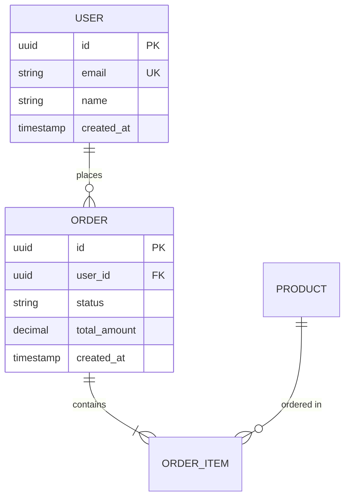

# Phase 2B: 実装後設計ガイド / Post-Implementation Design Guide

**📂 重要**: 成果物の格納場所、命名規則、管理方法については以下を参照：
- 🔴 **必須**: [`../../03-development-process/design-artifacts-management-guide.md`](../../03-development-process/design-artifacts-management-guide.md)

---

## 📋 目次

1. [フェーズ概要](#フェーズ概要)
2. [開始条件](#開始条件)
3. [成果物詳細](#成果物詳細)
4. [作業ステップ](#作業ステップ)
5. [AI活用による効率化](#ai活用による効率化)
6. [完了基準](#完了基準)
7. [よくある質問](#よくある質問)

---

## フェーズ概要

### 目的

実装完了後(または並行)に、**実装された内容を正確に文書化**し、保守・運用・将来の拡張のための設計情報を整備する。

---

## ⚠️ 禁止事項チェック

### このフェーズ特有の禁止事項
- **実装前の作成**: 実装が完了する前にPhase 2Bを実施してはいけない
- **実装との不一致**: 実際の実装と異なる内容を文書化してはいけない
- **不完全なAPI仕様**: 全バリデーション、全エラーパターン、exampleを省略してはいけない
- **運用情報不足**: 運用チームが必要とする情報を省略してはいけない

### 全フェーズ共通禁止事項
- **CI/CD設定の無断変更**: 明示的な指示がない限り、GitHub Actions、CircleCI、Jenkins等のCI/CD設定ファイルを変更してはいけない
- **本番環境への直接変更**: 本番データベース、本番サーバー、本番設定ファイルを直接変更してはいけない
- **セキュリティ設定の独断変更**: 認証・認可・暗号化等のセキュリティ設定を独自判断で変更してはいけない
- **組織標準外技術の無断導入**: プロジェクトで使用していない新しいライブラリ・フレームワーク・言語を独断で導入してはいけない
- **プロジェクト構造の大幅変更**: ディレクトリ構造、命名規則、アーキテクチャパターンを独断で大きく変更してはいけない

### 📚 詳細確認
禁止事項の詳細、具体例、例外ケースについては以下のドキュメントを参照してください：
- [AI開発タスクの禁止事項](../../01-coding-standards/ai-task-prohibitions.md)
- [禁止事項チェックリスト](../../01-coding-standards/ai-task-prohibitions-checklist.md)

---

### 重要な原則

```yaml
principles:
  implementation_based:
    description: "実装ベース"
    guideline: "実際に動くコードに基づいて文書化する"
    
  knowledge_capture:
    description: "知識の獲得"
    guideline: "実装中に得られた知見を記録する"
    
  practical:
    description: "実用的"
    guideline: "新メンバーや運用チームが使える内容にする"
    
  maintainable:
    description: "保守可能"
    guideline: "将来の変更に耐えるドキュメントを作る"
```

### タイミング

```yaml
timing_options:
  option_1_parallel:
    description: "並行実施 (推奨)"
    when: "Phase 3 (実装) と同時進行"
    approach: "完成部分から順次文書化"
    benefit: "リードタイム短縮、知識の鮮度維持"
  
  option_2_after:
    description: "実装後実施"
    when: "Phase 4 (レビュー・QA) 完了後"
    approach: "完成したコード全体を文書化"
    benefit: "確定情報のみ記録、集中作業可能"
```

### 期間とリソース

```yaml
duration:
  parallel:
    phase_3_during: "Phase 3 期間の 20-30%"
    phase_4_during: "Phase 4 期間の 30-40%"
    total: "実装期間内に完了"
  
  after:
    standalone: "2-3日 (実装期間により変動)"
  
resources:
  required:
    - 実装担当エンジニア: 1-2名
    - (オプション) テクニカルライター: 0.5名
  
  effort:
    without_ai: "21-40時間"
    with_ai: "10-20時間"
```

---

## 開始条件

### 前提条件チェックリスト

```yaml
prerequisites:
  phase_2a_completed:
    - [ ] ADRが作成されている
    - [ ] API契約書が合意されている
    - [ ] 制約条件が明確である
  
  phase_3_completed_or_ongoing:
    - [ ] 実装が完了している (後実施の場合)
    - [ ] 主要機能が実装済み (並行実施の場合)
  
  phase_4_in_progress:
    - [ ] コードレビューが進行中
    - [ ] テストが実施されている
  
  ready_to_document:
    - [ ] コードが安定している
    - [ ] 大きな変更の予定がない
    - [ ] 実装中の発見事項が整理されている
```

### インプット

```yaml
inputs:
  from_phase_2a:
    - ADR (事前設計版)
    - API契約書
    - 制約条件文書
    - アーキテクチャ概要図
  
  from_phase_3:
    - 実装コード
    - ユニットテスト
    - 統合テスト
    - 実装中の技術的発見
    - コメント・ドキュメントコメント
  
  from_phase_4:
    - コードレビューフィードバック
    - テスト結果
    - パフォーマンス測定結果
    - セキュリティスキャン結果
```

---

## 成果物詳細

### 1. 設計書 (Design Document)

#### 概要
システム全体の詳細な技術設計を記述する包括的ドキュメント。

#### テンプレート
`/devin-organization-standards/08-templates/design-document-template.md`

#### 主要セクション

```yaml
必須セクション:
  1_overview:
    - 背景とモチベーション
    - 目標と非目標
    - スコープ
    
  2_architecture:
    - システム全体構成図
    - コンポーネント設計
    - データフロー図
    - 技術スタック詳細
    
  3_detailed_design:
    - 各機能の実装後設計
    - 実装されたアルゴリズム
    - 処理フロー
    - エラーハンドリング
    
  4_data_model:
    - ER図
    - テーブル定義
    - インデックス設計
    - マイグレーション履歴
    
  5_non_functional:
    - セキュリティ実装
    - パフォーマンス最適化
    - スケーラビリティ対策
    - 監視・ログ設計

推奨セクション:
  6_deployment:
    - デプロイメント手順
    - 環境構成
    - 設定項目
    
  7_operations:
    - 運用手順
    - トラブルシューティング
    - アラート対応
    
  8_future_work:
    - 技術的負債
    - 改善案
    - 拡張ポイント
```

#### 作成アプローチ

**アプローチA: トップダウン (全体→詳細)**
```yaml
step_1: "システム全体構成を記述"
step_2: "各コンポーネントの役割を説明"
step_3: "詳細な処理フローを記述"
step_4: "データモデルを文書化"
```

**アプローチB: ボトムアップ (実装→設計)**
```yaml
step_1: "実装されたコードを分析"
step_2: "コンポーネント間の関係を整理"
step_3: "アーキテクチャを抽出"
step_4: "設計思想を記述"
```

#### 品質基準

```yaml
quality_criteria:
  completeness:
    - 全ての主要コンポーネントがカバーされている
    - データモデルが完全に定義されている
    - 非機能要件が説明されている
  
  accuracy:
    - 実装と一致している
    - 図が最新の状態である
    - コード例が動作する
  
  clarity:
    - 技術者が理解できる
    - 曖昧な表現がない
    - 図が効果的に使われている
  
  usability:
    - 新メンバーのオンボーディングに使える
    - トラブルシューティングに役立つ
    - 拡張時の参考になる
```

#### 作成時間
- **AI活用なし**: 8-16時間
- **AI活用あり**: 4-8時間

---

### 2. 完全版API仕様書 (Complete API Specification)

#### 概要
全エンドポイントの完全な仕様を OpenAPI 3.0 形式で記述。

#### テンプレート
`/devin-organization-standards/08-templates/api-specification-template.md`

#### Phase 2-A (API契約) からの拡張

```yaml
phase_2a_coverage:
  - エンドポイント一覧
  - 基本的な入出力構造
  - 認証方式

phase_2b_additions:
  - 全パラメータの詳細仕様
  - バリデーションルール
  - 詳細なエラーレスポンス
  - レート制限の詳細
  - ページネーション仕様
  - フィルタリング・ソート仕様
  - コード例 (curl, JavaScript, Python等)
  - SDKの使用方法
```

#### OpenAPI 3.0 での記述

```yaml
openapi: 3.0.0
info:
  title: User Service API
  version: 1.0.0
  description: ユーザー管理サービスのAPI

servers:
  - url: https://api.example.com/v1
    description: Production
  - url: https://api-staging.example.com/v1
    description: Staging

paths:
  /users:
    get:
      summary: ユーザー一覧取得
      parameters:
        - name: page
          in: query
          schema:
            type: integer
            default: 1
        - name: limit
          in: query
          schema:
            type: integer
            default: 20
            maximum: 100
      responses:
        '200':
          description: 成功
          content:
            application/json:
              schema:
                type: object
                properties:
                  users:
                    type: array
                    items:
                      $ref: '#/components/schemas/User'
                  pagination:
                    $ref: '#/components/schemas/Pagination'

components:
  schemas:
    User:
      type: object
      required:
        - id
        - email
        - name
      properties:
        id:
          type: string
          format: uuid
        email:
          type: string
          format: email
        name:
          type: string
          minLength: 1
          maxLength: 100
```

#### 作成時間
- **AI活用なし**: 4-8時間
- **AI活用あり**: 1-2時間 (コードから自動生成)

---

### 3. アーキテクチャ図 (Architecture Diagrams)

#### 概要
システム構成を視覚的に表現する各種図。

#### 必須図

```yaml
system_context:
  type: "C4 Level 1 - システムコンテキスト図"
  content: "システムと外部アクター・システムの関係"
  tool: "Diagrams.net, Mermaid"
  
container_diagram:
  type: "C4 Level 2 - コンテナ図"
  content: "主要コンポーネント (アプリケーション、DB、キャッシュ等)"
  tool: "Diagrams.net, Mermaid"
  
component_diagram:
  type: "C4 Level 3 - コンポーネント図"
  content: "各コンテナ内のコンポーネント構成"
  tool: "Diagrams.net, Mermaid"
  
deployment_diagram:
  type: "デプロイメント図"
  content: "本番環境の物理構成"
  tool: "Diagrams.net, AWS Architecture Icons"

data_flow:
  type: "データフロー図"
  content: "データの流れと変換"
  tool: "Diagrams.net, Mermaid"
```

#### 推奨図

```yaml
sequence_diagram:
  type: "シーケンス図"
  content: "主要な処理フローの時系列"
  tool: "Mermaid, PlantUML"
  
er_diagram:
  type: "ER図"
  content: "データベーススキーマ"
  tool: "dbdiagram.io, Mermaid"
  
network_diagram:
  type: "ネットワーク図"
  content: "ネットワーク構成とセキュリティグループ"
  tool: "Diagrams.net, Cloudcraft"
```

#### 作成方法

**手動作成**:
- Diagrams.net (draw.io)
- Excalidraw
- Lucidchart

**コードからの自動生成**:
```yaml
mermaid:
  description: "マークダウンで図を記述"
  example: |
    ```mermaid
    graph TD
      A[Client] --> B[API Gateway]
      B --> C[Service A]
      B --> D[Service B]
      C --> E[Database]
      D --> E
    ```

plantuml:
  description: "シーケンス図等を記述"
  example: |
    @startuml
    Client -> APIGateway: HTTP Request
    APIGateway -> Service: Forward
    Service -> Database: Query
    Database --> Service: Response
    Service --> Client: HTTP Response
    @enduml

structurizr:
  description: "C4モデル専用ツール"
  format: "DSL"
```

#### 作成時間
- **手動作成**: 4-6時間
- **AI補助**: 2-3時間

---

### 4. データモデル文書 (Data Model Document)

#### 概要
データベーススキーマ、ER図、マイグレーション履歴を文書化。

#### テンプレート
`/devin-organization-standards/08-templates/data-model-template.md`

#### 含めるべき内容

```yaml
er_diagram:
  description: "エンティティ間のリレーション"
  tool: "dbdiagram.io, Mermaid, ERD Editor"
  
table_definitions:
  for_each_table:
    - テーブル名
    - 説明
    - カラム一覧 (名前、型、NULL可否、デフォルト値、説明)
    - 主キー
    - 外部キー
    - インデックス
    - 制約 (UNIQUE, CHECK等)
  
migration_history:
  - マイグレーションファイル一覧
  - 各マイグレーションの説明
  - 実行順序
  - ロールバック手順
  
design_decisions:
  - 正規化レベルの選択理由
  - インデックス設計の根拠
  - パーティショニング戦略
  - データ保持期間
```

#### 作成例

```markdown
# データモデル文書

## ER図



## テーブル定義

### users

**説明**: ユーザー情報を格納

| カラム名 | 型 | NULL | デフォルト | 説明 |
|---------|---|------|-----------|------|
| id | UUID | NO | uuid_generate_v4() | 主キー |
| email | VARCHAR(255) | NO | - | メールアドレス |
| name | VARCHAR(100) | NO | - | 氏名 |
| created_at | TIMESTAMP | NO | CURRENT_TIMESTAMP | 作成日時 |
| updated_at | TIMESTAMP | NO | CURRENT_TIMESTAMP | 更新日時 |

**インデックス**:
- PRIMARY KEY (id)
- UNIQUE INDEX idx_users_email (email)
- INDEX idx_users_created_at (created_at)

**制約**:
- CHECK (email ~* '^[A-Za-z0-9._%+-]+@[A-Za-z0-9.-]+\.[A-Z|a-z]{2,}$')
```

#### 作成時間
- **AI活用なし**: 4-8時間
- **AI活用あり**: 2-4時間 (スキーマから自動生成)

---

### 5. 更新版ADR (Updated ADR)

#### 概要
実装中に発生した追加の技術決定を記録。

#### Phase 2-A からの追加事項

```yaml
implementation_discoveries:
  - 実装中に判明した技術的課題
  - 当初の想定との相違
  - 追加のアーキテクチャ決定
  
tradeoff_adjustments:
  - パフォーマンス vs 複雑性のバランス調整
  - 技術的負債の受け入れ
  - スコープ変更の決定
  
new_patterns:
  - 採用した新しいデザインパターン
  - 問題解決のアプローチ
```

#### 作成例

```markdown
# ADR-004: キャッシュ戦略の変更

## ステータス
Accepted (Phase 3実装中に決定)

## コンテキスト
当初は Redis を単純なキーバリューストアとして使用する予定だったが、
実装中にクエリパフォーマンスの問題が判明した (P95 > 500ms)。

## 決定
Redis Sorted Sets を使用した二次インデックスを実装する。

## 理由
1. クエリパフォーマンス: P95を 200ms に改善
2. 実装コスト: 既存のRedis活用で追加コストなし
3. スケーラビリティ: 将来のデータ増加に対応可能

## 代替案
- ElasticSearch: オーバーキル、運用コスト増
- PostgreSQLクエリ最適化: 限界に達している

## 影響
- ポジティブ: パフォーマンス大幅改善
- ネガティブ: Redis データモデルの複雑化、キャッシュ無効化ロジックの追加
- 技術的負債: 将来的には専用の検索エンジン導入を検討
```

---

## 作業ステップ

### 並行実施の場合

#### Week 1-2 (Phase 3 実装初期)

```yaml
documentation_setup:
  - ドキュメント構造の作成
  - テンプレートの準備
  - 図作成ツールのセットアップ

continuous_documentation:
  - 完成した機能から順次文書化
  - ADRの更新 (新たな決定があれば)
  - アーキテクチャ図の更新
```

#### Week 3-4 (Phase 3 実装後期 + Phase 4 レビュー)

```yaml
complete_documentation:
  - 設計書の完成
  - API仕様書の完成
  - データモデル文書の完成
  - 全図の最終版作成

review_and_refinement:
  - セルフレビュー
  - ピアレビュー
  - 実装との整合性確認
```

---

### 実装後実施の場合

#### Day 1: アーキテクチャとデータモデル

```yaml
morning:
  - コードベースの全体把握
  - アーキテクチャの抽出
  - システム構成図の作成

afternoon:
  - データモデルの分析
  - ER図の作成
  - テーブル定義書の作成
```

#### Day 2: 設計書とAPI仕様書

```yaml
morning:
  - 設計書ドラフトの作成
  - 各コンポーネントの説明
  - 処理フローの記述

afternoon:
  - API仕様書の完成
  - OpenAPI定義の作成
  - コード例の追加
```

#### Day 3: レビューと仕上げ

```yaml
morning:
  - 更新版ADRの作成
  - 技術的負債の記録
  - 運用情報の追加

afternoon:
  - 全ドキュメントのレビュー
  - 整合性確認
  - 承認取得
```

---

## AI活用による効率化

### AI活用ポイント

```yaml
architecture_diagrams:
  approach: "コードから自動生成"
  tools:
    - "GitHub Copilot"
    - "Mermaid Live Editor"
    - "PlantUML"
  effort_reduction: "70%"
  
  example_prompt: |
    以下のコードベースからC4コンテナ図をMermaid形式で生成してください:
    [コードスニペット]

api_documentation:
  approach: "コードから OpenAPI 仕様を自動生成"
  tools:
    - "Swagger Codegen"
    - "FastAPI (自動生成機能)"
    - "NestJS (自動生成機能)"
  effort_reduction: "80%"
  
  manual_steps:
    - コード例の追加
    - 説明文の補完

design_document:
  approach: "AIにドラフト生成させ、人間がレビュー・補完"
  tools:
    - "ChatGPT"
    - "Claude"
    - "GitHub Copilot"
  effort_reduction: "50%"
  
  example_prompt: |
    以下の実装コードから設計書を作成してください。
    テンプレートに従い、以下を含めてください:
    - システム概要
    - アーキテクチャ説明
    - 各コンポーネントの役割
    - データフロー
    [コードベース]

data_model:
  approach: "スキーマから自動生成"
  tools:
    - "SchemaSpy"
    - "dbdocs"
    - "prisma schema"
  effort_reduction: "60%"
```

### AI活用ワークフロー

```yaml
step_1_generation:
  - AIに初稿を生成させる
  - 複数のツールを併用
  
step_2_review:
  - 人間が正確性を確認
  - 実装との一致を検証
  
step_3_refinement:
  - 説明を補完
  - 図を調整
  - コード例を追加
  
step_4_validation:
  - ピアレビュー
  - ステークホルダー確認
```

---

## 完了基準

### 必須チェックリスト

```yaml
deliverables_completed:
  - [ ] 設計書が完成している
  - [ ] 完全版API仕様書が完成している
  - [ ] アーキテクチャ図が完成している
  - [ ] データモデル文書が完成している
  - [ ] 実装中の追加決定事項がADRに記録されている

quality_criteria:
  - [ ] 実装と完全に一致している
  - [ ] 図が明確で理解しやすい
  - [ ] 新メンバーがこのドキュメントで理解できる
  - [ ] 運用チームが必要な情報を得られる
  - [ ] 技術的負債が明記されている

review_completed:
  - [ ] セルフレビューが完了している
  - [ ] ピアレビューが完了している
  - [ ] 実装チームのレビューが完了している
  - [ ] テックリードの承認を得ている

future_ready:
  - [ ] 保守・拡張時の参考になる
  - [ ] トラブルシューティングに役立つ
  - [ ] 次のイテレーションの基礎になる
```

---

## よくある質問

### Q1: 実装中に大きく変わった場合は?

**A**: Phase 2B で最新の実装に基づいて記述します:
- Phase 2-A (事前設計) はそのまま残す
- ADRで変更の理由を記録
- Phase 2B で確定版を作成

---

### Q2: AIに全て任せられますか?

**A**: いいえ。AIは効率化ツールです:
- **AIの得意分野**: 図の生成、API仕様の自動化、ドラフト作成
- **人間が必須**: 設計思想の説明、トレードオフの記録、将来展望

---

### Q3: 詳細すぎると更新が大変では?

**A**: 適切な粒度が重要です:
- **詳細に記述**: アーキテクチャ、データモデル、API
- **簡潔に記述**: 実装詳細、コード例
- **参照に留める**: 頻繁に変わる設定値

---

### Q4: スキップできる場合は?

**A**: 以下の場合は簡易版で可:
- 小規模改修 (1週間未満)
- PoC・技術検証
- 一時的な実装

ただし、本番リリースする場合は最小限のドキュメントが必要です。

---

## 次のステップ

Phase 2B 完了後:

1. **Phase 5 (デプロイメント)** に進む
2. 設計書を運用チームに共有
3. 四半期ごとに定期レビュー
4. 大きな変更時は設計書を更新

---

**このガイドにより、保守性の高い設計ドキュメントが効率的に作成できます。**

---

## 📋 関連チェックリスト

Phase 2Bを開始・完了する際は、以下のチェックリストを使用してください：

### Phase 2B開始前
- [Phase開始前チェックリスト](../../09-reference/checklists/phase-pre-work-checklist.md)

### Phase 2B完了時
- [Phase 2B 完了チェックリスト](../../09-reference/checklists/phase-2B-completion-checklist.md)

---
