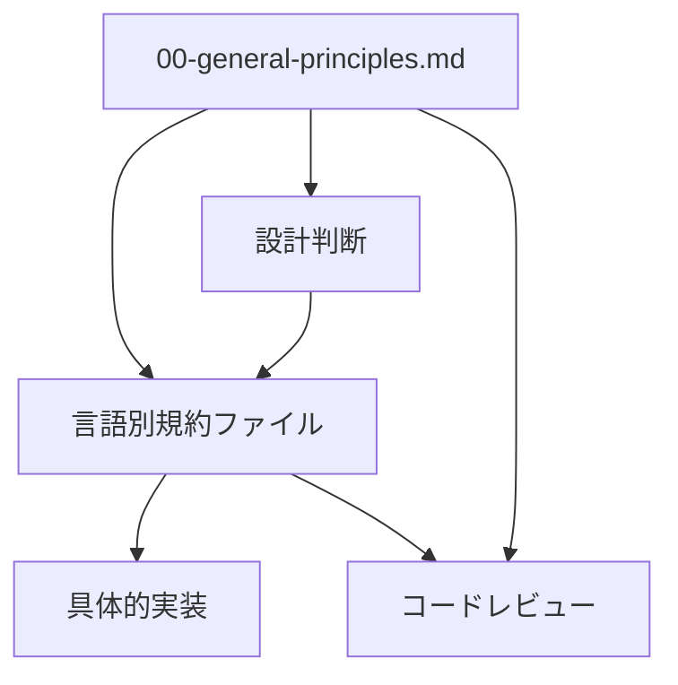

# コーディング規約 / Coding Standards

**最終更新日**: 2024-10-09  
**バージョン**: 1.0.0  
**対象**: 全開発チーム・自律型AI Devin  
**適用範囲**: 全プロジェクト共通開発規約

## 概要

このディレクトリは、組織全体で統一されたコーディング規約を定義し、高品質で保守性の高いコードの作成を支援します。特に自律型AI Devinが一貫した品質でコードを生成できるよう、明確で具体的なガイドラインを提供します。

## ディレクトリ構成

```
01-coding-standards/
├── README.md                           # このファイル
├── 00-general-principles.md             # 言語横断的な基本原則
├── typescript-javascript-standards.md  # TypeScript/JavaScript規約
├── python-standards.md                 # Python規約  
├── sql-standards.md                    # SQL規約
├── java-standards.md                   # Java規約
├── csharp-standards.md                 # C#規約
└── go-standards.md                     # Go規約
```

## ファイル構成の設計思想

### 🎯 AI最適化アーキテクチャ

本構成は**「言語別統合ファイル + 共通原則分離」戦略**を採用しています。これにより：

1. **AIの効率的な参照**: 1つの言語について1回の参照で完結
2. **一貫性の保証**: 共通原則により全言語で統一された品質
3. **保守性の向上**: 言語固有とプロジェクト横断の責任分離
4. **スケーラビリティ**: 新言語追加時の影響範囲を最小化

### 📋 各ファイルの役割と関係性

#### `00-general-principles.md` - 共通基盤
- **役割**: 全言語共通の抽象的原則・哲学・判断基準
- **内容**: SOLID原則、Clean Code、セキュリティ基本原則、エラーハンドリング原則
- **対象**: WHYの部分 - なぜそうすべきか
- **参照タイミング**: プロジェクト開始時、設計判断時

#### 言語別ファイル - 具体的実装
- **役割**: 各言語固有の具体的な実装方法・構文・ツール設定
- **内容**: コーディングスタイル、ライブラリ選択、設定ファイル例
- **対象**: HOWの部分 - どう実装するか
- **参照タイミング**: コード実装時、レビュー時

## 利用シーン別ガイド

### 🤖 Devin（自律型AI）の利用パターン

#### パターン1: 新規プロジェクト開始時
```
1. 00-general-principles.md を参照して設計方針を理解
2. 対象言語のファイル（例: typescript-javascript-standards.md）を参照
3. プロジェクト固有の要件と組み合わせてコード生成
```

#### パターン2: 既存コードの改善時
```
1. 該当言語のファイルを参照して現状コードを分析
2. 00-general-principles.md の原則に基づいて改善方針を決定
3. 具体的なリファクタリングを実行
```

#### パターン3: コードレビュー時
```
1. 該当言語のファイルのチェックリストを使用
2. 00-general-principles.md の原則への準拠を確認
3. フィードバックと改善提案を生成
```

### 👥 開発チームの利用パターン

#### 新規メンバーのオンボーディング
1. **基礎理解**: `00-general-principles.md`で組織の開発哲学を理解
2. **言語習得**: 担当言語の規約ファイルで具体的な書き方を学習
3. **実践練習**: サンプルコードでの練習とレビュー

#### 日常的な開発作業
1. **実装前**: 該当言語ファイルのベストプラクティス確認
2. **実装中**: コード例を参考にした実装
3. **実装後**: チェックリストを使用したセルフレビュー

#### コードレビュープロセス
1. **レビュー基準**: 言語別ファイルの規約への準拠確認
2. **品質判断**: 共通原則に基づく設計品質の評価
3. **改善提案**: 具体的な修正方法の提示

## ファイル間の依存関係と参照順序

### 基本的な参照フロー


### 優先順位と判断基準
1. **原則の衝突時**: `00-general-principles.md`の原則が優先
2. **言語固有の判断**: 該当言語ファイルの規定に従う
3. **未定義事項**: 共通原則に立ち返って判断

## 品質保証とメンテナンス

### 🔍 規約の一貫性チェック

各言語別ファイルは以下の統一構造を持ちます：

1. **概要とスコープ**: 対象技術・バージョン・適用範囲
2. **基本スタイル**: 命名規則・フォーマット・構造化
3. **言語固有ベストプラクティス**: パフォーマンス・セキュリティ・保守性
4. **ツール設定**: Linter・Formatter・テストフレームワーク
5. **コード例**: Good/Bad対比による具体例
6. **Devin実行ガイドライン**: AI向けの明確な指示とチェックリスト

### 📊 品質メトリクス

- **コード例の網羅性**: 主要パターンの90%以上をカバー
- **更新頻度**: 四半期に1回の見直し
- **フィードバック反映**: 開発チームからの改善提案を月次で検討

### 🔄 継続的改善プロセス

1. **定期レビュー**: 四半期ごとの規約見直し会議
2. **フィードバック収集**: 開発者・Devinの使用実績分析
3. **ベストプラクティス更新**: 業界標準の変化への対応
4. **教育・浸透**: 新しい規約の周知と教育

## 新言語追加時のガイドライン

### 📝 新言語規約ファイル作成手順

1. **テンプレート使用**: `typescript-javascript-standards.md`を参考テンプレートとして活用
2. **構造統一**: 既存ファイルと同じセクション構成を採用
3. **原則継承**: `00-general-principles.md`の原則を言語固有に翻訳
4. **レビュープロセス**: 最低2名の言語エキスパートによる査読

### 🎯 必須含有項目

- [ ] 対象言語・バージョン・フレームワークの明確化
- [ ] 基本的なコーディングスタイル（命名・フォーマット）
- [ ] セキュリティベストプラクティス
- [ ] パフォーマンス考慮事項
- [ ] テスト戦略とテストコード例
- [ ] 主要ライブラリ・フレームワークの使用方針
- [ ] Linter・Formatter設定例
- [ ] 豊富なコード例（Good/Bad対比）
- [ ] Devin向け実行指示とチェックリスト

## FAQ・よくある質問

### Q1: 既存コードが規約に準拠していない場合は？
**A**: 段階的な改善アプローチを推奨します。新規開発では厳密に適用し、既存コードは保守時に部分的に改善していきます。

### Q2: 規約とプロジェクト固有要件が競合する場合は？
**A**: プロジェクト固有要件を優先しますが、その判断理由を文書化し、将来の規約改善に活用します。

### Q3: Devinが規約に準拠しないコードを生成した場合は？
**A**: 該当する規約ファイルの記述を確認し、必要に応じて規約の明確化や例の追加を行います。

### Q4: 新しい技術・フレームワークを採用したい場合は？
**A**: まず`05-technology-stack/`の承認済み技術リストを確認し、新規技術の場合は技術評価プロセスを経てから規約に反映します。

## 関連リソース

### 📚 参照すべき他のドキュメント
- [`05-technology-stack/`](../05-technology-stack/) - 承認済み技術スタック
- [`06-architecture-guidelines/`](../06-architecture-guidelines/) - アーキテクチャ設計指針
- [`09-quality-assurance/`](../09-quality-assurance/) - 品質保証プロセス

### 🔗 外部リファレンス
- [Clean Code principles](https://clean-code-developer.com/)
- [SOLID principles](https://en.wikipedia.org/wiki/SOLID)
- [Security by Design](https://owasp.org/www-project-devsecops-guideline/)

### 🛠️ 推奨ツール
- **統合開発環境**: VS Code + 言語別拡張機能
- **静的解析**: ESLint, PyLint, SonarQube
- **フォーマッター**: Prettier, Black, gofmt
- **テストフレームワーク**: Jest, pytest, JUnit

---

## 貢献・フィードバック

このコーディング規約の改善にご協力ください：

1. **Issues**: 問題や改善提案をGitHub Issuesで報告
2. **Pull Requests**: 具体的な改善案をプルリクエストで提出
3. **フィードバック**: 実際の使用体験や効果測定結果を共有

**連絡先**: development-standards@company.com

---

**© 2024 組織名. All rights reserved.**  
**License**: Internal use only - 組織内限定使用