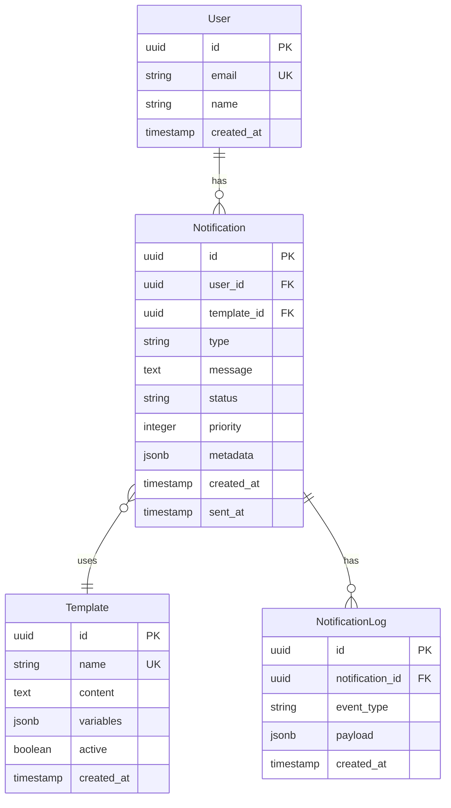

# 設計フェーズ成果物ガイド / Design Phase Deliverables Guide

## 📋 目次

1. [概要](#概要)
2. [設計フェーズの位置づけ](#設計フェーズの位置づけ)
3. [成果物一覧](#成果物一覧)
4. [成果物の詳細](#成果物の詳細)
5. [成果物の作成フロー](#成果物の作成フロー)
6. [品質基準](#品質基準)
7. [レビュープロセス](#レビュープロセス)
8. [ベストプラクティス](#ベストプラクティス)

---

## 概要

### 目的

このドキュメントは、設計フェーズで作成される各種成果物を明確化し、品質の高い設計ドキュメントを効率的に作成するためのガイドラインを提供します。

### 適用範囲

- 新規プロジェクト・機能開発の設計フェーズ
- 既存システムの大規模リファクタリング
- アーキテクチャ変更を伴う改修
- 技術選定が必要なプロジェクト

### 設計フェーズの重要性

```yaml
why_design_phase_matters:
  early_problem_detection:
    - 実装前に問題を発見・解決
    - 手戻りコストの削減
    - リスクの早期識別
  
  stakeholder_alignment:
    - 関係者間の認識統一
    - 技術的意思決定の透明性
    - 実装方針の合意形成
  
  knowledge_sharing:
    - 設計思想の共有
    - チーム全体の理解促進
    - 新メンバーのオンボーディング支援
  
  quality_assurance:
    - アーキテクチャの妥当性確認
    - セキュリティ・パフォーマンス考慮
    - 保守性・拡張性の確保
```

---

## 設計フェーズの位置づけ

### 開発ライフサイクルにおける位置

```
開発ライフサイクル:

Phase 1: 発見・計画 (Discovery & Planning)
  │
  ├─ 要件収集
  ├─ ユーザーリサーチ
  ├─ 実現可能性評価
  └─ プロジェクト計画
  │
  ▼
Phase 2: 設計 (Design) ★ このフェーズ
  │
  ├─ アーキテクチャ設計
  ├─ 技術選定
  ├─ 詳細設計
  ├─ レビュー・承認
  └─ 【成果物出力】← このドキュメントで整理
  │
  ▼
Phase 3: 開発 (Development)
  │
  ├─ 実装
  ├─ ユニットテスト
  └─ コードレビュー
  │
  ▼
Phase 4: QA・検証 (QA & Validation)
Phase 5: デプロイメント (Deployment)
Phase 6: 運用・監視 (Operations)
```

### 設計フェーズのインプット・アウトプット

```yaml
inputs:
  from_discovery_phase:
    - プロジェクト提案書
    - ビジネス要件
    - ユーザーストーリー
    - 技術調査結果
    - リスク評価
  
  from_stakeholders:
    - 機能要件
    - 非機能要件
    - 制約条件
    - 予算・スケジュール

outputs:
  design_documents:
    - 技術提案書 (Technical Proposal)
    - 設計書 (Design Document)
    - API仕様書 (API Specification)
    - ADR (Architecture Decision Record)
  
  to_development_phase:
    - 実装可能な設計仕様
    - 技術的意思決定の記録
    - 実装ガイドライン
    - テスト方針
```

---

## 成果物一覧

### 必須成果物 (Mandatory Deliverables)

| # | 成果物名 | テンプレート | 作成タイミング | 目的 |
|---|---------|------------|--------------|------|
| 1 | **技術提案書** | `technical-proposal-template.md` | プロジェクト初期 | 技術的アプローチの提案と承認取得 |
| 2 | **設計書** | `design-document-template.md` | 設計フェーズ | 詳細な技術設計の文書化 |
| 3 | **ADR** | `adr-template.md` | 重要な技術決定時 | アーキテクチャ決定の記録と理由 |

### 推奨成果物 (Recommended Deliverables)

| # | 成果物名 | テンプレート | 作成タイミング | 目的 |
|---|---------|------------|--------------|------|
| 4 | **API仕様書** | `api-specification-template.md` | API設計時 | API契約の明確化 |
| 5 | **APIドキュメント** | `api-documentation-template.md` | API実装後 | API利用者向けドキュメント |
| 6 | **設計レビュー記録** | `design-review-template.md` | レビュー実施時 | レビュー結果の記録 |

### 条件付き成果物 (Conditional Deliverables)

| # | 成果物名 | 作成条件 | 目的 |
|---|---------|---------|------|
| 7 | **データベーススキーマ設計書** | データモデル変更時 | スキーマ定義の明確化 |
| 8 | **セキュリティ評価書** | セキュリティ要件が高い場合 | セキュリティ対策の文書化 |
| 9 | **パフォーマンステスト計画** | 性能要件がクリティカル | パフォーマンス目標と検証方法 |
| 10 | **マイグレーション計画書** | 既存システムの移行時 | 安全な移行戦略の定義 |

---

## 成果物の詳細

### 1. 技術提案書 (Technical Proposal)

#### 概要
プロジェクトの技術的アプローチを提案し、関係者の承認を得るための包括的なドキュメント。

#### 主要セクション
```yaml
sections:
  executive_summary:
    - 提案の要約
    - 解決する問題
    - 期待される成果
  
  problem_definition:
    - 現状の課題
    - ビジネスへの影響
    - 技術的背景
  
  proposed_solution:
    - ソリューション概要
    - アーキテクチャ図
    - 技術スタック
  
  implementation_plan:
    - フェーズ分け
    - リソース配分
    - タイムライン
  
  cost_and_roi:
    - 初期コスト
    - 運用コスト
    - 投資対効果
  
  risk_and_mitigation:
    - リスク評価
    - 緩和策
  
  alternatives:
    - 代替案の比較
    - 推奨理由
```

#### 作成タイミング
- プロジェクト開始時（要件定義後）
- 新技術導入時
- アーキテクチャ変更時

#### ステークホルダー
- **作成者**: テックリード、アーキテクト
- **レビュアー**: エンジニアリングチーム、プロダクトマネージャー
- **承認者**: CTO、エンジニアリングマネージャー

#### 成功基準
- [ ] ビジネス価値が明確に示されている
- [ ] 技術的実現可能性が検証されている
- [ ] コストとROIが定量的に示されている
- [ ] リスクと緩和策が網羅されている
- [ ] 代替案との比較が適切に行われている
- [ ] ステークホルダーの承認を得ている

---

### 2. 設計書 (Design Document)

#### 概要
システムやモジュールの詳細な技術設計を記述するドキュメント。実装チームが直接参照する技術仕様書。

#### 主要セクション
```yaml
sections:
  overview:
    - 背景とモチベーション
    - 目標と非目標
    - スコープ
  
  architecture:
    - システム全体構成
    - コンポーネント設計
    - データフロー
    - 技術スタック
  
  detailed_design:
    - 各機能の詳細設計
    - 処理フロー
    - 実装詳細（疑似コード）
  
  data_model:
    - データベーススキーマ
    - ER図
    - マイグレーション戦略
  
  interface_design:
    - API仕様
    - 外部システム連携
  
  non_functional_requirements:
    - セキュリティ設計
    - パフォーマンス設計
    - スケーラビリティ
    - エラーハンドリング
  
  testing_strategy:
    - テストレベル
    - カバレッジ目標
  
  deployment:
    - デプロイメント戦略
    - 環境構成
    - リリース手順
  
  monitoring:
    - 監視項目
    - ログ設計
    - アラート設定
```

#### 作成タイミング
- 技術提案書承認後
- 実装開始前
- 大規模リファクタリング時

#### ステークホルダー
- **作成者**: リードエンジニア、担当エンジニア
- **レビュアー**: テックリード、アーキテクト、セキュリティチーム
- **利用者**: 実装チーム全員

#### 成功基準
- [ ] アーキテクチャが明確に図示されている
- [ ] 実装に必要な情報が網羅されている
- [ ] データモデルが適切に設計されている
- [ ] セキュリティ要件が考慮されている
- [ ] パフォーマンス目標が設定されている
- [ ] テスト戦略が明確である
- [ ] デプロイメント手順が定義されている

---

### 3. ADR (Architecture Decision Record)

#### 概要
重要なアーキテクチャ決定とその理由を記録するドキュメント。「なぜその選択をしたか」を明確に残す。

#### 主要セクション
```yaml
sections:
  metadata:
    - ADR番号
    - タイトル
    - ステータス (Proposed/Accepted/Superseded/Deprecated)
    - 日付
    - 決定者
  
  context:
    - 背景
    - 問題定義
    - 制約条件
    - 影響を受けるステークホルダー
  
  decision:
    - 選択した解決策
    - 実装アプローチ
    - 技術仕様
  
  rationale:
    - 決定理由
    - なぜこの選択肢か
    - トレードオフの考慮
  
  alternatives:
    - 検討した代替案
    - 各案のメリット・デメリット
    - 不採用の理由
  
  consequences:
    - ポジティブな影響
    - ネガティブな影響
    - リスク
  
  implementation:
    - 実装計画
    - 影響範囲
    - マイグレーション戦略
```

#### 作成タイミング
```yaml
when_to_create_adr:
  technology_selection:
    - 新しいフレームワーク・ライブラリの採用
    - データベースの選定
    - クラウドプロバイダーの選択
  
  architecture_changes:
    - マイクロサービス化
    - API設計方針の変更
    - データ構造の大幅変更
  
  significant_patterns:
    - 認証・認可方式の決定
    - キャッシング戦略
    - エラーハンドリング方針
  
  trade_offs:
    - パフォーマンスvs複雑性
    - コストvs機能性
    - 短期vs長期の戦略
```

#### ステークホルダー
- **作成者**: アーキテクト、テックリード
- **レビュアー**: エンジニアリングチーム、CTO
- **利用者**: 全エンジニア、新メンバー

#### 成功基準
- [ ] 決定の背景が明確に説明されている
- [ ] 代替案が適切に検討されている
- [ ] 決定理由が論理的に説明されている
- [ ] トレードオフが明示されている
- [ ] 影響範囲が明確である
- [ ] 将来の参照に耐える内容である

---

### 4. API仕様書 (API Specification)

#### 概要
APIのエンドポイント、リクエスト・レスポンス形式、認証方法などを定義する技術仕様書。

#### 主要セクション
```yaml
sections:
  overview:
    - API概要
    - ベースURL
    - バージョニング戦略
    - 認証方式
  
  endpoints:
    - HTTPメソッド
    - パス
    - パラメータ（パス、クエリ、ボディ）
    - リクエスト例
    - レスポンス例
    - ステータスコード
    - エラーレスポンス
  
  data_models:
    - リクエスト・レスポンスのスキーマ
    - データ型定義
    - バリデーションルール
  
  authentication:
    - 認証方式（JWT、OAuth2等）
    - トークン取得方法
    - トークンのライフサイクル
  
  error_handling:
    - エラーコード一覧
    - エラーメッセージフォーマット
    - エラーハンドリング方針
  
  rate_limiting:
    - レート制限の仕様
    - クォータ
  
  examples:
    - 一般的なユースケース
    - コードサンプル
```

#### フォーマット
- **推奨**: OpenAPI (Swagger) 3.0
- **代替**: Markdown形式

#### 作成タイミング
- API設計完了時
- 実装開始前
- API変更時（バージョンアップ）

#### ステークホルダー
- **作成者**: APIエンジニア
- **レビュアー**: テックリード、フロントエンドチーム
- **利用者**: API利用者（内部・外部）

#### 成功基準
- [ ] すべてのエンドポイントが文書化されている
- [ ] リクエスト・レスポンスの例が提供されている
- [ ] 認証方法が明確に説明されている
- [ ] エラーハンドリングが定義されている
- [ ] バージョニング戦略が明確である
- [ ] 実装前にレビュー・承認されている

---

### 5. 設計レビュー記録 (Design Review)

#### 概要
設計レビュー会議の結果を記録し、フィードバックとアクションアイテムを管理するドキュメント。

#### 主要セクション
```yaml
sections:
  review_info:
    - レビューID
    - 日時
    - 参加者
    - レビュー対象
  
  objectives:
    - レビューの目的
    - レビュー範囲
  
  design_summary:
    - 設計の概要
    - 主要なアーキテクチャ決定
  
  review_checklist:
    - アーキテクチャ
    - セキュリティ
    - パフォーマンス
    - テスト
    - 運用
    - コスト
  
  comments:
    - レビュアーごとのコメント
    - 指摘事項
    - 改善提案
  
  action_items:
    - 対応が必要な項目
    - 担当者
    - 期限
  
  outcome:
    - 承認/条件付き承認/要修正/却下
    - サマリー
    - 次のステップ
```

#### 作成タイミング
- 設計レビュー会議の実施時
- 重要なマイルストーンでのレビュー

#### ステークホルダー
- **作成者**: レビュー主催者、テックリード
- **参加者**: レビュアー全員
- **利用者**: プロジェクトチーム全員

#### 成功基準
- [ ] レビュー結果が明確に記録されている
- [ ] すべてのフィードバックが文書化されている
- [ ] アクションアイテムに担当者と期限が設定されている
- [ ] 承認/却下の理由が明確である
- [ ] フォローアップ計画が策定されている

---

### 比較の基本原則

```yaml
phase_2a:
  name: "事前設計 (Pre-Implementation Design)"
  timing: "Phase 1の後、Phase 3の前"
  execution_order: "Phase 2A → Phase 3 → Phase 4 → Phase 5"
  purpose: "実装の方向性を定める"
  detail_level: "30-40%"
  focus: "技術決定、制約条件、基本契約"
  audience: "実装チーム"
  creation_time: "1-2日"
  characteristics:
    - 実装前に作成される
    - 実装チームが開始できる最小限の情報
    - 確定情報のみ記載（推測は含まない）
    - 簡潔・迅速な作成を重視
  
phase_2b:
  name: "詳細設計 (Post-Implementation Design)"
  timing: "Phase 4の後（またはPhase 3-4と並行）"
  execution_order: "Phase 2A → Phase 3 → Phase 4 → Phase 5"
  purpose: "運用・保守のための完全ドキュメント"
  detail_level: "100%"
  focus: "実装内容の完全な記録"
  audience: "全ステークホルダー（新メンバー、運用チーム等）"
  creation_time: "2-3日"
  characteristics:
    - 実装完了後に作成（または実装と並行）
    - 実装された内容を正確に反映
    - 新メンバーのオンボーディングに使える
    - 運用チームが必要な情報を含む
```

**重要**: Phase 5は番号が「2」だが、実際の実行順序はPhase 4の後です。

---

## 成果物別の詳細比較

### 1. アーキテクチャ図

#### Phase 2A: アーキテクチャ概要図

**目的**: 実装方針の合意  
**詳細度**: 30-40%  
**作成時間**: 1-2時間  
**形式**: 手書きスケッチ可、Mermaid等の簡易ツール推奨

**含む内容**:
- ✅ システムコンテキスト図（C4モデル Level 1）
  - 主要な外部システムとの関係（3-5個）
  - データの流れ（概要レベル）
  
- ✅ 簡易コンポーネント図
  - 主要コンポーネント3-5個のみ
  - コンポーネント間の依存関係（矢印で表現）
  - 使用する主要技術スタック（言語、DB、キャッシュ）

**含まない内容**:
- ❌ 詳細なクラス図
- ❌ シーケンス図
- ❌ デプロイメント図
- ❌ データフロー詳細
- ❌ 内部実装の詳細

**サンプル**:
```
┌─────────────┐
│  User       │
│  Service    │  (外部サービス)
└──────┬──────┘
       │ REST API
   ┌───▼────┐
   │  API   │
   │Gateway │  (既存)
   └───┬────┘
       │ gRPC
   ┌───▼────────────┐
   │  Notification  │  ← 今回開発
   │  Service       │  (FastAPI + Python)
   │  (New)         │
   └───┬────────────┘
       │            │
   ┌───▼────┐   ┌──▼───┐
   │  DB    │   │Redis │  (既存)
   │(Postgres)  │(Cache)
   └────────┘   └──────┘
```

**チェックリスト**:
- [ ] 主要コンポーネントが図示されている
- [ ] 外部システムとの境界が明確
- [ ] 技術スタックが記載されている
- [ ] 実装チームが開始できる情報がある

**ページ数**: 1ページ（図1-2個 + 簡単な説明）  
**図の数**: 2-3図

---

#### Phase 5: アーキテクチャ完全版

**目的**: 完全なシステム理解と運用支援  
**詳細度**: 100%  
**作成時間**: 4-6時間  
**形式**: 専用ツール（PlantUML, Lucidchart等）推奨

**含む内容**:
- ✅ C4モデル完全版
  - Level 1: システムコンテキスト図（全外部システム）
  - Level 2: コンテナ図（詳細な技術構成）
  - Level 3: コンポーネント図（全コンポーネント15-20個）
  - Level 4: クラス図（主要クラスの関係）
  
- ✅ シーケンス図（3-5個）
  - 通知送信フロー（正常系）
  - 認証フロー
  - エラーハンドリングフロー
  - リトライロジック
  
- ✅ デプロイメント図
  - Kubernetes構成（Pod, Service, Ingress）
  - ネットワーク構成（VPC, Subnet, Security Group）
  - スケーリング戦略（HPA設定）
  
- ✅ データフロー図
  - リクエストの完全な流れ
  - データの永続化フロー
  - キャッシュの更新フロー

**サンプル** (Level 3コンポーネント図):
```
┌───────────────────────────────────────────────────────┐
│  Notification Service (Container)                     │
├───────────────────────────────────────────────────────┤
│                                                        │
│  ┌─────────────┐         ┌──────────────────┐        │
│  │ API Layer   │────────>│ Service Layer    │        │
│  │ (FastAPI)   │         │ (Business Logic) │        │
│  │             │         │                  │        │
│  │ - Routes    │         │ - Validation     │        │
│  │ - Middleware│         │ - Orchestration  │        │
│  │ - Auth      │         │ - Error Handling │        │
│  └──────┬──────┘         └─────────┬────────┘        │
│         │                          │                  │
│         │                 ┌────────▼──────────┐       │
│         │                 │ Repository Layer  │       │
│         │                 │ (Data Access)     │       │
│         │                 │                   │       │
│         │                 │ - NotificationRepo│       │
│         │                 │ - UserRepo        │       │
│         │                 │ - TemplateRepo    │       │
│         │                 └─────────┬─────────┘       │
│         │                           │                  │
│  ┌──────▼──────┐         ┌─────────▼─────────┐       │
│  │Auth         │         │ DB Connection     │       │
│  │Middleware   │         │ Pool (SQLAlchemy) │       │
│  │(JWT Verify) │         └───────────────────┘       │
│  └─────────────┘                                      │
│                                                        │
│  ┌──────────────┐        ┌──────────────────┐        │
│  │Cache Manager │        │ Queue Manager    │        │
│  │(Redis Client)│        │(Celery/RabbitMQ) │        │
│  └──────────────┘        └──────────────────┘        │
│                                                        │
└────────────────────────────────────────────────────────┘
```

**チェックリスト**:
- [ ] C4モデルのLevel 1-4が完成している
- [ ] 主要な処理フローのシーケンス図がある
- [ ] デプロイメント構成が詳細に記載されている
- [ ] 新メンバーがシステムを理解できる
- [ ] 運用チームが監視・トラブルシューティングできる

**ページ数**: 8-12ページ（図のみ）  
**図の数**: 6-10図

---

#### 比較サマリー: アーキテクチャ図

| 項目 | Phase 2A | Phase 5 | 違い |
|------|----------|---------|------|
| **目的** | 実装方針合意 | 完全ドキュメント化 | 目的が異なる |
| **詳細度** | 30-40% | 100% | Phase 5は2.5倍詳細 |
| **図の数** | 2-3図 | 6-10図 | Phase 5は3-4倍多い |
| **C4レベル** | Level 1-2 | Level 1-4 | Phase 5は全レベル |
| **シーケンス図** | なし | あり（3-5図） | Phase 5で追加 |
| **デプロイ図** | なし | あり | Phase 5で追加 |
| **作成時間** | 1-2時間 | 4-6時間 | Phase 5は3-4倍 |
| **更新頻度** | 低（確定後変更少） | 中（実装に合わせて更新） | Phase 5は変更追従 |
| **作成タイミング** | 実装前 | 実装後または並行 | タイミングが異なる |
| **形式** | 手書き可 | 専用ツール推奨 | Phase 5はフォーマル |

---

### 2. API仕様書

#### Phase 2A: API契約書（基本版）

**目的**: チーム間の基本契約  
**詳細度**: 40-50%  
**作成時間**: 2-3時間  
**フォーマット**: Markdown（シンプル）  
**対象API**: 主要エンドポイントのみ（3-5個）

**含む内容**:
- ✅ 主要エンドポイント一覧（3-5個）
- ✅ 基本的なリクエスト/レスポンス構造
  ```json
  POST /api/v1/notifications
  Input: { user_id, type, message }
  Output: { notification_id, status }
  ```
- ✅ 認証方式（概要レベル）
  - "JWT Bearer Token認証を使用"
- ✅ レート制限（数値のみ）
  - "100 req/min per user"
- ✅ 主要エラーコード（3-5個）
  - 400, 401, 429, 500

**含まない内容**:
- ❌ 全エンドポイントの詳細（管理API等は省略可）
- ❌ 全フィールドの型定義・バリデーションルール
- ❌ 詳細なエラーコードカタログ
- ❌ 使用例（curl, Python等のサンプルコード）
- ❌ OpenAPI/Swagger形式
- ❌ モックサーバー

**サンプル**:
```markdown
# Notification Service API Contract

## 概要
通知サービスのAPI契約書（Phase 2A版）

## ベースURL
`https://api.example.com/notification-service`

## 認証
JWT Bearer Token認証

## レート制限
- 100 req/min per user
- 1000 req/min per service

---

## エンドポイント

### POST /api/v1/notifications

通知送信API

**リクエスト**:
```json
{
  "user_id": "UUID (必須)",
  "type": "string (必須) - email|push|sms",
  "message": "string (必須)",
  "priority": "string (オプション) - high|normal|low"
}
```

**レスポンス** (201):
```json
{
  "notification_id": "UUID",
  "status": "string - queued|sent"
}
```

**エラー**:
- 400: バリデーションエラー
- 401: 認証エラー
- 429: レート制限超過
- 500: サーバーエラー

---

### GET /api/v1/notifications/{notification_id}

通知取得API

**レスポンス** (200):
```json
{
  "notification_id": "UUID",
  "user_id": "UUID",
  "type": "string",
  "message": "string",
  "status": "string - queued|sent|failed",
  "created_at": "timestamp"
}
```

**エラー**:
- 404: 通知が見つからない
```

**チェックリスト**:
- [ ] 主要エンドポイント（3-5個）が記載されている
- [ ] リクエスト/レスポンスの基本構造が明確
- [ ] 認証方式が記載されている
- [ ] 主要エラーコードが記載されている
- [ ] 他チームが依存するAPIが契約されている

**ページ数**: 3-5ページ  
**エンドポイント数**: 3-5個

---

#### Phase 5: API仕様書（完全版）

**目的**: 完全なAPI仕様とクライアント実装支援  
**詳細度**: 100%  
**作成時間**: 4-6時間  
**フォーマット**: OpenAPI 3.0 (Swagger) + Markdown  
**対象API**: 全エンドポイント（10-20個）

**含む内容**:
- ✅ 全エンドポイント詳細（10-20個）
  - 管理API、内部API含む
  
- ✅ 詳細なリクエスト/レスポンススキーマ
  ```yaml
  properties:
    user_id:
      type: string
      format: uuid
      description: ユーザーID
      example: "123e4567-e89b-12d3-a456-426614174000"
  ```
  
- ✅ 認証詳細
  - JWT形式、クレーム、有効期限
  - APIキー発行方法
  - 権限モデル（RBAC）
  
- ✅ バリデーションルール
  - 必須/オプション
  - 型、フォーマット、範囲
  - 正規表現
  
- ✅ 詳細なエラーコードカタログ（20-30個）
  - エラーコード一覧
  - エラーレスポンス形式
  - トラブルシューティングガイド
  
- ✅ 使用例
  - curl コマンド
  - Python サンプルコード
  - JavaScript サンプルコード
  
- ✅ OpenAPI 3.0仕様
  - YAML形式
  - Swagger UI生成可能
  - コード生成可能

**サンプル**:
```yaml
openapi: 3.0.0
info:
  title: Notification Service API
  version: 1.0.0
  description: 通知サービスの完全なAPI仕様

servers:
  - url: https://api.example.com/notification-service
    description: Production

security:
  - bearerAuth: []

paths:
  /api/v1/notifications:
    post:
      summary: 通知送信
      description: |
        ユーザーに通知を送信します。
        通知はキューに追加され、非同期で処理されます。
      
      requestBody:
        required: true
        content:
          application/json:
            schema:
              type: object
              required:
                - user_id
                - type
                - message
              properties:
                user_id:
                  type: string
                  format: uuid
                  description: 通知を送信するユーザーのID
                  example: "123e4567-e89b-12d3-a456-426614174000"
                type:
                  type: string
                  enum: [email, push, sms]
                  description: 通知タイプ
                  example: "email"
                message:
                  type: string
                  minLength: 1
                  maxLength: 1000
                  description: 通知メッセージ
                  example: "Your order has been shipped"
                priority:
                  type: string
                  enum: [high, normal, low]
                  default: normal
                  description: 通知の優先度
                metadata:
                  type: object
                  description: 追加メタデータ
                  additionalProperties: true
      
      responses:
        '201':
          description: 通知が正常に作成されました
          content:
            application/json:
              schema:
                type: object
                properties:
                  notification_id:
                    type: string
                    format: uuid
                  status:
                    type: string
                    enum: [queued, sent]
                  created_at:
                    type: string
                    format: date-time
              example:
                notification_id: "456e7890-e89b-12d3-a456-426614174000"
                status: "queued"
                created_at: "2025-11-20T10:30:00Z"
        
        '400':
          description: バリデーションエラー
          content:
            application/json:
              schema:
                $ref: '#/components/schemas/Error'
              example:
                error_code: "VALIDATION_ERROR"
                message: "user_id is required"
                details:
                  field: "user_id"
                  reason: "missing_field"
        
        '401':
          description: 認証エラー
          content:
            application/json:
              schema:
                $ref: '#/components/schemas/Error'
        
        '429':
          description: レート制限超過
          content:
            application/json:
              schema:
                $ref: '#/components/schemas/Error'
              example:
                error_code: "RATE_LIMIT_EXCEEDED"
                message: "Rate limit exceeded: 100 requests per minute"
                retry_after: 60

components:
  securitySchemes:
    bearerAuth:
      type: http
      scheme: bearer
      bearerFormat: JWT
  
  schemas:
    Error:
      type: object
      properties:
        error_code:
          type: string
        message:
          type: string
        details:
          type: object
```

**使用例セクション**:
```markdown
## 使用例

### curl

```bash
curl -X POST https://api.example.com/notification-service/api/v1/notifications \
  -H "Authorization: Bearer YOUR_JWT_TOKEN" \
  -H "Content-Type: application/json" \
  -d '{
    "user_id": "123e4567-e89b-12d3-a456-426614174000",
    "type": "email",
    "message": "Your order has been shipped"
  }'
```

### Python

```python
import requests

url = "https://api.example.com/notification-service/api/v1/notifications"
headers = {
    "Authorization": "Bearer YOUR_JWT_TOKEN",
    "Content-Type": "application/json"
}
data = {
    "user_id": "123e4567-e89b-12d3-a456-426614174000",
    "type": "email",
    "message": "Your order has been shipped"
}

response = requests.post(url, headers=headers, json=data)
print(response.json())
```

### JavaScript (Axios)

```javascript
const axios = require('axios');

const response = await axios.post(
  'https://api.example.com/notification-service/api/v1/notifications',
  {
    user_id: '123e4567-e89b-12d3-a456-426614174000',
    type: 'email',
    message: 'Your order has been shipped'
  },
  {
    headers: {
      'Authorization': 'Bearer YOUR_JWT_TOKEN',
      'Content-Type': 'application/json'
    }
  }
);

console.log(response.data);
```
```

**チェックリスト**:
- [ ] 全エンドポイントが記載されている
- [ ] OpenAPI 3.0形式で記載されている
- [ ] 全フィールドの型・バリデーションが明確
- [ ] エラーコードカタログが完全
- [ ] 使用例（curl, Python等）が含まれている
- [ ] Swagger UIで表示できる
- [ ] クライアントライブラリを生成できる

**ページ数**: 15-25ページ  
**エンドポイント数**: 10-20個

---

#### 比較サマリー: API仕様書

| 項目 | Phase 2A | Phase 5 | 違い |
|------|----------|---------|------|
| **目的** | チーム間契約 | 完全API仕様 | 目的が異なる |
| **詳細度** | 40-50% | 100% | Phase 5は2倍詳細 |
| **エンドポイント数** | 3-5個 | 10-20個 | Phase 5は3-4倍多い |
| **フォーマット** | Markdown | OpenAPI 3.0 | Phase 5は標準形式 |
| **バリデーション** | 概要のみ | 詳細（正規表現含む） | Phase 5は完全 |
| **エラーコード** | 主要3-5個 | 全20-30個 | Phase 5は完全 |
| **使用例** | なし | あり（curl, Python等） | Phase 5で追加 |
| **作成時間** | 2-3時間 | 4-6時間 | Phase 5は2倍 |
| **コード生成** | 不可 | 可能 | Phase 5のみ可能 |
| **作成タイミング** | 実装前 | 実装後または並行 | タイミングが異なる |

---

### 3. 設計書

#### Phase 2A: 設計書は作成しない

Phase 2Aでは設計書は作成しません。代わりに以下を作成します：

1. **ADR (Architecture Decision Record)** - 技術決定の記録
2. **API契約書** - チーム間の契約
3. **制約条件文書** - 非機能要件

**理由**:
- 実装前は詳細が確定していない
- 推測で書くと手戻りが発生
- 最小限の情報で実装開始を優先

---

#### Phase 5: 設計書（完全版）

**目的**: システムの完全な設計記録  
**詳細度**: 100%  
**作成時間**: 8-12時間  
**フォーマット**: Markdown（テンプレート使用）

**含む内容**:

1. **システム概要** (1-2ページ)
   - プロジェクト背景
   - 目的・目標
   - スコープ

2. **アーキテクチャ設計** (3-5ページ)
   - システム構成図（C4モデル）
   - 技術スタック
   - アーキテクチャパターン（Clean Architecture等）
   - コンポーネント設計

3. **API設計** (2-3ページ)
   - エンドポイント一覧
   - 認証・認可
   - エラーハンドリング
   - API仕様書へのリンク

4. **データモデル設計** (2-3ページ)
   - ER図
   - テーブル定義
   - インデックス戦略
   - マイグレーション戦略

5. **詳細設計** (4-6ページ)
   - 主要クラス設計
   - シーケンス図
   - 状態遷移図
   - アルゴリズム説明

6. **非機能要件** (2-3ページ)
   - パフォーマンス要件
   - セキュリティ要件
   - スケーラビリティ
   - 監視・ログ戦略

7. **運用設計** (2-3ページ)
   - デプロイメント戦略
   - スケーリング戦略
   - バックアップ・リカバリ
   - 監視・アラート

8. **テスト戦略** (1-2ページ)
   - ユニットテスト
   - 統合テスト
   - E2Eテスト
   - パフォーマンステスト

9. **技術的負債** (1ページ)
   - 既知の制約
   - 今後の改善点

10. **参考資料** (1ページ)
    - ADRへのリンク
    - API仕様書へのリンク
    - 外部ドキュメントへのリンク

**チェックリスト**:
- [ ] 全セクションが完成している
- [ ] 実装内容と一致している
- [ ] 図が適切に配置されている
- [ ] 新メンバーが理解できる
- [ ] 運用チームが必要な情報を得られる
- [ ] 技術的負債が明記されている

**ページ数**: 20-30ページ

---

#### 比較サマリー: 設計書

| 項目 | Phase 2A | Phase 5 | 違い |
|------|----------|---------|------|
| **作成の有無** | 作成しない | 作成する | Phase 2Aでは不要 |
| **代替成果物** | ADR, API契約, 制約条件 | 設計書（完全版） | 別の成果物 |
| **詳細度** | - | 100% | - |
| **ページ数** | - | 20-30ページ | - |
| **作成時間** | - | 8-12時間 | - |
| **目的** | 実装開始の最小情報 | 完全なシステム記録 | 目的が異なる |

---

### 4. データモデル文書

#### Phase 2A: データモデル概要（簡易版）

**目的**: 主要エンティティの把握  
**詳細度**: 30-40%  
**作成時間**: 1時間  
**フォーマット**: 手書きメモ可、簡易図

**含む内容**:
- ✅ 主要エンティティ一覧（3-5個）
  ```
  - User
  - Notification
  - Template
  ```
  
- ✅ エンティティ間の関係（概要）
  ```
  User 1 --- N Notification
  Notification N --- 1 Template
  ```
  
- ✅ 主要フィールド（各エンティティ3-5個）
  ```
  Notification:
    - id (UUID)
    - user_id (UUID)
    - type (string)
    - message (string)
    - status (string)
  ```

**含まない内容**:
- ❌ 全フィールドの詳細
- ❌ 型、制約、インデックス
- ❌ ER図（完全版）
- ❌ マイグレーションスクリプト

**サンプル**:
```
主要エンティティ:

1. User (既存)
   - id, email, name

2. Notification (新規)
   - id, user_id, type, message, status, created_at

3. Template (新規)
   - id, name, content, variables

関係:
User 1 --- N Notification
Notification N --- 1 Template
```

**チェックリスト**:
- [ ] 主要エンティティ（3-5個）が列挙されている
- [ ] エンティティ間の関係が明確
- [ ] 主要フィールドが記載されている

**ページ数**: 1ページ

---

#### Phase 5: データモデル文書（完全版）

**目的**: データベース設計の完全記録  
**詳細度**: 100%  
**作成時間**: 4-6時間  
**フォーマット**: ER図ツール（dbdiagram.io, dbdocs等）+ Markdown

**含む内容**:

1. **ER図（完全版）**
   - 全エンティティ（10-20個）
   - 全リレーション
   - カーディナリティ
   
2. **テーブル定義**
   - 全フィールド
   - 型、制約（NOT NULL, UNIQUE等）
   - デフォルト値
   - 説明
   
3. **インデックス定義**
   - 主キー
   - 外部キー
   - 複合インデックス
   - パフォーマンス考慮
   
4. **マイグレーション戦略**
   - 初期スキーマ
   - 変更履歴
   - ロールバック戦略
   
5. **データ整合性**
   - 外部キー制約
   - チェック制約
   - トリガー
   
6. **パフォーマンス考慮**
   - パーティショニング
   - シャーディング（将来）
   - クエリ最適化

**サンプル**:
```markdown
# データモデル設計書

## ER図



## テーブル定義

### notifications

| カラム | 型 | 制約 | デフォルト | 説明 |
|--------|-----|------|-----------|------|
| id | UUID | PK, NOT NULL | gen_random_uuid() | 通知ID |
| user_id | UUID | FK, NOT NULL | - | ユーザーID |
| template_id | UUID | FK, NULL | - | テンプレートID |
| type | VARCHAR(20) | NOT NULL, CHECK | - | email/push/sms |
| message | TEXT | NOT NULL | - | 通知メッセージ |
| status | VARCHAR(20) | NOT NULL | 'queued' | queued/sent/failed |
| priority | INTEGER | NOT NULL | 1 | 1(low) - 3(high) |
| metadata | JSONB | NULL | '{}' | 追加メタデータ |
| created_at | TIMESTAMPTZ | NOT NULL | now() | 作成日時 |
| sent_at | TIMESTAMPTZ | NULL | - | 送信日時 |

**インデックス**:
```sql
CREATE INDEX idx_notifications_user_id ON notifications(user_id);
CREATE INDEX idx_notifications_status ON notifications(status);
CREATE INDEX idx_notifications_created_at ON notifications(created_at DESC);
CREATE INDEX idx_notifications_user_status ON notifications(user_id, status);
```

**制約**:
```sql
ALTER TABLE notifications
  ADD CONSTRAINT fk_notifications_user_id
  FOREIGN KEY (user_id) REFERENCES users(id) ON DELETE CASCADE;

ALTER TABLE notifications
  ADD CONSTRAINT chk_notifications_type
  CHECK (type IN ('email', 'push', 'sms'));

ALTER TABLE notifications
  ADD CONSTRAINT chk_notifications_status
  CHECK (status IN ('queued', 'sent', 'failed'));

ALTER TABLE notifications
  ADD CONSTRAINT chk_notifications_priority
  CHECK (priority BETWEEN 1 AND 3);
```
```

**マイグレーションスクリプト**:
```sql
-- V001_create_notifications_table.sql
CREATE TABLE notifications (
    id UUID PRIMARY KEY DEFAULT gen_random_uuid(),
    user_id UUID NOT NULL,
    template_id UUID,
    type VARCHAR(20) NOT NULL,
    message TEXT NOT NULL,
    status VARCHAR(20) NOT NULL DEFAULT 'queued',
    priority INTEGER NOT NULL DEFAULT 1,
    metadata JSONB DEFAULT '{}',
    created_at TIMESTAMPTZ NOT NULL DEFAULT now(),
    sent_at TIMESTAMPTZ,
    
    CONSTRAINT fk_notifications_user_id
      FOREIGN KEY (user_id) REFERENCES users(id) ON DELETE CASCADE,
    
    CONSTRAINT chk_notifications_type
      CHECK (type IN ('email', 'push', 'sms')),
    
    CONSTRAINT chk_notifications_status
      CHECK (status IN ('queued', 'sent', 'failed')),
    
    CONSTRAINT chk_notifications_priority
      CHECK (priority BETWEEN 1 AND 3)
);

CREATE INDEX idx_notifications_user_id ON notifications(user_id);
CREATE INDEX idx_notifications_status ON notifications(status);
CREATE INDEX idx_notifications_created_at ON notifications(created_at DESC);
CREATE INDEX idx_notifications_user_status ON notifications(user_id, status);
```

**チェックリスト**:
- [ ] ER図が完成している
- [ ] 全テーブル定義が記載されている
- [ ] インデックスが適切に定義されている
- [ ] マイグレーションスクリプトがある
- [ ] 制約が適切に設定されている

**ページ数**: 10-15ページ

---

#### 比較サマリー: データモデル文書

| 項目 | Phase 2A | Phase 5 | 違い |
|------|----------|---------|------|
| **目的** | 主要エンティティ把握 | 完全DB設計 | 目的が異なる |
| **詳細度** | 30-40% | 100% | Phase 5は2.5倍詳細 |
| **エンティティ数** | 3-5個 | 10-20個 | Phase 5は3-4倍多い |
| **フィールド** | 主要のみ | 全フィールド | Phase 5は完全 |
| **制約** | なし | 全制約 | Phase 5で追加 |
| **インデックス** | なし | 全インデックス | Phase 5で追加 |
| **マイグレーション** | なし | あり | Phase 5で追加 |
| **作成時間** | 1時間 | 4-6時間 | Phase 5は4-6倍 |
| **ER図** | 簡易図 | 完全ER図 | Phase 5は詳細 |
| **作成タイミング** | 実装前 | 実装後または並行 | タイミングが異なる |

---

## 成果物作成のチェックリスト

### Phase 2A 成果物チェック

```yaml
完成度チェック:
  - [ ] 実装チームが開始できる最小限の情報がある
  - [ ] 確定情報のみ記載（推測は含まない）
  - [ ] 簡潔で読みやすい
  - [ ] 1-2日で完成している

品質チェック:
  - [ ] 主要な技術決定が記録されている（ADR）
  - [ ] チーム間の契約が明確（API契約書）
  - [ ] 非機能要件が明確（制約条件文書）
  - [ ] アーキテクチャの概要が把握できる

承認チェック:
  - [ ] テックリードの承認を得ている
  - [ ] ステークホルダーの承認を得ている（必要な場合）
  - [ ] 実装チームが納得している
```

---

### Phase 5 成果物チェック

```yaml
完成度チェック:
  - [ ] 実装内容と一致している
  - [ ] 全セクションが完成している
  - [ ] 図が適切に配置されている
  - [ ] 2-3日で完成している

品質チェック:
  - [ ] 新メンバーのオンボーディングに使える
  - [ ] 運用チームが必要な情報を得られる
  - [ ] 技術的負債が明記されている
  - [ ] 将来の拡張性が考慮されている

レビューチェック:
  - [ ] セルフレビューが完了している
  - [ ] ピアレビューが完了している
  - [ ] テックリードの承認を得ている
  - [ ] ドキュメントとコードの整合性が確認されている
```

---

## よくある質問（FAQ）

### Q1: Phase 2Aで詳細度30-40%とは具体的に何を指しますか？

**A**: 以下の3つの基準で判断します：

1. **情報量**: 全体の30-40%の情報のみ記載
   - アーキテクチャ図: 主要コンポーネント3-5個のみ（全15-20個中）
   - API仕様: 主要エンドポイント3-5個のみ（全10-20個中）

2. **詳細レベル**: 概要レベルの記述
   - "JWT認証を使用" → 詳細なクレーム設計は省略
   - "PostgreSQLを使用" → テーブル設計の詳細は省略

3. **作成時間**: Phase 5の30-40%の時間
   - Phase 2A: 1-2日
   - Phase 5: 2-3日（またはPhase 3-4と並行）

---

### Q2: Phase 2Aで「推測で書かない」とはどういう意味ですか？

**A**: 実装前に確定していない内容は記載しないという原則です：

**NG例** (推測で書いている):
```
Phase 2Aで「NotificationクラスはSingletonパターンを使用します」
→ 実装してみたらFactoryパターンの方が良かった → 手戻り発生
```

**OK例** (確定情報のみ):
```
Phase 2Aで「通知サービスはPythonで実装します」
→ 言語選択は確定済み → 実装チームが開始できる
```

Phase 5では実装後に書くため、推測ではなく事実を記録します。

---

### Q3: Phase 5を実装と並行して作成する場合、どのタイミングで書けばいいですか？

**A**: 以下のタイミングを推奨します：

**パターン1: 機能完成ごとに作成**
```
Week 1: 認証機能実装 → 認証部分のドキュメント作成
Week 2: 通知送信実装 → 通知送信部分のドキュメント作成
Week 3: 管理API実装 → 管理API部分のドキュメント作成
```

**パターン2: 毎日少しずつ作成**
```
毎日の最後30分: 今日実装した内容をドキュメント化
→ 知識が新鮮なうちに記録できる
```

**パターン3: レビュー待ち時間に作成**
```
実装完了 → PRレビュー待ち → Phase 5作成
→ 待ち時間を有効活用
```

詳細は`revised-development-process-overview.md`の「並行実施の具体的スケジュール」を参照してください。

---

### Q4: 小規模プロジェクトでもPhase 5を100%完成させる必要がありますか？

**A**: プロジェクト規模に応じて調整可能です：

**小規模プロジェクト（~1ヶ月）**:
- Phase 5: 簡易版（60-70%の詳細度）
- 省略可能: デプロイメント図、詳細なシーケンス図
- 必須: 設計書、API仕様書、データモデル

**中規模プロジェクト（1-3ヶ月）**:
- Phase 5: 標準版（80-90%の詳細度）
- 推奨: ほぼ全ての成果物

**大規模プロジェクト（3ヶ月~）**:
- Phase 5: 完全版（100%の詳細度）
- 必須: 全ての成果物

プロジェクト規模別の詳細は`revised-design-deliverables-matrix.md`を参照してください。

---

### Q5: Phase 2Aの成果物とPhase 5の成果物で重複がある場合、どうすればいいですか？

**A**: Phase 5で統合・拡張します：

**例: アーキテクチャ図**
1. Phase 2A: 簡易図を作成（2-3図）
2. Phase 5: Phase 2Aの図を含む完全版を作成（6-10図）
   - Phase 2Aの図は「概要」セクションに配置
   - 詳細図を追加
3. 結果: Phase 5のドキュメントに全てが含まれる

**例: API仕様**
1. Phase 2A: API契約書（Markdown、3-5エンドポイント）
2. Phase 5: 完全API仕様書（OpenAPI、10-20エンドポイント）
   - Phase 2Aの契約書は「基本契約」セクションに配置
   - 全エンドポイントを追加
3. 結果: Phase 5のドキュメントに全てが含まれる

**原則**: Phase 5が「完全版」として全てを含む最終成果物となります。

---

## まとめ

### 重要な原則

1. **Phase 2Aは最小限**
   - 実装開始に必要な最小限の情報
   - 確定情報のみ記載
   - 1-2日で完成

2. **Phase 5は完全版**
   - 実装内容を100%反映
   - 新メンバー・運用チームが使える
   - 2-3日で完成（実装と並行可）

3. **目的が異なる**
   - Phase 2A: 実装チームが開始できるように
   - Phase 5: 全ステークホルダーがシステムを理解できるように

4. **タイミングが異なる**
   - Phase 2A: 実装前
   - Phase 5: 実装後または並行

5. **作成方法が異なる**
   - Phase 2A: 手書き・簡易ツール可
   - Phase 5: 専用ツール・標準フォーマット推奨

---

このガイドラインにより、Phase 2AとPhase 5の成果物の違いが明確になり、
適切な詳細度で効率的にドキュメントを作成できます。

## 成果物の作成フロー

### 標準的な作成フロー

```
設計フェーズの標準フロー:

1. プロジェクト開始
   │
   ├─ 要件確認
   ├─ 技術調査
   └─ 初期見積もり
   │
   ▼
2. 技術提案書作成
   │
   ├─ 技術アプローチ検討
   ├─ 代替案評価
   ├─ コスト・ROI分析
   └─ 【成果物】Technical Proposal
   │
   ▼
3. 技術提案レビュー
   │
   ├─ ステークホルダーレビュー
   ├─ フィードバック反映
   └─ 承認取得
   │
   ▼
4. 詳細設計
   │
   ├─ アーキテクチャ設計
   ├─ API設計
   ├─ データモデル設計
   ├─ 【成果物】Design Document
   ├─ 【成果物】API Specification
   └─ 【成果物】ADR (重要な決定時)
   │
   ▼
5. 設計レビュー
   │
   ├─ レビュー会議実施
   ├─ 【成果物】Design Review Record
   ├─ フィードバック対応
   └─ 最終承認
   │
   ▼
6. 実装フェーズへ移行
   │
   └─ 設計ドキュメント引き渡し
```

### プロジェクト規模別フロー

#### 小規模プロジェクト（～1ヶ月）
```yaml
deliverables:
  mandatory:
    - 設計書 (簡易版)
  optional:
    - ADR (重要な決定がある場合)
    - API仕様書 (API開発がある場合)

timeline:
  week_1:
    - 要件確認
    - 設計書作成（簡易版）
    - レビュー
  week_2:
    - 実装開始
```

#### 中規模プロジェクト（1～3ヶ月）
```yaml
deliverables:
  mandatory:
    - 技術提案書
    - 設計書
    - ADR
  recommended:
    - API仕様書
    - 設計レビュー記録

timeline:
  week_1-2:
    - 技術提案書作成
    - 承認取得
  week_3-4:
    - 詳細設計
    - API設計
    - レビュー
  week_5:
    - 修正対応
    - 実装開始
```

#### 大規模プロジェクト（3ヶ月～）
```yaml
deliverables:
  mandatory:
    - 技術提案書
    - 設計書（複数モジュール）
    - ADR（複数）
    - API仕様書
    - 設計レビュー記録
  recommended:
    - セキュリティ評価書
    - パフォーマンステスト計画
    - マイグレーション計画書
    - データベーススキーマ設計書

timeline:
  month_1:
    - 技術提案書作成
    - 承認取得
    - ハイレベル設計
  month_2:
    - 詳細設計（フェーズ1）
    - API設計
    - データモデル設計
    - レビュー
  month_3:
    - 詳細設計（フェーズ2）
    - セキュリティ・パフォーマンス設計
    - 最終レビュー
    - 実装開始
```

---

## 品質基準

### 成果物の品質チェックリスト

#### 技術提案書
```yaml
quality_criteria:
  completeness:
    - [ ] 問題定義が明確
    - [ ] ソリューションが具体的
    - [ ] コスト見積もりが現実的
    - [ ] ROIが定量的に示されている
    - [ ] リスクと緩和策が網羅的
  
  clarity:
    - [ ] 専門用語が適切に説明されている
    - [ ] 図表が効果的に使用されている
    - [ ] 非技術者にも理解可能
  
  validity:
    - [ ] 技術的実現可能性が検証済み
    - [ ] 代替案が適切に評価されている
    - [ ] ステークホルダーの承認済み
```

#### 設計書
```yaml
quality_criteria:
  completeness:
    - [ ] アーキテクチャが明確に定義されている
    - [ ] データモデルが完全
    - [ ] インターフェースが明確
    - [ ] 非機能要件が考慮されている
    - [ ] テスト戦略が定義されている
  
  implementability:
    - [ ] 実装に必要な情報が十分
    - [ ] 疑似コードや具体例が提供されている
    - [ ] 技術的詳細が適切
  
  maintainability:
    - [ ] 図が最新の状態
    - [ ] バージョン管理されている
    - [ ] 変更履歴が記録されている
```

#### ADR
```yaml
quality_criteria:
  clarity:
    - [ ] 決定の背景が明確
    - [ ] 決定内容が簡潔
    - [ ] 影響範囲が明示されている
  
  rationale:
    - [ ] 決定理由が論理的
    - [ ] トレードオフが説明されている
    - [ ] 代替案との比較が適切
  
  longevity:
    - [ ] 将来の参照に耐える内容
    - [ ] ステータスが明確
    - [ ] 関連ADRとの関係が示されている
```

### レビュー基準

#### 設計レビューのチェックポイント

```yaml
review_checklist:
  architecture:
    - [ ] システム構成は要件を満たすか
    - [ ] コンポーネント分割は適切か
    - [ ] 依存関係は明確か
    - [ ] スケーラビリティは考慮されているか
    - [ ] 保守性は十分か
  
  security:
    - [ ] 認証・認可は適切に設計されているか
    - [ ] データ保護は十分か
    - [ ] 既知の脆弱性対策がなされているか
    - [ ] セキュリティテストが計画されているか
  
  performance:
    - [ ] パフォーマンス要件が明確か
    - [ ] ボトルネックは特定されているか
    - [ ] キャッシュ戦略は適切か
    - [ ] 負荷テストが計画されているか
  
  testing:
    - [ ] テスト戦略は包括的か
    - [ ] カバレッジ目標は適切か
    - [ ] テスト環境は準備されているか
  
  operations:
    - [ ] 監視計画は十分か
    - [ ] アラート設定は適切か
    - [ ] ログ管理は考慮されているか
    - [ ] デプロイメント戦略は明確か
    - [ ] ロールバック計画はあるか
  
  cost:
    - [ ] コスト見積もりは妥当か
    - [ ] コスト最適化が考慮されているか
    - [ ] 予算内に収まっているか
```

---

## レビュープロセス

### レビューのタイプ

#### 1. ピアレビュー (Peer Review)
```yaml
peer_review:
  timing: "ドキュメント作成中～完成直後"
  reviewers:
    - 同僚エンジニア（1-2名）
  focus:
    - 技術的正確性
    - 実装可能性
    - コードとの整合性
  duration: "1-2時間"
  format: "非同期レビュー（GitHub PR等）"
```

#### 2. 設計レビュー (Design Review)
```yaml
design_review:
  timing: "設計書完成後"
  reviewers:
    - テックリード
    - アーキテクト
    - 関連チームのリード
    - セキュリティチーム（必要に応じて）
  focus:
    - アーキテクチャの妥当性
    - セキュリティ
    - パフォーマンス
    - 保守性
  duration: "1-2時間のミーティング"
  format: "対面またはオンライン会議"
```

#### 3. 承認レビュー (Approval Review)
```yaml
approval_review:
  timing: "実装開始前"
  reviewers:
    - エンジニアリングマネージャー
    - CTO（大規模プロジェクト）
    - プロダクトマネージャー
  focus:
    - ビジネス価値
    - リソース配分
    - リスク
    - ROI
  duration: "30分-1時間"
  format: "対面またはオンライン会議"
```

### レビューフロー

```
レビューフロー:

1. ドキュメント作成
   │
   ├─ 初稿作成
   ├─ セルフレビュー
   └─ レビュー依頼
   │
   ▼
2. ピアレビュー
   │
   ├─ 同僚エンジニアによるレビュー
   ├─ フィードバック対応
   └─ 技術的正確性の確認
   │
   ▼
3. 設計レビュー会議
   │
   ├─ レビュー会議実施
   ├─ 指摘事項の記録
   ├─ アクションアイテムの設定
   └─ 条件付き承認 or 要修正
   │
   ▼
4. 修正対応
   │
   ├─ フィードバック反映
   ├─ 再レビュー（必要に応じて）
   └─ 修正完了確認
   │
   ▼
5. 最終承認
   │
   ├─ 承認者によるレビュー
   ├─ 承認 or 差し戻し
   └─ 承認済みドキュメントの保管
   │
   ▼
6. 実装フェーズへ
```

### レビューコメントの書き方

#### 効果的なフィードバック
```yaml
good_feedback:
  specific:
    bad: "このアーキテクチャは良くない"
    good: "このアーキテクチャでは、サービスAとBの結合が強すぎます。
           インターフェースを定義して疎結合にすることを推奨します。"
  
  constructive:
    bad: "なぜこの技術を選んだのか理解できない"
    good: "この技術選定の理由を追記してください。
           特に、代替案Xと比較してどのような利点があるかを明確にすると良いです。"
  
  actionable:
    bad: "セキュリティが心配"
    good: "認証フローにCSRF対策が含まれていません。
           トークンベースのCSRF対策を追加してください。"
  
  balanced:
    - ポジティブな点も指摘する
    - 改善点は具体的に
    - 学びの機会として捉える
```

---

## ベストプラクティス

### ドキュメント作成のベストプラクティス

#### 1. 図を効果的に使う
```yaml
diagrams:
  architecture_diagrams:
    - システム全体構成図
    - コンポーネント図
    - デプロイメント図
    tools:
      - draw.io
      - Mermaid
      - PlantUML
  
  sequence_diagrams:
    - データフロー
    - 処理シーケンス
    - 認証フロー
  
  data_diagrams:
    - ER図
    - データフロー図
    - 状態遷移図
  
  best_practices:
    - 複雑な文章説明より図を使う
    - 図は常に最新に保つ
    - 図にコンテキストを付ける
    - バージョン管理する
```

#### 2. 具体例を提供する
```yaml
examples:
  code_samples:
    - API呼び出しの例
    - データ構造の例
    - 設定ファイルの例
  
  use_cases:
    - 典型的なユースケース
    - エッジケース
    - エラーケース
  
  data_examples:
    - リクエスト例
    - レスポンス例
    - データサンプル
```

#### 3. 段階的詳細化
```yaml
progressive_disclosure:
  level_1_executive:
    - 概要
    - 目標
    - 主要な決定
    audience: "経営層、プロダクトマネージャー"
  
  level_2_technical:
    - アーキテクチャ
    - 主要コンポーネント
    - データフロー
    audience: "テックリード、アーキテクト"
  
  level_3_implementation:
    - 詳細設計
    - 実装ガイドライン
    - コード例
    audience: "実装エンジニア"
```

#### 4. メンテナンス可能性
```yaml
maintainability:
  versioning:
    - セマンティックバージョニング
    - 変更履歴の記録
    - 最終更新日の明記
  
  ownership:
    - ドキュメントオーナーの明確化
    - 連絡先の記載
  
  reviews:
    - 定期的なレビュー（四半期ごと）
    - 陳腐化したドキュメントの更新
    - アーカイブ基準
  
  linking:
    - 関連ドキュメントへのリンク
    - 外部リソースへの参照
    - 相互参照の維持
```

### 設計フェーズのベストプラクティス

#### 1. 早期のプロトタイピング
```yaml
prototyping:
  when:
    - 新技術を採用する場合
    - アーキテクチャが複雑な場合
    - パフォーマンスが重要な場合
  
  benefits:
    - 技術的実現可能性の検証
    - 設計の妥当性確認
    - リスクの早期発見
    - チームの理解促進
  
  scope:
    - コア機能のみ
    - 本番品質不要
    - 学びを設計にフィードバック
```

#### 2. ステークホルダーの巻き込み
```yaml
stakeholder_engagement:
  early_involvement:
    - 設計の初期段階から関与
    - 要件の確認
    - 期待値の調整
  
  regular_updates:
    - 週次の進捗共有
    - 主要な決定時の相談
    - レビュー会議への参加
  
  feedback_loops:
    - 継続的なフィードバック
    - 方向性の確認
    - リスクの共有
```

#### 3. 段階的な設計
```yaml
incremental_design:
  phase_1:
    - ハイレベルアーキテクチャ
    - 主要コンポーネントの定義
    - 技術スタックの選定
  
  phase_2:
    - 詳細なコンポーネント設計
    - インターフェース定義
    - データモデル設計
  
  phase_3:
    - 実装詳細
    - エラーハンドリング
    - 監視・運用設計
  
  benefits:
    - 早期のフィードバック
    - リスクの段階的管理
    - 柔軟な方向転換
```

#### 4. 設計の検証
```yaml
design_validation:
  technical_validation:
    - プロトタイプによる検証
    - パフォーマンステスト
    - セキュリティレビュー
  
  business_validation:
    - 要件との整合性確認
    - ROIの再評価
    - リスク評価
  
  team_validation:
    - 実装チームとの設計ウォークスルー
    - 実装可能性の確認
    - 懸念事項の収集
```

### アンチパターンと回避策

#### 避けるべき失敗パターン
```yaml
anti_patterns:
  over_engineering:
    problem: "不要に複雑な設計"
    symptoms:
      - 過度な抽象化
      - 使われない拡張ポイント
      - 実装が困難
    solution:
      - YAGNIの原則（You Aren't Gonna Need It）
      - 現在の要件に焦点を当てる
      - シンプルさを優先
  
  under_design:
    problem: "設計が不十分"
    symptoms:
      - 重要な決定が文書化されていない
      - 非機能要件が考慮されていない
      - 実装時に多くの設計変更
    solution:
      - レビューチェックリストの活用
      - 十分な設計時間の確保
      - ステークホルダーからのフィードバック
  
  design_by_committee:
    problem: "委員会による設計"
    symptoms:
      - 意思決定が遅い
      - 妥協的な設計
      - 一貫性の欠如
    solution:
      - 明確な意思決定者の設定
      - 決定のためのフレームワーク
      - タイムボックス
  
  documentation_debt:
    problem: "ドキュメントの負債"
    symptoms:
      - 実装とドキュメントの乖離
      - 古いドキュメント
      - 更新されない図
    solution:
      - 実装と同時にドキュメント更新
      - 定期的なレビュー
      - ドキュメントのCI/CD
  
  bikeshedding:
    problem: "些細な議論に時間を費やす"
    symptoms:
      - 重要でない詳細に時間をかける
      - 本質的な問題が後回し
      - 会議が長引く
    solution:
      - 議論の優先順位付け
      - タイムボックス
      - 後で決定できることを識別
```

---

## 付録

### テンプレートの場所

```yaml
template_locations:
  path: "/devin-organization-standards/08-templates/"
  
  design_templates:
    technical_proposal: "technical-proposal-template.md"
    design_document: "design-document-template.md"
    design_review: "design-review-template.md"
    adr: "adr-template.md"
    api_specification: "api-specification-template.md"
    api_documentation: "api-documentation-template.md"
```

### 関連ドキュメント

```yaml
related_documents:
  process:
    - "/devin-organization-standards/03-development-process/README.md"
    - "/devin-organization-standards/03-development-process/documentation-standards.md"
  
  architecture:
    - "/devin-organization-standards/02-architecture-standards/design-principles.md"
    - "/devin-organization-standards/02-architecture-standards/api-architecture.md"
  
  quality:
    - "/devin-organization-standards/04-quality-standards/testing-strategy.md"
    - "/devin-organization-standards/04-quality-standards/code-review-standards.md"
```

### 用語集

```yaml
glossary:
  ADR:
    full_name: "Architecture Decision Record"
    definition: "重要なアーキテクチャ決定とその理由を記録したドキュメント"
  
  API Specification:
    definition: "APIのエンドポイント、リクエスト・レスポンス形式を定義した技術仕様書"
  
  Design Document:
    definition: "システムやモジュールの詳細な技術設計を記述したドキュメント"
  
  Technical Proposal:
    definition: "技術的アプローチを提案し承認を得るための包括的なドキュメント"
  
  Design Review:
    definition: "設計の妥当性を確認するためのレビューミーティング"
```

---

## 変更履歴

| バージョン | 日付 | 変更者 | 変更内容 |
|----------|------|--------|---------|
| 1.2.0 | 2025-11-20 | Engineering Team | Phase番号リナンバリング対応（移行期間: 〜2025-12-20） |
| 1.1.0 | 2025-11-20 | Engineering Team | Phase 2A vs Phase 5 成果物詳細度比較セクション追加 |
| 1.0.0 | 2025-11-11 | Engineering Team | 初版作成 |

---

## 承認

```yaml
approvals:
  - role: "Engineering Manager"
    name: "[Name]"
    date: "2025-11-11"
    status: "Pending"
  
  - role: "Tech Lead"
    name: "[Name]"
    date: "2025-11-11"
    status: "Pending"
```

---

**注意**: このドキュメントは設計フェーズにおける成果物を整理したガイドラインです。プロジェクトの規模や性質に応じて、柔軟に適用してください。
