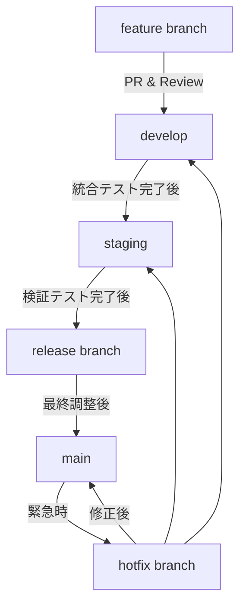
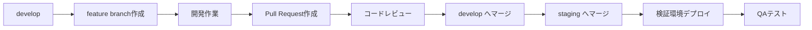
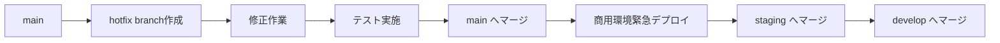

# Git運用ルール - 大規模開発向け

## 1. 概要

本ドキュメントは、大規模開発プロジェクトにおけるGit運用ルールを定義します。通常開発と緊急修正の両方に対応し、検証環境と商用環境を明確に分離した運用を実現します。

## 2. ブランチ戦略

### 2.1 基本ブランチ構成

```
main（商用環境）
├── staging（検証環境）
├── release/yyyy-mm-dd（リリース準備）
├── develop（開発統合）
│   ├── feature/TICKET-001_feature-name（チケット機能開発）
│   ├── refactor/database-optimization（リファクタリング）
│   ├── chore/update-dependencies（環境・ツール更新）
│   ├── docs/api-documentation（ドキュメント更新）
│   ├── experiment/new-architecture（実験・検証）
│   ├── security/vulnerability-fix（セキュリティ対応）
│   ├── performance/query-optimization（パフォーマンス改善）
│   └── ...
└── hotfix/TICKET-999_critical-fix（緊急修正）
```

### 2.2 ブランチ種別と用途

| ブランチ種別                     | 用途                     | 環境              | 保護設定 |
| -------------------------------- | ------------------------ | ----------------- | -------- |
| `main`                         | 商用環境デプロイ用       | Production        | 必須     |
| `staging`                      | 検証環境デプロイ用       | Staging           | 必須     |
| `develop`                      | 開発統合ブランチ         | Development       | 必須     |
| `release/yyyy-mm-dd`           | リリース準備・最終調整   | Pre-Production    | 必須     |
| `feature/TICKET-XXX_name`      | 機能開発（チケット対応） | Local Development | 任意     |
| `hotfix/TICKET-XXX_name`       | 緊急修正（チケット対応） | -                 | 任意     |
| `refactor/refactor-name`       | リファクタリング作業     | Local Development | 任意     |
| `chore/task-name`              | 環境設定・ツール更新等   | Local Development | 任意     |
| `docs/documentation-name`      | ドキュメント更新         | Local Development | 任意     |
| `experiment/experiment-name`   | 実験・検証作業           | Local Development | 任意     |
| `security/security-task`       | セキュリティ対応         | Local Development | 任意     |
| `performance/perf-improvement` | パフォーマンス改善       | Local Development | 任意     |

### 2.3 ブランチ運用の基本方針



#### ブランチ間のマージルール

- **feature → develop**: Squash Merge（履歴をクリーンに保つ）
- **develop → staging**: Merge Commit（検証用の統合ポイント）
- **staging → release**: Merge Commit（リリース候補の作成）
- **release → main**: Merge Commit（本番リリース）
- **hotfix → main/staging/develop**: Merge Commit（緊急修正の反映）

## 3. 通常開発フロー

### 3.1 機能開発の流れ



### 3.2 ブランチ種別ごとの作業例

#### チケット対応（機能開発）

```bash
# 最新のdevelopブランチを取得
git checkout develop
git pull origin develop

# 機能ブランチを作成
git checkout -b feature/PROJ-123_user-authentication

# 開発作業後、コミット
git add .
git commit -m "feat: ユーザー認証機能を追加

- ログイン画面の実装
- JWT認証の導入
- パスワードハッシュ化

Closes #123"

# リモートにプッシュ
git push origin feature/PROJ-123_user-authentication
```

#### Pull Request作成

```bash
# GitHub CLI使用例
gh pr create --base develop --title "feat: ユーザー認証機能を追加" --body "チケット番号: PROJ-123"
```

#### リファクタリング作業

```bash
# リファクタリングブランチ作成
git checkout develop
git pull origin develop
git checkout -b refactor/database-query-optimization

# 作業後コミット
git add .
git commit -m "refactor: データベースクエリの最適化

- N+1問題の解決
- インデックスの追加
- 不要なJOINの削除

Performance: クエリ実行時間を50%削減"

git push origin refactor/database-query-optimization
```

#### 環境・ツール更新（chore）

```bash
# chore ブランチ作成
git checkout develop
git pull origin develop
git checkout -b chore/update-node-dependencies

# 依存関係更新
npm update
npm audit fix

git add package.json package-lock.json
git commit -m "chore: Node.js依存関係を更新

- express: 4.18.0 → 4.19.0
- jest: 29.5.0 → 29.7.0
- セキュリティ脆弱性3件を修正

Security: CVE-2023-XXXX, CVE-2023-YYYY"

git push origin chore/update-node-dependencies
```

#### ドキュメント更新

```bash
# ドキュメント更新ブランチ作成
git checkout develop
git pull origin develop
git checkout -b docs/update-api-documentation

# READMEやAPI仕様書を更新
git add README.md docs/api.md
git commit -m "docs: API仕様書とREADMEを更新

- 新しいエンドポイントの追加
- 認証方法の変更を反映
- 使用例の追加"

git push origin docs/update-api-documentation
```

#### 実験・検証作業

```bash
# 実験ブランチ作成
git checkout develop
git pull origin develop
git checkout -b experiment/graphql-migration

# 実験的実装
git add .
git commit -m "experiment: GraphQL移行の検証

- REST APIとの性能比較実装
- クエリ最適化の検証
- フロントエンドとの統合テスト

Note: 本実装前の検証用コード"

git push origin experiment/graphql-migration
```

#### セキュリティ対応

```bash
# セキュリティ対応ブランチ作成
git checkout develop
git pull origin develop
git checkout -b security/implement-rate-limiting

# セキュリティ機能実装
git add .
git commit -m "security: レート制限機能を実装

- API エンドポイントへのレート制限追加
- Redis を使用した分散レート制限
- 異常なアクセスパターンの検知

Security: DDoS攻撃対策を強化"

git push origin security/implement-rate-limiting
```

#### パフォーマンス改善

```bash
# パフォーマンス改善ブランチ作成
git checkout develop
git pull origin develop
git checkout -b performance/optimize-image-processing

# パフォーマンス改善実装
git add .
git commit -m "perf: 画像処理パフォーマンスを改善

- WebP形式への変換処理を追加
- 画像リサイズアルゴリズムの最適化
- キャッシュ機能の実装

Performance: 画像処理速度を70%改善"

git push origin performance/optimize-image-processing
```

### 3.3 検証環境デプロイフロー

```bash
# developからstagingへマージ（検証環境デプロイ）
git checkout staging
git pull origin staging
git merge develop --no-ff
git push origin staging

# 検証完了後、リリースブランチ作成
git checkout staging
git pull origin staging
git checkout -b release/2024-01-15

# 最終調整とバージョン更新
echo "v1.2.0" > VERSION
git add VERSION
git commit -m "bump: version to v1.2.0"

# リリースブランチをプッシュ
git push origin release/2024-01-15

# mainにマージ後、タグ作成
git checkout main
git tag -a v1.2.0 -m "Release version 1.2.0"
git push origin v1.2.0
```

## 4. 緊急修正フロー

### 4.1 緊急修正の判断基準

- システム停止を伴う障害
- セキュリティインシデント
- データ整合性に関わる重要なバグ
- 法的要件への対応

### 4.2 緊急修正の流れ



### 4.3 緊急修正のコマンド例

```bash
# 緊急修正ブランチ作成
git checkout main
git pull origin main
git checkout -b hotfix/PROJ-999_critical-security-fix

# 修正作業
git add .
git commit -m "fix: SQLインジェクション脆弱性を修正

- ユーザー入力のサニタイゼーション強化
- プリペアドステートメントの適用

Critical: Security vulnerability fix
Refs: PROJ-999"

# 緊急修正をプッシュ
git push origin hotfix/PROJ-999_critical-security-fix

# 緊急マージ（レビュー簡素化）
gh pr create --base main --title "🚨 緊急修正: SQLインジェクション脆弱性" --body "緊急修正のため即座にマージが必要"
```

## 5. 環境別デプロイ戦略

### 5.1 環境とブランチの対応

| 環境       | 対応ブランチ  | デプロイタイミング | 承認要否 |
| ---------- | ------------- | ------------------ | -------- |
| 開発環境   | `feature/*` | プッシュ時自動     | 不要     |
| 検証環境   | `staging`   | マージ時自動       | 不要     |
| 本番前環境 | `release/*` | 手動実行           | 必要     |
| 商用環境   | `main`      | 手動実行           | 必要     |

### 5.2 デプロイメント設定例（GitHub Actions）

```yaml
name: Deploy to Environments

on:
  push:
    branches: [ staging, main ]
  pull_request:
    branches: [ develop, staging ]

jobs:
  deploy-staging:
    if: github.ref == 'refs/heads/staging'
    runs-on: ubuntu-latest
    environment: staging
    steps:
      - uses: actions/checkout@v3
      - name: Deploy to Staging
        run: ./deploy.sh staging

  deploy-production:
    if: github.ref == 'refs/heads/main'
    runs-on: ubuntu-latest
    environment: production
    needs: [security-scan, integration-tests]
    steps:
      - uses: actions/checkout@v3
      - name: Deploy to Production
        run: ./deploy.sh production
```

## 6. その他対応時の管理ルール

### 6.1 ブランチ命名規則の詳細

#### プレフィックスルール

| プレフィックス   | 用途                       | 例                                 | 必須要素     |
| ---------------- | -------------------------- | ---------------------------------- | ------------ |
| `feature/`     | 新機能開発（チケットあり） | `feature/TICKET-123_user-login`  | チケット番号 |
| `refactor/`    | リファクタリング           | `refactor/database-optimization` | 作業内容     |
| `chore/`       | 環境・ツール更新           | `chore/update-dependencies`      | 作業内容     |
| `docs/`        | ドキュメント更新           | `docs/api-specification`         | 更新対象     |
| `experiment/`  | 実験・検証                 | `experiment/new-architecture`    | 実験内容     |
| `security/`    | セキュリティ対応           | `security/rate-limiting`         | 対策内容     |
| `performance/` | パフォーマンス改善         | `performance/query-optimization` | 改善内容     |
| `hotfix/`      | 緊急修正                   | `hotfix/TICKET-999_critical-fix` | チケット番号 |

#### 命名規則の注意点

- **小文字とハイフンを使用**: `feature/user-authentication`（○）、`Feature/UserAuthentication`（×）
- **日本語は避ける**: 英語での命名を推奨
- **簡潔で分かりやすく**: 30文字以内を目安
- **チケット番号**: 可能な限り関連チケットを明記

### 6.2 作業の優先順位と承認フロー

| 作業種別          | 優先度 | レビュー要件 | マージ承認者                    | 緊急度     |
| ----------------- | ------ | ------------ | ------------------------------- | ---------- |
| `hotfix/*`      | 最高   | 1名以上      | テックリード                    | 即時       |
| `security/*`    | 高     | 2名以上      | セキュリティ担当 + テックリード | 24時間以内 |
| `feature/*`     | 中     | 1名以上      | チームメンバー                  | 通常       |
| `performance/*` | 中     | 2名以上      | シニア開発者 + テックリード     | 通常       |
| `refactor/*`    | 中     | 2名以上      | シニア開発者                    | 通常       |
| `chore/*`       | 低     | 1名以上      | チームメンバー                  | 低         |
| `docs/*`        | 低     | 1名以上      | チームメンバー                  | 低         |
| `experiment/*`  | 参考   | 1名以上      | チームメンバー                  | -          |

### 6.3 実験ブランチの特別ルール

#### 実験ブランチ（experiment/*）の取り扱い

- **マージ判断**: 実験結果に基づく個別判断
- **保持期間**: 最大30日間（延長は要相談）
- **削除タイミング**: 実験終了後、結果報告書作成後
- **成果物**: 実験結果をWikiやドキュメントに記録

#### 実験終了時の処理

```bash
# 実験結果を記録
echo "## 実験結果報告書
- 実験目的: GraphQL移行の検証
- 実験期間: 2024-01-15 - 2024-01-30
- 結果: REST APIに比べて30%のパフォーマンス向上
- 推奨: 段階的移行を推奨
- 次のアクション: 移行計画書の作成" > docs/experiments/graphql-migration-result.md

# 実験ブランチの削除
git branch -d experiment/graphql-migration
git push origin --delete experiment/graphql-migration
```

## 7. コードレビュー・マージルール

### 7.1 作業種別ごとのPull Request要件

#### 共通必須項目

- [ ] 作業内容の説明
- [ ] 変更理由の明記
- [ ] 影響範囲の説明
- [ ] 関連チケット・Issue番号（あれば）

#### 作業種別ごとの追加要件

**feature/* - 新機能開発**

- [ ] チケット番号の記載（必須）
- [ ] 機能仕様書との整合性確認
- [ ] テストケースの追加
- [ ] ドキュメントの更新

**refactor/* - リファクタリング**

- [ ] リファクタリング前後の比較
- [ ] パフォーマンステスト結果
- [ ] 既存機能への影響がないことの確認
- [ ] テストカバレッジの維持

**chore/* - 環境・ツール更新**

- [ ] 更新内容の詳細
- [ ] 依存関係の変更点
- [ ] セキュリティ脆弱性の対応状況
- [ ] 動作確認環境の記載

**docs/* - ドキュメント更新**

- [ ] 更新内容の概要
- [ ] 対象読者の明記
- [ ] 関連ドキュメントとの整合性

**experiment/* - 実験・検証**

- [ ] 実験目的の明記
- [ ] 仮説と検証方法
- [ ] 結果の測定方法
- [ ] 本実装への影響評価

**security/* - セキュリティ対応**

- [ ] セキュリティリスクの評価
- [ ] 対策内容の詳細
- [ ] 影響範囲の分析
- [ ] テスト方法の記載

**performance/* - パフォーマンス改善**

- [ ] パフォーマンス測定結果
- [ ] 改善前後の比較データ
- [ ] 負荷テスト結果
- [ ] 副作用の有無確認

### 7.2 レビュー要件（ブランチ別）

| ブランチ種別      | 必要レビュー数 | 承認者要件                      | 特記事項                 |
| ----------------- | -------------- | ------------------------------- | ------------------------ |
| `feature/*`     | 1名以上        | チームメンバー                  | チケット対応必須         |
| `refactor/*`    | 2名以上        | シニア開発者1名含む             | パフォーマンステスト必須 |
| `chore/*`       | 1名以上        | チームメンバー                  | セキュリティ確認推奨     |
| `docs/*`        | 1名以上        | チームメンバー                  | 技術ライター確認推奨     |
| `experiment/*`  | 1名以上        | チームメンバー                  | マージ判断は個別相談     |
| `security/*`    | 2名以上        | セキュリティ担当 + テックリード | セキュリティ監査必須     |
| `performance/*` | 2名以上        | シニア開発者 + テックリード     | 負荷テスト必須           |
| `develop`       | 1名以上        | チームメンバー                  | -                        |
| `staging`       | 1名以上        | シニア開発者                    | -                        |
| `release/*`     | 2名以上        | シニア開発者1名含む             | -                        |
| `main`          | 2名以上        | テックリード必須                | -                        |
| `hotfix/*`      | 1名以上        | テックリード推奨                | 緊急時は事後レビュー可   |

### 7.3 作業種別ごとのマージ方針

```bash
# 機能ブランチ → develop: Squash Merge
git checkout develop
git merge --squash feature/PROJ-123_user-authentication
git commit -m "feat: ユーザー認証機能を追加 (#123)"

# develop → staging: Merge Commit
git checkout staging
git merge develop --no-ff

# staging → release: Merge Commit
git checkout release/2024-01-15
git merge staging --no-ff

# release → main: Merge Commit
git checkout main  
git merge release/2024-01-15 --no-ff
```

## 7. タグ管理・リリース管理

### 7.1 バージョニング規則

セマンティックバージョニング（SemVer）を採用：

- `MAJOR.MINOR.PATCH`
- 例：`v1.2.3`

### 7.2 タグ作成ルール

```bash
# リリースタグ
git tag -a v1.2.0 -m "Release v1.2.0

Features:
- ユーザー認証機能
- 管理画面UI改善

Bug Fixes:
- データ整合性の問題を修正

Breaking Changes:
- API v1のサポート終了"

# 緊急修正タグ
git tag -a v1.2.1 -m "Hotfix v1.2.1

Critical Fix:
- SQLインジェクション脆弱性を修正"

git push origin --tags
```

### 7.3 リリースノート自動生成

```yaml
# .github/release.yml
changelog:
  categories:
    - title: 🚀 新機能
      labels: ['enhancement', 'feature']
    - title: 🐛 バグ修正
      labels: ['bug', 'fix']
    - title: 🚨 緊急修正
      labels: ['hotfix', 'critical']
    - title: 📝 ドキュメント
      labels: ['documentation']
```

## 8. 緊急時対応プロセス

### 8.1 緊急事態の定義と対応レベル

| レベル | 影響範囲       | 対応時間  | エスカレーション          |
| ------ | -------------- | --------- | ------------------------- |
| P0     | システム全停止 | 即座      | CTO + 全開発チーム        |
| P1     | 主要機能停止   | 1時間以内 | テックリード + 関連チーム |
| P2     | 一部機能異常   | 4時間以内 | 担当チーム                |

### 8.2 緊急対応フロー

```bash
# 1. 緊急対応チャンネルでアラート
echo "🚨 P0緊急事態: システム全停止を確認"

# 2. 即座にホットフィックスブランチ作成
git checkout main
git checkout -b hotfix/emergency-system-down-$(date +%Y%m%d-%H%M)

# 3. 最小限の修正を実施
# ... 修正作業 ...

# 4. 緊急デプロイ用コミット
git commit -m "fix: 緊急修正 - システム停止原因を解決

EMERGENCY FIX - IMMEDIATE DEPLOYMENT REQUIRED
- データベース接続プールの設定修正
- メモリリーク原因の削除

Impact: システム全体
Risk: LOW（既存機能への影響なし）"

# 5. 即座にマージ・デプロイ
git push origin hotfix/emergency-system-down-20240115-1430
gh pr create --base main --title "🚨緊急修正: システム停止" --assignee @techlead
```

### 8.3 事後対応

```bash
# 1. 緊急修正をstagingとdevelopに反映
git checkout staging
git merge hotfix/emergency-system-down-20240115-1430
git push origin staging

git checkout develop
git merge hotfix/emergency-system-down-20240115-1430
git push origin develop

# 2. 事後報告書の作成
echo "## 緊急対応報告書
- 発生時刻: 2024-01-15 14:30
- 原因: データベース接続プール設定ミス
- 対応時間: 15分
- 影響範囲: 全ユーザー" > incident-report-20240115.md

# 3. 再発防止策の検討・実装
git checkout -b feature/prevent-db-connection-issue
```

## 9. 運用チェックリスト

### 9.1 日次チェック項目

- [ ] develop・stagingブランチの最新化
- [ ] 未マージのPRの確認
- [ ] CIの実行状況確認
- [ ] 検証環境の動作確認

### 9.2 リリース前チェック項目

- [ ] 全自動テストの通過
- [ ] セキュリティスキャンの実行
- [ ] パフォーマンステストの実行
- [ ] データベースマイグレーションの確認
- [ ] ロールバック手順の準備
- [ ] 監視アラートの設定確認

### 9.3 緊急時チェック項目

- [ ] 影響範囲の特定
- [ ] ロールバック可能性の確認
- [ ] 関係者への通知
- [ ] 修正内容の最小化
- [ ] テスト実施（可能な範囲で）
- [ ] デプロイ後の監視強化

### 9.4 作業種別ごとのチェック項目

#### リファクタリング作業（refactor/*）

- [ ] パフォーマンステストの実行と結果確認
- [ ] 既存機能の回帰テスト実行
- [ ] テストカバレッジの維持確認
- [ ] コードメトリクス（複雑度等）の改善確認
- [ ] ドキュメントの更新（必要に応じて）

#### 環境・ツール更新（chore/*）

- [ ] 依存関係の競合確認
- [ ] セキュリティ脆弱性の解決確認
- [ ] 開発環境での動作確認
- [ ] CI/CDパイプラインの動作確認
- [ ] チーム内への変更通知

#### セキュリティ対応（security/*）

- [ ] セキュリティスキャンの実行
- [ ] 脆弱性評価の実施
- [ ] セキュリティポリシーへの準拠確認
- [ ] 監査ログの設定確認
- [ ] インシデント対応計画の更新

#### パフォーマンス改善（performance/*）

- [ ] ベンチマークテストの実行
- [ ] 負荷テストの実施
- [ ] メモリ使用量の測定
- [ ] CPU使用率の確認
- [ ] 改善効果の定量的評価

#### 実験作業（experiment/*）

- [ ] 実験計画書の作成
- [ ] 仮説の明確化
- [ ] 測定指標の定義
- [ ] 実験環境の準備
- [ ] 結果報告書の作成
- [ ] 本実装への影響評価

## 10. ツール・設定

### 10.1 推奨Git設定

```bash
# グローバル設定
git config --global user.name "Your Name"
git config --global user.email "your.email@company.com"
git config --global init.defaultBranch main
git config --global pull.rebase true
git config --global core.autocrlf input

# プロジェクト固有の設定
git config user.email "project-specific@company.com"
```

### 10.2 Git Hooks例

```bash
#!/bin/sh
# pre-commit hook
npm run lint
npm run test:unit
echo "Pre-commit checks passed ✅"
```

## 11. トラブルシューティング

### 11.1 よくある問題と対処法

#### マージコンフリクト

```bash
git checkout develop
git pull origin develop
git checkout feature/your-branch
git merge develop
# コンフリクト解決後
git add .
git commit -m "resolve: merge conflict with develop"
```

#### 誤ったコミットの取り消し

```bash
# 直前のコミットを取り消し（未プッシュ）
git reset --soft HEAD~1

# プッシュ済みコミットの取り消し
git revert HEAD
git push origin your-branch
```

#### 緊急時のブランチ切り替え

```bash
# 作業中の変更を退避
git stash push -m "WIP: emergency stash"

# 緊急対応後に復元
git stash pop
```

この運用ルールにより、大規模開発における効率的で安全なGit運用が実現できます。定期的な見直しと改善を継続してください。
