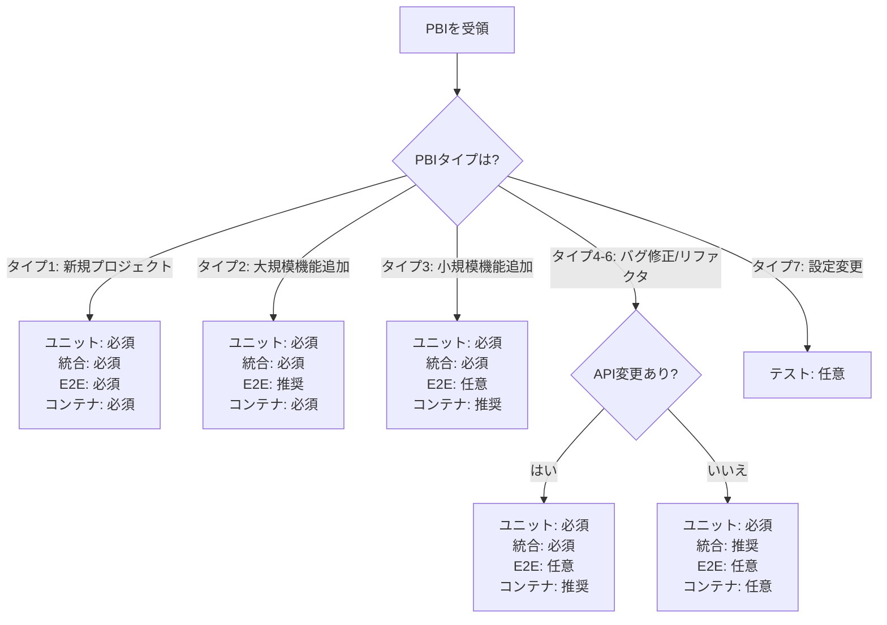

# テスト標準

## 概要

このドキュメントは、組織全体のソフトウェアテストに関する包括的な標準を定義します。これらの標準は、すべてのプロジェクトで一貫した品質、信頼性、保守性を確保します。

## 目次

1. [テスト戦略](#テスト戦略)
2. [テストピラミッド](#テストピラミッド)
3. [ユニットテスト](#ユニットテスト)
4. [統合テスト](#統合テスト)
5. [エンドツーエンド(E2E)テスト](#エンドツーエンドe2eテスト)
6. [パフォーマンステスト](#パフォーマンステスト)
7. [セキュリティテスト](#セキュリティテスト)
8. [テストカバレッジ要件](#テストカバレッジ要件)
9. [テスト自動化](#テスト自動化)
10. [テストツール](#テストツール)
11. [ベストプラクティス](#ベストプラクティス)
12. [Devin AIガイドライン](#devin-aiガイドライン)

## テスト戦略

### テストの目的

テストは以下を目的としています:

1. **品質保証**: コードが機能要件とビジネス要件を満たすことを検証
2. **リグレッション防止**: 新しいコード変更が既存機能を破壊しないことを確保
3. **ドキュメント化**: テストが期待される動作のライブドキュメントとして機能
4. **リファクタリングの信頼性**: 安全なコード改善を可能にする
5. **早期バグ検出**: 開発サイクルの早い段階で問題を発見

### テストレベル

以下のテストレベルを実装します:

1. **ユニットテスト**: 個別のコンポーネントや関数のテスト
2. **統合テスト**: コンポーネント間の相互作用のテスト
3. **E2Eテスト**: ユーザーパースペクティブからの完全なワークフローのテスト
4. **パフォーマンステスト**: システムのパフォーマンス特性の検証
5. **セキュリティテスト**: セキュリティ脆弱性の特定


## PBIタイプ別テスト要件マトリックス 🆕

### 概要

開発タスクの種類（PBIタイプ）によって、必要なテストレベルと実施要件が異なります。以下のマトリックスは、各PBIタイプに対する最適なテスト戦略を示します。

---

### 要件サマリー

| PBIタイプ | ユニットテスト | 統合テスト | E2Eテスト | カバレッジ目標 | コンテナ化 |
|---------|--------------|-----------|----------|-------------|-----------|
| **タイプ1: 新規プロジェクト** | 🔴 必須 | 🔴 必須 | 🔴 必須 | 80%以上 | 🔴 必須 |
| **タイプ2: 大規模機能追加** | 🔴 必須 | 🔴 必須 | 🟡 推奨 | 75%以上 | 🔴 必須 |
| **タイプ3: 小規模機能追加** | 🔴 必須 | 🔴 必須 | ⚪ 任意 | 70%以上 | 🟡 推奨 |
| **タイプ4: バグ修正（API）** | 🔴 必須 | 🔴 必須 | ⚪ 任意 | 修正箇所100% | 🟡 推奨 |
| **タイプ5: バグ修正（内部）** | 🔴 必須 | 🟡 推奨 | ⚪ 任意 | 修正箇所100% | ⚪ 任意 |
| **タイプ6: リファクタリング** | 🔴 必須 | 🟡 推奨 | ⚪ 任意 | 変更前と同等 | ⚪ 任意 |
| **タイプ7: 設定変更のみ** | ⚪ 任意 | ⚪ 任意 | ⚪ 任意 | - | ⚪ 任意 |

**凡例**:
- 🔴 **必須**: 実施しない場合、PRマージ不可
- 🟡 **推奨**: 実施を強く推奨（影響範囲に応じて判断）
- ⚪ **任意**: 必要に応じて実施

---

### 詳細要件

#### タイプ1: 新規プロジェクト

**定義**: ゼロから新しいプロジェクト・アプリケーションを作成

**ユニットテスト**: 🔴 必須
```yaml
対象:
  - すべてのビジネスロジック
  - ユーティリティ関数
  - ドメインモデル
  - バリデーションロジック
  
カバレッジ目標: 80%以上
```

**統合テスト**: 🔴 必須
```yaml
対象:
  - すべてのAPI endpoints
  - データベース操作（CRUD）
  - 外部API連携
  - トランザクション処理
  
実装方法: TestContainers推奨
```

**E2Eテスト**: 🔴 必須
```yaml
対象:
  - 主要なユーザーフロー（3-5シナリオ）
  - 認証・認可フロー
  - エラーハンドリング
  
ツール: Playwright, Cypress, Selenium
```

**コンテナ化**: 🔴 必須
- データベース、Redis等の依存サービスを含む

---

#### タイプ2: 既存プロジェクトへの大規模機能追加

**定義**: 既存システムに大規模な新機能を追加（新規テーブル追加、複数API追加等）

**ユニットテスト**: 🔴 必須
```yaml
対象:
  - 新規ビジネスロジック
  - 変更された既存ロジック
  - 新規ドメインモデル
  
カバレッジ目標: 新規コード75%以上
```

**統合テスト**: 🔴 必須
```yaml
対象:
  - 新規API endpoints
  - 影響を受ける既存endpoints
  - 新規データベース操作
  - 既存データとの連携
  
実装方法: TestContainers推奨
```

**E2Eテスト**: 🟡 推奨
```yaml
対象:
  - 新規機能の主要フロー
  - 既存機能との統合フロー
  
ツール: Playwright, Cypress
```

**コンテナ化**: 🔴 必須
- 既存データベーススキーマとの互換性検証が必要

**例**: EC-15（パスワードリセットAPI実装）
- 新規endpoints: `/api/auth/password-reset/request`, `/confirm`
- 新規テーブル: `password_reset_tokens`
- 外部連携: メール送信サービス

---

#### タイプ3: 既存プロジェクトへの小規模機能追加

**定義**: 既存システムに小規模な新機能を追加（1-2 API追加、既存機能の拡張等）

**ユニットテスト**: 🔴 必須
```yaml
対象:
  - 新規ビジネスロジック
  - 変更されたメソッド
  
カバレッジ目標: 新規コード70%以上
```

**統合テスト**: 🔴 必須
```yaml
対象:
  - 新規API endpoints
  - 新規データベース操作
  
実装方法: TestContainers推奨、Docker Compose可
```

**E2Eテスト**: ⚪ 任意
```yaml
対象:
  - 新規機能の基本フロー（必要に応じて）
```

**コンテナ化**: 🟡 推奨
- データベース操作を含む場合は必須

---

#### タイプ4: バグ修正（API関連）

**定義**: 公開APIに関連するバグの修正

**ユニットテスト**: 🔴 必須
```yaml
対象:
  - 修正箇所のロジック
  - 関連するロジック
  
カバレッジ目標: 修正箇所100%
```

**統合テスト**: 🔴 必須
```yaml
対象:
  - 修正対象のAPI endpoint
  - 関連endpoints
  - バグ再現テスト
  
実装方法: TestContainers推奨
```

**E2Eテスト**: ⚪ 任意
```yaml
対象:
  - バグ再現シナリオ（重大なバグの場合）
```

**コンテナ化**: 🟡 推奨
- APIテストの場合は推奨

**重要**: バグ修正には必ず**バグ再現テスト**を追加
```java
@Test
void testBugFix_Issue123_NullPointerException() {
    // Given: バグが発生する条件
    User userWithoutEmail = new User();
    userWithoutEmail.setName("Test User");
    // email is null
    
    // When: バグが発生していた操作
    ResponseEntity<String> response = restTemplate.postForEntity(
        "/api/users/send-notification",
        userWithoutEmail,
        String.class
    );
    
    // Then: エラーではなく適切にハンドリングされる
    assertThat(response.getStatusCode()).isEqualTo(HttpStatus.BAD_REQUEST);
    assertThat(response.getBody()).contains("メールアドレスが必要です");
}
```

---

#### タイプ5: バグ修正（内部ロジック）

**定義**: 公開APIに影響しない内部ロジックのバグ修正

**ユニットテスト**: 🔴 必須
```yaml
対象:
  - 修正箇所のロジック
  - バグ再現テスト
  
カバレッジ目標: 修正箇所100%
```

**統合テスト**: 🟡 推奨
```yaml
対象:
  - 影響範囲が広い場合のみ
  
実装方法: 必要に応じてTestContainers
```

**E2Eテスト**: ⚪ 任意

**コンテナ化**: ⚪ 任意

---

#### タイプ6: リファクタリング

**定義**: 既存コードの構造改善（機能変更なし）

**ユニットテスト**: 🔴 必須
```yaml
要件:
  - 既存テストがすべてパスすること
  - 新規テストは通常不要（ただし、カバレッジ向上の機会）
  
カバレッジ目標: 変更前と同等以上
```

**統合テスト**: 🟡 推奨
```yaml
対象:
  - 公開APIに変更がある場合
  - 既存テストがすべてパスすること
```

**E2Eテスト**: ⚪ 任意
```yaml
要件:
  - 既存テストがすべてパスすること
```

**コンテナ化**: ⚪ 任意

**重要**: リファクタリングの黄金ルール
1. テストを先に実行し、すべてパスすることを確認
2. リファクタリング実施
3. 同じテストを実行し、すべてパスすることを確認
4. 新しいバグを導入しないことが最優先

---

#### タイプ7: 設定変更のみ

**定義**: コードロジック変更を伴わない設定変更（環境変数、設定ファイル等）

**ユニットテスト**: ⚪ 任意
```yaml
対象:
  - 設定値の検証（必要に応じて）
```

**統合テスト**: ⚪ 任意
```yaml
対象:
  - 設定適用の確認（必要に応じて）
```

**E2Eテスト**: ⚪ 任意

**コンテナ化**: ⚪ 任意

---

### テストピラミッドとの対応

```
      /\         E2Eテスト（10%）
     /  \        - タイプ1: 必須
    /────\       - タイプ2: 推奨
   /      \      - タイプ3-7: 任意
  /────────\     
 /          \    統合テスト（30%）
/────────────\   - タイプ1-4: 必須
                 - タイプ5-6: 推奨
────────────────  
                 ユニットテスト（60%）
                 - タイプ1-6: 必須
                 - タイプ7: 任意
```

---

### Phase別テスト実施タイミング

| Phase | テストレベル | 実施内容 | 担当 |
|------|------------|---------|------|
| **Phase 3: 実装** | ユニットテスト | テストコード作成 | AIエージェント/開発者 |
| **Phase 4: レビュー・QA** | 統合テスト | APIレベルテスト実装・実行 | AIエージェント/開発者 |
| **Phase 4: レビュー・QA** | E2Eテスト | ユーザーフローテスト実装・実行 | AIエージェント/QAエンジニア |
| **Phase 5: デプロイメント** | スモークテスト | 主要機能の動作確認 | 運用チーム |

---

### 判断フローチャート



---

### 実践例

#### 例1: EC-15（パスワードリセットAPI実装）

**分類**: タイプ2（既存プロジェクトへの大規模機能追加）

**実施したテスト**:
```yaml
ユニットテスト: ✅ 実施
  - PasswordResetService: トークン生成、検証ロジック
  - PasswordResetValidator: バリデーションロジック
  - カバレッジ: 85%

統合テスト: ✅ 実施（TestContainers使用）
  - POST /api/auth/password-reset/request: 正常系・異常系
  - POST /api/auth/password-reset/confirm: 正常系・異常系
  - データベース操作: password_reset_tokensテーブル
  - メール送信: MailHogモック使用

E2Eテスト: ✅ 実施（Playwright）
  - パスワードリセット完全フロー
  - メール受信→リンククリック→新パスワード設定→ログイン

コンテナ化: ✅ 実施
  - PostgreSQL 15
  - MailHog
```

#### 例2: バグ修正（ユーザー削除時のNullPointerException）

**分類**: タイプ4（バグ修正・API関連）

**実施したテスト**:
```yaml
ユニットテスト: ✅ 実施
  - UserService.deleteUser(): バグ再現テスト
  - カバレッジ: 修正箇所100%

統合テスト: ✅ 実施
  - DELETE /api/users/{id}: エッジケーステスト
  - 関連データ（orders, profiles）の適切な削除確認

E2Eテスト: ⚪ 実施せず（単純なバグのため）

コンテナ化: ✅ 実施
  - PostgreSQL（外部キー制約の検証のため）
```

---

### カバレッジ目標達成のチェックポイント

```yaml
Phase 4完了時の確認事項:
  - [ ] PBIタイプに応じた必須テストをすべて実装した
  - [ ] カバレッジ目標を達成している
  - [ ] すべてのテストがパスしている
  - [ ] CI/CD環境でテストが実行できる
  - [ ] テスト実行時間が許容範囲内（<5分推奨）
  - [ ] フレーキーテスト（不安定なテスト）がない
```

---


---

## Phase 3（実装フェーズ）での実施事項 🆕

### 概要

**重要**: Phase 3では、ユニットテストだけでなく**統合テストまで完了させる**ことが標準となります。

Phase 3完了時点で、以下の状態であることが求められます：

```
Phase 3開始
  ↓
機能実装
  ↓
ユニットテスト実装（カバレッジ80%以上）
  ↓
統合テスト環境構築（TestContainers）🆕
  ↓
統合テスト実装（API、DB、トランザクション）🆕
  ↓
全テスト実行・検証 🆕
  ↓
Phase 3完了 → Phase 4へ移行
```

---

### PBIタイプ別 Phase 3完了基準

| PBIタイプ | Phase 3完了時の状態 | 統合テスト範囲 | 参照ドキュメント |
|---------|-------------------|--------------|----------------|
| **タイプ1: 新規プロジェクト** | ✅ ユニットテスト完了<br>✅ 統合テスト完了<br>✅ TestContainers設定完了 | 全APIエンドポイント<br>全データベース操作<br>トランザクション処理 | [統合テスト実装ガイド](./04-integration-testing-implementation.md) |
| **タイプ2: 大規模機能追加** | ✅ ユニットテスト完了<br>✅ 統合テスト完了<br>✅ 既存テストとの連携確認 | 新規APIエンドポイント<br>影響を受ける既存API<br>データ連携テスト | [統合テスト実装ガイド](./04-integration-testing-implementation.md) |
| **タイプ3: 小規模機能追加** | ✅ ユニットテスト完了<br>✅ 統合テスト完了（新規API分） | 新規APIエンドポイント<br>新規データベース操作 | [統合テスト実装ガイド](./04-integration-testing-implementation.md) |
| **タイプ4: バグ修正（API）** | ✅ ユニットテスト完了<br>✅ 統合テスト完了（修正箇所）<br>✅ リグレッションテスト | 修正したAPIエンドポイント<br>関連する処理フロー | [統合テスト実装ガイド](./04-integration-testing-implementation.md) |
| **タイプ5: バグ修正（内部）** | ✅ ユニットテスト完了<br>🟡 統合テスト（推奨） | 影響範囲に応じて判断 | - |
| **タイプ6: リファクタリング** | ✅ ユニットテスト完了<br>🟡 統合テスト（推奨）<br>✅ 動作変更なしの確認 | 既存テストの維持・改善 | - |
| **タイプ7: 設定変更のみ** | - | - | - |

**凡例**:
- ✅ **実施必須**: Phase 3完了の必須条件
- 🟡 **推奨**: 影響範囲に応じて実施を判断

---

### Phase 3完了基準チェックリスト

#### 実装完了基準

- [ ] 機能実装が完了している
- [ ] コーディング規約に準拠している
- [ ] コミットメッセージが適切である
- [ ] コードレビュー可能な状態である

#### ユニットテスト完了基準

- [ ] カバレッジが80%以上達成（ビジネスロジック90%以上）
- [ ] すべてのユニットテストがパスしている
- [ ] FIRST原則に準拠している
- [ ] テスト実行時間が適切（全体で5分以内）

#### 統合テスト完了基準 🆕

- [ ] **環境構築**: リポジトリ内で統合テスト環境が構築されている
  - [ ] TestContainersまたはDocker Composeが設定されている
  - [ ] データベースコンテナが自動起動する
  - [ ] テストデータの準備・クリーンアップが動作する

- [ ] **テスト実装**: 以下の統合テストが実装・実行済み
  - [ ] **APIエンドポイントテスト**: 全エンドポイントをカバー
    - [ ] 正常系テスト（200, 201, 204）
    - [ ] エラー系テスト（400, 404, 500）
    - [ ] バリデーションテスト
    - [ ] 認証・認可テスト（該当する場合）
  - [ ] **データベース操作テスト**: CRUD操作をカバー
    - [ ] Create（INSERT）
    - [ ] Read（SELECT）
    - [ ] Update（UPDATE）
    - [ ] Delete（DELETE）
    - [ ] 複雑なJOINクエリ（該当する場合）
  - [ ] **トランザクション処理テスト**
    - [ ] コミット成功パターン
    - [ ] ロールバックパターン
    - [ ] 複数テーブル更新の整合性
  - [ ] **外部サービス連携テスト**（該当する場合）
    - [ ] メール送信（モック使用）
    - [ ] 外部API呼び出し（モック使用）
    - [ ] ファイルストレージ操作（モック使用）

- [ ] **品質基準**: テスト品質が基準を満たしている
  - [ ] すべての統合テストがパスしている
  - [ ] テスト実行時間が10分以内
  - [ ] カバレッジレポートが生成されている
  - [ ] 統合テストカバレッジ（新規コード）が70%以上
  - [ ] Flaky Testが存在しない（10回実行して全成功）

- [ ] **CI/CD統合**: パイプラインで自動実行可能
  - [ ] CI/CDパイプライン設定ファイルが存在する
  - [ ] テスト失敗時にビルドが失敗する設定
  - [ ] カバレッジレポートがアップロードされる
  - [ ] テスト結果がPRにコメントされる（推奨）

#### ドキュメント完了基準

- [ ] README.mdに統合テスト実行方法を記載
- [ ] 環境構築手順が明記されている
- [ ] トラブルシューティング情報が記載されている

#### Phase 4への引き継ぎ条件

✅ **統合テストまで完了し、すべてのテストがパスしている状態でPhase 4に移行**

---

### 統合テスト実装手順

#### Step 1: ガイドとテンプレートの確認

1. **実装ガイド**: [統合テスト実装ガイド](./04-integration-testing-implementation.md)
2. **テストテンプレート**:
   - Python: [integration-test-template.py](../../08-templates/testing-templates/integration-test-template.py)
   - TypeScript: [integration-test-template.test.ts](../../08-templates/testing-templates/integration-test-template.test.ts)

#### Step 2: TestContainersの導入

言語別の設定手順は [統合テスト実装ガイド - Step 1](./04-integration-testing-implementation.md#3-step-1-テスト環境の構築) を参照

```bash
# Python
pip install testcontainers pytest-asyncio httpx

# TypeScript/Node.js
npm install --save-dev @testcontainers/postgresql supertest

# Java
# pom.xml に testcontainers 依存関係を追加
```

#### Step 3: 統合テストの実装

テンプレートをベースに、以下のテストを実装：

1. **APIエンドポイントテスト**
2. **データベース操作テスト**
3. **トランザクション処理テスト**
4. **外部サービス連携テスト**（該当する場合）

詳細は [統合テスト実装ガイド - Step 2](./04-integration-testing-implementation.md#4-step-2-統合テストの実装) を参照

#### Step 4: CI/CDへの統合

GitHub Actions、GitLab CI等のパイプラインで自動実行できるよう設定

詳細は [統合テスト実装ガイド - Step 3](./04-integration-testing-implementation.md#5-step-3-cicdへの統合) を参照

#### Step 5: 実行と検証

```bash
# ローカル実行
pytest tests/integration/ -v --cov=app

# カバレッジ確認
open htmlcov/index.html

# 実行時間確認（目標: 5-10分以内）
time pytest tests/integration/ -v
```

詳細は [統合テスト実装ガイド - Step 4](./04-integration-testing-implementation.md#6-step-4-実行と検証) を参照

---

### トラブルシューティング

統合テスト実装時によくある問題と解決策：

| 問題 | 症状 | 解決策 |
|------|------|--------|
| **コンテナ起動が遅い** | テスト実行開始まで数分かかる | Alpine版イメージの使用、sessionスコープフィクスチャ |
| **テストが不安定** | 同じテストが成功・失敗を繰り返す | テストの独立性確保、確実なクリーンアップ実装 |
| **ポート競合** | "Address already in use"エラー | ランダムポートの使用、既存プロセスの確認 |
| **メモリ不足** | Docker out of memory | Dockerメモリ制限を4GB以上に設定 |
| **タイムアウト** | Test timeout exceeded | pytest.ini でタイムアウト設定を調整 |

詳細は [統合テスト実装ガイド - トラブルシューティング](./04-integration-testing-implementation.md#7-トラブルシューティング) を参照

---

### よくある質問（FAQ）

#### Q1: 統合テストはPhase 3とPhase 4のどちらで実施すべきですか？

**A**: **Phase 3で実施します**。Phase 4は結合テスト仕様書・報告書の作成とレビューが主な作業です。統合テストの実装と実行はPhase 3で完了させてください。

#### Q2: TestContainersが使えない環境ではどうすればよいですか？

**A**: Docker Composeを使用してテスト環境を構築してください。ただし、TestContainersの方がテストの独立性が高いため推奨です。

#### Q3: 統合テストの実行時間が10分を超えてしまいます

**A**: 以下の最適化を検討してください：
- テストの並列実行（pytest-xdist, Jest --maxWorkers）
- 不要なデータ初期化の削減
- Alpine版イメージの使用
- sessionスコープのフィクスチャ活用

#### Q4: 外部APIをモック化すべきですか？

**A**: **はい、統合テストでは外部APIはモック化してください**。実際の外部APIを呼び出すテストはE2Eテスト（Phase 4以降）で実施します。

#### Q5: 既存プロジェクトへの機能追加で、既存の統合テストがない場合は？

**A**: **新規実装分のみ統合テストを作成してください**。既存機能の統合テストは別途技術的負債として管理します。

---

## まとめ

### Phase 3での統合テスト実施が重要な理由

1. **早期バグ検出**: 統合問題を実装直後に発見できる
2. **開発効率向上**: Phase 4でのレビュー・修正コストを削減
3. **品質保証**: リポジトリ内で完結するテストにより、いつでも品質を検証可能
4. **CI/CD統合**: 自動テストによる継続的な品質維持

### 次のステップ

✅ Phase 3で統合テストまで完了したら、**Phase 4（レビュー・品質保証）** に移行してください。

📚 関連ドキュメント:
- [統合テスト実装ガイド（Phase 3用）](./04-integration-testing-implementation.md)
- [AI-MASTER-WORKFLOW-GUIDE](../../00-guides/02-ai-guides/AI-MASTER-WORKFLOW-GUIDE.md)
- [Phase 4 Guide](../../00-guides/phase-guides/phase-4-review-qa-guide.md)

---

**最終更新**: 2025-11-18  
**更新内容**: Phase 3での統合テスト実施要件を明確化
