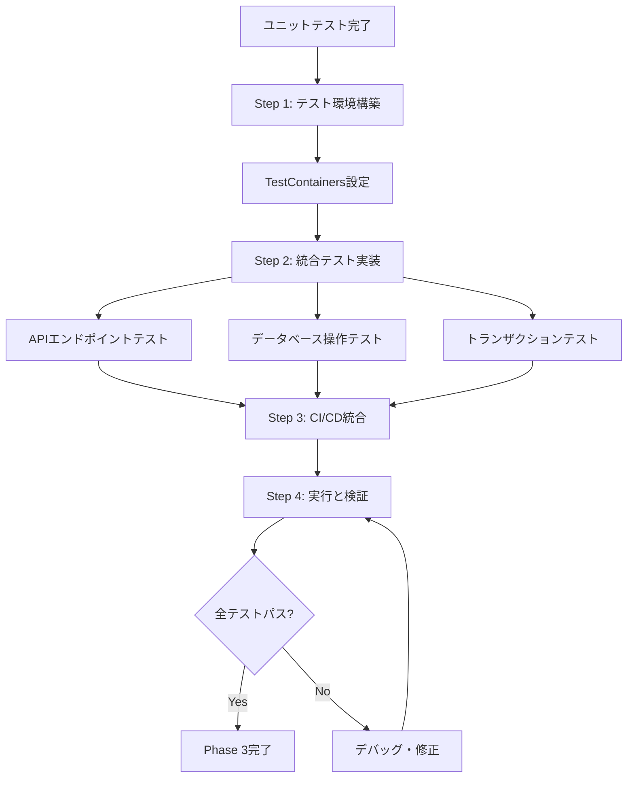

# 統合テスト実装ガイド（Phase 3用）
## Integration Testing Implementation Guide for Phase 3

**最終更新日**: 2025-11-18  
**バージョン**: 1.0.0  
**対象**: 開発者・自律型AI Devin  
**適用範囲**: Phase 3（実装フェーズ）における統合テストの実装

---

## 📖 概要

このドキュメントは、**Phase 3（実装フェーズ）において、リポジトリ内で完結する統合テストを自律的に実装する**ための実践的なガイドです。

### 🎯 目的

- **自律的な実装**: AIが統合テストを独力で実装できるよう詳細な手順を提供
- **環境構築**: TestContainersを用いたテスト環境の自動構築
- **品質保証**: API、データベース、トランザクション処理の統合動作を検証
- **CI/CD統合**: パイプラインで自動実行可能な状態まで完成させる

### 📚 関連ドキュメント

- [Testing Standards](./01-strategy-pbi-matrix.md): PBIタイプ別テスト要件
- [Integration Testing](../../04-quality-standards/integration-testing.md): 統合テスト詳細仕様
- [AI-MASTER-WORKFLOW-GUIDE](../../00-guides/02-ai-guides/AI-MASTER-WORKFLOW-GUIDE.md): Phase 3ワークフロー
- **[統合テストテンプレート](../../08-templates/testing-templates/)**: Python/TypeScript/Java実装テンプレート 🆕

---

## 📂 目次

1. [前提条件](#1-前提条件)
2. [実装フロー概要](#2-実装フロー概要)
3. [Step 1: テスト環境の構築](#3-step-1-テスト環境の構築)
4. [Step 2: 統合テストの実装](#4-step-2-統合テストの実装)
5. [Step 3: CI/CDへの統合](#5-step-3-cicdへの統合)
6. [Step 4: 実行と検証](#6-step-4-実行と検証)
7. [トラブルシューティング](#7-トラブルシューティング)
8. [完了基準チェックリスト](#8-完了基準チェックリスト)

---

## 1. 前提条件

### ✅ 必須条件

- [ ] 機能実装が完了している
- [ ] ユニットテストが実装済み（カバレッジ80%以上）
- [ ] すべてのユニットテストがパスしている
- [ ] Dockerがローカル環境で利用可能

### 📋 確認事項

```bash
# Docker動作確認
docker --version
docker ps

# 既存テスト実行確認
npm test              # Node.js
pytest                # Python
mvn test              # Java
```

---

## 2. 実装フロー概要



**所要時間**: 2-4時間（機能規模による）

---

## 3. Step 1: テスト環境の構築

### 3.1 TestContainersの導入

#### Python (pytest)

**依存関係の追加** (`requirements-dev.txt` または `pyproject.toml`)

```txt
# requirements-dev.txt
testcontainers>=3.7.0
pytest>=7.4.0
pytest-asyncio>=0.21.0
httpx>=0.24.0  # APIテスト用
```

**TestContainers設定** (`tests/integration/conftest.py`)

```python
import pytest
from testcontainers.postgres import PostgresContainer
from sqlalchemy import create_engine
from sqlalchemy.orm import sessionmaker

@pytest.fixture(scope="session")
def postgres_container():
    """PostgreSQLコンテナを起動"""
    with PostgresContainer("postgres:15-alpine") as postgres:
        yield postgres

@pytest.fixture(scope="session")
def db_engine(postgres_container):
    """データベースエンジンを作成"""
    connection_url = postgres_container.get_connection_url()
    engine = create_engine(connection_url)
    
    # テーブル作成
    from app.database import Base
    Base.metadata.create_all(engine)
    
    yield engine
    engine.dispose()

@pytest.fixture
def db_session(db_engine):
    """各テストで独立したセッションを提供"""
    Session = sessionmaker(bind=db_engine)
    session = Session()
    
    yield session
    
    # テスト後のクリーンアップ
    session.rollback()
    session.close()

@pytest.fixture
def test_client(db_session):
    """FastAPI/Flaskテストクライアント"""
    from app.main import app
    from fastapi.testclient import TestClient
    
    # セッションをオーバーライド
    app.dependency_overrides[get_db] = lambda: db_session
    
    with TestClient(app) as client:
        yield client
    
    app.dependency_overrides.clear()
```

---

#### TypeScript/Node.js (Jest)

**依存関係の追加** (`package.json`)

```json
{
  "devDependencies": {
    "@testcontainers/postgresql": "^10.2.0",
    "@types/jest": "^29.5.0",
    "jest": "^29.5.0",
    "supertest": "^6.3.0",
    "ts-jest": "^29.1.0"
  }
}
```

**TestContainers設定** (`tests/integration/setup.ts`)

```typescript
import { PostgreSqlContainer, StartedPostgreSqlContainer } from '@testcontainers/postgresql';
import { DataSource } from 'typeorm';

let container: StartedPostgreSqlContainer;
let dataSource: DataSource;

export async function setupTestDatabase(): Promise<DataSource> {
  // PostgreSQLコンテナを起動
  container = await new PostgreSqlContainer('postgres:15-alpine')
    .withDatabase('test_db')
    .withUsername('test_user')
    .withPassword('test_password')
    .start();

  // TypeORM DataSourceを作成
  dataSource = new DataSource({
    type: 'postgres',
    host: container.getHost(),
    port: container.getPort(),
    username: container.getUsername(),
    password: container.getPassword(),
    database: container.getDatabase(),
    entities: ['src/entities/**/*.ts'],
    synchronize: true, // テスト環境ではtrue
  });

  await dataSource.initialize();
  return dataSource;
}

export async function teardownTestDatabase(): Promise<void> {
  if (dataSource) {
    await dataSource.destroy();
  }
  if (container) {
    await container.stop();
  }
}

// Jest global setup
export default async (): Promise<void> => {
  global.__TEST_DATASOURCE__ = await setupTestDatabase();
};
```

**Jest設定** (`jest.config.js`)

```javascript
module.exports = {
  preset: 'ts-jest',
  testEnvironment: 'node',
  globalSetup: './tests/integration/setup.ts',
  globalTeardown: './tests/integration/teardown.ts',
  testMatch: ['**/tests/integration/**/*.test.ts'],
  testTimeout: 60000, // 統合テストは時間がかかる
};
```

---

#### Java (JUnit 5)

**依存関係の追加**

**Maven** (`pom.xml`)

```xml
<dependencies>
    <!-- TestContainers -->
    <dependency>
        <groupId>org.testcontainers</groupId>
        <artifactId>testcontainers</artifactId>
        <version>1.19.0</version>
        <scope>test</scope>
    </dependency>
    <dependency>
        <groupId>org.testcontainers</groupId>
        <artifactId>postgresql</artifactId>
        <version>1.19.0</version>
        <scope>test</scope>
    </dependency>
    <dependency>
        <groupId>org.testcontainers</groupId>
        <artifactId>junit-jupiter</artifactId>
        <version>1.19.0</version>
        <scope>test</scope>
    </dependency>
    
    <!-- Spring Boot Test -->
    <dependency>
        <groupId>org.springframework.boot</groupId>
        <artifactId>spring-boot-starter-test</artifactId>
        <scope>test</scope>
    </dependency>
</dependencies>
```

**Gradle** (`build.gradle`)

```gradle
dependencies {
    // TestContainers
    testImplementation 'org.testcontainers:testcontainers:1.19.0'
    testImplementation 'org.testcontainers:postgresql:1.19.0'
    testImplementation 'org.testcontainers:junit-jupiter:1.19.0'
    
    // Spring Boot Test
    testImplementation 'org.springframework.boot:spring-boot-starter-test'
    
    // JUnit 5
    testImplementation 'org.junit.jupiter:junit-jupiter:5.10.0'
}

test {
    useJUnitPlatform()
}
```

**TestContainers設定** (`BaseIntegrationTest.java`)

```java
import org.junit.jupiter.api.BeforeAll;
import org.springframework.boot.test.context.SpringBootTest;
import org.springframework.test.context.DynamicPropertyRegistry;
import org.springframework.test.context.DynamicPropertySource;
import org.testcontainers.containers.PostgreSQLContainer;
import org.testcontainers.junit.jupiter.Container;
import org.testcontainers.junit.jupiter.Testcontainers;

@SpringBootTest(webEnvironment = SpringBootTest.WebEnvironment.RANDOM_PORT)
@Testcontainers
public abstract class BaseIntegrationTest {

    @Container
    static PostgreSQLContainer<?> postgres = new PostgreSQLContainer<>("postgres:15-alpine")
            .withDatabaseName("test_db")
            .withUsername("test_user")
            .withPassword("test_password");

    @DynamicPropertySource
    static void configureProperties(DynamicPropertyRegistry registry) {
        registry.add("spring.datasource.url", postgres::getJdbcUrl);
        registry.add("spring.datasource.username", postgres::getUsername);
        registry.add("spring.datasource.password", postgres::getPassword);
    }

    @BeforeAll
    static void setup() {
        postgres.start();
    }
}
```

---

### 3.2 Redis、その他サービスの追加（必要に応じて）

```python
# Python: Redis追加例
from testcontainers.redis import RedisContainer

@pytest.fixture(scope="session")
def redis_container():
    with RedisContainer("redis:7-alpine") as redis:
        yield redis
```

```typescript
// TypeScript: Redis追加例
import { GenericContainer } from 'testcontainers';

const redisContainer = await new GenericContainer('redis:7-alpine')
  .withExposedPorts(6379)
  .start();
```

```java
// Java: Redis追加例
import org.testcontainers.containers.GenericContainer;
import org.testcontainers.utility.DockerImageName;

@Container
static GenericContainer<?> redis = new GenericContainer<>(DockerImageName.parse("redis:7-alpine"))
        .withExposedPorts(6379);

@DynamicPropertySource
static void redisProperties(DynamicPropertyRegistry registry) {
    registry.add("spring.redis.host", redis::getHost);
    registry.add("spring.redis.port", redis::getFirstMappedPort);
}
```

---

## 4. Step 2: 統合テストの実装

### 📋 テンプレートの活用

実装を開始する前に、以下のテンプレートを参照してください：

- **Python**: [integration-test-template.py](../../08-templates/testing-templates/integration-test-template.py)
- **TypeScript**: [integration-test-template.test.ts](../../08-templates/testing-templates/integration-test-template.test.ts)
- **Java**: [IntegrationTestTemplate.java](../../08-templates/testing-templates/IntegrationTestTemplate.java)

テンプレートの詳細な使い方は [testing-templates/README.md](../../08-templates/testing-templates/README.md) を参照してください。

---

### 4.1 APIエンドポイントテスト

#### Python (FastAPI/Flask)

```python
# tests/integration/test_user_api.py
import pytest
from httpx import AsyncClient

@pytest.mark.asyncio
async def test_create_user_success(test_client, db_session):
    """ユーザー作成APIの正常系テスト"""
    # Arrange
    payload = {
        "email": "test@example.com",
        "name": "Test User",
        "password": "SecurePass123!"
    }
    
    # Act
    response = await test_client.post("/api/users", json=payload)
    
    # Assert
    assert response.status_code == 201
    data = response.json()
    assert data["email"] == "test@example.com"
    assert data["name"] == "Test User"
    assert "password" not in data  # パスワードは返さない
    
    # データベース検証
    from app.models import User
    user = db_session.query(User).filter_by(email="test@example.com").first()
    assert user is not None
    assert user.name == "Test User"
    # パスワードがハッシュ化されていることを確認
    assert user.password_hash != "SecurePass123!"
    assert len(user.password_hash) > 50  # bcryptハッシュは長い

@pytest.mark.asyncio
async def test_create_user_duplicate_email(test_client, db_session):
    """重複メールアドレスでのユーザー作成エラーテスト"""
    # Arrange: 既存ユーザーを作成
    from app.models import User
    existing_user = User(email="existing@example.com", name="Existing")
    db_session.add(existing_user)
    db_session.commit()
    
    payload = {
        "email": "existing@example.com",  # 重複
        "name": "New User",
        "password": "SecurePass123!"
    }
    
    # Act
    response = await test_client.post("/api/users", json=payload)
    
    # Assert
    assert response.status_code == 400
    assert "already exists" in response.json()["detail"].lower()

@pytest.mark.asyncio
async def test_get_user_by_id(test_client, db_session):
    """ユーザー取得APIのテスト"""
    # Arrange: テストユーザーを作成
    from app.models import User
    user = User(email="get@example.com", name="Get User")
    db_session.add(user)
    db_session.commit()
    user_id = user.id
    
    # Act
    response = await test_client.get(f"/api/users/{user_id}")
    
    # Assert
    assert response.status_code == 200
    data = response.json()
    assert data["id"] == user_id
    assert data["email"] == "get@example.com"

@pytest.mark.asyncio
async def test_get_user_not_found(test_client):
    """存在しないユーザーの取得エラーテスト"""
    # Act
    response = await test_client.get("/api/users/99999")
    
    # Assert
    assert response.status_code == 404
```

---

#### TypeScript (Express/NestJS)

```typescript
// tests/integration/user-api.test.ts
import request from 'supertest';
import { app } from '../../src/app';
import { DataSource } from 'typeorm';
import { User } from '../../src/entities/User';

describe('User API Integration Tests', () => {
  let dataSource: DataSource;

  beforeAll(async () => {
    dataSource = global.__TEST_DATASOURCE__;
  });

  afterEach(async () => {
    // 各テスト後にデータをクリア
    await dataSource.getRepository(User).clear();
  });

  describe('POST /api/users', () => {
    it('should create a new user successfully', async () => {
      // Arrange
      const payload = {
        email: 'test@example.com',
        name: 'Test User',
        password: 'SecurePass123!'
      };

      // Act
      const response = await request(app)
        .post('/api/users')
        .send(payload)
        .expect(201);

      // Assert
      expect(response.body.email).toBe('test@example.com');
      expect(response.body.name).toBe('Test User');
      expect(response.body.password).toBeUndefined(); // パスワードは返さない

      // データベース検証
      const userRepo = dataSource.getRepository(User);
      const user = await userRepo.findOne({ where: { email: 'test@example.com' } });
      expect(user).not.toBeNull();
      expect(user!.name).toBe('Test User');
      expect(user!.passwordHash).not.toBe('SecurePass123!'); // ハッシュ化確認
    });

    it('should return 400 for duplicate email', async () => {
      // Arrange: 既存ユーザーを作成
      const userRepo = dataSource.getRepository(User);
      const existingUser = userRepo.create({
        email: 'existing@example.com',
        name: 'Existing User',
        passwordHash: 'hashed_password'
      });
      await userRepo.save(existingUser);

      const payload = {
        email: 'existing@example.com', // 重複
        name: 'New User',
        password: 'SecurePass123!'
      };

      // Act & Assert
      const response = await request(app)
        .post('/api/users')
        .send(payload)
        .expect(400);

      expect(response.body.message).toMatch(/already exists/i);
    });
  });

  describe('GET /api/users/:id', () => {
    it('should retrieve user by id', async () => {
      // Arrange
      const userRepo = dataSource.getRepository(User);
      const user = userRepo.create({
        email: 'get@example.com',
        name: 'Get User',
        passwordHash: 'hashed'
      });
      await userRepo.save(user);

      // Act
      const response = await request(app)
        .get(`/api/users/${user.id}`)
        .expect(200);

      // Assert
      expect(response.body.id).toBe(user.id);
      expect(response.body.email).toBe('get@example.com');
    });

    it('should return 404 for non-existent user', async () => {
      // Act & Assert
      await request(app)
        .get('/api/users/99999')
        .expect(404);
    });
  });
});
```

---

#### Java (Spring Boot + JUnit 5)

```java
// src/test/java/com/example/integration/UserApiIntegrationTest.java
import com.example.BaseIntegrationTest;
import com.example.dto.UserCreateRequest;
import com.example.entity.User;
import com.example.repository.UserRepository;
import com.fasterxml.jackson.databind.ObjectMapper;
import org.junit.jupiter.api.BeforeEach;
import org.junit.jupiter.api.Test;
import org.springframework.beans.factory.annotation.Autowired;
import org.springframework.boot.test.autoconfigure.web.servlet.AutoConfigureMockMvc;
import org.springframework.http.MediaType;
import org.springframework.test.web.servlet.MockMvc;
import org.springframework.transaction.annotation.Transactional;

import static org.assertj.core.api.Assertions.assertThat;
import static org.hamcrest.Matchers.*;
import static org.springframework.test.web.servlet.request.MockMvcRequestBuilders.*;
import static org.springframework.test.web.servlet.result.MockMvcResultMatchers.*;

@AutoConfigureMockMvc
@Transactional
public class UserApiIntegrationTest extends BaseIntegrationTest {

    @Autowired
    private MockMvc mockMvc;

    @Autowired
    private UserRepository userRepository;

    @Autowired
    private ObjectMapper objectMapper;

    @BeforeEach
    void setUp() {
        userRepository.deleteAll();
    }

    @Test
    void testCreateUser_Success() throws Exception {
        // Arrange
        UserCreateRequest request = new UserCreateRequest();
        request.setEmail("test@example.com");
        request.setName("テストユーザー");
        request.setPassword("SecurePass123!");

        // Act & Assert
        mockMvc.perform(post("/api/users")
                .contentType(MediaType.APPLICATION_JSON)
                .content(objectMapper.writeValueAsString(request)))
                .andExpect(status().isCreated())
                .andExpect(jsonPath("$.email").value("test@example.com"))
                .andExpect(jsonPath("$.name").value("テストユーザー"))
                .andExpect(jsonPath("$.password").doesNotExist()); // パスワードは返さない

        // データベース検証
        User user = userRepository.findByEmail("test@example.com").orElseThrow();
        assertThat(user.getName()).isEqualTo("テストユーザー");
        // パスワードがハッシュ化されていることを確認
        assertThat(user.getPasswordHash()).isNotEqualTo("SecurePass123!");
        assertThat(user.getPasswordHash().length()).isGreaterThan(50);
    }

    @Test
    void testCreateUser_DuplicateEmail() throws Exception {
        // Arrange: 既存ユーザーを作成
        User existingUser = new User();
        existingUser.setEmail("existing@example.com");
        existingUser.setName("既存ユーザー");
        existingUser.setPasswordHash("hashed");
        userRepository.save(existingUser);

        UserCreateRequest request = new UserCreateRequest();
        request.setEmail("existing@example.com"); // 重複
        request.setName("新ユーザー");
        request.setPassword("SecurePass123!");

        // Act & Assert
        mockMvc.perform(post("/api/users")
                .contentType(MediaType.APPLICATION_JSON)
                .content(objectMapper.writeValueAsString(request)))
                .andExpect(status().isBadRequest())
                .andExpect(jsonPath("$.message", containsStringIgnoringCase("already exists")));
    }

    @Test
    void testGetUserById_Success() throws Exception {
        // Arrange: テストユーザーを作成
        User user = new User();
        user.setEmail("get@example.com");
        user.setName("取得ユーザー");
        user.setPasswordHash("hashed");
        user = userRepository.save(user);

        // Act & Assert
        mockMvc.perform(get("/api/users/{id}", user.getId()))
                .andExpect(status().isOk())
                .andExpect(jsonPath("$.id").value(user.getId()))
                .andExpect(jsonPath("$.email").value("get@example.com"))
                .andExpect(jsonPath("$.name").value("取得ユーザー"));
    }

    @Test
    void testGetUserById_NotFound() throws Exception {
        // Act & Assert
        mockMvc.perform(get("/api/users/{id}", 99999L))
                .andExpect(status().isNotFound());
    }

    @Test
    void testUpdateUser_Success() throws Exception {
        // Arrange
        User user = new User();
        user.setEmail("update@example.com");
        user.setName("旧名前");
        user.setPasswordHash("hashed");
        user = userRepository.save(user);

        UserCreateRequest updateRequest = new UserCreateRequest();
        updateRequest.setName("新名前");

        // Act & Assert
        mockMvc.perform(put("/api/users/{id}", user.getId())
                .contentType(MediaType.APPLICATION_JSON)
                .content(objectMapper.writeValueAsString(updateRequest)))
                .andExpect(status().isOk())
                .andExpect(jsonPath("$.name").value("新名前"));

        // データベース検証
        User updatedUser = userRepository.findById(user.getId()).orElseThrow();
        assertThat(updatedUser.getName()).isEqualTo("新名前");
    }

    @Test
    void testDeleteUser_Success() throws Exception {
        // Arrange
        User user = new User();
        user.setEmail("delete@example.com");
        user.setName("削除ユーザー");
        user.setPasswordHash("hashed");
        user = userRepository.save(user);

        // Act & Assert
        mockMvc.perform(delete("/api/users/{id}", user.getId()))
                .andExpect(status().isNoContent());

        // データベース検証
        assertThat(userRepository.findById(user.getId())).isEmpty();
    }
}
```

---

### 4.2 データベース操作テスト

```python
# tests/integration/test_database_operations.py
import pytest

def test_crud_operations(db_session):
    """CRUD操作の統合テスト"""
    from app.models import User
    
    # Create
    user = User(email="crud@example.com", name="CRUD Test")
    db_session.add(user)
    db_session.commit()
    user_id = user.id
    assert user_id is not None
    
    # Read
    retrieved_user = db_session.query(User).filter_by(id=user_id).first()
    assert retrieved_user is not None
    assert retrieved_user.email == "crud@example.com"
    
    # Update
    retrieved_user.name = "Updated Name"
    db_session.commit()
    updated_user = db_session.query(User).filter_by(id=user_id).first()
    assert updated_user.name == "Updated Name"
    
    # Delete
    db_session.delete(updated_user)
    db_session.commit()
    deleted_user = db_session.query(User).filter_by(id=user_id).first()
    assert deleted_user is None

def test_complex_query(db_session):
    """複雑なクエリのテスト"""
    from app.models import User, Post
    
    # テストデータ作成
    user1 = User(email="user1@example.com", name="User 1")
    user2 = User(email="user2@example.com", name="User 2")
    db_session.add_all([user1, user2])
    db_session.commit()
    
    post1 = Post(title="Post 1", user_id=user1.id)
    post2 = Post(title="Post 2", user_id=user1.id)
    post3 = Post(title="Post 3", user_id=user2.id)
    db_session.add_all([post1, post2, post3])
    db_session.commit()
    
    # JOIN クエリ
    results = db_session.query(User, Post)\
        .join(Post, User.id == Post.user_id)\
        .filter(User.email == "user1@example.com")\
        .all()
    
    assert len(results) == 2
    assert all(user.email == "user1@example.com" for user, post in results)
```

---

### 4.3 トランザクション処理テスト

```python
# tests/integration/test_transactions.py
import pytest

@pytest.mark.asyncio
async def test_transaction_commit(test_client, db_session):
    """トランザクションコミットのテスト"""
    from app.models import User, Profile
    
    # 複数テーブルへの書き込み
    payload = {
        "email": "transaction@example.com",
        "name": "Transaction User",
        "profile": {
            "bio": "Test bio",
            "avatar_url": "https://example.com/avatar.jpg"
        }
    }
    
    response = await test_client.post("/api/users/with-profile", json=payload)
    assert response.status_code == 201
    
    # 両方のテーブルにデータが存在することを確認
    user = db_session.query(User).filter_by(email="transaction@example.com").first()
    assert user is not None
    
    profile = db_session.query(Profile).filter_by(user_id=user.id).first()
    assert profile is not None
    assert profile.bio == "Test bio"

@pytest.mark.asyncio
async def test_transaction_rollback(test_client, db_session):
    """トランザクションロールバックのテスト"""
    from app.models import User
    
    # エラーを発生させるペイロード
    payload = {
        "email": "rollback@example.com",
        "name": "Rollback User",
        "profile": {
            "bio": None,  # NOT NULL制約違反
            "avatar_url": "https://example.com/avatar.jpg"
        }
    }
    
    response = await test_client.post("/api/users/with-profile", json=payload)
    assert response.status_code == 400
    
    # ユーザーも作成されていないことを確認（ロールバック成功）
    user = db_session.query(User).filter_by(email="rollback@example.com").first()
    assert user is None
```

---

### 4.4 外部サービス連携テスト（モック使用）

```python
# tests/integration/test_external_services.py
import pytest
from unittest.mock import patch, MagicMock

@pytest.mark.asyncio
@patch('app.services.email_service.send_email')
async def test_user_registration_with_email(mock_send_email, test_client, db_session):
    """ユーザー登録時のメール送信統合テスト"""
    # モックの設定
    mock_send_email.return_value = True
    
    payload = {
        "email": "newuser@example.com",
        "name": "New User",
        "password": "SecurePass123!"
    }
    
    response = await test_client.post("/api/users/register", json=payload)
    assert response.status_code == 201
    
    # メール送信が呼ばれたことを確認
    mock_send_email.assert_called_once()
    call_args = mock_send_email.call_args
    assert call_args[0][0] == "newuser@example.com"  # 送信先
    assert "Welcome" in call_args[0][1]  # 件名
```

---

## 5. Step 3: CI/CDへの統合

### 5.1 GitHub Actions設定

**`.github/workflows/integration-tests.yml`**

```yaml
name: Integration Tests

on:
  push:
    branches: [ main, develop ]
  pull_request:
    branches: [ main, develop ]

jobs:
  integration-tests:
    runs-on: ubuntu-latest
    
    services:
      # Dockerが必要（TestContainers用）
      docker:
        image: docker:24-dind
        options: --privileged

    steps:
      - name: Checkout code
        uses: actions/checkout@v4

      - name: Set up Python
        uses: actions/setup-python@v4
        with:
          python-version: '3.11'

      - name: Install dependencies
        run: |
          pip install -r requirements.txt
          pip install -r requirements-dev.txt

      - name: Run integration tests
        run: |
          pytest tests/integration/ -v --cov=app --cov-report=xml

      - name: Upload coverage to Codecov
        uses: codecov/codecov-action@v3
        with:
          files: ./coverage.xml
          flags: integration-tests
          name: integration-coverage

      - name: Test Report
        uses: dorny/test-reporter@v1
        if: success() || failure()
        with:
          name: Integration Test Results
          path: test-results.xml
          reporter: java-junit
```

---

### 5.2 GitLab CI設定

**`.gitlab-ci.yml`**

```yaml
stages:
  - test

integration-tests:
  stage: test
  image: python:3.11
  services:
    - docker:24-dind
  variables:
    DOCKER_HOST: tcp://docker:2375
    DOCKER_TLS_CERTDIR: ""
  before_script:
    - pip install -r requirements.txt
    - pip install -r requirements-dev.txt
  script:
    - pytest tests/integration/ -v --cov=app --cov-report=term --cov-report=xml
  coverage: '/TOTAL.*\s+(\d+%)$/'
  artifacts:
    reports:
      coverage_report:
        coverage_format: cobertura
        path: coverage.xml
```

---

## 6. Step 4: 実行と検証

### 6.1 ローカル実行

```bash
# Python
pytest tests/integration/ -v --cov=app --cov-report=html

# TypeScript
npm run test:integration

# Java
mvn verify -Pintegration-tests
```

### 6.2 カバレッジ確認

```bash
# Python: HTMLレポート確認
open htmlcov/index.html

# TypeScript: カバレッジレポート
open coverage/lcov-report/index.html

# Java: JaCoCo レポート
open target/site/jacoco/index.html
```

### 6.3 実行時間の確認

```bash
# 統合テスト実行時間を測定
time pytest tests/integration/ -v

# 目標: 5-10分以内
```

---

## 7. トラブルシューティング

### 問題1: コンテナ起動が遅い

**症状**: テスト実行開始まで数分かかる

**解決策**:
```python
# イメージをキャッシュ
@pytest.fixture(scope="session")  # sessionスコープを使用
def postgres_container():
    with PostgresContainer("postgres:15-alpine") as postgres:
        # alpine版を使用（軽量）
        yield postgres
```

### 問題2: テストが不安定（Flaky Test）

**症状**: 同じテストが成功したり失敗したりする

**解決策**:
```python
# 各テスト後に確実にクリーンアップ
@pytest.fixture
def db_session(db_engine):
    Session = sessionmaker(bind=db_engine)
    session = Session()
    yield session
    
    # 確実にロールバック
    session.rollback()
    session.close()
    
    # テーブル全削除（必要に応じて）
    from app.models import Base
    for table in reversed(Base.metadata.sorted_tables):
        session.execute(table.delete())
    session.commit()
```

### 問題3: ポート競合エラー

**症状**: "Address already in use"エラー

**解決策**:
```python
# ランダムポートを使用
postgres = PostgresContainer("postgres:15-alpine")
postgres.with_bind_ports(5432, None)  # ホスト側はランダムポート
```

### 問題4: メモリ不足

**症状**: Docker out of memory

**解決策**:
```bash
# Dockerメモリ制限を増やす
# Docker Desktop > Settings > Resources > Memory: 4GB以上
```

### 問題5: タイムアウトエラー

**症状**: Test timeout exceeded

**解決策**:
```python
# pytest.ini
[pytest]
timeout = 300  # 5分

# または個別テストで
@pytest.mark.timeout(600)  # 10分
async def test_long_running_operation():
    ...
```

---

## 8. 完了基準チェックリスト

### 環境構築

- [ ] TestContainersがインストールされている
- [ ] テスト用コンテナが正常に起動する
- [ ] データベース接続が確立できる
- [ ] テストデータの準備・クリーンアップが動作する

### テスト実装

- [ ] **APIエンドポイントテスト**: 全エンドポイントをカバー
  - [ ] 正常系テスト（200, 201, 204）
  - [ ] エラー系テスト（400, 404, 500）
  - [ ] バリデーションテスト
  - [ ] 認証・認可テスト
  
- [ ] **データベース操作テスト**: CRUD操作をカバー
  - [ ] Create（INSERT）
  - [ ] Read（SELECT）
  - [ ] Update（UPDATE）
  - [ ] Delete（DELETE）
  - [ ] 複雑なJOINクエリ

- [ ] **トランザクション処理テスト**
  - [ ] コミット成功パターン
  - [ ] ロールバックパターン
  - [ ] 複数テーブル更新の整合性

- [ ] **外部サービス連携テスト**（該当する場合）
  - [ ] メール送信
  - [ ] 外部API呼び出し
  - [ ] ファイルストレージ操作

### 品質基準

- [ ] すべてのテストがパスしている
- [ ] テスト実行時間が10分以内
- [ ] カバレッジレポートが生成されている
- [ ] 統合テストカバレッジ（新規コード）が70%以上
- [ ] Flaky Testが存在しない（10回実行して全成功）

### CI/CD統合

- [ ] CI/CDパイプラインで自動実行される
- [ ] テスト失敗時にビルドが失敗する
- [ ] カバレッジレポートがアップロードされる
- [ ] テスト結果がPRにコメントされる

### ドキュメント

- [ ] README.mdに統合テスト実行方法を記載
- [ ] 環境構築手順が明記されている
- [ ] トラブルシューティング情報が記載されている

---

## 次のステップ

✅ 統合テストが完了したら **Phase 4（レビュー・品質保証）** に移行してください。

📚 参照:
- [Phase 4 Guide](../../00-guides/phase-guides/phase-4-review-qa-guide.md)
- [Code Review Standards](../code-review-standards.md)

---

**最終更新**: 2025-11-18  
**メンテナ**: Engineering Leadership Team
