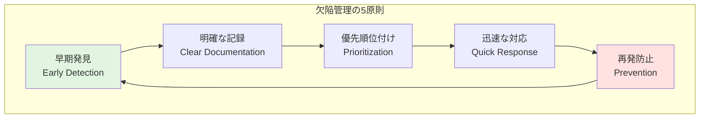
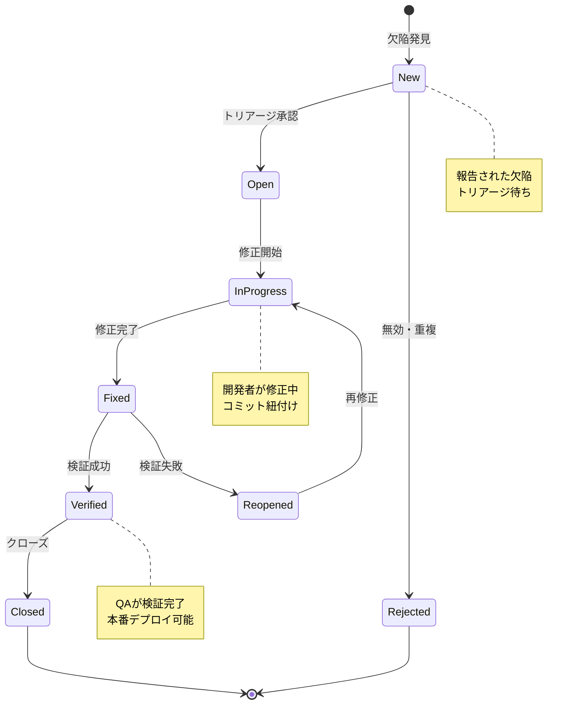

# 欠陥管理ガイド

## ドキュメント情報
- **バージョン**: 1.0.0
- **最終更新**: 2025-10-27
- **ステータス**: アクティブ
- **対象者**: 全開発者、QAエンジニア、プロジェクトマネージャー
- **前提ドキュメント**: [testing-strategy.md](testing-strategy.md), [quality-metrics.md](quality-metrics.md)

## 目次
1. [欠陥管理の基本原則](#欠陥管理の基本原則)
2. [欠陥ライフサイクル](#欠陥ライフサイクル)
3. [欠陥の分類と優先度](#欠陥の分類と優先度)
4. [欠陥レポート作成](#欠陥レポート作成)
5. [トリアージプロセス](#トリアージプロセス)
6. [欠陥解決ワークフロー](#欠陥解決ワークフロー)
7. [根本原因分析](#根本原因分析)
8. [メトリクスとレポーティング](#メトリクスとレポーティング)
9. [予防策と継続的改善](#予防策と継続的改善)
10. [ツールと自動化](#ツールと自動化)
11. [Devin AIガイドライン](#devin-aiガイドライン)

---

## 欠陥管理の基本原則

### 定義と目的

**欠陥（Defect/Bug）とは**:
- ソフトウェアが期待される動作をしない状態
- 仕様や要件からの逸脱
- ユーザーエクスペリエンスを損なう問題

**欠陥管理の目的**:
- **品質向上**: システムの信頼性と安定性を確保
- **リスク軽減**: クリティカルな問題の早期発見と修正
- **透明性**: 問題の可視化とステークホルダーへの共有
- **継続的改善**: パターン分析による再発防止

### 欠陥管理の原則



**欠陥管理の5原則の詳細**:
1. **早期発見（Early Detection）**: 開発プロセスの早い段階で欠陥を検出することでコスト削減
2. **明確な記録（Clear Documentation）**: 再現可能な詳細情報を記録し、迅速な解決を支援
3. **優先順位付け（Prioritization）**: ビジネスインパクトに基づき適切にリソース配分
4. **迅速な対応（Quick Response）**: クリティカルな問題を素早く修正しリスクを最小化
5. **再発防止（Prevention）**: 根本原因を分析し、同様の問題の再発を防止

### 欠陥管理のベストプラクティス

| プラクティス | 説明 | 効果 |
|--------------|------|------|
| **早期発見** | 開発段階での継続的テスト | コスト削減、修正容易 |
| **明確な記録** | 再現手順と証拠の完全な記録 | 解決時間短縮 |
| **適切な優先度** | ビジネスインパクト重視 | リソース最適配分 |
| **迅速なフィードバック** | 発見から報告まで即座に | 対応速度向上 |
| **定期的レビュー** | バックログの見直し | 放置問題の防止 |
| **根本原因分析** | パターンとトレンドの分析 | 再発防止 |

---

## 欠陥ライフサイクル

### ライフサイクルの全体像



**各ステータスの詳細説明**:
- **New**: 欠陥が報告され、トリアージ待ちの状態
- **Open**: トリアージで承認され、修正待ちキューに入った状態
- **Rejected**: 無効、重複、または仕様通りと判断されクローズ
- **In Progress**: 開発者が修正作業中
- **Fixed**: 修正完了、検証待ち
- **Verified**: QAが検証し修正を確認
- **Reopened**: 検証で問題が発見され再修正が必要
- **Closed**: 完全に解決し終了

### ステータス遷移ルール

<details>
<summary>ステータス遷移の実装例</summary>

```kotlin
// 欠陥ステータス定義
enum class DefectStatus {
    NEW,
    OPEN,
    IN_PROGRESS,
    FIXED,
    VERIFIED,
    CLOSED,
    REJECTED,
    REOPENED
}

// ステータス遷移管理
class DefectStatusTransition {
    
    // 許可される遷移定義
    private val allowedTransitions = mapOf(
        DefectStatus.NEW to listOf(
            DefectStatus.OPEN,
            DefectStatus.REJECTED
        ),
        DefectStatus.OPEN to listOf(
            DefectStatus.IN_PROGRESS,
            DefectStatus.REJECTED
        ),
        DefectStatus.IN_PROGRESS to listOf(
            DefectStatus.FIXED,
            DefectStatus.OPEN  // 一時保留
        ),
        DefectStatus.FIXED to listOf(
            DefectStatus.VERIFIED,
            DefectStatus.REOPENED
        ),
        DefectStatus.REOPENED to listOf(
            DefectStatus.IN_PROGRESS
        ),
        DefectStatus.VERIFIED to listOf(
            DefectStatus.CLOSED,
            DefectStatus.REOPENED  // 追加問題発見
        )
    )
    
    // 遷移可能性チェック
    fun canTransition(
        from: DefectStatus,
        to: DefectStatus
    ): Boolean {
        return allowedTransitions[from]?.contains(to) ?: false
    }
    
    // 遷移実行
    fun transition(
        defect: Defect,
        newStatus: DefectStatus,
        actor: User,
        comment: String
    ): DefectTransitionResult {
        // 遷移可能性チェック
        if (!canTransition(defect.status, newStatus)) {
            return DefectTransitionResult.Failure(
                reason = "Invalid transition from ${defect.status} to $newStatus"
            )
        }
        
        // 必須条件チェック
        val validationResult = validateTransitionRequirements(
            defect, newStatus, actor
        )
        if (!validationResult.isValid) {
            return DefectTransitionResult.Failure(
                reason = validationResult.reason
            )
        }
        
        // 遷移実行
        val oldStatus = defect.status
        defect.status = newStatus
        defect.updatedBy = actor
        defect.updatedAt = getCurrentTimestamp()
        
        // 履歴記録
        defect.history.add(
            DefectHistoryEntry(
                from = oldStatus,
                to = newStatus,
                actor = actor,
                timestamp = getCurrentTimestamp(),
                comment = comment
            )
        )
        
        // 通知送信
        sendStatusChangeNotification(defect, oldStatus, newStatus)
        
        return DefectTransitionResult.Success(defect)
    }
    
    // 遷移要件検証
    private fun validateTransitionRequirements(
        defect: Defect,
        newStatus: DefectStatus,
        actor: User
    ): ValidationResult {
        return when (newStatus) {
            DefectStatus.IN_PROGRESS -> {
                // 担当者が割り当てられているか
                if (defect.assignee == null) {
                    ValidationResult.Invalid("Assignee must be set")
                } else {
                    ValidationResult.Valid
                }
            }
            DefectStatus.FIXED -> {
                // 修正内容が記録されているか
                if (defect.fixDescription.isNullOrBlank()) {
                    ValidationResult.Invalid("Fix description is required")
                } else if (defect.fixCommits.isEmpty()) {
                    ValidationResult.Invalid("At least one commit must be linked")
                } else {
                    ValidationResult.Valid
                }
            }
            DefectStatus.VERIFIED -> {
                // 検証者が設定されているか
                if (!actor.hasRole(Role.QA_ENGINEER)) {
                    ValidationResult.Invalid("Only QA can verify fixes")
                } else {
                    ValidationResult.Valid
                }
            }
            else -> ValidationResult.Valid
        }
    }
}
```

</details>

### ライフサイクルメトリクス

**重要な測定指標**:
- **発見から修正までの時間（Time to Fix）**: 欠陥報告から修正完了までの経過時間
- **発見から検証までの時間（Time to Verify）**: 報告から検証完了までの総時間
- **再オープン率（Reopen Rate）**: 一度修正された欠陥が再度オープンになる割合
- **平均滞留時間（Average Age）**: 各ステータスでの平均滞在時間

---

