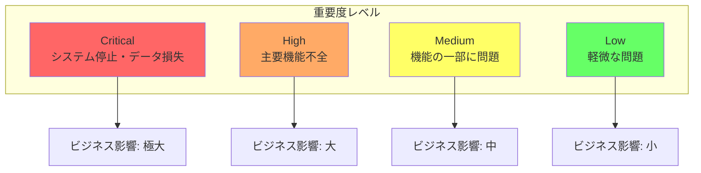
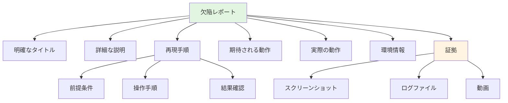

# 欠陥管理標準

## 欠陥の分類と優先度

### 重要度（Severity）分類



**重要度レベルの詳細基準**:

| 重要度 | 定義 | 例 | 対応目標 |
|--------|------|----|----|
| **Critical** | システム停止、データ損失、セキュリティ侵害 | ・本番サービス全面停止<br/>・データベースクラッシュ<br/>・SQLインジェクション脆弱性 | 即座（数時間以内） |
| **High** | 主要機能が使用不可、多数のユーザーに影響 | ・決済処理の失敗<br/>・ログイン不能<br/>・データ保存の失敗 | 24時間以内 |
| **Medium** | 機能の一部に問題、回避策あり | ・検索結果の不正確さ<br/>・レポート生成の遅延<br/>・UI表示の乱れ | 1週間以内 |
| **Low** | 軽微な問題、ユーザー体験への影響小 | ・タイポ<br/>・レイアウト微調整<br/>・ツールチップの誤り | 次回リリース |

### 優先度（Priority）設定

**優先度マトリクス**:

| 重要度 / 影響範囲 | 全ユーザー | 多数のユーザー | 一部のユーザー | 稀なケース |
|-------------------|------------|----------------|----------------|------------|
| **Critical** | P1 | P1 | P1 | P2 |
| **High** | P1 | P2 | P2 | P3 |
| **Medium** | P2 | P2 | P3 | P3 |
| **Low** | P3 | P3 | P4 | P4 |

**優先度定義**:
- **P1（最優先）**: 即座の対応が必要、他の作業を中断
- **P2（高優先）**: 現在のスプリント内で対応
- **P3（中優先）**: 次のスプリントで計画的に対応
- **P4（低優先）**: バックログ管理、適切なタイミングで対応

<details>
<summary>優先度決定ロジックの実装例</summary>

```kotlin
// 優先度決定エンジン
class PriorityDecisionEngine {
    
    fun determinePriority(defect: Defect): Priority {
        val severity = defect.severity
        val impactScope = calculateImpactScope(defect)
        val businessCriticality = assessBusinessCriticality(defect)
        val workaroundAvailable = defect.hasWorkaround
        
        // 基本優先度マトリクス
        val basePriority = when (severity) {
            Severity.CRITICAL -> {
                when (impactScope) {
                    ImpactScope.ALL_USERS -> Priority.P1
                    ImpactScope.MANY_USERS -> Priority.P1
                    ImpactScope.SOME_USERS -> Priority.P1
                    ImpactScope.RARE -> Priority.P2
                }
            }
            Severity.HIGH -> {
                when (impactScope) {
                    ImpactScope.ALL_USERS -> Priority.P1
                    ImpactScope.MANY_USERS -> Priority.P2
                    ImpactScope.SOME_USERS -> Priority.P2
                    ImpactScope.RARE -> Priority.P3
                }
            }
            Severity.MEDIUM -> {
                when (impactScope) {
                    ImpactScope.ALL_USERS -> Priority.P2
                    ImpactScope.MANY_USERS -> Priority.P2
                    ImpactScope.SOME_USERS -> Priority.P3
                    ImpactScope.RARE -> Priority.P3
                }
            }
            Severity.LOW -> Priority.P3
        }
        
        // 調整ファクター適用
        return adjustPriority(
            basePriority,
            businessCriticality,
            workaroundAvailable
        )
    }
    
    // 影響範囲の計算
    private fun calculateImpactScope(defect: Defect): ImpactScope {
        val affectedUsers = defect.affectedUserCount
        val totalUsers = getTotalActiveUsers()
        val percentage = (affectedUsers.toDouble() / totalUsers) * 100
        
        return when {
            percentage >= 50 -> ImpactScope.ALL_USERS
            percentage >= 10 -> ImpactScope.MANY_USERS
            percentage >= 1 -> ImpactScope.SOME_USERS
            else -> ImpactScope.RARE
        }
    }
    
    // ビジネス重要度の評価
    private fun assessBusinessCriticality(defect: Defect): BusinessCriticality {
        return when {
            defect.affectsRevenue() -> BusinessCriticality.CRITICAL
            defect.affectsCompliance() -> BusinessCriticality.CRITICAL
            defect.affectsUserRetention() -> BusinessCriticality.HIGH
            defect.affectsUserExperience() -> BusinessCriticality.MEDIUM
            else -> BusinessCriticality.LOW
        }
    }
    
    // 優先度調整
    private fun adjustPriority(
        basePriority: Priority,
        businessCriticality: BusinessCriticality,
        workaroundAvailable: Boolean
    ): Priority {
        var adjustedPriority = basePriority
        
        // ビジネス重要度による引き上げ
        if (businessCriticality == BusinessCriticality.CRITICAL) {
            adjustedPriority = when (adjustedPriority) {
                Priority.P2 -> Priority.P1
                Priority.P3 -> Priority.P2
                else -> adjustedPriority
            }
        }
        
        // 回避策がある場合は引き下げ
        if (workaroundAvailable && adjustedPriority != Priority.P1) {
            adjustedPriority = when (adjustedPriority) {
                Priority.P2 -> Priority.P3
                Priority.P3 -> Priority.P4
                else -> adjustedPriority
            }
        }
        
        return adjustedPriority
    }
}
```

</details>

### 欠陥タイプ分類

**機能別分類**:
- **Functional**: 機能が仕様通り動作しない
- **Performance**: パフォーマンス要件を満たさない
- **Security**: セキュリティ脆弱性
- **Usability**: ユーザビリティの問題
- **Compatibility**: ブラウザ、デバイス、OS互換性
- **Regression**: 以前は動作していたが壊れた

**原因別分類**:
- **Logic Error**: ロジックの誤り
- **Data Error**: データの問題
- **Configuration Error**: 設定の誤り
- **Integration Error**: 統合部分の問題
- **Environment Error**: 環境依存の問題

---

## 欠陥レポート作成

### 効果的な欠陥レポートの要素

**必須情報**:



**欠陥レポートの構成要素説明**:
- **明確なタイトル**: 問題を簡潔に要約（例: "決済画面でクレジットカード情報が保存されない"）
- **詳細な説明**: 何が問題か、どのような影響があるかを具体的に記述
- **再現手順**: 誰でも同じ問題を再現できるステップバイステップの手順
- **期待される動作**: 本来どうあるべきかの説明
- **実際の動作**: 実際に何が起こったかの説明
- **環境情報**: OS、ブラウザ、バージョン、デバイスなどの詳細
- **証拠**: スクリーンショット、ログ、動画など問題を示す視覚的証拠

### 欠陥レポートテンプレート

<details>
<summary>欠陥レポートテンプレートの実装例</summary>

```kotlin
// 欠陥レポートデータ構造
data class DefectReport(
    // 基本情報
    val id: String,
    val title: String,
    val description: String,
    
    // 分類
    val severity: Severity,
    val priority: Priority,
    val type: DefectType,
    val category: Category,
    
    // 再現情報
    val preconditions: List<String>,
    val stepsToReproduce: List<ReproductionStep>,
    val expectedBehavior: String,
    val actualBehavior: String,
    
    // 環境情報
    val environment: EnvironmentInfo,
    
    // 証拠
    val attachments: List<Attachment>,
    
    // メタデータ
    val reporter: User,
    val reportedAt: Timestamp,
    val assignee: User? = null,
    val status: DefectStatus = DefectStatus.NEW,
    
    // 追加情報
    val relatedDefects: List<String> = emptyList(),
    val affectedVersions: List<String> = emptyList(),
    val tags: List<String> = emptyList()
)

// 再現手順
data class ReproductionStep(
    val stepNumber: Int,
    val action: String,
    val expectedResult: String? = null
)

// 環境情報
data class EnvironmentInfo(
    val operatingSystem: String,
    val browser: BrowserInfo? = null,
    val deviceType: DeviceType,
    val appVersion: String,
    val apiVersion: String? = null,
    val additionalInfo: Map<String, String> = emptyMap()
)

// ブラウザ情報
data class BrowserInfo(
    val name: String,
    val version: String,
    val viewport: Viewport? = null
)

// 欠陥レポートビルダー
class DefectReportBuilder {
    
    private var title: String = ""
    private var description: String = ""
    private var severity: Severity = Severity.MEDIUM
    private var stepsToReproduce: MutableList<ReproductionStep> = mutableListOf()
    private var expectedBehavior: String = ""
    private var actualBehavior: String = ""
    private var environment: EnvironmentInfo? = null
    private var attachments: MutableList<Attachment> = mutableListOf()
    
    fun withTitle(title: String) = apply {
        this.title = title
    }
    
    fun withDescription(description: String) = apply {
        this.description = description
    }
    
    fun withSeverity(severity: Severity) = apply {
        this.severity = severity
    }
    
    fun addReproductionStep(
        stepNumber: Int,
        action: String,
        expectedResult: String? = null
    ) = apply {
        stepsToReproduce.add(
            ReproductionStep(stepNumber, action, expectedResult)
        )
    }
    
    fun withExpectedBehavior(expected: String) = apply {
        this.expectedBehavior = expected
    }
    
    fun withActualBehavior(actual: String) = apply {
        this.actualBehavior = actual
    }
    
    fun withEnvironment(env: EnvironmentInfo) = apply {
        this.environment = env
    }
    
    fun addScreenshot(screenshot: ByteArray, filename: String) = apply {
        attachments.add(
            Attachment(
                type = AttachmentType.SCREENSHOT,
                data = screenshot,
                filename = filename
            )
        )
    }
    
    fun addLog(logContent: String, filename: String) = apply {
        attachments.add(
            Attachment(
                type = AttachmentType.LOG,
                data = logContent.toByteArray(),
                filename = filename
            )
        )
    }
    
    fun build(reporter: User): DefectReport {
        // バリデーション
        require(title.isNotBlank()) { "Title is required" }
        require(description.isNotBlank()) { "Description is required" }
        require(stepsToReproduce.isNotEmpty()) { "At least one reproduction step is required" }
        require(environment != null) { "Environment information is required" }
        
        return DefectReport(
            id = generateDefectId(),
            title = title,
            description = description,
            severity = severity,
            priority = Priority.UNASSIGNED,  // トリアージで決定
            type = DefectType.FUNCTIONAL,  // デフォルト
            category = Category.UNCATEGORIZED,
            preconditions = emptyList(),
            stepsToReproduce = stepsToReproduce,
            expectedBehavior = expectedBehavior,
            actualBehavior = actualBehavior,
            environment = environment!!,
            attachments = attachments,
            reporter = reporter,
            reportedAt = getCurrentTimestamp()
        )
    }
}

// 使用例
fun createDefectReport(): DefectReport {
    return DefectReportBuilder()
        .withTitle("Payment fails on checkout page")
        .withDescription("Users cannot complete payment when using Visa cards")
        .withSeverity(Severity.HIGH)
        .addReproductionStep(1, "Navigate to checkout page")
        .addReproductionStep(2, "Enter Visa card details")
        .addReproductionStep(3, "Click 'Pay Now' button")
        .withExpectedBehavior("Payment is processed successfully and confirmation page is shown")
        .withActualBehavior("Error message 'Payment failed' is displayed")
        .withEnvironment(
            EnvironmentInfo(
                operatingSystem = "Windows 11",
                browser = BrowserInfo("Chrome", "120.0.0"),
                deviceType = DeviceType.DESKTOP,
                appVersion = "2.5.0"
            )
        )
        .addScreenshot(captureScreenshot(), "payment-error.png")
        .addLog(getApplicationLog(), "app.log")
        .build(currentUser)
}
```

</details>

### 再現手順の書き方

**良い再現手順の例**:

```
前提条件:
- ユーザーがログイン済み
- カートに商品が1つ以上入っている
- テスト用クレジットカード情報を使用

再現手順:
1. チェックアウトページに移動（URL: /checkout）
2. 配送先住所フォームに以下を入力:
   - 住所: "123 Test Street"
   - 市区町村: "Test City"
   - 郵便番号: "12345"
3. 「次へ」ボタンをクリック
4. 支払方法として「クレジットカード」を選択
5. カード情報を入力:
   - カード番号: 4111 1111 1111 1111
   - 有効期限: 12/25
   - CVV: 123
6. 「支払いを確定」ボタンをクリック

期待される結果:
- 決済が正常に処理される
- 注文確認ページが表示される
- 確認メールが送信される

実際の結果:
- エラーメッセージ「決済処理に失敗しました」が表示される
- ページがリロードされる
- 注文は作成されない
```

### 欠陥レポートの品質チェックリスト

- ✅ タイトルが問題を明確に要約している
- ✅ 重要度と優先度が適切に設定されている
- ✅ 再現手順が明確で、誰でも再現可能
- ✅ 期待される動作と実際の動作が明記されている
- ✅ 環境情報（OS、ブラウザ、バージョン）が記載されている
- ✅ スクリーンショットまたはログが添付されている
- ✅ 関連する欠陥や重複がないか確認済み
- ✅ ビジネスへの影響が説明されている

---

