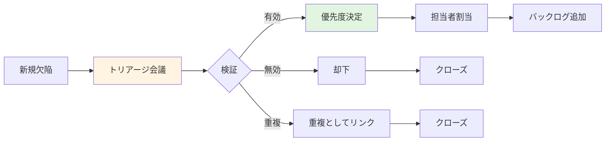
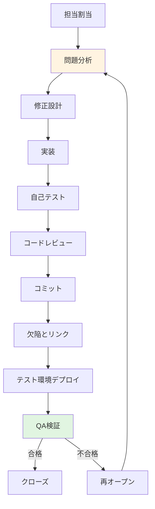

# 欠陥管理標準

## トリアージプロセス

### トリアージの目的と実施



**トリアージプロセスの各ステップ**:
1. **新規欠陥**: 報告された欠陥がトリアージ待ちキューに入る
2. **トリアージ会議**: チームで欠陥を評価（定期開催: 日次または週次）
3. **検証**: 欠陥の有効性、重複性、再現性を確認
4. **優先度決定**: ビジネスインパクトとリスクに基づき優先度を設定
5. **担当者割当**: 適切なスキルを持つ開発者に割り当て
6. **バックログ追加**: スプリントまたはリリース計画に組み込み

### トリアージ会議

**参加者**:
- **開発リード**: 技術的実現可能性の評価
- **QAリード**: 品質への影響評価
- **プロダクトオーナー**: ビジネス優先度の決定
- **報告者**: 必要に応じて詳細説明

**実施頻度**:
- **クリティカル欠陥**: 即座（随時）
- **通常欠陥**: 日次または週2-3回
- **低優先度**: 週次

**トリアージ基準**:

<details>
<summary>トリアージ判断ロジックの実装例</summary>

```kotlin
// トリアージ判断エンジン
class TriageDecisionEngine {
    
    fun performTriage(defect: Defect): TriageDecision {
        // ステップ1: 有効性検証
        val validationResult = validateDefect(defect)
        if (!validationResult.isValid) {
            return TriageDecision.Reject(
                reason = validationResult.reason
            )
        }
        
        // ステップ2: 重複チェック
        val duplicateCheck = checkForDuplicates(defect)
        if (duplicateCheck.isDuplicate) {
            return TriageDecision.MarkAsDuplicate(
                originalDefectId = duplicateCheck.originalDefectId
            )
        }
        
        // ステップ3: 優先度決定
        val priority = determinePriority(defect)
        
        // ステップ4: 担当者割当
        val assignee = findBestAssignee(defect)
        
        // ステップ5: スプリント計画
        val targetSprint = determineTargetSprint(priority, defect)
        
        return TriageDecision.Accept(
            priority = priority,
            assignee = assignee,
            targetSprint = targetSprint,
            estimatedEffort = estimateEffort(defect)
        )
    }
    
    // 有効性検証
    private fun validateDefect(defect: Defect): ValidationResult {
        // 再現可能性チェック
        if (!isReproducible(defect)) {
            return ValidationResult.Invalid(
                "Cannot reproduce the issue"
            )
        }
        
        // 完全性チェック
        if (!hasCompleteInformation(defect)) {
            return ValidationResult.Invalid(
                "Incomplete information - needs more details"
            )
        }
        
        // 仕様確認
        if (isExpectedBehavior(defect)) {
            return ValidationResult.Invalid(
                "This is expected behavior, not a defect"
            )
        }
        
        return ValidationResult.Valid
    }
    
    // 重複チェック
    private fun checkForDuplicates(defect: Defect): DuplicateCheckResult {
        val existingDefects = searchSimilarDefects(defect)
        
        for (existing in existingDefects) {
            val similarity = calculateSimilarity(defect, existing)
            if (similarity > 0.85) {  // 85%以上の類似度
                return DuplicateCheckResult(
                    isDuplicate = true,
                    originalDefectId = existing.id
                )
            }
        }
        
        return DuplicateCheckResult(isDuplicate = false)
    }
    
    // 類似度計算
    private fun calculateSimilarity(
        defect1: Defect,
        defect2: Defect
    ): Double {
        val titleSimilarity = calculateTextSimilarity(
            defect1.title, defect2.title
        )
        val descriptionSimilarity = calculateTextSimilarity(
            defect1.description, defect2.description
        )
        val componentSimilarity = if (defect1.component == defect2.component) 1.0 else 0.0
        
        return (titleSimilarity * 0.5 + 
                descriptionSimilarity * 0.3 + 
                componentSimilarity * 0.2)
    }
    
    // 担当者選定
    private fun findBestAssignee(defect: Defect): User {
        val candidates = findQualifiedDevelopers(defect)
        
        // ワークロードを考慮
        val workload = candidates.associateWith { dev ->
            getCurrentWorkload(dev)
        }
        
        // 専門性を考慮
        val expertise = candidates.associateWith { dev ->
            getExpertiseScore(dev, defect.component)
        }
        
        // 最適な担当者を選択
        return candidates.maxByOrNull { dev ->
            val workloadScore = 1.0 - (workload[dev] ?: 0.0)
            val expertiseScore = expertise[dev] ?: 0.0
            workloadScore * 0.4 + expertiseScore * 0.6
        } ?: throw IllegalStateException("No available assignee")
    }
    
    // スプリント決定
    private fun determineTargetSprint(
        priority: Priority,
        defect: Defect
    ): Sprint {
        return when (priority) {
            Priority.P1 -> getCurrentSprint()
            Priority.P2 -> {
                val currentSprint = getCurrentSprint()
                if (currentSprint.hasCapacity()) {
                    currentSprint
                } else {
                    getNextSprint()
                }
            }
            Priority.P3 -> getNextSprint()
            Priority.P4 -> getBacklogSprint()
        }
    }
}
```

</details>

### トリアージ結果の記録

**トリアージ結果に含めるべき情報**:
- トリアージ日時
- 参加者
- 決定事項（承認/却下/重複）
- 優先度と根拠
- 担当者
- 対応期限
- 追加の調査事項

---

## 欠陥解決ワークフロー

### 開発者による修正プロセス



**修正プロセスの各ステップ詳細**:
1. **担当割当**: トリアージで決定された担当者が欠陥を受け取る
2. **問題分析**: 根本原因を特定、影響範囲を調査
3. **修正設計**: 修正アプローチを設計、レビューで合意
4. **実装**: コードを修正、ユニットテストを追加/更新
5. **自己テスト**: 開発者が修正を検証、関連機能のリグレッションチェック
6. **コードレビュー**: ピアレビューで品質確認
7. **コミット**: 適切なコミットメッセージとともにリポジトリへ
8. **欠陥とリンク**: コミットと欠陥チケットを紐付け
9. **テスト環境デプロイ**: QA環境へデプロイ
10. **QA検証**: QAチームが修正を検証

<details>
<summary>修正プロセス管理の実装例</summary>

```kotlin
// 修正ワークフロー管理
class DefectFixWorkflow {
    
    // 修正開始
    fun startFix(defect: Defect, developer: User): FixSession {
        // ステータス更新
        defect.status = DefectStatus.IN_PROGRESS
        defect.assignee = developer
        defect.fixStartedAt = getCurrentTimestamp()
        
        // ブランチ作成推奨
        val branchName = generateFixBranchName(defect)
        
        return FixSession(
            defect = defect,
            developer = developer,
            branchName = branchName,
            startTime = getCurrentTimestamp()
        )
    }
    
    // 修正完了
    fun completeFix(
        session: FixSession,
        fixDescription: String,
        commits: List<CommitInfo>
    ): FixResult {
        val defect = session.defect
        
        // 必須情報チェック
        require(fixDescription.isNotBlank()) {
            "Fix description is required"
        }
        require(commits.isNotEmpty()) {
            "At least one commit must be provided"
        }
        
        // 欠陥情報更新
        defect.fixDescription = fixDescription
        defect.fixCommits = commits
        defect.fixCompletedAt = getCurrentTimestamp()
        defect.status = DefectStatus.FIXED
        
        // コミットにリンク
        commits.forEach { commit ->
            linkCommitToDefect(commit, defect)
        }
        
        // 通知
        notifyQAForVerification(defect)
        
        return FixResult.Success(defect)
    }
    
    // ブランチ名生成
    private fun generateFixBranchName(defect: Defect): String {
        val sanitizedTitle = defect.title
            .lowercase()
            .replace(Regex("[^a-z0-9]+"), "-")
            .take(50)
        
        return "fix/${defect.id}-$sanitizedTitle"
    }
    
    // コミットと欠陥のリンク
    private fun linkCommitToDefect(commit: CommitInfo, defect: Defect) {
        // コミットメッセージに欠陥IDを含める
        val expectedPattern = Regex(".*${defect.id}.*")
        require(expectedPattern.matches(commit.message)) {
            "Commit message must reference defect ID: ${defect.id}"
        }
        
        // リンク記録
        defect.relatedCommits.add(commit.sha)
    }
}

// QA検証プロセス
class DefectVerificationProcess {
    
    // 検証開始
    fun startVerification(defect: Defect, qa: User): VerificationSession {
        require(defect.status == DefectStatus.FIXED) {
            "Defect must be in FIXED status for verification"
        }
        
        return VerificationSession(
            defect = defect,
            qa = qa,
            startTime = getCurrentTimestamp(),
            verificationPlan = generateVerificationPlan(defect)
        )
    }
    
    // 検証完了
    fun completeVerification(
        session: VerificationSession,
        result: VerificationResult
    ): DefectVerificationOutcome {
        val defect = session.defect
        
        return when (result) {
            is VerificationResult.Passed -> {
                // 検証成功
                defect.status = DefectStatus.VERIFIED
                defect.verifiedBy = session.qa
                defect.verifiedAt = getCurrentTimestamp()
                
                DefectVerificationOutcome.Approved(defect)
            }
            is VerificationResult.Failed -> {
                // 検証失敗 - 再オープン
                defect.status = DefectStatus.REOPENED
                defect.reopenReason = result.reason
                defect.reopenedAt = getCurrentTimestamp()
                
                // 開発者に通知
                notifyDeveloperOfReopening(defect, result.reason)
                
                DefectVerificationOutcome.Rejected(defect, result.reason)
            }
        }
    }
    
    // 検証計画生成
    private fun generateVerificationPlan(defect: Defect): VerificationPlan {
        return VerificationPlan(
            steps = listOf(
                "Verify the original reproduction steps no longer produce the defect",
                "Test edge cases related to the fix",
                "Perform regression testing on related features",
                "Verify fix description matches actual changes",
                "Check for any unintended side effects"
            ),
            testCases = findRelatedTestCases(defect),
            environments = listOf("QA", "Staging")
        )
    }
}
```

</details>

### コミットメッセージの規約

**推奨フォーマット**:

```
fix(component): Brief description of the fix

Fixes #DEFECT-123

Detailed explanation of the problem and solution.

- Root cause: [explanation]
- Changes made: [description]
- Impact: [scope of changes]

Testing:
- Added unit tests for edge cases
- Verified manually on local environment
- Regression tested related features
```

### 修正の検証基準

**QA検証チェックリスト**:
- ✅ 元の再現手順で問題が再現しないことを確認
- ✅ 修正説明が実際の変更と一致している
- ✅ エッジケースや境界値をテスト
- ✅ 関連機能のリグレッションテスト実施
- ✅ 異なる環境（ブラウザ、デバイス）で確認
- ✅ パフォーマンスへの影響を評価
- ✅ ドキュメントが更新されている（必要な場合）

---

