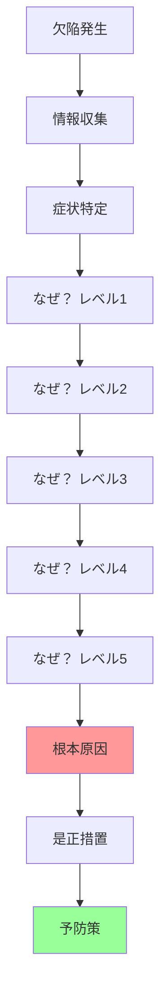

# 欠陥管理標準

## 根本原因分析

### RCA（Root Cause Analysis）プロセス



**5-Why分析の各レベル説明**:
- **欠陥発生**: 表面的な症状を観察
- **情報収集**: ログ、メトリクス、再現手順を集める
- **なぜ？×5**: 症状の原因を5回掘り下げる（5回は目安、必要に応じて調整）
- **根本原因**: 真の原因に到達
- **是正措置**: 根本原因を解消する対策
- **予防策**: 同様の問題の再発を防ぐ仕組み

### 5-Why分析の実施

<details>
<summary>5-Why分析の実装例</summary>

```kotlin
// 5-Why分析フレームワーク
class FiveWhyAnalysis {
    
    data class WhyLevel(
        val level: Int,
        val question: String,
        val answer: String,
        val evidence: List<String> = emptyList()
    )
    
    fun perform(defect: Defect): RootCauseAnalysisResult {
        val whyChain = mutableListOf<WhyLevel>()
        
        // レベル1: 症状
        whyChain.add(WhyLevel(
            level = 1,
            question = "What happened?",
            answer = defect.description
        ))
        
        // レベル2-5: 順次掘り下げ
        var currentQuestion = "Why did ${defect.description}?"
        
        for (level in 2..5) {
            val answer = analyzeAndAnswer(currentQuestion, defect, whyChain)
            
            whyChain.add(WhyLevel(
                level = level,
                question = currentQuestion,
                answer = answer,
                evidence = collectEvidence(answer)
            ))
            
            // 次の質問を生成
            currentQuestion = "Why $answer?"
            
            // 根本原因に到達したか確認
            if (isRootCause(answer)) {
                break
            }
        }
        
        val rootCause = whyChain.last().answer
        val correctiveActions = generateCorrectiveActions(rootCause)
        val preventiveMeasures = generatePreventiveMeasures(rootCause, whyChain)
        
        return RootCauseAnalysisResult(
            defect = defect,
            whyChain = whyChain,
            rootCause = rootCause,
            correctiveActions = correctiveActions,
            preventiveMeasures = preventiveMeasures
        )
    }
    
    // 根本原因判定
    private fun isRootCause(answer: String): Boolean {
        // プロセスの問題、システムの問題、または人的要因に到達
        val rootCauseIndicators = listOf(
            "no process in place",
            "insufficient training",
            "inadequate testing",
            "missing validation",
            "system limitation",
            "architectural issue"
        )
        
        return rootCauseIndicators.any { indicator ->
            answer.lowercase().contains(indicator)
        }
    }
    
    // 是正措置生成
    private fun generateCorrectiveActions(
        rootCause: String
    ): List<CorrectiveAction> {
        // 根本原因に基づき是正措置を提案
        return when {
            rootCause.contains("no process") -> listOf(
                CorrectiveAction(
                    type = ActionType.PROCESS_IMPROVEMENT,
                    description = "Establish formal process for this scenario",
                    priority = Priority.HIGH
                )
            )
            rootCause.contains("insufficient testing") -> listOf(
                CorrectiveAction(
                    type = ActionType.TEST_ENHANCEMENT,
                    description = "Add automated tests for this scenario",
                    priority = Priority.HIGH
                ),
                CorrectiveAction(
                    type = ActionType.TEST_COVERAGE,
                    description = "Increase test coverage for this component",
                    priority = Priority.MEDIUM
                )
            )
            rootCause.contains("inadequate training") -> listOf(
                CorrectiveAction(
                    type = ActionType.TRAINING,
                    description = "Provide training on this topic",
                    priority = Priority.MEDIUM
                )
            )
            else -> listOf(
                CorrectiveAction(
                    type = ActionType.OTHER,
                    description = "Address root cause: $rootCause",
                    priority = Priority.MEDIUM
                )
            )
        }
    }
    
    // 予防策生成
    private fun generatePreventiveMeasures(
        rootCause: String,
        whyChain: List<WhyLevel>
    ): List<PreventiveMeasure> {
        return listOf(
            PreventiveMeasure(
                category = "Process",
                measure = "Implement checks to prevent similar issues",
                implementation = "Add validation step in development process"
            ),
            PreventiveMeasure(
                category = "Automation",
                measure = "Automate detection of this issue type",
                implementation = "Add static analysis or runtime checks"
            ),
            PreventiveMeasure(
                category = "Knowledge Sharing",
                measure = "Document lessons learned",
                implementation = "Update team knowledge base with this case study"
            )
        )
    }
}

// RCA実施例: 本番環境でのデータ損失
fun exampleRCA(): RootCauseAnalysisResult {
    val defect = Defect(
        id = "DEFECT-456",
        title = "Customer data lost during update",
        description = "Customer records were deleted during profile update operation"
    )
    
    val analysis = FiveWhyAnalysis()
    
    // 手動での5-Why実施例
    val manualAnalysis = RootCauseAnalysisResult(
        defect = defect,
        whyChain = listOf(
            WhyLevel(
                level = 1,
                question = "What happened?",
                answer = "Customer records were deleted during profile update"
            ),
            WhyLevel(
                level = 2,
                question = "Why were customer records deleted?",
                answer = "The UPDATE query was incorrectly written as DELETE"
            ),
            WhyLevel(
                level = 3,
                question = "Why was the query incorrectly written?",
                answer = "Developer misunderstood the ORM method behavior"
            ),
            WhyLevel(
                level = 4,
                question = "Why did the developer misunderstand?",
                answer = "ORM documentation was unclear and no code review caught it"
            ),
            WhyLevel(
                level = 5,
                question = "Why didn't code review catch it?",
                answer = "No database operation review checklist existed"
            )
        ),
        rootCause = "No formal code review checklist for database operations",
        correctiveActions = listOf(
            CorrectiveAction(
                type = ActionType.PROCESS_IMPROVEMENT,
                description = "Create code review checklist for DB operations",
                priority = Priority.HIGH
            ),
            CorrectiveAction(
                type = ActionType.TRAINING,
                description = "Provide ORM training to team",
                priority = Priority.HIGH
            )
        ),
        preventiveMeasures = listOf(
            PreventiveMeasure(
                category = "Process",
                measure = "Mandatory DB operation review",
                implementation = "All DB changes require senior developer approval"
            ),
            PreventiveMeasure(
                category = "Automation",
                measure = "Add query validation",
                implementation = "Implement pre-deployment query analysis tool"
            ),
            PreventiveMeasure(
                category = "Testing",
                measure = "Enhance integration tests",
                implementation = "Add tests verifying data integrity after updates"
            )
        )
    )
    
    return manualAnalysis
}
```

</details>

### フィッシュボーン図（Ishikawa Diagram）

**主要カテゴリ**:
- **People（人）**: スキル、経験、トレーニング
- **Process（プロセス）**: 手順、ワークフロー、レビュー
- **Technology（技術）**: ツール、システム、アーキテクチャ
- **Environment（環境）**: インフラ、設定、依存関係
- **Data（データ）**: 品質、整合性、可用性

### 是正措置と予防策

**是正措置（Corrective Actions）**:
- 即座の問題解決
- 現在の欠陥に対する対処
- 短期的な修正

**予防策（Preventive Measures）**:
- 再発防止
- プロセス改善
- 長期的な品質向上

---

