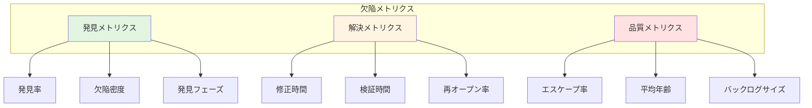
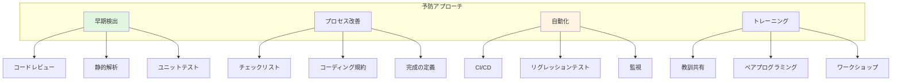

# 欠陥管理標準

## メトリクスとレポーティング

### 主要メトリクス



**メトリクスの説明**:

**発見メトリクス**:
- **発見率**: 単位時間あたりの新規欠陥数
- **欠陥密度**: コード行数あたりの欠陥数（例: 1000行あたり）
- **発見フェーズ**: どの開発フェーズで発見されたか

**解決メトリクス**:
- **修正時間（TTF: Time To Fix）**: 報告から修正完了までの時間
- **検証時間（TTV: Time To Verify）**: 修正から検証完了までの時間
- **再オープン率**: 一度修正された欠陥が再度開かれる割合

**品質メトリクス**:
- **エスケープ率**: 本番環境で発見される欠陥の割合
- **平均年齢**: 欠陥が未解決のまま残っている平均日数
- **バックログサイズ**: 未解決欠陥の総数

<details>
<summary>メトリクス収集と計算の実装例</summary>

```kotlin
// 欠陥メトリクス計算エンジン
class DefectMetricsCalculator {
    
    // 修正時間（TTF）計算
    fun calculateTimeToFix(defects: List<Defect>): MetricResult {
        val fixedDefects = defects.filter { it.status == DefectStatus.FIXED }
        
        val times = fixedDefects.map { defect ->
            Duration.between(
                defect.reportedAt,
                defect.fixCompletedAt
            )
        }
        
        return MetricResult(
            average = times.map { it.toHours() }.average(),
            median = calculateMedian(times.map { it.toHours() }),
            p95 = calculatePercentile(times.map { it.toHours() }, 95),
            unit = "hours"
        )
    }
    
    // 欠陥密度計算
    fun calculateDefectDensity(
        defects: List<Defect>,
        linesOfCode: Long
    ): Double {
        val defectCount = defects.size
        return (defectCount.toDouble() / linesOfCode) * 1000  // per 1000 LOC
    }
    
    // 再オープン率計算
    fun calculateReopenRate(defects: List<Defect>): Double {
        val fixedDefects = defects.filter { 
            it.status == DefectStatus.FIXED || 
            it.status == DefectStatus.VERIFIED ||
            it.status == DefectStatus.CLOSED
        }
        
        val reopenedDefects = defects.filter { 
            it.history.any { entry -> 
                entry.to == DefectStatus.REOPENED 
            }
        }
        
        return if (fixedDefects.isEmpty()) {
            0.0
        } else {
            (reopenedDefects.size.toDouble() / fixedDefects.size) * 100
        }
    }
    
    // エスケープ率計算
    fun calculateEscapeRate(
        defects: List<Defect>,
        period: TimePeriod
    ): Double {
        val totalDefects = defects.filter { 
            it.reportedAt in period 
        }
        
        val productionDefects = totalDefects.filter { 
            it.discoveryPhase == Phase.PRODUCTION 
        }
        
        return if (totalDefects.isEmpty()) {
            0.0
        } else {
            (productionDefects.size.toDouble() / totalDefects.size) * 100
        }
    }
    
    // 重要度別分布
    fun calculateSeverityDistribution(
        defects: List<Defect>
    ): Map<Severity, Int> {
        return defects.groupingBy { it.severity }.eachCount()
    }
    
    // 優先度別分布
    fun calculatePriorityDistribution(
        defects: List<Defect>
    ): Map<Priority, Int> {
        return defects.groupingBy { it.priority }.eachCount()
    }
    
    // トレンド分析
    fun analyzeTrend(
        defects: List<Defect>,
        period: TimePeriod,
        interval: TimeInterval
    ): TrendAnalysis {
        val dataPoints = mutableListOf<TrendDataPoint>()
        
        var currentDate = period.start
        while (currentDate <= period.end) {
            val nextDate = currentDate.plus(interval)
            
            val periodDefects = defects.filter { 
                it.reportedAt >= currentDate && 
                it.reportedAt < nextDate 
            }
            
            dataPoints.add(TrendDataPoint(
                date = currentDate,
                newDefects = periodDefects.size,
                fixedDefects = periodDefects.count { it.status == DefectStatus.FIXED },
                openDefects = calculateOpenDefects(defects, nextDate)
            ))
            
            currentDate = nextDate
        }
        
        return TrendAnalysis(
            period = period,
            interval = interval,
            dataPoints = dataPoints,
            trend = calculateTrendDirection(dataPoints)
        )
    }
    
    // オープン欠陥数計算
    private fun calculateOpenDefects(
        allDefects: List<Defect>,
        asOfDate: Timestamp
    ): Int {
        return allDefects.count { defect ->
            defect.reportedAt <= asOfDate &&
            (defect.closedAt == null || defect.closedAt!! > asOfDate)
        }
    }
    
    // トレンド方向計算
    private fun calculateTrendDirection(
        dataPoints: List<TrendDataPoint>
    ): TrendDirection {
        if (dataPoints.size < 2) return TrendDirection.STABLE
        
        val recentPoints = dataPoints.takeLast(5)
        val avgRecent = recentPoints.map { it.openDefects }.average()
        
        val olderPoints = dataPoints.dropLast(5).takeLast(5)
        val avgOlder = olderPoints.map { it.openDefects }.average()
        
        val change = ((avgRecent - avgOlder) / avgOlder) * 100
        
        return when {
            change > 10 -> TrendDirection.INCREASING
            change < -10 -> TrendDirection.DECREASING
            else -> TrendDirection.STABLE
        }
    }
}

// ダッシュボードデータ生成
class DefectDashboardGenerator {
    
    fun generateDashboard(
        defects: List<Defect>,
        period: TimePeriod
    ): DefectDashboard {
        val calculator = DefectMetricsCalculator()
        
        return DefectDashboard(
            period = period,
            summary = DashboardSummary(
                totalDefects = defects.size,
                openDefects = defects.count { it.isOpen() },
                criticalDefects = defects.count { it.severity == Severity.CRITICAL },
                p1Defects = defects.count { it.priority == Priority.P1 }
            ),
            metrics = DashboardMetrics(
                timeToFix = calculator.calculateTimeToFix(defects),
                reopenRate = calculator.calculateReopenRate(defects),
                escapeRate = calculator.calculateEscapeRate(defects, period)
            ),
            distributions = DashboardDistributions(
                bySeverity = calculator.calculateSeverityDistribution(defects),
                byPriority = calculator.calculatePriorityDistribution(defects),
                byComponent = defects.groupingBy { it.component }.eachCount()
            ),
            trend = calculator.analyzeTrend(
                defects, period, TimeInterval.WEEKLY
            )
        )
    }
}
```

</details>

### レポート生成

**定期レポート**:

| レポート種類 | 頻度 | 対象者 | 主要内容 |
|--------------|------|--------|----------|
| **日次レポート** | 毎日 | 開発チーム | 新規欠陥、クリティカル欠陥、当日の進捗 |
| **週次レポート** | 毎週 | チームリード、PM | メトリクストレンド、バックログ状況、問題点 |
| **スプリントレポート** | スプリント終了時 | 全チーム | スプリント内の品質、目標達成度、改善点 |
| **リリースレポート** | リリース前後 | ステークホルダー | リリース品質、既知の問題、リスク評価 |

### SLAとパフォーマンス目標

**推奨SLA**:

| 優先度 | 初回対応 | 修正完了目標 | エスカレーション |
|--------|----------|--------------|------------------|
| **P1** | 1時間以内 | 24時間以内 | 2時間未対応で上位へ |
| **P2** | 4時間以内 | 3日以内 | 8時間未対応で上位へ |
| **P3** | 1営業日以内 | 1週間以内 | 3日未対応で確認 |
| **P4** | 3営業日以内 | 次リリース | バックログで管理 |

---

## 予防策と継続的改善

### 欠陥予防戦略



**予防アプローチの各カテゴリ詳細**:

**早期検出**:
- **コードレビュー**: 全てのコード変更をピアレビュー
- **静的解析**: コンパイル時に潜在的問題を検出
- **ユニットテスト**: 開発と同時にテストを作成

**プロセス改善**:
- **チェックリスト**: タスク実行前の確認項目
- **コーディング規約**: 一貫性のあるコード品質
- **完成の定義**: 機能完成の明確な基準

**自動化**:
- **CI/CD**: 継続的インテグレーションとデプロイ
- **リグレッションテスト**: 既存機能の自動検証
- **監視**: 本番環境の問題を早期検出

**トレーニング**:
- **教訓共有**: 過去の失敗から学ぶ
- **ペアプログラミング**: 知識とスキルの共有
- **ワークショップ**: 定期的なスキルアップ

### 継続的改善サイクル

<details>
<summary>PDCAサイクルの実装例</summary>

```kotlin
// 継続的改善フレームワーク
class ContinuousImprovementCycle {
    
    // Plan: 改善計画
    fun plan(analysis: RootCauseAnalysisResult): ImprovementPlan {
        return ImprovementPlan(
            targetArea = identifyTargetArea(analysis),
            objectives = defineObjectives(analysis),
            actions = analysis.preventiveMeasures,
            successCriteria = defineSuccessCriteria(analysis),
            timeline = createTimeline(analysis.correctiveActions),
            owner = assignOwner(analysis.defect)
        )
    }
    
    // Do: 実行
    fun execute(plan: ImprovementPlan): ExecutionResult {
        val results = mutableListOf<ActionResult>()
        
        plan.actions.forEach { action ->
            val result = executeAction(action)
            results.add(result)
            
            // 進捗記録
            recordProgress(plan, action, result)
        }
        
        return ExecutionResult(
            plan = plan,
            actionResults = results,
            completionRate = calculateCompletionRate(results)
        )
    }
    
    // Check: 評価
    fun check(executionResult: ExecutionResult): EvaluationResult {
        val plan = executionResult.plan
        val metrics = measureOutcome(plan)
        
        val successMet = plan.successCriteria.all { criterion ->
            evaluateCriterion(criterion, metrics)
        }
        
        return EvaluationResult(
            successMet = successMet,
            metrics = metrics,
            findings = analyzeFindings(metrics, plan),
            recommendations = generateRecommendations(metrics, plan)
        )
    }
    
    // Act: 標準化または調整
    fun act(evaluation: EvaluationResult): ActionDecision {
        return if (evaluation.successMet) {
            // 成功 - 標準化
            ActionDecision.Standardize(
                practices = extractBestPractices(evaluation),
                documentation = createDocumentation(evaluation),
                training = planTraining(evaluation)
            )
        } else {
            // 改善必要 - 調整
            ActionDecision.Adjust(
                gaps = identifyGaps(evaluation),
                adjustedPlan = createAdjustedPlan(evaluation),
                escalation = determineEscalation(evaluation)
            )
        }
    }
    
    // 改善効果測定
    private fun measureOutcome(plan: ImprovementPlan): ImprovementMetrics {
        val before = getBaselineMetrics(plan.targetArea)
        val after = getCurrentMetrics(plan.targetArea)
        
        return ImprovementMetrics(
            baseline = before,
            current = after,
            improvement = calculateImprovement(before, after),
            trend = analyzeTrend(plan.targetArea)
        )
    }
    
    // ベストプラクティス抽出
    private fun extractBestPractices(
        evaluation: EvaluationResult
    ): List<BestPractice> {
        return evaluation.findings
            .filter { it.isPositive }
            .map { finding ->
                BestPractice(
                    category = finding.category,
                    description = finding.description,
                    evidence = finding.metrics,
                    applicability = determineApplicability(finding)
                )
            }
    }
}

// 改善追跡システム
class ImprovementTracker {
    
    private val initiatives = mutableListOf<ImprovementInitiative>()
    
    fun track(initiative: ImprovementInitiative) {
        initiatives.add(initiative)
    }
    
    fun getActiveInitiatives(): List<ImprovementInitiative> {
        return initiatives.filter { it.status == InitiativeStatus.ACTIVE }
    }
    
    fun generateProgressReport(): ImprovementProgressReport {
        return ImprovementProgressReport(
            totalInitiatives = initiatives.size,
            completed = initiatives.count { it.status == InitiativeStatus.COMPLETED },
            inProgress = initiatives.count { it.status == InitiativeStatus.ACTIVE },
            blocked = initiatives.count { it.status == InitiativeStatus.BLOCKED },
            impact = calculateOverallImpact(initiatives)
        )
    }
    
    private fun calculateOverallImpact(
        initiatives: List<ImprovementInitiative>
    ): ImpactMetrics {
        val completedInitiatives = initiatives.filter { 
            it.status == InitiativeStatus.COMPLETED 
        }
        
        return ImpactMetrics(
            defectReduction = completedInitiatives
                .sumOf { it.impact.defectReduction },
            timeToFixImprovement = completedInitiatives
                .map { it.impact.timeToFixImprovement }
                .average(),
            qualityScoreIncrease = completedInitiatives
                .sumOf { it.impact.qualityScoreIncrease }
        )
    }
}
```

</details>

### 教訓データベース

**知識管理**:
- **欠陥パターンカタログ**: 頻出する欠陥タイプとその対処法
- **ケーススタディ**: 重要な欠陥の詳細分析
- **ベストプラクティス集**: 効果的な予防策とアプローチ
- **アンチパターン**: 避けるべき実装や設計

---

