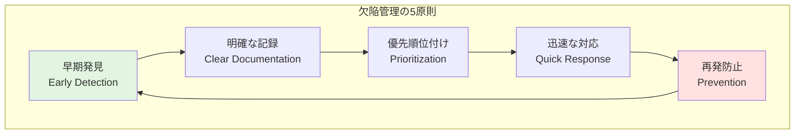
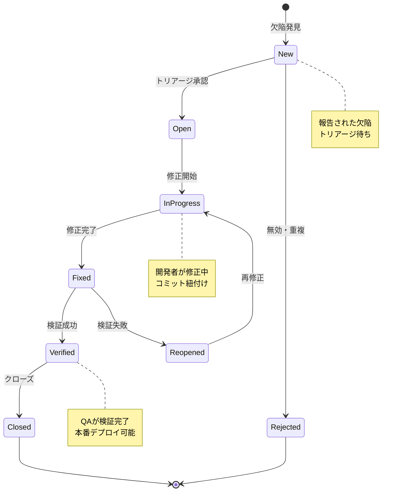
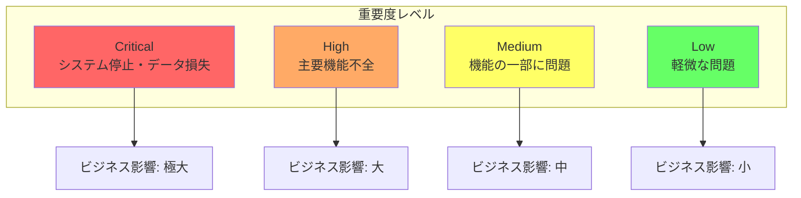
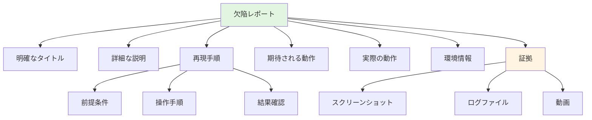
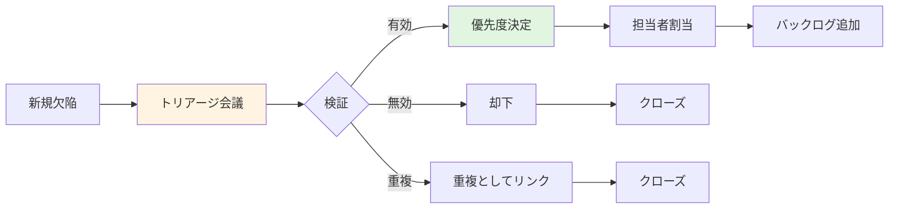
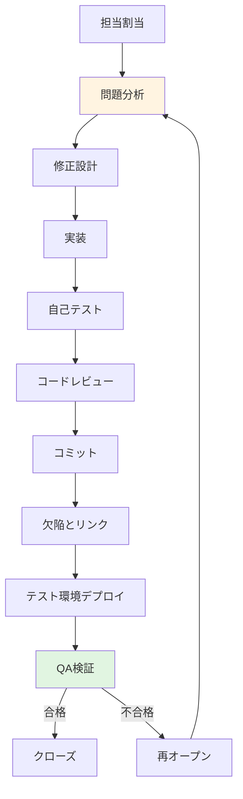
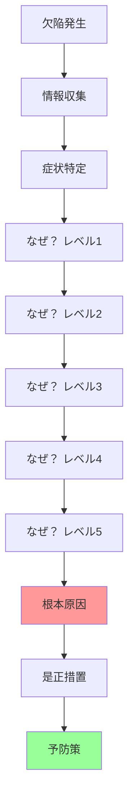
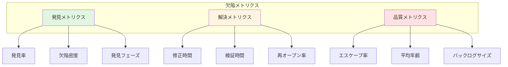
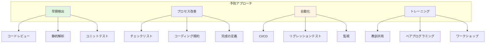

# 欠陥管理ガイド

## ドキュメント情報
- **バージョン**: 1.0.0
- **最終更新**: 2025-10-27
- **ステータス**: アクティブ
- **対象者**: 全開発者、QAエンジニア、プロジェクトマネージャー
- **前提ドキュメント**: [testing-strategy.md](testing-strategy.md), [quality-metrics.md](quality-metrics.md)

## 目次
1. [欠陥管理の基本原則](#欠陥管理の基本原則)
2. [欠陥ライフサイクル](#欠陥ライフサイクル)
3. [欠陥の分類と優先度](#欠陥の分類と優先度)
4. [欠陥レポート作成](#欠陥レポート作成)
5. [トリアージプロセス](#トリアージプロセス)
6. [欠陥解決ワークフロー](#欠陥解決ワークフロー)
7. [根本原因分析](#根本原因分析)
8. [メトリクスとレポーティング](#メトリクスとレポーティング)
9. [予防策と継続的改善](#予防策と継続的改善)
10. [ツールと自動化](#ツールと自動化)
11. [Devin AIガイドライン](#devin-aiガイドライン)

---

## 欠陥管理の基本原則

### 定義と目的

**欠陥（Defect/Bug）とは**:
- ソフトウェアが期待される動作をしない状態
- 仕様や要件からの逸脱
- ユーザーエクスペリエンスを損なう問題

**欠陥管理の目的**:
- **品質向上**: システムの信頼性と安定性を確保
- **リスク軽減**: クリティカルな問題の早期発見と修正
- **透明性**: 問題の可視化とステークホルダーへの共有
- **継続的改善**: パターン分析による再発防止

### 欠陥管理の原則



**欠陥管理の5原則の詳細**:
1. **早期発見（Early Detection）**: 開発プロセスの早い段階で欠陥を検出することでコスト削減
2. **明確な記録（Clear Documentation）**: 再現可能な詳細情報を記録し、迅速な解決を支援
3. **優先順位付け（Prioritization）**: ビジネスインパクトに基づき適切にリソース配分
4. **迅速な対応（Quick Response）**: クリティカルな問題を素早く修正しリスクを最小化
5. **再発防止（Prevention）**: 根本原因を分析し、同様の問題の再発を防止

### 欠陥管理のベストプラクティス

| プラクティス | 説明 | 効果 |
|--------------|------|------|
| **早期発見** | 開発段階での継続的テスト | コスト削減、修正容易 |
| **明確な記録** | 再現手順と証拠の完全な記録 | 解決時間短縮 |
| **適切な優先度** | ビジネスインパクト重視 | リソース最適配分 |
| **迅速なフィードバック** | 発見から報告まで即座に | 対応速度向上 |
| **定期的レビュー** | バックログの見直し | 放置問題の防止 |
| **根本原因分析** | パターンとトレンドの分析 | 再発防止 |

---

## 欠陥ライフサイクル

### ライフサイクルの全体像



**各ステータスの詳細説明**:
- **New**: 欠陥が報告され、トリアージ待ちの状態
- **Open**: トリアージで承認され、修正待ちキューに入った状態
- **Rejected**: 無効、重複、または仕様通りと判断されクローズ
- **In Progress**: 開発者が修正作業中
- **Fixed**: 修正完了、検証待ち
- **Verified**: QAが検証し修正を確認
- **Reopened**: 検証で問題が発見され再修正が必要
- **Closed**: 完全に解決し終了

### ステータス遷移ルール

<details>
<summary>ステータス遷移の実装例</summary>

```kotlin
// 欠陥ステータス定義
enum class DefectStatus {
    NEW,
    OPEN,
    IN_PROGRESS,
    FIXED,
    VERIFIED,
    CLOSED,
    REJECTED,
    REOPENED
}

// ステータス遷移管理
class DefectStatusTransition {
    
    // 許可される遷移定義
    private val allowedTransitions = mapOf(
        DefectStatus.NEW to listOf(
            DefectStatus.OPEN,
            DefectStatus.REJECTED
        ),
        DefectStatus.OPEN to listOf(
            DefectStatus.IN_PROGRESS,
            DefectStatus.REJECTED
        ),
        DefectStatus.IN_PROGRESS to listOf(
            DefectStatus.FIXED,
            DefectStatus.OPEN  // 一時保留
        ),
        DefectStatus.FIXED to listOf(
            DefectStatus.VERIFIED,
            DefectStatus.REOPENED
        ),
        DefectStatus.REOPENED to listOf(
            DefectStatus.IN_PROGRESS
        ),
        DefectStatus.VERIFIED to listOf(
            DefectStatus.CLOSED,
            DefectStatus.REOPENED  // 追加問題発見
        )
    )
    
    // 遷移可能性チェック
    fun canTransition(
        from: DefectStatus,
        to: DefectStatus
    ): Boolean {
        return allowedTransitions[from]?.contains(to) ?: false
    }
    
    // 遷移実行
    fun transition(
        defect: Defect,
        newStatus: DefectStatus,
        actor: User,
        comment: String
    ): DefectTransitionResult {
        // 遷移可能性チェック
        if (!canTransition(defect.status, newStatus)) {
            return DefectTransitionResult.Failure(
                reason = "Invalid transition from ${defect.status} to $newStatus"
            )
        }
        
        // 必須条件チェック
        val validationResult = validateTransitionRequirements(
            defect, newStatus, actor
        )
        if (!validationResult.isValid) {
            return DefectTransitionResult.Failure(
                reason = validationResult.reason
            )
        }
        
        // 遷移実行
        val oldStatus = defect.status
        defect.status = newStatus
        defect.updatedBy = actor
        defect.updatedAt = getCurrentTimestamp()
        
        // 履歴記録
        defect.history.add(
            DefectHistoryEntry(
                from = oldStatus,
                to = newStatus,
                actor = actor,
                timestamp = getCurrentTimestamp(),
                comment = comment
            )
        )
        
        // 通知送信
        sendStatusChangeNotification(defect, oldStatus, newStatus)
        
        return DefectTransitionResult.Success(defect)
    }
    
    // 遷移要件検証
    private fun validateTransitionRequirements(
        defect: Defect,
        newStatus: DefectStatus,
        actor: User
    ): ValidationResult {
        return when (newStatus) {
            DefectStatus.IN_PROGRESS -> {
                // 担当者が割り当てられているか
                if (defect.assignee == null) {
                    ValidationResult.Invalid("Assignee must be set")
                } else {
                    ValidationResult.Valid
                }
            }
            DefectStatus.FIXED -> {
                // 修正内容が記録されているか
                if (defect.fixDescription.isNullOrBlank()) {
                    ValidationResult.Invalid("Fix description is required")
                } else if (defect.fixCommits.isEmpty()) {
                    ValidationResult.Invalid("At least one commit must be linked")
                } else {
                    ValidationResult.Valid
                }
            }
            DefectStatus.VERIFIED -> {
                // 検証者が設定されているか
                if (!actor.hasRole(Role.QA_ENGINEER)) {
                    ValidationResult.Invalid("Only QA can verify fixes")
                } else {
                    ValidationResult.Valid
                }
            }
            else -> ValidationResult.Valid
        }
    }
}
```

</details>

### ライフサイクルメトリクス

**重要な測定指標**:
- **発見から修正までの時間（Time to Fix）**: 欠陥報告から修正完了までの経過時間
- **発見から検証までの時間（Time to Verify）**: 報告から検証完了までの総時間
- **再オープン率（Reopen Rate）**: 一度修正された欠陥が再度オープンになる割合
- **平均滞留時間（Average Age）**: 各ステータスでの平均滞在時間

---

## 欠陥の分類と優先度

### 重要度（Severity）分類



**重要度レベルの詳細基準**:

| 重要度 | 定義 | 例 | 対応目標 |
|--------|------|----|----|
| **Critical** | システム停止、データ損失、セキュリティ侵害 | ・本番サービス全面停止<br/>・データベースクラッシュ<br/>・SQLインジェクション脆弱性 | 即座（数時間以内） |
| **High** | 主要機能が使用不可、多数のユーザーに影響 | ・決済処理の失敗<br/>・ログイン不能<br/>・データ保存の失敗 | 24時間以内 |
| **Medium** | 機能の一部に問題、回避策あり | ・検索結果の不正確さ<br/>・レポート生成の遅延<br/>・UI表示の乱れ | 1週間以内 |
| **Low** | 軽微な問題、ユーザー体験への影響小 | ・タイポ<br/>・レイアウト微調整<br/>・ツールチップの誤り | 次回リリース |

### 優先度（Priority）設定

**優先度マトリクス**:

| 重要度 / 影響範囲 | 全ユーザー | 多数のユーザー | 一部のユーザー | 稀なケース |
|-------------------|------------|----------------|----------------|------------|
| **Critical** | P1 | P1 | P1 | P2 |
| **High** | P1 | P2 | P2 | P3 |
| **Medium** | P2 | P2 | P3 | P3 |
| **Low** | P3 | P3 | P4 | P4 |

**優先度定義**:
- **P1（最優先）**: 即座の対応が必要、他の作業を中断
- **P2（高優先）**: 現在のスプリント内で対応
- **P3（中優先）**: 次のスプリントで計画的に対応
- **P4（低優先）**: バックログ管理、適切なタイミングで対応

<details>
<summary>優先度決定ロジックの実装例</summary>

```kotlin
// 優先度決定エンジン
class PriorityDecisionEngine {
    
    fun determinePriority(defect: Defect): Priority {
        val severity = defect.severity
        val impactScope = calculateImpactScope(defect)
        val businessCriticality = assessBusinessCriticality(defect)
        val workaroundAvailable = defect.hasWorkaround
        
        // 基本優先度マトリクス
        val basePriority = when (severity) {
            Severity.CRITICAL -> {
                when (impactScope) {
                    ImpactScope.ALL_USERS -> Priority.P1
                    ImpactScope.MANY_USERS -> Priority.P1
                    ImpactScope.SOME_USERS -> Priority.P1
                    ImpactScope.RARE -> Priority.P2
                }
            }
            Severity.HIGH -> {
                when (impactScope) {
                    ImpactScope.ALL_USERS -> Priority.P1
                    ImpactScope.MANY_USERS -> Priority.P2
                    ImpactScope.SOME_USERS -> Priority.P2
                    ImpactScope.RARE -> Priority.P3
                }
            }
            Severity.MEDIUM -> {
                when (impactScope) {
                    ImpactScope.ALL_USERS -> Priority.P2
                    ImpactScope.MANY_USERS -> Priority.P2
                    ImpactScope.SOME_USERS -> Priority.P3
                    ImpactScope.RARE -> Priority.P3
                }
            }
            Severity.LOW -> Priority.P3
        }
        
        // 調整ファクター適用
        return adjustPriority(
            basePriority,
            businessCriticality,
            workaroundAvailable
        )
    }
    
    // 影響範囲の計算
    private fun calculateImpactScope(defect: Defect): ImpactScope {
        val affectedUsers = defect.affectedUserCount
        val totalUsers = getTotalActiveUsers()
        val percentage = (affectedUsers.toDouble() / totalUsers) * 100
        
        return when {
            percentage >= 50 -> ImpactScope.ALL_USERS
            percentage >= 10 -> ImpactScope.MANY_USERS
            percentage >= 1 -> ImpactScope.SOME_USERS
            else -> ImpactScope.RARE
        }
    }
    
    // ビジネス重要度の評価
    private fun assessBusinessCriticality(defect: Defect): BusinessCriticality {
        return when {
            defect.affectsRevenue() -> BusinessCriticality.CRITICAL
            defect.affectsCompliance() -> BusinessCriticality.CRITICAL
            defect.affectsUserRetention() -> BusinessCriticality.HIGH
            defect.affectsUserExperience() -> BusinessCriticality.MEDIUM
            else -> BusinessCriticality.LOW
        }
    }
    
    // 優先度調整
    private fun adjustPriority(
        basePriority: Priority,
        businessCriticality: BusinessCriticality,
        workaroundAvailable: Boolean
    ): Priority {
        var adjustedPriority = basePriority
        
        // ビジネス重要度による引き上げ
        if (businessCriticality == BusinessCriticality.CRITICAL) {
            adjustedPriority = when (adjustedPriority) {
                Priority.P2 -> Priority.P1
                Priority.P3 -> Priority.P2
                else -> adjustedPriority
            }
        }
        
        // 回避策がある場合は引き下げ
        if (workaroundAvailable && adjustedPriority != Priority.P1) {
            adjustedPriority = when (adjustedPriority) {
                Priority.P2 -> Priority.P3
                Priority.P3 -> Priority.P4
                else -> adjustedPriority
            }
        }
        
        return adjustedPriority
    }
}
```

</details>

### 欠陥タイプ分類

**機能別分類**:
- **Functional**: 機能が仕様通り動作しない
- **Performance**: パフォーマンス要件を満たさない
- **Security**: セキュリティ脆弱性
- **Usability**: ユーザビリティの問題
- **Compatibility**: ブラウザ、デバイス、OS互換性
- **Regression**: 以前は動作していたが壊れた

**原因別分類**:
- **Logic Error**: ロジックの誤り
- **Data Error**: データの問題
- **Configuration Error**: 設定の誤り
- **Integration Error**: 統合部分の問題
- **Environment Error**: 環境依存の問題

---

## 欠陥レポート作成

### 効果的な欠陥レポートの要素

**必須情報**:



**欠陥レポートの構成要素説明**:
- **明確なタイトル**: 問題を簡潔に要約（例: "決済画面でクレジットカード情報が保存されない"）
- **詳細な説明**: 何が問題か、どのような影響があるかを具体的に記述
- **再現手順**: 誰でも同じ問題を再現できるステップバイステップの手順
- **期待される動作**: 本来どうあるべきかの説明
- **実際の動作**: 実際に何が起こったかの説明
- **環境情報**: OS、ブラウザ、バージョン、デバイスなどの詳細
- **証拠**: スクリーンショット、ログ、動画など問題を示す視覚的証拠

### 欠陥レポートテンプレート

<details>
<summary>欠陥レポートテンプレートの実装例</summary>

```kotlin
// 欠陥レポートデータ構造
data class DefectReport(
    // 基本情報
    val id: String,
    val title: String,
    val description: String,
    
    // 分類
    val severity: Severity,
    val priority: Priority,
    val type: DefectType,
    val category: Category,
    
    // 再現情報
    val preconditions: List<String>,
    val stepsToReproduce: List<ReproductionStep>,
    val expectedBehavior: String,
    val actualBehavior: String,
    
    // 環境情報
    val environment: EnvironmentInfo,
    
    // 証拠
    val attachments: List<Attachment>,
    
    // メタデータ
    val reporter: User,
    val reportedAt: Timestamp,
    val assignee: User? = null,
    val status: DefectStatus = DefectStatus.NEW,
    
    // 追加情報
    val relatedDefects: List<String> = emptyList(),
    val affectedVersions: List<String> = emptyList(),
    val tags: List<String> = emptyList()
)

// 再現手順
data class ReproductionStep(
    val stepNumber: Int,
    val action: String,
    val expectedResult: String? = null
)

// 環境情報
data class EnvironmentInfo(
    val operatingSystem: String,
    val browser: BrowserInfo? = null,
    val deviceType: DeviceType,
    val appVersion: String,
    val apiVersion: String? = null,
    val additionalInfo: Map<String, String> = emptyMap()
)

// ブラウザ情報
data class BrowserInfo(
    val name: String,
    val version: String,
    val viewport: Viewport? = null
)

// 欠陥レポートビルダー
class DefectReportBuilder {
    
    private var title: String = ""
    private var description: String = ""
    private var severity: Severity = Severity.MEDIUM
    private var stepsToReproduce: MutableList<ReproductionStep> = mutableListOf()
    private var expectedBehavior: String = ""
    private var actualBehavior: String = ""
    private var environment: EnvironmentInfo? = null
    private var attachments: MutableList<Attachment> = mutableListOf()
    
    fun withTitle(title: String) = apply {
        this.title = title
    }
    
    fun withDescription(description: String) = apply {
        this.description = description
    }
    
    fun withSeverity(severity: Severity) = apply {
        this.severity = severity
    }
    
    fun addReproductionStep(
        stepNumber: Int,
        action: String,
        expectedResult: String? = null
    ) = apply {
        stepsToReproduce.add(
            ReproductionStep(stepNumber, action, expectedResult)
        )
    }
    
    fun withExpectedBehavior(expected: String) = apply {
        this.expectedBehavior = expected
    }
    
    fun withActualBehavior(actual: String) = apply {
        this.actualBehavior = actual
    }
    
    fun withEnvironment(env: EnvironmentInfo) = apply {
        this.environment = env
    }
    
    fun addScreenshot(screenshot: ByteArray, filename: String) = apply {
        attachments.add(
            Attachment(
                type = AttachmentType.SCREENSHOT,
                data = screenshot,
                filename = filename
            )
        )
    }
    
    fun addLog(logContent: String, filename: String) = apply {
        attachments.add(
            Attachment(
                type = AttachmentType.LOG,
                data = logContent.toByteArray(),
                filename = filename
            )
        )
    }
    
    fun build(reporter: User): DefectReport {
        // バリデーション
        require(title.isNotBlank()) { "Title is required" }
        require(description.isNotBlank()) { "Description is required" }
        require(stepsToReproduce.isNotEmpty()) { "At least one reproduction step is required" }
        require(environment != null) { "Environment information is required" }
        
        return DefectReport(
            id = generateDefectId(),
            title = title,
            description = description,
            severity = severity,
            priority = Priority.UNASSIGNED,  // トリアージで決定
            type = DefectType.FUNCTIONAL,  // デフォルト
            category = Category.UNCATEGORIZED,
            preconditions = emptyList(),
            stepsToReproduce = stepsToReproduce,
            expectedBehavior = expectedBehavior,
            actualBehavior = actualBehavior,
            environment = environment!!,
            attachments = attachments,
            reporter = reporter,
            reportedAt = getCurrentTimestamp()
        )
    }
}

// 使用例
fun createDefectReport(): DefectReport {
    return DefectReportBuilder()
        .withTitle("Payment fails on checkout page")
        .withDescription("Users cannot complete payment when using Visa cards")
        .withSeverity(Severity.HIGH)
        .addReproductionStep(1, "Navigate to checkout page")
        .addReproductionStep(2, "Enter Visa card details")
        .addReproductionStep(3, "Click 'Pay Now' button")
        .withExpectedBehavior("Payment is processed successfully and confirmation page is shown")
        .withActualBehavior("Error message 'Payment failed' is displayed")
        .withEnvironment(
            EnvironmentInfo(
                operatingSystem = "Windows 11",
                browser = BrowserInfo("Chrome", "120.0.0"),
                deviceType = DeviceType.DESKTOP,
                appVersion = "2.5.0"
            )
        )
        .addScreenshot(captureScreenshot(), "payment-error.png")
        .addLog(getApplicationLog(), "app.log")
        .build(currentUser)
}
```

</details>

### 再現手順の書き方

**良い再現手順の例**:

```
前提条件:
- ユーザーがログイン済み
- カートに商品が1つ以上入っている
- テスト用クレジットカード情報を使用

再現手順:
1. チェックアウトページに移動（URL: /checkout）
2. 配送先住所フォームに以下を入力:
   - 住所: "123 Test Street"
   - 市区町村: "Test City"
   - 郵便番号: "12345"
3. 「次へ」ボタンをクリック
4. 支払方法として「クレジットカード」を選択
5. カード情報を入力:
   - カード番号: 4111 1111 1111 1111
   - 有効期限: 12/25
   - CVV: 123
6. 「支払いを確定」ボタンをクリック

期待される結果:
- 決済が正常に処理される
- 注文確認ページが表示される
- 確認メールが送信される

実際の結果:
- エラーメッセージ「決済処理に失敗しました」が表示される
- ページがリロードされる
- 注文は作成されない
```

### 欠陥レポートの品質チェックリスト

- ✅ タイトルが問題を明確に要約している
- ✅ 重要度と優先度が適切に設定されている
- ✅ 再現手順が明確で、誰でも再現可能
- ✅ 期待される動作と実際の動作が明記されている
- ✅ 環境情報（OS、ブラウザ、バージョン）が記載されている
- ✅ スクリーンショットまたはログが添付されている
- ✅ 関連する欠陥や重複がないか確認済み
- ✅ ビジネスへの影響が説明されている

---

## トリアージプロセス

### トリアージの目的と実施



**トリアージプロセスの各ステップ**:
1. **新規欠陥**: 報告された欠陥がトリアージ待ちキューに入る
2. **トリアージ会議**: チームで欠陥を評価（定期開催: 日次または週次）
3. **検証**: 欠陥の有効性、重複性、再現性を確認
4. **優先度決定**: ビジネスインパクトとリスクに基づき優先度を設定
5. **担当者割当**: 適切なスキルを持つ開発者に割り当て
6. **バックログ追加**: スプリントまたはリリース計画に組み込み

### トリアージ会議

**参加者**:
- **開発リード**: 技術的実現可能性の評価
- **QAリード**: 品質への影響評価
- **プロダクトオーナー**: ビジネス優先度の決定
- **報告者**: 必要に応じて詳細説明

**実施頻度**:
- **クリティカル欠陥**: 即座（随時）
- **通常欠陥**: 日次または週2-3回
- **低優先度**: 週次

**トリアージ基準**:

<details>
<summary>トリアージ判断ロジックの実装例</summary>

```kotlin
// トリアージ判断エンジン
class TriageDecisionEngine {
    
    fun performTriage(defect: Defect): TriageDecision {
        // ステップ1: 有効性検証
        val validationResult = validateDefect(defect)
        if (!validationResult.isValid) {
            return TriageDecision.Reject(
                reason = validationResult.reason
            )
        }
        
        // ステップ2: 重複チェック
        val duplicateCheck = checkForDuplicates(defect)
        if (duplicateCheck.isDuplicate) {
            return TriageDecision.MarkAsDuplicate(
                originalDefectId = duplicateCheck.originalDefectId
            )
        }
        
        // ステップ3: 優先度決定
        val priority = determinePriority(defect)
        
        // ステップ4: 担当者割当
        val assignee = findBestAssignee(defect)
        
        // ステップ5: スプリント計画
        val targetSprint = determineTargetSprint(priority, defect)
        
        return TriageDecision.Accept(
            priority = priority,
            assignee = assignee,
            targetSprint = targetSprint,
            estimatedEffort = estimateEffort(defect)
        )
    }
    
    // 有効性検証
    private fun validateDefect(defect: Defect): ValidationResult {
        // 再現可能性チェック
        if (!isReproducible(defect)) {
            return ValidationResult.Invalid(
                "Cannot reproduce the issue"
            )
        }
        
        // 完全性チェック
        if (!hasCompleteInformation(defect)) {
            return ValidationResult.Invalid(
                "Incomplete information - needs more details"
            )
        }
        
        // 仕様確認
        if (isExpectedBehavior(defect)) {
            return ValidationResult.Invalid(
                "This is expected behavior, not a defect"
            )
        }
        
        return ValidationResult.Valid
    }
    
    // 重複チェック
    private fun checkForDuplicates(defect: Defect): DuplicateCheckResult {
        val existingDefects = searchSimilarDefects(defect)
        
        for (existing in existingDefects) {
            val similarity = calculateSimilarity(defect, existing)
            if (similarity > 0.85) {  // 85%以上の類似度
                return DuplicateCheckResult(
                    isDuplicate = true,
                    originalDefectId = existing.id
                )
            }
        }
        
        return DuplicateCheckResult(isDuplicate = false)
    }
    
    // 類似度計算
    private fun calculateSimilarity(
        defect1: Defect,
        defect2: Defect
    ): Double {
        val titleSimilarity = calculateTextSimilarity(
            defect1.title, defect2.title
        )
        val descriptionSimilarity = calculateTextSimilarity(
            defect1.description, defect2.description
        )
        val componentSimilarity = if (defect1.component == defect2.component) 1.0 else 0.0
        
        return (titleSimilarity * 0.5 + 
                descriptionSimilarity * 0.3 + 
                componentSimilarity * 0.2)
    }
    
    // 担当者選定
    private fun findBestAssignee(defect: Defect): User {
        val candidates = findQualifiedDevelopers(defect)
        
        // ワークロードを考慮
        val workload = candidates.associateWith { dev ->
            getCurrentWorkload(dev)
        }
        
        // 専門性を考慮
        val expertise = candidates.associateWith { dev ->
            getExpertiseScore(dev, defect.component)
        }
        
        // 最適な担当者を選択
        return candidates.maxByOrNull { dev ->
            val workloadScore = 1.0 - (workload[dev] ?: 0.0)
            val expertiseScore = expertise[dev] ?: 0.0
            workloadScore * 0.4 + expertiseScore * 0.6
        } ?: throw IllegalStateException("No available assignee")
    }
    
    // スプリント決定
    private fun determineTargetSprint(
        priority: Priority,
        defect: Defect
    ): Sprint {
        return when (priority) {
            Priority.P1 -> getCurrentSprint()
            Priority.P2 -> {
                val currentSprint = getCurrentSprint()
                if (currentSprint.hasCapacity()) {
                    currentSprint
                } else {
                    getNextSprint()
                }
            }
            Priority.P3 -> getNextSprint()
            Priority.P4 -> getBacklogSprint()
        }
    }
}
```

</details>

### トリアージ結果の記録

**トリアージ結果に含めるべき情報**:
- トリアージ日時
- 参加者
- 決定事項（承認/却下/重複）
- 優先度と根拠
- 担当者
- 対応期限
- 追加の調査事項

---

## 欠陥解決ワークフロー

### 開発者による修正プロセス



**修正プロセスの各ステップ詳細**:
1. **担当割当**: トリアージで決定された担当者が欠陥を受け取る
2. **問題分析**: 根本原因を特定、影響範囲を調査
3. **修正設計**: 修正アプローチを設計、レビューで合意
4. **実装**: コードを修正、ユニットテストを追加/更新
5. **自己テスト**: 開発者が修正を検証、関連機能のリグレッションチェック
6. **コードレビュー**: ピアレビューで品質確認
7. **コミット**: 適切なコミットメッセージとともにリポジトリへ
8. **欠陥とリンク**: コミットと欠陥チケットを紐付け
9. **テスト環境デプロイ**: QA環境へデプロイ
10. **QA検証**: QAチームが修正を検証

<details>
<summary>修正プロセス管理の実装例</summary>

```kotlin
// 修正ワークフロー管理
class DefectFixWorkflow {
    
    // 修正開始
    fun startFix(defect: Defect, developer: User): FixSession {
        // ステータス更新
        defect.status = DefectStatus.IN_PROGRESS
        defect.assignee = developer
        defect.fixStartedAt = getCurrentTimestamp()
        
        // ブランチ作成推奨
        val branchName = generateFixBranchName(defect)
        
        return FixSession(
            defect = defect,
            developer = developer,
            branchName = branchName,
            startTime = getCurrentTimestamp()
        )
    }
    
    // 修正完了
    fun completeFix(
        session: FixSession,
        fixDescription: String,
        commits: List<CommitInfo>
    ): FixResult {
        val defect = session.defect
        
        // 必須情報チェック
        require(fixDescription.isNotBlank()) {
            "Fix description is required"
        }
        require(commits.isNotEmpty()) {
            "At least one commit must be provided"
        }
        
        // 欠陥情報更新
        defect.fixDescription = fixDescription
        defect.fixCommits = commits
        defect.fixCompletedAt = getCurrentTimestamp()
        defect.status = DefectStatus.FIXED
        
        // コミットにリンク
        commits.forEach { commit ->
            linkCommitToDefect(commit, defect)
        }
        
        // 通知
        notifyQAForVerification(defect)
        
        return FixResult.Success(defect)
    }
    
    // ブランチ名生成
    private fun generateFixBranchName(defect: Defect): String {
        val sanitizedTitle = defect.title
            .lowercase()
            .replace(Regex("[^a-z0-9]+"), "-")
            .take(50)
        
        return "fix/${defect.id}-$sanitizedTitle"
    }
    
    // コミットと欠陥のリンク
    private fun linkCommitToDefect(commit: CommitInfo, defect: Defect) {
        // コミットメッセージに欠陥IDを含める
        val expectedPattern = Regex(".*${defect.id}.*")
        require(expectedPattern.matches(commit.message)) {
            "Commit message must reference defect ID: ${defect.id}"
        }
        
        // リンク記録
        defect.relatedCommits.add(commit.sha)
    }
}

// QA検証プロセス
class DefectVerificationProcess {
    
    // 検証開始
    fun startVerification(defect: Defect, qa: User): VerificationSession {
        require(defect.status == DefectStatus.FIXED) {
            "Defect must be in FIXED status for verification"
        }
        
        return VerificationSession(
            defect = defect,
            qa = qa,
            startTime = getCurrentTimestamp(),
            verificationPlan = generateVerificationPlan(defect)
        )
    }
    
    // 検証完了
    fun completeVerification(
        session: VerificationSession,
        result: VerificationResult
    ): DefectVerificationOutcome {
        val defect = session.defect
        
        return when (result) {
            is VerificationResult.Passed -> {
                // 検証成功
                defect.status = DefectStatus.VERIFIED
                defect.verifiedBy = session.qa
                defect.verifiedAt = getCurrentTimestamp()
                
                DefectVerificationOutcome.Approved(defect)
            }
            is VerificationResult.Failed -> {
                // 検証失敗 - 再オープン
                defect.status = DefectStatus.REOPENED
                defect.reopenReason = result.reason
                defect.reopenedAt = getCurrentTimestamp()
                
                // 開発者に通知
                notifyDeveloperOfReopening(defect, result.reason)
                
                DefectVerificationOutcome.Rejected(defect, result.reason)
            }
        }
    }
    
    // 検証計画生成
    private fun generateVerificationPlan(defect: Defect): VerificationPlan {
        return VerificationPlan(
            steps = listOf(
                "Verify the original reproduction steps no longer produce the defect",
                "Test edge cases related to the fix",
                "Perform regression testing on related features",
                "Verify fix description matches actual changes",
                "Check for any unintended side effects"
            ),
            testCases = findRelatedTestCases(defect),
            environments = listOf("QA", "Staging")
        )
    }
}
```

</details>

### コミットメッセージの規約

**推奨フォーマット**:

```
fix(component): Brief description of the fix

Fixes #DEFECT-123

Detailed explanation of the problem and solution.

- Root cause: [explanation]
- Changes made: [description]
- Impact: [scope of changes]

Testing:
- Added unit tests for edge cases
- Verified manually on local environment
- Regression tested related features
```

### 修正の検証基準

**QA検証チェックリスト**:
- ✅ 元の再現手順で問題が再現しないことを確認
- ✅ 修正説明が実際の変更と一致している
- ✅ エッジケースや境界値をテスト
- ✅ 関連機能のリグレッションテスト実施
- ✅ 異なる環境（ブラウザ、デバイス）で確認
- ✅ パフォーマンスへの影響を評価
- ✅ ドキュメントが更新されている（必要な場合）

---

## 根本原因分析

### RCA（Root Cause Analysis）プロセス



**5-Why分析の各レベル説明**:
- **欠陥発生**: 表面的な症状を観察
- **情報収集**: ログ、メトリクス、再現手順を集める
- **なぜ？×5**: 症状の原因を5回掘り下げる（5回は目安、必要に応じて調整）
- **根本原因**: 真の原因に到達
- **是正措置**: 根本原因を解消する対策
- **予防策**: 同様の問題の再発を防ぐ仕組み

### 5-Why分析の実施

<details>
<summary>5-Why分析の実装例</summary>

```kotlin
// 5-Why分析フレームワーク
class FiveWhyAnalysis {
    
    data class WhyLevel(
        val level: Int,
        val question: String,
        val answer: String,
        val evidence: List<String> = emptyList()
    )
    
    fun perform(defect: Defect): RootCauseAnalysisResult {
        val whyChain = mutableListOf<WhyLevel>()
        
        // レベル1: 症状
        whyChain.add(WhyLevel(
            level = 1,
            question = "What happened?",
            answer = defect.description
        ))
        
        // レベル2-5: 順次掘り下げ
        var currentQuestion = "Why did ${defect.description}?"
        
        for (level in 2..5) {
            val answer = analyzeAndAnswer(currentQuestion, defect, whyChain)
            
            whyChain.add(WhyLevel(
                level = level,
                question = currentQuestion,
                answer = answer,
                evidence = collectEvidence(answer)
            ))
            
            // 次の質問を生成
            currentQuestion = "Why $answer?"
            
            // 根本原因に到達したか確認
            if (isRootCause(answer)) {
                break
            }
        }
        
        val rootCause = whyChain.last().answer
        val correctiveActions = generateCorrectiveActions(rootCause)
        val preventiveMeasures = generatePreventiveMeasures(rootCause, whyChain)
        
        return RootCauseAnalysisResult(
            defect = defect,
            whyChain = whyChain,
            rootCause = rootCause,
            correctiveActions = correctiveActions,
            preventiveMeasures = preventiveMeasures
        )
    }
    
    // 根本原因判定
    private fun isRootCause(answer: String): Boolean {
        // プロセスの問題、システムの問題、または人的要因に到達
        val rootCauseIndicators = listOf(
            "no process in place",
            "insufficient training",
            "inadequate testing",
            "missing validation",
            "system limitation",
            "architectural issue"
        )
        
        return rootCauseIndicators.any { indicator ->
            answer.lowercase().contains(indicator)
        }
    }
    
    // 是正措置生成
    private fun generateCorrectiveActions(
        rootCause: String
    ): List<CorrectiveAction> {
        // 根本原因に基づき是正措置を提案
        return when {
            rootCause.contains("no process") -> listOf(
                CorrectiveAction(
                    type = ActionType.PROCESS_IMPROVEMENT,
                    description = "Establish formal process for this scenario",
                    priority = Priority.HIGH
                )
            )
            rootCause.contains("insufficient testing") -> listOf(
                CorrectiveAction(
                    type = ActionType.TEST_ENHANCEMENT,
                    description = "Add automated tests for this scenario",
                    priority = Priority.HIGH
                ),
                CorrectiveAction(
                    type = ActionType.TEST_COVERAGE,
                    description = "Increase test coverage for this component",
                    priority = Priority.MEDIUM
                )
            )
            rootCause.contains("inadequate training") -> listOf(
                CorrectiveAction(
                    type = ActionType.TRAINING,
                    description = "Provide training on this topic",
                    priority = Priority.MEDIUM
                )
            )
            else -> listOf(
                CorrectiveAction(
                    type = ActionType.OTHER,
                    description = "Address root cause: $rootCause",
                    priority = Priority.MEDIUM
                )
            )
        }
    }
    
    // 予防策生成
    private fun generatePreventiveMeasures(
        rootCause: String,
        whyChain: List<WhyLevel>
    ): List<PreventiveMeasure> {
        return listOf(
            PreventiveMeasure(
                category = "Process",
                measure = "Implement checks to prevent similar issues",
                implementation = "Add validation step in development process"
            ),
            PreventiveMeasure(
                category = "Automation",
                measure = "Automate detection of this issue type",
                implementation = "Add static analysis or runtime checks"
            ),
            PreventiveMeasure(
                category = "Knowledge Sharing",
                measure = "Document lessons learned",
                implementation = "Update team knowledge base with this case study"
            )
        )
    }
}

// RCA実施例: 本番環境でのデータ損失
fun exampleRCA(): RootCauseAnalysisResult {
    val defect = Defect(
        id = "DEFECT-456",
        title = "Customer data lost during update",
        description = "Customer records were deleted during profile update operation"
    )
    
    val analysis = FiveWhyAnalysis()
    
    // 手動での5-Why実施例
    val manualAnalysis = RootCauseAnalysisResult(
        defect = defect,
        whyChain = listOf(
            WhyLevel(
                level = 1,
                question = "What happened?",
                answer = "Customer records were deleted during profile update"
            ),
            WhyLevel(
                level = 2,
                question = "Why were customer records deleted?",
                answer = "The UPDATE query was incorrectly written as DELETE"
            ),
            WhyLevel(
                level = 3,
                question = "Why was the query incorrectly written?",
                answer = "Developer misunderstood the ORM method behavior"
            ),
            WhyLevel(
                level = 4,
                question = "Why did the developer misunderstand?",
                answer = "ORM documentation was unclear and no code review caught it"
            ),
            WhyLevel(
                level = 5,
                question = "Why didn't code review catch it?",
                answer = "No database operation review checklist existed"
            )
        ),
        rootCause = "No formal code review checklist for database operations",
        correctiveActions = listOf(
            CorrectiveAction(
                type = ActionType.PROCESS_IMPROVEMENT,
                description = "Create code review checklist for DB operations",
                priority = Priority.HIGH
            ),
            CorrectiveAction(
                type = ActionType.TRAINING,
                description = "Provide ORM training to team",
                priority = Priority.HIGH
            )
        ),
        preventiveMeasures = listOf(
            PreventiveMeasure(
                category = "Process",
                measure = "Mandatory DB operation review",
                implementation = "All DB changes require senior developer approval"
            ),
            PreventiveMeasure(
                category = "Automation",
                measure = "Add query validation",
                implementation = "Implement pre-deployment query analysis tool"
            ),
            PreventiveMeasure(
                category = "Testing",
                measure = "Enhance integration tests",
                implementation = "Add tests verifying data integrity after updates"
            )
        )
    )
    
    return manualAnalysis
}
```

</details>

### フィッシュボーン図（Ishikawa Diagram）

**主要カテゴリ**:
- **People（人）**: スキル、経験、トレーニング
- **Process（プロセス）**: 手順、ワークフロー、レビュー
- **Technology（技術）**: ツール、システム、アーキテクチャ
- **Environment（環境）**: インフラ、設定、依存関係
- **Data（データ）**: 品質、整合性、可用性

### 是正措置と予防策

**是正措置（Corrective Actions）**:
- 即座の問題解決
- 現在の欠陥に対する対処
- 短期的な修正

**予防策（Preventive Measures）**:
- 再発防止
- プロセス改善
- 長期的な品質向上

---

## メトリクスとレポーティング

### 主要メトリクス



**メトリクスの説明**:

**発見メトリクス**:
- **発見率**: 単位時間あたりの新規欠陥数
- **欠陥密度**: コード行数あたりの欠陥数（例: 1000行あたり）
- **発見フェーズ**: どの開発フェーズで発見されたか

**解決メトリクス**:
- **修正時間（TTF: Time To Fix）**: 報告から修正完了までの時間
- **検証時間（TTV: Time To Verify）**: 修正から検証完了までの時間
- **再オープン率**: 一度修正された欠陥が再度開かれる割合

**品質メトリクス**:
- **エスケープ率**: 本番環境で発見される欠陥の割合
- **平均年齢**: 欠陥が未解決のまま残っている平均日数
- **バックログサイズ**: 未解決欠陥の総数

<details>
<summary>メトリクス収集と計算の実装例</summary>

```kotlin
// 欠陥メトリクス計算エンジン
class DefectMetricsCalculator {
    
    // 修正時間（TTF）計算
    fun calculateTimeToFix(defects: List<Defect>): MetricResult {
        val fixedDefects = defects.filter { it.status == DefectStatus.FIXED }
        
        val times = fixedDefects.map { defect ->
            Duration.between(
                defect.reportedAt,
                defect.fixCompletedAt
            )
        }
        
        return MetricResult(
            average = times.map { it.toHours() }.average(),
            median = calculateMedian(times.map { it.toHours() }),
            p95 = calculatePercentile(times.map { it.toHours() }, 95),
            unit = "hours"
        )
    }
    
    // 欠陥密度計算
    fun calculateDefectDensity(
        defects: List<Defect>,
        linesOfCode: Long
    ): Double {
        val defectCount = defects.size
        return (defectCount.toDouble() / linesOfCode) * 1000  // per 1000 LOC
    }
    
    // 再オープン率計算
    fun calculateReopenRate(defects: List<Defect>): Double {
        val fixedDefects = defects.filter { 
            it.status == DefectStatus.FIXED || 
            it.status == DefectStatus.VERIFIED ||
            it.status == DefectStatus.CLOSED
        }
        
        val reopenedDefects = defects.filter { 
            it.history.any { entry -> 
                entry.to == DefectStatus.REOPENED 
            }
        }
        
        return if (fixedDefects.isEmpty()) {
            0.0
        } else {
            (reopenedDefects.size.toDouble() / fixedDefects.size) * 100
        }
    }
    
    // エスケープ率計算
    fun calculateEscapeRate(
        defects: List<Defect>,
        period: TimePeriod
    ): Double {
        val totalDefects = defects.filter { 
            it.reportedAt in period 
        }
        
        val productionDefects = totalDefects.filter { 
            it.discoveryPhase == Phase.PRODUCTION 
        }
        
        return if (totalDefects.isEmpty()) {
            0.0
        } else {
            (productionDefects.size.toDouble() / totalDefects.size) * 100
        }
    }
    
    // 重要度別分布
    fun calculateSeverityDistribution(
        defects: List<Defect>
    ): Map<Severity, Int> {
        return defects.groupingBy { it.severity }.eachCount()
    }
    
    // 優先度別分布
    fun calculatePriorityDistribution(
        defects: List<Defect>
    ): Map<Priority, Int> {
        return defects.groupingBy { it.priority }.eachCount()
    }
    
    // トレンド分析
    fun analyzeTrend(
        defects: List<Defect>,
        period: TimePeriod,
        interval: TimeInterval
    ): TrendAnalysis {
        val dataPoints = mutableListOf<TrendDataPoint>()
        
        var currentDate = period.start
        while (currentDate <= period.end) {
            val nextDate = currentDate.plus(interval)
            
            val periodDefects = defects.filter { 
                it.reportedAt >= currentDate && 
                it.reportedAt < nextDate 
            }
            
            dataPoints.add(TrendDataPoint(
                date = currentDate,
                newDefects = periodDefects.size,
                fixedDefects = periodDefects.count { it.status == DefectStatus.FIXED },
                openDefects = calculateOpenDefects(defects, nextDate)
            ))
            
            currentDate = nextDate
        }
        
        return TrendAnalysis(
            period = period,
            interval = interval,
            dataPoints = dataPoints,
            trend = calculateTrendDirection(dataPoints)
        )
    }
    
    // オープン欠陥数計算
    private fun calculateOpenDefects(
        allDefects: List<Defect>,
        asOfDate: Timestamp
    ): Int {
        return allDefects.count { defect ->
            defect.reportedAt <= asOfDate &&
            (defect.closedAt == null || defect.closedAt!! > asOfDate)
        }
    }
    
    // トレンド方向計算
    private fun calculateTrendDirection(
        dataPoints: List<TrendDataPoint>
    ): TrendDirection {
        if (dataPoints.size < 2) return TrendDirection.STABLE
        
        val recentPoints = dataPoints.takeLast(5)
        val avgRecent = recentPoints.map { it.openDefects }.average()
        
        val olderPoints = dataPoints.dropLast(5).takeLast(5)
        val avgOlder = olderPoints.map { it.openDefects }.average()
        
        val change = ((avgRecent - avgOlder) / avgOlder) * 100
        
        return when {
            change > 10 -> TrendDirection.INCREASING
            change < -10 -> TrendDirection.DECREASING
            else -> TrendDirection.STABLE
        }
    }
}

// ダッシュボードデータ生成
class DefectDashboardGenerator {
    
    fun generateDashboard(
        defects: List<Defect>,
        period: TimePeriod
    ): DefectDashboard {
        val calculator = DefectMetricsCalculator()
        
        return DefectDashboard(
            period = period,
            summary = DashboardSummary(
                totalDefects = defects.size,
                openDefects = defects.count { it.isOpen() },
                criticalDefects = defects.count { it.severity == Severity.CRITICAL },
                p1Defects = defects.count { it.priority == Priority.P1 }
            ),
            metrics = DashboardMetrics(
                timeToFix = calculator.calculateTimeToFix(defects),
                reopenRate = calculator.calculateReopenRate(defects),
                escapeRate = calculator.calculateEscapeRate(defects, period)
            ),
            distributions = DashboardDistributions(
                bySeverity = calculator.calculateSeverityDistribution(defects),
                byPriority = calculator.calculatePriorityDistribution(defects),
                byComponent = defects.groupingBy { it.component }.eachCount()
            ),
            trend = calculator.analyzeTrend(
                defects, period, TimeInterval.WEEKLY
            )
        )
    }
}
```

</details>

### レポート生成

**定期レポート**:

| レポート種類 | 頻度 | 対象者 | 主要内容 |
|--------------|------|--------|----------|
| **日次レポート** | 毎日 | 開発チーム | 新規欠陥、クリティカル欠陥、当日の進捗 |
| **週次レポート** | 毎週 | チームリード、PM | メトリクストレンド、バックログ状況、問題点 |
| **スプリントレポート** | スプリント終了時 | 全チーム | スプリント内の品質、目標達成度、改善点 |
| **リリースレポート** | リリース前後 | ステークホルダー | リリース品質、既知の問題、リスク評価 |

### SLAとパフォーマンス目標

**推奨SLA**:

| 優先度 | 初回対応 | 修正完了目標 | エスカレーション |
|--------|----------|--------------|------------------|
| **P1** | 1時間以内 | 24時間以内 | 2時間未対応で上位へ |
| **P2** | 4時間以内 | 3日以内 | 8時間未対応で上位へ |
| **P3** | 1営業日以内 | 1週間以内 | 3日未対応で確認 |
| **P4** | 3営業日以内 | 次リリース | バックログで管理 |

---

## 予防策と継続的改善

### 欠陥予防戦略



**予防アプローチの各カテゴリ詳細**:

**早期検出**:
- **コードレビュー**: 全てのコード変更をピアレビュー
- **静的解析**: コンパイル時に潜在的問題を検出
- **ユニットテスト**: 開発と同時にテストを作成

**プロセス改善**:
- **チェックリスト**: タスク実行前の確認項目
- **コーディング規約**: 一貫性のあるコード品質
- **完成の定義**: 機能完成の明確な基準

**自動化**:
- **CI/CD**: 継続的インテグレーションとデプロイ
- **リグレッションテスト**: 既存機能の自動検証
- **監視**: 本番環境の問題を早期検出

**トレーニング**:
- **教訓共有**: 過去の失敗から学ぶ
- **ペアプログラミング**: 知識とスキルの共有
- **ワークショップ**: 定期的なスキルアップ

### 継続的改善サイクル

<details>
<summary>PDCAサイクルの実装例</summary>

```kotlin
// 継続的改善フレームワーク
class ContinuousImprovementCycle {
    
    // Plan: 改善計画
    fun plan(analysis: RootCauseAnalysisResult): ImprovementPlan {
        return ImprovementPlan(
            targetArea = identifyTargetArea(analysis),
            objectives = defineObjectives(analysis),
            actions = analysis.preventiveMeasures,
            successCriteria = defineSuccessCriteria(analysis),
            timeline = createTimeline(analysis.correctiveActions),
            owner = assignOwner(analysis.defect)
        )
    }
    
    // Do: 実行
    fun execute(plan: ImprovementPlan): ExecutionResult {
        val results = mutableListOf<ActionResult>()
        
        plan.actions.forEach { action ->
            val result = executeAction(action)
            results.add(result)
            
            // 進捗記録
            recordProgress(plan, action, result)
        }
        
        return ExecutionResult(
            plan = plan,
            actionResults = results,
            completionRate = calculateCompletionRate(results)
        )
    }
    
    // Check: 評価
    fun check(executionResult: ExecutionResult): EvaluationResult {
        val plan = executionResult.plan
        val metrics = measureOutcome(plan)
        
        val successMet = plan.successCriteria.all { criterion ->
            evaluateCriterion(criterion, metrics)
        }
        
        return EvaluationResult(
            successMet = successMet,
            metrics = metrics,
            findings = analyzeFindings(metrics, plan),
            recommendations = generateRecommendations(metrics, plan)
        )
    }
    
    // Act: 標準化または調整
    fun act(evaluation: EvaluationResult): ActionDecision {
        return if (evaluation.successMet) {
            // 成功 - 標準化
            ActionDecision.Standardize(
                practices = extractBestPractices(evaluation),
                documentation = createDocumentation(evaluation),
                training = planTraining(evaluation)
            )
        } else {
            // 改善必要 - 調整
            ActionDecision.Adjust(
                gaps = identifyGaps(evaluation),
                adjustedPlan = createAdjustedPlan(evaluation),
                escalation = determineEscalation(evaluation)
            )
        }
    }
    
    // 改善効果測定
    private fun measureOutcome(plan: ImprovementPlan): ImprovementMetrics {
        val before = getBaselineMetrics(plan.targetArea)
        val after = getCurrentMetrics(plan.targetArea)
        
        return ImprovementMetrics(
            baseline = before,
            current = after,
            improvement = calculateImprovement(before, after),
            trend = analyzeTrend(plan.targetArea)
        )
    }
    
    // ベストプラクティス抽出
    private fun extractBestPractices(
        evaluation: EvaluationResult
    ): List<BestPractice> {
        return evaluation.findings
            .filter { it.isPositive }
            .map { finding ->
                BestPractice(
                    category = finding.category,
                    description = finding.description,
                    evidence = finding.metrics,
                    applicability = determineApplicability(finding)
                )
            }
    }
}

// 改善追跡システム
class ImprovementTracker {
    
    private val initiatives = mutableListOf<ImprovementInitiative>()
    
    fun track(initiative: ImprovementInitiative) {
        initiatives.add(initiative)
    }
    
    fun getActiveInitiatives(): List<ImprovementInitiative> {
        return initiatives.filter { it.status == InitiativeStatus.ACTIVE }
    }
    
    fun generateProgressReport(): ImprovementProgressReport {
        return ImprovementProgressReport(
            totalInitiatives = initiatives.size,
            completed = initiatives.count { it.status == InitiativeStatus.COMPLETED },
            inProgress = initiatives.count { it.status == InitiativeStatus.ACTIVE },
            blocked = initiatives.count { it.status == InitiativeStatus.BLOCKED },
            impact = calculateOverallImpact(initiatives)
        )
    }
    
    private fun calculateOverallImpact(
        initiatives: List<ImprovementInitiative>
    ): ImpactMetrics {
        val completedInitiatives = initiatives.filter { 
            it.status == InitiativeStatus.COMPLETED 
        }
        
        return ImpactMetrics(
            defectReduction = completedInitiatives
                .sumOf { it.impact.defectReduction },
            timeToFixImprovement = completedInitiatives
                .map { it.impact.timeToFixImprovement }
                .average(),
            qualityScoreIncrease = completedInitiatives
                .sumOf { it.impact.qualityScoreIncrease }
        )
    }
}
```

</details>

### 教訓データベース

**知識管理**:
- **欠陥パターンカタログ**: 頻出する欠陥タイプとその対処法
- **ケーススタディ**: 重要な欠陥の詳細分析
- **ベストプラクティス集**: 効果的な予防策とアプローチ
- **アンチパターン**: 避けるべき実装や設計

---

## ツールと自動化

### 欠陥追跡ツールの選定基準

**主要機能要件**:
- ワークフロー管理とカスタマイズ
- 優先度・重要度の設定
- 添付ファイル対応（スクリーンショット、ログ）
- 検索とフィルタリング
- レポーティングとダッシュボード
- 通知とアラート
- API連携

**統合要件**:
- バージョン管理システム（Git）
- CI/CDパイプライン
- テスト管理ツール
- コミュニケーションツール（Slack、Teams）

### 自動化の機会

<details>
<summary>自動化実装例</summary>

```kotlin
// 自動欠陥検出システム
class AutomatedDefectDetection {
    
    // ログから自動検出
    fun detectFromLogs(logs: List<LogEntry>): List<PotentialDefect> {
        val potentialDefects = mutableListOf<PotentialDefect>()
        
        logs.forEach { log ->
            when {
                isErrorPattern(log) -> {
                    potentialDefects.add(
                        PotentialDefect(
                            type = DefectType.ERROR,
                            severity = determineSeverityFromLog(log),
                            evidence = log,
                            confidence = 0.9
                        )
                    )
                }
                isPerformanceAnomaly(log) -> {
                    potentialDefects.add(
                        PotentialDefect(
                            type = DefectType.PERFORMANCE,
                            severity = Severity.MEDIUM,
                            evidence = log,
                            confidence = 0.7
                        )
                    )
                }
            }
        }
        
        return potentialDefects
    }
    
    // メトリクスから自動検出
    fun detectFromMetrics(metrics: SystemMetrics): List<PotentialDefect> {
        val potentialDefects = mutableListOf<PotentialDefect>()
        
        // エラー率のスパイク検出
        if (metrics.errorRate > metrics.errorRateThreshold * 2) {
            potentialDefects.add(
                PotentialDefect(
                    type = DefectType.RELIABILITY,
                    severity = Severity.HIGH,
                    evidence = "Error rate spike: ${metrics.errorRate}",
                    confidence = 0.85
                )
            )
        }
        
        // レスポンスタイム劣化検出
        if (metrics.responseTime > metrics.responseTimeBaseline * 1.5) {
            potentialDefects.add(
                PotentialDefect(
                    type = DefectType.PERFORMANCE,
                    severity = Severity.MEDIUM,
                    evidence = "Response time degradation: ${metrics.responseTime}ms",
                    confidence = 0.8
                )
            )
        }
        
        return potentialDefects
    }
    
    // 自動トリアージ
    fun autoTriage(
        potentialDefect: PotentialDefect
    ): TriageRecommendation {
        val priority = determinePriorityFromMetrics(potentialDefect)
        val assignee = findBestAssigneeForDefectType(potentialDefect.type)
        
        return TriageRecommendation(
            shouldCreateTicket = potentialDefect.confidence > 0.7,
            suggestedPriority = priority,
            suggestedAssignee = assignee,
            reasoning = "Based on ${potentialDefect.type} and ${potentialDefect.severity}"
        )
    }
}

// 自動通知システム
class DefectNotificationSystem {
    
    fun notifyOnStatusChange(
        defect: Defect,
        oldStatus: DefectStatus,
        newStatus: DefectStatus
    ) {
        val notification = createNotification(defect, oldStatus, newStatus)
        
        // 関係者に通知
        val recipients = determineRecipients(defect, newStatus)
        recipients.forEach { recipient ->
            sendNotification(recipient, notification)
        }
    }
    
    fun notifyOnSLAViolation(defect: Defect) {
        val sla = getSLAForPriority(defect.priority)
        val elapsed = Duration.between(defect.reportedAt, getCurrentTimestamp())
        
        if (elapsed > sla.responseTime && defect.assignee == null) {
            escalate(
                defect = defect,
                reason = "SLA violation: No assignee after ${elapsed.toHours()} hours",
                escalateTo = defect.reporter.manager
            )
        }
    }
    
    private fun determineRecipients(
        defect: Defect,
        newStatus: DefectStatus
    ): List<User> {
        return when (newStatus) {
            DefectStatus.OPEN -> listOf(defect.assignee ?: defect.reporter)
            DefectStatus.FIXED -> listOfNotNull(defect.reporter, getQALead())
            DefectStatus.VERIFIED -> listOf(defect.assignee, defect.reporter)
            DefectStatus.REOPENED -> listOf(defect.assignee)
            else -> emptyList()
        }
    }
}

// 自動メトリクス収集
class AutomatedMetricsCollection {
    
    fun collectDailyMetrics(): DailyMetricsReport {
        val defects = getAllActiveDefects()
        val calculator = DefectMetricsCalculator()
        
        val report = DailyMetricsReport(
            date = getCurrentDate(),
            newDefects = defects.count { it.reportedAt.isToday() },
            fixedDefects = defects.count { 
                it.status == DefectStatus.FIXED && 
                it.fixCompletedAt?.isToday() == true 
            },
            openDefects = defects.count { it.isOpen() },
            criticalOpenDefects = defects.count { 
                it.isOpen() && it.severity == Severity.CRITICAL 
            },
            averageAge = calculator.calculateAverageAge(defects)
        )
        
        // 自動配信
        distributeReport(report)
        
        // アラート判定
        checkAlertsAndNotify(report)
        
        return report
    }
    
    private fun checkAlertsAndNotify(report: DailyMetricsReport) {
        // クリティカル欠陥が閾値超過
        if (report.criticalOpenDefects > CRITICAL_THRESHOLD) {
            sendAlert(
                AlertType.CRITICAL_DEFECTS_HIGH,
                "Critical open defects: ${report.criticalOpenDefects}"
            )
        }
        
        // オープン欠陥の増加傾向
        val trend = analyzeTrend(report.openDefects)
        if (trend == TrendDirection.INCREASING) {
            sendAlert(
                AlertType.OPEN_DEFECTS_INCREASING,
                "Open defects trending upward"
            )
        }
    }
}
```

</details>

---

## Devin AIガイドライン

### AIによる欠陥分析

**プロンプト例（欠陥分類）**:

```
タスク: 以下の欠陥レポートを分析し、適切な分類を提案してください

欠陥情報:
タイトル: "決済ページでタイムアウトエラー"
説明: "ユーザーが支払い確定ボタンをクリックすると、30秒後にタイムアウトエラーが表示される"
再現手順: [手順詳細]
環境: 本番環境、Chrome 120、Windows 11

分析してほしい項目:
1. 重要度（Critical/High/Medium/Low）
2. 優先度（P1/P2/P3/P4）
3. 欠陥タイプ（Functional/Performance/Security等）
4. 影響を受けるコンポーネント
5. 推定修正時間
6. 潜在的な根本原因の仮説
```

### AIによる根本原因分析支援

**プロンプト例（RCA支援）**:

```
タスク: 以下の欠陥に対して5-Why分析を実施してください

欠陥: "顧客データが更新操作中に削除された"

提供情報:
- エラーログ: [ログ内容]
- データベースクエリ履歴: [クエリログ]
- コード変更履歴: [最近のコミット]

実施してほしいこと:
1. 5-Why分析の実施
2. 根本原因の特定
3. 是正措置の提案（短期・長期）
4. 予防策の提案
5. 類似問題のリスク評価
```

### AIによる予防策提案

**プロンプト例（予防策）**:

```
タスク: 過去3ヶ月の欠陥データを分析し、予防策を提案してください

データ:
- 総欠陥数: 45件
- クリティカル: 5件
- 主なカテゴリ: データ検証エラー（15件）、UIバグ（12件）、パフォーマンス（8件）

分析してほしい項目:
1. 頻出する欠陥パターンの特定
2. 各パターンに対する予防策
3. プロセス改善の提案
4. 自動化の機会の特定
5. トレーニングニーズの評価
```

### AI活用のベストプラクティス

**効果的な使用方法**:
- **欠陥レポート品質向上**: AIによるレポートの完全性チェック
- **重複検出**: 過去の欠陥との類似度分析
- **トリアージ支援**: 優先度決定の補助
- **パターン分析**: 大量の欠陥データからの傾向抽出
- **ドキュメント生成**: RCAレポートや改善計画書の下書き作成

**制限事項と注意点**:
- AIの提案は必ず人間がレビュー
- ビジネスコンテキストの理解が必要な判断は人間が実施
- センシティブな情報の取り扱いに注意
- 最終的な意思決定は人間の責任

---

## 関連ドキュメント

- [testing-strategy.md](testing-strategy.md) - テスト全体戦略
- [quality-metrics.md](quality-metrics.md) - 品質メトリクス
- [code-quality-standards.md](code-quality-standards.md) - コード品質基準
- [test-data-management.md](test-data-management.md) - テストデータ管理

---

## バージョン履歴

| バージョン | 日付 | 変更内容 |
|------------|------|----------|
| 1.0.0 | 2025-10-27 | 初版作成 |

---

**注意**: このドキュメントは言語非依存です。具体的な実装詳細は各言語の[01-coding-standards](../01-coding-standards/)を参照してください。