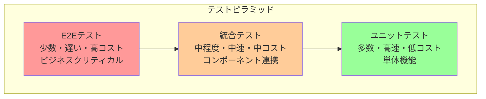
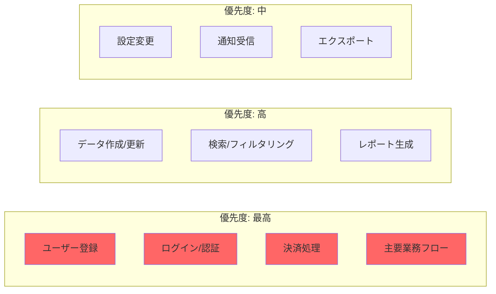

# E2Eテスト実装ガイド

## ドキュメント情報
- **バージョン**: 1.0.0
- **最終更新**: 2025-10-27
- **ステータス**: アクティブ
- **対象者**: 全開発者、QAエンジニア、テストエンジニア
- **前提ドキュメント**: [testing-strategy.md](testing-strategy.md), [integration-testing.md](integration-testing.md)

## 目次
1. [E2Eテストの基本原則](#e2eテストの基本原則)
2. [E2Eテストのスコープ](#e2eテストのスコープ)
3. [テスト設計戦略](#テスト設計戦略)
4. [ユーザーフロー定義](#ユーザーフロー定義)
5. [テスト実装パターン](#テスト実装パターン)
6. [テストデータ管理](#テストデータ管理)
7. [環境とインフラ](#環境とインフラ)
8. [CI/CD統合](#cicd統合)
9. [パフォーマンスと安定性](#パフォーマンスと安定性)
10. [トラブルシューティング](#トラブルシューティング)
11. [Devin AIガイドライン](#devin-aiガイドライン)

---

## E2Eテストの基本原則

### 定義と目的

E2E（End-to-End）テストは、システム全体をユーザーの視点から検証するテスト手法です。

**主要目的**:
- **ユーザーエクスペリエンスの検証**: 実際のユーザーフローが正常に動作することを確認
- **システム統合の検証**: すべてのコンポーネントが連携して機能することを確認
- **ビジネス要件の検証**: ビジネスクリティカルなシナリオが満たされることを確認
- **リグレッション防止**: 既存機能が新規変更によって破壊されていないことを確認

### E2Eテストの特徴



**テストピラミッドにおける位置づけ**:
- **最上位**: 最も包括的だが最も少数
- **実行速度**: 最も遅い（分〜時間単位）
- **コスト**: 最も高い（維持管理コスト含む）
- **カバレッジ**: ビジネスクリティカルなシナリオに絞る

### 他のテストとの違い

| 観点 | E2Eテスト | 統合テスト | ユニットテスト |
|------|-----------|------------|----------------|
| **スコープ** | システム全体 | 複数コンポーネント | 単一関数/クラス |
| **視点** | エンドユーザー | 開発者 | 開発者 |
| **環境** | 本番相当環境 | テスト環境 | 開発環境 |
| **実行時間** | 分〜時間 | 秒〜分 | ミリ秒〜秒 |
| **依存関係** | 実際のDB/API/外部サービス | 一部実際/一部モック | モック/スタブ |
| **目的** | ビジネス要件充足 | コンポーネント連携 | ロジック正確性 |

---

## E2Eテストのスコープ

### テスト対象の選定

**ビジネスクリティカルなフロー**:



**選定基準**:
- **ビジネスインパクト**: 収益やユーザー満足度への影響度
- **使用頻度**: 日次・週次など頻繁に使用される機能
- **リスク**: セキュリティ、データ整合性、コンプライアンスへの影響
- **変更頻度**: 頻繁に変更される領域（リグレッションリスク高）

### カバレッジ戦略

<details>
<summary>カバレッジバランスの実装例</summary>

```kotlin
// E2Eテストスイート構成
class E2ETestSuite {
    
    // 最高優先度: ビジネスクリティカル（10-15%）
    @Suite
    class CriticalBusinessFlows {
        @Test fun completeUserRegistrationFlow()
        @Test fun completeCheckoutAndPaymentFlow()
        @Test fun criticalDataProcessingWorkflow()
    }
    
    // 高優先度: 主要機能（20-30%）
    @Suite
    class CoreFeatures {
        @Test fun userCanCreateAndEditResource()
        @Test fun userCanSearchAndFilterData()
        @Test fun userCanGenerateReports()
    }
    
    // 中優先度: 補助機能（10-20%）
    @Suite
    class SupportingFeatures {
        @Test fun userCanUpdateSettings()
        @Test fun userCanReceiveNotifications()
        @Test fun userCanExportData()
    }
    
    // 優先度設定
    fun determinePriority(test: Test): Priority {
        return when {
            test.affectsRevenue() -> Priority.CRITICAL
            test.isFrequentlyUsed() -> Priority.HIGH
            test.hasHighRisk() -> Priority.HIGH
            else -> Priority.MEDIUM
        }
    }
}
```

</details>

**推奨カバレッジ配分**:
- **クリティカルフロー**: 10-15%のテストケース、100%カバレッジ
- **主要機能**: 20-30%のテストケース、80%カバレッジ
- **補助機能**: 10-20%のテストケース、50%カバレッジ
- **エッジケース**: 5-10%のテストケース、選択的カバレッジ

---

