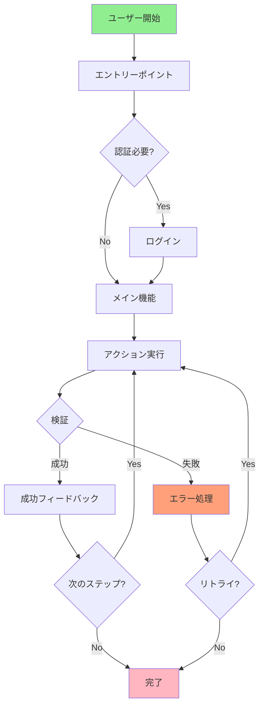
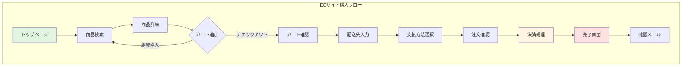

# E2Eテスト標準

## テスト設計戦略

### ユーザージャーニーマッピング



**ユーザージャーニーマッピングでは以下を明確化します**:
- **エントリーポイント**: ユーザーがフローを開始する地点
- **主要ステップ**: ゴールに到達するために必要な各アクション
- **分岐点**: ユーザーが選択や条件によって異なるパスを進む箇所
- **検証ポイント**: 各ステップで確認すべき状態や出力
- **エラーハンドリング**: 失敗時のフォールバック処理
- **完了条件**: ジャーニーが正常に完了したとみなす状態

### シナリオベース設計

<details>
<summary>シナリオテンプレートの実装例</summary>

```kotlin
// シナリオベーステスト設計
data class E2EScenario(
    val name: String,
    val description: String,
    val preconditions: List<Precondition>,
    val steps: List<Step>,
    val expectedOutcome: Outcome,
    val postconditions: List<Postcondition>
)

// シナリオ例: ECサイトの購入フロー
val checkoutScenario = E2EScenario(
    name = "Complete Checkout Process",
    description = "User browses products, adds to cart, and completes purchase",
    
    preconditions = listOf(
        Precondition("User is logged in"),
        Precondition("At least one product is available"),
        Precondition("Payment gateway is operational")
    ),
    
    steps = listOf(
        Step(1, "Navigate to product catalog"),
        Step(2, "Select a product"),
        Step(3, "Add product to cart"),
        Step(4, "Proceed to checkout"),
        Step(5, "Enter shipping information"),
        Step(6, "Select payment method"),
        Step(7, "Confirm order"),
        Step(8, "Verify order confirmation")
    ),
    
    expectedOutcome = Outcome(
        success = true,
        verifications = listOf(
            "Order confirmation page is displayed",
            "Order ID is generated and visible",
            "Confirmation email is sent",
            "Inventory is decremented",
            "Payment is processed"
        )
    ),
    
    postconditions = listOf(
        Postcondition("Order exists in database"),
        Postcondition("User's order history is updated"),
        Postcondition("Cart is emptied")
    )
)

// シナリオ実行フレームワーク
class ScenarioExecutor {
    
    fun execute(scenario: E2EScenario): TestResult {
        // 前提条件の確認
        verifyPreconditions(scenario.preconditions)
        
        // ステップの実行
        val stepResults = scenario.steps.map { step ->
            executeStep(step)
        }
        
        // 期待結果の検証
        val outcomeValid = verifyOutcome(scenario.expectedOutcome)
        
        // 事後条件の検証
        verifyPostconditions(scenario.postconditions)
        
        return TestResult(
            scenario = scenario,
            stepResults = stepResults,
            outcomeValid = outcomeValid
        )
    }
}
```

</details>

**シナリオ設計のベストプラクティス**:
- **Given-When-Then形式**: 前提条件、アクション、期待結果を明確に
- **ビジネス言語使用**: 技術用語より業務用語を優先
- **独立性**: 各シナリオは他のシナリオに依存しない
- **再現性**: 同じ入力で同じ結果が得られる

### ハッピーパスとエッジケース

**テストケース配分**:

| カテゴリ | 配分 | 説明 |
|----------|------|------|
| **ハッピーパス** | 60-70% | 正常な使用フロー、最も一般的な経路 |
| **代替パス** | 20-30% | 正常だが一般的でない経路 |
| **エラーケース** | 10-15% | エラーハンドリング、異常系 |
| **境界値** | 5-10% | 入力の上限・下限、極端なケース |

<details>
<summary>ハッピーパスとエッジケースの実装例</summary>

```kotlin
class UserRegistrationE2ETest {
    
    // ハッピーパス: 最も一般的な成功フロー
    @Test
    fun happyPath_userRegistersWithValidData() {
        // Given: 有効な入力データ
        val userData = UserData(
            email = "user@example.com",
            password = "SecurePass123!",
            name = "John Doe"
        )
        
        // When: 登録フローを実行
        navigateTo("/register")
        fillRegistrationForm(userData)
        submitForm()
        
        // Then: 成功を検証
        assertThat(currentPage()).isEqualTo("/welcome")
        assertThat(confirmationEmailSent()).isTrue()
        assertThat(userExistsInDatabase(userData.email)).isTrue()
    }
    
    // 代替パス: ソーシャルログイン
    @Test
    fun alternatePath_userRegistersWithSocialAuth() {
        // When: GoogleアカウントでOAuth認証
        navigateTo("/register")
        clickGoogleSignInButton()
        completeOAuthFlow()
        
        // Then: 登録完了を検証
        assertThat(currentPage()).isEqualTo("/welcome")
        assertThat(userProfileCreated()).isTrue()
    }
    
    // エラーケース: 既存メールアドレス
    @Test
    fun errorCase_registrationFailsWithExistingEmail() {
        // Given: 既に登録済みのメールアドレス
        val existingEmail = "existing@example.com"
        createUserInDatabase(existingEmail)
        
        // When: 同じメールで登録を試みる
        navigateTo("/register")
        fillEmail(existingEmail)
        fillPassword("AnotherPass123!")
        submitForm()
        
        // Then: エラーメッセージが表示される
        assertThat(errorMessageVisible()).isTrue()
        assertThat(errorMessageText()).contains("already registered")
        assertThat(currentPage()).isEqualTo("/register")
    }
    
    // 境界値: パスワード長の最小値
    @Test
    fun boundaryCase_registrationWithMinimumPasswordLength() {
        // Given: 最小長のパスワード（8文字）
        val userData = UserData(
            email = "test@example.com",
            password = "Pass123!",  // 正確に8文字
            name = "Test User"
        )
        
        // When: 登録を実行
        navigateTo("/register")
        fillRegistrationForm(userData)
        submitForm()
        
        // Then: 成功を検証
        assertThat(registrationSuccessful()).isTrue()
    }
    
    // エッジケース: ネットワーク中断
    @Test
    fun edgeCase_registrationHandlesNetworkInterruption() {
        // Given: 登録フォーム入力後
        navigateTo("/register")
        fillRegistrationForm(validUserData())
        
        // When: 送信中にネットワークを切断
        simulateNetworkInterruption()
        submitForm()
        
        // Then: エラーハンドリングを検証
        assertThat(errorMessageVisible()).isTrue()
        assertThat(retryButtonVisible()).isTrue()
        
        // When: ネットワーク復旧後にリトライ
        restoreNetwork()
        clickRetryButton()
        
        // Then: 成功を検証
        assertThat(registrationSuccessful()).isTrue()
    }
}
```

</details>

---

## ユーザーフロー定義

### フロー分解



**ECサイト購入フローの各ステップ説明**:
1. **トップページ**: ユーザーがサイトに訪問
2. **商品検索**: カテゴリやキーワードで商品を検索
3. **商品詳細**: 選択した商品の詳細情報を表示
4. **カート追加**: 商品をショッピングカートに追加（継続購入または精算へ進む選択）
5. **カート確認**: カート内の商品と小計を確認
6. **配送先入力**: 住所や配送オプションを入力
7. **支払方法選択**: クレジットカード、代引きなどを選択
8. **注文確認**: 最終確認画面で注文内容をレビュー
9. **決済処理**: 支払いの実行と処理
10. **完了画面**: 注文完了メッセージと注文IDを表示
11. **確認メール**: 注文確認メールの送信

### ステップ定義

<details>
<summary>ステップ実装の詳細例</summary>

```kotlin
// Page Object Modelを使用したステップ定義
class CheckoutFlowSteps(private val driver: WebDriver) {
    
    private val homePage = HomePage(driver)
    private val productPage = ProductPage(driver)
    private val cartPage = CartPage(driver)
    private val checkoutPage = CheckoutPage(driver)
    private val confirmationPage = ConfirmationPage(driver)
    
    // ステップ1: 商品を検索
    fun searchForProduct(keyword: String) {
        homePage.open()
        homePage.enterSearchKeyword(keyword)
        homePage.clickSearchButton()
        
        // 検証: 検索結果が表示される
        assertThat(productPage.searchResultsVisible()).isTrue()
    }
    
    // ステップ2: 商品をカートに追加
    fun addProductToCart(productName: String) {
        productPage.selectProduct(productName)
        productPage.clickAddToCartButton()
        
        // 検証: カート追加の確認メッセージ
        assertThat(productPage.cartUpdateNotificationVisible()).isTrue()
    }
    
    // ステップ3: チェックアウトへ進む
    fun proceedToCheckout() {
        productPage.clickCartIcon()
        cartPage.waitForPageLoad()
        cartPage.clickCheckoutButton()
        
        // 検証: チェックアウトページに遷移
        assertThat(checkoutPage.isDisplayed()).isTrue()
    }
    
    // ステップ4: 配送情報を入力
    fun enterShippingInformation(address: Address) {
        checkoutPage.fillShippingAddress(
            street = address.street,
            city = address.city,
            postalCode = address.postalCode,
            country = address.country
        )
        checkoutPage.clickContinueButton()
        
        // 検証: 支払方法選択画面に進む
        assertThat(checkoutPage.paymentSectionVisible()).isTrue()
    }
    
    // ステップ5: 支払方法を選択
    fun selectPaymentMethod(method: PaymentMethod) {
        when (method) {
            is CreditCard -> {
                checkoutPage.selectCreditCardOption()
                checkoutPage.enterCardNumber(method.number)
                checkoutPage.enterCardExpiry(method.expiry)
                checkoutPage.enterCardCVV(method.cvv)
            }
            is PayPal -> {
                checkoutPage.selectPayPalOption()
                // PayPalフロー処理
            }
        }
        checkoutPage.clickPlaceOrderButton()
    }
    
    // ステップ6: 注文を完了
    fun verifyOrderCompletion(): OrderConfirmation {
        confirmationPage.waitForPageLoad()
        
        // 検証ポイント
        assertThat(confirmationPage.isDisplayed()).isTrue()
        assertThat(confirmationPage.successMessageVisible()).isTrue()
        
        val orderId = confirmationPage.getOrderId()
        val totalAmount = confirmationPage.getTotalAmount()
        
        return OrderConfirmation(
            orderId = orderId,
            totalAmount = totalAmount,
            timestamp = getCurrentTimestamp()
        )
    }
}

// テストでの使用
class CheckoutE2ETest {
    
    @Test
    fun completeCheckoutFlow() {
        val steps = CheckoutFlowSteps(driver)
        
        // フロー実行
        steps.searchForProduct("laptop")
        steps.addProductToCart("Dell XPS 13")
        steps.proceedToCheckout()
        steps.enterShippingInformation(testAddress)
        steps.selectPaymentMethod(testCreditCard)
        val confirmation = steps.verifyOrderCompletion()
        
        // 最終検証
        assertThat(confirmation.orderId).isNotEmpty()
        verifyOrderInDatabase(confirmation.orderId)
        verifyConfirmationEmailSent(testUser.email)
    }
}
```

</details>

### 並列フローと分岐

**複数パスの管理**:

<details>
<summary>分岐フローの実装例</summary>

```kotlin
// 分岐フローの管理
class ConditionalFlowHandler {
    
    // メインフロー: ユーザータイプによる分岐
    fun executeFlowBasedOnUserType(userType: UserType) {
        when (userType) {
            UserType.NEW_USER -> executeNewUserFlow()
            UserType.RETURNING_USER -> executeReturningUserFlow()
            UserType.GUEST -> executeGuestFlow()
        }
    }
    
    // 新規ユーザーフロー
    private fun executeNewUserFlow() {
        // 登録が必要
        navigateTo("/register")
        completeRegistration()
        navigateTo("/onboarding")
        completeOnboarding()
        proceedToMainFeature()
    }
    
    // リピーターフロー
    private fun executeReturningUserFlow() {
        // ログインのみ
        navigateTo("/login")
        performLogin()
        proceedToMainFeature()
    }
    
    // ゲストフロー
    private fun executeGuestFlow() {
        // 認証スキップ、機能制限あり
        proceedToMainFeature()
        verifyLimitedFunctionality()
    }
    
    // 条件付き分岐: 在庫状況による処理
    fun handleProductAvailability(product: Product) {
        when {
            product.inStock && product.quantity > 10 -> {
                // 通常購入フロー
                addToCartDirectly(product)
            }
            product.inStock && product.quantity <= 10 -> {
                // 在庫僅少警告
                showLowStockWarning(product)
                addToCartDirectly(product)
            }
            !product.inStock && product.backorderAvailable -> {
                // バックオーダーフロー
                showBackorderOption(product)
                addToBackorder(product)
            }
            else -> {
                // 在庫切れ
                showOutOfStockMessage(product)
                suggestAlternatives(product)
            }
        }
    }
}
```

</details>

---

