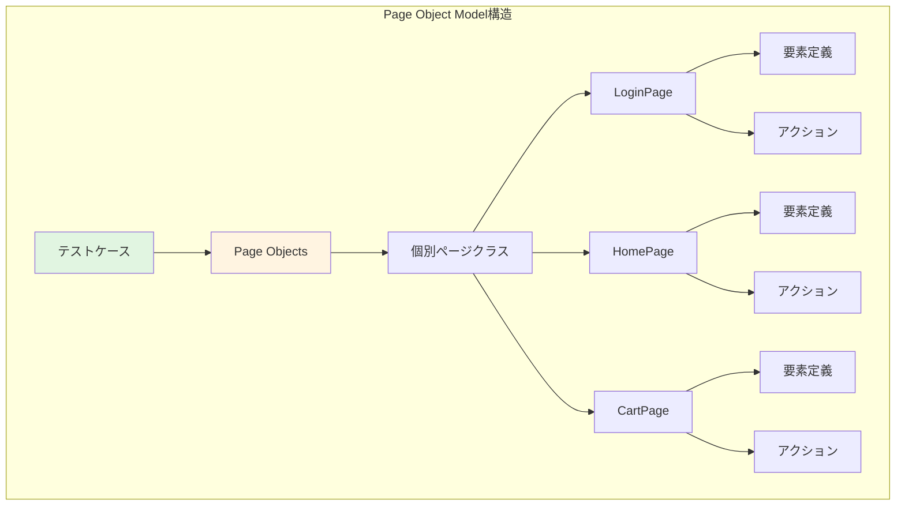
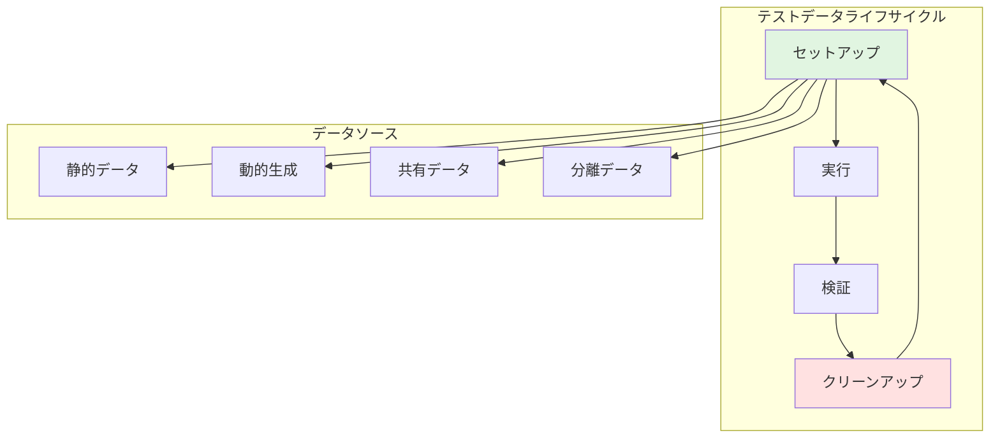

# E2Eテスト標準

## テスト実装パターン

### Page Object Model



**Page Object Modelでは以下を分離します**:
- **テストロジック**: テストシナリオとアサーション
- **ページ構造**: 各ページの要素とレイアウト
- **アクション**: ページ上で実行可能な操作
- **検証メソッド**: ページ状態の確認ロジック

この構造により、UIの変更があってもテストコードの大部分を変更せず、Page Objectクラスのみを更新すれば済みます。

<details>
<summary>Page Object実装の詳細例</summary>

```kotlin
// Page Objectの基底クラス
abstract class BasePage(protected val driver: WebDriver) {
    
    protected fun waitForElement(locator: By, timeout: Duration = Duration.ofSeconds(10)) {
        WebDriverWait(driver, timeout)
            .until(ExpectedConditions.visibilityOfElementLocated(locator))
    }
    
    protected fun click(locator: By) {
        waitForElement(locator)
        driver.findElement(locator).click()
    }
    
    protected fun enterText(locator: By, text: String) {
        waitForElement(locator)
        val element = driver.findElement(locator)
        element.clear()
        element.sendKeys(text)
    }
    
    protected fun getText(locator: By): String {
        waitForElement(locator)
        return driver.findElement(locator).text
    }
}

// ログインページのPage Object
class LoginPage(driver: WebDriver) : BasePage(driver) {
    
    // 要素定義（ロケーター）
    private val emailInput = By.id("email")
    private val passwordInput = By.id("password")
    private val loginButton = By.id("login-button")
    private val errorMessage = By.className("error-message")
    private val forgotPasswordLink = By.linkText("Forgot Password?")
    
    // ページアクション
    fun enterEmail(email: String) {
        enterText(emailInput, email)
    }
    
    fun enterPassword(password: String) {
        enterText(passwordInput, password)
    }
    
    fun clickLoginButton() {
        click(loginButton)
    }
    
    fun clickForgotPasswordLink() {
        click(forgotPasswordLink)
    }
    
    // 複合アクション
    fun login(email: String, password: String): HomePage {
        enterEmail(email)
        enterPassword(password)
        clickLoginButton()
        return HomePage(driver)
    }
    
    // 検証メソッド
    fun isErrorMessageDisplayed(): Boolean {
        return try {
            driver.findElement(errorMessage).isDisplayed
        } catch (e: NoSuchElementException) {
            false
        }
    }
    
    fun getErrorMessageText(): String {
        return getText(errorMessage)
    }
}

// ホームページのPage Object
class HomePage(driver: WebDriver) : BasePage(driver) {
    
    private val searchInput = By.id("search")
    private val searchButton = By.id("search-button")
    private val cartIcon = By.id("cart-icon")
    private val userMenu = By.id("user-menu")
    private val logoutButton = By.id("logout")
    
    fun searchProduct(keyword: String): SearchResultsPage {
        enterText(searchInput, keyword)
        click(searchButton)
        return SearchResultsPage(driver)
    }
    
    fun openCart(): CartPage {
        click(cartIcon)
        return CartPage(driver)
    }
    
    fun logout() {
        click(userMenu)
        click(logoutButton)
    }
    
    fun isLoggedIn(): Boolean {
        return try {
            driver.findElement(userMenu).isDisplayed
        } catch (e: NoSuchElementException) {
            false
        }
    }
}

// テストでの使用例
class UserLoginE2ETest {
    
    private lateinit var driver: WebDriver
    
    @Test
    fun successfulLogin() {
        // Page Objectを使用
        val loginPage = LoginPage(driver)
        val homePage = loginPage.login("user@example.com", "password123")
        
        // 検証
        assertThat(homePage.isLoggedIn()).isTrue()
    }
    
    @Test
    fun loginWithInvalidCredentials() {
        val loginPage = LoginPage(driver)
        loginPage.enterEmail("invalid@example.com")
        loginPage.enterPassword("wrongpassword")
        loginPage.clickLoginButton()
        
        // エラー検証
        assertThat(loginPage.isErrorMessageDisplayed()).isTrue()
        assertThat(loginPage.getErrorMessageText())
            .contains("Invalid credentials")
    }
}
```

</details>

### データ駆動テスト

<details>
<summary>データ駆動テストの実装例</summary>

```kotlin
// データプロバイダーパターン
class LoginTestData {
    
    companion object {
        @JvmStatic
        fun validLoginData(): List<Arguments> = listOf(
            Arguments.of("user1@example.com", "Pass123!", true),
            Arguments.of("user2@example.com", "SecureP@ss", true),
            Arguments.of("admin@example.com", "AdminPass1!", true)
        )
        
        @JvmStatic
        fun invalidLoginData(): List<Arguments> = listOf(
            // 無効なメール形式
            Arguments.of("invalid-email", "Pass123!", false),
            // 短すぎるパスワード
            Arguments.of("user@example.com", "123", false),
            // 空のメール
            Arguments.of("", "Pass123!", false),
            // 空のパスワード
            Arguments.of("user@example.com", "", false)
        )
        
        @JvmStatic
        fun boundaryPasswordData(): List<Arguments> = listOf(
            // 最小長（8文字）
            Arguments.of("user@example.com", "Pass123!", true),
            // 最大長（64文字）
            Arguments.of("user@example.com", "P".repeat(63) + "1!", true),
            // 最小長未満（7文字）
            Arguments.of("user@example.com", "Pass12!", false),
            // 最大長超過（65文字）
            Arguments.of("user@example.com", "P".repeat(64) + "1!", false)
        )
    }
}

// データ駆動テスト実装
class DataDrivenLoginE2ETest {
    
    @ParameterizedTest
    @MethodSource("com.example.LoginTestData#validLoginData")
    fun loginWithValidCredentials(
        email: String,
        password: String,
        shouldSucceed: Boolean
    ) {
        val loginPage = LoginPage(driver)
        val homePage = loginPage.login(email, password)
        
        if (shouldSucceed) {
            assertThat(homePage.isLoggedIn()).isTrue()
        }
    }
    
    @ParameterizedTest
    @MethodSource("com.example.LoginTestData#invalidLoginData")
    fun loginWithInvalidCredentials(
        email: String,
        password: String,
        shouldSucceed: Boolean
    ) {
        val loginPage = LoginPage(driver)
        loginPage.enterEmail(email)
        loginPage.enterPassword(password)
        loginPage.clickLoginButton()
        
        assertThat(loginPage.isErrorMessageDisplayed()).isTrue()
    }
    
    @ParameterizedTest
    @CsvSource(
        "standard_user, Pass123!, true",
        "locked_user, Pass123!, false",
        "problem_user, Pass123!, true"
    )
    fun loginWithDifferentUserTypes(
        username: String,
        password: String,
        shouldSucceed: Boolean
    ) {
        val loginPage = LoginPage(driver)
        loginPage.login(username, password)
        
        if (shouldSucceed) {
            assertThat(loginPage.isErrorMessageDisplayed()).isFalse()
        } else {
            assertThat(loginPage.isErrorMessageDisplayed()).isTrue()
        }
    }
}
```

</details>

### 待機戦略

**待機パターンの選択**:

| 待機タイプ | 使用場面 | 実装 |
|------------|----------|------|
| **明示的待機** | 特定要素の出現待ち | `WebDriverWait` + `ExpectedConditions` |
| **暗黙的待機** | 全要素に一律適用 | `driver.manage().timeouts().implicitlyWait()` |
| **流暢待機** | カスタム条件 + ポーリング | `FluentWait` + カスタムロジック |
| **固定待機** | 最終手段のみ | `Thread.sleep()` (非推奨) |

<details>
<summary>待機戦略の実装例</summary>

```kotlin
// 待機ユーティリティクラス
class WaitHelper(private val driver: WebDriver) {
    
    private val defaultTimeout = Duration.ofSeconds(10)
    private val pollingInterval = Duration.ofMillis(500)
    
    // 明示的待機: 要素が表示されるまで待つ
    fun waitForElementVisible(locator: By, timeout: Duration = defaultTimeout) {
        WebDriverWait(driver, timeout)
            .until(ExpectedConditions.visibilityOfElementLocated(locator))
    }
    
    // 明示的待機: 要素がクリック可能になるまで待つ
    fun waitForElementClickable(locator: By, timeout: Duration = defaultTimeout) {
        WebDriverWait(driver, timeout)
            .until(ExpectedConditions.elementToBeClickable(locator))
    }
    
    // 明示的待機: 要素が消えるまで待つ
    fun waitForElementInvisible(locator: By, timeout: Duration = defaultTimeout) {
        WebDriverWait(driver, timeout)
            .until(ExpectedConditions.invisibilityOfElementLocated(locator))
    }
    
    // 明示的待機: テキストが表示されるまで待つ
    fun waitForTextPresent(locator: By, text: String, timeout: Duration = defaultTimeout) {
        WebDriverWait(driver, timeout)
            .until(ExpectedConditions.textToBePresentInElementLocated(locator, text))
    }
    
    // 流暢待機: カスタム条件
    fun <T> waitForCondition(
        condition: () -> T,
        timeout: Duration = defaultTimeout,
        message: String = "Condition not met"
    ): T {
        return FluentWait(driver)
            .withTimeout(timeout)
            .pollingEvery(pollingInterval)
            .ignoring(NoSuchElementException::class.java)
            .ignoring(StaleElementReferenceException::class.java)
            .withMessage(message)
            .until { condition() }
    }
    
    // AJAXリクエスト完了待ち
    fun waitForAjaxComplete(timeout: Duration = defaultTimeout) {
        waitForCondition(
            condition = {
                val jsExecutor = driver as JavascriptExecutor
                jsExecutor.executeScript("return jQuery.active == 0") as Boolean
            },
            timeout = timeout,
            message = "AJAX requests did not complete"
        )
    }
    
    // ページロード完了待ち
    fun waitForPageLoad(timeout: Duration = defaultTimeout) {
        waitForCondition(
            condition = {
                val jsExecutor = driver as JavascriptExecutor
                jsExecutor.executeScript("return document.readyState") == "complete"
            },
            timeout = timeout,
            message = "Page did not load completely"
        )
    }
    
    // カスタム条件: 特定の属性値
    fun waitForAttributeValue(
        locator: By,
        attribute: String,
        value: String,
        timeout: Duration = defaultTimeout
    ) {
        WebDriverWait(driver, timeout)
            .until(ExpectedConditions.attributeToBe(locator, attribute, value))
    }
    
    // カスタム条件: 要素数
    fun waitForElementCount(
        locator: By,
        count: Int,
        timeout: Duration = defaultTimeout
    ) {
        WebDriverWait(driver, timeout)
            .until(ExpectedConditions.numberOfElementsToBe(locator, count))
    }
}

// Page Objectでの使用
class SearchResultsPage(driver: WebDriver) : BasePage(driver) {
    
    private val waitHelper = WaitHelper(driver)
    private val resultsContainer = By.id("search-results")
    private val loadingSpinner = By.className("loading-spinner")
    private val resultItems = By.className("result-item")
    
    fun waitForResults() {
        // スピナーが消えるまで待つ
        waitHelper.waitForElementInvisible(loadingSpinner)
        
        // 結果が表示されるまで待つ
        waitHelper.waitForElementVisible(resultsContainer)
        
        // 少なくとも1つの結果が表示されるまで待つ
        waitHelper.waitForCondition(
            condition = { getResultCount() > 0 },
            message = "No search results found"
        )
    }
    
    fun getResultCount(): Int {
        return driver.findElements(resultItems).size
    }
}
```

</details>

---

## テストデータ管理

### テストデータ戦略



**テストデータライフサイクルの各フェーズ**:
- **セットアップ**: テスト実行前に必要なデータを準備
- **実行**: テストシナリオを実行し、データを操作
- **検証**: 期待される状態とデータをアサート
- **クリーンアップ**: テスト後にデータを削除または復元し、次のテストに影響を与えないようにする

**データソースの選択**:
- **静的データ**: あらかじめ定義された固定データ（リファレンスデータ）
- **動的生成**: テスト実行時にランダムまたはシーケンシャルに生成
- **共有データ**: 複数テスト間で再利用される読み取り専用データ
- **分離データ**: 各テストが独立したデータセットを使用

<details>
<summary>テストデータ管理の実装例</summary>

```kotlin
// テストデータビルダー
class TestDataBuilder {
    
    // ユーザーデータ生成
    fun createUser(
        email: String = generateUniqueEmail(),
        password: String = "Test123!",
        name: String = "Test User",
        role: UserRole = UserRole.STANDARD
    ): User {
        return User(
            id = UUID.randomUUID().toString(),
            email = email,
            password = hashPassword(password),
            name = name,
            role = role,
            createdAt = Instant.now()
        )
    }
    
    // 注文データ生成
    fun createOrder(
        userId: String,
        items: List<OrderItem> = listOf(createOrderItem()),
        status: OrderStatus = OrderStatus.PENDING
    ): Order {
        return Order(
            id = generateOrderId(),
            userId = userId,
            items = items,
            totalAmount = items.sumOf { it.price * it.quantity },
            status = status,
            createdAt = Instant.now()
        )
    }
    
    // 商品データ生成
    fun createProduct(
        name: String = "Test Product",
        price: BigDecimal = BigDecimal("99.99"),
        stock: Int = 100
    ): Product {
        return Product(
            id = UUID.randomUUID().toString(),
            name = name,
            price = price,
            stock = stock,
            category = "Electronics"
        )
    }
    
    // ユニークなメール生成
    private fun generateUniqueEmail(): String {
        val timestamp = System.currentTimeMillis()
        return "test-${timestamp}@example.com"
    }
    
    // 注文ID生成
    private fun generateOrderId(): String {
        return "ORD-${System.currentTimeMillis()}"
    }
}

// テストフィクスチャ管理
class TestFixtureManager(private val database: Database) {
    
    private val createdResources = mutableListOf<TestResource>()
    
    // セットアップ: テストデータ準備
    fun setupTestData(): TestContext {
        // ユーザー作成
        val user = createAndPersistUser()
        
        // 商品作成
        val products = createAndPersistProducts(count = 5)
        
        // リソース追跡
        createdResources.add(TestResource.User(user.id))
        products.forEach { product ->
            createdResources.add(TestResource.Product(product.id))
        }
        
        return TestContext(user = user, products = products)
    }
    
    // クリーンアップ: テストデータ削除
    fun cleanupTestData() {
        createdResources.reversed().forEach { resource ->
            when (resource) {
                is TestResource.User -> database.deleteUser(resource.id)
                is TestResource.Product -> database.deleteProduct(resource.id)
                is TestResource.Order -> database.deleteOrder(resource.id)
            }
        }
        createdResources.clear()
    }
    
    private fun createAndPersistUser(): User {
        val user = TestDataBuilder().createUser()
        database.insertUser(user)
        return user
    }
    
    private fun createAndPersistProducts(count: Int): List<Product> {
        return (1..count).map {
            val product = TestDataBuilder().createProduct(
                name = "Product $it",
                price = BigDecimal("${it * 10}.99")
            )
            database.insertProduct(product)
            product
        }
    }
}

// テストでの使用
class CheckoutE2ETest {
    
    private lateinit var fixtureManager: TestFixtureManager
    private lateinit var testContext: TestContext
    
    @BeforeEach
    fun setup() {
        fixtureManager = TestFixtureManager(database)
        testContext = fixtureManager.setupTestData()
    }
    
    @AfterEach
    fun teardown() {
        fixtureManager.cleanupTestData()
    }
    
    @Test
    fun userCanCompleteCheckout() {
        // テストコンテキストから準備されたデータを使用
        val user = testContext.user
        val product = testContext.products.first()
        
        // テスト実行
        loginAs(user)
        addToCart(product)
        completeCheckout()
        
        // 検証
        assertThat(orderExistsForUser(user.id)).isTrue()
    }
}
```

</details>

### データ分離と独立性

**データ分離戦略**:

| 戦略 | 説明 | 使用場面 |
|------|------|----------|
| **テストごとに生成** | 各テストが独自のデータを作成 | 最も安全、並列実行可能 |
| **共有読み取り専用** | 静的なリファレンスデータ | マスターデータ、設定値 |
| **テストスイート共有** | スイート内で共有、スイート後削除 | セットアップコストが高い場合 |
| **データベーススナップショット** | テスト前後で状態を復元 | 複雑なデータ依存関係 |

### データクリーンアップ

<details>
<summary>クリーンアップ戦略の実装例</summary>

```kotlin
// クリーンアップ戦略
class DataCleanupStrategy {
    
    // 戦略1: テスト後即座に削除
    class ImmediateCleanup(private val database: Database) {
        
        fun cleanupAfterTest(testContext: TestContext) {
            // 作成した順序の逆で削除（依存関係考慮）
            testContext.orders.forEach { database.deleteOrder(it.id) }
            testContext.products.forEach { database.deleteProduct(it.id) }
            testContext.users.forEach { database.deleteUser(it.id) }
        }
    }
    
    // 戦略2: バッチ削除（スイート終了時）
    class BatchCleanup(private val database: Database) {
        
        private val resourceIds = mutableMapOf<String, MutableList<String>>()
        
        fun registerResource(type: String, id: String) {
            resourceIds.getOrPut(type) { mutableListOf() }.add(id)
        }
        
        fun cleanupAll() {
            // 依存関係順に削除
            resourceIds["orders"]?.let { database.deleteOrdersBatch(it) }
            resourceIds["products"]?.let { database.deleteProductsBatch(it) }
            resourceIds["users"]?.let { database.deleteUsersBatch(it) }
            resourceIds.clear()
        }
    }
    
    // 戦略3: タグベース削除
    class TagBasedCleanup(private val database: Database) {
        
        fun tagResourcesForTest(testId: String, resources: List<Any>) {
            resources.forEach { resource ->
                database.tagResource(resource, tag = "test-$testId")
            }
        }
        
        fun cleanupByTag(testId: String) {
            database.deleteResourcesByTag("test-$testId")
        }
    }
    
    // 戦略4: 有効期限ベース削除
    class TTLBasedCleanup(private val database: Database) {
        
        fun createTemporaryResource(resource: Any, ttl: Duration) {
            val expiresAt = Instant.now().plus(ttl)
            database.insertWithExpiry(resource, expiresAt)
        }
        
        fun cleanupExpiredResources() {
            database.deleteExpiredResources(Instant.now())
        }
    }
}

// JUnitでのクリーンアップ実装
class E2ETestWithCleanup {
    
    private lateinit var database: Database
    private lateinit var cleanup: DataCleanupStrategy.ImmediateCleanup
    private lateinit var testContext: TestContext
    
    @BeforeEach
    fun setup() {
        cleanup = DataCleanupStrategy.ImmediateCleanup(database)
        testContext = TestContext()
    }
    
    @AfterEach
    fun teardown() {
        // テスト失敗時もクリーンアップを保証
        try {
            cleanup.cleanupAfterTest(testContext)
        } catch (e: Exception) {
            // ログ記録のみ、テスト結果に影響させない
            logger.error("Cleanup failed", e)
        }
    }
    
    @Test
    fun testWithAutoCleanup() {
        // テストデータ作成
        val user = createUser()
        testContext.users.add(user)
        
        val product = createProduct()
        testContext.products.add(product)
        
        // テスト実行
        performTest(user, product)
        
        // teardownで自動クリーンアップ
    }
}
```

</details>

---

