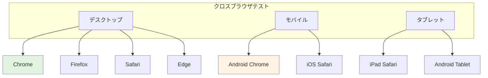
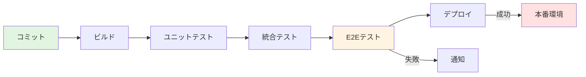

# E2Eテスト標準

## 環境とインフラ

### テスト環境設計

**環境階層**:

| 環境 | 目的 | データ | 更新頻度 |
|------|------|--------|----------|
| **開発(Dev)** | 開発者個別テスト | ダミーデータ | 常時 |
| **統合(Integration)** | 統合テスト、E2E | 共有テストデータ | CI/CDトリガー |
| **ステージング(Staging)** | 本番前検証 | 本番相当データ | リリース前 |
| **本番(Production)** | 実運用 | 実データ | リリース時 |

### ブラウザとデバイス戦略



**クロスブラウザテストでは以下の組み合わせを検証します**:
- **デスクトップブラウザ**: Chrome、Firefox、Safari、Edgeでの動作確認
- **モバイルデバイス**: Android ChromeとiOS Safariでのレスポンシブ動作
- **タブレット**: iPadとAndroidタブレットでの表示とタッチ操作

優先度はユーザーアクセスログに基づき決定し、主要ブラウザから順次カバレッジを拡大します。

<details>
<summary>クロスブラウザテストの実装例</summary>

```kotlin
// ブラウザ設定管理
enum class BrowserType {
    CHROME, FIREFOX, SAFARI, EDGE, 
    ANDROID_CHROME, IOS_SAFARI
}

class BrowserFactory {
    
    fun createDriver(browserType: BrowserType): WebDriver {
        return when (browserType) {
            BrowserType.CHROME -> createChromeDriver()
            BrowserType.FIREFOX -> createFirefoxDriver()
            BrowserType.SAFARI -> createSafariDriver()
            BrowserType.EDGE -> createEdgeDriver()
            BrowserType.ANDROID_CHROME -> createAndroidChromeDriver()
            BrowserType.IOS_SAFARI -> createIOSSafariDriver()
        }
    }
    
    private fun createChromeDriver(): WebDriver {
        val options = ChromeOptions().apply {
            addArguments("--start-maximized")
            addArguments("--disable-notifications")
            addArguments("--incognito")
        }
        return ChromeDriver(options)
    }
    
    private fun createFirefoxDriver(): WebDriver {
        val options = FirefoxOptions().apply {
            addPreference("dom.webnotifications.enabled", false)
        }
        return FirefoxDriver(options)
    }
    
    private fun createAndroidChromeDriver(): WebDriver {
        val options = ChromeOptions().apply {
            setExperimentalOption("mobileEmulation", mapOf(
                "deviceName" to "Pixel 5"
            ))
        }
        return ChromeDriver(options)
    }
}

// クロスブラウザテスト実行
class CrossBrowserTest {
    
    @ParameterizedTest
    @EnumSource(BrowserType::class)
    fun testAcrossBrowsers(browserType: BrowserType) {
        val driver = BrowserFactory().createDriver(browserType)
        
        try {
            // テスト実行
            runTest(driver)
        } finally {
            driver.quit()
        }
    }
    
    private fun runTest(driver: WebDriver) {
        driver.get("https://example.com")
        // テストロジック
    }
}

// 並列クロスブラウザテスト
class ParallelCrossBrowserTest {
    
    @Test
    fun runTestsInParallel() {
        val browsers = listOf(
            BrowserType.CHROME,
            BrowserType.FIREFOX,
            BrowserType.EDGE
        )
        
        browsers.parallelStream().forEach { browserType ->
            val driver = BrowserFactory().createDriver(browserType)
            try {
                executeTestSuite(driver, browserType)
            } finally {
                driver.quit()
            }
        }
    }
}
```

</details>

### コンテナ化とオーケストレーション

<details>
<summary>Docker環境設定例</summary>

```kotlin
// Docker Composeによる環境構築
// docker-compose.yml (疑似表現)
services:
  - name: "selenium-hub"
    image: "selenium/hub:latest"
    ports: ["4444:4444"]
  
  - name: "chrome"
    image: "selenium/node-chrome:latest"
    dependsOn: ["selenium-hub"]
    environment:
      SE_EVENT_BUS_HOST: "selenium-hub"
  
  - name: "firefox"
    image: "selenium/node-firefox:latest"
    dependsOn: ["selenium-hub"]
    environment:
      SE_EVENT_BUS_HOST: "selenium-hub"
  
  - name: "app"
    build: "./app"
    ports: ["8080:8080"]
    environment:
      DATABASE_URL: "postgres://db:5432/testdb"
  
  - name: "database"
    image: "postgres:14"
    environment:
      POSTGRES_DB: "testdb"
      POSTGRES_USER: "testuser"
      POSTGRES_PASSWORD: "testpass"

// テストコードでのSelenium Grid使用
class GridBasedE2ETest {
    
    fun createRemoteDriver(browserType: BrowserType): WebDriver {
        val gridUrl = URL("http://selenium-hub:4444/wd/hub")
        
        val capabilities = when (browserType) {
            BrowserType.CHROME -> ChromeOptions()
            BrowserType.FIREFOX -> FirefoxOptions()
            else -> throw IllegalArgumentException()
        }
        
        return RemoteWebDriver(gridUrl, capabilities)
    }
}
```

</details>

---

## CI/CD統合

### パイプライン構成



**CI/CDパイプラインにおけるE2Eテストの位置づけ**:
1. **コミット**: 開発者がコードをプッシュ
2. **ビルド**: アプリケーションのビルド実行
3. **ユニットテスト**: 高速フィードバックのため最初に実行
4. **統合テスト**: コンポーネント連携の検証
5. **E2Eテスト**: システム全体の動作検証（この段階でフィードバック）
6. **デプロイ**: E2E成功後に本番環境へデプロイ
7. **通知**: 失敗時は関係者に即座に通知

### テスト並列化

<details>
<summary>並列実行の実装例</summary>

```kotlin
// JUnit 5の並列実行設定
// junit-platform.properties (疑似表現)
config:
  execution.parallel.enabled: true
  execution.parallel.mode.default: "concurrent"
  execution.parallel.config.strategy: "dynamic"
  execution.parallel.config.dynamic.factor: 2

// 並列実行テストクラス
@Execution(ExecutionMode.CONCURRENT)
class ParallelE2ETest {
    
    // スレッドセーフなWebDriverプール
    companion object {
        private val driverPool = ThreadLocal<WebDriver>()
    }
    
    @BeforeEach
    fun setupDriver() {
        val driver = BrowserFactory().createDriver(BrowserType.CHROME)
        driverPool.set(driver)
    }
    
    @AfterEach
    fun teardownDriver() {
        driverPool.get()?.quit()
        driverPool.remove()
    }
    
    @Test
    fun testScenario1() {
        val driver = driverPool.get()
        // テスト1実行
    }
    
    @Test
    fun testScenario2() {
        val driver = driverPool.get()
        // テスト2実行（並列）
    }
}

// カスタム並列実行マネージャー
class ParallelExecutionManager(
    private val maxParallelThreads: Int = 4
) {
    
    private val executor = Executors.newFixedThreadPool(maxParallelThreads)
    
    fun executeTestsInParallel(tests: List<E2ETest>) {
        val futures = tests.map { test ->
            executor.submit {
                executeTest(test)
            }
        }
        
        // すべてのテスト完了を待つ
        futures.forEach { it.get() }
    }
    
    private fun executeTest(test: E2ETest) {
        val driver = createIsolatedDriver()
        try {
            test.run(driver)
        } finally {
            driver.quit()
        }
    }
    
    fun shutdown() {
        executor.shutdown()
        executor.awaitTermination(1, TimeUnit.HOURS)
    }
}
```

</details>

### レポーティング

<details>
<summary>テストレポート生成の実装例</summary>

```kotlin
// テスト結果レポート
data class E2ETestReport(
    val totalTests: Int,
    val passed: Int,
    val failed: Int,
    val skipped: Int,
    val duration: Duration,
    val failureDetails: List<FailureDetail>,
    val screenshots: List<Screenshot>
)

// レポート生成
class ReportGenerator {
    
    fun generateReport(results: List<TestResult>): E2ETestReport {
        val total = results.size
        val passed = results.count { it.status == TestStatus.PASSED }
        val failed = results.count { it.status == TestStatus.FAILED }
        val skipped = results.count { it.status == TestStatus.SKIPPED }
        
        val duration = results.map { it.duration }.reduce { acc, d -> acc + d }
        
        val failureDetails = results
            .filter { it.status == TestStatus.FAILED }
            .map { FailureDetail(it.name, it.error, it.stackTrace) }
        
        val screenshots = results
            .filter { it.status == TestStatus.FAILED }
            .mapNotNull { it.screenshot }
        
        return E2ETestReport(
            totalTests = total,
            passed = passed,
            failed = failed,
            skipped = skipped,
            duration = duration,
            failureDetails = failureDetails,
            screenshots = screenshots
        )
    }
    
    fun exportToHtml(report: E2ETestReport): String {
        return buildString {
            append("<html><body>")
            append("<h1>E2E Test Report</h1>")
            append("<p>Total: ${report.totalTests}</p>")
            append("<p>Passed: ${report.passed}</p>")
            append("<p>Failed: ${report.failed}</p>")
            append("<p>Duration: ${report.duration}</p>")
            
            if (report.failureDetails.isNotEmpty()) {
                append("<h2>Failures</h2>")
                report.failureDetails.forEach { failure ->
                    append("<div class='failure'>")
                    append("<h3>${failure.testName}</h3>")
                    append("<p>${failure.errorMessage}</p>")
                    append("<pre>${failure.stackTrace}</pre>")
                    append("</div>")
                }
            }
            
            append("</body></html>")
        }
    }
}

// スクリーンショットキャプチャ
class ScreenshotCapture(private val driver: WebDriver) {
    
    fun captureOnFailure(testName: String): Screenshot? {
        return try {
            val screenshotDriver = driver as TakesScreenshot
            val bytes = screenshotDriver.getScreenshotAs(OutputType.BYTES)
            val filename = "failure-${testName}-${System.currentTimeMillis()}.png"
            
            Screenshot(
                filename = filename,
                data = bytes,
                timestamp = Instant.now()
            )
        } catch (e: Exception) {
            logger.error("Failed to capture screenshot", e)
            null
        }
    }
}
```

</details>

---

## パフォーマンスと安定性

### フレーク対策

**フレークの主な原因と対策**:

| 原因 | 対策 |
|------|------|
| **タイミング問題** | 明示的待機、適切なタイムアウト設定 |
| **非同期処理** | AJAX完了待ち、イベント完了確認 |
| **環境依存** | コンテナ化、環境変数管理 |
| **データ競合** | テストデータ分離、一意なID使用 |
| **外部サービス** | モック/スタブ使用、リトライロジック |

<details>
<summary>フレーク対策の実装例</summary>

```kotlin
// リトライメカニズム
class RetryStrategy {
    
    fun <T> retryOnFailure(
        maxAttempts: Int = 3,
        delayBetweenAttempts: Duration = Duration.ofSeconds(2),
        operation: () -> T
    ): T {
        var lastException: Exception? = null
        
        repeat(maxAttempts) { attempt ->
            try {
                return operation()
            } catch (e: Exception) {
                lastException = e
                logger.warn("Attempt ${attempt + 1} failed: ${e.message}")
                
                if (attempt < maxAttempts - 1) {
                    Thread.sleep(delayBetweenAttempts.toMillis())
                }
            }
        }
        
        throw lastException ?: IllegalStateException("All attempts failed")
    }
}

// アノテーションベースリトライ
@Retention(AnnotationRetention.RUNTIME)
@Target(AnnotationTarget.FUNCTION)
annotation class RetryOnFlake(val maxAttempts: Int = 3)

class FlakeDetector {
    
    @RetryOnFlake(maxAttempts = 3)
    @Test
    fun potentiallyFlakyTest() {
        // フレークが起こりうるテスト
        performUnstableOperation()
    }
}

// 安定性向上のためのヘルパー
class StabilityHelper(private val driver: WebDriver) {
    
    // 要素が安定するまで待つ
    fun waitForElementStability(locator: By, timeout: Duration = Duration.ofSeconds(5)) {
        val startTime = Instant.now()
        var previousLocation: Point? = null
        var stableCount = 0
        
        while (Duration.between(startTime, Instant.now()) < timeout) {
            val element = driver.findElement(locator)
            val currentLocation = element.location
            
            if (currentLocation == previousLocation) {
                stableCount++
                if (stableCount >= 3) {
                    // 3回連続で同じ位置 = 安定
                    return
                }
            } else {
                stableCount = 0
            }
            
            previousLocation = currentLocation
            Thread.sleep(100)
        }
    }
    
    // アニメーション完了待ち
    fun waitForAnimationComplete() {
        val jsExecutor = driver as JavascriptExecutor
        jsExecutor.executeScript("""
            return new Promise((resolve) => {
                requestAnimationFrame(() => {
                    requestAnimationFrame(resolve);
                });
            });
        """)
    }
}
```

</details>

### 実行時間最適化

**最適化手法**:

| 手法 | 効果 | 実装コスト |
|------|------|------------|
| **並列実行** | 高（2-4倍高速化） | 中 |
| **選択的実行** | 高（変更影響範囲のみ） | 高 |
| **ヘッドレスブラウザ** | 中（10-30%高速化） | 低 |
| **データ事前準備** | 中（セットアップ時間削減） | 中 |
| **ページロード最適化** | 低（5-10%高速化） | 低 |

### 安定性メトリクス

<details>
<summary>メトリクス収集の実装例</summary>

```kotlin
// テスト安定性トラッカー
class StabilityTracker {
    
    private val testHistory = mutableMapOf<String, MutableList<TestExecution>>()
    
    fun recordExecution(testName: String, result: TestResult) {
        testHistory.getOrPut(testName) { mutableListOf() }
            .add(TestExecution(result, Instant.now()))
    }
    
    fun calculateStabilityScore(testName: String, windowSize: Int = 10): Double {
        val executions = testHistory[testName]?.takeLast(windowSize) ?: return 0.0
        
        if (executions.isEmpty()) return 0.0
        
        val passCount = executions.count { it.result.status == TestStatus.PASSED }
        return passCount.toDouble() / executions.size
    }
    
    fun identifyFlayTests(threshold: Double = 0.8): List<String> {
        return testHistory.keys.filter { testName ->
            val score = calculateStabilityScore(testName)
            score < threshold && score > 0
        }
    }
    
    fun generateStabilityReport(): StabilityReport {
        val allTests = testHistory.keys
        val stableTests = allTests.filter { calculateStabilityScore(it) >= 0.95 }
        val flakyTests = identifyFlayTests(threshold = 0.8)
        val unreliableTests = allTests.filter { calculateStabilityScore(it) < 0.5 }
        
        return StabilityReport(
            totalTests = allTests.size,
            stableTests = stableTests,
            flakyTests = flakyTests,
            unreliableTests = unreliableTests
        )
    }
}
```

</details>

---

