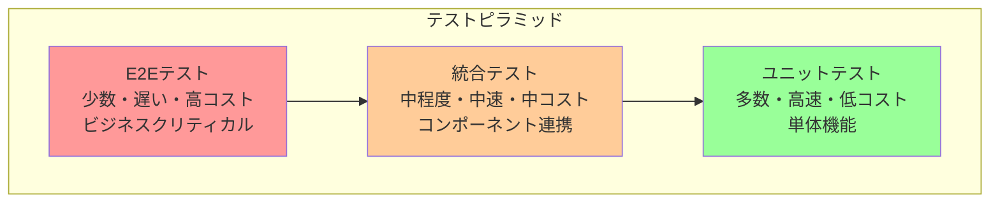
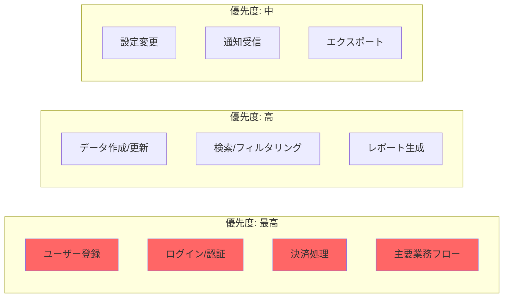
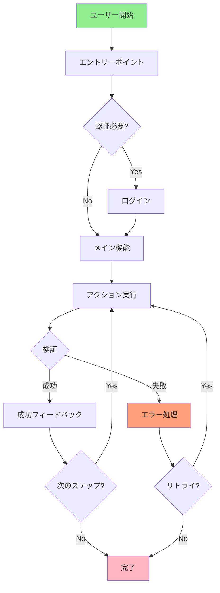
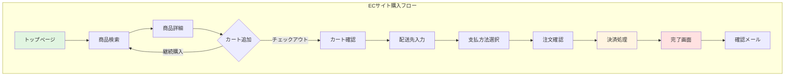
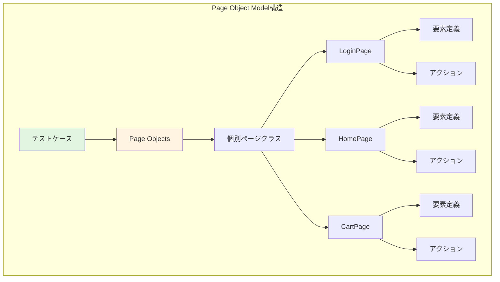
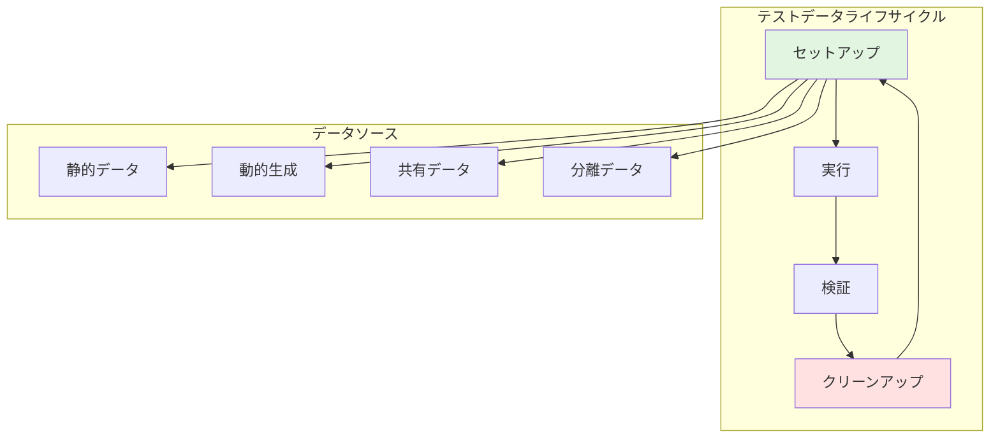
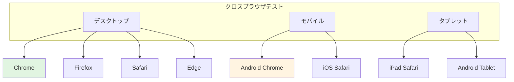
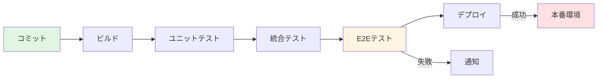

# E2Eテスト実装ガイド

## ドキュメント情報
- **バージョン**: 1.0.0
- **最終更新**: 2025-10-27
- **ステータス**: アクティブ
- **対象者**: 全開発者、QAエンジニア、テストエンジニア
- **前提ドキュメント**: [testing-strategy.md](testing-strategy.md), [integration-testing.md](integration-testing.md)

## 目次
1. [E2Eテストの基本原則](#e2eテストの基本原則)
2. [E2Eテストのスコープ](#e2eテストのスコープ)
3. [テスト設計戦略](#テスト設計戦略)
4. [ユーザーフロー定義](#ユーザーフロー定義)
5. [テスト実装パターン](#テスト実装パターン)
6. [テストデータ管理](#テストデータ管理)
7. [環境とインフラ](#環境とインフラ)
8. [CI/CD統合](#cicd統合)
9. [パフォーマンスと安定性](#パフォーマンスと安定性)
10. [トラブルシューティング](#トラブルシューティング)
11. [Devin AIガイドライン](#devin-aiガイドライン)

---

## E2Eテストの基本原則

### 定義と目的

E2E（End-to-End）テストは、システム全体をユーザーの視点から検証するテスト手法です。

**主要目的**:
- **ユーザーエクスペリエンスの検証**: 実際のユーザーフローが正常に動作することを確認
- **システム統合の検証**: すべてのコンポーネントが連携して機能することを確認
- **ビジネス要件の検証**: ビジネスクリティカルなシナリオが満たされることを確認
- **リグレッション防止**: 既存機能が新規変更によって破壊されていないことを確認

### E2Eテストの特徴



**テストピラミッドにおける位置づけ**:
- **最上位**: 最も包括的だが最も少数
- **実行速度**: 最も遅い（分〜時間単位）
- **コスト**: 最も高い（維持管理コスト含む）
- **カバレッジ**: ビジネスクリティカルなシナリオに絞る

### 他のテストとの違い

| 観点 | E2Eテスト | 統合テスト | ユニットテスト |
|------|-----------|------------|----------------|
| **スコープ** | システム全体 | 複数コンポーネント | 単一関数/クラス |
| **視点** | エンドユーザー | 開発者 | 開発者 |
| **環境** | 本番相当環境 | テスト環境 | 開発環境 |
| **実行時間** | 分〜時間 | 秒〜分 | ミリ秒〜秒 |
| **依存関係** | 実際のDB/API/外部サービス | 一部実際/一部モック | モック/スタブ |
| **目的** | ビジネス要件充足 | コンポーネント連携 | ロジック正確性 |

---

## E2Eテストのスコープ

### テスト対象の選定

**ビジネスクリティカルなフロー**:



**選定基準**:
- **ビジネスインパクト**: 収益やユーザー満足度への影響度
- **使用頻度**: 日次・週次など頻繁に使用される機能
- **リスク**: セキュリティ、データ整合性、コンプライアンスへの影響
- **変更頻度**: 頻繁に変更される領域（リグレッションリスク高）

### カバレッジ戦略

<details>
<summary>カバレッジバランスの実装例</summary>

```kotlin
// E2Eテストスイート構成
class E2ETestSuite {
    
    // 最高優先度: ビジネスクリティカル（10-15%）
    @Suite
    class CriticalBusinessFlows {
        @Test fun completeUserRegistrationFlow()
        @Test fun completeCheckoutAndPaymentFlow()
        @Test fun criticalDataProcessingWorkflow()
    }
    
    // 高優先度: 主要機能（20-30%）
    @Suite
    class CoreFeatures {
        @Test fun userCanCreateAndEditResource()
        @Test fun userCanSearchAndFilterData()
        @Test fun userCanGenerateReports()
    }
    
    // 中優先度: 補助機能（10-20%）
    @Suite
    class SupportingFeatures {
        @Test fun userCanUpdateSettings()
        @Test fun userCanReceiveNotifications()
        @Test fun userCanExportData()
    }
    
    // 優先度設定
    fun determinePriority(test: Test): Priority {
        return when {
            test.affectsRevenue() -> Priority.CRITICAL
            test.isFrequentlyUsed() -> Priority.HIGH
            test.hasHighRisk() -> Priority.HIGH
            else -> Priority.MEDIUM
        }
    }
}
```

</details>

**推奨カバレッジ配分**:
- **クリティカルフロー**: 10-15%のテストケース、100%カバレッジ
- **主要機能**: 20-30%のテストケース、80%カバレッジ
- **補助機能**: 10-20%のテストケース、50%カバレッジ
- **エッジケース**: 5-10%のテストケース、選択的カバレッジ

---

## テスト設計戦略

### ユーザージャーニーマッピング



**ユーザージャーニーマッピングでは以下を明確化します**:
- **エントリーポイント**: ユーザーがフローを開始する地点
- **主要ステップ**: ゴールに到達するために必要な各アクション
- **分岐点**: ユーザーが選択や条件によって異なるパスを進む箇所
- **検証ポイント**: 各ステップで確認すべき状態や出力
- **エラーハンドリング**: 失敗時のフォールバック処理
- **完了条件**: ジャーニーが正常に完了したとみなす状態

### シナリオベース設計

<details>
<summary>シナリオテンプレートの実装例</summary>

```kotlin
// シナリオベーステスト設計
data class E2EScenario(
    val name: String,
    val description: String,
    val preconditions: List<Precondition>,
    val steps: List<Step>,
    val expectedOutcome: Outcome,
    val postconditions: List<Postcondition>
)

// シナリオ例: ECサイトの購入フロー
val checkoutScenario = E2EScenario(
    name = "Complete Checkout Process",
    description = "User browses products, adds to cart, and completes purchase",
    
    preconditions = listOf(
        Precondition("User is logged in"),
        Precondition("At least one product is available"),
        Precondition("Payment gateway is operational")
    ),
    
    steps = listOf(
        Step(1, "Navigate to product catalog"),
        Step(2, "Select a product"),
        Step(3, "Add product to cart"),
        Step(4, "Proceed to checkout"),
        Step(5, "Enter shipping information"),
        Step(6, "Select payment method"),
        Step(7, "Confirm order"),
        Step(8, "Verify order confirmation")
    ),
    
    expectedOutcome = Outcome(
        success = true,
        verifications = listOf(
            "Order confirmation page is displayed",
            "Order ID is generated and visible",
            "Confirmation email is sent",
            "Inventory is decremented",
            "Payment is processed"
        )
    ),
    
    postconditions = listOf(
        Postcondition("Order exists in database"),
        Postcondition("User's order history is updated"),
        Postcondition("Cart is emptied")
    )
)

// シナリオ実行フレームワーク
class ScenarioExecutor {
    
    fun execute(scenario: E2EScenario): TestResult {
        // 前提条件の確認
        verifyPreconditions(scenario.preconditions)
        
        // ステップの実行
        val stepResults = scenario.steps.map { step ->
            executeStep(step)
        }
        
        // 期待結果の検証
        val outcomeValid = verifyOutcome(scenario.expectedOutcome)
        
        // 事後条件の検証
        verifyPostconditions(scenario.postconditions)
        
        return TestResult(
            scenario = scenario,
            stepResults = stepResults,
            outcomeValid = outcomeValid
        )
    }
}
```

</details>

**シナリオ設計のベストプラクティス**:
- **Given-When-Then形式**: 前提条件、アクション、期待結果を明確に
- **ビジネス言語使用**: 技術用語より業務用語を優先
- **独立性**: 各シナリオは他のシナリオに依存しない
- **再現性**: 同じ入力で同じ結果が得られる

### ハッピーパスとエッジケース

**テストケース配分**:

| カテゴリ | 配分 | 説明 |
|----------|------|------|
| **ハッピーパス** | 60-70% | 正常な使用フロー、最も一般的な経路 |
| **代替パス** | 20-30% | 正常だが一般的でない経路 |
| **エラーケース** | 10-15% | エラーハンドリング、異常系 |
| **境界値** | 5-10% | 入力の上限・下限、極端なケース |

<details>
<summary>ハッピーパスとエッジケースの実装例</summary>

```kotlin
class UserRegistrationE2ETest {
    
    // ハッピーパス: 最も一般的な成功フロー
    @Test
    fun happyPath_userRegistersWithValidData() {
        // Given: 有効な入力データ
        val userData = UserData(
            email = "user@example.com",
            password = "SecurePass123!",
            name = "John Doe"
        )
        
        // When: 登録フローを実行
        navigateTo("/register")
        fillRegistrationForm(userData)
        submitForm()
        
        // Then: 成功を検証
        assertThat(currentPage()).isEqualTo("/welcome")
        assertThat(confirmationEmailSent()).isTrue()
        assertThat(userExistsInDatabase(userData.email)).isTrue()
    }
    
    // 代替パス: ソーシャルログイン
    @Test
    fun alternatePath_userRegistersWithSocialAuth() {
        // When: GoogleアカウントでOAuth認証
        navigateTo("/register")
        clickGoogleSignInButton()
        completeOAuthFlow()
        
        // Then: 登録完了を検証
        assertThat(currentPage()).isEqualTo("/welcome")
        assertThat(userProfileCreated()).isTrue()
    }
    
    // エラーケース: 既存メールアドレス
    @Test
    fun errorCase_registrationFailsWithExistingEmail() {
        // Given: 既に登録済みのメールアドレス
        val existingEmail = "existing@example.com"
        createUserInDatabase(existingEmail)
        
        // When: 同じメールで登録を試みる
        navigateTo("/register")
        fillEmail(existingEmail)
        fillPassword("AnotherPass123!")
        submitForm()
        
        // Then: エラーメッセージが表示される
        assertThat(errorMessageVisible()).isTrue()
        assertThat(errorMessageText()).contains("already registered")
        assertThat(currentPage()).isEqualTo("/register")
    }
    
    // 境界値: パスワード長の最小値
    @Test
    fun boundaryCase_registrationWithMinimumPasswordLength() {
        // Given: 最小長のパスワード（8文字）
        val userData = UserData(
            email = "test@example.com",
            password = "Pass123!",  // 正確に8文字
            name = "Test User"
        )
        
        // When: 登録を実行
        navigateTo("/register")
        fillRegistrationForm(userData)
        submitForm()
        
        // Then: 成功を検証
        assertThat(registrationSuccessful()).isTrue()
    }
    
    // エッジケース: ネットワーク中断
    @Test
    fun edgeCase_registrationHandlesNetworkInterruption() {
        // Given: 登録フォーム入力後
        navigateTo("/register")
        fillRegistrationForm(validUserData())
        
        // When: 送信中にネットワークを切断
        simulateNetworkInterruption()
        submitForm()
        
        // Then: エラーハンドリングを検証
        assertThat(errorMessageVisible()).isTrue()
        assertThat(retryButtonVisible()).isTrue()
        
        // When: ネットワーク復旧後にリトライ
        restoreNetwork()
        clickRetryButton()
        
        // Then: 成功を検証
        assertThat(registrationSuccessful()).isTrue()
    }
}
```

</details>

---

## ユーザーフロー定義

### フロー分解



**ECサイト購入フローの各ステップ説明**:
1. **トップページ**: ユーザーがサイトに訪問
2. **商品検索**: カテゴリやキーワードで商品を検索
3. **商品詳細**: 選択した商品の詳細情報を表示
4. **カート追加**: 商品をショッピングカートに追加（継続購入または精算へ進む選択）
5. **カート確認**: カート内の商品と小計を確認
6. **配送先入力**: 住所や配送オプションを入力
7. **支払方法選択**: クレジットカード、代引きなどを選択
8. **注文確認**: 最終確認画面で注文内容をレビュー
9. **決済処理**: 支払いの実行と処理
10. **完了画面**: 注文完了メッセージと注文IDを表示
11. **確認メール**: 注文確認メールの送信

### ステップ定義

<details>
<summary>ステップ実装の詳細例</summary>

```kotlin
// Page Object Modelを使用したステップ定義
class CheckoutFlowSteps(private val driver: WebDriver) {
    
    private val homePage = HomePage(driver)
    private val productPage = ProductPage(driver)
    private val cartPage = CartPage(driver)
    private val checkoutPage = CheckoutPage(driver)
    private val confirmationPage = ConfirmationPage(driver)
    
    // ステップ1: 商品を検索
    fun searchForProduct(keyword: String) {
        homePage.open()
        homePage.enterSearchKeyword(keyword)
        homePage.clickSearchButton()
        
        // 検証: 検索結果が表示される
        assertThat(productPage.searchResultsVisible()).isTrue()
    }
    
    // ステップ2: 商品をカートに追加
    fun addProductToCart(productName: String) {
        productPage.selectProduct(productName)
        productPage.clickAddToCartButton()
        
        // 検証: カート追加の確認メッセージ
        assertThat(productPage.cartUpdateNotificationVisible()).isTrue()
    }
    
    // ステップ3: チェックアウトへ進む
    fun proceedToCheckout() {
        productPage.clickCartIcon()
        cartPage.waitForPageLoad()
        cartPage.clickCheckoutButton()
        
        // 検証: チェックアウトページに遷移
        assertThat(checkoutPage.isDisplayed()).isTrue()
    }
    
    // ステップ4: 配送情報を入力
    fun enterShippingInformation(address: Address) {
        checkoutPage.fillShippingAddress(
            street = address.street,
            city = address.city,
            postalCode = address.postalCode,
            country = address.country
        )
        checkoutPage.clickContinueButton()
        
        // 検証: 支払方法選択画面に進む
        assertThat(checkoutPage.paymentSectionVisible()).isTrue()
    }
    
    // ステップ5: 支払方法を選択
    fun selectPaymentMethod(method: PaymentMethod) {
        when (method) {
            is CreditCard -> {
                checkoutPage.selectCreditCardOption()
                checkoutPage.enterCardNumber(method.number)
                checkoutPage.enterCardExpiry(method.expiry)
                checkoutPage.enterCardCVV(method.cvv)
            }
            is PayPal -> {
                checkoutPage.selectPayPalOption()
                // PayPalフロー処理
            }
        }
        checkoutPage.clickPlaceOrderButton()
    }
    
    // ステップ6: 注文を完了
    fun verifyOrderCompletion(): OrderConfirmation {
        confirmationPage.waitForPageLoad()
        
        // 検証ポイント
        assertThat(confirmationPage.isDisplayed()).isTrue()
        assertThat(confirmationPage.successMessageVisible()).isTrue()
        
        val orderId = confirmationPage.getOrderId()
        val totalAmount = confirmationPage.getTotalAmount()
        
        return OrderConfirmation(
            orderId = orderId,
            totalAmount = totalAmount,
            timestamp = getCurrentTimestamp()
        )
    }
}

// テストでの使用
class CheckoutE2ETest {
    
    @Test
    fun completeCheckoutFlow() {
        val steps = CheckoutFlowSteps(driver)
        
        // フロー実行
        steps.searchForProduct("laptop")
        steps.addProductToCart("Dell XPS 13")
        steps.proceedToCheckout()
        steps.enterShippingInformation(testAddress)
        steps.selectPaymentMethod(testCreditCard)
        val confirmation = steps.verifyOrderCompletion()
        
        // 最終検証
        assertThat(confirmation.orderId).isNotEmpty()
        verifyOrderInDatabase(confirmation.orderId)
        verifyConfirmationEmailSent(testUser.email)
    }
}
```

</details>

### 並列フローと分岐

**複数パスの管理**:

<details>
<summary>分岐フローの実装例</summary>

```kotlin
// 分岐フローの管理
class ConditionalFlowHandler {
    
    // メインフロー: ユーザータイプによる分岐
    fun executeFlowBasedOnUserType(userType: UserType) {
        when (userType) {
            UserType.NEW_USER -> executeNewUserFlow()
            UserType.RETURNING_USER -> executeReturningUserFlow()
            UserType.GUEST -> executeGuestFlow()
        }
    }
    
    // 新規ユーザーフロー
    private fun executeNewUserFlow() {
        // 登録が必要
        navigateTo("/register")
        completeRegistration()
        navigateTo("/onboarding")
        completeOnboarding()
        proceedToMainFeature()
    }
    
    // リピーターフロー
    private fun executeReturningUserFlow() {
        // ログインのみ
        navigateTo("/login")
        performLogin()
        proceedToMainFeature()
    }
    
    // ゲストフロー
    private fun executeGuestFlow() {
        // 認証スキップ、機能制限あり
        proceedToMainFeature()
        verifyLimitedFunctionality()
    }
    
    // 条件付き分岐: 在庫状況による処理
    fun handleProductAvailability(product: Product) {
        when {
            product.inStock && product.quantity > 10 -> {
                // 通常購入フロー
                addToCartDirectly(product)
            }
            product.inStock && product.quantity <= 10 -> {
                // 在庫僅少警告
                showLowStockWarning(product)
                addToCartDirectly(product)
            }
            !product.inStock && product.backorderAvailable -> {
                // バックオーダーフロー
                showBackorderOption(product)
                addToBackorder(product)
            }
            else -> {
                // 在庫切れ
                showOutOfStockMessage(product)
                suggestAlternatives(product)
            }
        }
    }
}
```

</details>

---

## テスト実装パターン

### Page Object Model



**Page Object Modelでは以下を分離します**:
- **テストロジック**: テストシナリオとアサーション
- **ページ構造**: 各ページの要素とレイアウト
- **アクション**: ページ上で実行可能な操作
- **検証メソッド**: ページ状態の確認ロジック

この構造により、UIの変更があってもテストコードの大部分を変更せず、Page Objectクラスのみを更新すれば済みます。

<details>
<summary>Page Object実装の詳細例</summary>

```kotlin
// Page Objectの基底クラス
abstract class BasePage(protected val driver: WebDriver) {
    
    protected fun waitForElement(locator: By, timeout: Duration = Duration.ofSeconds(10)) {
        WebDriverWait(driver, timeout)
            .until(ExpectedConditions.visibilityOfElementLocated(locator))
    }
    
    protected fun click(locator: By) {
        waitForElement(locator)
        driver.findElement(locator).click()
    }
    
    protected fun enterText(locator: By, text: String) {
        waitForElement(locator)
        val element = driver.findElement(locator)
        element.clear()
        element.sendKeys(text)
    }
    
    protected fun getText(locator: By): String {
        waitForElement(locator)
        return driver.findElement(locator).text
    }
}

// ログインページのPage Object
class LoginPage(driver: WebDriver) : BasePage(driver) {
    
    // 要素定義（ロケーター）
    private val emailInput = By.id("email")
    private val passwordInput = By.id("password")
    private val loginButton = By.id("login-button")
    private val errorMessage = By.className("error-message")
    private val forgotPasswordLink = By.linkText("Forgot Password?")
    
    // ページアクション
    fun enterEmail(email: String) {
        enterText(emailInput, email)
    }
    
    fun enterPassword(password: String) {
        enterText(passwordInput, password)
    }
    
    fun clickLoginButton() {
        click(loginButton)
    }
    
    fun clickForgotPasswordLink() {
        click(forgotPasswordLink)
    }
    
    // 複合アクション
    fun login(email: String, password: String): HomePage {
        enterEmail(email)
        enterPassword(password)
        clickLoginButton()
        return HomePage(driver)
    }
    
    // 検証メソッド
    fun isErrorMessageDisplayed(): Boolean {
        return try {
            driver.findElement(errorMessage).isDisplayed
        } catch (e: NoSuchElementException) {
            false
        }
    }
    
    fun getErrorMessageText(): String {
        return getText(errorMessage)
    }
}

// ホームページのPage Object
class HomePage(driver: WebDriver) : BasePage(driver) {
    
    private val searchInput = By.id("search")
    private val searchButton = By.id("search-button")
    private val cartIcon = By.id("cart-icon")
    private val userMenu = By.id("user-menu")
    private val logoutButton = By.id("logout")
    
    fun searchProduct(keyword: String): SearchResultsPage {
        enterText(searchInput, keyword)
        click(searchButton)
        return SearchResultsPage(driver)
    }
    
    fun openCart(): CartPage {
        click(cartIcon)
        return CartPage(driver)
    }
    
    fun logout() {
        click(userMenu)
        click(logoutButton)
    }
    
    fun isLoggedIn(): Boolean {
        return try {
            driver.findElement(userMenu).isDisplayed
        } catch (e: NoSuchElementException) {
            false
        }
    }
}

// テストでの使用例
class UserLoginE2ETest {
    
    private lateinit var driver: WebDriver
    
    @Test
    fun successfulLogin() {
        // Page Objectを使用
        val loginPage = LoginPage(driver)
        val homePage = loginPage.login("user@example.com", "password123")
        
        // 検証
        assertThat(homePage.isLoggedIn()).isTrue()
    }
    
    @Test
    fun loginWithInvalidCredentials() {
        val loginPage = LoginPage(driver)
        loginPage.enterEmail("invalid@example.com")
        loginPage.enterPassword("wrongpassword")
        loginPage.clickLoginButton()
        
        // エラー検証
        assertThat(loginPage.isErrorMessageDisplayed()).isTrue()
        assertThat(loginPage.getErrorMessageText())
            .contains("Invalid credentials")
    }
}
```

</details>

### データ駆動テスト

<details>
<summary>データ駆動テストの実装例</summary>

```kotlin
// データプロバイダーパターン
class LoginTestData {
    
    companion object {
        @JvmStatic
        fun validLoginData(): List<Arguments> = listOf(
            Arguments.of("user1@example.com", "Pass123!", true),
            Arguments.of("user2@example.com", "SecureP@ss", true),
            Arguments.of("admin@example.com", "AdminPass1!", true)
        )
        
        @JvmStatic
        fun invalidLoginData(): List<Arguments> = listOf(
            // 無効なメール形式
            Arguments.of("invalid-email", "Pass123!", false),
            // 短すぎるパスワード
            Arguments.of("user@example.com", "123", false),
            // 空のメール
            Arguments.of("", "Pass123!", false),
            // 空のパスワード
            Arguments.of("user@example.com", "", false)
        )
        
        @JvmStatic
        fun boundaryPasswordData(): List<Arguments> = listOf(
            // 最小長（8文字）
            Arguments.of("user@example.com", "Pass123!", true),
            // 最大長（64文字）
            Arguments.of("user@example.com", "P".repeat(63) + "1!", true),
            // 最小長未満（7文字）
            Arguments.of("user@example.com", "Pass12!", false),
            // 最大長超過（65文字）
            Arguments.of("user@example.com", "P".repeat(64) + "1!", false)
        )
    }
}

// データ駆動テスト実装
class DataDrivenLoginE2ETest {
    
    @ParameterizedTest
    @MethodSource("com.example.LoginTestData#validLoginData")
    fun loginWithValidCredentials(
        email: String,
        password: String,
        shouldSucceed: Boolean
    ) {
        val loginPage = LoginPage(driver)
        val homePage = loginPage.login(email, password)
        
        if (shouldSucceed) {
            assertThat(homePage.isLoggedIn()).isTrue()
        }
    }
    
    @ParameterizedTest
    @MethodSource("com.example.LoginTestData#invalidLoginData")
    fun loginWithInvalidCredentials(
        email: String,
        password: String,
        shouldSucceed: Boolean
    ) {
        val loginPage = LoginPage(driver)
        loginPage.enterEmail(email)
        loginPage.enterPassword(password)
        loginPage.clickLoginButton()
        
        assertThat(loginPage.isErrorMessageDisplayed()).isTrue()
    }
    
    @ParameterizedTest
    @CsvSource(
        "standard_user, Pass123!, true",
        "locked_user, Pass123!, false",
        "problem_user, Pass123!, true"
    )
    fun loginWithDifferentUserTypes(
        username: String,
        password: String,
        shouldSucceed: Boolean
    ) {
        val loginPage = LoginPage(driver)
        loginPage.login(username, password)
        
        if (shouldSucceed) {
            assertThat(loginPage.isErrorMessageDisplayed()).isFalse()
        } else {
            assertThat(loginPage.isErrorMessageDisplayed()).isTrue()
        }
    }
}
```

</details>

### 待機戦略

**待機パターンの選択**:

| 待機タイプ | 使用場面 | 実装 |
|------------|----------|------|
| **明示的待機** | 特定要素の出現待ち | `WebDriverWait` + `ExpectedConditions` |
| **暗黙的待機** | 全要素に一律適用 | `driver.manage().timeouts().implicitlyWait()` |
| **流暢待機** | カスタム条件 + ポーリング | `FluentWait` + カスタムロジック |
| **固定待機** | 最終手段のみ | `Thread.sleep()` (非推奨) |

<details>
<summary>待機戦略の実装例</summary>

```kotlin
// 待機ユーティリティクラス
class WaitHelper(private val driver: WebDriver) {
    
    private val defaultTimeout = Duration.ofSeconds(10)
    private val pollingInterval = Duration.ofMillis(500)
    
    // 明示的待機: 要素が表示されるまで待つ
    fun waitForElementVisible(locator: By, timeout: Duration = defaultTimeout) {
        WebDriverWait(driver, timeout)
            .until(ExpectedConditions.visibilityOfElementLocated(locator))
    }
    
    // 明示的待機: 要素がクリック可能になるまで待つ
    fun waitForElementClickable(locator: By, timeout: Duration = defaultTimeout) {
        WebDriverWait(driver, timeout)
            .until(ExpectedConditions.elementToBeClickable(locator))
    }
    
    // 明示的待機: 要素が消えるまで待つ
    fun waitForElementInvisible(locator: By, timeout: Duration = defaultTimeout) {
        WebDriverWait(driver, timeout)
            .until(ExpectedConditions.invisibilityOfElementLocated(locator))
    }
    
    // 明示的待機: テキストが表示されるまで待つ
    fun waitForTextPresent(locator: By, text: String, timeout: Duration = defaultTimeout) {
        WebDriverWait(driver, timeout)
            .until(ExpectedConditions.textToBePresentInElementLocated(locator, text))
    }
    
    // 流暢待機: カスタム条件
    fun <T> waitForCondition(
        condition: () -> T,
        timeout: Duration = defaultTimeout,
        message: String = "Condition not met"
    ): T {
        return FluentWait(driver)
            .withTimeout(timeout)
            .pollingEvery(pollingInterval)
            .ignoring(NoSuchElementException::class.java)
            .ignoring(StaleElementReferenceException::class.java)
            .withMessage(message)
            .until { condition() }
    }
    
    // AJAXリクエスト完了待ち
    fun waitForAjaxComplete(timeout: Duration = defaultTimeout) {
        waitForCondition(
            condition = {
                val jsExecutor = driver as JavascriptExecutor
                jsExecutor.executeScript("return jQuery.active == 0") as Boolean
            },
            timeout = timeout,
            message = "AJAX requests did not complete"
        )
    }
    
    // ページロード完了待ち
    fun waitForPageLoad(timeout: Duration = defaultTimeout) {
        waitForCondition(
            condition = {
                val jsExecutor = driver as JavascriptExecutor
                jsExecutor.executeScript("return document.readyState") == "complete"
            },
            timeout = timeout,
            message = "Page did not load completely"
        )
    }
    
    // カスタム条件: 特定の属性値
    fun waitForAttributeValue(
        locator: By,
        attribute: String,
        value: String,
        timeout: Duration = defaultTimeout
    ) {
        WebDriverWait(driver, timeout)
            .until(ExpectedConditions.attributeToBe(locator, attribute, value))
    }
    
    // カスタム条件: 要素数
    fun waitForElementCount(
        locator: By,
        count: Int,
        timeout: Duration = defaultTimeout
    ) {
        WebDriverWait(driver, timeout)
            .until(ExpectedConditions.numberOfElementsToBe(locator, count))
    }
}

// Page Objectでの使用
class SearchResultsPage(driver: WebDriver) : BasePage(driver) {
    
    private val waitHelper = WaitHelper(driver)
    private val resultsContainer = By.id("search-results")
    private val loadingSpinner = By.className("loading-spinner")
    private val resultItems = By.className("result-item")
    
    fun waitForResults() {
        // スピナーが消えるまで待つ
        waitHelper.waitForElementInvisible(loadingSpinner)
        
        // 結果が表示されるまで待つ
        waitHelper.waitForElementVisible(resultsContainer)
        
        // 少なくとも1つの結果が表示されるまで待つ
        waitHelper.waitForCondition(
            condition = { getResultCount() > 0 },
            message = "No search results found"
        )
    }
    
    fun getResultCount(): Int {
        return driver.findElements(resultItems).size
    }
}
```

</details>

---

## テストデータ管理

### テストデータ戦略



**テストデータライフサイクルの各フェーズ**:
- **セットアップ**: テスト実行前に必要なデータを準備
- **実行**: テストシナリオを実行し、データを操作
- **検証**: 期待される状態とデータをアサート
- **クリーンアップ**: テスト後にデータを削除または復元し、次のテストに影響を与えないようにする

**データソースの選択**:
- **静的データ**: あらかじめ定義された固定データ（リファレンスデータ）
- **動的生成**: テスト実行時にランダムまたはシーケンシャルに生成
- **共有データ**: 複数テスト間で再利用される読み取り専用データ
- **分離データ**: 各テストが独立したデータセットを使用

<details>
<summary>テストデータ管理の実装例</summary>

```kotlin
// テストデータビルダー
class TestDataBuilder {
    
    // ユーザーデータ生成
    fun createUser(
        email: String = generateUniqueEmail(),
        password: String = "Test123!",
        name: String = "Test User",
        role: UserRole = UserRole.STANDARD
    ): User {
        return User(
            id = UUID.randomUUID().toString(),
            email = email,
            password = hashPassword(password),
            name = name,
            role = role,
            createdAt = Instant.now()
        )
    }
    
    // 注文データ生成
    fun createOrder(
        userId: String,
        items: List<OrderItem> = listOf(createOrderItem()),
        status: OrderStatus = OrderStatus.PENDING
    ): Order {
        return Order(
            id = generateOrderId(),
            userId = userId,
            items = items,
            totalAmount = items.sumOf { it.price * it.quantity },
            status = status,
            createdAt = Instant.now()
        )
    }
    
    // 商品データ生成
    fun createProduct(
        name: String = "Test Product",
        price: BigDecimal = BigDecimal("99.99"),
        stock: Int = 100
    ): Product {
        return Product(
            id = UUID.randomUUID().toString(),
            name = name,
            price = price,
            stock = stock,
            category = "Electronics"
        )
    }
    
    // ユニークなメール生成
    private fun generateUniqueEmail(): String {
        val timestamp = System.currentTimeMillis()
        return "test-${timestamp}@example.com"
    }
    
    // 注文ID生成
    private fun generateOrderId(): String {
        return "ORD-${System.currentTimeMillis()}"
    }
}

// テストフィクスチャ管理
class TestFixtureManager(private val database: Database) {
    
    private val createdResources = mutableListOf<TestResource>()
    
    // セットアップ: テストデータ準備
    fun setupTestData(): TestContext {
        // ユーザー作成
        val user = createAndPersistUser()
        
        // 商品作成
        val products = createAndPersistProducts(count = 5)
        
        // リソース追跡
        createdResources.add(TestResource.User(user.id))
        products.forEach { product ->
            createdResources.add(TestResource.Product(product.id))
        }
        
        return TestContext(user = user, products = products)
    }
    
    // クリーンアップ: テストデータ削除
    fun cleanupTestData() {
        createdResources.reversed().forEach { resource ->
            when (resource) {
                is TestResource.User -> database.deleteUser(resource.id)
                is TestResource.Product -> database.deleteProduct(resource.id)
                is TestResource.Order -> database.deleteOrder(resource.id)
            }
        }
        createdResources.clear()
    }
    
    private fun createAndPersistUser(): User {
        val user = TestDataBuilder().createUser()
        database.insertUser(user)
        return user
    }
    
    private fun createAndPersistProducts(count: Int): List<Product> {
        return (1..count).map {
            val product = TestDataBuilder().createProduct(
                name = "Product $it",
                price = BigDecimal("${it * 10}.99")
            )
            database.insertProduct(product)
            product
        }
    }
}

// テストでの使用
class CheckoutE2ETest {
    
    private lateinit var fixtureManager: TestFixtureManager
    private lateinit var testContext: TestContext
    
    @BeforeEach
    fun setup() {
        fixtureManager = TestFixtureManager(database)
        testContext = fixtureManager.setupTestData()
    }
    
    @AfterEach
    fun teardown() {
        fixtureManager.cleanupTestData()
    }
    
    @Test
    fun userCanCompleteCheckout() {
        // テストコンテキストから準備されたデータを使用
        val user = testContext.user
        val product = testContext.products.first()
        
        // テスト実行
        loginAs(user)
        addToCart(product)
        completeCheckout()
        
        // 検証
        assertThat(orderExistsForUser(user.id)).isTrue()
    }
}
```

</details>

### データ分離と独立性

**データ分離戦略**:

| 戦略 | 説明 | 使用場面 |
|------|------|----------|
| **テストごとに生成** | 各テストが独自のデータを作成 | 最も安全、並列実行可能 |
| **共有読み取り専用** | 静的なリファレンスデータ | マスターデータ、設定値 |
| **テストスイート共有** | スイート内で共有、スイート後削除 | セットアップコストが高い場合 |
| **データベーススナップショット** | テスト前後で状態を復元 | 複雑なデータ依存関係 |

### データクリーンアップ

<details>
<summary>クリーンアップ戦略の実装例</summary>

```kotlin
// クリーンアップ戦略
class DataCleanupStrategy {
    
    // 戦略1: テスト後即座に削除
    class ImmediateCleanup(private val database: Database) {
        
        fun cleanupAfterTest(testContext: TestContext) {
            // 作成した順序の逆で削除（依存関係考慮）
            testContext.orders.forEach { database.deleteOrder(it.id) }
            testContext.products.forEach { database.deleteProduct(it.id) }
            testContext.users.forEach { database.deleteUser(it.id) }
        }
    }
    
    // 戦略2: バッチ削除（スイート終了時）
    class BatchCleanup(private val database: Database) {
        
        private val resourceIds = mutableMapOf<String, MutableList<String>>()
        
        fun registerResource(type: String, id: String) {
            resourceIds.getOrPut(type) { mutableListOf() }.add(id)
        }
        
        fun cleanupAll() {
            // 依存関係順に削除
            resourceIds["orders"]?.let { database.deleteOrdersBatch(it) }
            resourceIds["products"]?.let { database.deleteProductsBatch(it) }
            resourceIds["users"]?.let { database.deleteUsersBatch(it) }
            resourceIds.clear()
        }
    }
    
    // 戦略3: タグベース削除
    class TagBasedCleanup(private val database: Database) {
        
        fun tagResourcesForTest(testId: String, resources: List<Any>) {
            resources.forEach { resource ->
                database.tagResource(resource, tag = "test-$testId")
            }
        }
        
        fun cleanupByTag(testId: String) {
            database.deleteResourcesByTag("test-$testId")
        }
    }
    
    // 戦略4: 有効期限ベース削除
    class TTLBasedCleanup(private val database: Database) {
        
        fun createTemporaryResource(resource: Any, ttl: Duration) {
            val expiresAt = Instant.now().plus(ttl)
            database.insertWithExpiry(resource, expiresAt)
        }
        
        fun cleanupExpiredResources() {
            database.deleteExpiredResources(Instant.now())
        }
    }
}

// JUnitでのクリーンアップ実装
class E2ETestWithCleanup {
    
    private lateinit var database: Database
    private lateinit var cleanup: DataCleanupStrategy.ImmediateCleanup
    private lateinit var testContext: TestContext
    
    @BeforeEach
    fun setup() {
        cleanup = DataCleanupStrategy.ImmediateCleanup(database)
        testContext = TestContext()
    }
    
    @AfterEach
    fun teardown() {
        // テスト失敗時もクリーンアップを保証
        try {
            cleanup.cleanupAfterTest(testContext)
        } catch (e: Exception) {
            // ログ記録のみ、テスト結果に影響させない
            logger.error("Cleanup failed", e)
        }
    }
    
    @Test
    fun testWithAutoCleanup() {
        // テストデータ作成
        val user = createUser()
        testContext.users.add(user)
        
        val product = createProduct()
        testContext.products.add(product)
        
        // テスト実行
        performTest(user, product)
        
        // teardownで自動クリーンアップ
    }
}
```

</details>

---

## 環境とインフラ

### テスト環境設計

**環境階層**:

| 環境 | 目的 | データ | 更新頻度 |
|------|------|--------|----------|
| **開発(Dev)** | 開発者個別テスト | ダミーデータ | 常時 |
| **統合(Integration)** | 統合テスト、E2E | 共有テストデータ | CI/CDトリガー |
| **ステージング(Staging)** | 本番前検証 | 本番相当データ | リリース前 |
| **本番(Production)** | 実運用 | 実データ | リリース時 |

### ブラウザとデバイス戦略



**クロスブラウザテストでは以下の組み合わせを検証します**:
- **デスクトップブラウザ**: Chrome、Firefox、Safari、Edgeでの動作確認
- **モバイルデバイス**: Android ChromeとiOS Safariでのレスポンシブ動作
- **タブレット**: iPadとAndroidタブレットでの表示とタッチ操作

優先度はユーザーアクセスログに基づき決定し、主要ブラウザから順次カバレッジを拡大します。

<details>
<summary>クロスブラウザテストの実装例</summary>

```kotlin
// ブラウザ設定管理
enum class BrowserType {
    CHROME, FIREFOX, SAFARI, EDGE, 
    ANDROID_CHROME, IOS_SAFARI
}

class BrowserFactory {
    
    fun createDriver(browserType: BrowserType): WebDriver {
        return when (browserType) {
            BrowserType.CHROME -> createChromeDriver()
            BrowserType.FIREFOX -> createFirefoxDriver()
            BrowserType.SAFARI -> createSafariDriver()
            BrowserType.EDGE -> createEdgeDriver()
            BrowserType.ANDROID_CHROME -> createAndroidChromeDriver()
            BrowserType.IOS_SAFARI -> createIOSSafariDriver()
        }
    }
    
    private fun createChromeDriver(): WebDriver {
        val options = ChromeOptions().apply {
            addArguments("--start-maximized")
            addArguments("--disable-notifications")
            addArguments("--incognito")
        }
        return ChromeDriver(options)
    }
    
    private fun createFirefoxDriver(): WebDriver {
        val options = FirefoxOptions().apply {
            addPreference("dom.webnotifications.enabled", false)
        }
        return FirefoxDriver(options)
    }
    
    private fun createAndroidChromeDriver(): WebDriver {
        val options = ChromeOptions().apply {
            setExperimentalOption("mobileEmulation", mapOf(
                "deviceName" to "Pixel 5"
            ))
        }
        return ChromeDriver(options)
    }
}

// クロスブラウザテスト実行
class CrossBrowserTest {
    
    @ParameterizedTest
    @EnumSource(BrowserType::class)
    fun testAcrossBrowsers(browserType: BrowserType) {
        val driver = BrowserFactory().createDriver(browserType)
        
        try {
            // テスト実行
            runTest(driver)
        } finally {
            driver.quit()
        }
    }
    
    private fun runTest(driver: WebDriver) {
        driver.get("https://example.com")
        // テストロジック
    }
}

// 並列クロスブラウザテスト
class ParallelCrossBrowserTest {
    
    @Test
    fun runTestsInParallel() {
        val browsers = listOf(
            BrowserType.CHROME,
            BrowserType.FIREFOX,
            BrowserType.EDGE
        )
        
        browsers.parallelStream().forEach { browserType ->
            val driver = BrowserFactory().createDriver(browserType)
            try {
                executeTestSuite(driver, browserType)
            } finally {
                driver.quit()
            }
        }
    }
}
```

</details>

### コンテナ化とオーケストレーション

<details>
<summary>Docker環境設定例</summary>

```kotlin
// Docker Composeによる環境構築
// docker-compose.yml (疑似表現)
services:
  - name: "selenium-hub"
    image: "selenium/hub:latest"
    ports: ["4444:4444"]
  
  - name: "chrome"
    image: "selenium/node-chrome:latest"
    dependsOn: ["selenium-hub"]
    environment:
      SE_EVENT_BUS_HOST: "selenium-hub"
  
  - name: "firefox"
    image: "selenium/node-firefox:latest"
    dependsOn: ["selenium-hub"]
    environment:
      SE_EVENT_BUS_HOST: "selenium-hub"
  
  - name: "app"
    build: "./app"
    ports: ["8080:8080"]
    environment:
      DATABASE_URL: "postgres://db:5432/testdb"
  
  - name: "database"
    image: "postgres:14"
    environment:
      POSTGRES_DB: "testdb"
      POSTGRES_USER: "testuser"
      POSTGRES_PASSWORD: "testpass"

// テストコードでのSelenium Grid使用
class GridBasedE2ETest {
    
    fun createRemoteDriver(browserType: BrowserType): WebDriver {
        val gridUrl = URL("http://selenium-hub:4444/wd/hub")
        
        val capabilities = when (browserType) {
            BrowserType.CHROME -> ChromeOptions()
            BrowserType.FIREFOX -> FirefoxOptions()
            else -> throw IllegalArgumentException()
        }
        
        return RemoteWebDriver(gridUrl, capabilities)
    }
}
```

</details>

---

## CI/CD統合

### パイプライン構成



**CI/CDパイプラインにおけるE2Eテストの位置づけ**:
1. **コミット**: 開発者がコードをプッシュ
2. **ビルド**: アプリケーションのビルド実行
3. **ユニットテスト**: 高速フィードバックのため最初に実行
4. **統合テスト**: コンポーネント連携の検証
5. **E2Eテスト**: システム全体の動作検証（この段階でフィードバック）
6. **デプロイ**: E2E成功後に本番環境へデプロイ
7. **通知**: 失敗時は関係者に即座に通知

### テスト並列化

<details>
<summary>並列実行の実装例</summary>

```kotlin
// JUnit 5の並列実行設定
// junit-platform.properties (疑似表現)
config:
  execution.parallel.enabled: true
  execution.parallel.mode.default: "concurrent"
  execution.parallel.config.strategy: "dynamic"
  execution.parallel.config.dynamic.factor: 2

// 並列実行テストクラス
@Execution(ExecutionMode.CONCURRENT)
class ParallelE2ETest {
    
    // スレッドセーフなWebDriverプール
    companion object {
        private val driverPool = ThreadLocal<WebDriver>()
    }
    
    @BeforeEach
    fun setupDriver() {
        val driver = BrowserFactory().createDriver(BrowserType.CHROME)
        driverPool.set(driver)
    }
    
    @AfterEach
    fun teardownDriver() {
        driverPool.get()?.quit()
        driverPool.remove()
    }
    
    @Test
    fun testScenario1() {
        val driver = driverPool.get()
        // テスト1実行
    }
    
    @Test
    fun testScenario2() {
        val driver = driverPool.get()
        // テスト2実行（並列）
    }
}

// カスタム並列実行マネージャー
class ParallelExecutionManager(
    private val maxParallelThreads: Int = 4
) {
    
    private val executor = Executors.newFixedThreadPool(maxParallelThreads)
    
    fun executeTestsInParallel(tests: List<E2ETest>) {
        val futures = tests.map { test ->
            executor.submit {
                executeTest(test)
            }
        }
        
        // すべてのテスト完了を待つ
        futures.forEach { it.get() }
    }
    
    private fun executeTest(test: E2ETest) {
        val driver = createIsolatedDriver()
        try {
            test.run(driver)
        } finally {
            driver.quit()
        }
    }
    
    fun shutdown() {
        executor.shutdown()
        executor.awaitTermination(1, TimeUnit.HOURS)
    }
}
```

</details>

### レポーティング

<details>
<summary>テストレポート生成の実装例</summary>

```kotlin
// テスト結果レポート
data class E2ETestReport(
    val totalTests: Int,
    val passed: Int,
    val failed: Int,
    val skipped: Int,
    val duration: Duration,
    val failureDetails: List<FailureDetail>,
    val screenshots: List<Screenshot>
)

// レポート生成
class ReportGenerator {
    
    fun generateReport(results: List<TestResult>): E2ETestReport {
        val total = results.size
        val passed = results.count { it.status == TestStatus.PASSED }
        val failed = results.count { it.status == TestStatus.FAILED }
        val skipped = results.count { it.status == TestStatus.SKIPPED }
        
        val duration = results.map { it.duration }.reduce { acc, d -> acc + d }
        
        val failureDetails = results
            .filter { it.status == TestStatus.FAILED }
            .map { FailureDetail(it.name, it.error, it.stackTrace) }
        
        val screenshots = results
            .filter { it.status == TestStatus.FAILED }
            .mapNotNull { it.screenshot }
        
        return E2ETestReport(
            totalTests = total,
            passed = passed,
            failed = failed,
            skipped = skipped,
            duration = duration,
            failureDetails = failureDetails,
            screenshots = screenshots
        )
    }
    
    fun exportToHtml(report: E2ETestReport): String {
        return buildString {
            append("<html><body>")
            append("<h1>E2E Test Report</h1>")
            append("<p>Total: ${report.totalTests}</p>")
            append("<p>Passed: ${report.passed}</p>")
            append("<p>Failed: ${report.failed}</p>")
            append("<p>Duration: ${report.duration}</p>")
            
            if (report.failureDetails.isNotEmpty()) {
                append("<h2>Failures</h2>")
                report.failureDetails.forEach { failure ->
                    append("<div class='failure'>")
                    append("<h3>${failure.testName}</h3>")
                    append("<p>${failure.errorMessage}</p>")
                    append("<pre>${failure.stackTrace}</pre>")
                    append("</div>")
                }
            }
            
            append("</body></html>")
        }
    }
}

// スクリーンショットキャプチャ
class ScreenshotCapture(private val driver: WebDriver) {
    
    fun captureOnFailure(testName: String): Screenshot? {
        return try {
            val screenshotDriver = driver as TakesScreenshot
            val bytes = screenshotDriver.getScreenshotAs(OutputType.BYTES)
            val filename = "failure-${testName}-${System.currentTimeMillis()}.png"
            
            Screenshot(
                filename = filename,
                data = bytes,
                timestamp = Instant.now()
            )
        } catch (e: Exception) {
            logger.error("Failed to capture screenshot", e)
            null
        }
    }
}
```

</details>

---

## パフォーマンスと安定性

### フレーク対策

**フレークの主な原因と対策**:

| 原因 | 対策 |
|------|------|
| **タイミング問題** | 明示的待機、適切なタイムアウト設定 |
| **非同期処理** | AJAX完了待ち、イベント完了確認 |
| **環境依存** | コンテナ化、環境変数管理 |
| **データ競合** | テストデータ分離、一意なID使用 |
| **外部サービス** | モック/スタブ使用、リトライロジック |

<details>
<summary>フレーク対策の実装例</summary>

```kotlin
// リトライメカニズム
class RetryStrategy {
    
    fun <T> retryOnFailure(
        maxAttempts: Int = 3,
        delayBetweenAttempts: Duration = Duration.ofSeconds(2),
        operation: () -> T
    ): T {
        var lastException: Exception? = null
        
        repeat(maxAttempts) { attempt ->
            try {
                return operation()
            } catch (e: Exception) {
                lastException = e
                logger.warn("Attempt ${attempt + 1} failed: ${e.message}")
                
                if (attempt < maxAttempts - 1) {
                    Thread.sleep(delayBetweenAttempts.toMillis())
                }
            }
        }
        
        throw lastException ?: IllegalStateException("All attempts failed")
    }
}

// アノテーションベースリトライ
@Retention(AnnotationRetention.RUNTIME)
@Target(AnnotationTarget.FUNCTION)
annotation class RetryOnFlake(val maxAttempts: Int = 3)

class FlakeDetector {
    
    @RetryOnFlake(maxAttempts = 3)
    @Test
    fun potentiallyFlakyTest() {
        // フレークが起こりうるテスト
        performUnstableOperation()
    }
}

// 安定性向上のためのヘルパー
class StabilityHelper(private val driver: WebDriver) {
    
    // 要素が安定するまで待つ
    fun waitForElementStability(locator: By, timeout: Duration = Duration.ofSeconds(5)) {
        val startTime = Instant.now()
        var previousLocation: Point? = null
        var stableCount = 0
        
        while (Duration.between(startTime, Instant.now()) < timeout) {
            val element = driver.findElement(locator)
            val currentLocation = element.location
            
            if (currentLocation == previousLocation) {
                stableCount++
                if (stableCount >= 3) {
                    // 3回連続で同じ位置 = 安定
                    return
                }
            } else {
                stableCount = 0
            }
            
            previousLocation = currentLocation
            Thread.sleep(100)
        }
    }
    
    // アニメーション完了待ち
    fun waitForAnimationComplete() {
        val jsExecutor = driver as JavascriptExecutor
        jsExecutor.executeScript("""
            return new Promise((resolve) => {
                requestAnimationFrame(() => {
                    requestAnimationFrame(resolve);
                });
            });
        """)
    }
}
```

</details>

### 実行時間最適化

**最適化手法**:

| 手法 | 効果 | 実装コスト |
|------|------|------------|
| **並列実行** | 高（2-4倍高速化） | 中 |
| **選択的実行** | 高（変更影響範囲のみ） | 高 |
| **ヘッドレスブラウザ** | 中（10-30%高速化） | 低 |
| **データ事前準備** | 中（セットアップ時間削減） | 中 |
| **ページロード最適化** | 低（5-10%高速化） | 低 |

### 安定性メトリクス

<details>
<summary>メトリクス収集の実装例</summary>

```kotlin
// テスト安定性トラッカー
class StabilityTracker {
    
    private val testHistory = mutableMapOf<String, MutableList<TestExecution>>()
    
    fun recordExecution(testName: String, result: TestResult) {
        testHistory.getOrPut(testName) { mutableListOf() }
            .add(TestExecution(result, Instant.now()))
    }
    
    fun calculateStabilityScore(testName: String, windowSize: Int = 10): Double {
        val executions = testHistory[testName]?.takeLast(windowSize) ?: return 0.0
        
        if (executions.isEmpty()) return 0.0
        
        val passCount = executions.count { it.result.status == TestStatus.PASSED }
        return passCount.toDouble() / executions.size
    }
    
    fun identifyFlayTests(threshold: Double = 0.8): List<String> {
        return testHistory.keys.filter { testName ->
            val score = calculateStabilityScore(testName)
            score < threshold && score > 0
        }
    }
    
    fun generateStabilityReport(): StabilityReport {
        val allTests = testHistory.keys
        val stableTests = allTests.filter { calculateStabilityScore(it) >= 0.95 }
        val flakyTests = identifyFlayTests(threshold = 0.8)
        val unreliableTests = allTests.filter { calculateStabilityScore(it) < 0.5 }
        
        return StabilityReport(
            totalTests = allTests.size,
            stableTests = stableTests,
            flakyTests = flakyTests,
            unreliableTests = unreliableTests
        )
    }
}
```

</details>

---

## トラブルシューティング

### よくある問題と解決策

| 問題 | 原因 | 解決策 |
|------|------|--------|
| **要素が見つからない** | タイミング、動的読み込み | 明示的待機の追加 |
| **StaleElementException** | DOM再レンダリング | 要素の再取得 |
| **タイムアウト** | 処理遅延、ネットワーク問題 | タイムアウト延長、リトライ |
| **不正なクリック** | 要素重なり、アニメーション | 要素の安定化待ち |
| **フレーム切り替え失敗** | iframe内要素へのアクセス | `switchTo().frame()` |

<details>
<summary>トラブルシューティング実装例</summary>

```kotlin
// トラブルシューティングヘルパー
class TroubleshootingHelper(private val driver: WebDriver) {
    
    // 要素が見つからない問題の解決
    fun findElementWithRetry(
        locator: By,
        maxAttempts: Int = 3
    ): WebElement {
        var lastException: Exception? = null
        
        repeat(maxAttempts) { attempt ->
            try {
                waitForElement(locator)
                return driver.findElement(locator)
            } catch (e: NoSuchElementException) {
                lastException = e
                logger.warn("Element not found, attempt ${attempt + 1}")
                Thread.sleep(1000)
                
                // ページをリフレッシュして再試行
                if (attempt == maxAttempts - 1) {
                    driver.navigate().refresh()
                }
            }
        }
        
        throw lastException ?: NoSuchElementException("Element not found after retries")
    }
    
    // StaleElementException対策
    fun clickWithStaleRetry(locator: By, maxAttempts: Int = 3) {
        repeat(maxAttempts) { attempt ->
            try {
                val element = driver.findElement(locator)
                element.click()
                return
            } catch (e: StaleElementReferenceException) {
                if (attempt == maxAttempts - 1) {
                    throw e
                }
                logger.warn("Stale element, retrying...")
                Thread.sleep(500)
            }
        }
    }
    
    // iframe処理
    fun executeInFrame(frameLocator: By, action: () -> Unit) {
        try {
            // フレームに切り替え
            val frame = driver.findElement(frameLocator)
            driver.switchTo().frame(frame)
            
            // アクション実行
            action()
        } finally {
            // デフォルトコンテキストに戻る
            driver.switchTo().defaultContent()
        }
    }
    
    // オーバーレイ要素の処理
    fun clickThroughOverlay(locator: By) {
        // オーバーレイを閉じる
        try {
            val overlay = driver.findElement(By.className("overlay-close"))
            overlay.click()
            Thread.sleep(500)
        } catch (e: NoSuchElementException) {
            // オーバーレイがない場合は無視
        }
        
        // 目的の要素をクリック
        val element = driver.findElement(locator)
        element.click()
    }
    
    // JavaScriptによる強制クリック
    fun forceClick(locator: By) {
        val element = driver.findElement(locator)
        val jsExecutor = driver as JavascriptExecutor
        jsExecutor.executeScript("arguments[0].click();", element)
    }
}
```

</details>

### デバッグ戦略

<details>
<summary>デバッグツールの実装例</summary>

```kotlin
// デバッグヘルパー
class E2EDebugHelper(private val driver: WebDriver) {
    
    // スクリーンショット付きログ
    fun logWithScreenshot(message: String) {
        logger.info(message)
        
        val screenshot = captureScreenshot()
        val filename = "debug-${System.currentTimeMillis()}.png"
        saveScreenshot(screenshot, filename)
        
        logger.info("Screenshot saved: $filename")
    }
    
    // ページ状態のダンプ
    fun dumpPageState(): PageState {
        val jsExecutor = driver as JavascriptExecutor
        
        return PageState(
            url = driver.currentUrl,
            title = driver.title,
            html = driver.pageSource,
            cookies = driver.manage().cookies,
            localStorage = getLocalStorage(jsExecutor),
            sessionStorage = getSessionStorage(jsExecutor),
            console = getConsoleLogs()
        )
    }
    
    // ブラウザコンソールログの取得
    private fun getConsoleLogs(): List<LogEntry> {
        return driver.manage().logs().get(LogType.BROWSER).all
    }
    
    // LocalStorage内容の取得
    private fun getLocalStorage(jsExecutor: JavascriptExecutor): Map<String, String> {
        val script = """
            var items = {};
            for (var i = 0; i < localStorage.length; i++) {
                var key = localStorage.key(i);
                items[key] = localStorage.getItem(key);
            }
            return items;
        """
        
        @Suppress("UNCHECKED_CAST")
        return jsExecutor.executeScript(script) as Map<String, String>
    }
    
    // 要素のハイライト表示
    fun highlightElement(locator: By) {
        val element = driver.findElement(locator)
        val jsExecutor = driver as JavascriptExecutor
        
        jsExecutor.executeScript("""
            arguments[0].style.border = '3px solid red';
            arguments[0].style.backgroundColor = 'yellow';
        """, element)
        
        Thread.sleep(2000)  // 2秒間ハイライト表示
    }
    
    // ステップごとの実行（デバッグモード）
    fun executeStep(stepName: String, action: () -> Unit) {
        logger.info("=== Executing Step: $stepName ===")
        
        try {
            action()
            logger.info("Step completed successfully")
        } catch (e: Exception) {
            logger.error("Step failed: ${e.message}")
            logWithScreenshot("Failure in step: $stepName")
            dumpPageState()
            throw e
        }
    }
}
```

</details>

---

## Devin AIガイドライン

### AIによるE2Eテスト生成

**プロンプト例**:

```
タスク: ユーザー登録フローのE2Eテストを生成してください

要件:
- 有効な入力でのハッピーパス
- 無効なメールアドレスでのエラーケース
- 既存メールでの重複エラーケース
- Page Object Modelを使用
- 適切な待機戦略を実装

技術スタック:
- 言語: [プロジェクトに応じて選択]
- フレームワーク: [プロジェクトに応じて選択]
- ブラウザ: Chrome
```

### AIレビューチェックリスト

**E2Eテストコードのレビューポイント**:
- ✅ Page Object Modelが適切に実装されている
- ✅ ハードコーディングされた待機（sleep）を使用していない
- ✅ 明示的待機が適切に設定されている
- ✅ テストデータがハードコードされていない
- ✅ テスト後のクリーンアップが実装されている
- ✅ エラーハンドリングが適切
- ✅ スクリーンショットが失敗時にキャプチャされる
- ✅ ロケーターがメンテナブル
- ✅ アサーションが明確で意味のあるメッセージを持つ
- ✅ テストが独立して実行可能

### AI支援によるメンテナンス

**定期的なメンテナンスタスク**:
1. **フレークテストの特定**: 安定性スコアが低いテストを検出
2. **ロケーターの更新**: UI変更に伴うロケーター修正
3. **待機時間の最適化**: 過剰なタイムアウトの削減
4. **重複コードの削除**: 共通ロジックのユーティリティ化
5. **カバレッジギャップの特定**: テストされていないフローの検出

**AIプロンプト例（メンテナンス）**:

```
タスク: E2Eテストスイートのフレークを分析し、安定化してください

現状:
- テストスイートの成功率: 85%
- フレークが疑われるテスト: [テスト名リスト]

実行してほしいこと:
1. フレークの原因を特定
2. 適切な待機戦略を提案
3. リトライメカニズムを追加
4. 安定性を95%以上に改善

分析対象: [テストファイルパス]
```

---

## 関連ドキュメント

- [testing-strategy.md](testing-strategy.md) - テスト全体戦略
- [unit-testing.md](unit-testing.md) - ユニットテスト実装ガイド
- [integration-testing.md](integration-testing.md) - 統合テスト実装ガイド
- [defect-management.md](defect-management.md) - 欠陥管理プロセス

---

## バージョン履歴

| バージョン | 日付 | 変更内容 |
|------------|------|----------|
| 1.0.0 | 2025-10-27 | 初版作成 |

---

**注意**: このドキュメントは言語非依存です。具体的な実装詳細は各言語の[01-coding-standards](../01-coding-standards/)を参照してください。