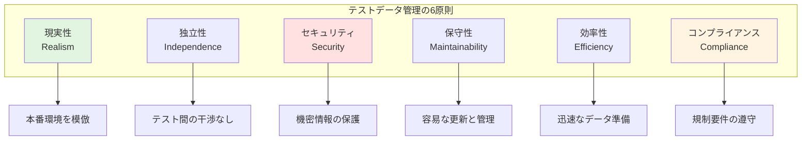
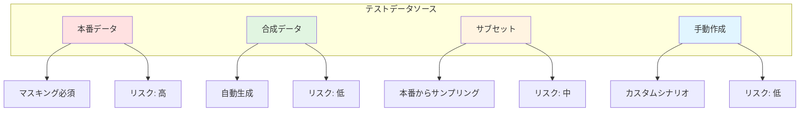

# テストデータ管理ガイド

## ドキュメント情報
- **バージョン**: 1.0.0
- **最終更新**: 2025-10-27
- **ステータス**: アクティブ
- **対象者**: 全開発者、QAエンジニア、データエンジニア
- **前提ドキュメント**: [testing-strategy.md](testing-strategy.md), [integration-testing.md](integration-testing.md)

## 目次
1. [テストデータ管理の基本原則](#テストデータ管理の基本原則)
2. [テストデータ戦略](#テストデータ戦略)
3. [データプライバシーとコンプライアンス](#データプライバシーとコンプライアンス)
4. [テストデータ生成](#テストデータ生成)
5. [テストデータ準備](#テストデータ準備)
6. [データマスキングと匿名化](#データマスキングと匿名化)
7. [テストデータライフサイクル](#テストデータライフサイクル)
8. [データベース管理](#データベース管理)
9. [テストデータ最適化](#テストデータ最適化)
10. [ツールと自動化](#ツールと自動化)
11. [Devin AIガイドライン](#devin-aiガイドライン)

---

## テストデータ管理の基本原則

### 定義と重要性

**テストデータ管理とは**:
- テストで使用するデータの作成、維持、制御、提供を行うプロセス
- 品質保証活動において信頼性の高いテストを実現するための基盤

**重要性**:
- **テスト信頼性**: 適切なデータで正確なテスト結果を保証
- **再現性**: 同じデータで繰り返しテストを実行可能
- **効率性**: データ準備時間の削減
- **コンプライアンス**: データプライバシー規制への対応
- **コスト削減**: 本番データへの依存を減らす

### テストデータ管理の原則



**6原則の詳細説明**:
1. **現実性（Realism）**: テストデータは本番環境のデータ特性を反映し、実際のシナリオを再現
2. **独立性（Independence）**: 各テストが他のテストに影響を与えず、並列実行が可能
3. **セキュリティ（Security）**: 機密情報や個人情報を適切に保護
4. **保守性（Maintainability）**: データ構造の変更に対応しやすく、更新が容易
5. **効率性（Efficiency）**: データ生成と準備が迅速で、テスト実行を遅延させない
6. **コンプライアンス（Compliance）**: GDPR、CCPA等のデータ保護規制を遵守

### テストデータの品質特性

**必要な品質特性**:
- **正確性**: データが期待される形式と値の範囲に収まる
- **完全性**: テストシナリオに必要なすべてのデータが揃っている
- **一貫性**: データ間の関係性が正しく保たれている
- **適切性**: テスト目的に適したデータ量と多様性
- **最新性**: 現在のビジネスルールとデータ構造に準拠

---

## テストデータ戦略

### データソースの種類



**各データソースの特徴**:

| データソース | メリット | デメリット | 使用場面 |
|--------------|----------|------------|----------|
| **本番データ** | ・現実的なデータ<br/>・実際のエッジケース含む<br/>・データ関係性が正確 | ・個人情報リスク<br/>・マスキング必須<br/>・大容量 | パフォーマンステスト、本番相当の検証 |
| **合成データ** | ・プライバシー問題なし<br/>・必要な量を生成可能<br/>・特定シナリオに最適化 | ・現実性に欠ける可能性<br/>・生成ロジックの保守 | ユニットテスト、機能テスト |
| **サブセット** | ・現実的かつ管理可能<br/>・マスキング後は安全<br/>・適切なサイズ | ・サンプリングバイアス<br/>・定期更新必要 | 統合テスト、E2Eテスト |
| **手動作成** | ・特定シナリオに最適<br/>・完全制御可能<br/>・軽量 | ・時間がかかる<br/>・スケールしない | 境界値テスト、エラーケース |

### 戦略選択のフレームワーク

<details>
<summary>データ戦略決定ロジックの実装例</summary>

```kotlin
// テストデータ戦略決定エンジン
class TestDataStrategyEngine {
    
    fun determineStrategy(
        testType: TestType,
        dataRequirements: DataRequirements
    ): DataStrategy {
        return when (testType) {
            TestType.UNIT -> selectUnitTestStrategy(dataRequirements)
            TestType.INTEGRATION -> selectIntegrationTestStrategy(dataRequirements)
            TestType.E2E -> selectE2ETestStrategy(dataRequirements)
            TestType.PERFORMANCE -> selectPerformanceTestStrategy(dataRequirements)
        }
    }
    
    // ユニットテスト戦略
    private fun selectUnitTestStrategy(
        requirements: DataRequirements
    ): DataStrategy {
        // ユニットテストは合成データまたは手動作成を推奨
        return if (requirements.complexity == Complexity.LOW) {
            DataStrategy.ManualCreation(
                approach = "Simple hardcoded test data",
                tooling = listOf("Test data builders", "Fixtures")
            )
        } else {
            DataStrategy.Synthetic(
                generator = "Faker library or custom generator",
                volume = requirements.volume,
                characteristics = requirements.characteristics
            )
        }
    }
    
    // 統合テスト戦略
    private fun selectIntegrationTestStrategy(
        requirements: DataRequirements
    ): DataStrategy {
        // 統合テストはサブセットまたは合成データ
        return when {
            requirements.needsRealisticRelationships -> {
                DataStrategy.ProductionSubset(
                    samplingMethod = "Representative sampling",
                    maskingRequired = true,
                    subsetSize = requirements.volume
                )
            }
            requirements.hasSensitiveData -> {
                DataStrategy.Synthetic(
                    generator = "Advanced synthetic data generator",
                    preserveRelationships = true,
                    volume = requirements.volume
                )
            }
            else -> {
                DataStrategy.Hybrid(
                    primary = "Synthetic data",
                    secondary = "Subset for edge cases",
                    blendRatio = 0.7  // 70% synthetic, 30% subset
                )
            }
        }
    }
    
    // E2Eテスト戦略
    private fun selectE2ETestStrategy(
        requirements: DataRequirements
    ): DataStrategy {
        // E2Eテストは本番サブセット（マスキング後）を推奨
        return DataStrategy.ProductionSubset(
            samplingMethod = "Stratified sampling to ensure diversity",
            maskingRequired = true,
            subsetSize = requirements.volume,
            refreshFrequency = RefreshFrequency.WEEKLY
        )
    }
    
    // パフォーマンステスト戦略
    private fun selectPerformanceTestStrategy(
        requirements: DataRequirements
    ): DataStrategy {
        // パフォーマンステストは大量の合成データ
        return DataStrategy.Synthetic(
            generator = "High-volume data generator",
            volume = requirements.volume,
            distributionPattern = "Match production data distribution",
            characteristics = requirements.characteristics
        )
    }
}

// データ要件定義
data class DataRequirements(
    val volume: DataVolume,
    val complexity: Complexity,
    val needsRealisticRelationships: Boolean,
    val hasSensitiveData: Boolean,
    val characteristics: List<DataCharacteristic>
)

// データボリューム
sealed class DataVolume {
    object Small : DataVolume()  // < 1,000 records
    object Medium : DataVolume()  // 1,000 - 100,000 records
    object Large : DataVolume()  // 100,000 - 1,000,000 records
    object VeryLarge : DataVolume()  // > 1,000,000 records
}

// データ特性
enum class DataCharacteristic {
    TEMPORAL,  // 時系列データ
    HIERARCHICAL,  // 階層構造
    RELATIONAL,  // 複雑な関係性
    GEOSPATIAL,  // 地理情報
    MULTIMEDIA,  // マルチメディア
    HIGH_CARDINALITY  // 高いカーディナリティ
}
```

</details>

### 環境別データ管理

**環境ごとのデータ戦略**:

| 環境 | データソース | 更新頻度 | セキュリティレベル |
|------|--------------|----------|---------------------|
| **開発(Dev)** | 合成データ、小規模サブセット | 随時 | 低 |
| **統合(Integration)** | サブセット（マスキング済） | 週次 | 中 |
| **ステージング(Staging)** | 本番サブセット（マスキング済） | 日次 | 高 |
| **本番(Production)** | 実データ | リアルタイム | 最高 |

---

