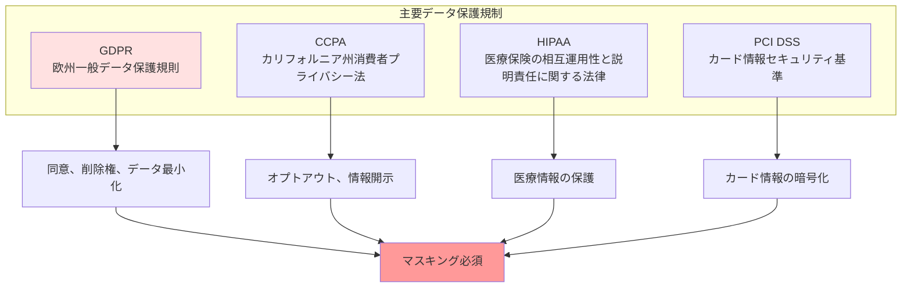
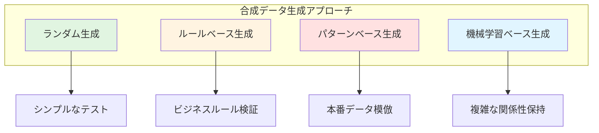

# テストデータ管理標準

## データプライバシーとコンプライアンス

### 規制要件



**各規制の主要要件**:

**GDPR（欧州一般データ保護規則）**:
- **データ最小化**: 必要最小限のデータのみ処理
- **目的制限**: 収集した目的以外での使用禁止
- **透明性**: データ処理の明確な説明
- **削除権**: 個人の要求によるデータ削除

**CCPA（カリフォルニア州消費者プライバシー法）**:
- **開示義務**: 収集するデータの種類を開示
- **オプトアウト権**: データ販売への拒否権
- **アクセス権**: 自分のデータへのアクセス権

**HIPAA（医療情報保護）**:
- **PHI保護**: 保護対象医療情報の厳格な管理
- **アクセス制御**: 権限のある者のみアクセス可能
- **監査証跡**: すべてのアクセスを記録

**PCI DSS（カード情報セキュリティ）**:
- **暗号化**: カード情報の保存と送信時の暗号化
- **アクセス制限**: カード情報へのアクセス制限
- **定期監査**: セキュリティ監査の実施

### 個人情報の分類

<details>
<summary>個人情報分類と処理方法の実装例</summary>

```kotlin
// 個人情報分類システム
enum class DataClassification {
    PUBLIC,          // 公開情報
    INTERNAL,        // 内部情報
    CONFIDENTIAL,    // 機密情報
    RESTRICTED,      // 制限情報
    PII,             // 個人識別情報
    SENSITIVE_PII    // 機密個人情報
}

// データフィールド分類
data class DataField(
    val name: String,
    val classification: DataClassification,
    val maskingStrategy: MaskingStrategy,
    val retentionPeriod: RetentionPeriod
)

// データ分類エンジン
class DataClassificationEngine {
    
    // 自動分類
    fun classifyField(
        fieldName: String,
        fieldValue: Any?,
        context: DataContext
    ): DataClassification {
        // フィールド名からの推測
        val nameBasedClassification = classifyByName(fieldName)
        
        // 値のパターンからの推測
        val valueBasedClassification = classifyByValue(fieldValue)
        
        // コンテキストからの判断
        val contextBasedClassification = classifyByContext(context)
        
        // 最も制限的な分類を採用
        return maxOf(
            nameBasedClassification,
            valueBasedClassification,
            contextBasedClassification
        )
    }
    
    // フィールド名による分類
    private fun classifyByName(fieldName: String): DataClassification {
        val lowercaseName = fieldName.lowercase()
        
        return when {
            // 機密個人情報
            lowercaseName.contains("ssn") -> DataClassification.SENSITIVE_PII
            lowercaseName.contains("tax_id") -> DataClassification.SENSITIVE_PII
            lowercaseName.contains("credit_card") -> DataClassification.SENSITIVE_PII
            lowercaseName.contains("passport") -> DataClassification.SENSITIVE_PII
            
            // 個人識別情報
            lowercaseName.contains("email") -> DataClassification.PII
            lowercaseName.contains("phone") -> DataClassification.PII
            lowercaseName.contains("address") -> DataClassification.PII
            lowercaseName.contains("name") -> DataClassification.PII
            lowercaseName.contains("dob") -> DataClassification.PII
            lowercaseName.contains("birth_date") -> DataClassification.PII
            
            // 機密情報
            lowercaseName.contains("password") -> DataClassification.RESTRICTED
            lowercaseName.contains("token") -> DataClassification.RESTRICTED
            lowercaseName.contains("secret") -> DataClassification.RESTRICTED
            
            else -> DataClassification.INTERNAL
        }
    }
    
    // 値のパターンによる分類
    private fun classifyByValue(value: Any?): DataClassification {
        if (value == null) return DataClassification.PUBLIC
        
        val stringValue = value.toString()
        
        return when {
            // SSN パターン (XXX-XX-XXXX)
            Regex("""\d{3}-\d{2}-\d{4}""").matches(stringValue) -> 
                DataClassification.SENSITIVE_PII
            
            // クレジットカード パターン
            Regex("""\d{4}[- ]?\d{4}[- ]?\d{4}[- ]?\d{4}""").matches(stringValue) -> 
                DataClassification.SENSITIVE_PII
            
            // メールアドレス パターン
            Regex("""[\w._%+-]+@[\w.-]+\.\w{2,}""").matches(stringValue) -> 
                DataClassification.PII
            
            // 電話番号 パターン
            Regex("""\+?\d{1,3}?[- ]?\(?\d{1,4}\)?[- ]?\d{1,4}[- ]?\d{1,9}""").matches(stringValue) -> 
                DataClassification.PII
            
            else -> DataClassification.INTERNAL
        }
    }
    
    // 処理方法の決定
    fun determineProcessing(
        classification: DataClassification
    ): DataProcessingPolicy {
        return when (classification) {
            DataClassification.SENSITIVE_PII -> DataProcessingPolicy(
                maskingRequired = true,
                maskingStrategy = MaskingStrategy.FULL_REDACTION,
                encryptionRequired = true,
                accessLoggingRequired = true,
                retentionPeriod = RetentionPeriod.DAYS_30
            )
            DataClassification.PII -> DataProcessingPolicy(
                maskingRequired = true,
                maskingStrategy = MaskingStrategy.PARTIAL_MASKING,
                encryptionRequired = true,
                accessLoggingRequired = true,
                retentionPeriod = RetentionPeriod.DAYS_90
            )
            DataClassification.RESTRICTED -> DataProcessingPolicy(
                maskingRequired = true,
                maskingStrategy = MaskingStrategy.TOKENIZATION,
                encryptionRequired = true,
                accessLoggingRequired = true,
                retentionPeriod = RetentionPeriod.DAYS_180
            )
            DataClassification.CONFIDENTIAL -> DataProcessingPolicy(
                maskingRequired = false,
                maskingStrategy = MaskingStrategy.NONE,
                encryptionRequired = true,
                accessLoggingRequired = true,
                retentionPeriod = RetentionPeriod.DAYS_365
            )
            else -> DataProcessingPolicy(
                maskingRequired = false,
                maskingStrategy = MaskingStrategy.NONE,
                encryptionRequired = false,
                accessLoggingRequired = false,
                retentionPeriod = RetentionPeriod.UNLIMITED
            )
        }
    }
}
```

</details>

### コンプライアンスチェックリスト

**テストデータ使用前の確認事項**:
- ✅ 個人情報が適切にマスキングされている
- ✅ 機密情報が暗号化されている
- ✅ データアクセスログが記録されている
- ✅ データ保持期間ポリシーが定義されている
- ✅ データ削除プロセスが確立されている
- ✅ 法務/コンプライアンス部門の承認を得ている
- ✅ テスト完了後のデータクリーンアップ手順が明確

---

## テストデータ生成

### 合成データ生成戦略



**各アプローチの特徴**:

**ランダム生成**:
- **用途**: 基本的な機能テスト、境界値テスト
- **メリット**: 実装が簡単、高速
- **デメリット**: 現実性に欠ける、ビジネスルール違反の可能性

**ルールベース生成**:
- **用途**: ビジネスロジック検証、バリデーションテスト
- **メリット**: ビジネスルールに準拠、予測可能
- **デメリット**: ルールの保守が必要、柔軟性に欠ける

**パターンベース生成**:
- **用途**: 統合テスト、E2Eテスト
- **メリット**: 本番データの特性を模倣、現実的
- **デメリット**: 本番データの分析が必要、複雑

**機械学習ベース生成**:
- **用途**: 大規模データセット、複雑な関係性の再現
- **メリット**: 高度な現実性、関係性保持
- **デメリット**: 実装コスト高、説明可能性低

### データビルダーパターン

<details>
<summary>データビルダーの実装例</summary>

```kotlin
// テストデータビルダー
class UserBuilder {
    
    private var id: String = generateUniqueId()
    private var email: String = generateRandomEmail()
    private var name: String = generateRandomName()
    private var age: Int = generateRandomAge()
    private var role: UserRole = UserRole.STANDARD
    private var createdAt: Timestamp = getCurrentTimestamp()
    private var isActive: Boolean = true
    
    // ビルダーメソッド
    fun withId(id: String) = apply { this.id = id }
    fun withEmail(email: String) = apply { this.email = email }
    fun withName(name: String) = apply { this.name = name }
    fun withAge(age: Int) = apply { this.age = age }
    fun withRole(role: UserRole) = apply { this.role = role }
    fun withCreatedAt(timestamp: Timestamp) = apply { this.createdAt = timestamp }
    fun inactive() = apply { this.isActive = false }
    
    // プリセット設定
    fun asAdmin() = apply {
        this.role = UserRole.ADMIN
        this.email = "admin-${generateUniqueId()}@example.com"
    }
    
    fun asNewUser() = apply {
        this.createdAt = getCurrentTimestamp()
        this.role = UserRole.STANDARD
    }
    
    fun asInactiveUser() = apply {
        this.isActive = false
    }
    
    // ビルド
    fun build(): User {
        return User(
            id = id,
            email = email,
            name = name,
            age = age,
            role = role,
            createdAt = createdAt,
            isActive = isActive
        )
    }
    
    // ランダムデータ生成ヘルパー
    private fun generateUniqueId(): String {
        return "user-${System.currentTimeMillis()}-${Random.nextInt(10000)}"
    }
    
    private fun generateRandomEmail(): String {
        return "test-${generateUniqueId()}@example.com"
    }
    
    private fun generateRandomName(): String {
        val firstNames = listOf("John", "Jane", "Alice", "Bob", "Charlie")
        val lastNames = listOf("Smith", "Johnson", "Williams", "Brown", "Jones")
        return "${firstNames.random()} ${lastNames.random()}"
    }
    
    private fun generateRandomAge(): Int {
        return (18..80).random()
    }
}

// 関連エンティティビルダー
class OrderBuilder {
    
    private var id: String = generateOrderId()
    private var userId: String = ""
    private var items: MutableList<OrderItem> = mutableListOf()
    private var status: OrderStatus = OrderStatus.PENDING
    private var totalAmount: BigDecimal = BigDecimal.ZERO
    private var createdAt: Timestamp = getCurrentTimestamp()
    
    fun forUser(user: User) = apply {
        this.userId = user.id
    }
    
    fun forUserId(userId: String) = apply {
        this.userId = userId
    }
    
    fun withItem(item: OrderItem) = apply {
        items.add(item)
        recalculateTotal()
    }
    
    fun withItems(items: List<OrderItem>) = apply {
        this.items.addAll(items)
        recalculateTotal()
    }
    
    fun withStatus(status: OrderStatus) = apply {
        this.status = status
    }
    
    fun asCompleted() = apply {
        this.status = OrderStatus.COMPLETED
    }
    
    fun asCancelled() = apply {
        this.status = OrderStatus.CANCELLED
    }
    
    fun build(): Order {
        require(userId.isNotBlank()) { "User ID is required" }
        require(items.isNotEmpty()) { "At least one item is required" }
        
        return Order(
            id = id,
            userId = userId,
            items = items,
            status = status,
            totalAmount = totalAmount,
            createdAt = createdAt
        )
    }
    
    private fun recalculateTotal() {
        totalAmount = items.sumOf { it.price * BigDecimal(it.quantity) }
    }
    
    private fun generateOrderId(): String {
        return "ORD-${System.currentTimeMillis()}"
    }
}

// テストでの使用例
class UserOrderTest {
    
    @Test
    fun userCanPlaceOrder() {
        // テストデータ準備
        val user = UserBuilder()
            .withEmail("john.doe@example.com")
            .withName("John Doe")
            .build()
        
        val order = OrderBuilder()
            .forUser(user)
            .withItem(OrderItem(productId = "PROD-001", quantity = 2, price = BigDecimal("19.99")))
            .withItem(OrderItem(productId = "PROD-002", quantity = 1, price = BigDecimal("29.99")))
            .build()
        
        // テスト実行
        val result = orderService.placeOrder(order)
        
        // 検証
        assertThat(result.isSuccess).isTrue()
        assertThat(order.totalAmount).isEqualTo(BigDecimal("69.97"))
    }
}
```

</details>

### ファクトリパターン

<details>
<summary>テストデータファクトリの実装例</summary>

```kotlin
// テストデータファクトリ
object TestDataFactory {
    
    // ユーザーファクトリ
    object Users {
        
        fun standard(): User {
            return UserBuilder()
                .withRole(UserRole.STANDARD)
                .build()
        }
        
        fun admin(): User {
            return UserBuilder()
                .asAdmin()
                .build()
        }
        
        fun inactive(): User {
            return UserBuilder()
                .inactive()
                .build()
        }
        
        fun withOrders(orderCount: Int): UserWithOrders {
            val user = standard()
            val orders = (1..orderCount).map { 
                Orders.forUser(user) 
            }
            return UserWithOrders(user, orders)
        }
    }
    
    // 注文ファクトリ
    object Orders {
        
        fun forUser(user: User): Order {
            return OrderBuilder()
                .forUser(user)
                .withItem(OrderItem("PROD-001", 1, BigDecimal("29.99")))
                .build()
        }
        
        fun completed(): Order {
            val user = Users.standard()
            return OrderBuilder()
                .forUser(user)
                .withItem(OrderItem("PROD-001", 1, BigDecimal("29.99")))
                .asCompleted()
                .build()
        }
        
        fun pending(): Order {
            val user = Users.standard()
            return OrderBuilder()
                .forUser(user)
                .withItem(OrderItem("PROD-001", 1, BigDecimal("29.99")))
                .build()
        }
        
        fun cancelled(): Order {
            val user = Users.standard()
            return OrderBuilder()
                .forUser(user)
                .withItem(OrderItem("PROD-001", 1, BigDecimal("29.99")))
                .asCancelled()
                .build()
        }
        
        fun large(): Order {
            val user = Users.standard()
            val items = (1..10).map { index ->
                OrderItem(
                    productId = "PROD-${index.toString().padStart(3, '0')}",
                    quantity = Random.nextInt(1, 5),
                    price = BigDecimal(Random.nextDouble(10.0, 100.0))
                )
            }
            return OrderBuilder()
                .forUser(user)
                .withItems(items)
                .build()
        }
    }
    
    // 商品ファクトリ
    object Products {
        
        fun inStock(): Product {
            return Product(
                id = "PROD-${Random.nextInt(1000)}",
                name = "Test Product",
                price = BigDecimal("29.99"),
                stock = 100
            )
        }
        
        fun outOfStock(): Product {
            return Product(
                id = "PROD-${Random.nextInt(1000)}",
                name = "Out of Stock Product",
                price = BigDecimal("29.99"),
                stock = 0
            )
        }
        
        fun lowStock(): Product {
            return Product(
                id = "PROD-${Random.nextInt(1000)}",
                name = "Low Stock Product",
                price = BigDecimal("29.99"),
                stock = 5
            )
        }
    }
}

// テストでの使用
class OrderServiceTest {
    
    @Test
    fun adminCanViewAllOrders() {
        // 管理者ユーザーを作成
        val admin = TestDataFactory.Users.admin()
        
        // 複数の注文を作成
        val orders = listOf(
            TestDataFactory.Orders.completed(),
            TestDataFactory.Orders.pending(),
            TestDataFactory.Orders.cancelled()
        )
        
        // テスト実行
        val result = orderService.getAllOrders(admin)
        
        // 検証
        assertThat(result).hasSize(3)
    }
    
    @Test
    fun cannotOrderOutOfStockProduct() {
        val user = TestDataFactory.Users.standard()
        val product = TestDataFactory.Products.outOfStock()
        
        // テスト実行
        val result = orderService.createOrder(user, product, quantity = 1)
        
        // 検証
        assertThat(result.isFailure).isTrue()
        assertThat(result.error).contains("out of stock")
    }
}
```

</details>

### Faker ライブラリの活用

**Faker ライブラリでの生成例**:

```
Faker を使用した現実的なテストデータ生成:
- 名前: 人名データベースから選択
- メールアドレス: 実在しそうな形式
- 住所: 実際の市区町村名
- 電話番号: 適切な形式
- 会社名: 実在しそうな企業名
- テキスト: Lorem ipsum や実際の文章
```

---

