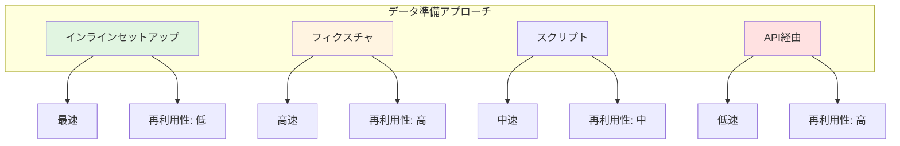
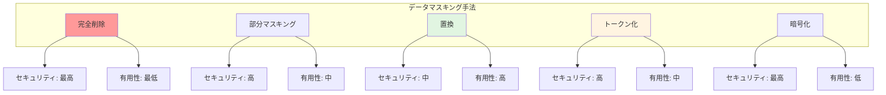
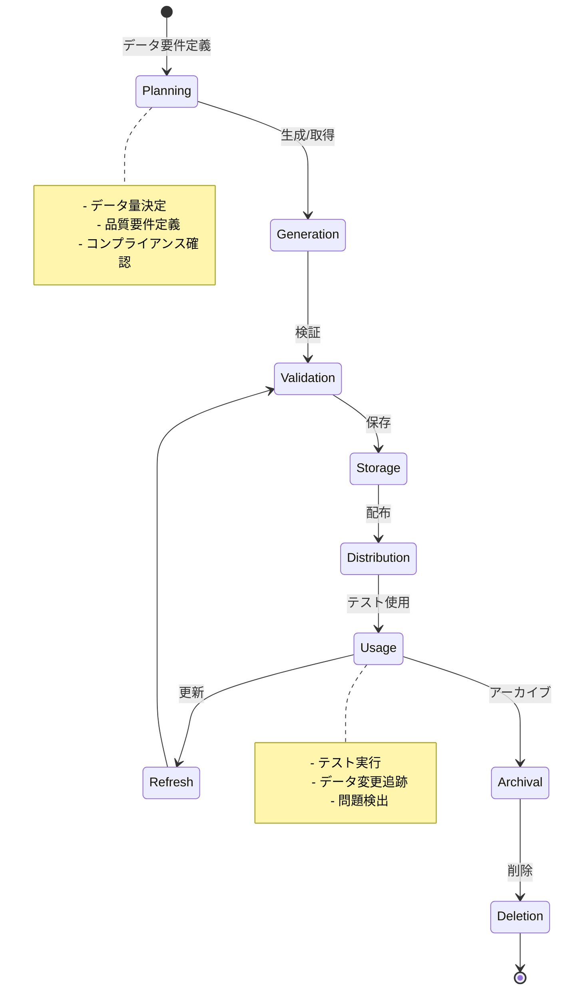

# テストデータ管理標準

## テストデータ準備

### データセットアップ戦略



**各アプローチの説明**:

**インラインセットアップ**:
- テストコード内で直接データを作成
- **メリット**: 最速、テストと一体化
- **デメリット**: 再利用性低い、冗長になりがち
- **使用場面**: ユニットテスト、シンプルなシナリオ

**フィクスチャ**:
- 事前定義されたデータファイル（JSON、YAML、SQL）
- **メリット**: 再利用可能、バージョン管理可能
- **デメリット**: 保守が必要、データ量が多いと管理困難
- **使用場面**: 統合テスト、E2Eテスト

**スクリプト**:
- データベースシードスクリプト
- **メリット**: 複雑なデータ構造に対応、再現性高い
- **デメリット**: 実行時間がかかる、環境依存
- **使用場面**: 環境初期化、大量データ投入

**API経由**:
- アプリケーションAPIを使ってデータ作成
- **メリット**: ビジネスロジック通過、検証済みデータ
- **デメリット**: 最も遅い、API依存
- **使用場面**: E2Eテスト、受け入れテスト

<details>
<summary>データセットアップパターンの実装例</summary>

```kotlin
// データセットアップマネージャー
class TestDataSetup {
    
    // アプローチ1: インラインセットアップ
    fun inlineSetup(): TestContext {
        val user = User(
            id = "user-001",
            email = "test@example.com",
            name = "Test User"
        )
        
        val product = Product(
            id = "prod-001",
            name = "Test Product",
            price = BigDecimal("29.99")
        )
        
        return TestContext(user, product)
    }
    
    // アプローチ2: フィクスチャベース
    fun fixtureBasedSetup(fixtureName: String): TestContext {
        val fixtureData = loadFixture(fixtureName)
        val user = parseUser(fixtureData["user"])
        val products = parseProducts(fixtureData["products"])
        
        return TestContext(user, products)
    }
    
    // アプローチ3: スクリプトベース
    fun scriptBasedSetup(scriptPath: String): TestContext {
        executeScript(scriptPath)
        
        // スクリプト実行後にデータを取得
        val user = fetchUserFromDatabase("user-001")
        val products = fetchProductsFromDatabase()
        
        return TestContext(user, products)
    }
    
    // アプローチ4: API経由
    fun apiBasedSetup(): TestContext {
        // APIを使ってユーザー作成
        val userResponse = apiClient.post("/users", mapOf(
            "email" to "test@example.com",
            "name" to "Test User"
        ))
        val user = parseUser(userResponse)
        
        // APIを使って商品作成
        val productResponse = apiClient.post("/products", mapOf(
            "name" to "Test Product",
            "price" to 29.99
        ))
        val product = parseProduct(productResponse)
        
        return TestContext(user, product)
    }
}

// フィクスチャローダー
class FixtureLoader {
    
    fun loadFixture(name: String): Map<String, Any> {
        val fixturePath = "fixtures/$name.json"
        val jsonContent = readFile(fixturePath)
        return parseJson(jsonContent)
    }
    
    fun loadYamlFixture(name: String): Map<String, Any> {
        val fixturePath = "fixtures/$name.yaml"
        val yamlContent = readFile(fixturePath)
        return parseYaml(yamlContent)
    }
}

// データベースシーダー
class DatabaseSeeder {
    
    fun seed(seedFile: String) {
        val sqlStatements = parseSeedFile(seedFile)
        
        database.transaction {
            sqlStatements.forEach { statement ->
                execute(statement)
            }
        }
    }
    
    fun seedFromCsv(tableName: String, csvFile: String) {
        val records = parseCsvFile(csvFile)
        
        database.transaction {
            records.forEach { record ->
                insertRecord(tableName, record)
            }
        }
    }
}

// テストでの使用例
class ProductOrderTest {
    
    private lateinit var dataSetup: TestDataSetup
    
    @BeforeEach
    fun setup() {
        dataSetup = TestDataSetup()
    }
    
    @Test
    fun testWithInlineData() {
        // インラインセットアップ
        val context = dataSetup.inlineSetup()
        
        // テスト実行
        val order = createOrder(context.user, context.product)
        
        // 検証
        assertThat(order).isNotNull()
    }
    
    @Test
    fun testWithFixture() {
        // フィクスチャからセットアップ
        val context = dataSetup.fixtureBasedSetup("user-with-orders")
        
        // テスト実行
        val orders = getOrders(context.user)
        
        // 検証
        assertThat(orders).hasSize(3)
    }
}
```

</details>

### データクリーンアップ

**クリーンアップ戦略**:

| 戦略 | タイミング | メリット | デメリット |
|------|-----------|---------|----------|
| **テスト後削除** | @AfterEach | 確実なクリーンアップ | 遅い |
| **トランザクションロールバック** | テスト終了時 | 高速 | トランザクション対応のみ |
| **専用テストDB** | テストスイート後 | 並列実行可能 | リソース消費大 |
| **データパーティション** | 不要 | 高速 | 分離が必要 |

<details>
<summary>クリーンアップ実装例</summary>

```kotlin
// クリーンアップマネージャー
class TestDataCleanup {
    
    private val createdResources = mutableListOf<ResourceIdentifier>()
    
    // リソース追跡
    fun track(resource: Any) {
        val identifier = when (resource) {
            is User -> ResourceIdentifier.User(resource.id)
            is Order -> ResourceIdentifier.Order(resource.id)
            is Product -> ResourceIdentifier.Product(resource.id)
            else -> throw IllegalArgumentException("Unsupported resource type")
        }
        createdResources.add(identifier)
    }
    
    // すべてクリーンアップ
    fun cleanupAll() {
        // 依存関係の逆順で削除
        createdResources.reversed().forEach { identifier ->
            when (identifier) {
                is ResourceIdentifier.User -> deleteUser(identifier.id)
                is ResourceIdentifier.Order -> deleteOrder(identifier.id)
                is ResourceIdentifier.Product -> deleteProduct(identifier.id)
            }
        }
        createdResources.clear()
    }
    
    // 特定タイプのみクリーンアップ
    fun cleanupByType(type: ResourceType) {
        val toDelete = createdResources.filter { it.type == type }
        toDelete.forEach { identifier ->
            deleteResource(identifier)
            createdResources.remove(identifier)
        }
    }
}

// トランザクションベースクリーンアップ
class TransactionalTestSupport {
    
    @BeforeEach
    fun beginTransaction() {
        database.beginTransaction()
    }
    
    @AfterEach
    fun rollbackTransaction() {
        database.rollbackTransaction()
    }
}

// テストでの使用
class OrderServiceTest {
    
    private val cleanup = TestDataCleanup()
    
    @AfterEach
    fun cleanupTestData() {
        cleanup.cleanupAll()
    }
    
    @Test
    fun testOrderCreation() {
        // データ作成
        val user = createUser()
        cleanup.track(user)
        
        val product = createProduct()
        cleanup.track(product)
        
        val order = createOrder(user, product)
        cleanup.track(order)
        
        // テスト実行
        assertThat(order.status).isEqualTo(OrderStatus.PENDING)
        
        // クリーンアップは @AfterEach で自動実行
    }
}
```

</details>

---

## データマスキングと匿名化

### マスキング手法



**各手法の詳細**:

| 手法 | 説明 | 例 | 使用場面 |
|------|------|----|----|
| **完全削除** | データを完全に削除または固定値に | `john.doe@example.com` → `[REDACTED]` | 機密度最高のデータ |
| **部分マスキング** | 一部を隠して形式を保持 | `4111-1111-1111-1111` → `4111-****-****-1111` | クレジットカード、電話番号 |
| **置換** | 同じ形式の偽データに置換 | `john.doe@example.com` → `user123@test.com` | 一般的なPII |
| **トークン化** | 元の値に戻せるトークンに変換 | `john.doe@example.com` → `TOKEN_XYZ123` | データ関係性を保持 |
| **暗号化** | 暗号化して可逆的に保護 | `john.doe@example.com` → `encrypted_blob` | 一時的な保護 |

<details>
<summary>データマスキング実装例</summary>

```kotlin
// データマスキングエンジン
class DataMaskingEngine {
    
    // 完全削除
    fun redact(value: String): String {
        return "[REDACTED]"
    }
    
    // 部分マスキング: クレジットカード
    fun maskCreditCard(cardNumber: String): String {
        if (cardNumber.length < 16) return maskAll(cardNumber)
        
        val first4 = cardNumber.substring(0, 4)
        val last4 = cardNumber.substring(cardNumber.length - 4)
        return "$first4-****-****-$last4"
    }
    
    // 部分マスキング: メールアドレス
    fun maskEmail(email: String): String {
        val parts = email.split("@")
        if (parts.size != 2) return maskAll(email)
        
        val username = parts[0]
        val domain = parts[1]
        
        val maskedUsername = if (username.length <= 2) {
            "*".repeat(username.length)
        } else {
            username.substring(0, 2) + "*".repeat(username.length - 2)
        }
        
        return "$maskedUsername@$domain"
    }
    
    // 部分マスキング: 電話番号
    fun maskPhoneNumber(phone: String): String {
        val digits = phone.replace(Regex("[^0-9]"), "")
        if (digits.length < 10) return maskAll(phone)
        
        val last4 = digits.substring(digits.length - 4)
        val masked = "*".repeat(digits.length - 4) + last4
        
        // 元の形式を復元
        return restoreFormat(phone, masked)
    }
    
    // 置換: 名前
    fun substituteName(originalName: String): String {
        val fakeNames = listOf(
            "John Smith", "Jane Doe", "Alice Johnson",
            "Bob Williams", "Charlie Brown"
        )
        return fakeNames.random()
    }
    
    // 置換: 住所
    fun substituteAddress(originalAddress: String): String {
        return "123 Test Street, Test City, TC 12345"
    }
    
    // トークン化
    fun tokenize(value: String, context: String): String {
        val token = generateToken(value, context)
        storeMapping(token, value)  // 逆変換用に保存
        return token
    }
    
    // トークン逆変換
    fun detokenize(token: String): String? {
        return retrieveOriginalValue(token)
    }
    
    // 暗号化
    fun encrypt(value: String, key: EncryptionKey): String {
        return encryptAES256(value, key)
    }
    
    // 復号化
    fun decrypt(encryptedValue: String, key: EncryptionKey): String {
        return decryptAES256(encryptedValue, key)
    }
    
    // プライベートヘルパー
    private fun maskAll(value: String): String {
        return "*".repeat(value.length)
    }
    
    private fun generateToken(value: String, context: String): String {
        val hash = hashSHA256("$value:$context")
        return "TOKEN_${hash.substring(0, 16).uppercase()}"
    }
}

// データマスキングパイプライン
class MaskingPipeline {
    
    private val engine = DataMaskingEngine()
    private val classifier = DataClassificationEngine()
    
    fun maskRecord(record: Map<String, Any?>): Map<String, Any?> {
        return record.mapValues { (fieldName, value) ->
            if (value == null) {
                null
            } else {
                maskField(fieldName, value.toString())
            }
        }
    }
    
    private fun maskField(fieldName: String, value: String): String {
        val classification = classifier.classifyField(fieldName, value, DataContext())
        
        return when (classification) {
            DataClassification.SENSITIVE_PII -> {
                when {
                    fieldName.contains("credit_card") -> engine.maskCreditCard(value)
                    fieldName.contains("ssn") -> engine.redact(value)
                    else -> engine.tokenize(value, fieldName)
                }
            }
            DataClassification.PII -> {
                when {
                    fieldName.contains("email") -> engine.maskEmail(value)
                    fieldName.contains("phone") -> engine.maskPhoneNumber(value)
                    fieldName.contains("name") -> engine.substituteName(value)
                    fieldName.contains("address") -> engine.substituteAddress(value)
                    else -> value
                }
            }
            else -> value
        }
    }
    
    // バッチ処理
    fun maskDataset(dataset: List<Map<String, Any?>>): List<Map<String, Any?>> {
        return dataset.map { record -> maskRecord(record) }
    }
}

// 使用例
class DataMaskingTest {
    
    @Test
    fun testCreditCardMasking() {
        val engine = DataMaskingEngine()
        
        val original = "4111-1111-1111-1111"
        val masked = engine.maskCreditCard(original)
        
        assertThat(masked).isEqualTo("4111-****-****-1111")
    }
    
    @Test
    fun testEmailMasking() {
        val engine = DataMaskingEngine()
        
        val original = "john.doe@example.com"
        val masked = engine.maskEmail(original)
        
        assertThat(masked).isEqualTo("jo******@example.com")
    }
    
    @Test
    fun testRecordMasking() {
        val pipeline = MaskingPipeline()
        
        val record = mapOf(
            "id" to "123",
            "name" to "John Doe",
            "email" to "john.doe@example.com",
            "credit_card" to "4111-1111-1111-1111"
        )
        
        val masked = pipeline.maskRecord(record)
        
        assertThat(masked["id"]).isEqualTo("123")  // IDはそのまま
        assertThat(masked["name"]).isNotEqualTo("John Doe")  // 名前は置換
        assertThat(masked["email"]).contains("@example.com")  // 形式保持
        assertThat(masked["credit_card"]).contains("****")  // マスク済み
    }
}
```

</details>

### 匿名化のベストプラクティス

**効果的な匿名化のための原則**:
- **k-匿名性**: 個人を特定できないよう最低k人の同じ属性を持つグループに
- **l-多様性**: 機密属性に十分な多様性を確保
- **t-近接性**: 機密属性の分布が元のデータと近い
- **差分プライバシー**: 個人の追加・削除がデータセット全体に影響しない

---

## テストデータライフサイクル

### ライフサイクル管理



**各フェーズの詳細**:
1. **Planning（計画）**: テスト要件からデータニーズを定義
2. **Generation（生成）**: データを作成または本番から取得
3. **Validation（検証）**: データの品質とコンプライアンスを確認
4. **Storage（保存）**: セキュアな場所に保存
5. **Distribution（配布）**: テスト環境へ配布
6. **Usage（使用）**: テストで実際に使用
7. **Refresh（更新）**: 定期的にデータを最新化
8. **Archival（アーカイブ）**: 使用終了後にアーカイブ
9. **Deletion（削除）**: 保持期限後に完全削除

<details>
<summary>ライフサイクル管理の実装例</summary>

```kotlin
// テストデータライフサイクルマネージャー
class TestDataLifecycleManager {
    
    // フェーズ1: 計画
    fun plan(testRequirements: TestRequirements): DataPlan {
        return DataPlan(
            volume = determineVolume(testRequirements),
            characteristics = identifyCharacteristics(testRequirements),
            sources = selectSources(testRequirements),
            complianceRequirements = assessCompliance(testRequirements),
            timeline = createTimeline(testRequirements)
        )
    }
    
    // フェーズ2: 生成
    fun generate(plan: DataPlan): GeneratedDataset {
        val generator = selectGenerator(plan.sources)
        val rawData = generator.generate(plan.volume, plan.characteristics)
        
        return GeneratedDataset(
            data = rawData,
            metadata = DatasetMetadata(
                generatedAt = getCurrentTimestamp(),
                generator = generator.name,
                version = plan.version
            )
        )
    }
    
    // フェーズ3: 検証
    fun validate(dataset: GeneratedDataset): ValidationResult {
        val qualityChecks = listOf(
            checkCompleteness(dataset),
            checkConsistency(dataset),
            checkAccuracy(dataset),
            checkCompliance(dataset)
        )
        
        val allPassed = qualityChecks.all { it.passed }
        
        return ValidationResult(
            passed = allPassed,
            checks = qualityChecks,
            issues = qualityChecks.filter { !it.passed }
        )
    }
    
    // フェーズ4: 保存
    fun store(
        dataset: GeneratedDataset,
        validation: ValidationResult
    ): StoredDataset {
        require(validation.passed) { "Cannot store invalid dataset" }
        
        val storageLocation = determineStorageLocation(dataset)
        val encryptedData = encrypt(dataset.data)
        
        saveToStorage(encryptedData, storageLocation)
        
        return StoredDataset(
            id = generateDatasetId(),
            location = storageLocation,
            metadata = dataset.metadata,
            storedAt = getCurrentTimestamp()
        )
    }
    
    // フェーズ5: 配布
    fun distribute(
        stored: StoredDataset,
        targetEnvironment: Environment
    ): DistributionResult {
        val data = loadFromStorage(stored.location)
        val decryptedData = decrypt(data)
        
        // 環境に応じた最終調整
        val adjustedData = adjustForEnvironment(decryptedData, targetEnvironment)
        
        // 配布
        deployToEnvironment(adjustedData, targetEnvironment)
        
        return DistributionResult(
            success = true,
            environment = targetEnvironment,
            distributedAt = getCurrentTimestamp()
        )
    }
    
    // フェーズ6: 更新
    fun refresh(dataset: StoredDataset): StoredDataset {
        // 既存データの評価
        val currentData = loadFromStorage(dataset.location)
        val freshness = assessFreshness(currentData)
        
        if (freshness.isStale) {
            // 再生成
            val plan = recreatePlan(dataset)
            val newDataset = generate(plan)
            val validated = validate(newDataset)
            
            if (validated.passed) {
                return store(newDataset, validated)
            }
        }
        
        return dataset
    }
    
    // フェーズ7: アーカイブ
    fun archive(dataset: StoredDataset): ArchivedDataset {
        val archiveLocation = getArchiveLocation()
        moveToArchive(dataset.location, archiveLocation)
        
        return ArchivedDataset(
            id = dataset.id,
            archiveLocation = archiveLocation,
            archivedAt = getCurrentTimestamp(),
            retentionUntil = calculateRetentionDeadline()
        )
    }
    
    // フェーズ8: 削除
    fun delete(archived: ArchivedDataset) {
        require(canDelete(archived)) { 
            "Cannot delete: retention period not met" 
        }
        
        // 完全削除
        secureDelete(archived.archiveLocation)
        
        // メタデータ削除
        deleteMetadata(archived.id)
        
        // 監査ログ記録
        logDeletion(archived)
    }
}

// データセットバージョン管理
class DatasetVersionControl {
    
    private val versions = mutableMapOf<String, List<DatasetVersion>>()
    
    fun createVersion(
        datasetId: String,
        data: Any,
        changes: String
    ): DatasetVersion {
        val version = DatasetVersion(
            versionNumber = getNextVersionNumber(datasetId),
            datasetId = datasetId,
            data = data,
            changes = changes,
            createdAt = getCurrentTimestamp()
        )
        
        versions.getOrPut(datasetId) { mutableListOf() }
            .add(version)
        
        return version
    }
    
    fun getVersion(
        datasetId: String,
        versionNumber: Int
    ): DatasetVersion? {
        return versions[datasetId]?.find { 
            it.versionNumber == versionNumber 
        }
    }
    
    fun getLatestVersion(datasetId: String): DatasetVersion? {
        return versions[datasetId]?.maxByOrNull { it.versionNumber }
    }
}
```

</details>

### データ更新ポリシー

**更新頻度の決定**:

| データタイプ | 更新頻度 | 理由 |
|--------------|----------|------|
| **マスターデータ** | 月次 | 変更が少ない |
| **トランザクションデータ** | 週次 | 頻繁に変化 |
| **統計データ** | 日次 | リアルタイム性が重要 |
| **リファレンスデータ** | 四半期 | 安定している |

---

