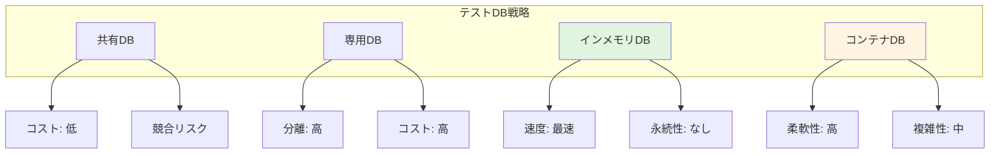

# テストデータ管理標準

## データベース管理

### テストデータベース戦略

**戦略オプション**:



<details>
<summary>データベース管理実装例</summary>

```kotlin
// テストデータベースマネージャー
class TestDatabaseManager {
    
    // インメモリデータベース作成
    fun createInMemoryDatabase(): Database {
        return H2Database.create(
            url = "jdbc:h2:mem:testdb",
            mode = DatabaseMode.MYSQL  // 本番DBと同じモード
        ).apply {
            runMigrations()
            seedTestData()
        }
    }
    
    // コンテナベースデータベース作成
    fun createContainerDatabase(): Database {
        val container = PostgreSQLContainer("postgres:14")
            .withDatabaseName("testdb")
            .withUsername("testuser")
            .withPassword("testpass")
        
        container.start()
        
        return PostgreSQLDatabase.connect(
            host = container.host,
            port = container.getMappedPort(5432),
            database = "testdb",
            username = "testuser",
            password = "testpass"
        ).apply {
            runMigrations()
        }
    }
    
    // データベーススナップショット作成
    fun createSnapshot(database: Database): DatabaseSnapshot {
        val tables = database.getAllTables()
        val data = tables.associateWith { table ->
            database.query("SELECT * FROM $table")
        }
        
        return DatabaseSnapshot(
            timestamp = getCurrentTimestamp(),
            tables = data
        )
    }
    
    // スナップショットから復元
    fun restoreSnapshot(
        database: Database,
        snapshot: DatabaseSnapshot
    ) {
        database.transaction {
            // すべてのテーブルをクリア
            snapshot.tables.keys.forEach { table ->
                execute("DELETE FROM $table")
            }
            
            // データを復元
            snapshot.tables.forEach { (table, data) ->
                data.forEach { row ->
                    insertRow(table, row)
                }
            }
        }
    }
    
    // データベースリセット
    fun reset(database: Database) {
        database.transaction {
            // 外部キー制約を一時的に無効化
            execute("SET FOREIGN_KEY_CHECKS = 0")
            
            // すべてのテーブルをトランケート
            val tables = getAllTables()
            tables.forEach { table ->
                execute("TRUNCATE TABLE $table")
            }
            
            // 外部キー制約を再有効化
            execute("SET FOREIGN_KEY_CHECKS = 1")
        }
    }
}

// マイグレーション管理
class MigrationManager {
    
    fun runMigrations(database: Database) {
        val migrations = loadMigrations()
        val appliedMigrations = getAppliedMigrations(database)
        
        migrations
            .filter { it.version !in appliedMigrations }
            .sortedBy { it.version }
            .forEach { migration ->
                applyMigration(database, migration)
            }
    }
    
    private fun applyMigration(
        database: Database,
        migration: Migration
    ) {
        database.transaction {
            execute(migration.sql)
            recordMigration(migration.version)
        }
    }
}

// テストでの使用
class DatabaseTest {
    
    private lateinit var database: Database
    private lateinit var snapshot: DatabaseSnapshot
    
    @BeforeAll
    fun setupDatabase() {
        database = TestDatabaseManager().createInMemoryDatabase()
        snapshot = TestDatabaseManager().createSnapshot(database)
    }
    
    @AfterEach
    fun resetDatabase() {
        TestDatabaseManager().restoreSnapshot(database, snapshot)
    }
    
    @Test
    fun testDatabaseOperation() {
        // データベース操作
        val user = createUser("test@example.com")
        
        // 検証
        val retrieved = findUser(user.id)
        assertThat(retrieved).isEqualTo(user)
        
        // リセットは @AfterEach で自動実行
    }
}
```

</details>

### データベースマイグレーション

**マイグレーション戦略**:
- **バージョン管理**: すべてのマイグレーションにバージョン番号
- **冪等性**: 同じマイグレーションを複数回実行しても安全
- **ロールバック**: 必要に応じて以前の状態に戻せる
- **テスト環境優先**: 本番前に必ずテスト環境で検証

---

## テストデータ最適化

### パフォーマンス最適化

**最適化手法**:

| 手法 | 効果 | 実装難度 |
|------|------|----------|
| **データ量削減** | 高 | 低 |
| **並列生成** | 高 | 中 |
| **キャッシング** | 中 | 中 |
| **遅延読み込み** | 中 | 高 |
| **インデックス最適化** | 中 | 低 |

### ストレージ最適化

**ストレージ戦略**:
- **圧縮**: 大容量データの圧縮保存
- **差分保存**: 変更差分のみ保存
- **クラウドストレージ**: S3等の低コストストレージ活用
- **定期クリーンアップ**: 古いデータの自動削除

---

## ツールと自動化

### テストデータ管理ツール

**カテゴリ別ツール**:

**データ生成**:
- Faker: 多言語対応の偽データ生成
- Mockaroo: Web UIでカスタムデータセット作成
- Databene Benerator: ルールベースの大量データ生成

**データマスキング**:
- Delphix: エンタープライズデータマスキング
- IBM InfoSphere Optim: データプライバシー管理
- Oracle Data Masking: Oracleデータベース専用

**データベース管理**:
- Testcontainers: コンテナベースのDB管理
- DbUnit: JUnit統合のDB テストツール
- Liquibase/Flyway: データベースマイグレーション

### 自動化のベストプラクティス

<details>
<summary>自動化実装例</summary>

```kotlin
// 自動テストデータプロビジョニング
class AutomatedDataProvisioning {
    
    fun provisionForTest(testClass: Class<*>): ProvisionedData {
        // テストから要件を抽出
        val requirements = extractRequirements(testClass)
        
        // データ生成
        val data = generateData(requirements)
        
        // 検証
        val validation = validateData(data)
        require(validation.passed) { "Generated data failed validation" }
        
        // データベースにロード
        loadToDatabase(data)
        
        return ProvisionedData(
            data = data,
            metadata = createMetadata(testClass, data)
        )
    }
    
    private fun extractRequirements(testClass: Class<*>): DataRequirements {
        // アノテーションから要件を読み取り
        val annotation = testClass.getAnnotation(RequiresTestData::class.java)
            ?: return DataRequirements.default()
        
        return DataRequirements(
            entities = annotation.entities.toList(),
            volume = annotation.volume,
            relationships = annotation.preserveRelationships
        )
    }
}

// テストデータアノテーション
@Target(AnnotationTarget.CLASS)
@Retention(AnnotationRetention.RUNTIME)
annotation class RequiresTestData(
    val entities: Array<String>,
    val volume: Int = 10,
    val preserveRelationships: Boolean = true
)

// テストでの使用
@RequiresTestData(
    entities = ["User", "Order", "Product"],
    volume = 50,
    preserveRelationships = true
)
class OrderProcessingTest {
    
    private lateinit var provisionedData: ProvisionedData
    
    @BeforeAll
    fun setupData() {
        val provisioning = AutomatedDataProvisioning()
        provisionedData = provisioning.provisionForTest(this::class.java)
    }
    
    @Test
    fun testOrderProcessing() {
        // テストデータは自動的に準備済み
        val user = provisionedData.getRandomEntity(User::class)
        val product = provisionedData.getRandomEntity(Product::class)
        
        // テスト実行
        val order = createOrder(user, product)
        
        // 検証
        assertThat(order).isNotNull()
    }
}
```

</details>

---

