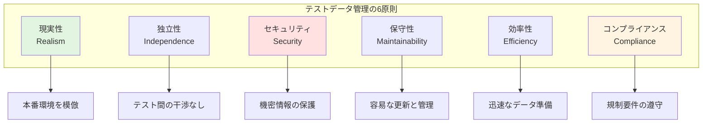
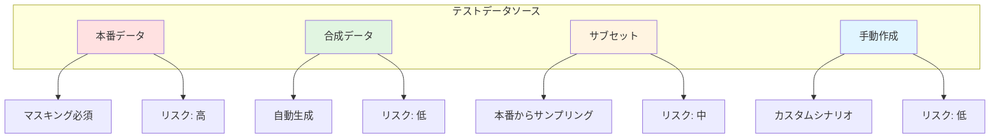
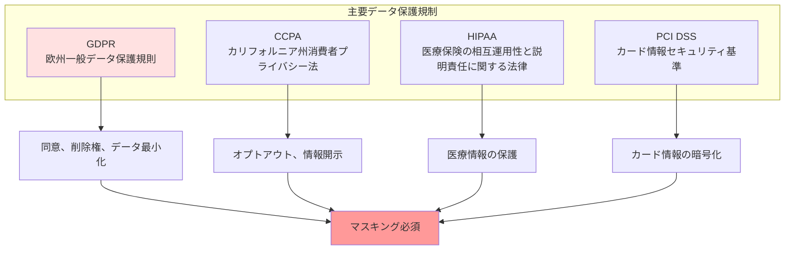
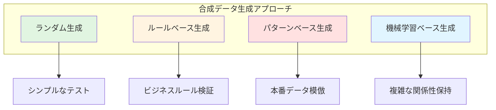
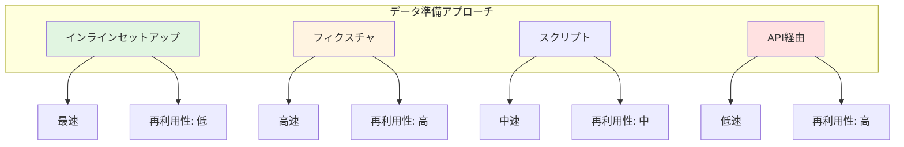
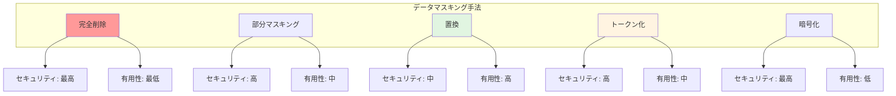
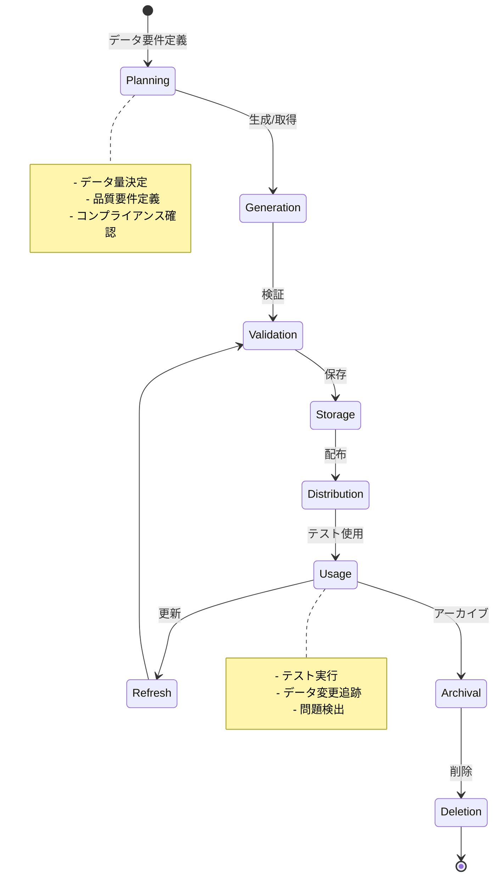
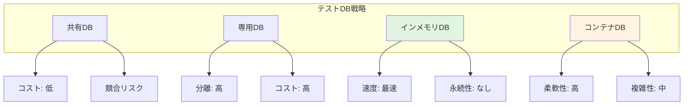

# テストデータ管理ガイド

## ドキュメント情報
- **バージョン**: 1.0.0
- **最終更新**: 2025-10-27
- **ステータス**: アクティブ
- **対象者**: 全開発者、QAエンジニア、データエンジニア
- **前提ドキュメント**: [testing-strategy.md](testing-strategy.md), [integration-testing.md](integration-testing.md)

## 目次
1. [テストデータ管理の基本原則](#テストデータ管理の基本原則)
2. [テストデータ戦略](#テストデータ戦略)
3. [データプライバシーとコンプライアンス](#データプライバシーとコンプライアンス)
4. [テストデータ生成](#テストデータ生成)
5. [テストデータ準備](#テストデータ準備)
6. [データマスキングと匿名化](#データマスキングと匿名化)
7. [テストデータライフサイクル](#テストデータライフサイクル)
8. [データベース管理](#データベース管理)
9. [テストデータ最適化](#テストデータ最適化)
10. [ツールと自動化](#ツールと自動化)
11. [Devin AIガイドライン](#devin-aiガイドライン)

---

## テストデータ管理の基本原則

### 定義と重要性

**テストデータ管理とは**:
- テストで使用するデータの作成、維持、制御、提供を行うプロセス
- 品質保証活動において信頼性の高いテストを実現するための基盤

**重要性**:
- **テスト信頼性**: 適切なデータで正確なテスト結果を保証
- **再現性**: 同じデータで繰り返しテストを実行可能
- **効率性**: データ準備時間の削減
- **コンプライアンス**: データプライバシー規制への対応
- **コスト削減**: 本番データへの依存を減らす

### テストデータ管理の原則



**6原則の詳細説明**:
1. **現実性（Realism）**: テストデータは本番環境のデータ特性を反映し、実際のシナリオを再現
2. **独立性（Independence）**: 各テストが他のテストに影響を与えず、並列実行が可能
3. **セキュリティ（Security）**: 機密情報や個人情報を適切に保護
4. **保守性（Maintainability）**: データ構造の変更に対応しやすく、更新が容易
5. **効率性（Efficiency）**: データ生成と準備が迅速で、テスト実行を遅延させない
6. **コンプライアンス（Compliance）**: GDPR、CCPA等のデータ保護規制を遵守

### テストデータの品質特性

**必要な品質特性**:
- **正確性**: データが期待される形式と値の範囲に収まる
- **完全性**: テストシナリオに必要なすべてのデータが揃っている
- **一貫性**: データ間の関係性が正しく保たれている
- **適切性**: テスト目的に適したデータ量と多様性
- **最新性**: 現在のビジネスルールとデータ構造に準拠

---

## テストデータ戦略

### データソースの種類



**各データソースの特徴**:

| データソース | メリット | デメリット | 使用場面 |
|--------------|----------|------------|----------|
| **本番データ** | ・現実的なデータ<br/>・実際のエッジケース含む<br/>・データ関係性が正確 | ・個人情報リスク<br/>・マスキング必須<br/>・大容量 | パフォーマンステスト、本番相当の検証 |
| **合成データ** | ・プライバシー問題なし<br/>・必要な量を生成可能<br/>・特定シナリオに最適化 | ・現実性に欠ける可能性<br/>・生成ロジックの保守 | ユニットテスト、機能テスト |
| **サブセット** | ・現実的かつ管理可能<br/>・マスキング後は安全<br/>・適切なサイズ | ・サンプリングバイアス<br/>・定期更新必要 | 統合テスト、E2Eテスト |
| **手動作成** | ・特定シナリオに最適<br/>・完全制御可能<br/>・軽量 | ・時間がかかる<br/>・スケールしない | 境界値テスト、エラーケース |

### 戦略選択のフレームワーク

<details>
<summary>データ戦略決定ロジックの実装例</summary>

```kotlin
// テストデータ戦略決定エンジン
class TestDataStrategyEngine {
    
    fun determineStrategy(
        testType: TestType,
        dataRequirements: DataRequirements
    ): DataStrategy {
        return when (testType) {
            TestType.UNIT -> selectUnitTestStrategy(dataRequirements)
            TestType.INTEGRATION -> selectIntegrationTestStrategy(dataRequirements)
            TestType.E2E -> selectE2ETestStrategy(dataRequirements)
            TestType.PERFORMANCE -> selectPerformanceTestStrategy(dataRequirements)
        }
    }
    
    // ユニットテスト戦略
    private fun selectUnitTestStrategy(
        requirements: DataRequirements
    ): DataStrategy {
        // ユニットテストは合成データまたは手動作成を推奨
        return if (requirements.complexity == Complexity.LOW) {
            DataStrategy.ManualCreation(
                approach = "Simple hardcoded test data",
                tooling = listOf("Test data builders", "Fixtures")
            )
        } else {
            DataStrategy.Synthetic(
                generator = "Faker library or custom generator",
                volume = requirements.volume,
                characteristics = requirements.characteristics
            )
        }
    }
    
    // 統合テスト戦略
    private fun selectIntegrationTestStrategy(
        requirements: DataRequirements
    ): DataStrategy {
        // 統合テストはサブセットまたは合成データ
        return when {
            requirements.needsRealisticRelationships -> {
                DataStrategy.ProductionSubset(
                    samplingMethod = "Representative sampling",
                    maskingRequired = true,
                    subsetSize = requirements.volume
                )
            }
            requirements.hasSensitiveData -> {
                DataStrategy.Synthetic(
                    generator = "Advanced synthetic data generator",
                    preserveRelationships = true,
                    volume = requirements.volume
                )
            }
            else -> {
                DataStrategy.Hybrid(
                    primary = "Synthetic data",
                    secondary = "Subset for edge cases",
                    blendRatio = 0.7  // 70% synthetic, 30% subset
                )
            }
        }
    }
    
    // E2Eテスト戦略
    private fun selectE2ETestStrategy(
        requirements: DataRequirements
    ): DataStrategy {
        // E2Eテストは本番サブセット（マスキング後）を推奨
        return DataStrategy.ProductionSubset(
            samplingMethod = "Stratified sampling to ensure diversity",
            maskingRequired = true,
            subsetSize = requirements.volume,
            refreshFrequency = RefreshFrequency.WEEKLY
        )
    }
    
    // パフォーマンステスト戦略
    private fun selectPerformanceTestStrategy(
        requirements: DataRequirements
    ): DataStrategy {
        // パフォーマンステストは大量の合成データ
        return DataStrategy.Synthetic(
            generator = "High-volume data generator",
            volume = requirements.volume,
            distributionPattern = "Match production data distribution",
            characteristics = requirements.characteristics
        )
    }
}

// データ要件定義
data class DataRequirements(
    val volume: DataVolume,
    val complexity: Complexity,
    val needsRealisticRelationships: Boolean,
    val hasSensitiveData: Boolean,
    val characteristics: List<DataCharacteristic>
)

// データボリューム
sealed class DataVolume {
    object Small : DataVolume()  // < 1,000 records
    object Medium : DataVolume()  // 1,000 - 100,000 records
    object Large : DataVolume()  // 100,000 - 1,000,000 records
    object VeryLarge : DataVolume()  // > 1,000,000 records
}

// データ特性
enum class DataCharacteristic {
    TEMPORAL,  // 時系列データ
    HIERARCHICAL,  // 階層構造
    RELATIONAL,  // 複雑な関係性
    GEOSPATIAL,  // 地理情報
    MULTIMEDIA,  // マルチメディア
    HIGH_CARDINALITY  // 高いカーディナリティ
}
```

</details>

### 環境別データ管理

**環境ごとのデータ戦略**:

| 環境 | データソース | 更新頻度 | セキュリティレベル |
|------|--------------|----------|---------------------|
| **開発(Dev)** | 合成データ、小規模サブセット | 随時 | 低 |
| **統合(Integration)** | サブセット（マスキング済） | 週次 | 中 |
| **ステージング(Staging)** | 本番サブセット（マスキング済） | 日次 | 高 |
| **本番(Production)** | 実データ | リアルタイム | 最高 |

---

## データプライバシーとコンプライアンス

### 規制要件



**各規制の主要要件**:

**GDPR（欧州一般データ保護規則）**:
- **データ最小化**: 必要最小限のデータのみ処理
- **目的制限**: 収集した目的以外での使用禁止
- **透明性**: データ処理の明確な説明
- **削除権**: 個人の要求によるデータ削除

**CCPA（カリフォルニア州消費者プライバシー法）**:
- **開示義務**: 収集するデータの種類を開示
- **オプトアウト権**: データ販売への拒否権
- **アクセス権**: 自分のデータへのアクセス権

**HIPAA（医療情報保護）**:
- **PHI保護**: 保護対象医療情報の厳格な管理
- **アクセス制御**: 権限のある者のみアクセス可能
- **監査証跡**: すべてのアクセスを記録

**PCI DSS（カード情報セキュリティ）**:
- **暗号化**: カード情報の保存と送信時の暗号化
- **アクセス制限**: カード情報へのアクセス制限
- **定期監査**: セキュリティ監査の実施

### 個人情報の分類

<details>
<summary>個人情報分類と処理方法の実装例</summary>

```kotlin
// 個人情報分類システム
enum class DataClassification {
    PUBLIC,          // 公開情報
    INTERNAL,        // 内部情報
    CONFIDENTIAL,    // 機密情報
    RESTRICTED,      // 制限情報
    PII,             // 個人識別情報
    SENSITIVE_PII    // 機密個人情報
}

// データフィールド分類
data class DataField(
    val name: String,
    val classification: DataClassification,
    val maskingStrategy: MaskingStrategy,
    val retentionPeriod: RetentionPeriod
)

// データ分類エンジン
class DataClassificationEngine {
    
    // 自動分類
    fun classifyField(
        fieldName: String,
        fieldValue: Any?,
        context: DataContext
    ): DataClassification {
        // フィールド名からの推測
        val nameBasedClassification = classifyByName(fieldName)
        
        // 値のパターンからの推測
        val valueBasedClassification = classifyByValue(fieldValue)
        
        // コンテキストからの判断
        val contextBasedClassification = classifyByContext(context)
        
        // 最も制限的な分類を採用
        return maxOf(
            nameBasedClassification,
            valueBasedClassification,
            contextBasedClassification
        )
    }
    
    // フィールド名による分類
    private fun classifyByName(fieldName: String): DataClassification {
        val lowercaseName = fieldName.lowercase()
        
        return when {
            // 機密個人情報
            lowercaseName.contains("ssn") -> DataClassification.SENSITIVE_PII
            lowercaseName.contains("tax_id") -> DataClassification.SENSITIVE_PII
            lowercaseName.contains("credit_card") -> DataClassification.SENSITIVE_PII
            lowercaseName.contains("passport") -> DataClassification.SENSITIVE_PII
            
            // 個人識別情報
            lowercaseName.contains("email") -> DataClassification.PII
            lowercaseName.contains("phone") -> DataClassification.PII
            lowercaseName.contains("address") -> DataClassification.PII
            lowercaseName.contains("name") -> DataClassification.PII
            lowercaseName.contains("dob") -> DataClassification.PII
            lowercaseName.contains("birth_date") -> DataClassification.PII
            
            // 機密情報
            lowercaseName.contains("password") -> DataClassification.RESTRICTED
            lowercaseName.contains("token") -> DataClassification.RESTRICTED
            lowercaseName.contains("secret") -> DataClassification.RESTRICTED
            
            else -> DataClassification.INTERNAL
        }
    }
    
    // 値のパターンによる分類
    private fun classifyByValue(value: Any?): DataClassification {
        if (value == null) return DataClassification.PUBLIC
        
        val stringValue = value.toString()
        
        return when {
            // SSN パターン (XXX-XX-XXXX)
            Regex("""\d{3}-\d{2}-\d{4}""").matches(stringValue) -> 
                DataClassification.SENSITIVE_PII
            
            // クレジットカード パターン
            Regex("""\d{4}[- ]?\d{4}[- ]?\d{4}[- ]?\d{4}""").matches(stringValue) -> 
                DataClassification.SENSITIVE_PII
            
            // メールアドレス パターン
            Regex("""[\w._%+-]+@[\w.-]+\.\w{2,}""").matches(stringValue) -> 
                DataClassification.PII
            
            // 電話番号 パターン
            Regex("""\+?\d{1,3}?[- ]?\(?\d{1,4}\)?[- ]?\d{1,4}[- ]?\d{1,9}""").matches(stringValue) -> 
                DataClassification.PII
            
            else -> DataClassification.INTERNAL
        }
    }
    
    // 処理方法の決定
    fun determineProcessing(
        classification: DataClassification
    ): DataProcessingPolicy {
        return when (classification) {
            DataClassification.SENSITIVE_PII -> DataProcessingPolicy(
                maskingRequired = true,
                maskingStrategy = MaskingStrategy.FULL_REDACTION,
                encryptionRequired = true,
                accessLoggingRequired = true,
                retentionPeriod = RetentionPeriod.DAYS_30
            )
            DataClassification.PII -> DataProcessingPolicy(
                maskingRequired = true,
                maskingStrategy = MaskingStrategy.PARTIAL_MASKING,
                encryptionRequired = true,
                accessLoggingRequired = true,
                retentionPeriod = RetentionPeriod.DAYS_90
            )
            DataClassification.RESTRICTED -> DataProcessingPolicy(
                maskingRequired = true,
                maskingStrategy = MaskingStrategy.TOKENIZATION,
                encryptionRequired = true,
                accessLoggingRequired = true,
                retentionPeriod = RetentionPeriod.DAYS_180
            )
            DataClassification.CONFIDENTIAL -> DataProcessingPolicy(
                maskingRequired = false,
                maskingStrategy = MaskingStrategy.NONE,
                encryptionRequired = true,
                accessLoggingRequired = true,
                retentionPeriod = RetentionPeriod.DAYS_365
            )
            else -> DataProcessingPolicy(
                maskingRequired = false,
                maskingStrategy = MaskingStrategy.NONE,
                encryptionRequired = false,
                accessLoggingRequired = false,
                retentionPeriod = RetentionPeriod.UNLIMITED
            )
        }
    }
}
```

</details>

### コンプライアンスチェックリスト

**テストデータ使用前の確認事項**:
- ✅ 個人情報が適切にマスキングされている
- ✅ 機密情報が暗号化されている
- ✅ データアクセスログが記録されている
- ✅ データ保持期間ポリシーが定義されている
- ✅ データ削除プロセスが確立されている
- ✅ 法務/コンプライアンス部門の承認を得ている
- ✅ テスト完了後のデータクリーンアップ手順が明確

---

## テストデータ生成

### 合成データ生成戦略



**各アプローチの特徴**:

**ランダム生成**:
- **用途**: 基本的な機能テスト、境界値テスト
- **メリット**: 実装が簡単、高速
- **デメリット**: 現実性に欠ける、ビジネスルール違反の可能性

**ルールベース生成**:
- **用途**: ビジネスロジック検証、バリデーションテスト
- **メリット**: ビジネスルールに準拠、予測可能
- **デメリット**: ルールの保守が必要、柔軟性に欠ける

**パターンベース生成**:
- **用途**: 統合テスト、E2Eテスト
- **メリット**: 本番データの特性を模倣、現実的
- **デメリット**: 本番データの分析が必要、複雑

**機械学習ベース生成**:
- **用途**: 大規模データセット、複雑な関係性の再現
- **メリット**: 高度な現実性、関係性保持
- **デメリット**: 実装コスト高、説明可能性低

### データビルダーパターン

<details>
<summary>データビルダーの実装例</summary>

```kotlin
// テストデータビルダー
class UserBuilder {
    
    private var id: String = generateUniqueId()
    private var email: String = generateRandomEmail()
    private var name: String = generateRandomName()
    private var age: Int = generateRandomAge()
    private var role: UserRole = UserRole.STANDARD
    private var createdAt: Timestamp = getCurrentTimestamp()
    private var isActive: Boolean = true
    
    // ビルダーメソッド
    fun withId(id: String) = apply { this.id = id }
    fun withEmail(email: String) = apply { this.email = email }
    fun withName(name: String) = apply { this.name = name }
    fun withAge(age: Int) = apply { this.age = age }
    fun withRole(role: UserRole) = apply { this.role = role }
    fun withCreatedAt(timestamp: Timestamp) = apply { this.createdAt = timestamp }
    fun inactive() = apply { this.isActive = false }
    
    // プリセット設定
    fun asAdmin() = apply {
        this.role = UserRole.ADMIN
        this.email = "admin-${generateUniqueId()}@example.com"
    }
    
    fun asNewUser() = apply {
        this.createdAt = getCurrentTimestamp()
        this.role = UserRole.STANDARD
    }
    
    fun asInactiveUser() = apply {
        this.isActive = false
    }
    
    // ビルド
    fun build(): User {
        return User(
            id = id,
            email = email,
            name = name,
            age = age,
            role = role,
            createdAt = createdAt,
            isActive = isActive
        )
    }
    
    // ランダムデータ生成ヘルパー
    private fun generateUniqueId(): String {
        return "user-${System.currentTimeMillis()}-${Random.nextInt(10000)}"
    }
    
    private fun generateRandomEmail(): String {
        return "test-${generateUniqueId()}@example.com"
    }
    
    private fun generateRandomName(): String {
        val firstNames = listOf("John", "Jane", "Alice", "Bob", "Charlie")
        val lastNames = listOf("Smith", "Johnson", "Williams", "Brown", "Jones")
        return "${firstNames.random()} ${lastNames.random()}"
    }
    
    private fun generateRandomAge(): Int {
        return (18..80).random()
    }
}

// 関連エンティティビルダー
class OrderBuilder {
    
    private var id: String = generateOrderId()
    private var userId: String = ""
    private var items: MutableList<OrderItem> = mutableListOf()
    private var status: OrderStatus = OrderStatus.PENDING
    private var totalAmount: BigDecimal = BigDecimal.ZERO
    private var createdAt: Timestamp = getCurrentTimestamp()
    
    fun forUser(user: User) = apply {
        this.userId = user.id
    }
    
    fun forUserId(userId: String) = apply {
        this.userId = userId
    }
    
    fun withItem(item: OrderItem) = apply {
        items.add(item)
        recalculateTotal()
    }
    
    fun withItems(items: List<OrderItem>) = apply {
        this.items.addAll(items)
        recalculateTotal()
    }
    
    fun withStatus(status: OrderStatus) = apply {
        this.status = status
    }
    
    fun asCompleted() = apply {
        this.status = OrderStatus.COMPLETED
    }
    
    fun asCancelled() = apply {
        this.status = OrderStatus.CANCELLED
    }
    
    fun build(): Order {
        require(userId.isNotBlank()) { "User ID is required" }
        require(items.isNotEmpty()) { "At least one item is required" }
        
        return Order(
            id = id,
            userId = userId,
            items = items,
            status = status,
            totalAmount = totalAmount,
            createdAt = createdAt
        )
    }
    
    private fun recalculateTotal() {
        totalAmount = items.sumOf { it.price * BigDecimal(it.quantity) }
    }
    
    private fun generateOrderId(): String {
        return "ORD-${System.currentTimeMillis()}"
    }
}

// テストでの使用例
class UserOrderTest {
    
    @Test
    fun userCanPlaceOrder() {
        // テストデータ準備
        val user = UserBuilder()
            .withEmail("john.doe@example.com")
            .withName("John Doe")
            .build()
        
        val order = OrderBuilder()
            .forUser(user)
            .withItem(OrderItem(productId = "PROD-001", quantity = 2, price = BigDecimal("19.99")))
            .withItem(OrderItem(productId = "PROD-002", quantity = 1, price = BigDecimal("29.99")))
            .build()
        
        // テスト実行
        val result = orderService.placeOrder(order)
        
        // 検証
        assertThat(result.isSuccess).isTrue()
        assertThat(order.totalAmount).isEqualTo(BigDecimal("69.97"))
    }
}
```

</details>

### ファクトリパターン

<details>
<summary>テストデータファクトリの実装例</summary>

```kotlin
// テストデータファクトリ
object TestDataFactory {
    
    // ユーザーファクトリ
    object Users {
        
        fun standard(): User {
            return UserBuilder()
                .withRole(UserRole.STANDARD)
                .build()
        }
        
        fun admin(): User {
            return UserBuilder()
                .asAdmin()
                .build()
        }
        
        fun inactive(): User {
            return UserBuilder()
                .inactive()
                .build()
        }
        
        fun withOrders(orderCount: Int): UserWithOrders {
            val user = standard()
            val orders = (1..orderCount).map { 
                Orders.forUser(user) 
            }
            return UserWithOrders(user, orders)
        }
    }
    
    // 注文ファクトリ
    object Orders {
        
        fun forUser(user: User): Order {
            return OrderBuilder()
                .forUser(user)
                .withItem(OrderItem("PROD-001", 1, BigDecimal("29.99")))
                .build()
        }
        
        fun completed(): Order {
            val user = Users.standard()
            return OrderBuilder()
                .forUser(user)
                .withItem(OrderItem("PROD-001", 1, BigDecimal("29.99")))
                .asCompleted()
                .build()
        }
        
        fun pending(): Order {
            val user = Users.standard()
            return OrderBuilder()
                .forUser(user)
                .withItem(OrderItem("PROD-001", 1, BigDecimal("29.99")))
                .build()
        }
        
        fun cancelled(): Order {
            val user = Users.standard()
            return OrderBuilder()
                .forUser(user)
                .withItem(OrderItem("PROD-001", 1, BigDecimal("29.99")))
                .asCancelled()
                .build()
        }
        
        fun large(): Order {
            val user = Users.standard()
            val items = (1..10).map { index ->
                OrderItem(
                    productId = "PROD-${index.toString().padStart(3, '0')}",
                    quantity = Random.nextInt(1, 5),
                    price = BigDecimal(Random.nextDouble(10.0, 100.0))
                )
            }
            return OrderBuilder()
                .forUser(user)
                .withItems(items)
                .build()
        }
    }
    
    // 商品ファクトリ
    object Products {
        
        fun inStock(): Product {
            return Product(
                id = "PROD-${Random.nextInt(1000)}",
                name = "Test Product",
                price = BigDecimal("29.99"),
                stock = 100
            )
        }
        
        fun outOfStock(): Product {
            return Product(
                id = "PROD-${Random.nextInt(1000)}",
                name = "Out of Stock Product",
                price = BigDecimal("29.99"),
                stock = 0
            )
        }
        
        fun lowStock(): Product {
            return Product(
                id = "PROD-${Random.nextInt(1000)}",
                name = "Low Stock Product",
                price = BigDecimal("29.99"),
                stock = 5
            )
        }
    }
}

// テストでの使用
class OrderServiceTest {
    
    @Test
    fun adminCanViewAllOrders() {
        // 管理者ユーザーを作成
        val admin = TestDataFactory.Users.admin()
        
        // 複数の注文を作成
        val orders = listOf(
            TestDataFactory.Orders.completed(),
            TestDataFactory.Orders.pending(),
            TestDataFactory.Orders.cancelled()
        )
        
        // テスト実行
        val result = orderService.getAllOrders(admin)
        
        // 検証
        assertThat(result).hasSize(3)
    }
    
    @Test
    fun cannotOrderOutOfStockProduct() {
        val user = TestDataFactory.Users.standard()
        val product = TestDataFactory.Products.outOfStock()
        
        // テスト実行
        val result = orderService.createOrder(user, product, quantity = 1)
        
        // 検証
        assertThat(result.isFailure).isTrue()
        assertThat(result.error).contains("out of stock")
    }
}
```

</details>

### Faker ライブラリの活用

**Faker ライブラリでの生成例**:

```
Faker を使用した現実的なテストデータ生成:
- 名前: 人名データベースから選択
- メールアドレス: 実在しそうな形式
- 住所: 実際の市区町村名
- 電話番号: 適切な形式
- 会社名: 実在しそうな企業名
- テキスト: Lorem ipsum や実際の文章
```

---

## テストデータ準備

### データセットアップ戦略



**各アプローチの説明**:

**インラインセットアップ**:
- テストコード内で直接データを作成
- **メリット**: 最速、テストと一体化
- **デメリット**: 再利用性低い、冗長になりがち
- **使用場面**: ユニットテスト、シンプルなシナリオ

**フィクスチャ**:
- 事前定義されたデータファイル（JSON、YAML、SQL）
- **メリット**: 再利用可能、バージョン管理可能
- **デメリット**: 保守が必要、データ量が多いと管理困難
- **使用場面**: 統合テスト、E2Eテスト

**スクリプト**:
- データベースシードスクリプト
- **メリット**: 複雑なデータ構造に対応、再現性高い
- **デメリット**: 実行時間がかかる、環境依存
- **使用場面**: 環境初期化、大量データ投入

**API経由**:
- アプリケーションAPIを使ってデータ作成
- **メリット**: ビジネスロジック通過、検証済みデータ
- **デメリット**: 最も遅い、API依存
- **使用場面**: E2Eテスト、受け入れテスト

<details>
<summary>データセットアップパターンの実装例</summary>

```kotlin
// データセットアップマネージャー
class TestDataSetup {
    
    // アプローチ1: インラインセットアップ
    fun inlineSetup(): TestContext {
        val user = User(
            id = "user-001",
            email = "test@example.com",
            name = "Test User"
        )
        
        val product = Product(
            id = "prod-001",
            name = "Test Product",
            price = BigDecimal("29.99")
        )
        
        return TestContext(user, product)
    }
    
    // アプローチ2: フィクスチャベース
    fun fixtureBasedSetup(fixtureName: String): TestContext {
        val fixtureData = loadFixture(fixtureName)
        val user = parseUser(fixtureData["user"])
        val products = parseProducts(fixtureData["products"])
        
        return TestContext(user, products)
    }
    
    // アプローチ3: スクリプトベース
    fun scriptBasedSetup(scriptPath: String): TestContext {
        executeScript(scriptPath)
        
        // スクリプト実行後にデータを取得
        val user = fetchUserFromDatabase("user-001")
        val products = fetchProductsFromDatabase()
        
        return TestContext(user, products)
    }
    
    // アプローチ4: API経由
    fun apiBasedSetup(): TestContext {
        // APIを使ってユーザー作成
        val userResponse = apiClient.post("/users", mapOf(
            "email" to "test@example.com",
            "name" to "Test User"
        ))
        val user = parseUser(userResponse)
        
        // APIを使って商品作成
        val productResponse = apiClient.post("/products", mapOf(
            "name" to "Test Product",
            "price" to 29.99
        ))
        val product = parseProduct(productResponse)
        
        return TestContext(user, product)
    }
}

// フィクスチャローダー
class FixtureLoader {
    
    fun loadFixture(name: String): Map<String, Any> {
        val fixturePath = "fixtures/$name.json"
        val jsonContent = readFile(fixturePath)
        return parseJson(jsonContent)
    }
    
    fun loadYamlFixture(name: String): Map<String, Any> {
        val fixturePath = "fixtures/$name.yaml"
        val yamlContent = readFile(fixturePath)
        return parseYaml(yamlContent)
    }
}

// データベースシーダー
class DatabaseSeeder {
    
    fun seed(seedFile: String) {
        val sqlStatements = parseSeedFile(seedFile)
        
        database.transaction {
            sqlStatements.forEach { statement ->
                execute(statement)
            }
        }
    }
    
    fun seedFromCsv(tableName: String, csvFile: String) {
        val records = parseCsvFile(csvFile)
        
        database.transaction {
            records.forEach { record ->
                insertRecord(tableName, record)
            }
        }
    }
}

// テストでの使用例
class ProductOrderTest {
    
    private lateinit var dataSetup: TestDataSetup
    
    @BeforeEach
    fun setup() {
        dataSetup = TestDataSetup()
    }
    
    @Test
    fun testWithInlineData() {
        // インラインセットアップ
        val context = dataSetup.inlineSetup()
        
        // テスト実行
        val order = createOrder(context.user, context.product)
        
        // 検証
        assertThat(order).isNotNull()
    }
    
    @Test
    fun testWithFixture() {
        // フィクスチャからセットアップ
        val context = dataSetup.fixtureBasedSetup("user-with-orders")
        
        // テスト実行
        val orders = getOrders(context.user)
        
        // 検証
        assertThat(orders).hasSize(3)
    }
}
```

</details>

### データクリーンアップ

**クリーンアップ戦略**:

| 戦略 | タイミング | メリット | デメリット |
|------|-----------|---------|----------|
| **テスト後削除** | @AfterEach | 確実なクリーンアップ | 遅い |
| **トランザクションロールバック** | テスト終了時 | 高速 | トランザクション対応のみ |
| **専用テストDB** | テストスイート後 | 並列実行可能 | リソース消費大 |
| **データパーティション** | 不要 | 高速 | 分離が必要 |

<details>
<summary>クリーンアップ実装例</summary>

```kotlin
// クリーンアップマネージャー
class TestDataCleanup {
    
    private val createdResources = mutableListOf<ResourceIdentifier>()
    
    // リソース追跡
    fun track(resource: Any) {
        val identifier = when (resource) {
            is User -> ResourceIdentifier.User(resource.id)
            is Order -> ResourceIdentifier.Order(resource.id)
            is Product -> ResourceIdentifier.Product(resource.id)
            else -> throw IllegalArgumentException("Unsupported resource type")
        }
        createdResources.add(identifier)
    }
    
    // すべてクリーンアップ
    fun cleanupAll() {
        // 依存関係の逆順で削除
        createdResources.reversed().forEach { identifier ->
            when (identifier) {
                is ResourceIdentifier.User -> deleteUser(identifier.id)
                is ResourceIdentifier.Order -> deleteOrder(identifier.id)
                is ResourceIdentifier.Product -> deleteProduct(identifier.id)
            }
        }
        createdResources.clear()
    }
    
    // 特定タイプのみクリーンアップ
    fun cleanupByType(type: ResourceType) {
        val toDelete = createdResources.filter { it.type == type }
        toDelete.forEach { identifier ->
            deleteResource(identifier)
            createdResources.remove(identifier)
        }
    }
}

// トランザクションベースクリーンアップ
class TransactionalTestSupport {
    
    @BeforeEach
    fun beginTransaction() {
        database.beginTransaction()
    }
    
    @AfterEach
    fun rollbackTransaction() {
        database.rollbackTransaction()
    }
}

// テストでの使用
class OrderServiceTest {
    
    private val cleanup = TestDataCleanup()
    
    @AfterEach
    fun cleanupTestData() {
        cleanup.cleanupAll()
    }
    
    @Test
    fun testOrderCreation() {
        // データ作成
        val user = createUser()
        cleanup.track(user)
        
        val product = createProduct()
        cleanup.track(product)
        
        val order = createOrder(user, product)
        cleanup.track(order)
        
        // テスト実行
        assertThat(order.status).isEqualTo(OrderStatus.PENDING)
        
        // クリーンアップは @AfterEach で自動実行
    }
}
```

</details>

---

## データマスキングと匿名化

### マスキング手法



**各手法の詳細**:

| 手法 | 説明 | 例 | 使用場面 |
|------|------|----|----|
| **完全削除** | データを完全に削除または固定値に | `john.doe@example.com` → `[REDACTED]` | 機密度最高のデータ |
| **部分マスキング** | 一部を隠して形式を保持 | `4111-1111-1111-1111` → `4111-****-****-1111` | クレジットカード、電話番号 |
| **置換** | 同じ形式の偽データに置換 | `john.doe@example.com` → `user123@test.com` | 一般的なPII |
| **トークン化** | 元の値に戻せるトークンに変換 | `john.doe@example.com` → `TOKEN_XYZ123` | データ関係性を保持 |
| **暗号化** | 暗号化して可逆的に保護 | `john.doe@example.com` → `encrypted_blob` | 一時的な保護 |

<details>
<summary>データマスキング実装例</summary>

```kotlin
// データマスキングエンジン
class DataMaskingEngine {
    
    // 完全削除
    fun redact(value: String): String {
        return "[REDACTED]"
    }
    
    // 部分マスキング: クレジットカード
    fun maskCreditCard(cardNumber: String): String {
        if (cardNumber.length < 16) return maskAll(cardNumber)
        
        val first4 = cardNumber.substring(0, 4)
        val last4 = cardNumber.substring(cardNumber.length - 4)
        return "$first4-****-****-$last4"
    }
    
    // 部分マスキング: メールアドレス
    fun maskEmail(email: String): String {
        val parts = email.split("@")
        if (parts.size != 2) return maskAll(email)
        
        val username = parts[0]
        val domain = parts[1]
        
        val maskedUsername = if (username.length <= 2) {
            "*".repeat(username.length)
        } else {
            username.substring(0, 2) + "*".repeat(username.length - 2)
        }
        
        return "$maskedUsername@$domain"
    }
    
    // 部分マスキング: 電話番号
    fun maskPhoneNumber(phone: String): String {
        val digits = phone.replace(Regex("[^0-9]"), "")
        if (digits.length < 10) return maskAll(phone)
        
        val last4 = digits.substring(digits.length - 4)
        val masked = "*".repeat(digits.length - 4) + last4
        
        // 元の形式を復元
        return restoreFormat(phone, masked)
    }
    
    // 置換: 名前
    fun substituteName(originalName: String): String {
        val fakeNames = listOf(
            "John Smith", "Jane Doe", "Alice Johnson",
            "Bob Williams", "Charlie Brown"
        )
        return fakeNames.random()
    }
    
    // 置換: 住所
    fun substituteAddress(originalAddress: String): String {
        return "123 Test Street, Test City, TC 12345"
    }
    
    // トークン化
    fun tokenize(value: String, context: String): String {
        val token = generateToken(value, context)
        storeMapping(token, value)  // 逆変換用に保存
        return token
    }
    
    // トークン逆変換
    fun detokenize(token: String): String? {
        return retrieveOriginalValue(token)
    }
    
    // 暗号化
    fun encrypt(value: String, key: EncryptionKey): String {
        return encryptAES256(value, key)
    }
    
    // 復号化
    fun decrypt(encryptedValue: String, key: EncryptionKey): String {
        return decryptAES256(encryptedValue, key)
    }
    
    // プライベートヘルパー
    private fun maskAll(value: String): String {
        return "*".repeat(value.length)
    }
    
    private fun generateToken(value: String, context: String): String {
        val hash = hashSHA256("$value:$context")
        return "TOKEN_${hash.substring(0, 16).uppercase()}"
    }
}

// データマスキングパイプライン
class MaskingPipeline {
    
    private val engine = DataMaskingEngine()
    private val classifier = DataClassificationEngine()
    
    fun maskRecord(record: Map<String, Any?>): Map<String, Any?> {
        return record.mapValues { (fieldName, value) ->
            if (value == null) {
                null
            } else {
                maskField(fieldName, value.toString())
            }
        }
    }
    
    private fun maskField(fieldName: String, value: String): String {
        val classification = classifier.classifyField(fieldName, value, DataContext())
        
        return when (classification) {
            DataClassification.SENSITIVE_PII -> {
                when {
                    fieldName.contains("credit_card") -> engine.maskCreditCard(value)
                    fieldName.contains("ssn") -> engine.redact(value)
                    else -> engine.tokenize(value, fieldName)
                }
            }
            DataClassification.PII -> {
                when {
                    fieldName.contains("email") -> engine.maskEmail(value)
                    fieldName.contains("phone") -> engine.maskPhoneNumber(value)
                    fieldName.contains("name") -> engine.substituteName(value)
                    fieldName.contains("address") -> engine.substituteAddress(value)
                    else -> value
                }
            }
            else -> value
        }
    }
    
    // バッチ処理
    fun maskDataset(dataset: List<Map<String, Any?>>): List<Map<String, Any?>> {
        return dataset.map { record -> maskRecord(record) }
    }
}

// 使用例
class DataMaskingTest {
    
    @Test
    fun testCreditCardMasking() {
        val engine = DataMaskingEngine()
        
        val original = "4111-1111-1111-1111"
        val masked = engine.maskCreditCard(original)
        
        assertThat(masked).isEqualTo("4111-****-****-1111")
    }
    
    @Test
    fun testEmailMasking() {
        val engine = DataMaskingEngine()
        
        val original = "john.doe@example.com"
        val masked = engine.maskEmail(original)
        
        assertThat(masked).isEqualTo("jo******@example.com")
    }
    
    @Test
    fun testRecordMasking() {
        val pipeline = MaskingPipeline()
        
        val record = mapOf(
            "id" to "123",
            "name" to "John Doe",
            "email" to "john.doe@example.com",
            "credit_card" to "4111-1111-1111-1111"
        )
        
        val masked = pipeline.maskRecord(record)
        
        assertThat(masked["id"]).isEqualTo("123")  // IDはそのまま
        assertThat(masked["name"]).isNotEqualTo("John Doe")  // 名前は置換
        assertThat(masked["email"]).contains("@example.com")  // 形式保持
        assertThat(masked["credit_card"]).contains("****")  // マスク済み
    }
}
```

</details>

### 匿名化のベストプラクティス

**効果的な匿名化のための原則**:
- **k-匿名性**: 個人を特定できないよう最低k人の同じ属性を持つグループに
- **l-多様性**: 機密属性に十分な多様性を確保
- **t-近接性**: 機密属性の分布が元のデータと近い
- **差分プライバシー**: 個人の追加・削除がデータセット全体に影響しない

---

## テストデータライフサイクル

### ライフサイクル管理



**各フェーズの詳細**:
1. **Planning（計画）**: テスト要件からデータニーズを定義
2. **Generation（生成）**: データを作成または本番から取得
3. **Validation（検証）**: データの品質とコンプライアンスを確認
4. **Storage（保存）**: セキュアな場所に保存
5. **Distribution（配布）**: テスト環境へ配布
6. **Usage（使用）**: テストで実際に使用
7. **Refresh（更新）**: 定期的にデータを最新化
8. **Archival（アーカイブ）**: 使用終了後にアーカイブ
9. **Deletion（削除）**: 保持期限後に完全削除

<details>
<summary>ライフサイクル管理の実装例</summary>

```kotlin
// テストデータライフサイクルマネージャー
class TestDataLifecycleManager {
    
    // フェーズ1: 計画
    fun plan(testRequirements: TestRequirements): DataPlan {
        return DataPlan(
            volume = determineVolume(testRequirements),
            characteristics = identifyCharacteristics(testRequirements),
            sources = selectSources(testRequirements),
            complianceRequirements = assessCompliance(testRequirements),
            timeline = createTimeline(testRequirements)
        )
    }
    
    // フェーズ2: 生成
    fun generate(plan: DataPlan): GeneratedDataset {
        val generator = selectGenerator(plan.sources)
        val rawData = generator.generate(plan.volume, plan.characteristics)
        
        return GeneratedDataset(
            data = rawData,
            metadata = DatasetMetadata(
                generatedAt = getCurrentTimestamp(),
                generator = generator.name,
                version = plan.version
            )
        )
    }
    
    // フェーズ3: 検証
    fun validate(dataset: GeneratedDataset): ValidationResult {
        val qualityChecks = listOf(
            checkCompleteness(dataset),
            checkConsistency(dataset),
            checkAccuracy(dataset),
            checkCompliance(dataset)
        )
        
        val allPassed = qualityChecks.all { it.passed }
        
        return ValidationResult(
            passed = allPassed,
            checks = qualityChecks,
            issues = qualityChecks.filter { !it.passed }
        )
    }
    
    // フェーズ4: 保存
    fun store(
        dataset: GeneratedDataset,
        validation: ValidationResult
    ): StoredDataset {
        require(validation.passed) { "Cannot store invalid dataset" }
        
        val storageLocation = determineStorageLocation(dataset)
        val encryptedData = encrypt(dataset.data)
        
        saveToStorage(encryptedData, storageLocation)
        
        return StoredDataset(
            id = generateDatasetId(),
            location = storageLocation,
            metadata = dataset.metadata,
            storedAt = getCurrentTimestamp()
        )
    }
    
    // フェーズ5: 配布
    fun distribute(
        stored: StoredDataset,
        targetEnvironment: Environment
    ): DistributionResult {
        val data = loadFromStorage(stored.location)
        val decryptedData = decrypt(data)
        
        // 環境に応じた最終調整
        val adjustedData = adjustForEnvironment(decryptedData, targetEnvironment)
        
        // 配布
        deployToEnvironment(adjustedData, targetEnvironment)
        
        return DistributionResult(
            success = true,
            environment = targetEnvironment,
            distributedAt = getCurrentTimestamp()
        )
    }
    
    // フェーズ6: 更新
    fun refresh(dataset: StoredDataset): StoredDataset {
        // 既存データの評価
        val currentData = loadFromStorage(dataset.location)
        val freshness = assessFreshness(currentData)
        
        if (freshness.isStale) {
            // 再生成
            val plan = recreatePlan(dataset)
            val newDataset = generate(plan)
            val validated = validate(newDataset)
            
            if (validated.passed) {
                return store(newDataset, validated)
            }
        }
        
        return dataset
    }
    
    // フェーズ7: アーカイブ
    fun archive(dataset: StoredDataset): ArchivedDataset {
        val archiveLocation = getArchiveLocation()
        moveToArchive(dataset.location, archiveLocation)
        
        return ArchivedDataset(
            id = dataset.id,
            archiveLocation = archiveLocation,
            archivedAt = getCurrentTimestamp(),
            retentionUntil = calculateRetentionDeadline()
        )
    }
    
    // フェーズ8: 削除
    fun delete(archived: ArchivedDataset) {
        require(canDelete(archived)) { 
            "Cannot delete: retention period not met" 
        }
        
        // 完全削除
        secureDelete(archived.archiveLocation)
        
        // メタデータ削除
        deleteMetadata(archived.id)
        
        // 監査ログ記録
        logDeletion(archived)
    }
}

// データセットバージョン管理
class DatasetVersionControl {
    
    private val versions = mutableMapOf<String, List<DatasetVersion>>()
    
    fun createVersion(
        datasetId: String,
        data: Any,
        changes: String
    ): DatasetVersion {
        val version = DatasetVersion(
            versionNumber = getNextVersionNumber(datasetId),
            datasetId = datasetId,
            data = data,
            changes = changes,
            createdAt = getCurrentTimestamp()
        )
        
        versions.getOrPut(datasetId) { mutableListOf() }
            .add(version)
        
        return version
    }
    
    fun getVersion(
        datasetId: String,
        versionNumber: Int
    ): DatasetVersion? {
        return versions[datasetId]?.find { 
            it.versionNumber == versionNumber 
        }
    }
    
    fun getLatestVersion(datasetId: String): DatasetVersion? {
        return versions[datasetId]?.maxByOrNull { it.versionNumber }
    }
}
```

</details>

### データ更新ポリシー

**更新頻度の決定**:

| データタイプ | 更新頻度 | 理由 |
|--------------|----------|------|
| **マスターデータ** | 月次 | 変更が少ない |
| **トランザクションデータ** | 週次 | 頻繁に変化 |
| **統計データ** | 日次 | リアルタイム性が重要 |
| **リファレンスデータ** | 四半期 | 安定している |

---

## データベース管理

### テストデータベース戦略

**戦略オプション**:



<details>
<summary>データベース管理実装例</summary>

```kotlin
// テストデータベースマネージャー
class TestDatabaseManager {
    
    // インメモリデータベース作成
    fun createInMemoryDatabase(): Database {
        return H2Database.create(
            url = "jdbc:h2:mem:testdb",
            mode = DatabaseMode.MYSQL  // 本番DBと同じモード
        ).apply {
            runMigrations()
            seedTestData()
        }
    }
    
    // コンテナベースデータベース作成
    fun createContainerDatabase(): Database {
        val container = PostgreSQLContainer("postgres:14")
            .withDatabaseName("testdb")
            .withUsername("testuser")
            .withPassword("testpass")
        
        container.start()
        
        return PostgreSQLDatabase.connect(
            host = container.host,
            port = container.getMappedPort(5432),
            database = "testdb",
            username = "testuser",
            password = "testpass"
        ).apply {
            runMigrations()
        }
    }
    
    // データベーススナップショット作成
    fun createSnapshot(database: Database): DatabaseSnapshot {
        val tables = database.getAllTables()
        val data = tables.associateWith { table ->
            database.query("SELECT * FROM $table")
        }
        
        return DatabaseSnapshot(
            timestamp = getCurrentTimestamp(),
            tables = data
        )
    }
    
    // スナップショットから復元
    fun restoreSnapshot(
        database: Database,
        snapshot: DatabaseSnapshot
    ) {
        database.transaction {
            // すべてのテーブルをクリア
            snapshot.tables.keys.forEach { table ->
                execute("DELETE FROM $table")
            }
            
            // データを復元
            snapshot.tables.forEach { (table, data) ->
                data.forEach { row ->
                    insertRow(table, row)
                }
            }
        }
    }
    
    // データベースリセット
    fun reset(database: Database) {
        database.transaction {
            // 外部キー制約を一時的に無効化
            execute("SET FOREIGN_KEY_CHECKS = 0")
            
            // すべてのテーブルをトランケート
            val tables = getAllTables()
            tables.forEach { table ->
                execute("TRUNCATE TABLE $table")
            }
            
            // 外部キー制約を再有効化
            execute("SET FOREIGN_KEY_CHECKS = 1")
        }
    }
}

// マイグレーション管理
class MigrationManager {
    
    fun runMigrations(database: Database) {
        val migrations = loadMigrations()
        val appliedMigrations = getAppliedMigrations(database)
        
        migrations
            .filter { it.version !in appliedMigrations }
            .sortedBy { it.version }
            .forEach { migration ->
                applyMigration(database, migration)
            }
    }
    
    private fun applyMigration(
        database: Database,
        migration: Migration
    ) {
        database.transaction {
            execute(migration.sql)
            recordMigration(migration.version)
        }
    }
}

// テストでの使用
class DatabaseTest {
    
    private lateinit var database: Database
    private lateinit var snapshot: DatabaseSnapshot
    
    @BeforeAll
    fun setupDatabase() {
        database = TestDatabaseManager().createInMemoryDatabase()
        snapshot = TestDatabaseManager().createSnapshot(database)
    }
    
    @AfterEach
    fun resetDatabase() {
        TestDatabaseManager().restoreSnapshot(database, snapshot)
    }
    
    @Test
    fun testDatabaseOperation() {
        // データベース操作
        val user = createUser("test@example.com")
        
        // 検証
        val retrieved = findUser(user.id)
        assertThat(retrieved).isEqualTo(user)
        
        // リセットは @AfterEach で自動実行
    }
}
```

</details>

### データベースマイグレーション

**マイグレーション戦略**:
- **バージョン管理**: すべてのマイグレーションにバージョン番号
- **冪等性**: 同じマイグレーションを複数回実行しても安全
- **ロールバック**: 必要に応じて以前の状態に戻せる
- **テスト環境優先**: 本番前に必ずテスト環境で検証

---

## テストデータ最適化

### パフォーマンス最適化

**最適化手法**:

| 手法 | 効果 | 実装難度 |
|------|------|----------|
| **データ量削減** | 高 | 低 |
| **並列生成** | 高 | 中 |
| **キャッシング** | 中 | 中 |
| **遅延読み込み** | 中 | 高 |
| **インデックス最適化** | 中 | 低 |

### ストレージ最適化

**ストレージ戦略**:
- **圧縮**: 大容量データの圧縮保存
- **差分保存**: 変更差分のみ保存
- **クラウドストレージ**: S3等の低コストストレージ活用
- **定期クリーンアップ**: 古いデータの自動削除

---

## ツールと自動化

### テストデータ管理ツール

**カテゴリ別ツール**:

**データ生成**:
- Faker: 多言語対応の偽データ生成
- Mockaroo: Web UIでカスタムデータセット作成
- Databene Benerator: ルールベースの大量データ生成

**データマスキング**:
- Delphix: エンタープライズデータマスキング
- IBM InfoSphere Optim: データプライバシー管理
- Oracle Data Masking: Oracleデータベース専用

**データベース管理**:
- Testcontainers: コンテナベースのDB管理
- DbUnit: JUnit統合のDB テストツール
- Liquibase/Flyway: データベースマイグレーション

### 自動化のベストプラクティス

<details>
<summary>自動化実装例</summary>

```kotlin
// 自動テストデータプロビジョニング
class AutomatedDataProvisioning {
    
    fun provisionForTest(testClass: Class<*>): ProvisionedData {
        // テストから要件を抽出
        val requirements = extractRequirements(testClass)
        
        // データ生成
        val data = generateData(requirements)
        
        // 検証
        val validation = validateData(data)
        require(validation.passed) { "Generated data failed validation" }
        
        // データベースにロード
        loadToDatabase(data)
        
        return ProvisionedData(
            data = data,
            metadata = createMetadata(testClass, data)
        )
    }
    
    private fun extractRequirements(testClass: Class<*>): DataRequirements {
        // アノテーションから要件を読み取り
        val annotation = testClass.getAnnotation(RequiresTestData::class.java)
            ?: return DataRequirements.default()
        
        return DataRequirements(
            entities = annotation.entities.toList(),
            volume = annotation.volume,
            relationships = annotation.preserveRelationships
        )
    }
}

// テストデータアノテーション
@Target(AnnotationTarget.CLASS)
@Retention(AnnotationRetention.RUNTIME)
annotation class RequiresTestData(
    val entities: Array<String>,
    val volume: Int = 10,
    val preserveRelationships: Boolean = true
)

// テストでの使用
@RequiresTestData(
    entities = ["User", "Order", "Product"],
    volume = 50,
    preserveRelationships = true
)
class OrderProcessingTest {
    
    private lateinit var provisionedData: ProvisionedData
    
    @BeforeAll
    fun setupData() {
        val provisioning = AutomatedDataProvisioning()
        provisionedData = provisioning.provisionForTest(this::class.java)
    }
    
    @Test
    fun testOrderProcessing() {
        // テストデータは自動的に準備済み
        val user = provisionedData.getRandomEntity(User::class)
        val product = provisionedData.getRandomEntity(Product::class)
        
        // テスト実行
        val order = createOrder(user, product)
        
        // 検証
        assertThat(order).isNotNull()
    }
}
```

</details>

---

## Devin AIガイドライン

### AIによるテストデータ生成

**プロンプト例（データ生成）**:

```
タスク: ユーザー登録テスト用のテストデータセットを生成してください

要件:
- 50人のユーザーデータ
- 名前、メールアドレス、電話番号、住所を含む
- 年齢分布: 18-65歳、正規分布
- 10%は管理者ユーザー
- メールドメインは実在しないtest.comドメイン
- すべてのデータはGDPR準拠（個人情報なし）

出力形式: JSON配列

データ例:
{
  "name": "Generated Name",
  "email": "user123@test.com",
  "phone": "+1-555-0123",
  "age": 32,
  "role": "standard"
}
```

### AIによるデータマスキング

**プロンプト例（マスキング）**:

```
タスク: 本番データからテストデータを作成するため、個人情報をマスキングしてください

データ:
[本番データのサンプル]

マスキング要件:
- メールアドレス: ユーザー名の最初2文字以外をマスク
- 電話番号: 最後4桁以外をマスク
- 住所: 実在しない住所に置換
- クレジットカード: 最初4桁と最後4桁以外をマスク
- SSN: 完全に削除

出力形式: マスキング後のデータセット（同じ形式）
```

### AIによるデータ品質分析

**プロンプト例（品質分析）**:

```
タスク: 生成されたテストデータの品質を分析してください

データセット:
[テストデータ]

分析してほしい項目:
1. データの完全性: null値や欠損データの有無
2. データの一貫性: フォーマットの統一性
3. データの現実性: 値の範囲と分布が現実的か
4. データの関係性: エンティティ間の関係が正しいか
5. データのバランス: カテゴリ分布が偏っていないか
6. 潜在的な問題点とその改善案
```

### AI活用のベストプラクティス

**効果的な使用方法**:
- **大量データ生成**: AIで基本パターンを作成し、バリエーションを展開
- **マスキングルール設計**: AIでマスキング戦略を提案
- **データ品質チェック**: AIで異常値や不整合を検出
- **ドキュメント生成**: データセットの説明ドキュメントを自動生成

**制限事項**:
- AIが生成したデータは必ず人間がレビュー
- プライバシー要件は人間が最終判断
- ビジネスルールの正確性は専門家が確認

---

## 関連ドキュメント

- [testing-strategy.md](testing-strategy.md) - テスト全体戦略
- [integration-testing.md](integration-testing.md) - 統合テスト実装ガイド
- [e2e-testing.md](e2e-testing.md) - E2Eテスト実装ガイド
- [security-testing.md](security-testing.md) - セキュリティテスト

---

## バージョン履歴

| バージョン | 日付 | 変更内容 |
|------------|------|----------|
| 1.0.0 | 2025-10-27 | 初版作成 |

---

**注意**: このドキュメントは言語非依存です。具体的な実装詳細は各言語の[01-coding-standards](../01-coding-standards/)を参照してください。