# ユニットテスト実装ガイド
## Unit Testing Implementation Guide

**最終更新日**: 2025-10-27  
**バージョン**: 1.0.2  
**対象**: 開発者・テクニカルリード・自律型AI Devin  
**適用範囲**: 全プロジェクト共通ユニットテスト実装標準

---

## 📖 概要

このドキュメントは、**言語非依存のユニットテスト設計原則と実装パターン**を定義します。具体的な言語固有の実装方法（テストフレームワーク、アサーションライブラリ、ツール設定）は、各言語の[コード規約](../01-coding-standards/)を参照してください。

### 🎯 目的

- **テスト設計の原則**: FIRST原則、単一責務、独立性の確保
- **実装パターン**: AAA、Test Doubles、テストデータビルダー
- **アンチパターン回避**: 脆弱なテスト、テストの相互依存の排除
- **カバレッジ戦略**: 何をテストすべきか、どこまで深くテストするか

### 📚 関連ドキュメント

- **[Testing Strategy](./testing-strategy.md)**: WHY（なぜ）、WHAT（何を）、WHEN（いつ）- テスト戦略
- **[Code Quality Standards](./code-quality-standards.md)**: コード品質の測定基準
- **[Quality Metrics](./quality-metrics.md)**: カバレッジ指標の評価方法
- **言語固有の実装**:
  - [Python Standards](../01-coding-standards/python-standards.md): pytest, unittest の使用方法
  - [TypeScript/JavaScript Standards](../01-coding-standards/typescript-javascript-standards.md): Jest, Mocha の使用方法
  - [Java Standards](../01-coding-standards/java-standards.md): JUnit, TestNG の使用方法

---

## 📂 目次

1. [ユニットテストの基本原則](#1-ユニットテストの基本原則)
2. [テスト設計パターン](#2-テスト設計パターン)
3. [Test Doubles（テストダブル）](#3-test-doublesテストダブル)
4. [テストケース設計](#4-テストケース設計)
5. [命名規約](#5-命名規約)
6. [アサーション戦略](#6-アサーション戦略)
7. [テストデータ管理](#7-テストデータ管理)
8. [カバレッジ戦略](#8-カバレッジ戦略)
9. [アンチパターン](#9-アンチパターン)
10. [パフォーマンス最適化](#10-パフォーマンス最適化)
11. [Devin AIガイドライン](#11-devin-aiガイドライン)

---

## 1. ユニットテストの基本原則

### 1.1 FIRST原則

優れたユニットテストは **FIRST** の特性を持ちます:

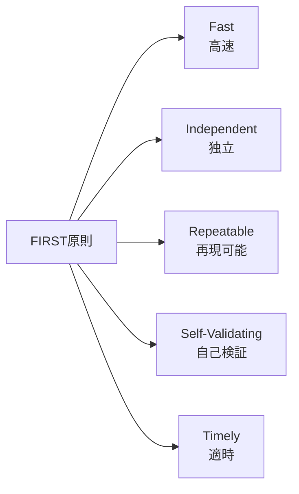

**FIRST原則の5つの特性**:
- **Fast (高速)**: 単一テスト < 100ms、全テストスイート < 5分
- **Independent (独立)**: 各テストは他のテストから完全に独立
- **Repeatable (再現可能)**: 同じ入力は常に同じ結果を返す
- **Self-Validating (自己検証)**: テスト結果は明確（成功/失敗のみ）
- **Timely (適時)**: プロダクションコードと同時または事前に作成

---

#### **F - Fast (高速)**

**目標**: 
- 単一テスト < 100ms
- 全テストスイート < 5分

**理由**:
- 開発フロー中断の最小化
- 高頻度実行の実現
- 迅速なフィードバック

**実現方法**:
- 外部依存をモック化
- データベースアクセス回避
- ファイルI/O最小化
- ネットワーク通信排除

---

#### **I - Independent (独立)**

**原則**: 各テストは他のテストから完全に独立

**理由**:
- 実行順序に依存しない
- 並列実行が可能
- デバッグが容易

**実現方法**:
- テスト間で状態を共有しない
- グローバル変数を避ける
- setup/teardownで環境をリセット

---

#### **R - Repeatable (再現可能)**

**原則**: 同じ入力は常に同じ結果を返す

**理由**:
- 信頼性の高いテスト
- デバッグの容易さ
- CI/CD環境での安定性

**実現方法**:
- 現在時刻への依存を排除
- ランダム値を固定化
- 外部APIをモック化

---

#### **S - Self-Validating (自己検証)**

**原則**: テスト結果は明確（成功/失敗のみ）

**理由**:
- 手動検証の排除
- 自動化の実現
- 明確なフィードバック

**実現方法**:
- 明示的なアサーション
- ブール値での結果判定
- 曖昧な検証を避ける

---

#### **T - Timely (適時)**

**原則**: プロダクションコードと同時または事前に作成

**理由**:
- TDD/BDDの実践
- 設計品質の向上
- リファクタリング容易性

**実現方法**:
- Red-Green-Refactorサイクル
- コミット前の必須実行
- PRレビューでの検証

---

### 1.2 単一責務の原則

#### **1テスト1アサーションの理念**

<details>
<summary>Bad例：複数の責務を1つのテストに詰め込む（クリックして展開）</summary>

```kotlin
❌ Bad: 複数の責務を1つのテストに詰め込む

testUserManagement():
    // ユーザー作成をテスト
    user = createUser(data)
    assert user.id != null
    
    // ユーザー更新をテスト
    updatedUser = updateUser(user.id, newData)
    assert updatedUser.name == "New Name"
    
    // ユーザー削除をテスト
    deleteUser(user.id)
    assert getUser(user.id) == null

問題点:
- 最初のアサーションで失敗すると後続が実行されない
- 何が失敗したか特定困難
- デバッグに時間がかかる
```

</details>

<details>
<summary>Good例：単一の責務を持つテスト（クリックして展開）</summary>

```kotlin
✅ Good: 単一の責務を持つテスト

testUserCreation_ShouldGenerateValidId():
    user = createUser(data)
    assert user.id != null
    assert user.id > 0

testUserUpdate_ShouldChangeUserName():
    user = createUser(data)
    updatedUser = updateUser(user.id, {name: "New Name"})
    assert updatedUser.name == "New Name"

testUserDeletion_ShouldRemoveUserFromDatabase():
    user = createUser(data)
    deleteUser(user.id)
    assert getUser(user.id) == null

利点:
- 失敗箇所の即座の特定
- 独立したテスト実行
- 明確なテスト意図
```

</details>

---

### 1.3 テストの独立性

#### **共有状態の排除**

<details>
<summary>Bad例：テスト間で状態を共有（クリックして展開）</summary>

```kotlin
❌ Bad: テスト間で状態を共有

// グローバル変数（危険）
shared_user = null

testA_CreateUser():
    shared_user = createUser(data)
    assert shared_user.id != null

testB_UpdateUser():
    // testAに依存（実行順序が重要）
    updateUser(shared_user.id, newData)
    assert shared_user.name == "Updated"

問題点:
- testBはtestAなしでは動作しない
- 並列実行不可
- 実行順序に依存
```

</details>

**Good例：各テストが独立**

```
✅ Good: 各テストが独立

testCreateUser_ShouldGenerateValidUser():
    user = createUser(data)
    assert user.id != null

testUpdateUser_ShouldModifyUserName():
    // 前提条件を自分で準備
    user = createUser(data)
    updatedUser = updateUser(user.id, {name: "Updated"})
    assert updatedUser.name == "Updated"

利点:
- 任意の順序で実行可能
- 並列実行対応
- デバッグが容易
```

---

## 2. テスト設計パターン

### 2.1 AAA (Arrange-Act-Assert) パターン

**最も基本的で推奨されるテスト構造**

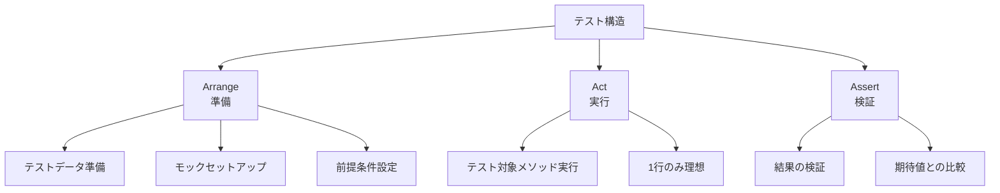

**AAAパターンの構成要素**:

1. **Arrange (準備)**
   - テストに必要なデータ準備
   - モックオブジェクトのセットアップ
   - 前提条件の設定

2. **Act (実行)**
   - テスト対象メソッドの実行
   - 1行のみ（理想）

3. **Assert (検証)**
   - 結果の検証
   - 期待値との比較

---

#### **実装例（擬似コード）**

```
testCalculateDiscount_WithValidCoupon_ShouldApply20PercentDiscount():
    // ========== Arrange ==========
    product = Product(name="Laptop", price=1000)
    coupon = Coupon(code="SAVE20", discountRate=0.20)
    calculator = PriceCalculator()
    
    // ========== Act ==========
    finalPrice = calculator.calculateFinalPrice(product, coupon)
    
    // ========== Assert ==========
    assert finalPrice == 800  // 1000 * (1 - 0.20)
```

#### **視覚的な区切り**

コメントまたは空行でセクションを明確に区別:

```
testUserAuthentication_WithValidCredentials_ShouldReturnAuthToken():
    // Arrange
    username = "testuser"
    password = "securepassword"
    authService = AuthenticationService()
    
    // Act
    result = authService.login(username, password)
    
    // Assert
    assert result.isSuccess == true
    assert result.token != null
    assert result.token.length > 0
```

---

### 2.2 Given-When-Then パターン（BDD）

**ビジネスロジックを重視するBDDスタイル**

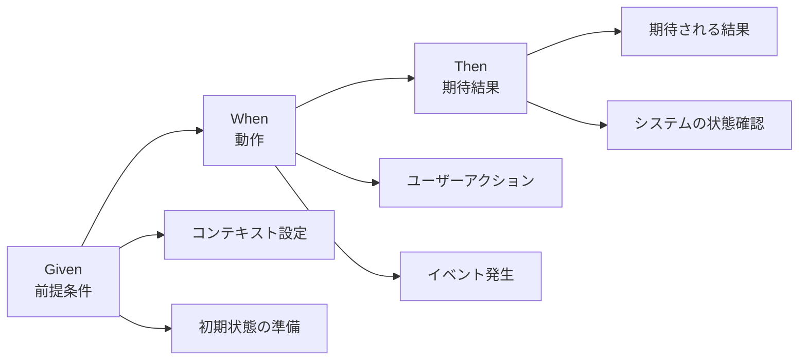

**パターンの構成**:

- **Given (前提条件)**: テストのコンテキスト設定、初期状態の準備
- **When (動作)**: ユーザーアクションまたはイベント、テスト対象の実行
- **Then (期待結果)**: 期待される結果の検証、システムの状態確認

---

#### **実装例**

<details>
<summary>Given-When-Then パターンの完全な実装例（クリックして展開）</summary>

```kotlin
testShoppingCart_AddingProductOverStockLimit():
    // Given: 在庫が5個しかない商品
    product = Product(id=1, name="Widget", stock=5)
    cart = ShoppingCart()
    
    // When: 10個をカートに追加しようとする
    result = cart.addProduct(product, quantity=10)
    
    // Then: エラーが返される
    assert result.isSuccess == false
    assert result.error == "Insufficient stock"
    assert cart.itemCount == 0  // カートは空のまま
```

</details>

---

### 2.3 テストフィクスチャパターン

#### **Setup/Teardown**

**概念**:

- **Setup (前処理)**: 各テスト実行前に共通の初期化処理、テストデータの準備、環境のセットアップ
- **Teardown (後処理)**: 各テスト実行後のクリーンアップ、リソースの解放、状態のリセット

---

#### **スコープレベル**

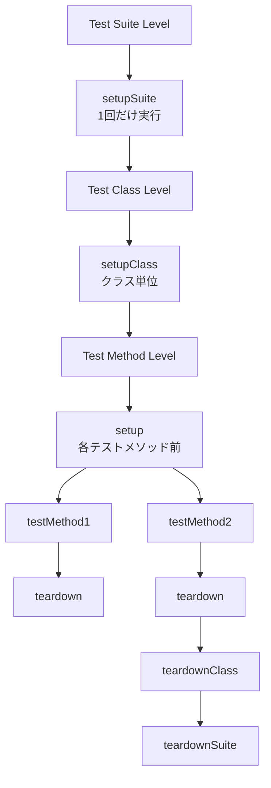

**スコープの階層**:
- **Test Suite Level**: setupSuite() - 1回だけ実行、teardownSuite() - 最後に1回
- **Test Class Level**: setupClass() - クラス単位で実行、teardownClass() - クラス終了時
- **Test Method Level**: setup() - 各テストメソッド前、teardown() - 各テストメソッド後

---

#### **使用ガイドライン**

**✅ Setup/Teardownが適切な場合**:
- データベース接続の初期化
- テストデータベースのリセット
- 共通のモックオブジェクト準備

**❌ Setup/Teardownを避けるべき場合**:
- テストごとに異なる条件が必要
- 複雑な初期化ロジック
- テストの可読性を下げる場合

**推奨**: Builder パターンやFactory メソッドを使用

---

## 3. Test Doubles（テストダブル）

### 3.1 テストダブルの種類

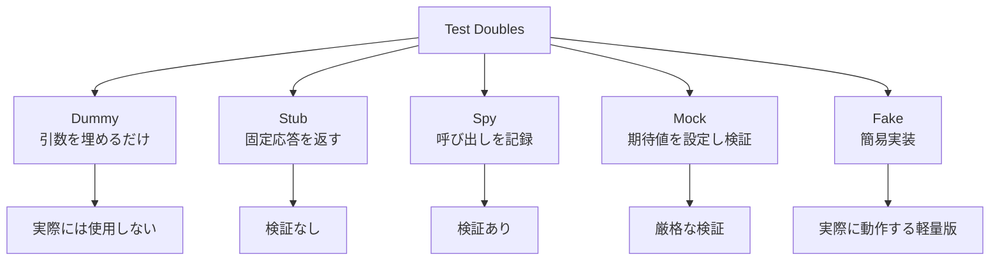

**Test Doublesの階層**:
- **Dummy**: 引数を埋めるだけ（実際には使用しない）
- **Stub**: 決まった応答を返す（検証なし）
- **Spy**: 呼び出しを記録する（検証あり）
- **Mock**: 期待値を事前設定し検証する
- **Fake**: 簡易実装（実際に動作する軽量版）

---

### 3.2 Dummy（ダミー）

**目的**: パラメータを埋めるだけで実際には使用されない

**使用例**:

```
testSendEmail_WithoutCcRecipients():
    // Arrange
    recipient = "user@example.com"
    subject = "Test Email"
    body = "This is a test"
    
    // Dummy: CCは使われないが引数として必要
    dummyCc = null  // または空のリスト
    
    // Act
    result = emailService.send(recipient, subject, body, dummyCc)
    
    // Assert
    assert result.isSuccess == true
```

---

### 3.3 Stub（スタブ）

**目的**: 固定された応答を返し、テストを簡略化

**使用例**:

```
testCalculateShipping_WithDomesticAddress():
    // Arrange
    order = Order(items=[Item(weight=2.5)])
    
    // Stub: 常に固定された配送料を返す
    shippingService = StubShippingService()
    shippingService.setFixedRate(10.00)
    
    calculator = OrderCalculator(shippingService)
    
    // Act
    total = calculator.calculateTotal(order)
    
    // Assert
    assert total.shippingCost == 10.00
```

---

### 3.4 Spy（スパイ）

**目的**: 呼び出しを記録し、後で検証

<details>
<summary>Spyの完全な実装例（クリックして展開）</summary>

```kotlin
testNotifyUser_ShouldCallEmailServiceOnce():
    // Arrange
    user = User(email="user@example.com")
    emailServiceSpy = SpyEmailService()
    notifier = UserNotifier(emailServiceSpy)
    
    // Act
    notifier.notifyUserRegistration(user)
    
    // Assert: 呼び出しを検証
    assert emailServiceSpy.wasCalledOnce()
    assert emailServiceSpy.getLastCallArguments().recipient == "user@example.com"
    assert emailServiceSpy.getLastCallArguments().subject.contains("Welcome")
```

</details>

---

### 3.5 Mock（モック）

**目的**: 期待値を事前設定し、厳格に検証

<details>
<summary>Mockの完全な実装例（クリックして展開）</summary>

```kotlin
testProcessPayment_ShouldCallPaymentGatewayWithCorrectAmount():
    // Arrange
    order = Order(totalAmount=100.00)
    
    // Mock: 期待する呼び出しを事前設定
    paymentGatewayMock = MockPaymentGateway()
    paymentGatewayMock.expect(
        method="charge",
        arguments={amount: 100.00, currency: "USD"},
        returns={success: true, transactionId: "TXN123"}
    )
    
    processor = PaymentProcessor(paymentGatewayMock)
    
    // Act
    result = processor.processOrder(order)
    
    // Assert
    assert result.success == true
    paymentGatewayMock.verify()  // 期待通りに呼ばれたか検証
```

</details>

---

### 3.6 Fake（フェイク）

**目的**: 実際に動作する軽量実装

<details>
<summary>Fakeの完全な実装例（クリックして展開）</summary>

```kotlin
testUserRepository_SaveAndRetrieve():
    // Arrange: インメモリの軽量実装
    userRepository = FakeInMemoryUserRepository()
    user = User(id=1, name="John Doe")
    
    // Act
    userRepository.save(user)
    retrievedUser = userRepository.findById(1)
    
    // Assert
    assert retrievedUser.name == "John Doe"

FakeInMemoryUserRepository の実装イメージ:
    - 実際のデータベースではなく辞書/マップに保存
    - CRUD操作は実装
    - トランザクション、インデックスは簡略化
```

</details>

---

### 3.7 使い分けガイドライン

| 種類 | 使用シーン | 複雑度 |
|------|-----------|--------|
| Dummy | 引数が必要だが使われない場合 | 最小 |
| Stub | 固定応答で十分な場合 | 低 |
| Spy | 呼び出し回数や引数を検証したい場合 | 中 |
| Mock | 厳格な呼び出し検証が必要な場合 | 高 |
| Fake | 複雑なロジックがあり実装が必要な場合 | 最大 |

**原則**:
- 最もシンプルなものを選ぶ（Dummy → Stub → Spy → Mock → Fake）
- モックは過度に使用しない（実装詳細への依存を避ける）
- Fakeはテストコードの複雑化を招くため慎重に使用

---

## 4. テストケース設計

### 4.1 等価分割（Equivalence Partitioning）

**原則**: 入力を同じ振る舞いをするグループに分割

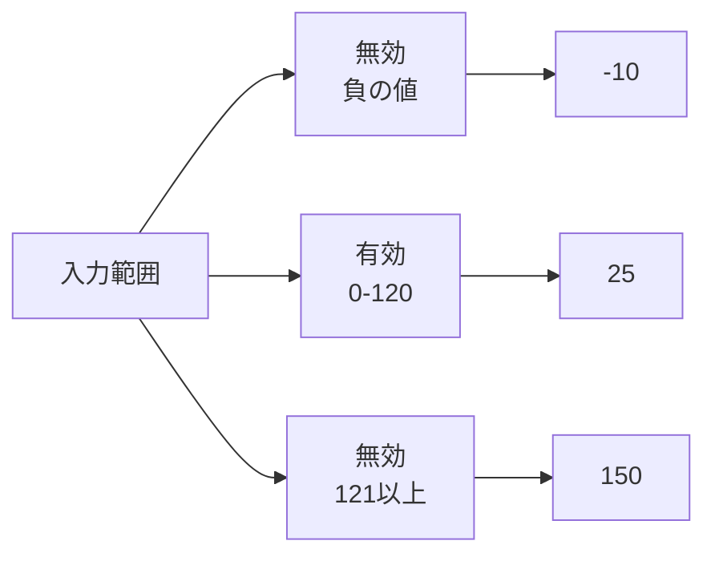

**例: ユーザー年齢検証**

入力範囲の分割:
- **無効（< 0）**: -10
- **有効（0-120）**: 25
- **無効（> 120）**: 150

<details>
<summary>等価分割のテストケース実装例（クリックして展開）</summary>

```kotlin
testAgeValidation_WithNegativeAge_ShouldReturnInvalid():
    result = validateAge(-10)
    assert result.isValid == false

testAgeValidation_WithValidAge_ShouldReturnValid():
    result = validateAge(25)
    assert result.isValid == true

testAgeValidation_WithExcessiveAge_ShouldReturnInvalid():
    result = validateAge(150)
    assert result.isValid == false
```

</details>

---

### 4.2 境界値分析（Boundary Value Analysis）

**原則**: 境界値とその前後をテスト

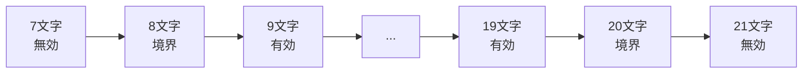

**例: パスワード長検証（8-20文字）**

境界値:
- **7文字**: 無効（最小値未満）
- **8文字**: 境界（最小値）
- **9文字**: 有効
- **19文字**: 有効
- **20文字**: 境界（最大値）
- **21文字**: 無効（最大値超過）

<details>
<summary>境界値分析のテストケース実装例（クリックして展開）</summary>

```kotlin
testPassword_WithLengthBelowMinimum():
    result = validatePassword("1234567")  // 7文字
    assert result.isValid == false

testPassword_WithMinimumLength():
    result = validatePassword("12345678")  // 8文字
    assert result.isValid == true

testPassword_WithMaximumLength():
    result = validatePassword("12345678901234567890")  // 20文字
    assert result.isValid == true

testPassword_WithLengthAboveMaximum():
    result = validatePassword("123456789012345678901")  // 21文字
    assert result.isValid == false
```

</details>

---

### 4.3 エッジケース

**テストすべきエッジケース一覧**

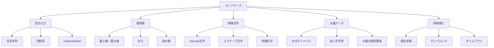

**必須でテストすべきエッジケース**:

1. **空の入力**: 空文字列 ""、空配列 []、null / undefined / None
2. **境界値**: 最小値、最大値、ゼロ、負の値
3. **特殊文字**: Unicode文字、エスケープが必要な文字、制御文字
4. **大量データ**: 大きなファイル、長い文字列、大量の配列要素
5. **同時実行**: 競合状態、デッドロック、タイムアウト

---

#### **実装例**

<details>
<summary>エッジケースのテスト実装例（クリックして展開）</summary>

```kotlin
testUserName_WithEmptyString_ShouldReturnError():
    result = createUser(name="")
    assert result.isSuccess == false
    assert result.error == "Name cannot be empty"

testUserName_WithNull_ShouldReturnError():
    result = createUser(name=null)
    assert result.isSuccess == false

testUserName_WithUnicodeCharacters_ShouldAccept():
    result = createUser(name="山田太郎")
    assert result.isSuccess == true

testUserName_WithVeryLongString_ShouldReturnError():
    longName = "A" * 1000
    result = createUser(name=longName)
    assert result.isSuccess == false
```

</details>

---

### 4.4 デシジョンテーブル

**複雑な条件分岐のテスト**

**例: ユーザーアクセス権限判定**

条件:
- isPremiumUser (T/F)
- hasActiveSubscription (T/F)
- isInTrialPeriod (T/F)

決定表:

| Case | PM | SUB | TRL | 結果 |
|------|----|----|-----|------|
| 1 | T | T | T | Allow |
| 2 | T | T | F | Allow |
| 3 | T | F | T | Allow |
| 4 | T | F | F | Deny |
| 5 | F | T | T | Allow |
| 6 | F | T | F | Allow |
| 7 | F | F | T | Allow |
| 8 | F | F | F | Deny |

**テストケース**:

```
testAccess_PremiumWithSubscription_ShouldAllow():
    user = User(isPremium=true, hasSubscription=true, inTrial=false)
    assert canAccess(user) == true

testAccess_NonPremiumWithoutSubscriptionOrTrial_ShouldDeny():
    user = User(isPremium=false, hasSubscription=false, inTrial=false)
    assert canAccess(user) == false
```

---

## 5. 命名規約

### 5.1 推奨命名パターン

#### **パターン1: MethodName_StateUnderTest_ExpectedBehavior**

```
testCalculateTotal_WithEmptyCart_ShouldReturnZero()
testSendEmail_WithInvalidAddress_ShouldThrowException()
testUserLogin_WithCorrectCredentials_ShouldReturnToken()
```

#### **パターン2: Should_ExpectedBehavior_When_StateUnderTest**

```
should_ReturnZero_When_CartIsEmpty()
should_ThrowException_When_EmailAddressIsInvalid()
should_ReturnToken_When_CredentialsAreCorrect()
```

#### **パターン3: Given_Preconditions_When_StateUnderTest_Then_ExpectedBehavior**

```
given_EmptyCart_when_CalculatingTotal_then_ReturnsZero()
given_InvalidEmail_when_SendingEmail_then_ThrowsException()
```

---

### 5.2 命名のベストプラクティス

**✅ Good**:
- 具体的で説明的
- ビジネスロジックが理解できる
- 失敗時に何が問題か即座にわかる

```
testUserRegistration_WithDuplicateEmail_ShouldReturnConflictError()
testPriceCalculation_WithExpiredCoupon_ShouldIgnoreDiscount()
testFileUpload_WithOversizedFile_ShouldReturnFileSizeError()
```

**❌ Bad**:
- 曖昧で短すぎる
- 何をテストしているか不明

```
testUser()
testCalculation()
testError()
testCase1()
```

---

### 5.3 言語別の命名スタイル

言語ごとの命名規約は各言語標準を参照:

- **Python**: `test_method_name_with_condition_should_return_expected()` → 詳細: [01-coding-standards/python-standards.md](../01-coding-standards/python-standards.md)
- **JavaScript/TypeScript**: `testMethodNameWithConditionShouldReturnExpected()` → 詳細: [01-coding-standards/typescript-javascript-standards.md](../01-coding-standards/typescript-javascript-standards.md)
- **Java**: `testMethodName_WithCondition_ShouldReturnExpected()` → 詳細: [01-coding-standards/java-standards.md](../01-coding-standards/java-standards.md)

---

## 6. アサーション戦略

### 6.1 アサーションの原則

**原則1: 1テスト1概念**
- 1つのテストで検証する概念は1つ
- 複数のアサーションは許容されるが、同じ概念を検証

**原則2: 明確なエラーメッセージ**
- アサーション失敗時に何が問題か即座にわかる
- 期待値と実際の値を明示

**原則3: 適切なアサーションメソッド使用**
- `assertEquals` より `assertThat` の方が読みやすい場合がある
- ドメイン固有のカスタムアサーションを作成

---

### 6.2 アサーションの種類

**基本的なアサーション**:

| カテゴリ | アサーション |
|---------|------------|
| 等価性 | `assertEqual(actual, expected)`<br/>`assertNotEqual(actual, unexpected)` |
| 真偽 | `assertTrue(condition)`<br/>`assertFalse(condition)` |
| 存在 | `assertNull(value)`<br/>`assertNotNull(value)` |
| 例外 | `assertThrows(ExceptionType, callable)`<br/>`assertDoesNotThrow(callable)` |
| コレクション | `assertContains(collection, element)`<br/>`assertEmpty(collection)`<br/>`assertSize(collection, expectedSize)` |

---

### 6.3 カスタムアサーション

**複雑な検証をカプセル化**

<details>
<summary>カスタムアサーションの実装例（クリックして展開）</summary>

```kotlin
❌ Bad: 複数のアサーションが散在
testUserCreation():
    user = createUser(data)
    assert user.id != null
    assert user.name == "John Doe"
    assert user.email == "john@example.com"
    assert user.isActive == true
    assert user.createdAt != null

✅ Good: カスタムアサーションでカプセル化
testUserCreation():
    user = createUser(data)
    assertValidUser(user, expectedName="John Doe", expectedEmail="john@example.com")

// カスタムアサーション実装
function assertValidUser(user, expectedName, expectedEmail):
    assert user.id != null, "User ID should not be null"
    assert user.name == expectedName, f"Expected name {expectedName}, got {user.name}"
    assert user.email == expectedEmail, f"Expected email {expectedEmail}, got {user.email}"
    assert user.isActive == true, "User should be active"
    assert user.createdAt != null, "Created timestamp should not be null"
```

</details>

---

### 6.4 フレキシブルなアサーション

厳密すぎるアサーションを避ける:

<details>
<summary>フレキシブルなアサーションの実装例（クリックして展開）</summary>

```kotlin
❌ Bad: タイムスタンプの完全一致を期待
testUserCreation():
    user = createUser(data)
    assert user.createdAt == "2025-10-27T09:00:00Z"  // 脆弱

✅ Good: 範囲で検証
testUserCreation():
    beforeCreation = getCurrentTime()
    user = createUser(data)
    afterCreation = getCurrentTime()
    
    assert user.createdAt >= beforeCreation
    assert user.createdAt <= afterCreation

または:
    assert isRecentTimestamp(user.createdAt, withinSeconds=5)
```

</details>

---

## 7. テストデータ管理

### 7.1 テストデータビルダーパターン

**目的**: 複雑なテストデータを柔軟に構築

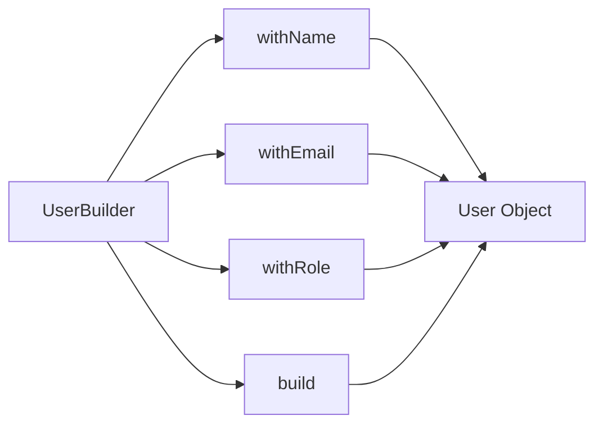

<details>
<summary>ビルダーパターンの完全な実装例（クリックして展開）</summary>

```kotlin
❌ Bad: テストごとに冗長なデータ準備
testUserCreation():
    user = User(
        id=1,
        name="John Doe",
        email="john@example.com",
        age=30,
        address="123 Main St",
        city="New York",
        country="USA",
        phoneNumber="+1234567890",
        isActive=true,
        role="USER"
    )
    // テスト実行

✅ Good: ビルダーパターン
testUserCreation():
    user = UserBuilder()
        .withName("John Doe")
        .withEmail("john@example.com")
        .build()
    // テスト実行

testAdminUser():
    admin = UserBuilder()
        .withName("Admin User")
        .withRole("ADMIN")
        .build()
    // テスト実行

// ビルダーの実装イメージ
class UserBuilder:
    defaults = {
        id: 1,
        name: "Default User",
        email: "default@example.com",
        age: 25,
        isActive: true,
        role: "USER"
    }
    
    function withName(name):
        this.name = name
        return this
    
    function withEmail(email):
        this.email = email
        return this
    
    function build():
        return User(this.defaults merged with overrides)
```

</details>

---

### 7.2 ファクトリーメソッド

<details>
<summary>ファクトリーメソッドの実装例（クリックして展開）</summary>

```kotlin
例: 典型的なテストデータパターン

// 典型的なユーザーデータ
function createTestUser():
    return User(
        name="Test User",
        email="test@example.com",
        role="USER"
    )

// プレミアムユーザー
function createPremiumUser():
    user = createTestUser()
    user.isPremium = true
    user.subscriptionEndDate = futureDate(days=365)
    return user

// 無効なユーザー
function createInactiveUser():
    user = createTestUser()
    user.isActive = false
    return user

使用例:
testUserAccess_WithPremiumUser_ShouldAllowFeature():
    user = createPremiumUser()
    assert canAccessPremiumFeature(user) == true
```

</details>

---

### 7.3 テストデータの管理方針

**✅ 推奨**:
- インラインテストデータ（小規模・明確な場合）
- ビルダーパターン（複雑なオブジェクト）
- ファクトリーメソッド（典型的なパターン）

**❌ 避けるべき**:
- 外部ファイル（JSON/CSV）への過度な依存 → テストの可読性低下、メンテナンス困難
- 巨大な共有フィクスチャ → テスト間の結合、予期しない副作用

**例外**:
- 大量のデータが必要な性能テスト
- エッジケースのための複雑なデータセット

---

## 8. カバレッジ戦略

### 8.1 カバレッジの種類

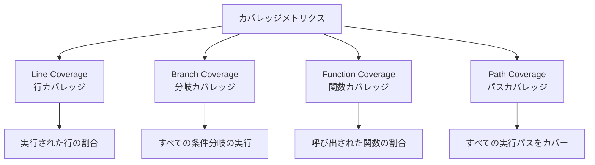

**カバレッジメトリクスの種類**:

- **Line Coverage (行カバレッジ)**: 実行された行の割合
- **Branch Coverage (分岐カバレッジ)**: すべての条件分岐の実行（if/else, switch/case）
- **Function Coverage (関数カバレッジ)**: 呼び出された関数の割合
- **Path Coverage (パスカバレッジ)**: すべての実行パスをカバー（理想だが困難）

---

### 8.2 目標カバレッジ

**推奨カバレッジ目標**:

| コンポーネント | 目標カバレッジ | 優先度 |
|--------------|--------------|--------|
| 全体 | 80%以上 | 必須 |
| ビジネスロジック | 90%以上 | 推奨 |
| ユーティリティ | 85%以上 | 推奨 |
| UIコンポーネント | 70%以上 | 許容 |

**重要**:
- カバレッジは目的ではなく手段
- 100%を目指すことは非現実的かつ非効率
- 未カバー箇所の理由を明確化

---

### 8.3 何をテストすべきか

**✅ 必須でテストすべき**:
- ビジネスロジック（計算、検証、変換）
- エラーハンドリング
- エッジケース
- セキュリティ関連ロジック
- 公開API

**❌ テスト不要（低優先度）**:
- 単純なGetter/Setter
- 自動生成コード
- フレームワークのボイラープレート
- 定数定義

**⚠️ 慎重に判断**:
- プライベートメソッド（原則テスト不要、公開メソッド経由でカバー）
- 設定ファイル
- サードパーティライブラリのラッパー

---

### 8.4 カバレッジギャップの対処

**未カバー箇所の分類**:

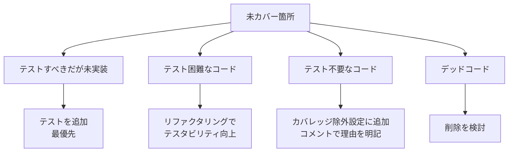

**対処方法**:

1. **テストすべきだが未実装** → テストを追加（最優先）
2. **テスト困難なコード** → リファクタリングでテスタビリティ向上
3. **テスト不要なコード** → カバレッジ除外設定に追加、コメントで理由を明記
4. **デッドコード** → 削除を検討

**除外設定の例**:
```
// coverage:ignore - 自動生成コード
// no-cover - エラーハンドリングの稀なケース
```

---

## 9. アンチパターン

### 9.1 テストの相互依存

<details>
<summary>テストの相互依存のアンチパターン例（クリックして展開）</summary>

```kotlin
❌ Bad:
testA_CreateUser():
    global_user = createUser()
    save(global_user)

testB_UpdateUser():
    updateUser(global_user)  // testAに依存

testC_DeleteUser():
    deleteUser(global_user)  // testA, testBに依存

問題:
- 実行順序に依存
- 並列実行不可
- testAが失敗すると全て失敗
```

</details>

---

### 9.2 過度なモック

<details>
<summary>過度なモックのアンチパターン例（クリックして展開）</summary>

```kotlin
❌ Bad: 実装詳細へのモック
testUserService():
    // 内部実装の詳細をすべてモック
    databaseMock = createMock(Database)
    cacheMock = createMock(Cache)
    loggerMock = createMock(Logger)
    
    databaseMock.expect("query", returns=data)
    cacheMock.expect("get", returns=null)
    cacheMock.expect("set", returns=true)
    loggerMock.expect("info", returns=null)
    
    service = UserService(databaseMock, cacheMock, loggerMock)
    result = service.getUser(1)
    
    verify(databaseMock)
    verify(cacheMock)
    verify(loggerMock)

問題:
- リファクタリング耐性が低い
- 実装変更でテストが壊れる
- テストの価値が低い

✅ Good: 公開インターフェースをテスト
testUserService_GetUser():
    service = UserService(realDependencies)
    result = service.getUser(1)
    
    assert result.name == "Expected Name"
    // 内部実装の詳細は気にしない
```

</details>

---

### 9.3 脆弱なテスト

<details>
<summary>脆弱なテストのアンチパターン例（クリックして展開）</summary>

```kotlin
❌ Bad: 時刻に依存
testReportGeneration():
    report = generateReport()
    assert report.timestamp == "2025-10-27 09:00:00"
    // 実行時刻が変わると失敗

✅ Good: 依存を注入
testReportGeneration():
    fixedTime = "2025-10-27 09:00:00"
    timeProvider = FixedTimeProvider(fixedTime)
    report = generateReport(timeProvider)
    assert report.timestamp == fixedTime
```

</details>

---

### 9.4 重複したテスト

```
❌ Bad:
testAddition_1Plus1():
    assert add(1, 1) == 2

testAddition_2Plus2():
    assert add(2, 2) == 4

testAddition_3Plus3():
    assert add(3, 3) == 6

問題:
- 同じロジックを複数回テスト
- メンテナンスコスト増加

✅ Good: パラメータ化テスト
testAddition(input1, input2, expected):
    assert add(input1, input2) == expected

// テストケース
parameters = [
    (1, 1, 2),
    (2, 2, 4),
    (3, 3, 6),
    (-1, 1, 0),
    (0, 0, 0)
]
```

---

### 9.5 曖昧なアサーション

```
❌ Bad:
testUserCreation():
    user = createUser()
    assert user != null  // これだけでは不十分

✅ Good:
testUserCreation():
    user = createUser(name="John", email="john@example.com")
    assert user != null
    assert user.id > 0
    assert user.name == "John"
    assert user.email == "john@example.com"
    assert user.isActive == true
```

---

## 10. パフォーマンス最適化

### 10.1 高速化のテクニック

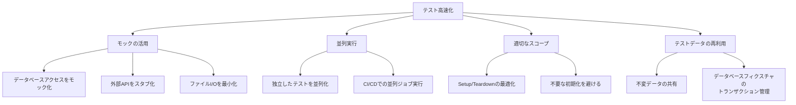

**✅ 推奨テクニック**:

1. **モックの活用**
   - データベースアクセスをモック化
   - 外部APIをスタブ化
   - ファイルI/Oを最小化

2. **並列実行**
   - 独立したテストを並列化
   - CI/CDでの並列ジョブ実行

3. **適切なスコープ**
   - Setup/Teardownの最適化
   - 不要な初期化を避ける

4. **テストデータの再利用**
   - 不変データの共有（慎重に）
   - データベースフィクスチャのトランザクション管理

---

### 10.2 遅いテストの特定

**目標**:
- 単一テスト < 100ms
- テストスイート全体 < 5分

**遅いテストの原因**:
1. データベースアクセス（最も一般的）
2. ファイルI/O
3. ネットワーク通信
4. スリープ/待機処理
5. 複雑な計算

**対策**:
- プロファイリングツール使用
- 遅いテストの別スイート分離
- 統合テストとの分類見直し

---

### 10.3 並列実行の注意点

**安全な並列実行のために**:

**✅ OK**:
- 完全に独立したテスト
- 読み取り専用の共有データ
- インメモリのテストデータ

**❌ NG**:
- グローバル変数への書き込み
- 共有ファイルへのアクセス
- 同一データベーステーブルの更新

**並列実行戦略**:
- テストごとに独立したデータベーススキーマ
- 一意な識別子の使用（UUID等）
- トランザクション分離

---

## 11. Devin AIガイドライン

### 11.1 自動テスト生成時の指針

**Devin AIがユニットテストを生成する際の原則**:

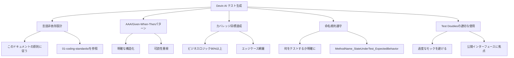

**原則**:

1. **完全な言語非依存設計**
   - このドキュメントの原則に従う
   - 言語固有の実装は 01-coding-standards/ を参照

2. **AAA/Given-When-Thenパターン使用**
   - 明確な構造化
   - 可読性重視

3. **カバレッジ目標達成**
   - ビジネスロジック 90%以上
   - エッジケース網羅

4. **命名規約遵守**
   - 何をテストするか明確に
   - MethodName_StateUnderTest_ExpectedBehavior

5. **Test Doublesの適切な使用**
   - 過度なモックを避ける
   - 公開インターフェースに焦点

---

### 11.2 テストコード生成プロンプト

<details>
<summary>推奨プロンプトテンプレート（クリックして展開）</summary>

```kotlin
"以下のメソッドのユニットテストを生成してください:

[メソッドのコード]

要件:
- AAA パターンに従う
- エッジケースを含む
- カバレッジ90%以上を目指す
- 適切なTest Doublesを使用
- 命名規約: testMethodName_StateUnderTest_ExpectedBehavior
- 言語固有の実装は [言語]-standards.md を参照

テストケース:
1. 正常系
2. 異常系（無効な入力）
3. 境界値
4. エッジケース"
```

</details>

---

### 11.3 レビューチェックリスト

**Devin AIが生成したテストコードのレビューポイント**:

- ☐ FIRST原則に準拠しているか
- ☐ AAA/Given-When-Thenパターンか
- ☐ テストの独立性は確保されているか
- ☐ 命名規約に従っているか
- ☐ エッジケースがカバーされているか
- ☐ アサーションは明確か
- ☐ モックが過度でないか
- ☐ テスト実行時間は適切か（< 100ms）
- ☐ カバレッジ目標を達成しているか
- ☐ アンチパターンを避けているか

---

### 11.4 継続的改善

**テストコードの品質向上サイクル**:

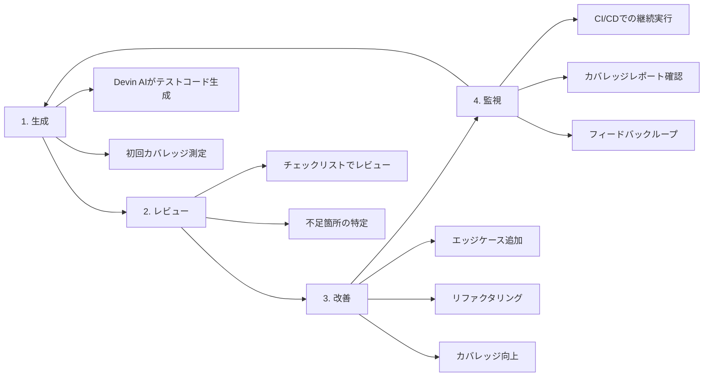

**サイクルの流れ**:

1. **生成**
   - Devin AIがテストコード生成
   - 初回カバレッジ測定

2. **レビュー**
   - チェックリストでレビュー
   - 不足箇所の特定

3. **改善**
   - エッジケース追加
   - リファクタリング
   - カバレッジ向上

4. **監視**
   - CI/CDでの継続実行
   - カバレッジレポート確認
   - フィードバックループ

---

## 📚 参考資料

### 関連ドキュメント

- **[Testing Strategy](./testing-strategy.md)**: テスト戦略全体像
- **[Integration Testing](./integration-testing.md)**: 統合テスト実装ガイド
- **[E2E Testing](./e2e-testing.md)**: E2Eテスト実装ガイド
- **[Code Quality Standards](./code-quality-standards.md)**: コード品質基準
- **[Quality Metrics](./quality-metrics.md)**: 品質メトリクス定義

### 言語固有の実装

- **[Python Standards](../01-coding-standards/python-standards.md)**: pytest, unittest
- **[TypeScript/JavaScript Standards](../01-coding-standards/typescript-javascript-standards.md)**: Jest, Mocha
- **[Java Standards](../01-coding-standards/java-standards.md)**: JUnit, TestNG

---

## 📝 改訂履歴

| バージョン | 日付       | 変更内容                           | 変更者       |
|-----------|------------|----------------------------------|-------------|
| 1.0.2     | 2025-10-27 | ドキュメント生成ルール更新対応：`<details>`タグの空行追加、コードブロックに言語指定（kotlin）を追加 | Devin AI    |
| 1.0.1     | 2025-10-27 | ドキュメント生成ルール準拠版に修正：長いコードブロックに折りたたみ機能追加、ASCII図をMermaid図に変換、図表にテキスト説明追加 | Devin AI    |
| 1.0.0     | 2025-10-27 | 初版作成（言語非依存設計）         | Devin AI    |

---

**最終更新**: 2025-10-27  
**次回レビュー予定**: 2025-11-27
