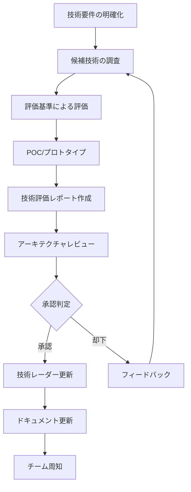
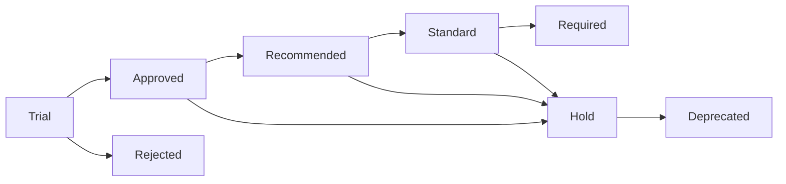

# README - 技術スタック / Technology Stack

```yaml
version: "2.0.0"
last_updated: "2025-10-29"
status: "active"
owner: "Architecture Team"
category: "technology-stack"
```

## 目次 / Table of Contents

1. [概要 / Overview](#概要--overview)
2. [技術スタック構成 / Technology Stack Structure](#技術スタック構成--technology-stack-structure)
3. [採用技術一覧 / Adopted Technologies](#採用技術一覧--adopted-technologies)
4. [技術選定プロセス / Technology Selection Process](#技術選定プロセス--technology-selection-process)
5. [技術ステータス定義 / Technology Status Definitions](#技術ステータス定義--technology-status-definitions)
6. [技術評価基準 / Technology Evaluation Criteria](#技術評価基準--technology-evaluation-criteria)
7. [ドキュメント構成 / Document Structure](#ドキュメント構成--document-structure)
8. [使用ガイドライン / Usage Guidelines](#使用ガイドライン--usage-guidelines)
9. [更新プロセス / Update Process](#更新プロセス--update-process)
10. [お問い合わせ / Contact](#お問い合わせ--contact)

---

## 概要 / Overview

このディレクトリは、組織全体で使用する技術スタックの標準を定義します。

### 目的 / Purpose

- **標準化**: 組織全体で一貫した技術選定
- **品質保証**: 実績のある技術の採用
- **効率化**: 技術選定の意思決定時間短縮
- **知識共有**: ベストプラクティスの蓄積と共有
- **リスク管理**: 技術的負債の最小化

### 対象読者 / Target Audience

- ソフトウェアエンジニア
- アーキテクト
- テックリード
- プロダクトマネージャー
- CTOオフィス

---

## 技術スタック構成 / Technology Stack Structure

```
05-technology-stack/
├── README.md                    # このファイル
├── frontend-stack.md            # フロントエンド技術スタック
├── backend-stack.md             # バックエンド技術スタック
├── infrastructure-stack.md      # インフラストラクチャ技術スタック
├── messaging-stack.md           # メッセージング技術スタック
└── search-stack.md             # 検索技術スタック
```

### 各ドキュメントの役割 / Role of Each Document

| ドキュメント | 内容 | 主要技術 |
|------------|------|---------|
| **frontend-stack.md** | フロントエンド開発標準 | React, Next.js, TypeScript, Tailwind CSS |
| **backend-stack.md** | バックエンド開発標準 | Node.js, NestJS, PostgreSQL, Redis |
| **infrastructure-stack.md** | インフラ・DevOps標準 | AWS, Docker, Kubernetes, Terraform |
| **messaging-stack.md** | メッセージング標準 | SQS, SNS, Kafka, BullMQ |
| **search-stack.md** | 検索エンジン標準 | Elasticsearch, OpenSearch, pgvector |

---

## 採用技術一覧 / Adopted Technologies

### フロントエンド / Frontend

```yaml
core_technologies:
  language:
    - name: "TypeScript"
      version: "5.x"
      status: "required"
      rationale: "型安全性、開発効率"
  
  framework:
    - name: "React"
      version: "18.x"
      status: "standard"
      rationale: "豊富なエコシステム、実績"
    
    - name: "Next.js"
      version: "14.x"
      status: "recommended"
      rationale: "SSR/SSG、ルーティング、最適化"
  
  styling:
    - name: "Tailwind CSS"
      version: "3.x"
      status: "standard"
      rationale: "生産性、一貫性、保守性"
  
  state_management:
    - name: "Redux Toolkit"
      status: "recommended"
      use_case: "複雑な状態管理"
    
    - name: "Zustand"
      status: "approved"
      use_case: "軽量な状態管理"
  
  testing:
    - name: "Vitest"
      status: "required"
      rationale: "高速、Vite統合"
    
    - name: "Playwright"
      status: "recommended"
      rationale: "クロスブラウザE2E"
```

### バックエンド / Backend

```yaml
core_technologies:
  language:
    - name: "Node.js"
      version: "20.x LTS"
      status: "required"
    
    - name: "TypeScript"
      version: "5.x"
      status: "required"
    
    - name: "Python"
      version: "3.11+, 3.12+"
      status: "approved"
      use_case: "データ処理、ML"
    
    - name: "Go"
      version: "1.21+, 1.22+"
      status: "approved"
      use_case: "高性能サービス"
  
  framework:
    - name: "Express.js"
      version: "4.x"
      status: "standard"
    
    - name: "NestJS"
      version: "10.x"
      status: "recommended"
      use_case: "エンタープライズアプリ"
  
  database:
    relational:
      - name: "PostgreSQL"
        version: "15.x, 16.x"
        status: "standard"
        orm: "Prisma"
    
    nosql:
      - name: "MongoDB"
        version: "6.x, 7.x"
        status: "approved"
      
      - name: "Redis"
        version: "7.x"
        status: "required"
        use_case: "キャッシング、セッション"
```

### インフラストラクチャ / Infrastructure

```yaml
core_technologies:
  cloud_provider:
    - name: "AWS"
      status: "standard"
      regions: ["ap-northeast-1", "us-east-1"]
  
  containers:
    - name: "Docker"
      version: "24.x+"
      status: "required"
    
    - name: "ECS Fargate"
      status: "standard"
      use_case: "コンテナオーケストレーション"
    
    - name: "Amazon EKS"
      status: "recommended"
      use_case: "Kubernetes要件"
  
  iac:
    - name: "Terraform"
      version: "1.6+"
      status: "standard"
  
  cicd:
    - name: "GitHub Actions"
      status: "standard"
  
  monitoring:
    - name: "CloudWatch"
      status: "standard"
    
    - name: "Prometheus + Grafana"
      status: "recommended"
```

### メッセージング / Messaging

```yaml
core_technologies:
  message_queue:
    - name: "Amazon SQS"
      status: "standard"
    
    - name: "Amazon SNS"
      status: "standard"
  
  event_streaming:
    - name: "Amazon Kinesis"
      status: "standard"
    
    - name: "Apache Kafka"
      status: "approved"
      deployment: "Amazon MSK"
  
  job_queue:
    - name: "BullMQ"
      status: "standard"
      backend: "Redis"
  
  realtime:
    - name: "Socket.IO"
      version: "4.x"
      status: "standard"
```

### 検索 / Search

```yaml
core_technologies:
  search_engine:
    - name: "Elasticsearch"
      version: "8.x"
      status: "standard"
      deployment: "Amazon OpenSearch Service"
    
    - name: "Algolia"
      status: "approved"
      use_case: "高速フロントエンド検索"
  
  vector_search:
    - name: "pgvector"
      status: "approved"
      use_case: "PostgreSQL統合"
    
    - name: "OpenAI Embeddings"
      status: "recommended"
      use_case: "セマンティック検索"
```

---

## 技術選定プロセス / Technology Selection Process

### 選定フロー / Selection Flow



### ステップ詳細 / Step Details

#### 1. 技術要件の明確化 / Requirements Definition

```yaml
requirements:
  functional:
    - "実現したい機能"
    - "パフォーマンス要件"
    - "スケーラビリティ要件"
  
  non_functional:
    - "セキュリティ要件"
    - "可用性要件"
    - "保守性要件"
  
  constraints:
    - "予算制約"
    - "スケジュール制約"
    - "技術的制約"
```

#### 2. 候補技術の調査 / Technology Research

```yaml
research_areas:
  - "オープンソース vs 商用"
  - "コミュニティの活発さ"
  - "ドキュメント品質"
  - "既存技術との統合性"
  - "ライセンス"
  - "サポート体制"
```

#### 3. 評価基準による評価 / Evaluation

詳細は[技術評価基準](#技術評価基準--technology-evaluation-criteria)を参照

#### 4. POC/プロトタイプ / Proof of Concept

```yaml
poc_scope:
  duration: "1-2週間"
  team_size: "1-2名"
  deliverables:
    - "動作するプロトタイプ"
    - "パフォーマンステスト結果"
    - "技術的課題の洗い出し"
    - "学習曲線の評価"
```

#### 5. 技術評価レポート / Evaluation Report

```yaml
report_structure:
  executive_summary: "要約"
  requirements: "要件"
  evaluation_results: "評価結果"
  poc_findings: "POC結果"
  recommendation: "推奨事項"
  risks: "リスク"
  timeline: "導入タイムライン"
  cost_analysis: "コスト分析"
```

#### 6. アーキテクチャレビュー / Architecture Review

```yaml
review_board:
  members:
    - "CTO"
    - "アーキテクチャリード"
    - "セキュリティリード"
    - "テックリード"
  
  review_criteria:
    - "技術的妥当性"
    - "組織への適合性"
    - "長期的な保守性"
    - "コスト対効果"
```

---

## 技術ステータス定義 / Technology Status Definitions

### ステータス種別 / Status Types

```yaml
technology_status:
  required:
    description: "必須技術"
    policy: "すべての新規プロジェクトで使用"
    approval: "不要"
    examples: ["TypeScript", "Docker", "PostgreSQL"]
  
  standard:
    description: "標準技術"
    policy: "デフォルトで採用"
    approval: "不要"
    examples: ["React", "Express.js", "AWS"]
  
  recommended:
    description: "推奨技術"
    policy: "特定ユースケースで推奨"
    approval: "テックリード承認"
    examples: ["NestJS", "Prometheus", "Kafka"]
  
  approved:
    description: "承認済み技術"
    policy: "使用可能、ただし標準技術を優先"
    approval: "アーキテクト承認"
    examples: ["Python", "MongoDB", "Algolia"]
  
  trial:
    description: "試験的採用"
    policy: "限定的なプロジェクトで試験中"
    approval: "CTO承認"
    examples: ["新興技術、評価中の技術"]
  
  hold:
    description: "保留中"
    policy: "新規採用は推奨しない"
    approval: "CTO承認必要"
    examples: ["課題のある技術、古い技術"]
  
  deprecated:
    description: "非推奨"
    policy: "新規使用禁止、移行計画必須"
    approval: "使用不可"
    examples: ["廃止予定の技術"]
```

### ステータス遷移 / Status Transitions



---

## 技術評価基準 / Technology Evaluation Criteria

### 評価カテゴリ / Evaluation Categories

#### 1. 技術的成熟度 / Technical Maturity

```yaml
criteria:
  stability:
    weight: 20
    factors:
      - "バージョン安定性"
      - "バグ修正頻度"
      - "Breaking changes頻度"
  
  production_readiness:
    weight: 15
    factors:
      - "本番環境での実績"
      - "大規模システムでの採用事例"
  
  performance:
    weight: 15
    factors:
      - "レスポンスタイム"
      - "スループット"
      - "リソース効率"
```

#### 2. エコシステム / Ecosystem

```yaml
criteria:
  community:
    weight: 10
    factors:
      - "GitHubスター数"
      - "コントリビューター数"
      - "Issue対応速度"
  
  documentation:
    weight: 10
    factors:
      - "ドキュメント充実度"
      - "チュートリアル品質"
      - "API仕様明確性"
  
  tooling:
    weight: 10
    factors:
      - "IDE/エディタサポート"
      - "デバッグツール"
      - "テストツール"
```

#### 3. 保守性 / Maintainability

```yaml
criteria:
  learning_curve:
    weight: 5
    factors:
      - "学習容易性"
      - "既存知識の活用"
  
  code_quality:
    weight: 5
    factors:
      - "コード可読性"
      - "テスト容易性"
      - "リファクタリング容易性"
  
  long_term_support:
    weight: 5
    factors:
      - "LTSバージョン有無"
      - "サポート期間"
      - "後方互換性"
```

#### 4. セキュリティ / Security

```yaml
criteria:
  vulnerability_history:
    weight: 5
    factors:
      - "既知の脆弱性"
      - "セキュリティパッチ頻度"
  
  security_features:
    weight: 5
    factors:
      - "組み込みセキュリティ機能"
      - "セキュリティベストプラクティス"
```

### 評価スコアリング / Scoring

```yaml
scoring:
  scale: "1-5"
  weights: "上記weight合計 = 100"
  
  final_score: "Σ(カテゴリスコア × weight)"
  
  threshold:
    required: "90+"
    standard: "80-89"
    recommended: "70-79"
    approved: "60-69"
    trial: "50-59"
    rejected: "< 50"
```

---

## ドキュメント構成 / Document Structure

### 各ドキュメントの標準構造 / Standard Document Structure

すべての技術スタックドキュメントは以下の構造に従います：

```yaml
document_structure:
  metadata:
    - "version"
    - "last_updated"
    - "status"
    - "owner"
    - "category"
  
  sections:
    - "概要 / Overview"
    - "コア技術 / Core Technologies"
    - "フレームワーク / Frameworks"
    - "ツール / Tools"
    - "標準設定 / Standard Configuration"
    - "ベストプラクティス / Best Practices"
    - "移行ガイド / Migration Guide"
    - "参考資料 / References"
    - "バージョン履歴 / Version History"
    - "承認 / Approval"
```

### コード例の記述ルール / Code Example Rules

```yaml
code_examples:
  format: "TypeScript優先"
  structure:
    - "設定例"
    - "基本的な使用例"
    - "実践的なパターン"
  
  annotations:
    - "コメントで説明"
    - "ベストプラクティスの明示"
    - "アンチパターンの警告"
```

---

## 使用ガイドライン / Usage Guidelines

### 新規プロジェクト開始時 / Starting New Projects

```yaml
checklist:
  - step: "要件定義"
    action: "機能要件、非機能要件の明確化"
  
  - step: "技術スタック選定"
    action: "このディレクトリから適切な技術を選択"
    priority: "Required > Standard > Recommended"
  
  - step: "例外申請"
    action: "標準外技術が必要な場合は例外承認プロセス"
    reference: "10-governance/exception-approval-process.md"
  
  - step: "プロジェクトセットアップ"
    action: "選定技術に基づくセットアップ"
    reference: "08-templates/project-readme-template.md"
  
  - step: "レビュー"
    action: "アーキテクチャレビュー実施"
```

### 既存プロジェクトの更新 / Updating Existing Projects

```yaml
update_process:
  minor_updates:
    description: "パッチバージョン、マイナーバージョン更新"
    approval: "テックリード"
    timeline: "四半期ごと"
  
  major_updates:
    description: "メジャーバージョン更新"
    approval: "アーキテクト"
    requirements:
      - "影響範囲調査"
      - "移行計画作成"
      - "テスト計画"
    timeline: "年次または必要時"
  
  technology_migration:
    description: "技術スタック変更"
    approval: "CTO"
    requirements:
      - "ビジネス価値の明確化"
      - "詳細な移行計画"
      - "リスク評価"
      - "段階的移行戦略"
```

### 技術的負債管理 / Technical Debt Management

```yaml
debt_management:
  identification:
    - "非推奨技術の使用"
    - "サポート終了予定技術"
    - "セキュリティアップデート未適用"
  
  prioritization:
    critical: "セキュリティリスク、サポート終了済み"
    high: "6ヶ月以内にサポート終了"
    medium: "1年以内にサポート終了"
    low: "長期的な移行が必要"
  
  remediation:
    - "移行計画の策定"
    - "リソース確保"
    - "段階的実装"
    - "検証とテスト"
```

---

## 更新プロセス / Update Process

### ドキュメント更新フロー / Document Update Flow

```yaml
update_flow:
  proposal:
    initiator: "任意のエンジニア"
    format: "GitHub Issue / RFC"
    content:
      - "変更の背景"
      - "提案内容"
      - "影響範囲"
      - "移行計画"
  
  review:
    reviewers:
      - "テックリード"
      - "アーキテクト"
      - "関連チームリード"
    duration: "1-2週間"
  
  approval:
    authority:
      minor_changes: "テックリード"
      major_changes: "アーキテクチャボード"
      breaking_changes: "CTO"
  
  implementation:
    - "ドキュメント更新"
    - "バージョン番号更新"
    - "変更履歴追記"
    - "チーム周知"
```

### バージョニング / Versioning

```yaml
versioning:
  format: "Semantic Versioning (MAJOR.MINOR.PATCH)"
  
  increment_rules:
    MAJOR: "Breaking changes、技術スタック大幅変更"
    MINOR: "新技術追加、既存技術アップグレード"
    PATCH: "誤字修正、説明改善、コード例修正"
  
  example:
    - "1.0.0 → 1.0.1: コード例の修正"
    - "1.0.1 → 1.1.0: 新しいフレームワーク追加"
    - "1.1.0 → 2.0.0: 標準フレームワークの変更"
```

### 変更通知 / Change Notifications

```yaml
notifications:
  channels:
    - "Slack #engineering-announcements"
    - "全体エンジニアミーティング"
    - "月次テックトーク"
  
  content:
    - "変更概要"
    - "影響範囲"
    - "アクションアイテム"
    - "質問窓口"
  
  frequency:
    major: "即時通知"
    minor: "週次まとめ"
    patch: "月次まとめ"
```

---

## 技術スタックマトリックス / Technology Stack Matrix

### 現在の技術スタック概要 / Current Stack Overview

| カテゴリ | 技術 | ステータス | バージョン | 最終更新 |
|---------|------|----------|-----------|---------|
| **言語** | TypeScript | Required | 5.x | 2025-01-15 |
| **言語** | Node.js | Required | 20.x LTS | 2025-01-15 |
| **言語** | Python | Approved | 3.11+, 3.12+ | 2025-01-15 |
| **言語** | Go | Approved | 1.21+, 1.22+ | 2025-01-15 |
| **フロントエンド** | React | Standard | 18.x | 2025-01-15 |
| **フロントエンド** | Next.js | Recommended | 14.x | 2025-01-15 |
| **フロントエンド** | Tailwind CSS | Standard | 3.x | 2025-01-15 |
| **バックエンド** | Express.js | Standard | 4.x | 2025-01-15 |
| **バックエンド** | NestJS | Recommended | 10.x | 2025-01-15 |
| **データベース** | PostgreSQL | Standard | 15.x, 16.x | 2025-01-15 |
| **データベース** | MongoDB | Approved | 6.x, 7.x | 2025-01-15 |
| **データベース** | Redis | Required | 7.x | 2025-01-15 |
| **クラウド** | AWS | Standard | - | 2025-01-15 |
| **コンテナ** | Docker | Required | 24.x+ | 2025-01-15 |
| **オーケストレーション** | ECS Fargate | Standard | - | 2025-01-15 |
| **オーケストレーション** | Amazon EKS | Recommended | 1.28+ | 2025-01-15 |
| **IaC** | Terraform | Standard | 1.6+ | 2025-01-15 |
| **CI/CD** | GitHub Actions | Standard | - | 2025-01-15 |
| **メッセージング** | Amazon SQS | Standard | - | 2025-01-15 |
| **メッセージング** | Amazon SNS | Standard | - | 2025-01-15 |
| **メッセージング** | Apache Kafka | Approved | - (MSK) | 2025-01-15 |
| **検索** | Elasticsearch | Standard | 8.x | 2025-01-15 |
| **検索** | Algolia | Approved | - | 2025-01-15 |
| **モニタリング** | CloudWatch | Standard | - | 2025-01-15 |
| **モニタリング** | Prometheus | Recommended | 2.48+ | 2025-01-15 |

---

## 学習リソース / Learning Resources

### 公式トレーニング / Official Training

```yaml
internal_training:
  onboarding:
    duration: "2週間"
    content:
      - "技術スタック概要"
      - "開発環境セットアップ"
      - "ベストプラクティス"
  
  workshops:
    frequency: "月次"
    topics:
      - "新技術導入"
      - "パフォーマンスチューニング"
      - "セキュリティベストプラクティス"
  
  tech_talks:
    frequency: "隔週"
    format: "社内エンジニアによる発表"
```

### 外部リソース / External Resources

```yaml
recommended_resources:
  documentation:
    - "各技術の公式ドキュメント"
    - "AWS Well-Architected Framework"
    - "MDN Web Docs"
  
  courses:
    - "Udemy"
    - "Pluralsight"
    - "Frontend Masters"
    - "egghead.io"
  
  books:
    - "Designing Data-Intensive Applications"
    - "Clean Code"
    - "Refactoring"
    - "Site Reliability Engineering"
  
  communities:
    - "Stack Overflow"
    - "GitHub Discussions"
    - "Dev.to"
    - "技術コミュニティSlack"
```

---

## FAQ / よくある質問

### Q1: 標準外の技術を使いたい場合は?

**A**: 例外承認プロセスに従ってください。

```yaml
process:
  1: "技術評価レポート作成"
  2: "ビジネス価値の明確化"
  3: "代替技術の検討結果"
  4: "例外申請書提出"
  5: "アーキテクチャレビュー"
  
reference: "10-governance/exception-approval-process.md"
```

### Q2: 技術のバージョンアップはいつ行うべき?

**A**: 以下の指針に従ってください:

```yaml
guidelines:
  security_patches:
    timing: "即座に適用"
    approval: "不要(事後報告)"
  
  minor_updates:
    timing: "四半期ごと"
    approval: "テックリード"
  
  major_updates:
    timing: "年次または必要時"
    approval: "アーキテクト"
    planning: "移行計画必須"
```

### Q3: 新しい技術を提案したい場合は?

**A**: 技術提案プロセスに従ってください:

```yaml
steps:
  1: "RFC(Request for Comments)作成"
  2: "POC実施"
  3: "技術評価レポート作成"
  4: "アーキテクチャレビュー"
  5: "試験的採用(Trial)"
  6: "本格採用検討"
  
template: "08-templates/technical-proposal-template.md"
```

### Q4: 技術的負債が蓄積している場合は?

**A**: 技術的負債管理プロセスを実行してください:

```yaml
actions:
  1: "技術的負債の可視化"
  2: "優先度付け"
  3: "移行計画策定"
  4: "段階的実装"
  
reference: "10-governance/deprecation-policy.md"
```

### Q5: ドキュメントの更新頻度は?

**A**: 以下の頻度で更新されます:

```yaml
update_frequency:
  continuous: "技術変更時に随時"
  quarterly: "四半期レビュー"
  annual: "年次大規模レビュー"
  
review_process:
  owner: "Architecture Team"
  contributors: "全エンジニア"
```

---

## 関連ドキュメント / Related Documents

```yaml
related_docs:
  architecture:
    - "02-architecture-standards/README.md"
    - "02-architecture-standards/cloud-architecture.md"
    - "02-architecture-standards/frontend-architecture.md"
  
  development:
    - "03-development-process/README.md"
    - "03-development-process/incident-management.md"
    - "03-development-process/change-management.md"
  
  quality:
    - "04-quality-standards/README.md"
    - "04-quality-standards/performance-testing.md"
    - "04-quality-standards/load-testing.md"
  
  governance:
    - "10-governance/README.md"
    - "10-governance/technology-radar.md"
    - "10-governance/deprecation-policy.md"
    - "10-governance/exception-approval-process.md"
  
  templates:
    - "08-templates/technical-proposal-template.md"
    - "08-templates/project-readme-template.md"
```

---

## バージョン履歴 / Version History

| バージョン | 日付 | 変更内容 | 承認者 |
|----------|------|---------|--------|
| 2.0.0 | 2025-01-15 | 全技術スタックドキュメント策定完了 | Architecture Team |
| 1.5.0 | 2024-12-01 | メッセージング、検索スタック追加 | CTO |
| 1.0.0 | 2024-10-01 | 初版リリース(フロントエンド、バックエンド、インフラ) | Engineering Manager |

---

## 承認 / Approval

| 役割 | 氏名 | 承認日 | 署名 |
|------|------|--------|------|
| CTO | [Name] | 2025-01-15 | [Signature] |
| VP of Engineering | [Name] | 2025-01-15 | [Signature] |
| Principal Architect | [Name] | 2025-01-15 | [Signature] |
| Frontend Lead | [Name] | 2025-01-15 | [Signature] |
| Backend Lead | [Name] | 2025-01-15 | [Signature] |
| Infrastructure Lead | [Name] | 2025-01-15 | [Signature] |

---

## お問い合わせ / Contact

### Architecture Team

**Email**: architecture@company.com  
**Slack**: #architecture  
**担当者**: [Principal Architect Name]

### 各分野の専門家 / Domain Experts

```yaml
contacts:
  frontend:
    slack: "#frontend"
    lead: "[Frontend Lead Name]"
  
  backend:
    slack: "#backend-architecture"
    lead: "[Backend Lead Name]"
  
  infrastructure:
    slack: "#infrastructure"
    lead: "[Infrastructure Lead Name]"
  
  security:
    slack: "#security"
    lead: "[Security Lead Name]"
```

### フィードバック / Feedback

技術スタックドキュメントへのフィードバックは以下の方法で受け付けています:

- **GitHub Issue**: [リポジトリURL]/issues
- **Slack**: #architecture-feedback
- **月次ミーティング**: Architecture Office Hours(毎月第2金曜日 15:00-16:00)

---

**最終更新**: 2025-01-15  
**次回レビュー予定**: 2025-04-15
