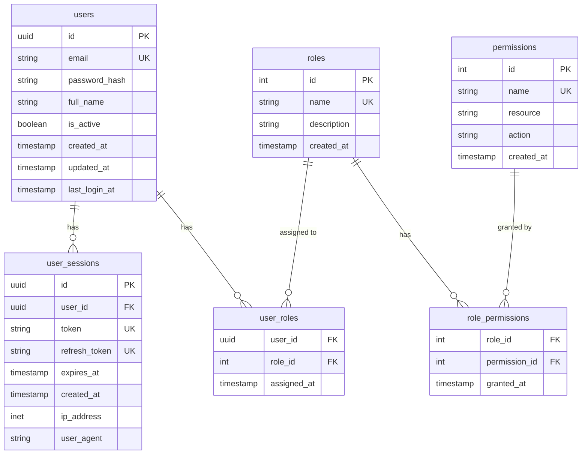
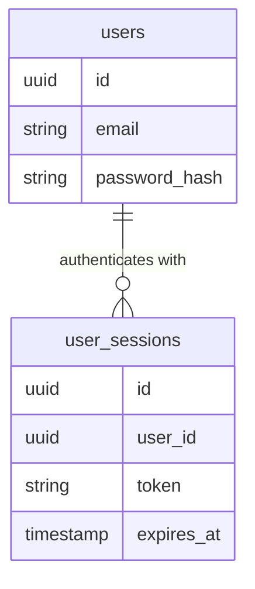
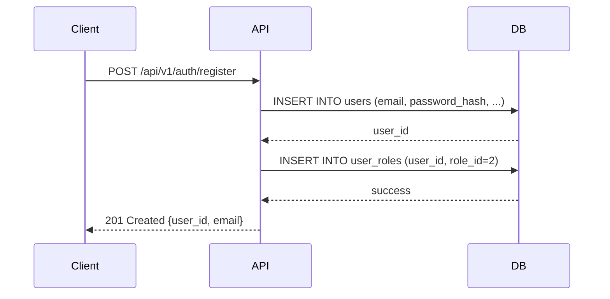
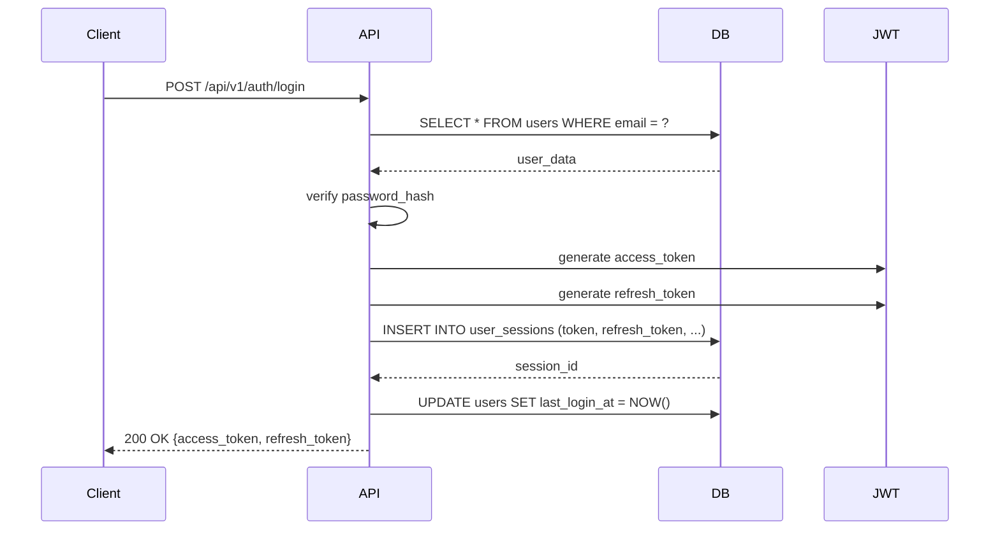

# データモデル文書 / Data Model Document

## 📋 メタデータ

| 項目 | 内容 |
|-----|------|
| プロジェクト名 | [プロジェクト名] |
| サービス名 | [マイクロサービス名] |
| データベース種類 | PostgreSQL / MySQL / MongoDB / etc. |
| 作成日 | YYYY-MM-DD |
| 作成者 | [名前] |
| レビュアー | [名前] |
| ステータス | draft / review / approved |
| Phase | Phase 5 (Detailed Design) |

---

## 🎯 概要

### データモデルの目的

**このデータモデルが解決する課題**:
```
[例]
ユーザー認証マイクロサービスにおけるユーザー情報、セッション情報、
ロール・権限管理のデータ構造を定義し、以下を実現する:
- 高速なユーザー認証
- セキュアなセッション管理
- 柔軟な権限管理
```

### スコープ

**対象範囲**:
- [ ] ユーザー情報管理
- [ ] セッション管理
- [ ] 権限・ロール管理
- [ ] [その他]

**対象外**:
- [ ] [スコープ外の項目]

---

## 🗺️ ER図（Entity-Relationship Diagram）

### 全体ER図



**図の説明**:
- **1対多関係**: `users` → `user_sessions`（1ユーザーが複数セッション保持可能）
- **多対多関係**: `users` ↔ `roles`（中間テーブル: `user_roles`）
- **多対多関係**: `roles` ↔ `permissions`（中間テーブル: `role_permissions`）

---

### コア機能のER図



---

## 📊 テーブル定義

### 1. users テーブル

#### 概要
ユーザーアカウント情報を管理する中核テーブル。

#### スキーマ定義

```sql
CREATE TABLE users (
    id                UUID PRIMARY KEY DEFAULT gen_random_uuid(),
    email             VARCHAR(255) NOT NULL UNIQUE,
    password_hash     VARCHAR(255) NOT NULL,
    full_name         VARCHAR(255) NOT NULL,
    is_active         BOOLEAN NOT NULL DEFAULT true,
    is_verified       BOOLEAN NOT NULL DEFAULT false,
    verification_token VARCHAR(255),
    created_at        TIMESTAMP NOT NULL DEFAULT CURRENT_TIMESTAMP,
    updated_at        TIMESTAMP NOT NULL DEFAULT CURRENT_TIMESTAMP,
    last_login_at     TIMESTAMP,
    
    -- インデックス
    CONSTRAINT users_email_check CHECK (email ~* '^[A-Za-z0-9._%+-]+@[A-Za-z0-9.-]+\.[A-Z|a-z]{2,}$')
);

-- インデックス
CREATE INDEX idx_users_email ON users(email);
CREATE INDEX idx_users_is_active ON users(is_active) WHERE is_active = true;
CREATE INDEX idx_users_created_at ON users(created_at DESC);

-- トリガー（updated_at自動更新）
CREATE TRIGGER update_users_updated_at
    BEFORE UPDATE ON users
    FOR EACH ROW
    EXECUTE FUNCTION update_updated_at_column();
```

#### フィールド詳細

| フィールド名 | 型 | NULL許可 | デフォルト | 説明 |
|------------|----|---------:|-----------|------|
| `id` | UUID | NO | gen_random_uuid() | 主キー、自動生成 |
| `email` | VARCHAR(255) | NO | - | メールアドレス（ユニーク制約） |
| `password_hash` | VARCHAR(255) | NO | - | bcryptハッシュ化パスワード |
| `full_name` | VARCHAR(255) | NO | - | ユーザーのフルネーム |
| `is_active` | BOOLEAN | NO | true | アカウント有効フラグ |
| `is_verified` | BOOLEAN | NO | false | メール認証完了フラグ |
| `verification_token` | VARCHAR(255) | YES | NULL | メール認証用トークン |
| `created_at` | TIMESTAMP | NO | CURRENT_TIMESTAMP | 作成日時 |
| `updated_at` | TIMESTAMP | NO | CURRENT_TIMESTAMP | 更新日時 |
| `last_login_at` | TIMESTAMP | YES | NULL | 最終ログイン日時 |

#### インデックス設計

| インデックス名 | カラム | タイプ | 目的 |
|-------------|--------|-------|------|
| `PRIMARY KEY` | `id` | B-tree | 主キー検索 |
| `idx_users_email` | `email` | B-tree | ログイン時の高速検索 |
| `idx_users_is_active` | `is_active` | Partial | アクティブユーザーのフィルタ |
| `idx_users_created_at` | `created_at DESC` | B-tree | 新規登録順のソート |

#### 制約

```yaml
unique_constraints:
  - email: "メールアドレスは一意である必要がある"

check_constraints:
  - email_format: "RFC 5322準拠のメールアドレス形式"

foreign_keys: []
```

#### サンプルデータ

```sql
INSERT INTO users (email, password_hash, full_name) VALUES
  ('john.doe@example.com', '$2b$12$KIXxqg...', 'John Doe'),
  ('jane.smith@example.com', '$2b$12$LJYyrh...', 'Jane Smith');
```

---

### 2. user_sessions テーブル

#### 概要
ユーザーのログインセッション情報を管理。JWT認証のトークン管理とリフレッシュトークンを保存。

#### スキーマ定義

```sql
CREATE TABLE user_sessions (
    id              UUID PRIMARY KEY DEFAULT gen_random_uuid(),
    user_id         UUID NOT NULL REFERENCES users(id) ON DELETE CASCADE,
    token           VARCHAR(512) NOT NULL UNIQUE,
    refresh_token   VARCHAR(512) NOT NULL UNIQUE,
    expires_at      TIMESTAMP NOT NULL,
    created_at      TIMESTAMP NOT NULL DEFAULT CURRENT_TIMESTAMP,
    ip_address      INET,
    user_agent      TEXT,
    is_revoked      BOOLEAN NOT NULL DEFAULT false,
    
    CONSTRAINT expires_at_future CHECK (expires_at > created_at)
);

-- インデックス
CREATE INDEX idx_sessions_user_id ON user_sessions(user_id);
CREATE INDEX idx_sessions_token ON user_sessions(token) WHERE is_revoked = false;
CREATE INDEX idx_sessions_expires_at ON user_sessions(expires_at);

-- 期限切れセッション自動削除（PostgreSQL cron extension使用）
-- DELETE FROM user_sessions WHERE expires_at < NOW() - INTERVAL '7 days';
```

#### フィールド詳細

| フィールド名 | 型 | NULL許可 | デフォルト | 説明 |
|------------|----|---------:|-----------|------|
| `id` | UUID | NO | gen_random_uuid() | 主キー |
| `user_id` | UUID | NO | - | ユーザーID（外部キー） |
| `token` | VARCHAR(512) | NO | - | JWTアクセストークン |
| `refresh_token` | VARCHAR(512) | NO | - | リフレッシュトークン |
| `expires_at` | TIMESTAMP | NO | - | トークン有効期限 |
| `created_at` | TIMESTAMP | NO | CURRENT_TIMESTAMP | セッション作成日時 |
| `ip_address` | INET | YES | NULL | ログイン元IPアドレス |
| `user_agent` | TEXT | YES | NULL | ユーザーエージェント |
| `is_revoked` | BOOLEAN | NO | false | トークン無効化フラグ |

#### インデックス設計

| インデックス名 | カラム | タイプ | 目的 |
|-------------|--------|-------|------|
| `PRIMARY KEY` | `id` | B-tree | 主キー検索 |
| `idx_sessions_user_id` | `user_id` | B-tree | ユーザー別セッション取得 |
| `idx_sessions_token` | `token` | Partial | 有効トークンの高速検索 |
| `idx_sessions_expires_at` | `expires_at` | B-tree | 期限切れセッションのクリーンアップ |

---

### 3. roles テーブル

#### 概要
ユーザーロール（役割）を定義するマスターテーブル。

#### スキーマ定義

```sql
CREATE TABLE roles (
    id          SERIAL PRIMARY KEY,
    name        VARCHAR(50) NOT NULL UNIQUE,
    description TEXT,
    created_at  TIMESTAMP NOT NULL DEFAULT CURRENT_TIMESTAMP
);

-- 初期データ
INSERT INTO roles (name, description) VALUES
  ('admin', '管理者: すべての権限を持つ'),
  ('user', '一般ユーザー: 基本的な機能のみ使用可能'),
  ('moderator', 'モデレーター: コンテンツ管理権限を持つ');
```

#### フィールド詳細

| フィールド名 | 型 | NULL許可 | デフォルト | 説明 |
|------------|----|---------:|-----------|------|
| `id` | SERIAL | NO | auto | 主キー |
| `name` | VARCHAR(50) | NO | - | ロール名（ユニーク） |
| `description` | TEXT | YES | NULL | ロールの説明 |
| `created_at` | TIMESTAMP | NO | CURRENT_TIMESTAMP | 作成日時 |

---

### 4. permissions テーブル

#### 概要
システムの権限（permission）を定義するマスターテーブル。リソースベースアクセス制御（RBAC）を実現。

#### スキーマ定義

```sql
CREATE TABLE permissions (
    id          SERIAL PRIMARY KEY,
    name        VARCHAR(100) NOT NULL UNIQUE,
    resource    VARCHAR(50) NOT NULL,
    action      VARCHAR(20) NOT NULL,
    description TEXT,
    created_at  TIMESTAMP NOT NULL DEFAULT CURRENT_TIMESTAMP,
    
    CONSTRAINT unique_resource_action UNIQUE (resource, action)
);

-- 初期データ
INSERT INTO permissions (name, resource, action, description) VALUES
  ('users:read', 'users', 'read', 'ユーザー情報の閲覧'),
  ('users:write', 'users', 'write', 'ユーザー情報の編集'),
  ('users:delete', 'users', 'delete', 'ユーザーの削除'),
  ('posts:read', 'posts', 'read', '投稿の閲覧'),
  ('posts:write', 'posts', 'write', '投稿の作成・編集'),
  ('posts:delete', 'posts', 'delete', '投稿の削除');
```

---

### 5. user_roles テーブル（中間テーブル）

#### 概要
ユーザーとロールの多対多関係を管理。

#### スキーマ定義

```sql
CREATE TABLE user_roles (
    user_id     UUID NOT NULL REFERENCES users(id) ON DELETE CASCADE,
    role_id     INT NOT NULL REFERENCES roles(id) ON DELETE CASCADE,
    assigned_at TIMESTAMP NOT NULL DEFAULT CURRENT_TIMESTAMP,
    
    PRIMARY KEY (user_id, role_id)
);

CREATE INDEX idx_user_roles_user_id ON user_roles(user_id);
CREATE INDEX idx_user_roles_role_id ON user_roles(role_id);
```

---

### 6. role_permissions テーブル（中間テーブル）

#### 概要
ロールと権限の多対多関係を管理。

#### スキーマ定義

```sql
CREATE TABLE role_permissions (
    role_id       INT NOT NULL REFERENCES roles(id) ON DELETE CASCADE,
    permission_id INT NOT NULL REFERENCES permissions(id) ON DELETE CASCADE,
    granted_at    TIMESTAMP NOT NULL DEFAULT CURRENT_TIMESTAMP,
    
    PRIMARY KEY (role_id, permission_id)
);

CREATE INDEX idx_role_permissions_role_id ON role_permissions(role_id);

-- 初期データ（adminロールにすべての権限を付与）
INSERT INTO role_permissions (role_id, permission_id)
SELECT 1, id FROM permissions;
```

---

## 🔄 データフロー

### ユーザー登録フロー



---

### ログインフロー



---

## 📈 パフォーマンス設計

### インデックス戦略

#### 主要クエリとインデックス

| クエリシナリオ | 頻度 | 対象テーブル | 使用インデックス | 期待性能 |
|------------|------|------------|----------------|---------|
| ログイン（メールでユーザー検索） | 高 | `users` | `idx_users_email` | < 10ms |
| トークン検証 | 非常に高 | `user_sessions` | `idx_sessions_token` | < 5ms |
| ユーザー別セッション取得 | 中 | `user_sessions` | `idx_sessions_user_id` | < 20ms |
| 権限チェック | 高 | `user_roles`, `role_permissions` | 複合インデックス | < 15ms |

---

### クエリ最適化

#### 1. ユーザー権限チェッククエリ

**非効率なクエリ**:
```sql
-- N+1問題が発生
SELECT * FROM users WHERE id = ?;
SELECT * FROM user_roles WHERE user_id = ?;
SELECT * FROM roles WHERE id IN (...);
SELECT * FROM role_permissions WHERE role_id IN (...);
```

**最適化後**:
```sql
-- 1回のJOINで取得
SELECT 
    u.id,
    u.email,
    r.name AS role_name,
    p.name AS permission_name
FROM users u
JOIN user_roles ur ON u.id = ur.user_id
JOIN roles r ON ur.role_id = r.id
JOIN role_permissions rp ON r.id = rp.role_id
JOIN permissions p ON rp.permission_id = p.id
WHERE u.id = ?;
```

---

## 🔐 セキュリティ設計

### データ暗号化

```yaml
at_rest:
  password_hash: "bcrypt (cost factor: 12)"
  sensitive_pii: "AES-256 暗号化（実装予定）"

in_transit:
  database_connection: "TLS 1.3"
  api_communication: "HTTPS only"
```

---

### アクセス制御

```yaml
database_user_roles:
  app_read:
    permissions: "SELECT on users, user_sessions, roles, permissions"
    usage: "読み取り専用API用"
  
  app_write:
    permissions: "SELECT, INSERT, UPDATE on users, user_sessions, user_roles"
    usage: "認証・ユーザー管理API用"
  
  app_admin:
    permissions: "ALL on all tables"
    usage: "管理者操作用（限定的に使用）"
```

---

## 🗄️ マイグレーション履歴

### マイグレーション管理ツール
- ツール名: Flyway / Liquibase / Alembic
- マイグレーションファイル配置: `db/migrations/`

---

### マイグレーション一覧

| バージョン | 日付 | 作成者 | 説明 | スクリプト |
|----------|------|--------|------|-----------|
| V001 | 2025-11-01 | John Doe | 初期スキーマ作成 | `V001__create_initial_schema.sql` |
| V002 | 2025-11-05 | Jane Smith | user_sessions追加 | `V002__add_user_sessions.sql` |
| V003 | 2025-11-10 | John Doe | RBAC実装 | `V003__implement_rbac.sql` |

---

### マイグレーションスクリプト例

#### V001__create_initial_schema.sql

```sql
-- V001: 初期スキーマ作成
-- 作成日: 2025-11-01
-- 作成者: John Doe

-- users テーブル
CREATE TABLE users (
    id                UUID PRIMARY KEY DEFAULT gen_random_uuid(),
    email             VARCHAR(255) NOT NULL UNIQUE,
    password_hash     VARCHAR(255) NOT NULL,
    full_name         VARCHAR(255) NOT NULL,
    is_active         BOOLEAN NOT NULL DEFAULT true,
    created_at        TIMESTAMP NOT NULL DEFAULT CURRENT_TIMESTAMP,
    updated_at        TIMESTAMP NOT NULL DEFAULT CURRENT_TIMESTAMP
);

CREATE INDEX idx_users_email ON users(email);
CREATE INDEX idx_users_is_active ON users(is_active) WHERE is_active = true;
```

---

## 📊 データ容量見積もり

### 予測データ量（1年後）

| テーブル | 想定レコード数 | 1レコードサイズ | 合計容量 | インデックス容量 | 総容量 |
|---------|-------------|--------------|---------|---------------|--------|
| `users` | 100,000 | 500 bytes | 50 MB | 15 MB | 65 MB |
| `user_sessions` | 500,000 | 800 bytes | 400 MB | 120 MB | 520 MB |
| `roles` | 10 | 200 bytes | 2 KB | 1 KB | 3 KB |
| `permissions` | 100 | 300 bytes | 30 KB | 10 KB | 40 KB |
| `user_roles` | 150,000 | 100 bytes | 15 MB | 5 MB | 20 MB |
| `role_permissions` | 500 | 50 bytes | 25 KB | 10 KB | 35 KB |
| **合計** | - | - | **465 MB** | **140 MB** | **605 MB** |

---

### ストレージ計画

```yaml
database_size:
  current: "100 MB"
  projected_1_year: "605 MB"
  projected_3_years: "2 GB"

backup_strategy:
  full_backup: "毎日 2:00 AM"
  incremental_backup: "6時間ごと"
  retention: "30日間"
```

---

## 🔧 運用設計

### バックアップ戦略

```yaml
backup:
  frequency:
    full: "毎日 2:00 AM (JST)"
    incremental: "6時間ごと"
  
  retention:
    daily: "30日間"
    weekly: "12週間"
    monthly: "12ヶ月"
  
  location:
    primary: "AWS S3 (ap-northeast-1)"
    secondary: "AWS S3 (us-west-2) - クロスリージョン"
```

---

### メンテナンス計画

```yaml
regular_maintenance:
  vacuum:
    frequency: "毎週日曜 3:00 AM"
    command: "VACUUM ANALYZE;"
  
  reindex:
    frequency: "毎月第1日曜 3:00 AM"
    command: "REINDEX DATABASE auth_service;"
  
  expired_session_cleanup:
    frequency: "毎日 4:00 AM"
    command: "DELETE FROM user_sessions WHERE expires_at < NOW() - INTERVAL '7 days';"
```

---

## 📝 制約事項と将来の改善

### 現在の制約

1. **スケーラビリティ**
   - 単一DBインスタンス構成
   - 100万ユーザー超でのパフォーマンス未検証

2. **データ削除**
   - 論理削除未実装（物理削除のみ）
   - GDPR対応の完全削除機能が必要

3. **監査ログ**
   - 変更履歴の記録なし
   - コンプライアンス要件に対応できない可能性

---

### 将来の改善計画

```yaml
improvements:
  phase_1:
    - 論理削除（is_deleted フラグ）の実装
    - 監査ログテーブル（audit_logs）の追加
  
  phase_2:
    - Read Replica の導入
    - キャッシュレイヤー（Redis）の追加
  
  phase_3:
    - シャーディング戦略の検討
    - NoSQL併用（セッション情報をRedisに移行）
```

---

## ✅ レビューチェックリスト

```yaml
design_review:
  - [ ] ER図が実装と一致している
  - [ ] すべてのテーブルに主キーが定義されている
  - [ ] 外部キー制約が正しく設定されている
  - [ ] インデックスが適切に設計されている
  - [ ] 主要クエリのパフォーマンスが検証されている

security_review:
  - [ ] パスワードが適切にハッシュ化されている
  - [ ] 個人情報の暗号化が検討されている
  - [ ] アクセス制御が適切に設定されている
  - [ ] SQLインジェクション対策が実装されている

operational_review:
  - [ ] バックアップ戦略が定義されている
  - [ ] マイグレーション履歴が記録されている
  - [ ] データ容量見積もりが妥当である
  - [ ] メンテナンス計画が定義されている
```

---

**このテンプレートを使用して、Phase 5でのデータモデル文書化を効率的に進めましょう。**
