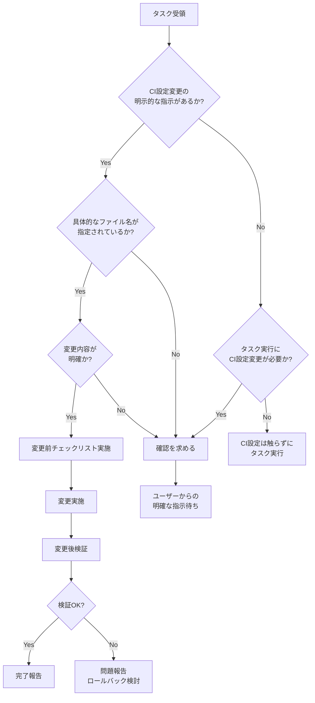

# AI による CI設定変更ポリシー

## 📘 目的

このドキュメントは、AIエージェント（Devin等）によるCI/CD設定ファイルの変更に関する明確なポリシーを定義し、意図しない変更や不適切な修正を防止することを目的としています。

---

## 🎯 基本原則

```
指示がない限り、CI設定は「触らない」
```

### 原則の背景

CI/CD設定は以下の理由により、特別な注意が必要です:

1. **全体への影響**: CI設定の変更は全開発者・全ブランチに影響
2. **セキュリティリスク**: 誤った変更がセキュリティホールに直結
3. **安定性**: CI/CDは開発プロセスの基盤であり、不安定化は許容できない
4. **トレーサビリティ**: CI設定変更は意図的であるべきで、偶発的変更は危険

---

## 📁 対象ファイル

以下のファイル・ディレクトリは**明示的な指示がない限り変更禁止**:

### CI/CD設定ファイル

| プラットフォーム | ファイル/ディレクトリ |
|--------------|-------------------|
| **GitHub Actions** | `.github/workflows/*.yml`<br>`.github/workflows/*.yaml` |
| **GitLab CI** | `.gitlab-ci.yml`<br>`.gitlab/ci/*.yml` |
| **Jenkins** | `Jenkinsfile`<br>`Jenkinsfile.*` |
| **Azure Pipelines** | `azure-pipelines.yml`<br>`azure-pipelines/*.yml` |
| **Bitbucket Pipelines** | `bitbucket-pipelines.yml` |
| **CircleCI** | `.circleci/config.yml` |
| **Travis CI** | `.travis.yml` |
| **Drone CI** | `.drone.yml` |
| **その他** | プロジェクト固有のCI設定ファイル |

### CI関連スクリプト・設定

| 種類 | ファイル例 |
|-----|----------|
| **ビルドスクリプト** | `build.sh`, `build.gradle`, `Makefile`, `build.xml` |
| **テスト実行スクリプト** | `run-tests.sh`, `test.sh`, `run-e2e.sh` |
| **デプロイメントスクリプト** | `deploy.sh`, `release.sh`, `publish.sh` |
| **Docker関連** | `Dockerfile`, `docker-compose.yml`, `docker-compose.*.yml`, `.dockerignore` |
| **CI用設定** | `ci/`, `scripts/ci/`, `.ci/` 配下のファイル |
| **環境セットアップ** | `setup-test-db.sh`, `init-test-env.sh` |

---

## 🚫 変更禁止の詳細

### 1. CI設定ファイル全般

#### トリガー設定
```yaml
# 変更禁止（指示がない限り）
on:
  push:
    branches: [main, develop]
  pull_request:
    branches: [main]
  schedule:
    - cron: '0 2 * * *'
```

**禁止される変更例**:
- ✗ ブランチフィルターの追加・削除
- ✗ トリガーイベントの変更（push → workflow_dispatch等）
- ✗ パスフィルターの追加・削除
- ✗ スケジュール設定の変更

#### 環境変数
```yaml
# 変更禁止（指示がない限り）
env:
  NODE_ENV: production
  API_BASE_URL: ${{ secrets.API_URL }}
```

**禁止される変更例**:
- ✗ 環境変数の追加・削除
- ✗ 環境変数値の変更
- ✗ シークレット参照方法の変更

#### ジョブ設定
```yaml
# 変更禁止（指示がない限り）
jobs:
  test:
    runs-on: ubuntu-latest
    timeout-minutes: 30
    strategy:
      matrix:
        node-version: [16, 18, 20]
```

**禁止される変更例**:
- ✗ ランナー環境の変更（ubuntu-latest → ubuntu-20.04等）
- ✗ タイムアウト値の変更
- ✗ マトリックス戦略の変更
- ✗ ジョブ依存関係（needs）の変更

#### セキュリティチェック
```yaml
# 変更禁止（指示がない限り）
- name: Security Scan
  run: |
    npm audit
    snyk test
```

**禁止される変更例**:
- ✗ セキュリティスキャンステップの削除
- ✗ セキュリティツールの無効化
- ✗ 脆弱性閾値の緩和

### 2. ビルド・デプロイスクリプト

```bash
# build.sh - 変更禁止（指示がない限り）
#!/bin/bash
set -e

npm ci
npm run lint
npm run test
npm run build
```

**禁止される変更例**:
- ✗ ステップの削除（lint, testの省略等）
- ✗ エラーハンドリングの削除（set -e の削除等）
- ✗ 成果物の出力先変更

### 3. Docker関連ファイル

```dockerfile
# Dockerfile - 変更禁止（指示がない限り）
FROM node:18-alpine
WORKDIR /app
COPY package*.json ./
RUN npm ci --only=production
```

**禁止される変更例**:
- ✗ ベースイメージの変更
- ✗ セキュリティ関連の設定変更
- ✗ ビルドステージの削除

---

## ✅ 変更可能な条件

### 明示的な指示の条件

以下の**すべて**を満たす場合のみ、CI設定の変更が許可されます:

1. ✓ **具体的なファイル名の指定**がある
2. ✓ **変更内容が明確**に示されている
3. ✓ **変更理由**が理解できる

### ✓ 許可される指示の例

#### 例1: 具体的なファイルと変更内容
```
✓ "GitHub Actionsのtest.ymlで、Node.jsのバージョンを16から18に更新してください"

理由:
- ファイル名が明確（test.yml）
- 変更内容が明確（Node.jsバージョン: 16→18）
- 変更箇所が限定的
```

#### 例2: CI設定の追加
```
✓ ".github/workflows/に新しいデプロイワークフローdeploy-staging.ymlを追加してください。
   トリガーはdevelopブランチへのpush時、デプロイ先はステージング環境です"

理由:
- 新規ファイル作成（既存設定への影響なし）
- トリガー条件が明確
- 目的が明確
```

#### 例3: 特定の設定変更
```
✓ "Jenkinsfileのタイムアウトを30分から60分に延長してください"

理由:
- ファイル名が明確
- 変更パラメータが明確（timeout: 30→60）
- 変更箇所が限定的
```

#### 例4: CI設定の最適化（明示的）
```
✓ "CI/CDパイプラインのキャッシュ設定を最適化してください。
   対象は.github/workflows/test.ymlのnpm依存関係キャッシュです"

理由:
- ファイル名が明確
- 最適化対象が明確（npmキャッシュ）
- CI設定変更が指示に含まれている
```

### ✗ 不十分な指示の例

#### 例1: 曖昧な最適化依頼
```
✗ "ビルドを高速化してください"

問題点:
- CI設定変更の指示なし
- 変更対象が不明確
- 手段が示されていない

正しい対応:
→ コードレベルの最適化のみ実施
→ CI設定の変更が必要な場合は提案して確認を求める
```

#### 例2: 一般的なエラー修正
```
✗ "CIが失敗しているので修正してください"

問題点:
- CI設定自体の問題かコードの問題か不明
- 変更箇所が特定されていない

正しい対応:
→ まずエラー原因を分析
→ コードの問題ならコード修正
→ CI設定の問題なら状況を報告して指示を求める
```

#### 例3: 範囲が広すぎる指示
```
✗ "テストを改善してください"

問題点:
- テストコードの改善かCI設定の改善か不明
- 変更範囲が不明確

正しい対応:
→ テストコード自体の改善のみ実施
→ CI設定は触らない
```

#### 例4: 目的のみの指示
```
✗ "デプロイの準備をしてください"

問題点:
- CI/CD設定の変更を含むか不明
- 具体的な作業内容が不明

正しい対応:
→ コード側の準備のみ実施
→ CI/CD設定が必要な場合は確認を求める
```

---

## 📋 変更時のチェックリスト

CI設定変更の**明示的な指示がある場合**のみ、以下のチェックリストを使用:

### Phase 1: 変更前確認

- [ ] **指示の明確性確認**
  - [ ] 具体的なファイル名が指定されているか
  - [ ] 変更内容が明確に示されているか
  - [ ] 変更理由が理解できるか

- [ ] **影響範囲分析**
  - [ ] 他のブランチへの影響を確認
  - [ ] 他の開発者への影響を確認
  - [ ] 本番環境への影響を確認
  - [ ] 他のワークフロー・ジョブへの影響を確認

- [ ] **バックアップ確認**
  - [ ] Git管理されているか確認
  - [ ] 変更前の設定を記録

### Phase 2: 変更実施

- [ ] **変更範囲の遵守**
  - [ ] 指示された箇所**のみ**を変更
  - [ ] 関連のない箇所は触らない
  - [ ] 既存の重要な設定を維持

- [ ] **セキュリティチェック維持**
  - [ ] セキュリティスキャンステップを維持
  - [ ] 脆弱性チェックを維持
  - [ ] シークレット管理を維持

- [ ] **品質ゲート維持**
  - [ ] テストステップを維持
  - [ ] リンター・型チェックを維持
  - [ ] カバレッジチェックを維持

- [ ] **ドキュメント更新**
  - [ ] コミットメッセージに変更理由を明記
  - [ ] PR説明にCI設定変更を明記
  - [ ] 関連ドキュメントを更新（必要に応じて）

### Phase 3: 変更後検証

- [ ] **動作確認**
  - [ ] CI/CDパイプラインが正常に実行されるか
  - [ ] すべてのジョブが完了するか
  - [ ] エラー・警告が出ていないか

- [ ] **必須チェックの確認**
  - [ ] すべての必須ステータスチェックがパスするか
  - [ ] セキュリティチェックが正常に動作するか
  - [ ] テストが正常に実行されるか

- [ ] **パフォーマンス測定**
  - [ ] 実行時間への影響を測定
  - [ ] リソース使用量を確認
  - [ ] コスト影響を確認（該当する場合）

- [ ] **環境別確認**
  - [ ] 開発環境での動作確認
  - [ ] ステージング環境での動作確認（該当する場合）
  - [ ] 本番環境への影響評価

- [ ] **ロールバック準備**
  - [ ] ロールバック手順を確認
  - [ ] 問題発生時の対応手順を確認

---

## 🔍 判断フローチャート



---

## 📝 実践例

### ケース1: テスト高速化の依頼

#### 依頼内容
```
"テストを高速化してください"
```

#### 判断プロセス
1. **CI設定変更の明示的な指示なし** → CI設定は触らない
2. タスクの範囲を確認:
   - ✓ テストコードの最適化
   - ✓ 不要なテストケースの特定
   - ✗ CI設定のキャッシュ変更
   - ✗ CI並列度の変更

#### 実施内容
```markdown
✓ 実施可能:
- テストケースの冗長な処理を最適化
- データベース初期化処理の効率化
- モックの適切な使用

✗ 実施不可（指示がないため）:
- .github/workflows/test.ymlのキャッシュ設定変更
- テストの並列実行設定変更
- タイムアウト設定の変更

提案:
もしCI設定の最適化も含める場合は、以下のような指示が必要です:
"テストを高速化してください。CI設定のキャッシュ最適化も含めてください。"
```

---

### ケース2: ビルドエラー修正の依頼

#### 依頼内容
```
"CIでビルドエラーが発生しています。修正してください"
```

#### 判断プロセス
1. **CI設定変更の指示なし** → まずはエラー原因を分析
2. エラーログを確認:
   - コンパイルエラー → コード修正で対応
   - 依存関係エラー → package.json修正
   - CI設定エラー → 状況を報告

#### 実施内容
```markdown
エラー分析:
- TypeScriptのコンパイルエラーを確認
- src/utils/helper.ts:45でのtype error

✓ 実施:
- コードの型エラーを修正
- 関連するテストケースを更新

✗ 実施しない:
- CI設定ファイルの変更
- ビルドスクリプトの変更

もしCI設定の問題と判明した場合:
"CI設定に問題があると思われます。
 .github/workflows/build.ymlの○○の設定が△△になっているためエラーが発生しています。
 □□に変更することで解決できます。変更してよろしいでしょうか?"
```

---

### ケース3: Node.jsバージョン更新の明示的指示

#### 依頼内容
```
".github/workflows/test.ymlのNode.jsバージョンを16から18に更新してください"
```

#### 判断プロセス
1. **CI設定変更の明示的な指示あり** ✓
2. **ファイル名が明確** ✓
3. **変更内容が明確** ✓
4. → 変更可能

#### 実施内容
```markdown
変更前確認:
- ファイル: .github/workflows/test.yml
- 変更箇所: node-version: 16 → 18
- 影響範囲: テストワークフローのみ

変更実施:
- .github/workflows/test.yml を更新
- matrix.node-version: [16] → [18]

変更後検証:
- テストワークフローが正常実行されることを確認
- すべてのテストがパスすることを確認
- 実行時間の変化を報告

完了報告:
".github/workflows/test.ymlのNode.jsバージョンを18に更新しました。
 テストは正常に完了し、実行時間は30秒から28秒に短縮されました。"
```

---

### ケース4: CI最適化の曖昧な依頼

#### 依頼内容
```
"CI/CDを最適化してください"
```

#### 判断プロセス
1. **指示が曖昧** → 確認が必要
2. 最適化の範囲が不明:
   - CI設定の変更を含むか?
   - どの部分を最適化するか?
   - 何を基準に最適化するか（速度?コスト?）

#### 対応
```markdown
確認事項:
CI/CDの最適化について、以下を確認させてください:

1. 最適化の目的:
   - ビルド時間の短縮
   - コストの削減
   - 信頼性の向上
   
2. 対象範囲:
   - CI設定ファイルの変更を含みますか?
   - ビルドスクリプトの変更を含みますか?
   - テスト戦略の変更を含みますか?

3. 現在の課題:
   - どの部分に問題を感じていますか?
   - 具体的なボトルネックはありますか?

これらを教えていただければ、適切な最適化を実施できます。
```

---

## 🎯 ベストプラクティス

### AIエージェント側

1. **デフォルトは "触らない"**
   - CI設定は明示的指示がない限り変更しない
   - 不明な場合は確認を求める

2. **範囲の厳守**
   - 指示された箇所のみを変更
   - "ついでに" 他の箇所を変更しない

3. **影響の報告**
   - 変更による影響を明確に報告
   - リスクがある場合は事前に伝える

4. **提案の明確化**
   - CI設定変更が必要な場合は具体的に提案
   - 変更による利点・リスクを説明

### 人間（依頼者）側

1. **明示的な指示**
   - CI設定変更が必要な場合は明確に指示
   - ファイル名・変更内容を具体的に

2. **目的の共有**
   - なぜ変更が必要かを伝える
   - 期待する結果を明確に

3. **レビューの実施**
   - CI設定変更は必ずレビュー
   - 影響範囲を確認

---

## 🚨 例外ケース

### 緊急時の対応

#### ケース: CI が完全に停止している
```
状況: すべてのCI/CDパイプラインが失敗している
原因: CI設定ファイルの構文エラー

対応:
1. 緊急性を判断
2. 最小限の修正で復旧
3. 修正内容を詳細に報告
4. 事後に正式な変更手続きを実施
```

**注意**: 緊急時でも、以下は遵守:
- 変更内容の記録
- 変更理由の明記
- 事後報告の実施

---

## 📚 関連ドキュメント

- [AIタスク実行禁止事項（詳細版）](./ai-task-prohibitions.md)
- [AIタスク実行禁止事項チェックリスト](./ai-task-prohibitions-checklist.md)
- [CI/CD Pipeline Standards](../03-development-process/ci-cd-pipeline.md)
- [AI-PRE-WORK-CHECKLIST](../00-guides/AI-PRE-WORK-CHECKLIST.md)

---

## 📝 更新履歴

| バージョン | 日付 | 変更内容 |
|---------|------|---------|
| 1.0.0 | 2025-11-10 | 初版作成 |

---

## ❓ FAQ

### Q1: "コードを改善してください" という指示でCI設定を変更できますか?
**A**: いいえ。CI設定の明示的な指示がない限り変更できません。コード改善はソースコード側のみを対象とします。

### Q2: CI設定変更が明らかに必要な場合はどうすればいいですか?
**A**: 変更が必要な理由と具体的な変更内容を提案し、確認を求めてください。

### Q3: 新機能追加で新しいCI設定が必要な場合は?
**A**: 新機能の実装指示に "CI設定を含む" との明示がない限り、CI設定は作成せず、必要性を報告してください。

### Q4: CI設定の誤りを発見した場合は?
**A**: 問題を報告し、修正案を提示して、指示を待ってください。

### Q5: 複数のファイルにまたがるCI設定変更は?
**A**: 各ファイルが明示的に指示されている場合のみ変更可能です。

---

*このポリシーはCI/CD設定の安定性とセキュリティを維持するための重要なガイドラインです。不明点がある場合は必ず確認を求めてください。*
