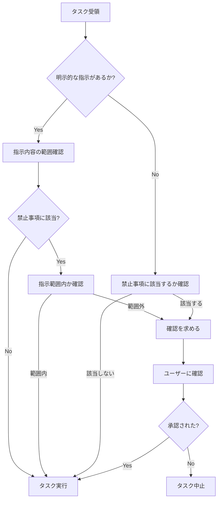

# AI タスク実行における禁止事項ガイドライン

## 📘 目的

このドキュメントは、AIエージェント（Devin等）に作業を依頼する際に、**触ってはいけない領域**と**実行してはいけない操作**を明確化し、想定外の修正やデグレードを防止することを目的としています。

## 🎯 基本原則

```
指示がない限り、以下の領域・操作は「触らない」が基本原則
```

### 適用範囲
- すべてのAIエージェントによる自動作業
- コード生成・修正タスク
- 設定ファイルの変更
- ドキュメント更新
- CI/CD設定変更
- データベース操作

### 例外処理
明示的な指示がある場合のみ、該当する禁止事項を解除できます。
その際も、変更範囲は指示内容に限定されます。

---

## 🚨 高リスク領域の3条件ゲート

以下の高リスク領域に対する変更は、**3条件ゲート**を通過した場合のみ許可されます。

### 対象となる高リスク領域

| 領域 | 具体例 | リスク |
|------|--------|--------|
| **CI/CD設定** | `.github/workflows/*.yml`, `Jenkinsfile`, `Dockerfile` | 全開発者・全ブランチへの影響、セキュリティホール |
| **認証・認可** | ログイン処理、権限チェック、トークン管理、セッション管理 | 不正アクセス、情報漏洩 |
| **データベーススキーマ** | 既存テーブルの変更、カラム削除、制約変更 | データ損失、サービス停止 |
| **個人情報処理** | PII取り扱い、ログ出力、データマスキング | プライバシー侵害、法令違反 |
| **暗号化・セキュリティ** | 暗号化アルゴリズム、鍵管理、ハッシュ化 | セキュリティ脆弱性 |
| **本番環境設定** | `.env.production`, 本番用設定ファイル | 本番障害、データ損失 |

### 3条件ゲート

高リスク領域の変更は、以下の**すべて**を満たす場合のみ許可されます:

```
┌─────────────────────────────────────────────────────────────┐
│  3条件ゲート（すべてYesで通過）                              │
├─────────────────────────────────────────────────────────────┤
│  1. 具体的なファイル名/対象が指定されているか？              │
│     例: "auth/login.ts の認証ロジック"                      │
│                                                             │
│  2. 変更内容が明確に示されているか？                        │
│     例: "パスワードハッシュをbcryptからargon2に変更"        │
│                                                             │
│  3. 変更理由が理解できるか？                                │
│     例: "セキュリティ監査での指摘対応"                      │
└─────────────────────────────────────────────────────────────┘

いずれか1つでもNoの場合 → 確認を求める（変更しない）
```

### 判断フロー

```
タスク受領
    ↓
高リスク領域に該当するか？
    ↓ Yes
3条件すべて満たすか？
    ├─ Yes → 変更前チェックリスト実施 → 変更実施 → 変更後検証
    └─ No  → 確認を求める（変更しない）
```

### 領域別の追加要件

| 領域 | 追加要件 |
|------|----------|
| **CI/CD設定** | [ai-ci-modification-policy.md](./ai-ci-modification-policy.md) の詳細手順に従う |
| **認証・認可** | セキュリティチームへのエスカレーション必須 |
| **データベーススキーマ** | DBAへのエスカレーション必須、ロールバック計画必須 |
| **個人情報処理** | プライバシー影響評価、法務確認が必要な場合あり |
| **暗号化・セキュリティ** | セキュリティチームへのエスカレーション必須 |
| **本番環境設定** | 本番環境への変更は原則禁止、緊急時のみ例外 |

> **📌 参照**: CI/CD設定変更の詳細な手順は [ai-ci-modification-policy.md](./ai-ci-modification-policy.md) を参照してください。

---

## 📋 1. コーディング・実装タスク

### 🚫 絶対に触ってはいけないもの

#### 環境設定ファイル
- ✗ **本番環境の設定ファイル**
  - `.env.production`
  - `production.yml`
  - `config/production/*`
  - 本番用の環境変数設定

#### セキュリティ関連
- ✗ **認証・認可の中核ロジック**
  - 既存の認証フロー（ログイン・ログアウト処理）
  - 権限チェック機構
  - トークン生成・検証ロジック
  - セッション管理機構

- ✗ **暗号化・セキュリティライブラリ設定**
  - 暗号化アルゴリズムの選定・設定
  - 鍵管理の実装
  - ハッシュ化処理

#### データベース
- ✗ **データベーススキーマの既存テーブル**
  - マイグレーションなしでの直接変更
  - カラムの削除
  - テーブル定義の破壊的変更

#### 組織管理
- ✗ **他チームが管理しているコード領域**
  - 明示的に指示されない限り
  - CODEOWNERS で指定された他チーム管轄
  
- ✗ **ライセンスヘッダー・著作権表記**
  - ファイル先頭のライセンス情報
  - 著作権年の変更

### 🚫 禁止される変更

#### API・インターフェース
- ✗ **既存APIのシグネチャ変更**
  - パラメータの追加・削除・順序変更
  - 戻り値の型変更
  - エンドポイントURLの変更
  - 後方互換性を破壊する変更

#### グローバル設定
- ✗ **システム全体に影響する設定の変更**
  - タイムゾーン設定
  - 文字エンコーディング
  - ロケール設定
  - グローバル定数の変更

#### 依存関係
- ✗ **依存関係のメジャーバージョンアップ**
  - 明示的指示がない限り
  - Breaking changes を含むアップデート
  - `package.json`, `requirements.txt`, `pom.xml` 等のメジャーバージョン変更

#### エラーハンドリング・ログ
- ✗ **エラーハンドリングの削除・簡略化**
  - try-catch ブロックの削除
  - エラーチェックの省略
  - 例外の握りつぶし

- ✗ **ログ出力の削除**
  - 既存のログ文の消去
  - ログレベルの不適切な変更
  - 監視に使用されているログの削除

#### トランザクション
- ✗ **トランザクション境界の変更**
  - @Transactional の削除・追加
  - BEGIN/COMMIT の位置変更
  - トランザクション分離レベルの変更

### 🚫 コーディングスタンダード違反

- ✗ **01-coding-standardsに定義されたルールの無視**
  - 命名規則の違反
  - コーディングスタイルの逸脱
  - アーキテクチャパターンの無視

- ✗ **フォーマッター設定の上書き**
  - `.prettierrc`, `.eslintrc` の変更
  - `pyproject.toml` [tool.black] セクションの変更
  - `.editorconfig` の変更
  - チーム共通のフォーマット設定

- ✗ **命名規則の独自解釈**
  - 確立された命名パターンの無視
  - 略語の独自使用

---

## 📐 2. アーキテクチャ・設計タスク

### 🚫 変更禁止領域

#### アーキテクチャパターン
- ✗ **確立されたアーキテクチャパターンの破壊**
  - レイヤードアーキテクチャの階層違反
  - DDD境界コンテキストの侵害
  - ヘキサゴナルアーキテクチャのポート・アダプター境界の破壊
  - クリーンアーキテクチャの依存関係ルール違反

#### モジュール設計
- ✗ **モジュール間の依存関係の逆転**
  - 下位層から上位層への依存追加
  - 循環依存の導入

- ✗ **既存のインターフェース定義の変更**
  - 公開インターフェースの破壊
  - 契約（Contract）違反
  - プロトコル定義の変更

#### システム境界
- ✗ **システム境界の再定義**
  - マイクロサービス境界の変更
  - バウンデッドコンテキストの統合・分割
  - サービス間通信プロトコルの変更

### 🚫 禁止される判断

- ✗ **新技術スタックの独断導入**
  - 05-technology-stackに記載がないもの
  - 評価・承認プロセスを経ていない技術
  - チームの合意がない技術選定

- ✗ **アーキテクチャパターンの混在**
  - CQRSとトランザクションスクリプトの混在
  - 複数のアーキテクチャスタイルの無秩序な併用

- ✗ **ADR (Architecture Decision Records)に反する決定**
  - 既に決定された設計方針の無視
  - 過去の意思決定の上書き

---

## 🗄️ 3. データベース・SQLタスク

### 🚫 絶対禁止

#### データ操作
- ✗ **本番データへの直接アクセス・変更**
  - 本番データベースへの接続
  - 本番データの更新・削除
  - 本番環境でのデータマイグレーション直接実行

#### スキーマ変更
- ✗ **既存テーブルのカラム削除**
  - マイグレーション計画なしでの削除
  - 段階的移行手順なしでの削除

- ✗ **外部キー制約の削除**
  - 参照整合性制約の削除
  - リレーションシップの破壊

- ✗ **インデックスの無断削除**
  - パフォーマンスに影響するインデックスの削除
  - ユニーク制約を持つインデックスの削除

- ✗ **トリガー・ストアドプロシージャの削除**
  - 既存のビジネスロジックを含むDB要素の削除
  - 他システムが依存している処理の削除

- ✗ **データ型の互換性のない変更**
  - VARCHAR → INT 等の変換
  - NOT NULL 制約の追加（既存データがNULLの場合）
  - サイズ縮小（VARCHAR(100) → VARCHAR(50)）

### 🚫 慎重に扱うべき操作

- ✗ **データマイグレーションの直接実行**
  - レビューなしでの実行
  - バックアップなしでの実行
  - ロールバック計画なしでの実行

- ✗ **DELETE/TRUNCATEの実行**
  - 開発環境でも要確認
  - テストデータでも削除前に確認

- ✗ **パフォーマンスに影響するスキーマ変更**
  - 大規模テーブルへのカラム追加
  - インデックス再構築を伴う変更
  - テーブルロックを伴う操作

### 📋 SQL標準遵守

- ✗ **sql-standards.mdに定義されたルールの違反**
  - 命名規則の無視
  - クエリパターンの逸脱
  - パフォーマンスガイドラインの無視

---

## 🧪 4. テスト実装タスク

### 🚫 変更禁止

#### 既存テスト
- ✗ **既存の正常動作しているテストの削除**
  - パスしているテストケースの削除
  - 重要なテストシナリオの削除

- ✗ **テストカバレッジの低下を招く変更**
  - テスト対象コードの追加でカバレッジ低下
  - テストケースの削減

#### テスト戦略
- ✗ **モックの過剰使用**
  - 統合テストでの過度なモック化
  - 実際の連携をテストしないモック
  - ユニットテストレベルのモックを統合テストで使用

- ✗ **テストデータの本番データへの混入**
  - 本番環境でのテストデータ作成
  - 本番データのテスト環境への持ち込み（個人情報含む）

### 🚫 禁止される手法

- ✗ **テストのスキップ/無効化**
  - `@Disabled`, `@Ignore`, `skip=True` の無断使用
  - 明示的な理由なしでの無効化
  - コメントアウトによるテストの除外

- ✗ **ハードコードされたスリープによるテスト安定化**
  - `Thread.sleep()`, `time.sleep()` の多用
  - タイミング依存のテスト設計

- ✗ **外部サービスへの実接続**
  - テスト環境から本番APIへの接続
  - 課金が発生する外部サービスへの接続
  - インターネット依存のテスト

### 📋 テスト標準遵守

- ✗ **03-development-process/testing-standards.mdに反する記述**
  - テスト命名規則の違反
  - アサーション方法の逸脱
  - テスト構造の無視

- ✗ **04-quality-standards配下のガイドライン違反**
  - unit-testing.md
  - integration-testing.md
  - e2e-testing.md

---

## 📝 5. ドキュメンテーションタスク

### 🚫 削除・変更禁止

#### テンプレート
- ✗ **08-templates配下のテンプレート構造の破壊**
  - テンプレートファイルの削除
  - 必須セクションの削除
  - テンプレート形式の変更

#### 意思決定記録
- ✗ **既存のADR (Architecture Decision Records)の改変**
  - 過去の決定内容の書き換え
  - 決定理由の変更
  - ステータスの不正な変更

#### ガイドライン
- ✗ **00-guides配下の確立されたガイドラインの削除**
  - 重要な手順の削除
  - チェックリストの削除
  - ワークフローガイドの変更

#### 履歴
- ✗ **バージョン履歴・変更履歴の削除**
  - CHANGELOGの削除
  - リリースノートの削除
  - 過去のバージョン情報の削除

### 🚫 禁止される記述

#### セキュリティ
- ✗ **機密情報の記載**
  - パスワード・APIキー
  - アクセストークン
  - 個人情報（実名、メールアドレス等）
  - 内部IPアドレス・サーバー情報

#### 正確性
- ✗ **未確認の情報の記述**
  - 推測ベースのアーキテクチャ説明
  - 検証していない手順
  - 不確実な動作の説明

- ✗ **コードと矛盾する説明**
  - 実装と異なる仕様の記載
  - 古い情報の放置
  - 誤ったパラメータ説明

---

## 🔄 6. CI/CD・デプロイメントタスク

### 🚫 CI設定 - 絶対禁止

#### 設定ファイル全般
- ✗ **CI設定ファイルの無断修正**（明示的な指示がない限り）
  - `.github/workflows/*.yml` - GitHub Actions
  - `.gitlab-ci.yml` - GitLab CI
  - `Jenkinsfile` - Jenkins
  - `azure-pipelines.yml` - Azure Pipelines
  - `bitbucket-pipelines.yml` - Bitbucket Pipelines
  - `.circleci/config.yml` - CircleCI
  - `.travis.yml` - Travis CI
  - その他CI/CDプラットフォーム固有の設定ファイル

#### CI設定の部分的な修正
**指示がない場合、以下の変更は全て禁止:**

- ✗ **トリガー条件の変更**
  - `on: push`, `on: pull_request` 等のイベント設定
  - ブランチフィルター (`branches: [main, develop]`)
  - パスフィルター (`paths: ['src/**']`)
  - スケジュール設定 (`schedule: cron`)

- ✗ **ブランチ指定の変更**
  - 対象ブランチの追加・削除
  - ブランチ保護ルールに関連する設定

- ✗ **環境変数の操作**
  - 環境変数の追加・削除・変更
  - シークレット変数の参照方法変更
  - `env:` セクションの編集

- ✗ **ジョブ設定の変更**
  - ジョブの並列実行設定 (`matrix`)
  - ジョブ依存関係 (`needs`)
  - 条件付き実行 (`if` 条件)

- ✗ **タイムアウト設定の変更**
  - `timeout-minutes` の変更
  - ステップレベルのタイムアウト

- ✗ **実行環境の変更**
  - ランナーの変更 (`runs-on`)
  - Dockerイメージの変更 (`container: image`)
  - サービスコンテナの変更

#### CI関連ファイル
- ✗ **CI設定に影響する関連ファイルの修正**（指示がない場合）
  - ビルドスクリプト (`build.sh`, `Makefile`, `build.gradle`)
  - テスト実行スクリプト (`run-tests.sh`, `test.sh`)
  - デプロイメントスクリプト (`deploy.sh`, `release.sh`)
  - Docker関連ファイル (`Dockerfile`, `docker-compose.yml`, `.dockerignore`)
  - CI用の設定ファイル (テストDBセットアップ、モック設定等)

### 🚫 パイプライン - 変更禁止領域

#### 本番環境
- ✗ **本番パイプラインの無断変更**
  - 本番デプロイワークフローの変更
  - 本番環境向けビルド設定の変更
  - リリースプロセスの変更

#### セキュリティ
- ✗ **セキュリティスキャンステップの無効化・削除**
  - 静的コード解析 (SonarQube, CodeQL, ESLint等)
  - 脆弱性スキャン (Trivy, Snyk, OWASP Dependency-Check等)
  - ライセンスチェック
  - シークレットスキャン (git-secrets, truffleHog等)
  - コンテナイメージスキャン

#### 承認・ゲート
- ✗ **承認プロセス・ゲートの削除**
  - Manual approval steps
  - Quality gates (カバレッジ閾値、コード品質閾値)
  - Review requirements
  - Deployment gates

- ✗ **必須ステータスチェックの削除**
  - Branch protection rulesで設定された必須チェック
  - 03-development-process/ci-cd-pipeline.mdに定義された必須ステージ
  - マージ条件として設定されたチェック

#### 通知・監視
- ✗ **通知設定の変更**
  - Slack/Teams通知の削除・変更
  - メール通知設定の変更
  - 失敗時のアラート設定
  - ステータスバッジの変更

#### その他重要設定
- ✗ **ロールバック手順の削除**
  - 自動ロールバック設定
  - ロールバックスクリプト

- ✗ **アーティファクト管理の変更**
  - ビルド成果物の保存設定
  - アーティファクトの保持期間
  - レジストリへのプッシュ設定

### 🚫 禁止される判断

#### パフォーマンス vs 品質
- ✗ **パフォーマンス理由でのテストスキップ**
  - "ビルドが遅いから"という理由でのテスト削除
  - キャッシュ設定の不適切な変更
  - テストの並列度を下げる変更
  - テストスイートの無効化

#### 安全性の犠牲
- ✗ **ビルド高速化のための安全性の犠牲**
  - リンターの無効化
  - 型チェックのスキップ
  - セキュリティチェックの省略
  - テストカバレッジチェックのスキップ

#### 実験的変更
- ✗ **CI/CD設定の実験的変更**
  - 新しいCI機能の無断トライアル
  - ベータ版アクション・プラグインの導入
  - 検証されていない設定の適用

### ✅ 例外的に変更可能な場合

以下の場合**のみ**、明示的な指示があればCI設定の変更が許可されます:

#### ✓ 許可される指示の例
```
✓ "GitHub Actionsの○○ワークフローに△△ステップを追加してください"
✓ "CI/CDパイプラインの□□を修正してください"
✓ "ビルド設定を最適化してください(CI設定含む)"
✓ "新しいテスト環境用のCI設定を追加してください"
✓ ".github/workflows/deploy.ymlのNode.jsバージョンを18に更新してください"
```

#### ✗ 不十分な指示の例（変更不可）
```
✗ "テストを高速化してください" → CI設定の変更は含まない
✗ "ビルドエラーを修正してください" → CI設定自体は触らない
✗ "コードを改善してください" → CI設定は対象外
✗ "デプロイの準備をしてください" → CI設定の変更は明示的指示が必要
✗ "パフォーマンスを改善してください" → CI設定は対象外
```

### 📋 CI設定変更時のチェックリスト（指示がある場合のみ）

#### 変更前の確認事項
- □ CI設定変更の**明示的な指示**があるか確認
- □ 変更範囲が指示内容に限定されているか確認
- □ 既存のCI設定ファイルをバックアップ（Gitで管理されているため不要な場合も）
- □ 変更による影響範囲を分析
- □ 他のブランチ・環境への影響を確認

#### 変更時の遵守事項
- □ 指示された箇所**のみ**を変更
- □ 既存の重要なステップ（テスト、セキュリティチェック等）を維持
- □ 変更理由をコミットメッセージに明記
- □ CI設定の変更をPR説明に明記
- □ 関連ドキュメントの更新（CI設定が変わった場合）

#### 変更後の検証
- □ CI/CDパイプラインがエラーなく実行されるか検証
- □ すべての必須チェックがパスするか確認
- □ 変更による実行時間の影響を測定・報告
- □ セキュリティチェックが正常に動作するか確認
- □ 各環境（dev, staging, production）での動作確認
- □ ロールバック可能性の確認

---

## 🔐 7. セキュリティ・コンプライアンスタスク

### 🚫 変更厳禁

#### ポリシー・ガイドライン
- ✗ **07-security-compliance配下のポリシーの緩和**
  - セキュリティ基準の引き下げ
  - コンプライアンス要件の削除
  - 監査ルールの変更

#### セキュリティ設定
- ✗ **セキュリティヘッダーの削除**
  - Content-Security-Policy
  - X-Frame-Options
  - Strict-Transport-Security
  - X-Content-Type-Options

- ✗ **CORS設定の全開放**
  - `Access-Control-Allow-Origin: *` の無条件設定
  - 本番環境でのワイルドカード使用

- ✗ **入力バリデーションの削除**
  - サニタイゼーション処理の削除
  - バリデーションチェックの省略

- ✗ **SQLインジェクション対策の削除**
  - プリペアドステートメントの不使用
  - パラメータバインディングの削除

- ✗ **認証・認可チェックのバイパス**
  - 認証なしでのアクセス許可
  - 権限チェックの削除
  - セキュリティフィルターの無効化

### 🚫 禁止される判断

- ✗ **暗号化アルゴリズムの独自選定**
  - 弱いアルゴリズムの採用（MD5, SHA1等）
  - 非推奨アルゴリズムの使用
  - 鍵長の不適切な短縮

- ✗ **セキュリティ脆弱性の既知の存在を許容**
  - 既知の脆弱性を含むライブラリの使用継続
  - セキュリティパッチ未適用の容認

---

## 🚨 8. バージョン管理・Git操作タスク

### 🚫 絶対禁止

#### ブランチ操作
- ✗ **mainブランチへの直接プッシュ**
  - プルリクエストなしでのマージ
  - ブランチ保護ルールの回避

- ✗ **force pushによる履歴の改変**
  - 共有ブランチでの `git push --force`
  - 他の開発者が使用中のブランチの履歴書き換え

#### コミット
- ✗ **コミットメッセージの規約無視**
  - Conventional Commits形式の無視
  - チームで定めた形式の違反
  - 意味のないメッセージ（"fix", "update"等）

- ✗ **大容量バイナリファイルのコミット**
  - ビルド成果物のコミット
  - ログファイル、一時ファイル
  - Git LFS対象ファイルの直接コミット

### 🚫 禁止される操作

- ✗ **他人のブランチへのrebase**
  - 共同作業中のブランチの履歴改変
  - プルリクエスト中のブランチのrebase

- ✗ **.gitignoreに指定されたファイルの追跡**
  - IDE設定ファイル
  - ビルドキャッシュ
  - 環境固有の設定

- ✗ **マージコンフリクトの自動解決**
  - レビューなしでの解決
  - 両方の変更を無視して一方を採用

---

## ⚙️ 9. 設定管理タスク

### 🚫 変更禁止

- ✗ **06-tools-and-environmentに記載のないツールの導入**
  - 未承認ツールの追加
  - 評価プロセスを経ていないツール

- ✗ **チーム共有の設定ファイルの個人カスタマイズ**
  - プロジェクト全体の設定を個人向けに変更
  - チーム標準からの逸脱

- ✗ **環境変数名の変更**
  - 既存のアプリケーションが使用している変数名
  - ドキュメント化された環境変数

---

## 📊 10. リファクタリングタスク

### 🚫 禁止される変更

- ✗ **動作が保証されていない大規模リファクタリング**
  - テストなしでの内部ロジック変更
  - 影響範囲が不明確な変更

- ✗ **テストなしでの内部ロジック変更**
  - ビジネスロジックの書き換え
  - アルゴリズムの変更

- ✗ **パフォーマンスへの影響検証なしの最適化**
  - 推測による最適化
  - ベンチマークなしでの変更

- ✗ **外部公開APIの破壊的変更**
  - 後方互換性のない変更
  - クライアントに影響する変更

- ✗ **10-governance/technical-debt-management.mdに記載のない独自判断**
  - 技術的負債の独断での対応
  - 承認されていないリファクタリング

---

## 🔧 11. 緊急対応・ホットフィックスタスク

### 🚫 禁止事項

- ✗ **根本原因調査なしでの対症療法**
  - エラーの握りつぶし
  - 一時的な回避策のみ

- ✗ **ポストモーテムドキュメント作成の省略**
  - インシデント記録の欠落
  - 再発防止策の未記載

- ✗ **07-security-compliance/incident-management.mdに反する対応**
  - 定められた手順の無視
  - 報告義務の回避

- ✗ **変更管理プロセスの完全スキップ**
  - 最小限の記録は必須
  - 事後の正式な変更記録

---

## 📦 12. 依存関係管理タスク

### 🚫 禁止される操作

- ✗ **非公式ソースからのパッケージ取得**
  - 未検証のレジストリ
  - 個人リポジトリからの直接インストール

- ✗ **セキュリティ脆弱性のある既知のバージョンの使用**
  - CVE報告があるバージョン
  - サポート終了バージョン

- ✗ **ライセンス確認なしでの新規ライブラリ追加**
  - ライセンス互換性の未確認
  - GPL等のコピーレフトライセンスの無断使用

- ✗ **ロックファイルの削除**
  - `package-lock.json`
  - `poetry.lock`
  - `Gemfile.lock`
  - `composer.lock`

---

## 🎯 全タスク共通の禁止事項

### 🚫 必ず遵守

#### ファイル・ディレクトリ
1. ✗ **_archiveフォルダ配下のファイルの参照・復元**
   - 明示的指示がない限り
   - アーカイブされたファイルは使用禁止

2. ✗ **標準ドキュメント構造の破壊**
   - devin-organization-standardsのフォルダ階層
   - 確立されたディレクトリ構造

3. ✗ **バージョン管理外のファイル操作**
   - 履歴が残らない変更
   - `.gitignore`で除外されたファイルの重要な変更

#### 作業プロセス
4. ✗ **承認なしでの破壊的変更の実行**
   - 後方互換性を破壊する変更
   - データ損失のリスクがある操作

5. ✗ **エラーの隠蔽**
   - try-catchで握りつぶす
   - ログに出力せずスキップ
   - 重要なエラーの無視

### 🚫 コミュニケーション禁止

- ✗ **不確実な情報を確定情報として報告**
  - 推測を事実として報告
  - 未検証の情報の断定

- ✗ **実行していない作業の完了報告**
  - 虚偽の報告
  - 確認していない完了報告

- ✗ **警告・エラーの無視**
  - ビルド警告の放置
  - テスト失敗の無視
  - セキュリティ警告の軽視

---

## 📌 適用方法

### ドキュメントの配置
```
/devin-organization-standards/10-governance/
  ├── ai-task-prohibitions.md              # 本ドキュメント（詳細版）
  ├── ai-task-prohibitions-checklist.md    # チェックリスト版（簡易版）
  └── ai-safe-modification-zones.md        # 逆に安全に変更できる領域の定義
```

### タスク実行前の確認フロー



### 既存ガイドラインとの統合

このドキュメントは以下と併用:
- `00-guides/AI-PRE-WORK-CHECKLIST.md` - 作業前チェックリスト
- `00-guides/AI-MASTER-WORKFLOW-GUIDE.md` - マスターワークフロー
- 各種コーディング・品質標準ドキュメント

---

## 📚 関連ドキュメント

- [AI-PRE-WORK-CHECKLIST.md](../00-guides/AI-PRE-WORK-CHECKLIST.md)
- [AI-MASTER-WORKFLOW-GUIDE.md](../00-guides/AI-MASTER-WORKFLOW-GUIDE.md)
- [CI/CD Pipeline Standards](../03-development-process/ci-cd-pipeline.md)
- [Security Compliance](../07-security-compliance/)
- [Coding Standards](../01-coding-standards/)
- [Quality Standards](../04-quality-standards/)

---

## 📝 更新履歴

| バージョン | 日付 | 変更内容 |
|---------|------|---------|
| 1.0.0 | 2025-11-10 | 初版作成 |

---

## 🔍 用語集

- **明示的な指示**: タスク内容に具体的に記載された変更指示
- **破壊的変更**: 既存の機能や互換性を破壊する変更
- **デグレード**: 修正によって既存の動作が悪化すること
- **後方互換性**: 既存のコードやシステムが引き続き動作すること

---

*本ドキュメントは組織の開発標準の一部であり、すべてのAI支援開発タスクに適用されます。*
