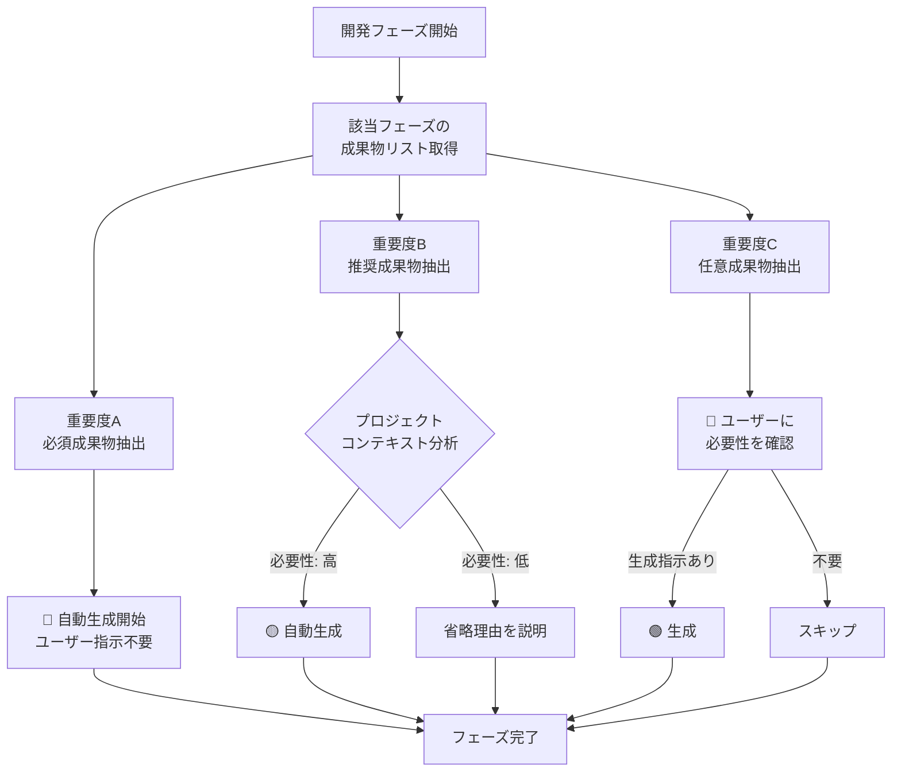
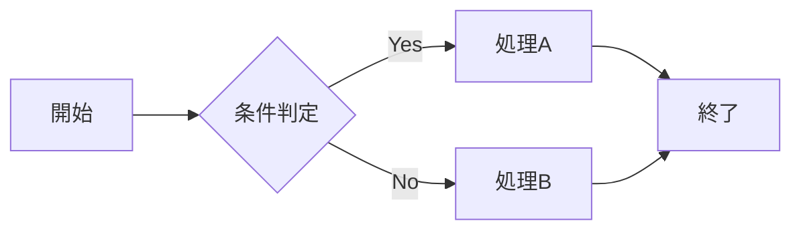

# ドキュメント作成の基本ルール

**バージョン:** 1.1  
**作成日:** 2025-10-30  
**更新日:** 2025-10-30  
**対象:** AIエージェント および 人間のドキュメント作成者  
**目的:** AIがドキュメントを作成する際の統一ルールを定め、人間が読みやすい高品質なドキュメントを生成する

---

## 📋 目次

1. [成果物重要度と自動生成ルール](#成果物重要度と自動生成ルール) ⭐ NEW
2. [基本原則](#基本原則)
3. [文章作成のルール](#文章作成のルール)
4. [構造とレイアウトのルール](#構造とレイアウトのルール)
5. [図表活用のルール](#図表活用のルール)
6. [メタ情報管理のルール](#メタ情報管理のルール)
7. [品質管理のルール](#品質管理のルール)
8. [ファイル管理のルール](#ファイル管理のルール)
9. [AI活用時の特別ルール](#ai活用時の特別ルール)

---

## 🎯 成果物重要度と自動生成ルール

### 📊 重要度の3段階分類

**すべての成果物は以下の3段階の重要度に分類され、AIの自動生成動作が異なる:**

#### 🔴 重要度A：生成必須（MANDATORY）

**定義:** プロジェクトの成功に不可欠な成果物

**AI動作ルール:**
```
✅ ユーザーの明示的な指示がなくても自動的に生成する
✅ 該当フェーズに入ったら必ず生成対象として認識する
✅ 省略する場合は、ユーザーに理由を説明し確認を求める
```

**対象成果物の例:**
- 要件定義書
- システム構成図
- アーキテクチャ設計書
- データベース設計書
- 詳細設計書
- クラス図
- ソースコード
- 結合テスト仕様書・報告書
- システムテスト仕様書・報告書
- 運用マニュアル

---

#### 🟡 重要度B：生成推奨（RECOMMENDED）

**定義:** プロジェクトの品質向上に有効な成果物

**AI動作ルール:**
```
✅ デフォルトで自動生成する
🔄 プロジェクト規模や特性に応じて省略判断可能
💬 省略する場合は、その理由をユーザーに説明する
```

**判断基準:**
- プロジェクト規模（小規模なら簡略化可）
- システム特性（API専用なら画面設計不要等）
- 開発体制（チーム開発か個人開発か）

**対象成果物の例:**
- 提案書
- 見積書
- WBS（作業分解図）
- 画面設計書
- シーケンス図
- 性能テスト報告書
- 保守計画書

---

#### 🟢 重要度C：生成任意（OPTIONAL）

**定義:** 特定の状況や要求がある場合のみ必要な成果物

**AI動作ルール:**
```
❌ ユーザーからの明示的な指示がない限り生成しない
💬 該当する可能性がある場合、ユーザーに確認を促す
📝 必要性の判断はユーザーに委ねる
```

**確認の例:**
```
「このシステムではバッチ処理が必要でしょうか？
必要な場合はバッチ設計書を作成します」

「帳票出力機能は含まれますか？
含まれる場合は帳票設計書を作成します」
```

**対象成果物の例:**
- RFP（提案依頼書）※発注側の文書
- 帳票設計書
- バッチ設計書
- 状態遷移図
- モジュール構成図
- アクティビティ図
- IPO（処理機能記述）
- プログラム仕様書

---

### 🤖 AIの自動生成フロー



---

### 📋 判断基準の詳細

#### プロジェクト規模による判断

| 規模 | 人月 | 重要度Bの扱い | 簡略化例 |
|------|------|--------------|----------|
| **小規模** | 1-3人月 | 一部省略可 | WBS→スプレッドシート代替<br/>シーケンス図→コメント代替 |
| **中規模** | 4-12人月 | 原則生成 | 標準通り |
| **大規模** | 13人月以上 | 全て生成 | 追加ドキュメントも検討 |

#### システム特性による判断

| システムタイプ | 不要な可能性がある成果物（重要度B） |
|--------------|----------------------------------|
| **API専用システム** | 画面設計書 |
| **バッチ処理なし** | バッチ設計書（重要度C） |
| **外部連携なし** | インターフェース設計書（該当箇所） |
| **単純なCRUD** | シーケンス図、状態遷移図 |

---

### ⚠️ 重要な注意事項

#### 1. 重要度Aは絶対に省略しない

```
❌ 悪い例:
「要件定義書は不要と判断し、スキップします」

✅ 良い例:
「要件定義書は必須ドキュメントです。
省略する場合は特別な理由が必要ですが、
本当に省略してよろしいですか?」
```

#### 2. 重要度Cは勝手に生成しない

```
❌ 悪い例:
「念のためバッチ設計書も作成しておきます」

✅ 良い例:
「バッチ処理が含まれる場合、バッチ設計書が必要です。
バッチ処理は含まれますか?」
```

#### 3. ユーザー指示は最優先

```
✅ ユーザーの明示的な指示があれば、重要度に関係なく従う
✅ 「Aは不要、Cを作成」という指示も尊重する
✅ ただし、リスクがある場合は警告を出す
```

---

### 📖 参照ドキュメント

**詳細な重要度定義とフェーズ別の成果物リスト:**
- [README_成果物重要度定義.md](../README_成果物重要度定義.md)

**全52成果物の重要度一覧:**
```
🔴 重要度A（必須）: 28件 → すべて自動生成
🟡 重要度B（推奨）: 14件 → デフォルト自動生成
🟢 重要度C（任意）: 10件 → 指示時のみ生成
```

---

## 🎯 基本原則

### 原則1: 人間の可読性を最優先

ドキュメントは**人間が読んで理解する**ことを最優先に設計する。

✅ **遵守事項:**
- 専門家でない人も理解できる表現を心がける
- 複雑な概念は段階的に説明する
- 視覚的な要素を積極的に活用する
- 情報の検索性を確保する

❌ **禁止事項:**
- 専門用語の無説明な多用
- 長すぎる文章や段落
- 構造が不明瞭なドキュメント
- 情報の重複や矛盾

---

### 原則2: 一貫性の維持

ドキュメント全体で用語、フォーマット、スタイルを統一する。

| 要素 | ルール | 例 |
|------|--------|-----|
| **用語** | 同じ概念には同じ用語を使用 | ユーザー/利用者/使用者 → **ユーザー**に統一 |
| **表記** | 表記ゆれを避ける | サーバ/サーバー → **サーバー**に統一 |
| **日付** | フォーマットを統一 | **YYYY-MM-DD** (例: 2025-10-30) |
| **数値** | 単位を明記 | 100 → **100件**、**100MB** |

---

### 原則3: 保守性の確保

ドキュメントは継続的に更新・改善されることを前提に設計する。

```
✅ 良い例: モジュール化された構成
├── 概要.md
├── 要件定義.md
├── 設計書/
│   ├── 基本設計.md
│   └── 詳細設計.md
└── 変更履歴.md

❌ 悪い例: 1つの巨大ファイル
└── すべて.md (10,000行)
```

---

## ✍️ 文章作成のルール

### ルール1: 1段落1トピック

**1つの段落には1つの主題のみ**を記載する。

**✅ 良い例:**
```markdown
本システムはユーザー認証機能を提供する。

ユーザーはメールアドレスとパスワードでログインできる。
また、Google/Facebookアカウントでのソーシャルログインにも対応している。
```

**❌ 悪い例:**
```markdown
本システムはユーザー認証機能を提供し、ユーザーはメールアドレスと
パスワードでログインでき、Google/Facebookアカウントでのソーシャル
ログインにも対応しており、さらにパスワードリセット機能もあり...
```

---

### ルール2: 簡潔で明瞭な表現

- **文は短く**: 1文は60文字以内を目安
- **主語を明確に**: 誰が/何が行うのかを明示
- **能動態を使用**: 受動態より能動態を優先
- **具体的に**: 曖昧な表現を避ける

| 悪い例 ❌ | 良い例 ✅ |
|-----------|-----------|
| データが処理される | システムがデータを処理する |
| 適切に設定する | タイムアウトを30秒に設定する |
| できるだけ早く | 3営業日以内に |
| 大量のデータ | 10,000件以上のデータ |

---

### ルール3: 専門用語の取り扱い

**初出時には必ず説明を添える。**

**✅ 良い例:**
```markdown
API（Application Programming Interface、アプリケーション間の
インターフェース）を使用してデータを取得します。
```

**推奨フォーマット:**
```markdown
専門用語（よみがな、簡潔な説明）
```

**用語集の作成:**
複数の専門用語が登場する場合は、ドキュメント末尾に用語集を設ける。

---

### ルール4: 箇条書きの活用

複数の項目を列挙する場合は箇条書きを使用する。

**種類の使い分け:**

- **番号なしリスト (`-`)**: 順序が重要でない項目
  ```markdown
  - 項目A
  - 項目B
  - 項目C
  ```

- **番号付きリスト (`1.`)**: 順序や手順が重要な項目
  ```markdown
  1. 最初のステップ
  2. 次のステップ
  3. 最後のステップ
  ```

- **チェックリスト (`- [ ]`)**: タスクや確認項目
  ```markdown
  - [ ] 要件定義書のレビュー
  - [ ] 設計書の承認
  - [x] 実装完了
  ```

---

## 🏗️ 構造とレイアウトのルール

### ルール5: 見出しの階層構造

Markdownの見出しレベルを適切に使い分ける。

```markdown
# レベル1: ドキュメントタイトル（1つのみ）
## レベル2: 大セクション
### レベル3: 中セクション
#### レベル4: 小セクション
##### レベル5: 詳細項目（多用しない）
```

**原則:**
- **レベル1 (`#`)**: ドキュメントタイトルのみ
- **レベル2 (`##`)**: 主要セクション
- **レベル3 (`###`)**: サブセクション
- **レベル4以降**: 必要最小限に

**❌ 避けるべき例:**
```markdown
# タイトル
### いきなりレベル3 （レベル2を飛ばさない）
```

---

### ルール6: 余白と区切り線の活用

**読みやすさのための余白:**

```markdown
## セクション1

内容が始まる前に1行空ける。

段落と段落の間も1行空ける。

---

次のセクションとは区切り線で分離する。

## セクション2
```

**ルール:**
- 見出しの前後は1行空ける
- 段落間は1行空ける
- 大きなセクションの区切りには `---` を使用

---

### ルール7: コードブロックの使用

コード、コマンド、設定ファイルは専用のコードブロックで記載する。

**基本形式:**
````markdown
```言語名
コード内容
```
````

**例:**
````markdown
```python
def calculate_total(items):
    """合計金額を計算する"""
    return sum(item.price for item in items)
```

```bash
# サーバーを起動
npm start
```

```json
{
  "name": "sample-project",
  "version": "1.0.0"
}
```
````

**インラインコード:**
文中でコードや技術用語を示す場合は `` ` `` で囲む。

```markdown
`useState` フックを使用してステートを管理します。
```

---

### ルール8: 強調の使い方

| 記法 | 用途 | 例 |
|------|------|-----|
| `**太字**` | **重要な概念や用語** | **必須項目** |
| `*斜体*` | *強調や注意喚起* | *注意: この操作は取り消せません* |
| `` `コード` `` | `技術用語やコマンド` | `git commit` |
| `> 引用` | 引用や注釈 | > 参考: 公式ドキュメント参照 |

**過度な強調は避ける:**
```markdown
❌ **これは**とても**重要**な**機能**です。
✅ これは**とても重要な機能**です。
```

---

## 📊 図表活用のルール

### ルール9: 表の作成

複数の項目を比較する場合は表形式を使用する。

**基本フォーマット:**
```markdown
| 列1 | 列2 | 列3 |
|-----|-----|-----|
| データ1 | データ2 | データ3 |
| データ4 | データ5 | データ6 |
```

**配置の指定:**
```markdown
| 左寄せ | 中央寄せ | 右寄せ |
|:-------|:--------:|-------:|
| Left   | Center   | Right  |
```

**表作成のポイント:**
- ✅ ヘッダー行を必ず設定
- ✅ セル内の文字数は適度に（長すぎない）
- ✅ 複雑すぎる表は分割する
- ❌ 表の中に表を入れない

**良い表の例:**

| 機能名 | 優先度 | 工数（日） | 担当者 | ステータス |
|--------|:------:|----------:|--------|:----------:|
| ユーザー登録 | 高 | 5 | 田中 | ✅完了 |
| ログイン | 高 | 3 | 佐藤 | 🔄進行中 |
| パスワードリセット | 中 | 2 | 鈴木 | ⏳未着手 |

---

### ルール10: 図解の挿入

複雑な関係性やフローは図で表現する。

**図の挿入方法:**
```markdown

```

**図のキャプション:**
```markdown

*図1: 3層アーキテクチャによるシステム構成*
```

**推奨する図の種類:**
- 📊 **フローチャート**: プロセスや手順
- 🏗️ **アーキテクチャ図**: システム構成
- 🔄 **シーケンス図**: 処理の流れ
- 📈 **データフロー図**: データの流れ
- 🗂️ **ER図**: データベース設計

**Mermaid記法の活用:**

````markdown

````

---

### ルール11: アイコンとビジュアル要素

絵文字やアイコンを適切に使用して視認性を向上させる。

**推奨アイコン一覧:**

| アイコン | 用途 |
|---------|------|
| ✅ | 完了、正しい例、推奨事項 |
| ❌ | 禁止、誤った例、非推奨事項 |
| ⚠️ | 警告、注意事項 |
| 💡 | ヒント、Tips |
| 📝 | 補足説明、メモ |
| 🔍 | 詳細、参照 |
| 🎯 | 目標、重要ポイント |
| 📊 | データ、統計 |
| 🔧 | 設定、ツール |
| 🚀 | 開始、実行 |

**使用例:**

```markdown
⚠️ **重要な注意事項**
この操作を実行すると、すべてのデータが削除されます。

💡 **Tips**
開発環境では `.env.development` ファイルを使用してください。

✅ **推奨される方法**
エラーハンドリングを必ず実装してください。
```

---

## 🏷️ メタ情報管理のルール

### ルール12: ドキュメントヘッダー

すべてのドキュメントは以下のヘッダー情報で始める。

```markdown
# ドキュメントタイトル

**ドキュメントID:** DOC-REQ-001  
**バージョン:** 1.2.0  
**ステータス:** 承認済み  
**作成日:** 2025-01-15  
**最終更新日:** 2025-10-30  
**作成者:** 山田太郎  
**承認者:** 鈴木花子  
**関連ドキュメント:** [基本設計書](./基本設計書.md), [詳細設計書](./詳細設計書.md)

---

## 概要

このドキュメントは...
```

**必須フィールド:**
- ドキュメントID
- バージョン
- 作成日
- 最終更新日
- 作成者

**任意フィールド:**
- ステータス
- 承認者
- レビュー担当者
- 関連ドキュメント

---

### ルール13: バージョン管理

**バージョン番号の形式:** `メジャー.マイナー.パッチ`

```
例: 1.2.3
     │ │ └─ パッチ: バグ修正、誤字修正
     │ └─── マイナー: 機能追加、小規模な変更
     └───── メジャー: 大規模な変更、互換性のない変更
```

**変更履歴の記載:**

```markdown
## 変更履歴

| バージョン | 日付 | 変更者 | 変更内容 |
|-----------|------|--------|----------|
| 1.2.0 | 2025-10-30 | 山田 | セキュリティ要件を追加 |
| 1.1.0 | 2025-09-15 | 佐藤 | 画面設計の詳細化 |
| 1.0.0 | 2025-08-01 | 鈴木 | 初版作成 |
```

---

### ルール14: ステータス管理

ドキュメントのライフサイクルを明示する。

| ステータス | 意味 | 記号 |
|-----------|------|------|
| **Draft** | 作成中 | 📝 |
| **Review** | レビュー中 | 🔍 |
| **Approved** | 承認済み | ✅ |
| **Archived** | アーカイブ | 📦 |
| **Deprecated** | 非推奨 | ⚠️ |

**表示例:**
```markdown
**ステータス:** 🔍 Review（レビュー中）
```

---

## 🎨 品質管理のルール

### ルール15: レビューチェックリスト

ドキュメント作成後は以下の項目を確認する。

**内容の正確性:**
- [ ] 技術的な情報は正確か
- [ ] 用語は統一されているか
- [ ] 矛盾する記述はないか
- [ ] 古い情報は更新されているか

**構造と可読性:**
- [ ] 見出しの階層は適切か
- [ ] 段落は適切に分割されているか
- [ ] 箇条書きは効果的に使われているか
- [ ] 図表は適切に配置されているか

**メタ情報:**
- [ ] バージョン番号は正しいか
- [ ] 作成日・更新日は記載されているか
- [ ] 変更履歴は記録されているか

**リンクと参照:**
- [ ] すべてのリンクは有効か
- [ ] 参照先は正確か
- [ ] 画像ファイルは存在するか

---

### ルール16: 品質基準

高品質なドキュメントの基準。

| 観点 | 基準 |
|------|------|
| **完全性** | 必要な情報がすべて含まれている |
| **正確性** | 技術的に正確で、誤りがない |
| **一貫性** | 用語、フォーマットが統一されている |
| **明瞭性** | 曖昧な表現がなく、理解しやすい |
| **簡潔性** | 冗長でなく、要点が明確 |
| **追跡性** | 変更履歴が記録され、バージョン管理されている |

---

## 📁 ファイル管理のルール

### ルール17: ファイル命名規則

統一された命名規則に従う。

**基本フォーマット:**
```
[フェーズ]_[種別]_[対象]_v[バージョン].md
```

**例:**
```
✅ 良い例:
- 01_要件定義_顧客管理システム_v1.0.md
- 02_基本設計_データベース設計_v2.1.md
- 03_詳細設計_API仕様_v1.0.md

❌ 悪い例:
- 要件定義.md （曖昧）
- design_doc_final_final_v2.md （冗長）
- 設計書(1).md （自動生成の重複名）
```

**命名ルール:**
- ✅ 英数字とアンダースコアのみ使用
- ✅ 日本語ファイル名も許可（UTF-8環境）
- ✅ スペースは使用しない（アンダースコアを使用）
- ❌ 特殊文字は使用しない（`/\:*?"<>|` など）

---

### ルール18: ディレクトリ構成

階層的で論理的なディレクトリ構成を維持する。

**推奨構成例:**

```
AI活用システム開発ドキュメント/
├── 00_ドキュメント作成ルール/
│   ├── ドキュメント作成基本ルール.md
│   └── テンプレート集/
├── 01_企画・要求定義/
│   ├── RFP.md
│   ├── 提案書.md
│   └── 見積書.md
├── 02_要件定義/
│   ├── 要件定義書.md
│   ├── 機能要件一覧.md
│   ├── 非機能要件一覧.md
│   └── 用語集.md
├── 03_基本設計/
│   ├── 基本設計書.md
│   ├── 画面設計/
│   ├── データベース設計/
│   └── システム構成図/
├── 04_詳細設計/
├── 05_実装/
├── 06_テスト/
├── 07_運用保守/
└── 99_共通資料/
    ├── 用語集.md
    ├── 参考資料/
    └── テンプレート/
```

**ディレクトリ命名のルール:**
- 番号プレフィックス（00-99）で順序を明示
- 日本語名を使用可能
- 階層は3-4レベルまで

---

### ルール19: リンクと参照

ドキュメント間のリンクは相対パスを使用する。

**相対パスの使用:**
```markdown
✅ 良い例:
[要件定義書](../02_要件定義/要件定義書.md)
[用語集](./用語集.md)

❌ 悪い例:
[要件定義書](/Users/yamada/project/docs/要件定義書.md)
[要件定義書](C:\Documents\要件定義書.md)
```

**アンカーリンクの使用:**
```markdown
[セクション2へジャンプ](#セクション2)

## セクション2
```

---

## 🤖 AI活用時の特別ルール

### ルール20: AI生成コンテンツの明示

AIが生成した内容は明記する。

```markdown
> 📝 **AI生成コンテンツ**  
> このセクションはAIによって生成され、人間によってレビュー済みです。  
> 最終確認日: 2025-10-30
```

---

### ルール21: 設計意図の明記

AIが生成したコードやアーキテクチャには、必ず設計意図を記載する。

**フォーマット:**

```markdown
### 設計意図

**目的:**  
〇〇を実現するため

**前提条件:**  
- 条件1
- 条件2

**制約事項:**  
- 制約1
- 制約2

**代替案との比較:**  
| 方式 | メリット | デメリット | 選定理由 |
|------|---------|-----------|----------|
| 方式A | ... | ... | ... |
| 方式B | ... | ... | 選定 ✅ |
```

---

### ルール22: 人間によるレビュー必須項目

AIが生成した以下の内容は、必ず人間が確認・承認する。

**必須レビュー項目:**
- [ ] ビジネス要件との整合性
- [ ] セキュリティ要件
- [ ] パフォーマンス要件
- [ ] 法的コンプライアンス
- [ ] コスト影響
- [ ] 運用保守性

**レビュー記録:**
```markdown
## レビュー記録

**レビュー者:** 山田太郎  
**レビュー日:** 2025-10-30  
**結果:** ✅ 承認 / 🔄 修正が必要 / ❌ 却下  
**コメント:**  
- 指摘事項1
- 指摘事項2
```

---

## 📚 テンプレート活用

### ルール23: 標準テンプレートの使用

各種ドキュメントには標準テンプレートを使用する。

**テンプレート一覧:**
- 要件定義書テンプレート
- 基本設計書テンプレート
- 詳細設計書テンプレート
- テスト仕様書テンプレート
- 議事録テンプレート
- 変更管理票テンプレート

**テンプレートの配置場所:**
```
/00_ドキュメント作成ルール/テンプレート集/
```

---

## ✅ チェックリスト: ドキュメント公開前の最終確認

ドキュメントを正式にリリースする前に、以下を確認する。

### 📋 基本情報
- [ ] タイトルは明確か
- [ ] メタ情報（バージョン、日付、作成者）は記載されているか
- [ ] 目次は更新されているか
- [ ] 変更履歴は記録されているか

### 📝 内容
- [ ] 目的と対象読者は明記されているか
- [ ] 専門用語は定義されているか
- [ ] 矛盾する記述はないか
- [ ] 図表の番号と参照は正しいか

### 🎨 フォーマット
- [ ] 見出しの階層は適切か
- [ ] 段落分けは適切か
- [ ] 箇条書きは効果的に使われているか
- [ ] コードブロックは正しく記述されているか

### 🔗 リンク
- [ ] すべての内部リンクは有効か
- [ ] すべての外部リンクは有効か
- [ ] 画像ファイルは表示されるか

### 👥 レビュー
- [ ] ピアレビューは完了したか
- [ ] フィードバックは反映されたか
- [ ] 承認者の承認は得られたか

---

## 🎓 まとめ

このドキュメント作成ルールは、**AI がドキュメントを生成する際の指針**であり、**人間が読みやすい高品質なドキュメント**を実現するための基準です。

**重要な3つの原則:**

1. 🎯 **人間の可読性を最優先** - 常に読み手の視点で考える
2. 📏 **一貫性を維持** - 用語、フォーマット、スタイルを統一
3. 🔄 **継続的改善** - フィードバックを受けて進化させる

これらのルールに従うことで、チーム全体の生産性が向上し、プロジェクトの成功につながります。

---

## 📖 用語集

| 用語 | 説明 |
|------|------|
| **メタ情報** | ドキュメント自体に関する情報（作成日、作成者、バージョンなど） |
| **可読性** | 文章や資料の読みやすさ、理解しやすさ |
| **一貫性** | 同じルールや基準が全体に適用されている状態 |
| **バージョン管理** | ドキュメントの変更履歴を記録し、管理すること |
| **ピアレビュー** | 同僚や他のチームメンバーによる相互レビュー |

---

**ドキュメント終了**
