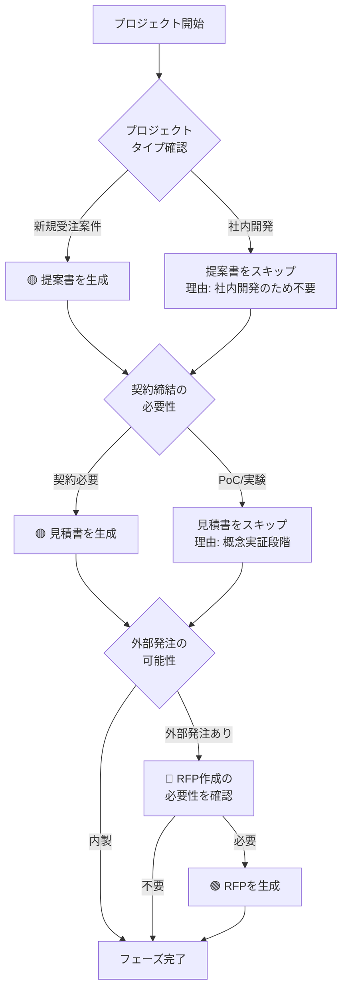

# 01_企画・要求定義フェーズ - ドキュメント作成ルール

## 📋 フェーズ概要

**目的:** プロジェクトの立ち上げと提案活動

**主要成果物:** RFP（提案依頼書）、提案書、見積書

**前工程:** なし（プロジェクト開始）  
**次工程:** 02_要件定義フェーズ

---

## 🎯 成果物の重要度と自動生成ルール

### 🔴 重要度A：生成必須（MANDATORY）

**このフェーズには重要度Aの成果物はありません。**

**理由:** 
- RFPは発注側が作成する文書
- 提案書・見積書はビジネス要件に依存し、必須ではない

---

### 🟡 重要度B：生成推奨（RECOMMENDED）- デフォルトで自動生成

| No | 成果物名 | 理由 | 省略可能なケース |
|----|---------|------|-----------------|
| 1 | **提案書** | 受注活動で重要 | 社内開発、既存顧客の追加開発 |
| 2 | **見積書** | プロジェクト計画に必要 | PoC段階、社内プロジェクト |

**AI動作:**
```
✅ デフォルトで自動生成する
🔄 プロジェクト性質に応じて省略判断可能
💬 省略する場合は、その理由をユーザーに説明する
```

**判断基準:**

#### 提案書
- **生成すべきケース:**
  - 新規顧客への提案
  - 競合コンペ案件
  - 大規模プロジェクト
  - 公共入札案件

- **省略可能なケース:**
  - 社内開発プロジェクト
  - 既存顧客の追加開発
  - 保守・改修案件

#### 見積書
- **生成すべきケース:**
  - 契約締結が必要
  - 予算承認が必要
  - 正式な発注プロセス

- **省略可能なケース:**
  - PoC（概念実証）段階
  - 社内の実験的プロジェクト
  - 研究開発目的

---

### 🟢 重要度C：生成任意（OPTIONAL）- 指示時のみ生成

| No | 成果物名 | 必要なケース | 確認フレーズ例 |
|----|---------|------------|---------------|
| 1 | **RFP（提案依頼書）** | 発注側として外部ベンダーを選定する場合 | 「外部ベンダーに発注するためのRFPを作成しますか？（通常は発注側が作成します）」 |

**AI動作:**
```
❌ ユーザーからの明示的な指示がない限り生成しない
💬 該当する可能性がある場合、ユーザーに確認を促す
📝 必要性の判断はユーザーに委ねる
```

---

## 🤖 AI自動生成フロー（企画・要求定義フェーズ）



---

## 📊 統計情報

### 成果物数サマリー

| 重要度 | 件数 | 割合 | 自動生成 |
|--------|------|------|----------|
| 🔴 A（必須） | 0件 | 0% | - |
| 🟡 B（推奨） | 2件 | 67% | ✅ デフォルト |
| 🟢 C（任意） | 1件 | 33% | ❌ 指示時のみ |
| **合計** | **3件** | **100%** | 2件がデフォルト生成 |

### 作成時間の目安（AI生成）

| 成果物名 | 規模（小） | 規模（中） | 規模（大） |
|---------|-----------|-----------|-----------|
| RFP | 2時間 | 4時間 | 8時間 |
| 提案書 | 3時間 | 6時間 | 12時間 |
| 見積書 | 1時間 | 2時間 | 4時間 |

---

## ⚙️ プロジェクトタイプ別の推奨構成

### 新規顧客への受注案件

**推奨（重要度B）:**
- ✅ 提案書（詳細版 - 競合優位性を強調）
- ✅ 見積書（内訳明細付き）

**任意（重要度C）:**
- ❌ RFP（顧客が作成）

---

### 社内開発プロジェクト

**推奨（重要度B）:**
- 🔄 提案書 → 省略可（社内稟議書で代替）
- 🔄 見積書 → 簡易版（人月計算のみ）

**任意（重要度C）:**
- ❌ RFP → 不要

---

### PoC（概念実証）プロジェクト

**推奨（重要度B）:**
- 🔄 提案書 → 簡易版（技術検証計画）
- 🔄 見積書 → 省略可（予算確認程度）

**任意（重要度C）:**
- ❌ RFP → 不要

---

## 🎨 特記事項

### このフェーズの特徴

**ビジネス中心:**
- 技術詳細よりもビジネス価値を重視
- 費用対効果の明確化
- リスク・制約条件の識別

**柔軟性が高い:**
- プロジェクトタイプによって大きく異なる
- 必須ドキュメントが少ない
- AI判断よりも人間の判断が重要

**次フェーズへの準備:**
- このフェーズで契約・予算が確定
- 要件定義フェーズの開始条件が整う

---

## 🔗 関連ドキュメント

- [ドキュメント作成基本ルール](../00_ドキュメント作成ルール/ドキュメント作成基本ルール.md) - 全体の基本ルール
- [README_成果物重要度定義](../README_成果物重要度定義.md) - 全フェーズの重要度定義
- [02_要件定義フェーズ](../02_要件定義/README.md) - 次工程

---

**最終更新日:** 2025年10月30日  
**バージョン:** 1.0  
**対象:** AI開発アシスタント、営業、プロジェクトマネージャー
