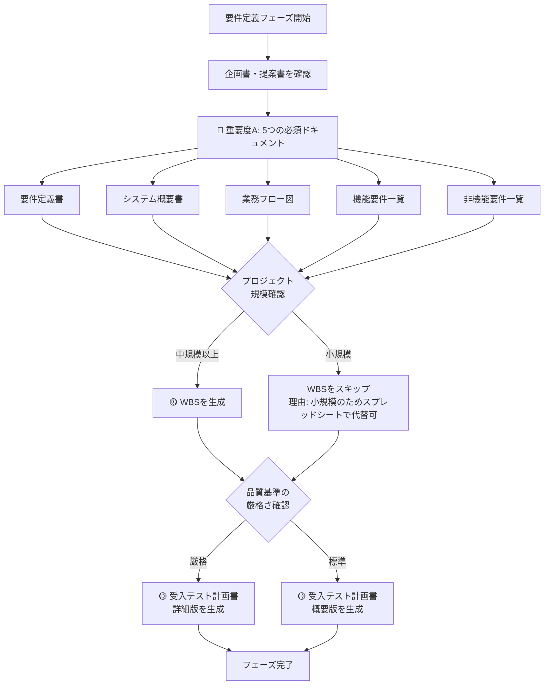

# 02_要件定義フェーズ - ドキュメント作成ルール

## 📋 フェーズ概要

**目的:** システムに求められる機能と性能を明確化する

**主要成果物:** 要件定義書、システム概要書、業務フロー図、機能要件一覧、非機能要件一覧、WBS、受入テスト計画書

**前工程:** 01_企画・要求定義フェーズ  
**次工程:** 03_基本設計フェーズ

---

## 🎯 成果物の重要度と自動生成ルール

### 🔴 重要度A：生成必須（MANDATORY）- 常に自動生成

| No | 成果物名 | 理由 |
|----|---------|------|
| 1 | **要件定義書** | すべての開発の基礎となる最重要ドキュメント |
| 2 | **システム概要書** | システム全体像の把握に必須 |
| 3 | **業務フロー図** | 業務要件の可視化に不可欠 |
| 4 | **機能要件一覧** | 実装すべき機能の網羅的リスト |
| 5 | **非機能要件一覧** | 性能・セキュリティ等の品質保証に必須 |

**AI動作:**
```
✅ ユーザーの明示的な指示がなくても自動的に生成する
✅ 該当フェーズに入ったら必ず生成対象として認識する
⚠️  省略する場合は、ユーザーに理由を説明し確認を求める
```

---

### 🟡 重要度B：生成推奨（RECOMMENDED）- デフォルトで自動生成

| No | 成果物名 | 理由 | 省略可能なケース |
|----|---------|------|-----------------|
| 1 | **WBS（作業分解図）** | プロジェクト管理に有用 | 小規模プロジェクト（スプレッドシートで代替可） |
| 2 | **受入テスト計画書** | 初期段階での品質基準設定 | 詳細は後工程で作成するため概要レベルで可 |

**AI動作:**
```
✅ デフォルトで自動生成する
🔄 プロジェクト規模や管理手法に応じて省略判断可能
💬 省略する場合は、その理由をユーザーに説明する
```

**判断基準:**

#### WBS（作業分解図）
- **生成すべきケース:**
  - 中規模以上のプロジェクト
  - 複数チームでの開発
  - ウォーターフォール開発
  - 正式なプロジェクト管理が必要

- **省略可能なケース:**
  - 1-3人月の小規模プロジェクト
  - アジャイル開発（バックログで代替）
  - スプレッドシートやGanttチャートで代替可能

#### 受入テスト計画書
- **生成すべきケース:**
  - 顧客との合意形成が重要
  - 厳格な品質保証が必要
  - 大規模プロジェクト

- **省略可能なケース:**
  - 詳細は06_テストフェーズで作成
  - この段階では概要レベルで可
  - 小規模プロジェクト

---

### 🟢 重要度C：生成任意（OPTIONAL）

**このフェーズには重要度Cの成果物はありません。**

**理由:** 要件定義はシステム開発の根幹であり、すべての成果物が重要度A（必須）またはB（推奨）に分類されています。

---

## 🤖 AI自動生成フロー（要件定義フェーズ）



---

## 📊 統計情報

### 成果物数サマリー

| 重要度 | 件数 | 割合 | 自動生成 |
|--------|------|------|----------|
| 🔴 A（必須） | 5件 | 71% | ✅ すべて |
| 🟡 B（推奨） | 2件 | 29% | ✅ デフォルト |
| 🟢 C（任意） | 0件 | 0% | - |
| **合計** | **7件** | **100%** | 7件がデフォルト生成 |

### 作成時間の目安（AI生成）

| 成果物名 | 規模（小） | 規模（中） | 規模（大） |
|---------|-----------|-----------|-----------|
| 要件定義書 | 3時間 | 8時間 | 20時間 |
| システム概要書 | 1時間 | 2時間 | 4時間 |
| 業務フロー図 | 2時間 | 4時間 | 8時間 |
| 機能要件一覧 | 2時間 | 6時間 | 16時間 |
| 非機能要件一覧 | 1時間 | 3時間 | 6時間 |
| WBS | 2時間 | 4時間 | 8時間 |
| 受入テスト計画書 | 1時間 | 3時間 | 6時間 |

---

## ⚙️ プロジェクト特性別の推奨構成

### 小規模プロジェクト（1-3人月）

**必須（重要度A）:**
- ✅ 要件定義書（簡潔版）
- ✅ システム概要書
- ✅ 業務フロー図（主要フローのみ）
- ✅ 機能要件一覧
- ✅ 非機能要件一覧（簡易版）

**推奨（重要度B）:**
- 🔄 WBS → スプレッドシートで代替可
- 🔄 受入テスト計画書 → 概要レベル

---

### 中規模プロジェクト（4-12人月）

**必須（重要度A）:**
- ✅ すべての重要度A成果物を標準レベルで作成

**推奨（重要度B）:**
- ✅ WBS（詳細版）
- ✅ 受入テスト計画書（標準版）

---

### 大規模プロジェクト（13人月以上）

**必須（重要度A）:**
- ✅ すべての重要度A成果物を詳細レベルで作成

**推奨（重要度B）:**
- ✅ WBS（詳細版 + ガントチャート）
- ✅ 受入テスト計画書（詳細版）

---

## 🎨 開発手法別の推奨構成

### ウォーターフォール開発

**すべての成果物を詳細レベルで作成:**
- ✅ 重要度A: すべて詳細版
- ✅ 重要度B: すべて正式版
- 📝 変更管理が厳格なため、初期段階での完全性が重要

### アジャイル開発

**反復的な改善を前提:**
- ✅ 重要度A: 初期版を作成し、継続的に更新
- 🔄 WBS → プロダクトバックログで代替
- 🔄 受入テスト計画書 → ユーザーストーリーの受入条件で代替
- 📝 ドキュメントは必要最小限、変化に対応

---

## 🎯 品質チェックポイント

### 要件定義フェーズの完了基準

**必須チェック項目:**
- [ ] すべての機能要件が網羅されている
- [ ] 非機能要件が定量的に記載されている
- [ ] 業務フローが関係者全員に理解されている
- [ ] 顧客との合意が得られている
- [ ] 見積りと予算が整合している

**推奨チェック項目:**
- [ ] WBSで作業が適切に分解されている
- [ ] 受入基準が明確になっている
- [ ] リスクが識別されている

---

## 🔗 関連ドキュメント

- [ドキュメント作成基本ルール](../00_ドキュメント作成ルール/ドキュメント作成基本ルール.md) - 全体の基本ルール
- [README_成果物重要度定義](../README_成果物重要度定義.md) - 全フェーズの重要度定義
- [01_企画・要求定義フェーズ](../01_企画・要求定義/README.md) - 前工程
- [03_基本設計フェーズ](../03_基本設計/README.md) - 次工程

---

**最終更新日:** 2025年10月30日  
**バージョン:** 1.0  
**対象:** AI開発アシスタント、ビジネスアナリスト、要件定義担当者
