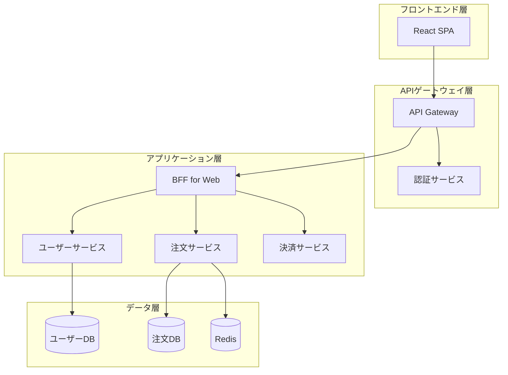

# アーキテクチャ設計書作成ルール

**ドキュメント分類:** 基本設計書  
**バージョン:** 2.0  
**最終更新日:** 2025-10-30

---

## 📋 1. 基本情報

### ドキュメント名
アーキテクチャ設計書 (Architecture Design Document / ADD)

### 目的
- システムの技術アーキテクチャ全体を定義する
- 技術選定の根拠と方針を明確にする
- アーキテクチャ上の重要な決定事項を記録する
- 開発チーム全体で共有すべき設計原則を確立する

### 対象読者
- **主要読者**: システムアーキテクト、技術リーダー、開発リーダー
- **副次読者**: プロジェクトマネージャー、品質保証担当者、運用担当者

### 関連成果物
- **入力**: 要件定義書、非機能要件定義書
- **出力**: システム構成図、詳細設計書、コーディング規約

---

## ⏰ 2. 作成タイミングと前提条件

### 作成タイミング
- **開始**: 基本設計フェーズ開始直後
- **完了**: 技術スタック確定後、システム構成図作成前
- **更新**: 重要なアーキテクチャ決定時に随時更新

### 前提条件
- [ ] 要件定義書完成
- [ ] 非機能要件定義書完成
- [ ] 技術調査・PoC完了（必要に応じて）
- [ ] 予算・期間の確定

### 作成にかかる標準期間
- **小規模**: 5-7日
- **中規模**: 2-3週間
- **大規模**: 3-4週間

---

## 📐 3. ドキュメント構成

### 必須セクション

#### 3.1 エグゼクティブサマリー
- アーキテクチャの概要（1ページ）
- 主要な技術決定事項
- ビジネス価値

#### 3.2 アーキテクチャビジョン
- システムの目的と目標
- アーキテクチャ上の制約条件
- ステークホルダーと関心事

#### 3.3 アーキテクチャスタイル
- 採用するアーキテクチャパターン
  - モノリシック / マイクロサービス
  - レイヤードアーキテクチャ
  - イベント駆動アーキテクチャ
  - CQRS / イベントソーシング
- 選定理由とトレードオフ

#### 3.4 技術スタック
| レイヤー | 技術 | バージョン | 選定理由 |
|---------|------|-----------|---------|
| フロントエンド | React | 18.2 | コンポーネント再利用性、エコシステム |
| APIレイヤー | Node.js + Express | 20 LTS | 非同期処理、軽量 |
| ビジネスロジック | Java + Spring Boot | 17 LTS | エンタープライズ実績、型安全性 |
| データベース | PostgreSQL | 15 | ACID保証、拡張性 |

#### 3.5 設計原則
- **SOLID原則**の適用方針
- **12 Factor App**の適用
- **DRY原則**の遵守
- **セキュリティバイデザイン**

#### 3.6 品質属性の実現方法
- **性能**: キャッシング戦略、非同期処理
- **可用性**: 冗長化、フェイルオーバー
- **拡張性**: 水平スケール、モジュール分割
- **保守性**: 疎結合、テスタビリティ
- **セキュリティ**: 多層防御、最小権限

#### 3.7 主要コンポーネントの設計


#### 3.8 データアーキテクチャ
- データモデリング戦略
- データ永続化パターン
- データ同期・整合性戦略
- マスターデータ管理

#### 3.9 統合アーキテクチャ
- 外部システム連携方式
- API設計方針（REST / GraphQL / gRPC）
- メッセージング（同期 / 非同期）
- データフォーマット（JSON / XML / Protobuf）

#### 3.10 セキュリティアーキテクチャ
- 認証・認可方式（OAuth 2.0, JWT等）
- 暗号化方針
- セキュリティ境界
- 脅威モデル

#### 3.11 デプロイメントアーキテクチャ
- CI/CDパイプライン
- コンテナ戦略（Docker, Kubernetes）
- 環境構成（開発/検証/本番）
- Blue-Greenデプロイ / カナリアリリース

---

## ✍️ 4. 記載ルール

### 4.1 コード記載の禁止

**❌ 実装コードは記載しないこと**

アーキテクチャ設計書は**概念レベル・設計レベル**の記述に留め、実装コードは含めない。

#### ✅ 良い例（概念的な説明）
```
【認証フロー】
1. クライアントが認証エンドポイントにメールアドレス・パスワードを送信
2. サーバーがBCryptでパスワードハッシュを検証
3. 検証成功時、JWTトークン（有効期限1時間）を生成して返却
4. クライアントは以降のリクエストでトークンをAuthorizationヘッダーに付与
```

```
【キャッシング戦略】
- アプリケーションキャッシュ: Redisを使用
- キャッシュキー命名規則: {entity}:{id} 形式
- TTL: ユーザー情報は30分、商品情報は1時間
- キャッシュ更新: Write-Through パターン
```

#### ❌ 悪い例（実装コードを記載）
```java
// このような実装コードは記載しない
@Service
public class UserService {
    @Autowired
    private UserRepository userRepository;
    
    public User createUser(UserCreateRequest request) {
        User user = new User();
        user.setEmail(request.getEmail());
        return userRepository.save(user);
    }
}
```

#### 📝 疑似コード・構造表現は可

アーキテクチャパターンを示す**疑似コード**や**構造表現**は記載可：

```
【レイヤー構造】
Controller層
  ├─ リクエストの受付・バリデーション
  ├─ Service層の呼び出し
  └─ レスポンスの整形

Service層
  ├─ ビジネスロジックの実装
  ├─ トランザクション管理
  └─ Repository層の呼び出し

Repository層
  ├─ データアクセスロジック
  └─ ORMマッピング
```

### 4.2 ADR（Architecture Decision Record）の活用

重要な技術決定は、ADR形式で記録すること:

```markdown
## ADR-001: データベースにPostgreSQLを採用

**ステータス**: 承認済み
**決定日**: 2025-10-15
**決定者**: システムアーキテクト

### コンテキスト
ECサイトのトランザクションデータを管理するデータベースを選定する必要がある。
要件として、ACID保証、JSON型のサポート、地理空間データ対応が求められている。

### 検討した選択肢
1. PostgreSQL 15
2. MySQL 8.0
3. MongoDB 6.0

### 決定内容
PostgreSQL 15を採用する

### 理由
- **ACID保証**: トランザクション整合性が必須
- **JSON型サポート**: 柔軟なスキーマ設計が可能
- **地理空間**: PostGIS拡張で位置情報処理が可能
- **コスト**: OSSでライセンス費用不要
- **実績**: エンタープライズ領域での豊富な実績

### 影響
- 開発チームのPostgreSQL習熟が必要
- パフォーマンスチューニングのノウハウ蓄積
- AWS RDS/Azure Database対応でクラウド移行容易

### メモ
初期はシングルインスタンス、将来的にRead Replicaで読み取り分散
```

### 4.3 視覚化の重視

#### アーキテクチャ図の種類
1. **システムコンテキスト図**: システムと外部の関係
2. **コンテナ図**: 主要なサービス・コンポーネント
3. **コンポーネント図**: 各サービス内部の構造
4. **シーケンス図**: 主要な処理フロー

### 4.4 品質属性シナリオ

品質属性は、具体的なシナリオで記述:

```
【性能シナリオ】
- 刺激: ピーク時に1秒間に1,000リクエスト
- 環境: 通常運用時
- 応答: 95パーセンタイルで応答時間が500ms以内
- 測定: Application Performance Monitoring (APM)ツールで計測
```

---

## ✅ 5. 品質基準

### 5.1 完成度チェックリスト

- [ ] すべての品質属性の実現方法が明記されている
- [ ] 技術選定の根拠が説明されている
- [ ] 主要な処理フローが図示されている
- [ ] セキュリティ対策が具体的である
- [ ] スケーラビリティの方針が明確である
- [ ] 運用・保守の考慮がされている
- [ ] コスト見積もりが含まれている
- [ ] リスクと対策が識別されている
- [ ] **実装コードが含まれていない**（概念レベル）

### 5.2 レビュー観点

#### 技術的妥当性
- [ ] 要件を満たす技術選定か
- [ ] 技術的リスクは許容範囲か
- [ ] チームのスキルセットとマッチしているか

#### アーキテクチャ品質
- [ ] 疎結合・高凝集が実現されているか
- [ ] 変更容易性が確保されているか
- [ ] テスタビリティが考慮されているか

#### 記載レベルの妥当性
- [ ] 実装コードではなく概念・設計レベルか
- [ ] 詳細設計書との役割分担が明確か

### 5.3 承認基準
- CTOまたは技術責任者の承認
- システムアーキテクトの承認
- セキュリティ担当者の承認

---

## 🤖 6. AI作成時の具体的指示

### 6.1 必須記載項目

1. **技術選定の3要素**
   - 選定した技術
   - 選定理由（メリット）
   - トレードオフ（デメリットとその対策）

2. **品質属性ごとの戦略**
   ```
   【性能】
   - キャッシング: Redis（アプリケーションキャッシュ）
   - 非同期処理: RabbitMQ（重い処理のキュー投入）
   - CDN: CloudFront（静的コンテンツ配信）
   
   【可用性】
   - 冗長化: 各層2台以上のActive-Active構成
   - ヘルスチェック: 30秒間隔での死活監視
   - 自動復旧: Auto Scaling Groupによる自動起動
   ```

3. **ADRによる意思決定記録**
   - 重要な技術選定は必ずADR形式で記録

### 6.2 避けるべき表現

❌ **NG例**:
- "最新の技術を採用" → ✅ "React 18.2を採用（Concurrent Mode対応）"
- "スケーラブルな設計" → ✅ "Kubernetes HPAで負荷に応じて2-20ポッド間でオートスケール"
- "高いセキュリティ" → ✅ "OAuth 2.0 + JWT認証、全通信TLS 1.3、WAF導入"

### 6.3 コード記載の禁止

```
❌ 実装コードは記載しないこと
  - Java, Python, JavaScript等のプログラムコード
  - 具体的なクラス定義、メソッド実装
  - SQL文の詳細（複雑なクエリ）

✅ 概念的な説明は可
  - アーキテクチャパターンの説明
  - 技術スタックの一覧表
  - フロー図・シーケンス図
  - 疑似コード・構造表現
```

### 6.4 推奨される構成例

#### マイクロサービスアーキテクチャの場合
```
【アーキテクチャスタイル】
マイクロサービスアーキテクチャ

【サービス分割】
- ユーザーサービス: 認証、プロフィール管理
- 商品サービス: 商品情報、在庫管理
- 注文サービス: カート、注文処理
- 決済サービス: 決済処理、決済履歴

【サービス間通信】
- 同期: REST API（HTTP/HTTPS）
- 非同期: RabbitMQ（イベント駆動）
- サービスメッシュ: Istio

【データ管理】
- Database per Service パターン
- イベントソーシングで整合性担保
```

---

## 📚 7. 関連ドキュメント

### 参照すべき成果物
- [非機能要件定義書](../../02_要件定義/非機能要件定義書作成ルール.md)
- [システム構成図](./システム構成図作成ルール.md)

### 次工程で使用される成果物
- [詳細設計書](../../04_詳細設計/詳細設計書作成ルール.md) - 実装レベルのコード記載はこちら
- [コーディング規約](../../05_実装/コーディング規約.md)
- [インフラ構築手順書](../../07_運用保守/運用手順書作成ルール.md)

---

## ⚠️ 8. よくある失敗例と対策

| 失敗例 | 原因 | 対策 |
|--------|------|------|
| **過度に複雑なアーキテクチャ** | マイクロサービス化しすぎ | YAGNIの原則、モノリスファーストを検討 |
| **技術選定の根拠不足** | 流行だけで選定 | PoC実施、トレードオフ分析 |
| **非機能要件との乖離** | 要件の読み込み不足 | 品質属性シナリオで具体化 |
| **運用考慮の不足** | 開発視点のみ | 運用担当者を巻き込んだレビュー |
| **技術的負債の放置** | 短期的な解決策の積み重ね | ADRで意思決定を記録、定期的な見直し |
| **実装コードを記載** | 詳細設計との混同 | 概念レベルに留め、詳細設計書と役割分担 |

---

## 📝 9. 詳細設計書との役割分担

### アーキテクチャ設計書の役割
- **What & Why**: 何を・なぜその技術を選ぶか
- **概念レベル**: アーキテクチャパターン、設計原則
- **全体像**: システム全体の構成、連携方式

### 詳細設計書の役割（次工程）
- **How**: どのように実装するか
- **実装レベル**: クラス定義、メソッドシグネチャ、実装コード
- **局所的詳細**: 個別コンポーネントの内部構造

---

**バージョン履歴**
- v1.0 (2025-10-30): 初版作成
- v2.0 (2025-10-30): コード記載禁止ルールを明確化、詳細設計書との役割分担を追加
