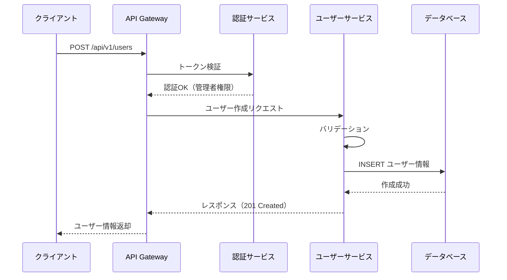
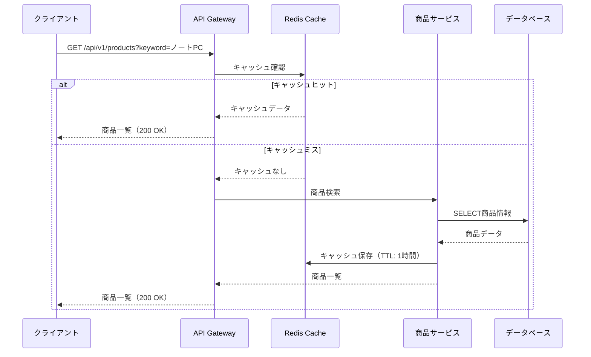
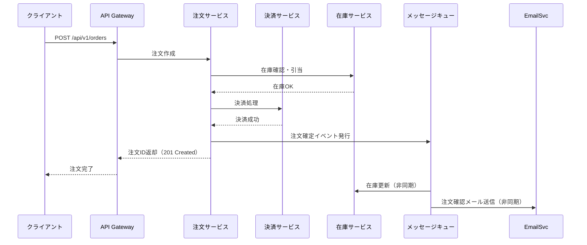

# インターフェース設計書作成ルール

**ドキュメント分類:** 基本設計書  
**バージョン:** 2.0  
**最終更新日:** 2025-10-30

---

## 📋 1. 基本情報

### ドキュメント名
インターフェース設計書 (Interface Design Document / API Specification)

### 目的
- システム間、モジュール間のインターフェースを明確に定義する
- API仕様の全体像と設計方針を提示する
- 外部システムとの連携方式を確立する
- インターフェースの一貫性と互換性を確保する
- **API詳細仕様はSwagger/OpenAPIで別管理する**

### 対象読者
- **主要読者**: バックエンド開発者、システムアーキテクト、APIデザイナー
- **副次読者**: フロントエンド開発者、外部システム連携担当者、テスター

### 関連成果物
- **入力**: 要件定義書、システム構成図、アーキテクチャ設計書
- **出力**: Swagger/OpenAPI仕様書、詳細設計書、テスト仕様書、API利用ガイド

---

## ⏰ 2. 作成タイミングと前提条件

### 作成タイミング
- **開始**: 基本設計フェーズ中盤（アーキテクチャ確定後）
- **完了**: 基本設計レビュー前
- **更新**: API仕様変更時に随時更新（Swagger仕様書と連動）

### 前提条件
- [ ] システム構成図完成
- [ ] アーキテクチャ設計書完成
- [ ] API設計方針確定（REST/GraphQL/gRPC等）
- [ ] 認証・認可方式確定

### 作成にかかる標準期間
- **小規模（〜20 API）**: 3-5日（本体2日 + Swagger作成3日）
- **中規模（20-50 API）**: 1-2週間（本体5日 + Swagger作成5日）
- **大規模（50 API〜）**: 2-4週間（本体1週 + Swagger作成2週）

---

## 📐 3. ドキュメント構成

### 必須セクション

#### 3.1 インターフェース概要
- API設計方針（RESTful, GraphQL, gRPC等）
- ベースURL
- 認証方式
- データフォーマット（JSON, XML等）
- バージョニング戦略

#### 3.2 インターフェース一覧
| API ID | API名 | メソッド | エンドポイント | 概要 | 認証要 | 公開 | Swagger参照 |
|--------|------|---------|--------------|------|--------|------|------------|
| API-001 | ユーザー一覧取得 | GET | `/api/v1/users` | ユーザー一覧を取得 | ○ | 内部 | [詳細](#swagger-path) |
| API-002 | ユーザー詳細取得 | GET | `/api/v1/users/{id}` | 特定ユーザー情報 | ○ | 内部 | [詳細](#swagger-path) |
| API-003 | ユーザー作成 | POST | `/api/v1/users` | 新規ユーザー登録 | ○ | 内部 | [詳細](#swagger-path) |
| API-004 | 商品検索 | GET | `/api/v1/products` | 商品検索 | - | 公開 | [詳細](#swagger-path) |

#### 3.3 共通仕様

##### 3.3.1 認証方式
```
【認証方法】
- OAuth 2.0 + JWT (JSON Web Token)
- トークン有効期限: 1時間
- リフレッシュトークン有効期限: 30日

【リクエストヘッダー】
Authorization: Bearer {access_token}
```

##### 3.3.2 共通HTTPヘッダー
| ヘッダー名 | 必須 | 説明 | 例 |
|-----------|------|------|-----|
| Content-Type | ○ | コンテンツタイプ | application/json |
| Accept | ○ | 受け入れ形式 | application/json |
| Authorization | △ | 認証トークン | Bearer eyJhbGc... |
| X-Request-ID | - | リクエストID（トレーシング用） | uuid-v4 |
| X-API-Version | - | APIバージョン指定 | v1 |

##### 3.3.3 共通レスポンス形式

**成功時（200 OK）**
```json
{
  "status": "success",
  "data": {
    // 実際のデータ
  },
  "meta": {
    "timestamp": "2025-10-30T10:00:00Z",
    "request_id": "123e4567-e89b-12d3-a456-426614174000"
  }
}
```

**エラー時（4xx, 5xx）**
```json
{
  "status": "error",
  "error": {
    "code": "VALIDATION_ERROR",
    "message": "入力値が不正です",
    "details": [
      {
        "field": "email",
        "message": "メールアドレスの形式が正しくありません"
      }
    ]
  },
  "meta": {
    "timestamp": "2025-10-30T10:00:00Z",
    "request_id": "123e4567-e89b-12d3-a456-426614174000"
  }
}
```

##### 3.3.4 HTTPステータスコード
| コード | 意味 | 使用場面 |
|-------|------|---------|
| 200 | OK | 正常処理（GET, PUT, PATCH） |
| 201 | Created | リソース作成成功（POST） |
| 204 | No Content | 正常処理、レスポンスボディなし（DELETE） |
| 400 | Bad Request | リクエスト不正 |
| 401 | Unauthorized | 認証失敗 |
| 403 | Forbidden | 権限不足 |
| 404 | Not Found | リソース不存在 |
| 409 | Conflict | リソース競合 |
| 422 | Unprocessable Entity | バリデーションエラー |
| 429 | Too Many Requests | レート制限超過 |
| 500 | Internal Server Error | サーバーエラー |
| 503 | Service Unavailable | サービス利用不可 |

#### 3.4 API詳細定義の参照

**重要**: 個別APIの詳細仕様（リクエスト・レスポンスの詳細、バリデーション、サンプルコード等）は、**Swagger/OpenAPI仕様書**で管理します。

##### Swagger仕様書の配置
```
プロジェクトルート/
├─ docs/
│  ├─ api-specs/
│  │  ├─ openapi.yaml           # メインSwagger仕様書
│  │  ├─ users-api.yaml         # ユーザーAPI仕様
│  │  ├─ products-api.yaml      # 商品API仕様
│  │  └─ orders-api.yaml        # 注文API仕様
│  └─ 03_基本設計/
│     └─ インターフェース設計書.md  # 本ドキュメント
```

##### 参照例

本インターフェース設計書では、API一覧と全体方針を記載。個別API仕様は以下を参照：

**📄 Swagger/OpenAPI仕様書**
- **メイン仕様書**: `docs/api-specs/openapi.yaml`
- **Swagger UI**: `http://localhost:8080/swagger-ui/` （開発環境）
- **ReDoc UI**: `http://localhost:8080/redoc/` （開発環境）

**個別API仕様ファイル**
| API領域 | Swagger仕様書ファイル | 内容 |
|---------|-------------------|------|
| ユーザー管理 | `docs/api-specs/users-api.yaml` | API-001〜API-010（ユーザーCRUD、認証） |
| 商品管理 | `docs/api-specs/products-api.yaml` | API-011〜API-025（商品検索、在庫管理） |
| 注文管理 | `docs/api-specs/orders-api.yaml` | API-026〜API-040（カート、注文処理） |
| 決済 | `docs/api-specs/payment-api.yaml` | API-041〜API-050（決済処理、履歴） |

##### APIドキュメントの使い分け

| ドキュメント | 目的 | 記載内容 |
|------------|------|---------|
| **本インターフェース設計書** | 全体設計・方針 | API一覧、共通仕様、フロー図、連携方式 |
| **Swagger/OpenAPI仕様書** | API詳細仕様 | エンドポイント詳細、リクエスト/レスポンス構造、バリデーション、サンプルコード |

#### 3.5 主要処理フロー（フロー図）

**📊 フロー図は本ドキュメントに記載**

APIの呼び出しシーケンスや処理の流れは、以下のような図で表現します。

##### 3.5.1 ユーザー登録フロー（シーケンス図）



##### 3.5.2 商品検索フロー（シーケンス図）



##### 3.5.3 注文処理フロー（シーケンス図）



#### 3.6 外部システム連携

外部システムとの連携がある場合:

| 連携先 | 連携方式 | プロトコル | データ形式 | 認証方式 | 備考 |
|-------|---------|-----------|-----------|---------|------|
| 決済システム | API連携 | HTTPS | JSON | API Key | 同期通信 |
| 在庫管理システム | メッセージング | AMQP | JSON | mTLS | 非同期通信 |
| メール配信サービス | Webhook | HTTPS | JSON | HMAC署名 | 非同期通信 |

---

## ✍️ 4. 記載ルール

### 4.1 RESTful API設計原則

#### リソース指向の設計
```
✅ 良い例:
GET    /api/v1/users          # ユーザー一覧
GET    /api/v1/users/{id}     # ユーザー詳細
POST   /api/v1/users          # ユーザー作成
PUT    /api/v1/users/{id}     # ユーザー更新（全体）
PATCH  /api/v1/users/{id}     # ユーザー更新（一部）
DELETE /api/v1/users/{id}     # ユーザー削除

❌ 悪い例:
GET /api/v1/getUserList
POST /api/v1/createUser
POST /api/v1/deleteUser/{id}
```

#### 複数形の使用
```
✅ /api/v1/users
❌ /api/v1/user
```

#### ケバブケースの使用
```
✅ /api/v1/order-items
❌ /api/v1/orderItems
❌ /api/v1/order_items
```

### 4.2 バージョニング戦略

#### URL パス方式（推奨）
```
/api/v1/users
/api/v2/users
```

#### ヘッダー方式
```
X-API-Version: v1
```

### 4.3 ページネーション

#### カーソルベース（推奨: 大規模データ）
```
GET /api/v1/users?cursor=abc123&limit=20
```

#### オフセットベース（小〜中規模データ）
```
GET /api/v1/users?page=2&per_page=20
```

### 4.4 Swagger/OpenAPI仕様書の活用

#### 4.4.1 Swagger仕様書の作成ルール

**必須要素**
- `openapi`: バージョン（3.0.0以上推奨）
- `info`: API情報（タイトル、バージョン、説明）
- `servers`: ベースURL（環境ごと）
- `paths`: エンドポイント定義
- `components`: 共通スキーマ、レスポンス、セキュリティ定義

**記載例（openapi.yaml）**
```yaml
openapi: 3.0.3
info:
  title: ECサイト API仕様
  version: 1.0.0
  description: ECサイトのバックエンドAPI仕様書
  contact:
    name: API Support
    email: api-support@example.com

servers:
  - url: https://api.example.com/api/v1
    description: 本番環境
  - url: https://stg-api.example.com/api/v1
    description: 検証環境
  - url: http://localhost:8080/api/v1
    description: 開発環境

paths:
  /users:
    post:
      summary: ユーザー作成
      description: 新規ユーザーを作成する
      operationId: createUser
      tags:
        - Users
      security:
        - bearerAuth: []
      requestBody:
        required: true
        content:
          application/json:
            schema:
              $ref: '#/components/schemas/UserCreateRequest'
      responses:
        '201':
          description: ユーザー作成成功
          content:
            application/json:
              schema:
                $ref: '#/components/schemas/UserResponse'
        '422':
          description: バリデーションエラー
          content:
            application/json:
              schema:
                $ref: '#/components/schemas/ErrorResponse'

components:
  schemas:
    UserCreateRequest:
      type: object
      required:
        - email
        - password
        - name
      properties:
        email:
          type: string
          format: email
          example: user@example.com
        password:
          type: string
          minLength: 8
          example: SecureP@ssw0rd
        name:
          type: string
          maxLength: 100
          example: 山田太郎
    
    UserResponse:
      type: object
      properties:
        status:
          type: string
          example: success
        data:
          $ref: '#/components/schemas/User'
    
    User:
      type: object
      properties:
        user_id:
          type: integer
          example: 12345
        email:
          type: string
          example: user@example.com
        name:
          type: string
          example: 山田太郎
        created_at:
          type: string
          format: date-time
          example: 2025-10-30T10:00:00Z
    
    ErrorResponse:
      type: object
      properties:
        status:
          type: string
          example: error
        error:
          type: object
          properties:
            code:
              type: string
              example: VALIDATION_ERROR
            message:
              type: string
              example: 入力値が不正です
            details:
              type: array
              items:
                type: object
                properties:
                  field:
                    type: string
                  message:
                    type: string

  securitySchemes:
    bearerAuth:
      type: http
      scheme: bearer
      bearerFormat: JWT
```

#### 4.4.2 Swagger仕様書のメンテナンス

- **コードと同期**: コード変更時に必ずSwagger仕様書も更新
- **自動生成の活用**: Spring Boot（Springdoc OpenAPI）、FastAPI等のフレームワーク機能で自動生成
- **バージョン管理**: Gitで仕様書ファイルをバージョン管理
- **レビュープロセス**: 仕様書変更もコードレビューと同様に実施

#### 4.4.3 Swagger UIの提供

開発環境・検証環境では、以下のツールを提供すること:

- **Swagger UI**: インタラクティブなAPI探索・テスト
- **ReDoc**: 読みやすいAPIドキュメント表示

---

## ✅ 5. 品質基準

### 5.1 完成度チェックリスト

- [ ] すべてのAPIエンドポイントが一覧化されている
- [ ] 共通仕様（認証、ヘッダー、レスポンス形式）が明確
- [ ] 主要な処理フローがシーケンス図で図示されている
- [ ] エラーハンドリングが定義されている
- [ ] レート制限が設定されている
- [ ] バージョニング戦略が明確
- [ ] **Swagger/OpenAPI仕様書が作成され、パスが明記されている**
- [ ] フロー図（シーケンス図等）が適切に配置されている

### 5.2 レビュー観点

- [ ] RESTful原則に準拠しているか
- [ ] 一貫性のある設計か
- [ ] 拡張性が考慮されているか
- [ ] セキュリティ要件を満たしているか
- [ ] Swagger仕様書との役割分担が明確か

---

## 🤖 6. AI作成時の具体的指示

### 6.1 必須記載項目

1. **API一覧表**
   - 全エンドポイントの概要
   - Swagger仕様書へのリンク

2. **共通仕様**
   - 認証方式
   - 共通ヘッダー
   - レスポンス形式
   - HTTPステータスコード

3. **フロー図**
   - 主要な処理のシーケンス図
   - システム間連携の流れ

4. **Swagger仕様書の参照情報**
   - ファイルパス
   - Swagger UI URL
   - 個別API仕様ファイルの一覧

### 6.2 避けるべき記載

❌ **このドキュメントに記載しないこと**:
- 個別APIの詳細リクエスト/レスポンス定義 → Swagger仕様書に記載
- バリデーションルールの詳細 → Swagger仕様書に記載
- cURLサンプルコード → Swagger仕様書に記載
- 詳細なJSONスキーマ定義 → Swagger仕様書に記載

✅ **このドキュメントに記載すべきこと**:
- API全体の設計方針
- 共通仕様
- フロー図・シーケンス図
- Swagger仕様書へのポインタ

### 6.3 フロー図の作成方針

- **主要な処理フロー**は必ずシーケンス図で図示
- Mermaid記法を使用（マークダウン内で表示可能）
- 複雑な処理は分割して複数の図で表現
- 外部システム連携は必ず図示

---

## 📚 7. 関連ドキュメント

- [システム構成図](./システム構成図作成ルール.md)
- [アーキテクチャ設計書](./アーキテクチャ設計書作成ルール.md)
- [セキュリティ設計書](./セキュリティ設計書作成ルール.md)
- **Swagger/OpenAPI仕様書**: `docs/api-specs/openapi.yaml`

---

## ⚠️ 8. よくある失敗例と対策

| 失敗例 | 原因 | 対策 |
|--------|------|------|
| **不統一なエンドポイント** | 命名規則の未定義 | RESTful原則に準拠 |
| **Swaggerとの重複記載** | 役割分担の不明確 | 本ドキュメントは概要、詳細はSwagger |
| **フロー図の欠如** | 文字だけの説明 | 主要処理は必ずシーケンス図で図示 |
| **Swagger仕様書の未作成** | ドキュメント分離の未実施 | Swagger仕様書を必ず別ファイルで作成 |
| **バージョニング未対応** | 後方互換性の考慮不足 | 最初からバージョニング実装 |

---

## 📝 9. インターフェース設計書とSwagger仕様書の役割分担

### インターフェース設計書（本ドキュメント）
- **目的**: API全体の設計方針・概要を説明
- **記載内容**:
  - API一覧（概要レベル）
  - 共通仕様（認証、ヘッダー、レスポンス形式）
  - 主要な処理フロー（シーケンス図）
  - Swagger仕様書へのポインタ
  - 外部システム連携方式

### Swagger/OpenAPI仕様書
- **目的**: 個別APIの詳細仕様を機械可読形式で定義
- **記載内容**:
  - エンドポイント詳細（パス、メソッド、パラメータ）
  - リクエスト/レスポンスの完全な構造定義
  - バリデーションルール
  - サンプルリクエスト/レスポンス
  - エラーコード詳細

---

**バージョン履歴**
- v1.0 (2025-10-30): 初版作成
- v2.0 (2025-10-30): API詳細をSwagger/OpenAPI別管理に変更、フロー図の重要性を明確化