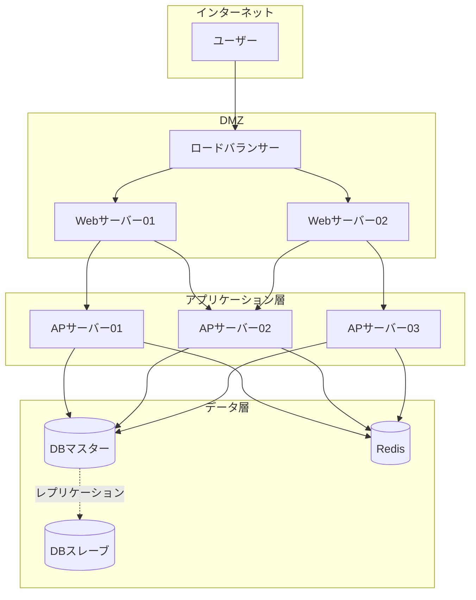
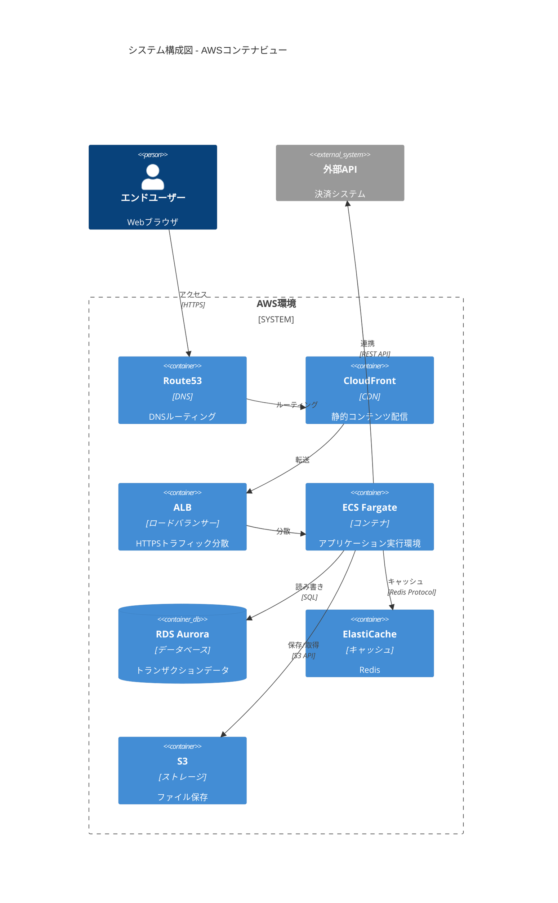
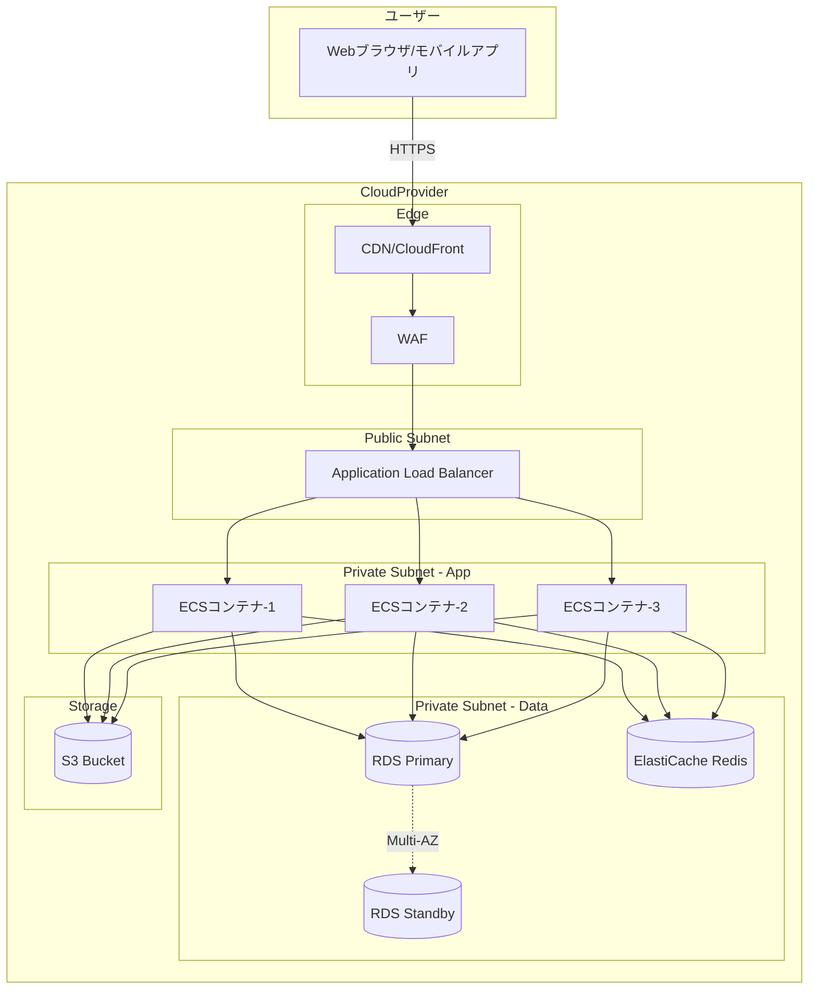
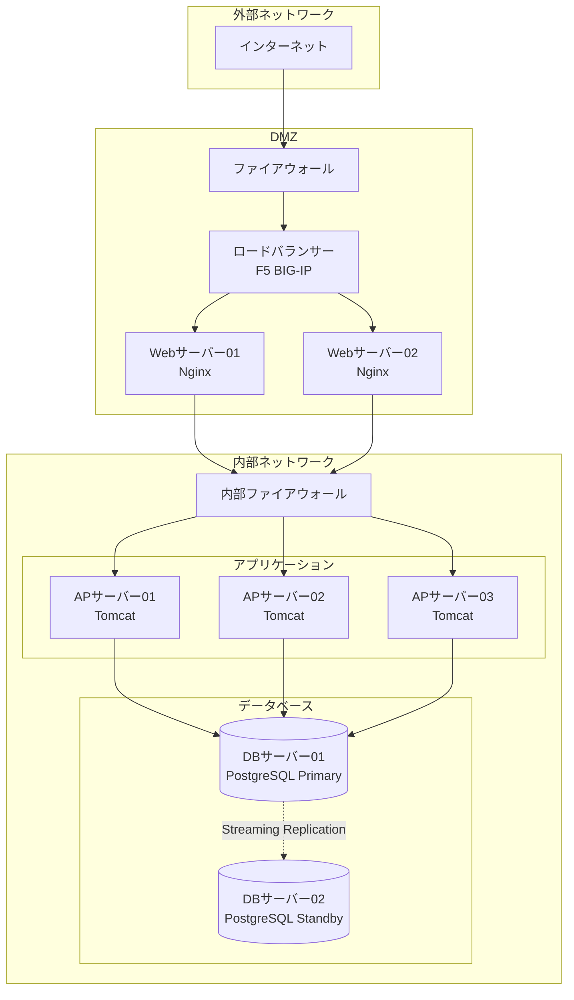

# システム構成図作成ルール

**ドキュメント分類:** 基本設計書  
**バージョン:** 1.0  
**最終更新日:** 2025-10-30

---

## 📋 1. 基本情報

### ドキュメント名
システム構成図 (System Architecture Diagram)

### 目的
- システム全体の物理的・論理的な構成を視覚的に表現する
- サーバー、ネットワーク、ミドルウェア、アプリケーションの配置を明示する
- システムの各コンポーネント間の関係性と通信経路を明確にする
- 非機能要件（可用性、拡張性、セキュリティ）の実現方法を示す

### 対象読者
- **主要読者**: システムアーキテクト、インフラエンジニア、開発リーダー
- **副次読者**: プロジェクトマネージャー、セキュリティ担当者、運用担当者

### 関連成果物
- **入力**: 要件定義書、非機能要件定義書、アーキテクチャ設計書
- **出力**: 詳細設計書、インフラ構築手順書、運用手順書

---

## ⏰ 2. 作成タイミングと前提条件

### 作成タイミング
- **開始**: 基本設計フェーズ開始直後（要件定義完了後）
- **完了**: 基本設計レビュー前
- **更新**: システム構成変更時に随時更新

### 前提条件
以下の成果物が完成していること:
- [ ] 要件定義書（機能要件）
- [ ] 非機能要件定義書（性能、可用性、拡張性）
- [ ] システム化範囲の明確化
- [ ] 概算インフラ予算の確定

### 作成にかかる標準期間
- **小規模システム**: 3-5日
- **中規模システム**: 1-2週間
- **大規模システム**: 2-3週間

---

## 📐 3. ドキュメント構成

### 必須セクション

#### 3.1 ドキュメント情報
- タイトル
- バージョン番号
- 作成日・更新日
- 作成者・承認者

#### 3.2 システム概要
- システムの目的
- システム化範囲
- 想定ユーザー数・トランザクション量

#### 3.3 全体構成図
- **論理構成図**: システムの論理的な階層構造
- **物理構成図**: 実際のサーバー配置とネットワーク構成
- **デプロイ構成図**: アプリケーションのデプロイ先

#### 3.4 ネットワーク構成
- ネットワークセグメント
- ファイアウォール配置
- ロードバランサー配置
- DMZ構成（必要な場合）

#### 3.5 コンポーネント一覧
| コンポーネント名 | 種別 | 役割 | スペック | 冗長化 | 備考 |
|----------------|------|------|---------|--------|------|
| Webサーバー | AP | フロントエンド | 4CPU/16GB | 2台構成 | Nginx |
| APサーバー | AP | ビジネスロジック | 8CPU/32GB | 3台構成 | - |

#### 3.6 通信フロー
- クライアント→システム間の通信
- システム内部の通信
- 外部システム連携の通信

#### 3.7 セキュリティ構成
- 認証・認可の仕組み
- 暗号化方式
- アクセス制御

#### 3.8 可用性・冗長化構成
- 冗長化方式（Active-Active / Active-Standby）
- フェイルオーバー方式
- バックアップ構成

---

## ✍️ 4. 記載ルール

### 4.1 表記規則

#### 図の表記ルール
- **Mermaid記法を使用**: Markdown内で図を表現
- **C4モデルの採用**: コンテキスト図、コンテナ図、コンポーネント図の3層
- **統一された記号**: 標準的なUML記法またはAWS/Azureアイコン

#### 配色ルール
- **フロントエンド層**: 青系（#3498db）
- **アプリケーション層**: 緑系（#2ecc71）
- **データ層**: オレンジ系（#e67e22）
- **外部システム**: グレー系（#95a5a6）
- **セキュリティ境界**: 赤系（#e74c3c）

### 4.2 命名規則

#### サーバー命名規則
```
[環境]-[役割]-[連番]
例: prd-web-01, stg-ap-02, dev-db-01
```

#### ネットワークセグメント命名規則
```
[用途]-[セグメント種別]
例: public-subnet, private-app-subnet, private-db-subnet
```

### 4.3 図表の使用ルール

#### Mermaidによる構成図例


#### AWS構成図の例（C4モデル - コンテナレベル）


### 4.4 サンプルテンプレート

#### コンポーネント詳細テーブル
| 項目 | 内容 |
|-----|------|
| **コンポーネント名** | Webサーバー |
| **役割** | フロントエンド、静的コンテンツ配信、リバースプロキシ |
| **ソフトウェア** | Nginx 1.24 |
| **スペック** | 4 vCPU, 16GB RAM, 100GB SSD |
| **OS** | Ubuntu 22.04 LTS |
| **台数** | 2台（Active-Active） |
| **配置場所** | パブリックサブネット（AZ-a, AZ-c） |
| **冗長化方式** | ALBによる負荷分散 |
| **監視項目** | CPU使用率、メモリ使用率、リクエスト数、エラー率 |

---

## ✅ 5. 品質基準

### 5.1 完成度チェックリスト

#### 必須要素
- [ ] システム全体像が一目で理解できる
- [ ] すべてのコンポーネントが図示されている
- [ ] ネットワークセグメントが明確に分離されている
- [ ] 通信経路とプロトコルが明記されている
- [ ] 冗長化構成が明示されている
- [ ] セキュリティ境界が明確である
- [ ] スケールアウト方針が示されている
- [ ] バックアップ構成が含まれている

#### 品質指標
- [ ] 非機能要件との整合性が取れている
- [ ] 単一障害点（SPOF）が存在しないか確認済み
- [ ] コスト見積もりと整合している
- [ ] 運用負荷が適切な範囲である

### 5.2 レビュー観点

#### アーキテクチャレビュー
- [ ] **可用性**: SLA要件を満たす冗長化構成か
- [ ] **拡張性**: 将来のトラフィック増加に対応可能か
- [ ] **性能**: 性能要件を満たすスペック・構成か
- [ ] **セキュリティ**: セキュリティ要件を満たしているか
- [ ] **保守性**: 運用・保守が容易な構成か
- [ ] **コスト**: 予算内に収まる構成か

#### 技術レビュー
- [ ] 技術選定の妥当性
- [ ] ベストプラクティスに準拠しているか
- [ ] ベンダーロックインのリスク評価
- [ ] ライセンス要件の確認

### 5.3 承認基準
- システムアーキテクトの承認
- インフラ責任者の承認
- セキュリティ担当者の承認
- プロジェクトマネージャーの承認

---

## 🤖 6. AI作成時の具体的指示

### 6.1 必須記載項目

AIがシステム構成図を作成する際は、以下を必ず含めること:

1. **3層アーキテクチャの明示**
   ```
   - プレゼンテーション層（Webサーバー）
   - アプリケーション層（APサーバー）
   - データ層（DBサーバー）
   ```

2. **冗長化構成の明記**
   - 各層の台数と配置
   - フェイルオーバー方式
   - ロードバランサーの配置

3. **セキュリティ対策**
   - ファイアウォール配置
   - 通信の暗号化
   - DMZ構成（必要に応じて）

4. **具体的なスペック**
   - CPU/メモリ/ストレージ
   - OS/ミドルウェアのバージョン
   - ネットワーク帯域

### 6.2 避けるべき表現

❌ **NG例**:
- "適切なスペックのサーバー" → ✅ "8 vCPU, 32GB RAM"
- "高可用性構成" → ✅ "Active-Active 2台構成、ALBで負荷分散"
- "十分なセキュリティ対策" → ✅ "WAF導入、SSL/TLS 1.3、IPホワイトリスト"
- "必要に応じて拡張可能" → ✅ "Auto Scaling設定、最小2台〜最大10台"

### 6.3 推奨される構成

#### クラウド環境の場合


#### オンプレミス環境の場合


### 6.4 具体例の提示方法

#### 例1: ECサイトのシステム構成図
```
【システム概要】
- 想定ユーザー数: 10万人/月
- ピーク時同時接続: 1,000セッション
- 可用性要件: 99.9%

【構成】
- フロント: CloudFront + S3（静的コンテンツ）
- Web層: ALB + ECS Fargate (2-10台 Auto Scaling)
- App層: ECS Fargate (4-20台 Auto Scaling)
- DB層: RDS Aurora (Primary + Read Replica 2台)
- Cache: ElastiCache Redis (2ノードクラスタ)
- 監視: CloudWatch + SNS
```

---

## 📚 7. 関連ドキュメント

### 参照すべき成果物
- [要件定義書](../../02_要件定義/要件定義書作成ルール.md)
- [非機能要件定義書](../../02_要件定義/非機能要件定義書作成ルール.md)
- [アーキテクチャ設計書](./アーキテクチャ設計書作成ルール.md)
- [セキュリティ設計書](./セキュリティ設計書作成ルール.md)

### 次工程で使用される成果物
- [詳細設計書](../../04_詳細設計/詳細設計書作成ルール.md)
- [インフラ構築手順書](../../07_運用保守/運用手順書作成ルール.md)
- [運用手順書](../../07_運用保守/運用手順書作成ルール.md)
- [障害対応手順書](../../07_運用保守/障害対応手順書作成ルール.md)

---

## ⚠️ 8. よくある失敗例と対策

| 失敗例 | 原因 | 対策 |
|--------|------|------|
| **SPOF（単一障害点）の存在** | 冗長化が不十分 | すべての層で冗長化を検討、クリティカルパスを特定 |
| **過剰なスペック** | 非機能要件の誤解 | 実際のトラフィック予測に基づいた適切なサイジング |
| **セキュリティ境界が不明確** | セキュリティ設計の不足 | DMZ、ファイアウォールルール、通信経路を明記 |
| **スケーラビリティ不足** | 固定構成のみを想定 | Auto Scaling、水平スケールの方針を明記 |
| **バックアップ構成の欠如** | バックアップ要件の見落とし | RTO/RPOに基づくバックアップ戦略を明記 |
| **監視・ログ設計の欠如** | 運用フェーズの考慮不足 | 監視項目、ログ収集方法を明記 |
| **コスト超過** | クラウドコストの見積もり不足 | コスト見積もりツールで事前検証 |
| **ベンダーロックイン** | 特定クラウドへの依存 | マルチクラウド戦略、またはポータビリティを考慮 |

---

## 📝 補足: C4モデルについて

システム構成図は、C4モデルの「コンテナ図」レベルで作成することを推奨します。

- **レベル1 - コンテキスト図**: システム全体と外部システムの関係
- **レベル2 - コンテナ図**: システム内のサーバー・サービス配置 ← **このレベルで作成**
- **レベル3 - コンポーネント図**: 各サービス内部の詳細構成
- **レベル4 - コード図**: クラス図レベル

---

**バージョン履歴**
- v1.0 (2025-10-30): 初版作成
