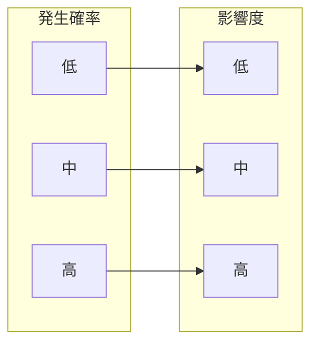
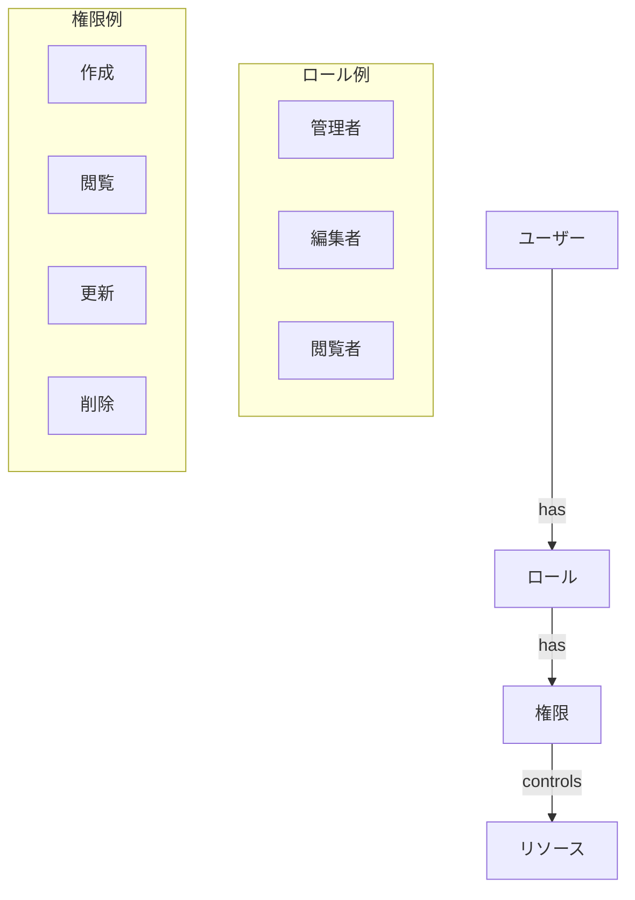
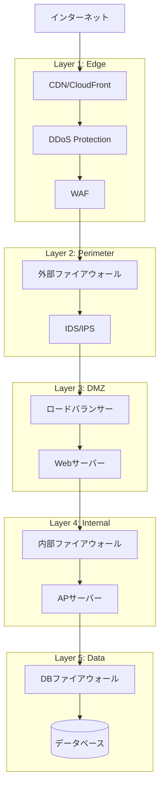

# セキュリティ設計書作成ルール

**ドキュメント分類:** 基本設計書  
**バージョン:** 1.0  
**最終更新日:** 2025-10-30

---

## 📋 1. 基本情報

### ドキュメント名
セキュリティ設計書 (Security Design Document)

### 目的
- システムのセキュリティ対策を包括的に定義する
- 脅威と脆弱性を特定し、対策を明確にする
- 認証・認可・暗号化などのセキュリティ機構を設計する
- セキュリティ要件の実装方法を具体化する

### 対象読者
- **主要読者**: セキュリティアーキテクト、システムアーキテクト、開発リーダー
- **副次読者**: インフラエンジニア、監査担当者、CISO

### 関連成果物
- **入力**: 非機能要件定義書、システム構成図、アーキテクチャ設計書
- **出力**: 詳細設計書、セキュリティテスト仕様書、運用手順書

---

## ⏰ 2. 作成タイミングと前提条件

### 作成タイミング
- **開始**: 基本設計フェーズ序盤（アーキテクチャ確定後）
- **完了**: 基本設計レビュー前
- **更新**: セキュリティ要件変更時、脆弱性発見時

### 前提条件
- [ ] 非機能要件（セキュリティ要件）完成
- [ ] システム構成図完成
- [ ] 脅威分析（STRIDE等）完了
- [ ] コンプライアンス要件の明確化

### 作成にかかる標準期間
- **小規模**: 1週間
- **中規模**: 2-3週間
- **大規模**: 3-4週間

---

## 📐 3. ドキュメント構成

### 必須セクション

#### 3.1 セキュリティ方針
- セキュリティ目標（機密性、完全性、可用性）
- セキュリティバイデザインの原則
- 適用する規格・標準（ISO 27001, OWASP等）
- コンプライアンス要件（GDPR, 個人情報保護法等）

#### 3.2 脅威分析

##### 3.2.1 STRIDE分析
| 脅威分類 | 脅威内容 | 影響度 | 対策 |
|---------|---------|--------|------|
| **S**poofing（なりすまし） | 不正なユーザー認証 | 高 | 多要素認証、JWT |
| **T**ampering（改ざん） | データベースの不正変更 | 高 | 入力検証、監査ログ |
| **R**epudiation（否認） | 取引の否認 | 中 | デジタル署名、監査ログ |
| **I**nformation Disclosure（情報漏洩） | 個人情報の不正閲覧 | 高 | 暗号化、アクセス制御 |
| **D**enial of Service（サービス拒否） | DDoS攻撃 | 中 | レート制限、WAF |
| **E**levation of Privilege（権限昇格） | 管理者権限の不正取得 | 高 | 最小権限の原則、RBAC |

##### 3.2.2 リスクマトリクス


#### 3.3 認証・認可設計

##### 3.3.1 認証方式
| 認証方法 | 適用箇所 | 実装方式 |
|---------|---------|---------|
| **ID/パスワード認証** | 一般ユーザーログイン | bcryptハッシュ（コスト12） |
| **多要素認証（MFA）** | 管理者ログイン | TOTP（Time-based OTP） |
| **OAuth 2.0** | 外部サービス連携 | Authorization Code Flow |
| **API Key** | 外部システム連携 | SHA-256ハッシュ、定期ローテーション |

##### 3.3.2 認可方式（RBAC: Role-Based Access Control）


**ロール定義**
| ロール | 権限 | 対象リソース |
|-------|------|------------|
| 管理者 | CRUD | すべて |
| 編集者 | CRU | 記事、商品 |
| 閲覧者 | R | すべて（個人情報除く） |

#### 3.4 データ保護

##### 3.4.1 暗号化方式
| データ種別 | 暗号化方式 | 鍵管理 |
|-----------|-----------|--------|
| **保存データ** | AES-256-GCM | AWS KMS / Azure Key Vault |
| **通信データ** | TLS 1.3 | Let's Encrypt証明書 |
| **パスワード** | bcrypt (cost 12) | - |
| **個人情報** | AES-256-GCM | 専用暗号鍵（定期ローテーション） |
| **クレジットカード** | トークン化 | 外部決済サービス |

##### 3.4.2 個人情報保護
```
【個人情報の定義】
- 氏名、メールアドレス、電話番号、住所
- 生年月日、性別
- 購入履歴、閲覧履歴

【保護措置】
1. データベース暗号化（AES-256）
2. アクセスログの記録
3. 最小権限の原則（必要最小限のアクセス）
4. 個人情報の定期的な削除（保存期間経過後）
```

#### 3.5 ネットワークセキュリティ

##### 3.5.1 多層防御


##### 3.5.2 ファイアウォールルール
| # | ソース | 宛先 | ポート | プロトコル | アクション | 用途 |
|---|--------|------|--------|-----------|----------|------|
| 1 | Any | DMZ | 443 | TCP | ALLOW | HTTPS通信 |
| 2 | DMZ | App | 8080 | TCP | ALLOW | Web→App通信 |
| 3 | App | DB | 5432 | TCP | ALLOW | App→DB通信 |
| 4 | Any | Any | * | * | DENY | デフォルト拒否 |

#### 3.6 セキュリティ監視

##### 3.6.1 監査ログ
記録すべきイベント:
- ログイン成功/失敗
- 権限変更
- データ変更（作成/更新/削除）
- 管理者操作
- セキュリティイベント（不正アクセス検知等）

**ログフォーマット**
```json
{
  "timestamp": "2025-10-30T10:00:00Z",
  "event_type": "user_login",
  "user_id": 12345,
  "user_email": "user@example.com",
  "ip_address": "192.0.2.1",
  "user_agent": "Mozilla/5.0...",
  "result": "success",
  "session_id": "abc123..."
}
```

##### 3.6.2 セキュリティ監視項目
| 監視項目 | 閾値 | アラート |
|---------|------|---------|
| ログイン失敗回数 | 5回/5分 | アカウントロック |
| API呼び出し回数 | 1000回/分 | レート制限 |
| 大量データ取得 | 10,000件/リクエスト | 不正検知アラート |
| 管理者権限変更 | - | 即時通知 |

#### 3.7 入力検証とサニタイゼーション

##### 3.7.1 入力検証
すべての入力に対して以下を実施:
1. **ホワイトリスト検証**: 許可する文字種・パターンのみ受付
2. **長さチェック**: 最大長の制限
3. **型チェック**: データ型の検証
4. **範囲チェック**: 数値の範囲検証

##### 3.7.2 脆弱性対策
| 脆弱性 | 対策 |
|--------|------|
| **SQLインジェクション** | プリペアドステートメント、ORM使用 |
| **XSS** | 出力時エスケープ、Content Security Policy |
| **CSRF** | CSRFトークン、SameSite Cookie |
| **パストラバーサル** | パス正規化、ホワイトリスト |
| **XXE** | 外部エンティティ無効化 |
| **SSRF** | URLホワイトリスト、内部ネットワーク隔離 |

#### 3.8 セキュリティヘッダー

必須HTTPセキュリティヘッダー:
```
Strict-Transport-Security: max-age=31536000; includeSubDomains
Content-Security-Policy: default-src 'self'; script-src 'self' 'unsafe-inline'
X-Frame-Options: DENY
X-Content-Type-Options: nosniff
X-XSS-Protection: 1; mode=block
Referrer-Policy: strict-origin-when-cross-origin
Permissions-Policy: geolocation=(), microphone=(), camera=()
```

---

## ✍️ 4. 記載ルール

### 4.1 OWASP Top 10への対策

各脆弱性に対する具体的な対策を記載:
1. Broken Access Control → RBAC実装、最小権限
2. Cryptographic Failures → TLS 1.3、AES-256
3. Injection → パラメータ化クエリ
4. Insecure Design → 脅威モデリング
5. Security Misconfiguration → セキュリティ設定の自動化
6. Vulnerable Components → 依存関係の定期更新
7. Identification and Authentication Failures → MFA、強力なパスワードポリシー
8. Software and Data Integrity Failures → コード署名、改ざん検知
9. Security Logging and Monitoring Failures → 包括的な監査ログ
10. Server-Side Request Forgery → URLホワイトリスト

---

## ✅ 5. 品質基準

### 5.1 完成度チェックリスト

- [ ] すべての脅威が識別されている
- [ ] 各脅威に対する対策が定義されている
- [ ] 認証・認可方式が具体的である
- [ ] 暗号化方式とアルゴリズムが明記されている
- [ ] 監査ログ要件が定義されている
- [ ] OWASP Top 10への対策が網羅されている
- [ ] コンプライアンス要件が満たされている

---

## 🤖 6. AI作成時の具体的指示

### 6.1 必須記載項目

1. **脅威ごとの対策**
   - 脅威の識別
   - リスクレベル
   - 具体的な対策
   - 実装方法

2. **暗号化の詳細**
   - アルゴリズム名
   - 鍵長
   - 鍵管理方法

### 6.2 避けるべき表現

❌ "適切な暗号化" → ✅ "AES-256-GCM"
❌ "強力な認証" → ✅ "bcrypt (cost 12) + TOTP多要素認証"

---

## 📚 7. 関連ドキュメント

- [非機能要件定義書](../../02_要件定義/非機能要件定義書作成ルール.md)
- [システム構成図](./システム構成図作成ルール.md)

---

## ⚠️ 8. よくある失敗例と対策

| 失敗例 | 原因 | 対策 |
|--------|------|------|
| **暗号化の不足** | コスト優先 | 個人情報は必ず暗号化 |
| **脆弱な認証** | ユーザビリティ優先 | MFA導入 |
| **監査ログ不足** | 要件の見落とし | OWASP指針に従う |

---

**バージョン履歴**
- v1.0 (2025-10-30): 初版作成
