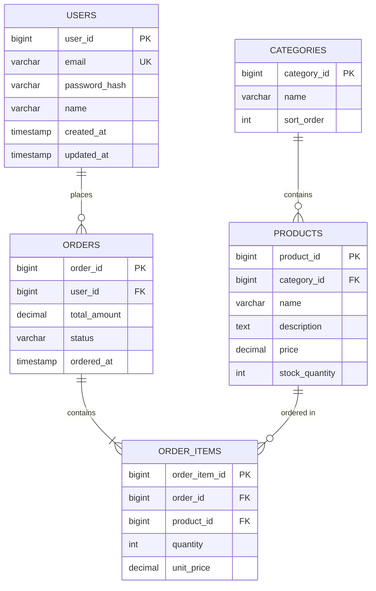

# データベース設計書作成ルール

**ドキュメント分類:** 基本設計書  
**バージョン:** 1.0  
**最終更新日:** 2025-10-30

---

## 📋 1. 基本情報

### ドキュメント名
データベース設計書 (Database Design Document) - 論理設計

### 目的
- データベースの論理的な構造を定義する
- テーブル、カラム、リレーションシップを明確にする
- データ整合性とパフォーマンスの基盤を確立する
- データモデルを開発チーム全体で共有する

### 対象読者
- **主要読者**: DBエンジニア、データアーキテクト、開発リーダー
- **副次読者**: システムアーキテクト、アプリケーション開発者

### 関連成果物
- **入力**: 要件定義書、機能要件定義書、業務フロー図
- **出力**: 物理DB設計書、詳細設計書、テストデータ定義書

---

## ⏰ 2. 作成タイミングと前提条件

### 作成タイミング
- **開始**: 基本設計フェーズ中盤（画面設計と並行）
- **完了**: 基本設計レビュー前
- **更新**: データモデル変更時に随時更新

### 前提条件
- [ ] 機能要件定義書完成
- [ ] 業務フロー図完成
- [ ] エンティティの洗い出し完了
- [ ] データベース製品の選定完了

### 作成にかかる標準期間
- **小規模（〜20テーブル）**: 3-5日
- **中規模（20-50テーブル）**: 1-2週間
- **大規模（50テーブル〜）**: 2-4週間

---

## 📐 3. ドキュメント構成

### 必須セクション

#### 3.1 データベース概要
- データベース名
- DBMS製品とバージョン
- 文字コード・照合順序
- 想定データ量

#### 3.2 ER図（Entity-Relationship Diagram）
全体のテーブル関係を視覚化



#### 3.3 テーブル定義書

各テーブルごとに以下を記載:

##### テーブル基本情報
| 項目 | 内容 |
|-----|------|
| **物理名** | `users` |
| **論理名** | ユーザー |
| **用途** | システム利用者情報を管理 |
| **想定レコード数** | 初期: 10,000件、3年後: 100,000件 |
| **更新頻度** | 参照: 高、更新: 中 |

##### カラム定義
| # | 物理名 | 論理名 | データ型 | NULL | デフォルト | 制約 | 説明 |
|---|--------|--------|---------|------|-----------|------|------|
| 1 | user_id | ユーザーID | BIGINT | NO | AUTO_INCREMENT | PK | 主キー |
| 2 | email | メールアドレス | VARCHAR(255) | NO | - | UK | ログインID |
| 3 | password_hash | パスワードハッシュ | VARCHAR(255) | NO | - | - | bcrypt |
| 4 | name | 氏名 | VARCHAR(100) | NO | - | - | 表示名 |
| 5 | phone | 電話番号 | VARCHAR(20) | YES | NULL | - | ハイフンなし |
| 6 | status | ステータス | VARCHAR(20) | NO | 'active' | CHK | active/inactive/deleted |
| 7 | created_at | 作成日時 | TIMESTAMP | NO | CURRENT_TIMESTAMP | - | レコード作成時刻 |
| 8 | updated_at | 更新日時 | TIMESTAMP | NO | CURRENT_TIMESTAMP | - | ON UPDATE設定 |

##### 制約定義
| 制約種別 | 制約名 | 対象カラム | 内容 |
|---------|--------|-----------|------|
| PRIMARY KEY | pk_users | user_id | 主キー |
| UNIQUE | uk_users_email | email | メールアドレス一意 |
| CHECK | chk_users_status | status | IN ('active', 'inactive', 'deleted') |
| INDEX | idx_users_status | status | ステータス検索用 |

##### リレーションシップ
| 関連テーブル | カーディナリティ | 外部キー | 参照カラム | 削除時動作 |
|-------------|----------------|---------|-----------|-----------|
| orders | 1:N | fk_orders_user | user_id | CASCADE |

#### 3.4 正規化の検証
- 第1正規形（1NF）の確認
- 第2正規形（2NF）の確認
- 第3正規形（3NF）の確認
- 非正規化の判断（パフォーマンス要件がある場合）

#### 3.5 命名規則
- **テーブル名**: 小文字スネークケース、複数形（`users`, `order_items`）
- **カラム名**: 小文字スネークケース（`user_id`, `created_at`）
- **主キー**: `{テーブル名単数形}_id` (例: `user_id`)
- **外部キー**: `{参照テーブル名単数形}_id` (例: `user_id`)
- **インデックス**: `idx_{テーブル名}_{カラム名}` (例: `idx_users_email`)
- **制約**: `{種別}_{テーブル名}_{カラム名}` (例: `chk_users_status`)

#### 3.6 データ型の標準
| 用途 | データ型 | 備考 |
|-----|---------|------|
| ID（主キー） | BIGINT | AUTO_INCREMENT |
| 金額 | DECIMAL(10,2) | 精度が重要 |
| 日時 | TIMESTAMP | タイムゾーン対応 |
| 日付 | DATE | 時刻不要の場合 |
| フラグ | BOOLEAN | true/false |
| ステータス | VARCHAR(20) | ENUMは避ける（拡張性） |
| テキスト（短） | VARCHAR(255) | 255以下 |
| テキスト（長） | TEXT | 長文用 |

---

## ✍️ 4. 記載ルール

### 4.1 ER図の記法

#### Crow's Foot 記法を使用
- **1対1**: `||--||`
- **1対多**: `||--o{`
- **多対多**: `}o--o{`

#### エンティティの分類
- **強いエンティティ**: 独立して存在（`USERS`, `PRODUCTS`）
- **弱いエンティティ**: 親エンティティに依存（`ORDER_ITEMS`）
- **連関エンティティ**: 多対多の仲介（`USER_ROLES`）

### 4.2 テーブル設計のベストプラクティス

#### 必須カラム（監査証跡）
すべてのテーブルに以下を含めること:
```sql
created_at TIMESTAMP NOT NULL DEFAULT CURRENT_TIMESTAMP
updated_at TIMESTAMP NOT NULL DEFAULT CURRENT_TIMESTAMP ON UPDATE CURRENT_TIMESTAMP
created_by BIGINT NULL  -- 作成者（任意）
updated_by BIGINT NULL  -- 更新者（任意）
```

#### 論理削除の実装
物理削除ではなく論理削除を推奨:
```sql
deleted_at TIMESTAMP NULL DEFAULT NULL
is_deleted BOOLEAN NOT NULL DEFAULT FALSE
```

#### 楽観的ロックの実装
```sql
version INT NOT NULL DEFAULT 0
```

### 4.3 インデックス設計の指針

#### インデックスを作成すべきカラム
- 主キー（自動作成）
- 外部キー
- WHERE句で頻繁に使用するカラム
- JOIN条件で使用するカラム
- ORDER BY で使用するカラム

#### インデックスを避けるべきケース
- カーディナリティが低いカラム（性別など）
- 更新頻度が非常に高いテーブル
- 小規模なテーブル（数百件程度）

---

## ✅ 5. 品質基準

### 5.1 完成度チェックリスト

#### 正規化
- [ ] 第3正規形（3NF）まで正規化されている
- [ ] 非正規化の判断が文書化されている

#### 整合性
- [ ] すべての外部キー制約が定義されている
- [ ] 必要なUNIQUE制約が設定されている
- [ ] CHECK制約で業務ルールが実装されている

#### 命名
- [ ] 命名規則が統一されている
- [ ] 略語が適切に使用されている
- [ ] 予約語が避けられている

#### パフォーマンス
- [ ] 主要な検索条件にインデックスが設定されている
- [ ] カーディナリティが考慮されている
- [ ] パーティショニング要否が判断されている

### 5.2 レビュー観点

#### データモデリング
- [ ] エンティティの粒度は適切か
- [ ] リレーションシップは正確か
- [ ] 多対多関係が適切に解消されているか

#### パフォーマンス
- [ ] 想定データ量でのパフォーマンスは十分か
- [ ] インデックス戦略は適切か
- [ ] クエリの実行計画を確認したか

---

## 🤖 6. AI作成時の具体的指示

### 6.1 必須記載項目

1. **完全なER図**
   - すべてのテーブルを含む
   - リレーションシップを明記
   - カーディナリティを正確に

2. **詳細なテーブル定義**
   ```
   各テーブルごとに:
   - テーブル基本情報
   - 全カラムの定義
   - すべての制約
   - インデックス設計
   - 想定データ量
   ```

3. **正規化の根拠**
   - どの正規形まで適用したか
   - 非正規化した箇所とその理由

### 6.2 避けるべき表現

❌ **NG例**:
- "適切なインデックス" → ✅ "`idx_users_email` on `email` (検索頻度: 高)"
- "必要なカラム" → ✅ "user_id, email, password_hash, name, created_at, updated_at"
- "関連テーブル" → ✅ "`orders` (1:N, FK: user_id, ON DELETE CASCADE)"

### 6.3 具体例

#### マスターテーブルの例
```sql
CREATE TABLE categories (
    category_id BIGINT AUTO_INCREMENT,
    name VARCHAR(100) NOT NULL,
    slug VARCHAR(100) NOT NULL,
    parent_id BIGINT NULL,
    sort_order INT NOT NULL DEFAULT 0,
    is_active BOOLEAN NOT NULL DEFAULT TRUE,
    created_at TIMESTAMP NOT NULL DEFAULT CURRENT_TIMESTAMP,
    updated_at TIMESTAMP NOT NULL DEFAULT CURRENT_TIMESTAMP ON UPDATE CURRENT_TIMESTAMP,
    
    PRIMARY KEY (category_id),
    UNIQUE KEY uk_categories_slug (slug),
    KEY idx_categories_parent (parent_id),
    KEY idx_categories_active (is_active),
    
    FOREIGN KEY fk_categories_parent (parent_id) 
        REFERENCES categories(category_id) 
        ON DELETE SET NULL
) ENGINE=InnoDB DEFAULT CHARSET=utf8mb4 COLLATE=utf8mb4_unicode_ci;
```

---

## 📚 7. 関連ドキュメント

### 参照すべき成果物
- [機能要件定義書](../../02_要件定義/機能要件定義書作成ルール.md)
- [業務フロー図](../../02_要件定義/業務フロー図作成ルール.md)

### 次工程で使用される成果物
- [物理DB設計書](../../04_詳細設計/物理DB設計書作成ルール.md)
- [詳細設計書](../../04_詳細設計/詳細設計書作成ルール.md)

---

## ⚠️ 8. よくある失敗例と対策

| 失敗例 | 原因 | 対策 |
|--------|------|------|
| **過度な正規化** | 教科書的な設計 | パフォーマンス要件を考慮、適度な非正規化 |
| **外部キー未定義** | 整合性への意識不足 | すべてのリレーションシップに外部キー制約 |
| **NULLの乱用** | デフォルト値の未設定 | 可能な限りNOT NULL + DEFAULT設定 |
| **文字コード不統一** | 設定漏れ | utf8mb4統一、絵文字対応 |
| **インデックス不足** | 性能テスト未実施 | スロークエリログで検証 |

---

**バージョン履歴**
- v1.0 (2025-10-30): 初版作成
