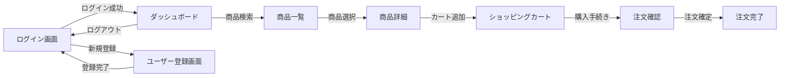

# 画面設計書作成ルール

**ドキュメント分類:** 基本設計書  
**バージョン:** 1.0  
**最終更新日:** 2025-10-30

---

## 📋 1. 基本情報

### ドキュメント名
画面設計書 (Screen Design Document / UI Design Specification)

### 目的
- ユーザーインターフェースの構造と動作を定義する
- 画面レイアウト、画面遷移、入力検証ルールを明確にする
- 開発チームとステークホルダー間で画面イメージを共有する
- UI/UXの一貫性を確保する

### 対象読者
- **主要読者**: UI/UXデザイナー、フロントエンド開発者
- **副次読者**: ビジネスアナリスト、テスター、プロジェクトマネージャー

### 関連成果物
- **入力**: 機能要件定義書、ユースケース図、業務フロー図
- **出力**: 詳細設計書、テスト仕様書、ユーザーマニュアル

---

## ⏰ 2. 作成タイミングと前提条件

### 作成タイミング
- **開始**: 基本設計フェーズ序盤（機能要件確定後）
- **完了**: プロトタイプレビュー完了後
- **更新**: UI変更時に随時更新

### 前提条件
- [ ] 機能要件定義書完成
- [ ] ユースケース定義完成
- [ ] 画面一覧の洗い出し完了
- [ ] デザインガイドライン策定（あれば）

### 作成にかかる標準期間
- **小規模（〜20画面）**: 1-2週間
- **中規模（20-50画面）**: 2-4週間
- **大規模（50画面〜）**: 4-8週間

---

## 📐 3. ドキュメント構成

### 必須セクション

#### 3.1 画面一覧
| 画面ID | 画面名 | 分類 | 概要 | 利用ユーザー | 優先度 |
|--------|--------|------|------|-------------|--------|
| SCR-001 | ログイン画面 | 認証 | システムログイン | 全ユーザー | 高 |
| SCR-002 | ダッシュボード | メイン | ユーザーホーム | 登録ユーザー | 高 |
| SCR-003 | 商品一覧 | 商品 | 商品検索・一覧表示 | 全ユーザー | 高 |

#### 3.2 画面遷移図


#### 3.3 画面詳細定義

各画面ごとに以下を記載:

##### 3.3.1 画面基本情報
| 項目 | 内容 |
|-----|------|
| **画面ID** | SCR-003 |
| **画面名** | 商品一覧画面 |
| **URL/パス** | `/products` |
| **アクセス権限** | 全ユーザー（未ログイン可） |
| **表示条件** | なし |

##### 3.3.2 画面レイアウト

```
┌─────────────────────────────────────────────────┐
│ ヘッダー                                        │
│ [ロゴ]  [検索バー]    [カート] [ログイン]      │
├─────────────────────────────────────────────────┤
│ │                                               │
│ │ カテゴリ                                      │
│ │ □ 電子機器                                    │
│ │ □ ファッション                                │
│ │ □ 書籍                                        │
│ │                                               │
│ │ 価格帯                                        │
│ │ [   ] 〜 [   ] 円                            │
│ │ [適用]                                        │
│ │                                               │
├─┼───────────────────────────────────────────────┤
│ │  検索結果: 125件                              │
│ │  ソート: [人気順 ▼]                           │
│ │                                               │
│ │  ┌─────┐ ┌─────┐ ┌─────┐                    │
│ │  │商品1│ │商品2│ │商品3│                    │
│ │  │画像 │ │画像 │ │画像 │                    │
│ │  │     │ │     │ │     │                    │
│ │  │商品名│ │商品名│ │商品名│                  │
│ │  │¥999 │ │¥999 │ │¥999 │                   │
│ │  │[詳細]│ │[詳細]│ │[詳細]│                  │
│ │  └─────┘ └─────┘ └─────┘                    │
│ │                                               │
│ │  [前へ] 1 2 3 ... 10 [次へ]                   │
└─┴───────────────────────────────────────────────┘
│ フッター                                        │
└─────────────────────────────────────────────────┘
```

##### 3.3.3 画面項目定義
| No | 項目ID | 項目名 | 種別 | 必須 | 初期値 | 入力制約 | 説明 |
|----|--------|--------|------|------|--------|---------|------|
| 1 | search_keyword | 検索キーワード | テキスト | - | 空 | 最大100文字 | 商品名・説明文を検索 |
| 2 | category_filter | カテゴリ | チェックボックス | - | 全選択 | 複数選択可 | カテゴリ絞り込み |
| 3 | price_min | 最低価格 | 数値 | - | 空 | 0以上 | 価格下限 |
| 4 | price_max | 最高価格 | 数値 | - | 空 | 0以上 | 価格上限 |
| 5 | sort_order | ソート順 | ドロップダウン | ○ | 人気順 | 固定選択肢 | 人気順/新着順/価格順 |

##### 3.3.4 イベント定義
| No | イベント名 | トリガー | 処理内容 | 遷移先 |
|----|-----------|---------|---------|--------|
| 1 | 検索実行 | [検索]ボタン押下 | 検索条件でAPI呼び出し、結果を表示 | - |
| 2 | カテゴリ選択 | チェックボックス変更 | 自動的に検索実行 | - |
| 3 | 商品詳細表示 | [詳細]ボタン押下 | 商品詳細画面へ遷移 | SCR-004 |
| 4 | ページング | [次へ]ボタン押下 | 次ページの商品を取得・表示 | - |

##### 3.3.5 バリデーションルール
| 項目 | ルール | エラーメッセージ |
|-----|--------|-----------------|
| price_min | 数値、0以上 | "最低価格は0以上の数値を入力してください" |
| price_max | 数値、price_min以上 | "最高価格は最低価格以上を入力してください" |
| search_keyword | 最大100文字 | "検索キーワードは100文字以内で入力してください" |

##### 3.3.6 メッセージ定義
| メッセージID | 種別 | メッセージ内容 | 表示条件 |
|-------------|------|---------------|---------|
| MSG-001 | 情報 | "検索結果: {件数}件が見つかりました" | 検索実行後 |
| MSG-002 | 警告 | "該当する商品が見つかりませんでした" | 検索結果0件 |
| MSG-003 | エラー | "検索処理に失敗しました。時間をおいて再度お試しください" | API呼び出しエラー |

##### 3.3.7 API連携
| API名 | メソッド | エンドポイント | パラメータ | レスポンス |
|-------|---------|--------------|-----------|-----------|
| 商品検索API | GET | `/api/products` | keyword, category, price_min, price_max, sort, page | { products: [], total: 125, page: 1 } |

---

## ✍️ 4. 記載ルール

### 4.1 ワイヤーフレームの表記規則

#### ASCIIアートによる表現
```
┌─────┐  ボックス
│     │
└─────┘

[ボタン]  ボタン
[  テキストボックス  ]  入力欄
[選択肢 ▼]  ドロップダウン
☑ チェックボックス  チェックボックス
○ ラジオボタン  ラジオボタン
```

### 4.2 画面項目の命名規則

#### 項目ID命名規則
```
{画面ID}_{項目種別}_{項目名}
例: SCR003_txt_searchKeyword
    SCR003_btn_search
    SCR003_chk_category
```

#### 項目種別コード
- `txt`: テキストボックス
- `btn`: ボタン
- `chk`: チェックボックス
- `rad`: ラジオボタン
- `ddl`: ドロップダウンリスト
- `lbl`: ラベル
- `img`: 画像

### 4.3 レスポンシブデザインの考慮

各画面で以下のブレークポイントを定義:
| デバイス | 幅 | レイアウト |
|---------|---|-----------|
| モバイル | 〜767px | 1カラム、縦スクロール |
| タブレット | 768-1023px | 2カラム |
| デスクトップ | 1024px〜 | 3カラム |

---

## ✅ 5. 品質基準

### 5.1 完成度チェックリスト

#### 網羅性
- [ ] すべての画面が定義されている
- [ ] 画面遷移がすべて定義されている
- [ ] 入力項目のバリデーションが定義されている
- [ ] エラーメッセージが定義されている

#### ユーザビリティ
- [ ] 3クリック以内で主要機能にアクセス可能
- [ ] 一貫したUI/UXが保たれている
- [ ] アクセシビリティが考慮されている（WCAG 2.1準拠）
- [ ] レスポンシブデザイン対応

#### 機能性
- [ ] 機能要件がすべて画面に反映されている
- [ ] 業務フローと画面遷移が整合している

### 5.2 レビュー観点

#### ユーザー視点
- [ ] 直感的に操作できるか
- [ ] エラーメッセージは分かりやすいか
- [ ] 必要な情報がすぐに見つかるか

#### 開発視点
- [ ] 実装可能な設計か
- [ ] API設計と整合しているか
- [ ] パフォーマンスに問題はないか

---

## 🤖 6. AI作成時の具体的指示

### 6.1 必須記載項目

1. **具体的なレイアウト**
   - ASCIIアートまたはMermaidで視覚化
   - 主要要素の配置を明示

2. **完全な項目定義**
   - すべての入力項目
   - バリデーションルール
   - 初期値・デフォルト値

3. **詳細な画面遷移**
   - すべてのボタン・リンクの遷移先
   - 条件分岐（成功/失敗）

### 6.2 避けるべき表現

❌ **NG例**:
- "適切なレイアウト" → ✅ ASCII artで具体的に描画
- "ユーザー情報を入力" → ✅ "氏名、メールアドレス、電話番号（各項目の制約を明記）"
- "エラー時は警告表示" → ✅ "MSG-003: '検索処理に失敗しました。時間をおいて再度お試しください'を赤文字で表示"

---

## 📚 7. 関連ドキュメント

- [機能要件定義書](../../02_要件定義/機能要件定義書作成ルール.md)
- [詳細設計書](../../04_詳細設計/詳細設計書作成ルール.md)
- [インターフェース設計書](./インターフェース設計書作成ルール.md)

---

## ⚠️ 8. よくある失敗例と対策

| 失敗例 | 原因 | 対策 |
|--------|------|------|
| **曖昧なレイアウト** | 視覚化不足 | ASCIIアートやモックアップで具体化 |
| **バリデーション漏れ** | 入力チェック不足 | 全入力項目にバリデーション定義 |
| **画面遷移の矛盾** | 遷移図未作成 | Mermaid図で全遷移を可視化 |
| **レスポンシブ未考慮** | モバイル視点不足 | 各デバイスのレイアウトを定義 |

---

**バージョン履歴**
- v1.0 (2025-10-30): 初版作成
