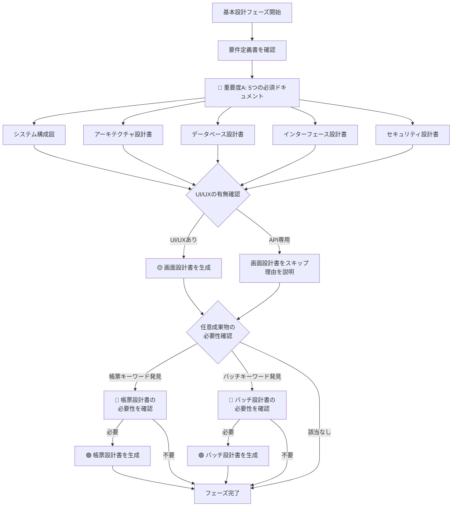

# 03_基本設計フェーズ - ドキュメント作成ルール

## 📋 フェーズ概要

**目的:** システムの基本的な構造と方針を定義する

**主要成果物:** システム構成図、アーキテクチャ設計書、データベース設計書、画面設計書、インターフェース設計書、セキュリティ設計書

**前工程:** 02_要件定義フェーズ  
**次工程:** 04_詳細設計フェーズ

---

## 🎯 成果物の重要度と自動生成ルール

### 🔴 重要度A：生成必須（MANDATORY）- 常に自動生成

| No | 成果物名 | ルールファイル | 理由 |
|----|---------|--------------|------|
| 1 | **システム構成図** | [03_システム構成図作成ルール.md](03_システム構成図作成ルール.md) | インフラ・アーキテクチャの全体像定義に必須 |
| 2 | **アーキテクチャ設計書** | [03_アーキテクチャ設計書作成ルール.md](03_アーキテクチャ設計書作成ルール.md) | 技術選定と設計方針の根拠として必須 |
| 3 | **データベース設計書** | [03_データベース設計書作成ルール.md](03_データベース設計書作成ルール.md) | データ構造の定義に不可欠 |
| 4 | **インターフェース設計書** | [03_インターフェース設計書作成ルール.md](03_インターフェース設計書作成ルール.md) | API・外部連携の仕様定義に必須 |
| 5 | **セキュリティ設計書** | [03_セキュリティ設計書作成ルール.md](03_セキュリティ設計書作成ルール.md) | セキュリティ要件の実装方針に必須 |

**AI動作:**
```
✅ ユーザーの明示的な指示がなくても自動的に生成する
✅ 該当フェーズに入ったら必ず生成対象として認識する
⚠️  省略する場合は、ユーザーに理由を説明し確認を求める
```

---

### 🟡 重要度B：生成推奨（RECOMMENDED）- デフォルトで自動生成

| No | 成果物名 | ルールファイル | 理由 | 省略可能なケース |
|----|---------|--------------|------|-----------------|
| 1 | **画面設計書** | [03_画面設計書作成ルール.md](03_画面設計書作成ルール.md) | UI/UXがあるシステムでは重要 | API専用システム、バックエンドのみ |

**AI動作:**
```
✅ デフォルトで自動生成する
🔄 プロジェクト規模や特性に応じて省略判断可能
💬 省略する場合は、その理由をユーザーに説明する
```

**判断基準:**
- **生成すべきケース:**
  - Webアプリケーション
  - モバイルアプリ
  - 管理画面あり
  - エンドユーザー向けUI

- **省略可能なケース:**
  - REST API専用システム
  - バックエンドサービスのみ
  - マイクロサービスのバックエンド層

---

### 🟢 重要度C：生成任意（OPTIONAL）- 指示時のみ生成

| No | 成果物名 | 必要なケース | 確認フレーズ例 |
|----|---------|------------|---------------|
| 1 | **帳票設計書** | 帳票出力機能があるシステム | 「このシステムでは帳票出力（PDF/Excel等）が必要でしょうか？必要な場合は帳票設計書を作成します」 |
| 2 | **バッチ設計書** | バッチ処理があるシステム | 「バッチ処理（夜間処理、定期実行等）は含まれますか？含まれる場合はバッチ設計書を作成します」 |

**AI動作:**
```
❌ ユーザーからの明示的な指示がない限り生成しない
💬 該当する可能性がある場合、ユーザーに確認を促す
📝 必要性の判断はユーザーに委ねる
```

**確認が必要な状況:**
- 要件定義に「帳票」「レポート」「PDF出力」等のキーワードがある
- 要件定義に「バッチ」「定期実行」「夜間処理」等のキーワードがある
- システム機能一覧に該当機能がある

---

## 🤖 AI自動生成フロー（基本設計フェーズ）



---

## 📊 統計情報

### 成果物数サマリー

| 重要度 | 件数 | 割合 | 自動生成 |
|--------|------|------|----------|
| 🔴 A（必須） | 5件 | 63% | ✅ すべて |
| 🟡 B（推奨） | 1件 | 12% | ✅ デフォルト |
| 🟢 C（任意） | 2件 | 25% | ❌ 指示時のみ |
| **合計** | **8件** | **100%** | 6件がデフォルト生成 |

### 作成時間の目安（AI生成）

| 成果物名 | 規模（小） | 規模（中） | 規模（大） |
|---------|-----------|-----------|-----------|
| システム構成図 | 30分 | 1時間 | 2時間 |
| アーキテクチャ設計書 | 1時間 | 2時間 | 4時間 |
| データベース設計書 | 1時間 | 3時間 | 6時間 |
| 画面設計書 | 2時間 | 4時間 | 8時間 |
| インターフェース設計書 | 1時間 | 2時間 | 4時間 |
| セキュリティ設計書 | 1時間 | 2時間 | 3時間 |

---

## ⚙️ プロジェクト特性別の推奨構成

### 小規模プロジェクト（1-3人月）

**必須（重要度A）:**
- ✅ システム構成図（簡易版）
- ✅ アーキテクチャ設計書（簡易版）
- ✅ データベース設計書
- ✅ インターフェース設計書
- ✅ セキュリティ設計書（簡易版）

**推奨（重要度B）:**
- 🔄 画面設計書 → ワイヤーフレームで代替可

**任意（重要度C）:**
- ❌ 通常は不要

---

### 中規模プロジェクト（4-12人月）

**必須（重要度A）:**
- ✅ すべての重要度A成果物を標準レベルで作成

**推奨（重要度B）:**
- ✅ 画面設計書（詳細版）

**任意（重要度C）:**
- 🔍 機能に応じて判断

---

### 大規模プロジェクト（13人月以上）

**必須（重要度A）:**
- ✅ すべての重要度A成果物を詳細レベルで作成

**推奨（重要度B）:**
- ✅ 画面設計書（詳細版 + プロトタイプ）

**任意（重要度C）:**
- ✅ 該当機能があれば必ず作成
- 📝 追加ドキュメントも検討（パフォーマンス設計書等）

---

## 🔗 関連ドキュメント

- [ドキュメント作成基本ルール](../00_ドキュメント作成ルール/ドキュメント作成基本ルール.md) - 全体の基本ルール
- [README_成果物重要度定義](../README_成果物重要度定義.md) - 全フェーズの重要度定義
- [02_要件定義フェーズ](../02_要件定義/README.md) - 前工程
- [04_詳細設計フェーズ](../04_詳細設計/README.md) - 次工程

### 🆕 Phase 2A/2B 分離に関する重要情報

**Phase 2A（実装前・軽量版）用テンプレート**
- [lightweight-templates/](./lightweight-templates/) - Phase 2A専用の軽量版テンプレート（6ファイル）
  - 実装可否判断に必要な最小限の設計情報のみ記載
  - Phase 3（実装）完了後、Phase 2Bで完全版に更新

**Phase 2B（実装後・完全版）用テンプレート**
- 本フォルダの作成ルール.md（6ファイル） - 実装結果を反映した詳細な設計書

**参考ガイド**
- [AI-DELIVERABLE-REFERENCE-GUIDE.md](../../../00-guides/AI-DELIVERABLE-REFERENCE-GUIDE.md) - Phase 2A/2Bの詳細な違いと参照手順
- [AI-MASTER-WORKFLOW-GUIDE.md](../../../00-guides/AI-MASTER-WORKFLOW-GUIDE.md) - Phase 2の全体プロセス

---

**最終更新日:** 2025年10月30日  
**バージョン:** 1.0  
**対象:** AI開発アシスタント、設計者

---

## 📚 サンプルファイル

実際のルールを適用した実践的なサンプルファイルが[samplesディレクトリ](./samples/)に用意されています。

### 提供サンプル（ECサイトプロジェクト）

1. **[sample_03_システム構成図.md](./samples/sample_03_システム構成図.md)** (15.7 KB)
   - C4モデル、AWS物理構成、ネットワーク設計の実例

2. **[sample_03_アーキテクチャ設計書.md](./samples/sample_03_アーキテクチャ設計書.md)** (17.4 KB)
   - 技術スタック選定とADR記録の実例

3. **[sample_03_データベース設計書.md](./samples/sample_03_データベース設計書.md)** (16.8 KB)
   - ER図、テーブル定義、トリガー、インデックス戦略

4. **[sample_03_インターフェース設計書.md](./samples/sample_03_インターフェース設計書.md)** (14.8 KB)
   - REST API設計、認証フロー、外部サービス連携

5. **[sample_03_セキュリティ設計書.md](./samples/sample_03_セキュリティ設計書.md)** (18.7 KB)
   - STRIDE分析、OWASP Top 10対策、暗号化戦略

**題材**: ECサイト構築プロジェクト（Spring Boot 3.2 + React 18 + PostgreSQL 15）

**活用方法**:
- 自プロジェクトの参考として
- AI生成時のプロンプトの具体例として
- ルール適用の品質チェック基準として

