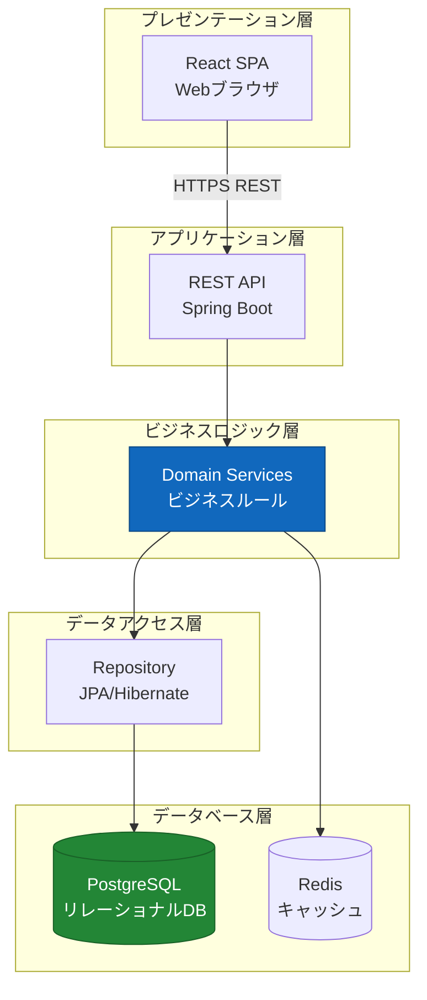
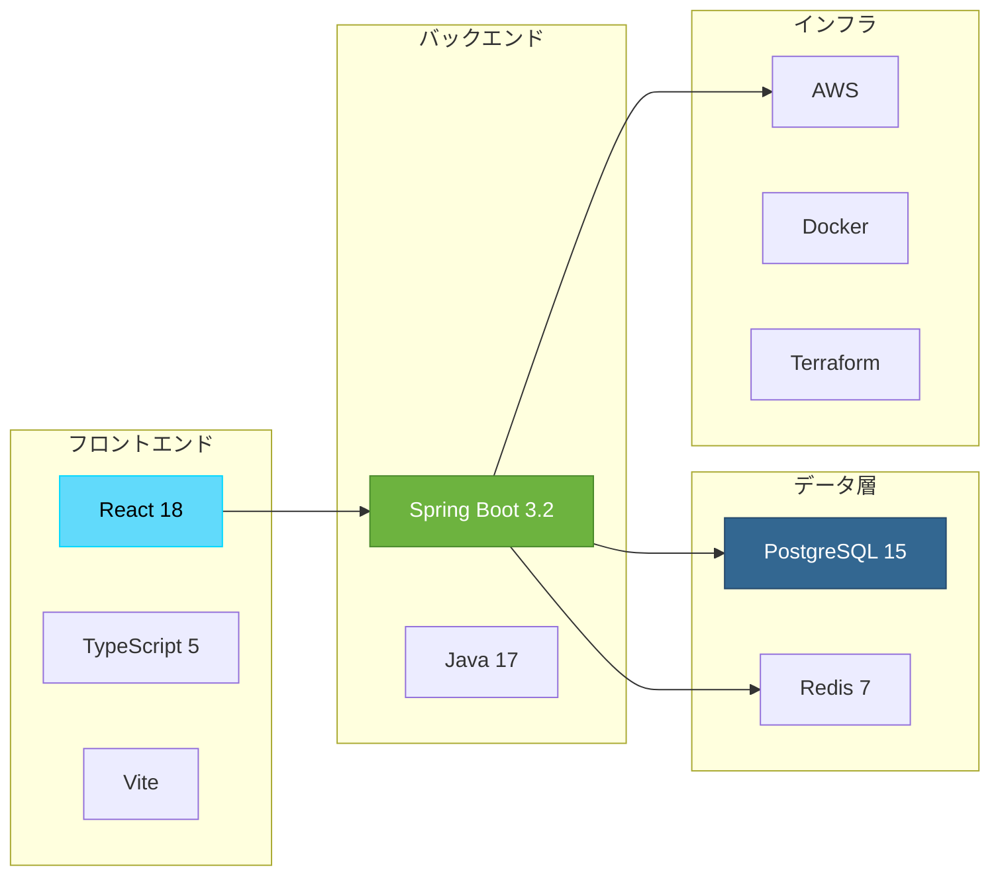
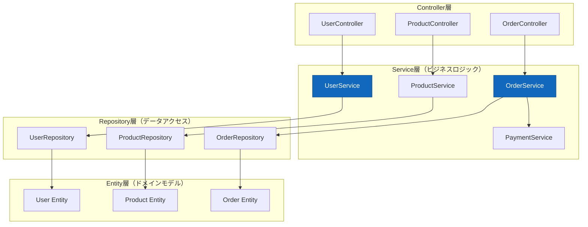

# アーキテクチャ設計書

**プロジェクト名:** ECサイト構築プロジェクト  
**ドキュメントID:** ARCH-001  
**バージョン:** 1.0  
**作成日:** 2025-10-30  
**作成者:** システムアーキテクト  
**承認者:** 技術統括責任者

---

## 1. 基本情報

### 1.1 目的

本ドキュメントは、ECサイトシステムのアーキテクチャを定義し、以下を明確にする：

- 採用する技術スタックとその選定理由
- アーキテクチャパターンと設計原則
- 品質属性（非機能要件）への対応方針
- 重要な設計判断（ADR）の記録

### 1.2 対象読者

- 開発チーム全体
- システムアーキテクト
- 技術リーダー
- プロジェクトマネージャー

### 1.3 関連成果物

- **入力**: [要件定義書](../../02_要件定義/要件定義書.md)、[非機能要件一覧](../../02_要件定義/非機能要件一覧.md)
- **出力**: [システム構成図](sample_03_システム構成図.md)、[データベース設計書](sample_03_データベース設計書.md)

---

## 2. アーキテクチャ概要

### 2.1 アーキテクチャスタイル

**採用パターン:** レイヤードアーキテクチャ + マイクロサービス指向



### 2.2 設計原則

| 原則 | 説明 | 適用例 |
|------|------|--------|
| **関心の分離** | 各層が明確な責務を持つ | Controller層はHTTP処理のみ、Service層はビジネスロジックのみ |
| **依存性逆転** | 上位層は下位層の抽象に依存 | ServiceはRepositoryインターフェースに依存 |
| **単一責任** | 1クラス1責務 | UserServiceはユーザー管理のみ担当 |
| **開放閉鎖原則** | 拡張に開き、修正に閉じる | Strategy パターンで決済方法を拡張 |
| **DRY原則** | 重複を避ける | 共通処理はユーティリティクラスに集約 |

---

## 3. 技術スタック

### 3.1 技術選定一覧



### 3.2 技術スタック詳細

#### 3.2.1 フロントエンド

| 技術 | バージョン | 選定理由 |
|------|-----------|---------|
| **React** | 18.2 | 業界標準、豊富なエコシステム、TypeScript親和性 |
| **TypeScript** | 5.3 | 型安全性、開発効率、保守性向上 |
| **Vite** | 5.0 | 高速ビルド、HMR、モダンツールチェーン |
| **React Router** | 6.20 | SPAルーティング標準ライブラリ |
| **TanStack Query** | 5.0 | サーバー状態管理、キャッシング |
| **Zustand** | 4.4 | 軽量なクライアント状態管理 |
| **Axios** | 1.6 | HTTPクライアント、インターセプター対応 |

#### 3.2.2 バックエンド

| 技術 | バージョン | 選定理由 |
|------|-----------|---------|
| **Spring Boot** | 3.2 | エンタープライズ標準、DI/AOP、豊富な機能 |
| **Java** | 17 (LTS) | 安定性、パフォーマンス、長期サポート |
| **Spring Data JPA** | 3.2 | ORマッピング、Repository抽象化 |
| **Spring Security** | 6.2 | 認証・認可フレームワーク、JWT対応 |
| **Spring Cloud** | 2023.0 | マイクロサービス支援、サーキットブレーカー |
| **Hibernate** | 6.4 | JPA実装、N+1問題対策 |
| **Lombok** | 1.18 | ボイラープレートコード削減 |
| **MapStruct** | 1.5 | DTO-Entityマッピング自動生成 |

#### 3.2.3 データベース・キャッシュ

| 技術 | バージョン | 選定理由 |
|------|-----------|---------|
| **PostgreSQL** | 15.5 | ACID準拠、豊富な機能、AWS RDS対応 |
| **Redis** | 7.2 | 高速キャッシュ、セッション管理、Pub/Sub |
| **Flyway** | 10.0 | DBマイグレーション管理、バージョン管理 |

#### 3.2.4 テスト

| 技術 | バージョン | 選定理由 |
|------|-----------|---------|
| **JUnit 5** | 5.10 | Java標準テストフレームワーク |
| **Mockito** | 5.7 | モックライブラリ、依存切り離し |
| **Testcontainers** | 1.19 | 統合テスト用コンテナ管理 |
| **REST Assured** | 5.4 | REST API テスト |
| **Vitest** | 1.0 | Viteネイティブ高速テスト |
| **React Testing Library** | 14.1 | Reactコンポーネントテスト |

#### 3.2.5 インフラ・DevOps

| 技術 | バージョン | 選定理由 |
|------|-----------|---------|
| **AWS ECS (Fargate)** | - | コンテナオーケストレーション、サーバーレス |
| **AWS RDS** | PostgreSQL 15 | マネージドDB、自動バックアップ |
| **AWS ElastiCache** | Redis 7 | マネージドRedis、マルチAZ |
| **AWS S3** | - | オブジェクトストレージ、画像保存 |
| **Docker** | 24.0 | コンテナ化、環境統一 |
| **Terraform** | 1.6 | IaC、インフラバージョン管理 |
| **GitHub Actions** | - | CI/CD、自動テスト・デプロイ |

---

## 4. アーキテクチャパターン

### 4.1 レイヤー構成



#### 4.1.1 Controller層の責務

```java
@RestController
@RequestMapping("/api/v1/users")
@RequiredArgsConstructor
public class UserController {
    
    private final UserService userService;
    
    /**
     * 責務:
     * - HTTPリクエストの受け取り
     * - バリデーション
     * - DTOへの変換
     * - HTTPレスポンスの返却
     */
    @PostMapping
    public ResponseEntity<UserResponse> createUser(
            @Valid @RequestBody UserCreateRequest request) {
        
        UserDto userDto = userService.createUser(request);
        return ResponseEntity.status(HttpStatus.CREATED)
                .body(UserResponse.from(userDto));
    }
}
```

#### 4.1.2 Service層の責務

```java
@Service
@Transactional
@RequiredArgsConstructor
public class UserService {
    
    private final UserRepository userRepository;
    private final PasswordEncoder passwordEncoder;
    private final EmailService emailService;
    
    /**
     * 責務:
     * - ビジネスルールの実装
     * - トランザクション管理
     * - 複数Repositoryの調整
     * - 外部サービス連携
     */
    public UserDto createUser(UserCreateRequest request) {
        // ビジネスルール: メールアドレス重複チェック
        if (userRepository.existsByEmail(request.getEmail())) {
            throw new DuplicateEmailException("Email already exists");
        }
        
        // パスワードハッシュ化
        String hashedPassword = passwordEncoder.encode(request.getPassword());
        
        // Entityの作成と保存
        User user = User.builder()
                .email(request.getEmail())
                .password(hashedPassword)
                .name(request.getName())
                .build();
        
        user = userRepository.save(user);
        
        // ウェルカムメール送信
        emailService.sendWelcomeEmail(user.getEmail());
        
        return UserDto.from(user);
    }
}
```

### 4.2 デザインパターン適用

| パターン | 適用箇所 | 目的 |
|---------|---------|------|
| **Repository** | データアクセス層 | データアクセスの抽象化、テスタビリティ向上 |
| **DTO** | Controller-Service間 | 層間データ転送、Entity露出防止 |
| **Strategy** | 決済処理 | 決済方法の切り替え（クレカ、コンビニ等） |
| **Factory** | Entity生成 | 複雑な生成ロジックのカプセル化 |
| **Observer** | イベント処理 | 注文完了時のメール送信等 |

---

## 5. ADR（アーキテクチャ決定記録）

### ADR-001: Spring Bootの採用

**ステータス:** 承認済み  
**決定日:** 2025-10-15

**背景:**
- バックエンドフレームワークの選定が必要
- エンタープライズ要件（トランザクション、セキュリティ）

**決定内容:**
Spring Boot 3.2を採用

**理由:**
- ✅ エンタープライズ標準、豊富な実績
- ✅ 依存性注入、AOP等の強力な機能
- ✅ Spring Securityによる堅牢な認証・認可
- ✅ AWS環境との親和性が高い
- ✅ チームのJava経験を活かせる

**代替案:**
- NestJS: TypeScript統一だが、エンタープライズ実績が少ない
- Go: パフォーマンス高いが、学習コスト大

**影響:**
- 開発生産性が向上
- エンタープライズ要件を満たせる

---

### ADR-002: PostgreSQLの採用

**ステータス:** 承認済み  
**決定日:** 2025-10-16

**背景:**
- RDBMSの選定が必要
- トランザクション一貫性が重要

**決定内容:**
PostgreSQL 15を採用

**理由:**
- ✅ ACID準拠、データ整合性が高い
- ✅ JSON型対応、柔軟なクエリ
- ✅ AWS RDSでマネージド運用可能
- ✅ 無料、商用利用制限なし
- ✅ パフォーマンスチューニング機能が豊富

**代替案:**
- MySQL: 実績豊富だが、JSON機能が弱い
- MongoDB: NoSQLだが、トランザクション要件に不向き

**影響:**
- データ整合性を保証できる
- 運用負荷が低い

---

### ADR-003: Redisキャッシュの採用

**ステータス:** 承認済み  
**決定日:** 2025-10-18

**背景:**
- レスポンスタイム500ms以下の要件
- セッション管理が必要

**決定内容:**
Redis 7をキャッシュ層に採用

**理由:**
- ✅ 高速（メモリベース）
- ✅ セッション管理に最適
- ✅ Spring Sessionと統合容易
- ✅ AWS ElastiCacheでマネージド運用
- ✅ Pub/Sub機能でリアルタイム通知も可能

**代替案:**
- Memcached: シンプルだが機能が少ない
- キャッシュなし: 性能要件を満たせない

**影響:**
- DBアクセス削減、レスポンス向上
- セッション管理が分散環境で可能

---

### ADR-004: ECS Fargateの採用

**ステータス:** 承認済み  
**決定日:** 2025-10-20

**背景:**
- コンテナオーケストレーションが必要
- 運用負荷を最小化したい

**決定内容:**
AWS ECS (Fargate)を採用

**理由:**
- ✅ サーバーレス、インフラ管理不要
- ✅ Auto Scaling容易
- ✅ AWS統合（ALB、CloudWatch等）
- ✅ コスト効率的（使った分だけ課金）

**代替案:**
- EKS: Kubernetes標準だが、複雑で運用コスト高
- EC2直接: スケーリング手動、運用負荷大

**影響:**
- 運用負荷が大幅に削減
- スケーラビリティが向上

---

## 6. 品質属性への対応

### 6.1 性能（Performance）

| 要件 | 目標値 | 対策 |
|------|--------|------|
| **レスポンスタイム** | 平均 < 500ms | ・Redis キャッシュ（商品情報、セッション）<br/>・DB Read Replica（読み取り分散）<br/>・コネクションプール最適化<br/>・N+1問題対策（Fetch Join） |
| **スループット** | 100 TPS | ・ECS Auto Scaling<br/>・非同期処理（メール送信等）<br/>・CDN活用（静的ファイル） |

**実装例: キャッシュ戦略**
```java
@Service
@CacheConfig(cacheNames = "products")
public class ProductService {
    
    // 商品情報を5分間キャッシュ
    @Cacheable(key = "#productId")
    public ProductDto getProduct(Long productId) {
        return productRepository.findById(productId)
                .map(ProductDto::from)
                .orElseThrow(() -> new ProductNotFoundException());
    }
    
    // 更新時はキャッシュ削除
    @CacheEvict(key = "#productId")
    public void updateProduct(Long productId, ProductUpdateRequest request) {
        // 更新処理
    }
}
```

---

### 6.2 セキュリティ（Security）

| 要件 | 対策 |
|------|------|
| **認証** | JWT Bearer Token、リフレッシュトークン |
| **認可** | Role-Based Access Control (RBAC) |
| **通信暗号化** | TLS 1.3（ALBでSSL終端） |
| **データ暗号化** | RDS暗号化（AES-256）、S3暗号化（SSE-S3） |
| **SQLインジェクション対策** | JPA Prepared Statement自動生成 |
| **XSS対策** | Content Security Policy、入力サニタイゼーション |
| **CSRF対策** | SameSite Cookie、CSRFトークン |
| **パスワード** | bcrypt（ストレッチング10回） |

**実装例: JWT認証**
```java
@Configuration
@EnableWebSecurity
public class SecurityConfig {
    
    @Bean
    public SecurityFilterChain filterChain(HttpSecurity http) throws Exception {
        http
            .csrf().disable() // REST APIのためCSRF無効（JWTで保護）
            .authorizeHttpRequests(auth -> auth
                .requestMatchers("/api/v1/auth/**").permitAll()
                .requestMatchers("/api/v1/admin/**").hasRole("ADMIN")
                .anyRequest().authenticated()
            )
            .sessionManagement()
                .sessionCreationPolicy(SessionCreationPolicy.STATELESS)
            .and()
            .addFilterBefore(jwtAuthFilter, UsernamePasswordAuthenticationFilter.class);
        
        return http.build();
    }
}
```

---

### 6.3 可用性（Availability）

| 要件 | 目標値 | 対策 |
|------|--------|------|
| **システム稼働率** | 99.9% (月43.2分停止) | マルチAZ配置、ヘルスチェック、Auto Recovery |
| **RPO** | 1時間 | RDS自動バックアップ（1時間ごとスナップショット） |
| **RTO** | 4時間 | 自動フェイルオーバー、復旧手順書、定期訓練 |

---

### 6.4 保守性（Maintainability）

| 対策 | 実装 |
|------|------|
| **コード品質** | SonarQube静的解析、カバレッジ80%以上 |
| **ロギング** | Logback、構造化ログ（JSON）、ログレベル統一 |
| **監視** | CloudWatch メトリクス、カスタムメトリクス |
| **ドキュメント** | OpenAPI 3.0（Swagger）、ADR記録 |
| **コーディング規約** | Google Java Style Guide、ESLint/Prettier |

---

## 7. 技術的制約・リスク

### 7.1 制約事項

| 制約 | 内容 | 影響 |
|------|------|------|
| **Java 17必須** | Spring Boot 3.xの要件 | 開発環境の統一が必要 |
| **AWS利用** | インフラはAWSに限定 | マルチクラウド対応不可 |
| **予算制限** | 月額インフラコスト < 50万円 | リソースサイジングの最適化必要 |

### 7.2 技術的リスク

| リスク | 確率 | 影響 | 対策 |
|-------|------|------|------|
| **ECS障害** | 低 | 高 | マルチAZ配置、ヘルスチェック |
| **RDS容量不足** | 中 | 高 | 定期監視、Auto Scaling設定 |
| **外部API障害（Stripe）** | 低 | 高 | リトライ機構、サーキットブレーカー |
| **セキュリティ脆弱性** | 中 | 高 | 定期脆弱性スキャン、依存パッケージ更新 |

---

## 8. 変更履歴

| バージョン | 日付 | 変更内容 | 変更者 |
|-----------|------|---------|--------|
| 1.0 | 2025-10-30 | 初版作成 | システムアーキテクト |

---

**ドキュメント終了**
