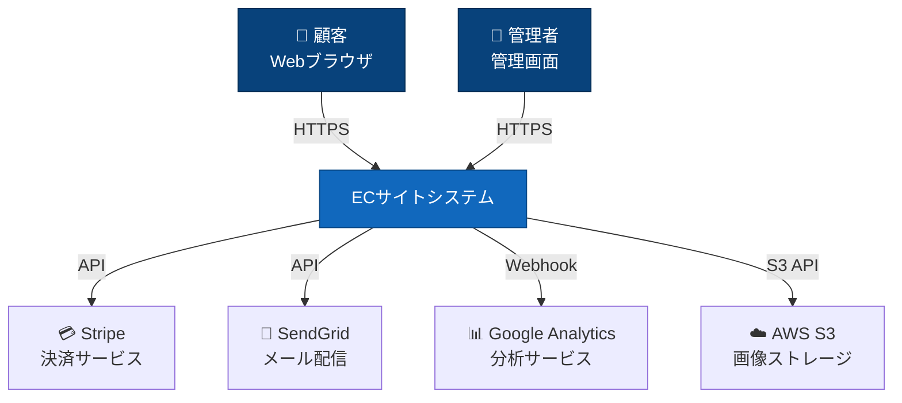
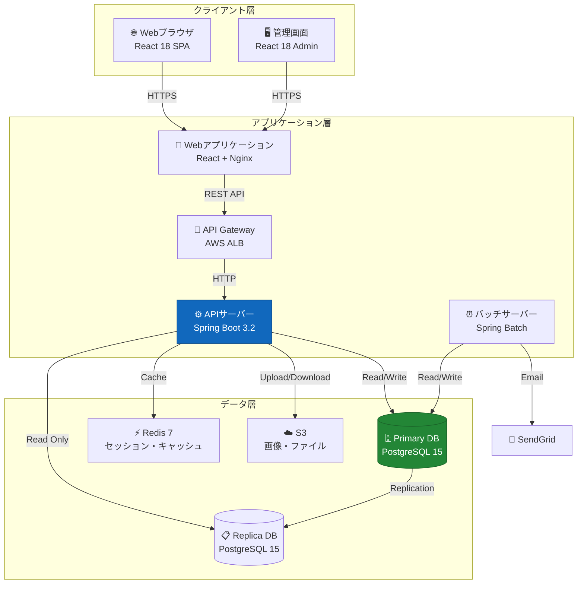
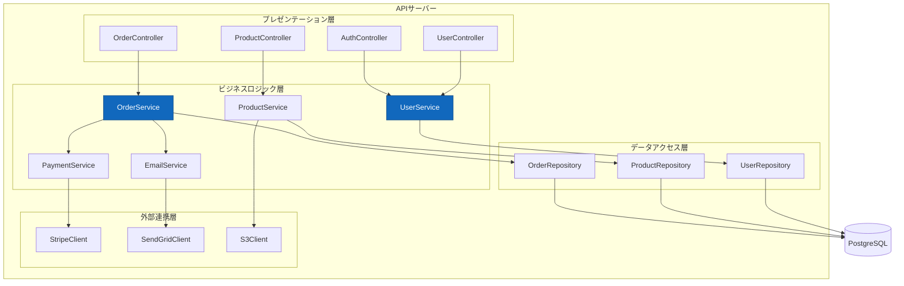
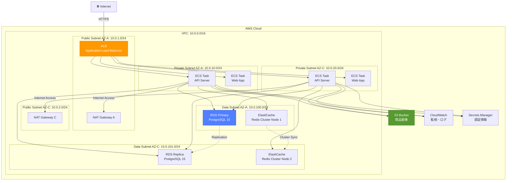
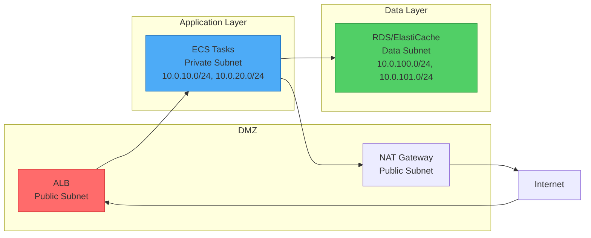
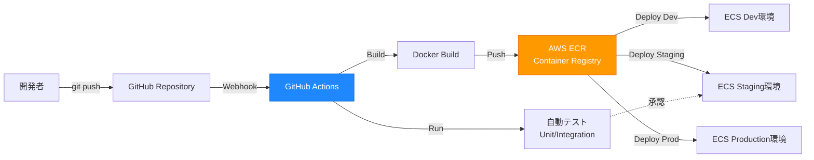

# システム構成図

**プロジェクト名:** ECサイト構築プロジェクト  
**ドキュメントID:** SYS-ARCH-001  
**バージョン:** 1.0  
**作成日:** 2025-10-30  
**作成者:** システムアーキテクト  
**承認者:** プロジェクトマネージャー

---

## 1. 基本情報

### 1.1 目的

本ドキュメントは、ECサイトシステムの全体構成を可視化し、以下を明確にする：

- システムのコンテキストと外部連携
- アプリケーションコンテナの構成
- 内部コンポーネントの関係
- 物理インフラの配置
- ネットワーク設計とセキュリティ境界

### 1.2 対象読者

- システムアーキテクト
- インフラエンジニア
- 開発リーダー
- セキュリティ担当者

### 1.3 関連成果物

- **入力**: [要件定義書](../../02_要件定義/要件定義書.md)、[非機能要件一覧](../../02_要件定義/非機能要件一覧.md)
- **出力**: [アーキテクチャ設計書](sample_03_アーキテクチャ設計書.md)、[セキュリティ設計書](sample_03_セキュリティ設計書.md)

---

## 2. システムコンテキスト（C4モデル - Level 1）

### 2.1 コンテキスト図



### 2.2 外部システム一覧

| システム名 | 役割 | プロトコル | 認証方式 |
|-----------|------|-----------|---------|
| **Stripe** | クレジットカード決済処理 | HTTPS REST API | API Key |
| **SendGrid** | トランザクションメール送信 | HTTPS REST API | API Key |
| **Google Analytics** | アクセス解析・行動分析 | JavaScript SDK | トラッキングID |
| **AWS S3** | 商品画像・静的ファイル保存 | HTTPS S3 API | IAM Role |

---

## 3. コンテナ構成（C4モデル - Level 2）

### 3.1 コンテナ図



### 3.2 コンテナ一覧

| コンテナ名 | 技術スタック | 責務 | スケーリング |
|-----------|------------|------|------------|
| **Webアプリケーション** | React 18, TypeScript, Nginx | UIレンダリング、静的コンテンツ配信 | Horizontal（ECS） |
| **APIサーバー** | Spring Boot 3.2, Java 17 | ビジネスロジック、API提供 | Horizontal（ECS） |
| **バッチサーバー** | Spring Batch, Java 17 | 定期処理、レポート生成 | Vertical |
| **Primary DB** | PostgreSQL 15 | マスターデータベース | Vertical（RDS） |
| **Replica DB** | PostgreSQL 15 | 読み取り専用レプリカ | Horizontal（RDS） |
| **Redis** | Redis 7 | セッション管理、キャッシュ | Cluster（ElastiCache） |
| **S3** | AWS S3 | 画像・ファイルストレージ | Managed |

---

## 4. コンポーネント構成（C4モデル - Level 3）

### 4.1 APIサーバーコンポーネント図



---

## 5. 物理インフラ構成（AWS）

### 5.1 AWS構成図



### 5.2 リソース仕様

#### 5.2.1 コンピューティング

| リソース | タイプ | スペック | 台数 | Auto Scaling |
|---------|--------|---------|------|-------------|
| **ECS Task (API)** | Fargate | 2 vCPU, 4 GB RAM | 2-10 | CPU 70%でスケール |
| **ECS Task (Web)** | Fargate | 1 vCPU, 2 GB RAM | 2-6 | CPU 70%でスケール |
| **バッチサーバー** | EC2 t3.medium | 2 vCPU, 4 GB RAM | 1 | なし |

#### 5.2.2 データベース

| リソース | タイプ | スペック | ストレージ | バックアップ |
|---------|--------|---------|-----------|------------|
| **RDS Primary** | db.t3.large | 2 vCPU, 8 GB RAM | 100 GB gp3 | 自動（7日保持） |
| **RDS Replica** | db.t3.large | 2 vCPU, 8 GB RAM | 100 GB gp3 | - |
| **ElastiCache** | cache.t3.medium | 2 vCPU, 3.09 GB RAM | - | なし |

#### 5.2.3 ストレージ

| リソース | タイプ | 容量 | レプリケーション |
|---------|--------|------|---------------|
| **S3 (商品画像)** | S3 Standard | 制限なし | マルチAZ |
| **S3 (ログ)** | S3 Infrequent Access | 制限なし | マルチAZ |

---

## 6. ネットワーク設計

### 6.1 ネットワークセグメント



### 6.2 セキュリティグループ設計

#### SG-ALB（ロードバランサー）
```yaml
Inbound:
  - Port: 443 (HTTPS)
    Source: 0.0.0.0/0
    Description: インターネットからのHTTPSアクセス
  - Port: 80 (HTTP)
    Source: 0.0.0.0/0
    Description: HTTPからHTTPSへリダイレクト

Outbound:
  - Port: 8080
    Destination: SG-ECS
    Description: ECSタスクへの転送
```

#### SG-ECS（アプリケーション）
```yaml
Inbound:
  - Port: 8080
    Source: SG-ALB
    Description: ALBからのHTTPリクエスト

Outbound:
  - Port: 5432
    Destination: SG-RDS
    Description: PostgreSQLアクセス
  - Port: 6379
    Destination: SG-Redis
    Description: Redisアクセス
  - Port: 443
    Destination: 0.0.0.0/0
    Description: 外部API（Stripe, SendGrid）アクセス
```

#### SG-RDS（データベース）
```yaml
Inbound:
  - Port: 5432
    Source: SG-ECS
    Description: アプリケーションからのDB接続

Outbound:
  - Port: 5432
    Destination: SG-RDS (Self)
    Description: レプリケーション
```

#### SG-Redis（キャッシュ）
```yaml
Inbound:
  - Port: 6379
    Source: SG-ECS
    Description: アプリケーションからのRedis接続

Outbound:
  - Port: 6379
    Destination: SG-Redis (Self)
    Description: クラスター間通信
```

---

## 7. デプロイメント構成

### 7.1 デプロイメントパイプライン



### 7.2 環境構成

| 環境 | 用途 | VPC | ドメイン | デプロイタイミング |
|------|------|-----|---------|------------------|
| **Development** | 開発・動作確認 | vpc-dev | dev.ec-shop.local | 自動（mainプッシュ時） |
| **Staging** | 統合テスト・受入テスト | vpc-stg | stg.ec-shop.com | 手動承認後 |
| **Production** | 本番環境 | vpc-prod | www.ec-shop.com | 手動承認後 |

---

## 8. 非機能要件への対応

### 8.1 可用性

| 要件 | 目標値 | 対策 |
|------|--------|------|
| **システム稼働率** | 99.9% | マルチAZ構成、Auto Scaling |
| **RPO（復旧時点目標）** | 1時間 | RDS自動バックアップ（1時間ごと） |
| **RTO（復旧時間目標）** | 4時間 | 自動フェイルオーバー、Runbook整備 |

### 8.2 性能

| 要件 | 目標値 | 対策 |
|------|--------|------|
| **レスポンスタイム** | 平均 < 500ms | Redis キャッシュ、RDS Read Replica |
| **同時接続数** | 1,000ユーザー | ECS Auto Scaling（最大10タスク） |
| **スループット** | 100 TPS | ロードバランサー、水平スケーリング |

### 8.3 セキュリティ

| 要件 | 対策 |
|------|------|
| **通信暗号化** | ALB SSL/TLS終端、RDS暗号化接続 |
| **データ暗号化** | RDS暗号化（AES-256）、S3暗号化（SSE-S3） |
| **認証情報管理** | AWS Secrets Manager、IAM Role |
| **ネットワーク分離** | Private Subnet、Security Group |

### 8.4 運用監視

| 項目 | ツール | 監視内容 |
|------|--------|---------|
| **メトリクス監視** | CloudWatch | CPU、メモリ、ネットワーク |
| **ログ監視** | CloudWatch Logs | アプリケーションログ、エラーログ |
| **アラート** | CloudWatch Alarms + SNS | 閾値超過、エラー率上昇 |
| **APM** | X-Ray | 分散トレーシング、ボトルネック分析 |

---

## 9. 変更履歴

| バージョン | 日付 | 変更内容 | 変更者 |
|-----------|------|---------|--------|
| 1.0 | 2025-10-30 | 初版作成 | システムアーキテクト |

---

**ドキュメント終了**
