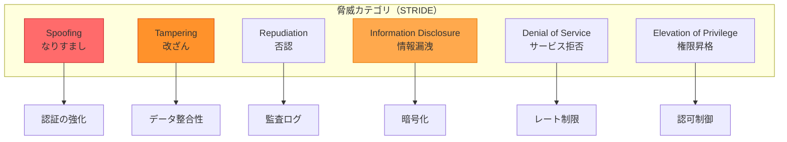
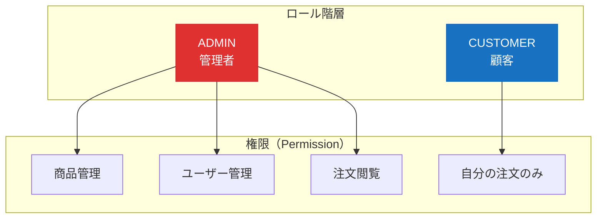

# セキュリティ設計書

**プロジェクト名:** ECサイト構築プロジェクト  
**ドキュメントID:** SEC-DESIGN-001  
**バージョン:** 1.0  
**作成日:** 2025-10-30  
**作成者:** セキュリティアーキテクト  
**承認者:** CISO

---

## 1. 基本情報

### 1.1 目的

本ドキュメントは、ECサイトシステムのセキュリティ設計を定義し、以下を明確にする：

- 脅威分析（STRIDE）
- 認証・認可メカニズム
- データ保護戦略
- OWASP Top 10 対策
- セキュリティ監視・監査

### 1.2 対象読者

- セキュリティエンジニア
- システムアーキテクト
- 開発チーム
- 監査担当者

### 1.3 関連成果物

- **入力**: [非機能要件一覧](../../02_要件定義/非機能要件一覧.md)、[システム構成図](sample_03_システム構成図.md)
- **出力**: [詳細設計書](../../04_詳細設計/sample_04_詳細設計書_UserService.md)

---

## 2. セキュリティ要件

### 2.1 セキュリティ目標

| 目標 | 説明 | 対策 |
|------|------|------|
| **機密性（Confidentiality）** | 許可されたユーザーのみがデータにアクセス | 暗号化、アクセス制御 |
| **完全性（Integrity）** | データが改ざんされない | 署名、チェックサム、トランザクション |
| **可用性（Availability）** | システムが常にアクセス可能 | DDoS対策、冗長化 |
| **認証（Authentication）** | ユーザーの身元確認 | パスワード、JWT、MFA |
| **認可（Authorization）** | 適切な権限の付与 | RBAC、最小権限の原則 |
| **監査（Auditing）** | セキュリティイベントの記録 | ログ、監視、アラート |

---

## 3. STRIDE脅威分析

### 3.1 STRIDE脅威モデル



### 3.2 脅威と対策マトリクス

| 脅威 | 攻撃シナリオ | リスクレベル | 対策 |
|------|------------|-------------|------|
| **Spoofing（なりすまし）** | 盗まれた認証情報でログイン | 🔴 高 | ・JWT + リフレッシュトークン<br/>・パスワード強度要件<br/>・ログイン試行回数制限 |
| **Tampering（改ざん）** | APIリクエストの不正変更 | 🟡 中 | ・HTTPS通信<br/>・リクエスト署名<br/>・CSRF トークン |
| **Repudiation（否認）** | 取引の否認 | 🟢 低 | ・すべての操作をログ記録<br/>・タイムスタンプ<br/>・デジタル署名 |
| **Information Disclosure（情報漏洩）** | DBからの個人情報流出 | 🔴 高 | ・データベース暗号化<br/>・通信暗号化（TLS）<br/>・最小権限の原則 |
| **Denial of Service（DoS）** | 大量リクエストでサーバーダウン | 🟡 中 | ・レート制限<br/>・AWS WAF<br/>・Auto Scaling |
| **Elevation of Privilege（権限昇格）** | 一般ユーザーが管理者権限取得 | 🔴 高 | ・RBAC実装<br/>・入力バリデーション<br/>・SQLインジェクション対策 |

---

## 4. 認証（Authentication）

### 4.1 パスワードセキュリティ

#### 4.1.1 パスワード要件

| 要件 | 内容 |
|------|------|
| **最小文字数** | 8文字以上 |
| **複雑性** | 英大文字、英小文字、数字、記号のうち3種類以上 |
| **禁止パターン** | ・辞書攻撃リスト（top 10,000）<br/>・連続文字（aaa, 123）<br/>・ユーザー名を含む |
| **ハッシュアルゴリズム** | bcrypt（ストレッチング10回） |
| **ソルト** | ユーザーごとにランダム生成 |

**実装例:**
```java
@Service
public class PasswordService {
    
    private final PasswordEncoder passwordEncoder = new BCryptPasswordEncoder(10);
    
    // パスワードバリデーション
    public void validatePassword(String password, String username) {
        if (password.length() < 8) {
            throw new WeakPasswordException("パスワードは8文字以上必要です");
        }
        
        // 複雑性チェック
        int complexity = 0;
        if (password.matches(".*[A-Z].*")) complexity++;
        if (password.matches(".*[a-z].*")) complexity++;
        if (password.matches(".*[0-9].*")) complexity++;
        if (password.matches(".*[!@#$%^&*].*")) complexity++;
        
        if (complexity < 3) {
            throw new WeakPasswordException("パスワードは3種類以上の文字を含む必要があります");
        }
        
        // ユーザー名を含むかチェック
        if (password.toLowerCase().contains(username.toLowerCase())) {
            throw new WeakPasswordException("パスワードにユーザー名を含めることはできません");
        }
        
        // 辞書攻撃チェック（省略）
    }
    
    // パスワードハッシュ化
    public String hashPassword(String rawPassword) {
        return passwordEncoder.encode(rawPassword);
    }
    
    // パスワード検証
    public boolean verifyPassword(String rawPassword, String hashedPassword) {
        return passwordEncoder.matches(rawPassword, hashedPassword);
    }
}
```

#### 4.1.2 ログイン試行制限

```java
@Service
public class LoginAttemptService {
    
    private final LoadingCache<String, Integer> attemptsCache;
    
    public LoginAttemptService() {
        attemptsCache = CacheBuilder.newBuilder()
            .expireAfterWrite(15, TimeUnit.MINUTES)
            .build(new CacheLoader<String, Integer>() {
                public Integer load(String key) {
                    return 0;
                }
            });
    }
    
    public void loginFailed(String email) {
        int attempts = attemptsCache.getUnchecked(email);
        attempts++;
        attemptsCache.put(email, attempts);
        
        if (attempts >= 5) {
            // アカウントロック or CAPTCHA要求
            throw new AccountLockedException("ログイン試行回数が上限に達しました");
        }
    }
    
    public void loginSucceeded(String email) {
        attemptsCache.invalidate(email);
    }
}
```

---

### 4.2 JWT トークン設計

#### 4.2.1 アクセストークン

**有効期限:** 15分

**ペイロード:**
```json
{
  "sub": "12345",
  "email": "user@example.com",
  "role": "CUSTOMER",
  "iat": 1698660000,
  "exp": 1698660900,
  "jti": "unique-token-id"
}
```

**署名アルゴリズム:** HS256（HMAC with SHA-256）

**実装例:**
```java
@Component
public class JwtTokenProvider {
    
    @Value("${jwt.secret}")
    private String jwtSecret;
    
    private static final long ACCESS_TOKEN_VALIDITY = 15 * 60 * 1000; // 15分
    
    public String generateAccessToken(User user) {
        Date now = new Date();
        Date expiryDate = new Date(now.getTime() + ACCESS_TOKEN_VALIDITY);
        
        return Jwts.builder()
                .setSubject(String.valueOf(user.getId()))
                .claim("email", user.getEmail())
                .claim("role", user.getRole())
                .setIssuedAt(now)
                .setExpiration(expiryDate)
                .signWith(SignatureAlgorithm.HS256, jwtSecret)
                .compact();
    }
    
    public boolean validateToken(String token) {
        try {
            Jwts.parser().setSigningKey(jwtSecret).parseClaimsJws(token);
            return true;
        } catch (JwtException | IllegalArgumentException e) {
            return false;
        }
    }
}
```

#### 4.2.2 リフレッシュトークン

**有効期限:** 7日間  
**保存先:** Redis（暗号化）

**ローテーション戦略:**
- リフレッシュトークン使用時に新しいトークンを発行
- 古いトークンは無効化（ワンタイムユース）

---

## 5. 認可（Authorization）

### 5.1 Role-Based Access Control（RBAC）



**実装例:**
```java
@Configuration
@EnableMethodSecurity
public class SecurityConfig {
    
    @Bean
    public SecurityFilterChain filterChain(HttpSecurity http) throws Exception {
        http
            .authorizeHttpRequests(auth -> auth
                // Public endpoints
                .requestMatchers("/api/v1/auth/**").permitAll()
                .requestMatchers("/api/v1/products/**").permitAll()
                
                // Customer endpoints
                .requestMatchers("/api/v1/orders/**").hasRole("CUSTOMER")
                .requestMatchers("/api/v1/cart/**").hasRole("CUSTOMER")
                
                // Admin endpoints
                .requestMatchers("/api/v1/admin/**").hasRole("ADMIN")
                
                .anyRequest().authenticated()
            );
        
        return http.build();
    }
}

// メソッドレベルの認可
@Service
public class OrderService {
    
    @PreAuthorize("hasRole('ADMIN') or #userId == authentication.principal.id")
    public OrderDto getOrder(Long orderId, Long userId) {
        // 管理者 または 注文したユーザー本人のみアクセス可能
    }
}
```

---

## 6. データ保護

### 6.1 通信暗号化

| 層 | プロトコル | 暗号スイート |
|----|-----------|------------|
| **クライアント ⇄ ALB** | TLS 1.3 | TLS_AES_256_GCM_SHA384 |
| **ALB ⇄ ECS** | HTTP（内部ネットワーク） | - |
| **ECS ⇄ RDS** | TLS 1.2+ | AES-256 |
| **ECS ⇄ Redis** | TLS 1.2+ | AES-256 |

**TLS証明書:**
- **発行元:** AWS Certificate Manager（ACM）
- **有効期限:** 自動更新
- **検証:** DNS検証

---

### 6.2 データ暗号化

#### 6.2.1 保存データ暗号化（Encryption at Rest）

| リソース | 暗号化方式 | 鍵管理 |
|---------|-----------|--------|
| **RDS（PostgreSQL）** | AES-256 | AWS KMS（カスタマー管理キー） |
| **S3（画像）** | SSE-S3 | AWS管理キー |
| **EBS（コンテナボリューム）** | AES-256 | AWS KMS |
| **機密情報（API Key）** | AWS Secrets Manager | 自動ローテーション |

**実装例: 機密情報取得**
```java
@Service
public class SecretService {
    
    private final SecretsManagerClient secretsManager;
    
    public String getStripeApiKey() {
        GetSecretValueRequest request = GetSecretValueRequest.builder()
                .secretId("prod/stripe/api-key")
                .build();
        
        GetSecretValueResponse response = secretsManager.getSecretValue(request);
        return response.secretString();
    }
}
```

---

#### 6.2.2 個人情報の保護

**PII（Personally Identifiable Information）:**
| データ項目 | 暗号化 | マスキング | 保存期間 |
|-----------|--------|----------|---------|
| **パスワード** | ✅ bcrypt | N/A | 無期限 |
| **メールアドレス** | ❌ | ✅（ログ） | 無期限 |
| **電話番号** | ❌ | ✅（ログ） | 無期限 |
| **クレジットカード** | ❌（Stripe保存） | ✅ 下4桁のみ | 保存なし |
| **住所** | ❌ | ✅（ログ） | 無期限 |

**ログマスキング例:**
```java
@Component
public class SensitiveDataMasker {
    
    public String maskEmail(String email) {
        if (email == null) return null;
        String[] parts = email.split("@");
        return parts[0].substring(0, 2) + "***@" + parts[1];
        // user@example.com → us***@example.com
    }
    
    public String maskPhone(String phone) {
        if (phone == null) return null;
        return phone.replaceAll("\\d(?=\\d{4})", "*");
        // 090-1234-5678 → ***-****-5678
    }
}
```

---

## 7. OWASP Top 10 対策

### 7.1 A01: アクセス制御の不備

**対策:**
- RBAC実装
- メソッドレベルの認可チェック
- デフォルト拒否（Deny by Default）

---

### 7.2 A02: 暗号化の失敗

**対策:**
- TLS 1.3強制
- bcryptパスワードハッシュ
- RDS/S3暗号化

---

### 7.3 A03: インジェクション

**対策: SQLインジェクション**
```java
// ❌ 危険: 文字列連結
String sql = "SELECT * FROM users WHERE email = '" + userInput + "'";

// ✅ 安全: JPA + Prepared Statement
@Query("SELECT u FROM User u WHERE u.email = :email")
User findByEmail(@Param("email") String email);

// ✅ 安全: Criteria API
CriteriaBuilder cb = em.getCriteriaBuilder();
CriteriaQuery<User> query = cb.createQuery(User.class);
Root<User> user = query.from(User.class);
query.where(cb.equal(user.get("email"), email));
```

---

### 7.4 A04: 安全が確認されない不安全な設計

**対策:**
- STRIDE脅威分析実施
- セキュリティレビュー（設計段階）
- ペネトレーションテスト

---

### 7.5 A05: セキュリティの設定ミス

**対策:**
```yaml
# application.yml - セキュリティ強化設定
server:
  error:
    include-message: never      # エラーメッセージ非表示
    include-stacktrace: never   # スタックトレース非表示

spring:
  security:
    headers:
      content-security-policy: "default-src 'self'"
      x-frame-options: DENY
      x-content-type-options: nosniff
      x-xss-protection: "1; mode=block"
```

---

### 7.6 A06: 脆弱で古くなったコンポーネント

**対策:**
- Dependabotによる依存ライブラリ自動更新
- 脆弱性スキャン（Snyk、Trivy）
- 定期的なパッチ適用

```yaml
# .github/dependabot.yml
version: 2
updates:
  - package-ecosystem: "maven"
    directory: "/"
    schedule:
      interval: "weekly"
    open-pull-requests-limit: 10
```

---

### 7.7 A07: 識別と認証の失敗

**対策:**
- MFA（将来実装）
- パスワード強度要件
- ログイン試行制限
- セッションタイムアウト

---

### 7.8 A08: ソフトウェアとデータの整合性の不備

**対策:**
- コード署名
- Docker イメージの検証
- CI/CDパイプラインのセキュリティ

---

### 7.9 A09: セキュリティログとモニタリングの失敗

**対策（次セクション参照）:**
- CloudWatch Logs
- セキュリティイベント監視
- アラート設定

---

### 7.10 A10: サーバーサイドリクエストフォージェリ (SSRF)

**対策:**
```java
@Service
public class ExternalApiService {
    
    private static final Set<String> ALLOWED_HOSTS = Set.of(
        "api.stripe.com",
        "api.sendgrid.com"
    );
    
    public String fetchExternalApi(String url) {
        URI uri = URI.create(url);
        
        // ホワイトリスト検証
        if (!ALLOWED_HOSTS.contains(uri.getHost())) {
            throw new SecurityException("許可されていないホストへのアクセス");
        }
        
        // プライベートIP拒否
        InetAddress addr = InetAddress.getByName(uri.getHost());
        if (addr.isSiteLocalAddress() || addr.isLoopbackAddress()) {
            throw new SecurityException("内部ネットワークへのアクセスは禁止");
        }
        
        return restTemplate.getForObject(url, String.class);
    }
}
```

---

## 8. セキュリティ監視・監査

### 8.1 セキュリティログ

**記録すべきイベント:**
| イベント | ログレベル | 内容 |
|---------|-----------|------|
| ログイン成功 | INFO | userId, timestamp, IP address |
| ログイン失敗 | WARN | email, timestamp, IP address, reason |
| 権限エラー | WARN | userId, endpoint, timestamp |
| データ変更 | INFO | userId, entity, operation, timestamp |
| API エラー | ERROR | endpoint, error, stacktrace |

**ログ形式（JSON）:**
```json
{
  "timestamp": "2025-10-30T15:30:00Z",
  "level": "WARN",
  "logger": "SecurityAuditLogger",
  "message": "ログイン失敗",
  "context": {
    "email": "us***@example.com",
    "ipAddress": "203.0.113.45",
    "reason": "INVALID_PASSWORD",
    "attemptCount": 3
  }
}
```

---

### 8.2 セキュリティアラート

| アラート条件 | 閾値 | アクション |
|------------|------|----------|
| **ログイン失敗急増** | 100回/5分 | SNS通知、IPブロック検討 |
| **401エラー急増** | 50回/分 | SNS通知 |
| **管理者APIアクセス** | 都度 | CloudWatch Logs Insights |
| **データ削除** | 都度 | SNS通知、監査ログ |

---

## 9. 変更履歴

| バージョン | 日付 | 変更内容 | 変更者 |
|-----------|------|---------|--------|
| 1.0 | 2025-10-30 | 初版作成 | セキュリティアーキテクト |

---

**ドキュメント終了**
