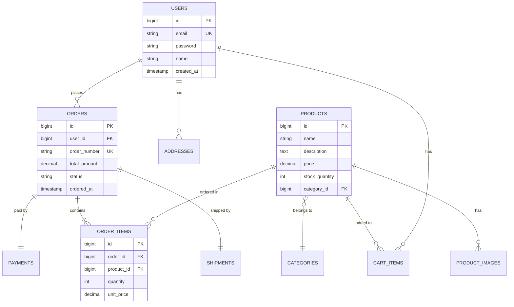

# データベース設計書

**プロジェクト名:** ECサイト構築プロジェクト  
**ドキュメントID:** DB-DESIGN-001  
**バージョン:** 1.0  
**作成日:** 2025-10-30  
**作成者:** データベース設計者  
**承認者:** システムアーキテクト

---

## 1. 基本情報

### 1.1 目的

本ドキュメントは、ECサイトシステムのデータベース論理設計を定義し、以下を明確にする：

- ER図（エンティティ関連図）
- テーブル定義（カラム、型、制約）
- インデックス戦略
- データ整合性制約
- 正規化分析

### 1.2 対象読者

- データベース設計者
- バックエンド開発者
- インフラエンジニア
- テスト担当者

### 1.3 関連成果物

- **入力**: [要件定義書](../../02_要件定義/要件定義書.md)、[機能要件一覧](../../02_要件定義/機能要件一覧.md)
- **出力**: [物理DB設計書](../../04_詳細設計/sample_04_物理DB設計書.md)、[詳細設計書](../../04_詳細設計/sample_04_詳細設計書_UserService.md)

---

## 2. データベース概要

### 2.1 DBMS情報

| 項目 | 内容 |
|------|------|
| **DBMS** | PostgreSQL 15.5 |
| **文字コード** | UTF-8 |
| **照合順序** | ja_JP.UTF-8 |
| **タイムゾーン** | Asia/Tokyo (JST) |
| **接続プール** | HikariCP（最大20接続） |

### 2.2 データベース構成

| データベース名 | 用途 | サイズ見積もり |
|--------------|------|--------------|
| **ec_shop_production** | 本番環境 | 初期50GB、年間100GB増 |
| **ec_shop_staging** | ステージング環境 | 10GB |
| **ec_shop_development** | 開発環境 | 5GB |

---

## 3. ER図（エンティティ関連図）

### 3.1 概念ER図



### 3.2 正規化レベル

**適用正規化:** 第3正規形（3NF）

| 正規形 | 状態 | 説明 |
|-------|------|------|
| **第1正規形** | ✅ 適用 | すべての属性が原子値（配列型は使用しない） |
| **第2正規形** | ✅ 適用 | 非キー属性が主キー全体に完全関数従属 |
| **第3正規形** | ✅ 適用 | 非キー属性間に推移的関数従属なし |
| **BCNF** | ❌ 未適用 | パフォーマンス優先のため一部非正規化 |

**非正規化箇所:**
- `orders.total_amount`：計算可能だが、パフォーマンス向上のため保持
- `products.stock_quantity`：在庫マスタとして分離可能だが、頻繁なアクセスのため統合

---

## 4. テーブル定義

### 4.1 ユーザー管理

#### 4.1.1 users（ユーザー）

| カラム名 | 型 | NULL | デフォルト | 制約 | 説明 |
|---------|---|------|----------|------|------|
| id | BIGSERIAL | NOT NULL | - | PK | ユーザーID |
| email | VARCHAR(255) | NOT NULL | - | UNIQUE | メールアドレス |
| password | VARCHAR(255) | NOT NULL | - | - | パスワードハッシュ（bcrypt） |
| name | VARCHAR(100) | NOT NULL | - | - | ユーザー名 |
| phone | VARCHAR(20) | NULL | - | - | 電話番号 |
| role | VARCHAR(20) | NOT NULL | 'CUSTOMER' | CHECK | ロール（CUSTOMER, ADMIN） |
| status | VARCHAR(20) | NOT NULL | 'ACTIVE' | CHECK | ステータス（ACTIVE, SUSPENDED, DELETED） |
| email_verified | BOOLEAN | NOT NULL | FALSE | - | メール認証済みフラグ |
| last_login_at | TIMESTAMP | NULL | - | - | 最終ログイン日時 |
| created_at | TIMESTAMP | NOT NULL | CURRENT_TIMESTAMP | - | 作成日時 |
| updated_at | TIMESTAMP | NOT NULL | CURRENT_TIMESTAMP | - | 更新日時 |

**インデックス:**
```sql
CREATE UNIQUE INDEX idx_users_email ON users(email);
CREATE INDEX idx_users_status ON users(status) WHERE status = 'ACTIVE';
CREATE INDEX idx_users_created_at ON users(created_at);
```

**CHECK制約:**
```sql
ALTER TABLE users ADD CONSTRAINT chk_users_role 
    CHECK (role IN ('CUSTOMER', 'ADMIN'));

ALTER TABLE users ADD CONSTRAINT chk_users_status 
    CHECK (status IN ('ACTIVE', 'SUSPENDED', 'DELETED'));

ALTER TABLE users ADD CONSTRAINT chk_users_email 
    CHECK (email ~* '^[A-Za-z0-9._%+-]+@[A-Za-z0-9.-]+\.[A-Z|a-z]{2,}$');
```

---

#### 4.1.2 addresses（住所）

| カラム名 | 型 | NULL | デフォルト | 制約 | 説明 |
|---------|---|------|----------|------|------|
| id | BIGSERIAL | NOT NULL | - | PK | 住所ID |
| user_id | BIGINT | NOT NULL | - | FK | ユーザーID |
| address_type | VARCHAR(20) | NOT NULL | - | CHECK | 住所種別（SHIPPING, BILLING） |
| postal_code | VARCHAR(10) | NOT NULL | - | - | 郵便番号 |
| prefecture | VARCHAR(50) | NOT NULL | - | - | 都道府県 |
| city | VARCHAR(100) | NOT NULL | - | - | 市区町村 |
| street | VARCHAR(255) | NOT NULL | - | - | 番地 |
| building | VARCHAR(255) | NULL | - | - | 建物名 |
| is_default | BOOLEAN | NOT NULL | FALSE | - | デフォルト住所フラグ |
| created_at | TIMESTAMP | NOT NULL | CURRENT_TIMESTAMP | - | 作成日時 |
| updated_at | TIMESTAMP | NOT NULL | CURRENT_TIMESTAMP | - | 更新日時 |

**外部キー:**
```sql
ALTER TABLE addresses ADD CONSTRAINT fk_addresses_user_id 
    FOREIGN KEY (user_id) REFERENCES users(id) ON DELETE CASCADE;
```

---

### 4.2 商品管理

#### 4.2.1 categories（カテゴリ）

| カラム名 | 型 | NULL | デフォルト | 制約 | 説明 |
|---------|---|------|----------|------|------|
| id | BIGSERIAL | NOT NULL | - | PK | カテゴリID |
| name | VARCHAR(100) | NOT NULL | - | UNIQUE | カテゴリ名 |
| slug | VARCHAR(100) | NOT NULL | - | UNIQUE | URL用スラッグ |
| parent_id | BIGINT | NULL | - | FK | 親カテゴリID |
| display_order | INT | NOT NULL | 0 | - | 表示順 |
| is_active | BOOLEAN | NOT NULL | TRUE | - | 有効フラグ |
| created_at | TIMESTAMP | NOT NULL | CURRENT_TIMESTAMP | - | 作成日時 |
| updated_at | TIMESTAMP | NOT NULL | CURRENT_TIMESTAMP | - | 更新日時 |

---

#### 4.2.2 products（商品）

| カラム名 | 型 | NULL | デフォルト | 制約 | 説明 |
|---------|---|------|----------|------|------|
| id | BIGSERIAL | NOT NULL | - | PK | 商品ID |
| category_id | BIGINT | NOT NULL | - | FK | カテゴリID |
| name | VARCHAR(255) | NOT NULL | - | - | 商品名 |
| slug | VARCHAR(255) | NOT NULL | - | UNIQUE | URL用スラッグ |
| description | TEXT | NULL | - | - | 商品説明 |
| price | DECIMAL(10,2) | NOT NULL | - | CHECK | 価格（税込） |
| cost | DECIMAL(10,2) | NULL | - | - | 原価 |
| stock_quantity | INT | NOT NULL | 0 | CHECK | 在庫数 |
| sku | VARCHAR(50) | NOT NULL | - | UNIQUE | SKUコード |
| weight | DECIMAL(8,2) | NULL | - | - | 重量（kg） |
| is_published | BOOLEAN | NOT NULL | FALSE | - | 公開フラグ |
| published_at | TIMESTAMP | NULL | - | - | 公開日時 |
| created_at | TIMESTAMP | NOT NULL | CURRENT_TIMESTAMP | - | 作成日時 |
| updated_at | TIMESTAMP | NOT NULL | CURRENT_TIMESTAMP | - | 更新日時 |

**CHECK制約:**
```sql
ALTER TABLE products ADD CONSTRAINT chk_products_price 
    CHECK (price >= 0);

ALTER TABLE products ADD CONSTRAINT chk_products_stock_quantity 
    CHECK (stock_quantity >= 0);
```

**インデックス:**
```sql
CREATE INDEX idx_products_category_id ON products(category_id);
CREATE INDEX idx_products_is_published ON products(is_published) WHERE is_published = TRUE;
CREATE INDEX idx_products_name_fulltext ON products USING gin(to_tsvector('japanese', name));
```

---

### 4.3 注文管理

#### 4.3.1 orders（注文）

| カラム名 | 型 | NULL | デフォルト | 制約 | 説明 |
|---------|---|------|----------|------|------|
| id | BIGSERIAL | NOT NULL | - | PK | 注文ID |
| user_id | BIGINT | NOT NULL | - | FK | ユーザーID |
| order_number | VARCHAR(20) | NOT NULL | - | UNIQUE | 注文番号 |
| status | VARCHAR(20) | NOT NULL | 'PENDING' | CHECK | ステータス |
| subtotal | DECIMAL(10,2) | NOT NULL | - | - | 小計 |
| tax_amount | DECIMAL(10,2) | NOT NULL | - | - | 消費税額 |
| shipping_fee | DECIMAL(10,2) | NOT NULL | 0 | - | 送料 |
| total_amount | DECIMAL(10,2) | NOT NULL | - | - | 合計金額 |
| shipping_address_id | BIGINT | NOT NULL | - | FK | 配送先住所ID |
| ordered_at | TIMESTAMP | NOT NULL | CURRENT_TIMESTAMP | - | 注文日時 |
| created_at | TIMESTAMP | NOT NULL | CURRENT_TIMESTAMP | - | 作成日時 |
| updated_at | TIMESTAMP | NOT NULL | CURRENT_TIMESTAMP | - | 更新日時 |

**ステータス遷移:**
```
PENDING（保留中） → PAID（支払済） → PROCESSING（処理中） 
  → SHIPPED（発送済） → DELIVERED（配達完了） → COMPLETED（完了）
  
PENDING → CANCELLED（キャンセル）
```

---

#### 4.3.2 order_items（注文明細）

| カラム名 | 型 | NULL | デフォルト | 制約 | 説明 |
|---------|---|------|----------|------|------|
| id | BIGSERIAL | NOT NULL | - | PK | 注文明細ID |
| order_id | BIGINT | NOT NULL | - | FK | 注文ID |
| product_id | BIGINT | NOT NULL | - | FK | 商品ID |
| product_name | VARCHAR(255) | NOT NULL | - | - | 商品名（スナップショット） |
| quantity | INT | NOT NULL | - | CHECK | 数量 |
| unit_price | DECIMAL(10,2) | NOT NULL | - | - | 単価（注文時点） |
| subtotal | DECIMAL(10,2) | NOT NULL | - | - | 小計 |
| created_at | TIMESTAMP | NOT NULL | CURRENT_TIMESTAMP | - | 作成日時 |

**CHECK制約:**
```sql
ALTER TABLE order_items ADD CONSTRAINT chk_order_items_quantity 
    CHECK (quantity > 0);
```

---

#### 4.3.3 payments（決済）

| カラム名 | 型 | NULL | デフォルト | 制約 | 説明 |
|---------|---|------|----------|------|------|
| id | BIGSERIAL | NOT NULL | - | PK | 決済ID |
| order_id | BIGINT | NOT NULL | - | FK UNIQUE | 注文ID |
| payment_method | VARCHAR(20) | NOT NULL | - | CHECK | 決済方法 |
| amount | DECIMAL(10,2) | NOT NULL | - | - | 決済金額 |
| status | VARCHAR(20) | NOT NULL | 'PENDING' | CHECK | ステータス |
| stripe_payment_id | VARCHAR(255) | NULL | - | - | Stripe決済ID |
| paid_at | TIMESTAMP | NULL | - | - | 決済完了日時 |
| created_at | TIMESTAMP | NOT NULL | CURRENT_TIMESTAMP | - | 作成日時 |
| updated_at | TIMESTAMP | NOT NULL | CURRENT_TIMESTAMP | - | 更新日時 |

---

### 4.4 カート管理

#### 4.4.1 cart_items（カートアイテム）

| カラム名 | 型 | NULL | デフォルト | 制約 | 説明 |
|---------|---|------|----------|------|------|
| id | BIGSERIAL | NOT NULL | - | PK | カートアイテムID |
| user_id | BIGINT | NOT NULL | - | FK | ユーザーID |
| product_id | BIGINT | NOT NULL | - | FK | 商品ID |
| quantity | INT | NOT NULL | 1 | CHECK | 数量 |
| created_at | TIMESTAMP | NOT NULL | CURRENT_TIMESTAMP | - | 作成日時 |
| updated_at | TIMESTAMP | NOT NULL | CURRENT_TIMESTAMP | - | 更新日時 |

**複合UNIQUE制約:**
```sql
ALTER TABLE cart_items ADD CONSTRAINT uk_cart_items_user_product 
    UNIQUE (user_id, product_id);
```

---

## 5. データ整合性制約

### 5.1 外部キー制約まとめ

```sql
-- addresses
ALTER TABLE addresses ADD CONSTRAINT fk_addresses_user_id 
    FOREIGN KEY (user_id) REFERENCES users(id) ON DELETE CASCADE;

-- products
ALTER TABLE products ADD CONSTRAINT fk_products_category_id 
    FOREIGN KEY (category_id) REFERENCES categories(id);

-- categories（自己参照）
ALTER TABLE categories ADD CONSTRAINT fk_categories_parent_id 
    FOREIGN KEY (parent_id) REFERENCES categories(id);

-- orders
ALTER TABLE orders ADD CONSTRAINT fk_orders_user_id 
    FOREIGN KEY (user_id) REFERENCES users(id);
ALTER TABLE orders ADD CONSTRAINT fk_orders_shipping_address_id 
    FOREIGN KEY (shipping_address_id) REFERENCES addresses(id);

-- order_items
ALTER TABLE order_items ADD CONSTRAINT fk_order_items_order_id 
    FOREIGN KEY (order_id) REFERENCES orders(id) ON DELETE CASCADE;
ALTER TABLE order_items ADD CONSTRAINT fk_order_items_product_id 
    FOREIGN KEY (product_id) REFERENCES products(id);

-- payments
ALTER TABLE payments ADD CONSTRAINT fk_payments_order_id 
    FOREIGN KEY (order_id) REFERENCES orders(id);

-- cart_items
ALTER TABLE cart_items ADD CONSTRAINT fk_cart_items_user_id 
    FOREIGN KEY (user_id) REFERENCES users(id) ON DELETE CASCADE;
ALTER TABLE cart_items ADD CONSTRAINT fk_cart_items_product_id 
    FOREIGN KEY (product_id) REFERENCES products(id) ON DELETE CASCADE;
```

### 5.2 トリガー

#### 5.2.1 updated_at自動更新

```sql
CREATE OR REPLACE FUNCTION update_updated_at_column()
RETURNS TRIGGER AS $$
BEGIN
    NEW.updated_at = CURRENT_TIMESTAMP;
    RETURN NEW;
END;
$$ LANGUAGE plpgsql;

-- 全テーブルに適用
CREATE TRIGGER trg_users_updated_at
    BEFORE UPDATE ON users
    FOR EACH ROW EXECUTE FUNCTION update_updated_at_column();

CREATE TRIGGER trg_products_updated_at
    BEFORE UPDATE ON products
    FOR EACH ROW EXECUTE FUNCTION update_updated_at_column();

-- 他のテーブルも同様
```

#### 5.2.2 在庫数自動減算

```sql
CREATE OR REPLACE FUNCTION decrement_product_stock()
RETURNS TRIGGER AS $$
BEGIN
    UPDATE products 
    SET stock_quantity = stock_quantity - NEW.quantity
    WHERE id = NEW.product_id;
    
    IF (SELECT stock_quantity FROM products WHERE id = NEW.product_id) < 0 THEN
        RAISE EXCEPTION '在庫不足: product_id=%', NEW.product_id;
    END IF;
    
    RETURN NEW;
END;
$$ LANGUAGE plpgsql;

CREATE TRIGGER trg_order_items_decrement_stock
    AFTER INSERT ON order_items
    FOR EACH ROW EXECUTE FUNCTION decrement_product_stock();
```

---

## 6. インデックス戦略

### 6.1 パフォーマンス重視インデックス

| テーブル | インデックス | 用途 | タイプ |
|---------|------------|------|--------|
| users | idx_users_email | ログイン認証 | UNIQUE BTREE |
| products | idx_products_category_id | カテゴリ絞り込み | BTREE |
| products | idx_products_name_fulltext | 商品名検索 | GIN |
| orders | idx_orders_user_id | ユーザー別注文履歴 | BTREE |
| orders | idx_orders_order_number | 注文番号検索 | UNIQUE BTREE |
| order_items | idx_order_items_order_id | 注文明細取得 | BTREE |

---

## 7. データ見積もり

### 7.1 データ量予測（1年後）

| テーブル | レコード数 | 平均行サイズ | 合計サイズ |
|---------|-----------|------------|----------|
| users | 100,000 | 500 bytes | 50 MB |
| addresses | 150,000 | 300 bytes | 45 MB |
| categories | 100 | 200 bytes | 20 KB |
| products | 10,000 | 800 bytes | 8 MB |
| orders | 500,000 | 400 bytes | 200 MB |
| order_items | 1,500,000 | 200 bytes | 300 MB |
| payments | 500,000 | 300 bytes | 150 MB |
| cart_items | 50,000 | 150 bytes | 7.5 MB |
| **合計** | - | - | **約760 MB** |

*インデックス込みで約2GB程度を想定*

---

## 8. 変更履歴

| バージョン | 日付 | 変更内容 | 変更者 |
|-----------|------|---------|--------|
| 1.0 | 2025-10-30 | 初版作成 | データベース設計者 |

---

**ドキュメント終了**
