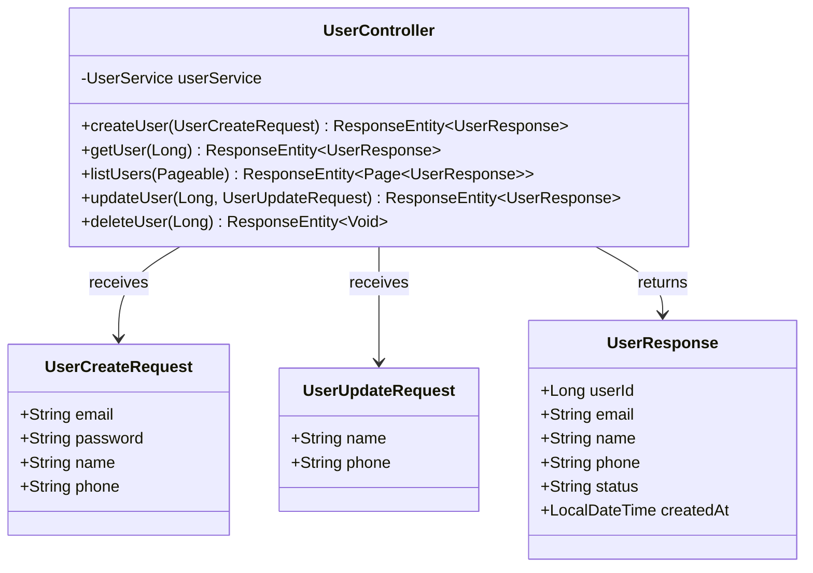
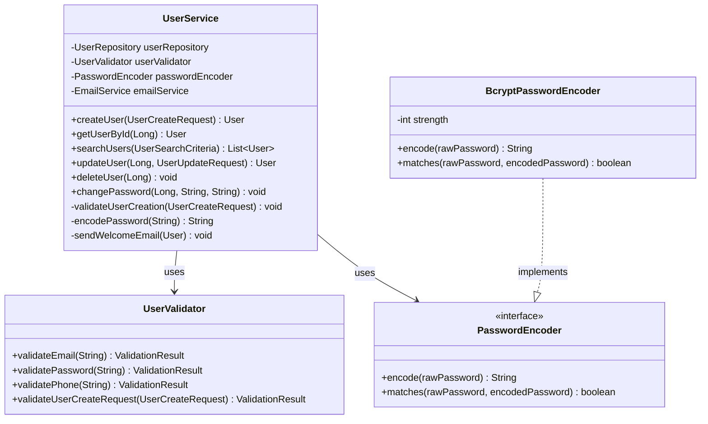
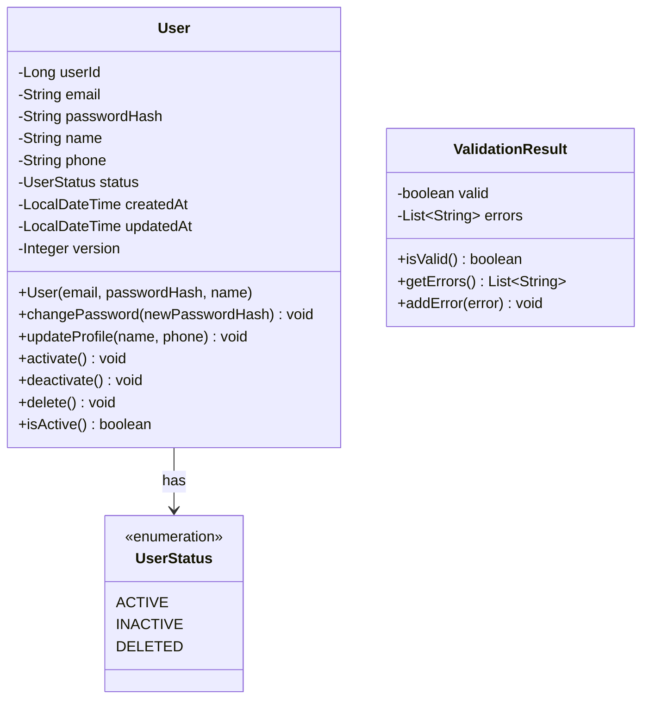
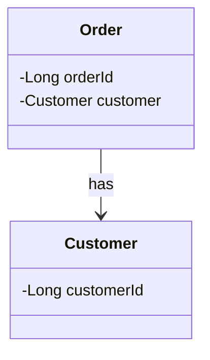
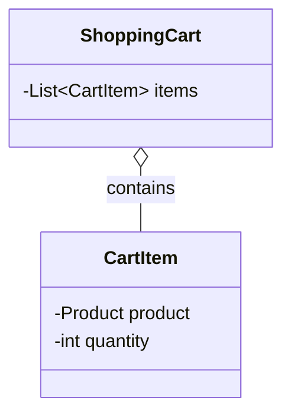
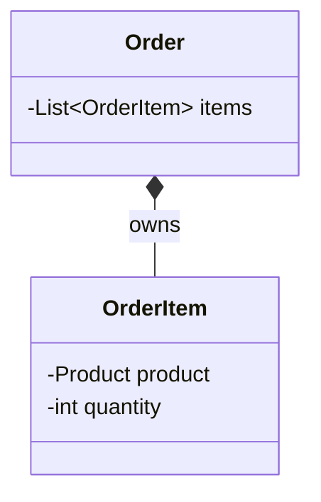
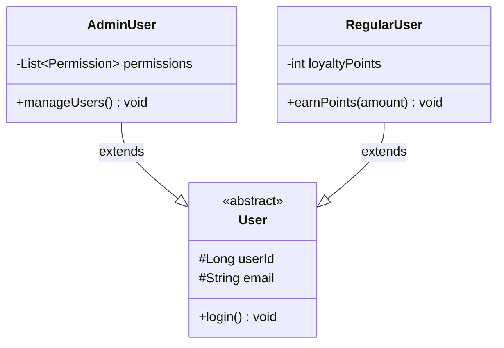
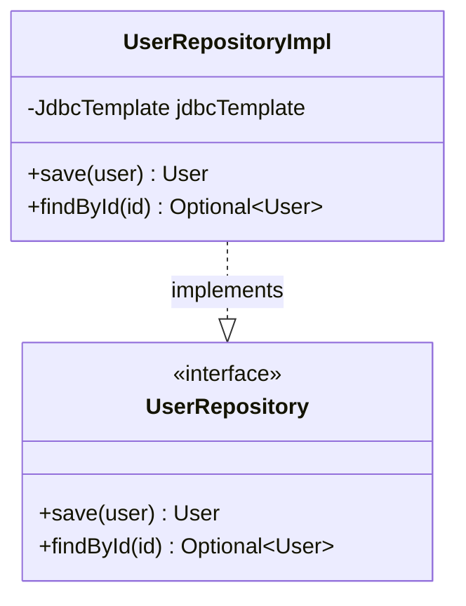
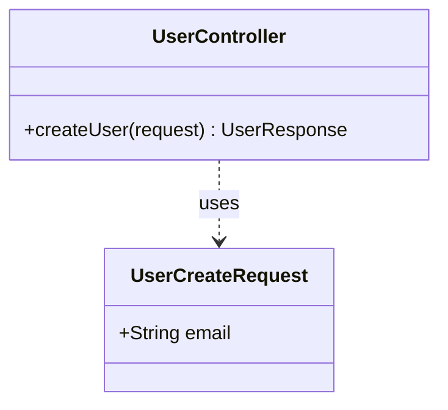

# クラス図作成ルール

**ドキュメント分類:** 詳細設計書  
**バージョン:** 1.0  
**最終更新日:** 2025-10-30

---

## 📋 1. 基本情報

### ドキュメント名
クラス図 (Class Diagram)

### 目的
- システムの静的な構造をクラスレベルで可視化する
- クラス間の関係性（継承、関連、依存）を明確にする
- オブジェクト指向設計の全体像を把握する
- 実装の青写真を提供する

### 対象読者
- **主要読者**: 開発リーダー、プログラマー
- **副次読者**: システムアーキテクト、コードレビュアー

### 関連成果物
- **入力**: 基本設計書、データベース設計書
- **出力**: 詳細設計書、ソースコード

---

## ⏰ 2. 作成タイミングと前提条件

### 作成タイミング
- **開始**: 詳細設計フェーズ序盤
- **完了**: 詳細設計レビュー前
- **更新**: クラス構造変更時に随時更新

### 前提条件
- [ ] 基本設計完成
- [ ] モジュール分割完了
- [ ] 設計パターンの選定完了

### 作成にかかる標準期間
- **小規模（〜30クラス）**: 2-3日
- **中規模（30-100クラス）**: 1-2週間
- **大規模（100クラス〜）**: 2-3週間

---

## 📐 3. ドキュメント構成

### 必須セクション

#### 3.1 全体クラス図
システム全体のクラス構造（レイヤー別）



#### 3.2 レイヤー別クラス図

##### 3.2.1 プレゼンテーション層


##### 3.2.2 ビジネスロジック層


##### 3.2.3 ドメイン層


#### 3.3 クラス詳細定義

各クラスについて以下を記載:

##### クラステンプレート
| 項目 | 内容 |
|-----|------|
| **クラス名** | UserService |
| **ステレオタイプ** | <<Service>> |
| **パッケージ** | com.example.service |
| **責務** | ユーザー管理のビジネスロジック |
| **設計パターン** | Service Layer Pattern |

##### 属性（フィールド）定義
| 名前 | 型 | 可視性 | 初期値 | 説明 |
|-----|---|--------|--------|------|
| userRepository | UserRepository | private | DI | ユーザーリポジトリ |
| userValidator | UserValidator | private | DI | ユーザー検証 |
| passwordEncoder | PasswordEncoder | private | DI | パスワードエンコーダー |

##### 操作（メソッド）定義
| 名前 | 戻り値 | 引数 | 可視性 | 説明 |
|-----|--------|------|--------|------|
| createUser | User | UserCreateRequest | public | ユーザー作成 |
| getUserById | User | Long userId | public | ユーザー取得 |
| validateUserCreation | void | UserCreateRequest | private | 作成時検証 |

#### 3.4 関係性の定義

##### 3.4.1 関連（Association）


**多重度の表記**
- `1` : 1つ
- `0..1` : 0または1つ
- `*` : 0以上
- `1..*` : 1以上
- `n..m` : n以上m以下

##### 3.4.2 集約（Aggregation）


##### 3.4.3 コンポジション（Composition）


##### 3.4.4 継承（Inheritance）


##### 3.4.5 実装（Realization）


##### 3.4.6 依存（Dependency）


---

## ✍️ 4. 記載ルール

### 4.1 UML記法の標準

#### 可視性の表記
- `+` : public
- `-` : private
- `#` : protected
- `~` : package private

#### 静的メンバーの表記
- <u>underline</u> : static

#### 抽象クラス・メソッドの表記
- *italic* または <<abstract>>

### 4.2 命名規則

#### クラス名
- PascalCase
- 名詞または名詞句
- 具体的で意味が明確

#### メソッド名
- camelCase
- 動詞で開始
- 意図が明確

#### 属性名
- camelCase
- 名詞
- 型が推測可能

### 4.3 Mermaid記法

#### 基本構文
```
classDiagram
    class ClassName {
        -privateField type
        #protectedField type
        +publicField type
        -privateMethod() returnType
        +publicMethod(param) returnType
    }
```

#### 関係性の記法
| 関係 | 記法 | 意味 |
|-----|------|------|
| 継承 | `<\|--` | extends |
| 実装 | `..\|>` | implements |
| 関連 | `-->` | has-a |
| 集約 | `o--` | aggregation |
| コンポジション | `*--` | composition |
| 依存 | `..>` | uses |

---

## ✅ 5. 品質基準

### 5.1 完成度チェックリスト

#### 網羅性
- [ ] すべての主要クラスが定義されている
- [ ] クラス間の関係性が明確
- [ ] 属性と操作が適切に定義されている

#### 一貫性
- [ ] 命名規則が統一されている
- [ ] レイヤー分けが明確
- [ ] 責務の分担が適切

#### 品質
- [ ] SOLID原則に準拠
- [ ] 循環依存がない
- [ ] 疎結合・高凝集

### 5.2 レビュー観点

- [ ] クラスの責務は単一か（SRP）
- [ ] 拡張に開いて修正に閉じているか（OCP）
- [ ] 抽象に依存しているか（DIP）
- [ ] インターフェース分離は適切か（ISP）

---

## 🤖 6. AI作成時の具体的指示

### 6.1 必須記載項目

1. **完全なクラス定義**
   - すべての属性（型、可視性）
   - すべての操作（引数、戻り値、可視性）
   - ステレオタイプ（必要に応じて）

2. **明確な関係性**
   - 継承・実装
   - 関連・集約・コンポジション
   - 多重度

3. **レイヤー分け**
   - プレゼンテーション層
   - ビジネスロジック層
   - データアクセス層

### 6.2 避けるべき表現

❌ **NG例**:
- クラスに "処理" や "管理" のみの名前
- 属性の型が不明確
- メソッドの引数・戻り値が省略

✅ **OK例**:
- 具体的なクラス名（UserService, OrderRepository）
- 型を明記（-userRepository: UserRepository）
- 完全なシグネチャ（+createUser(request: UserCreateRequest): User）

---

## 📚 7. 関連ドキュメント

- [詳細設計書](./詳細設計書作成ルール.md)
- [シーケンス図](./シーケンス図作成ルール.md)
- [データベース設計書](../../03_基本設計/データベース設計書作成ルール.md)

---

## ⚠️ 8. よくある失敗例と対策

| 失敗例 | 原因 | 対策 |
|--------|------|------|
| **God Class** | 責務の集中 | SRPに基づき分割 |
| **循環依存** | 設計の不備 | 依存関係を整理、抽象化 |
| **過度な継承** | 誤った汎用化 | コンポジションを検討 |
| **貧血ドメインモデル** | ロジックの分散 | エンティティにロジックを配置 |

---

**バージョン履歴**
- v1.0 (2025-10-30): 初版作成
