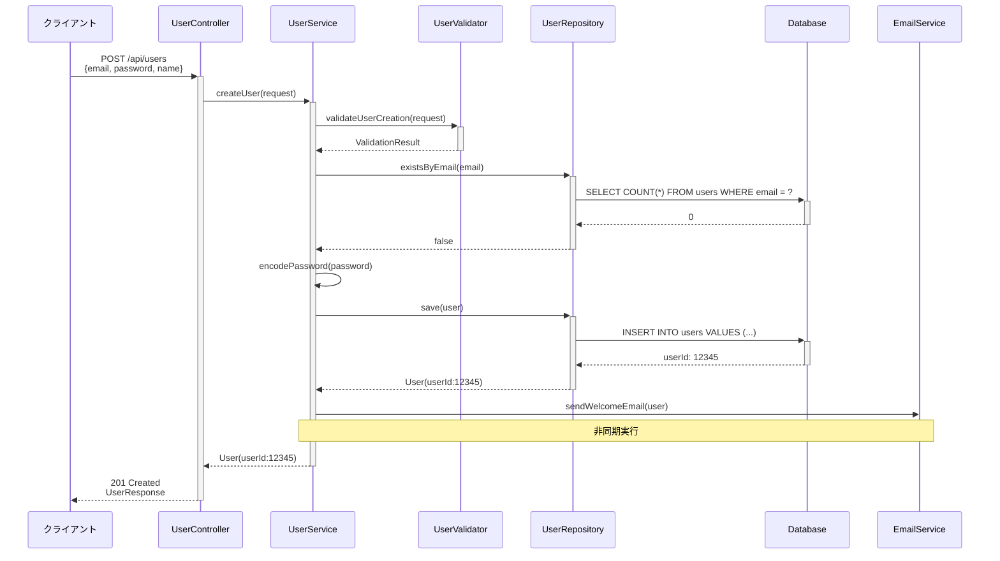
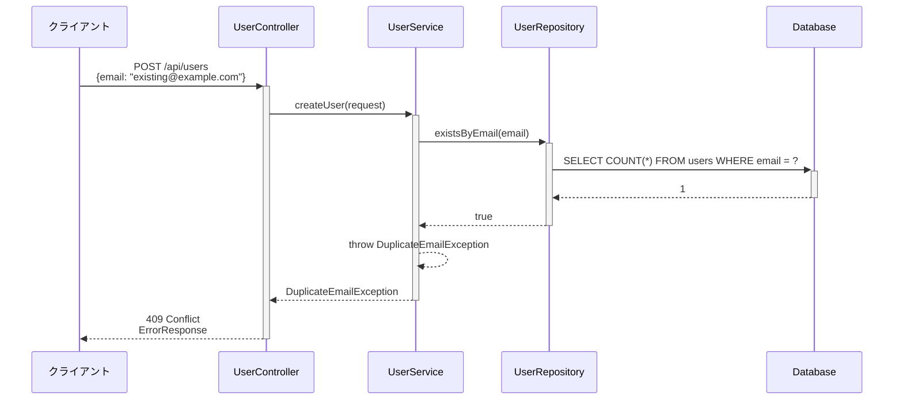
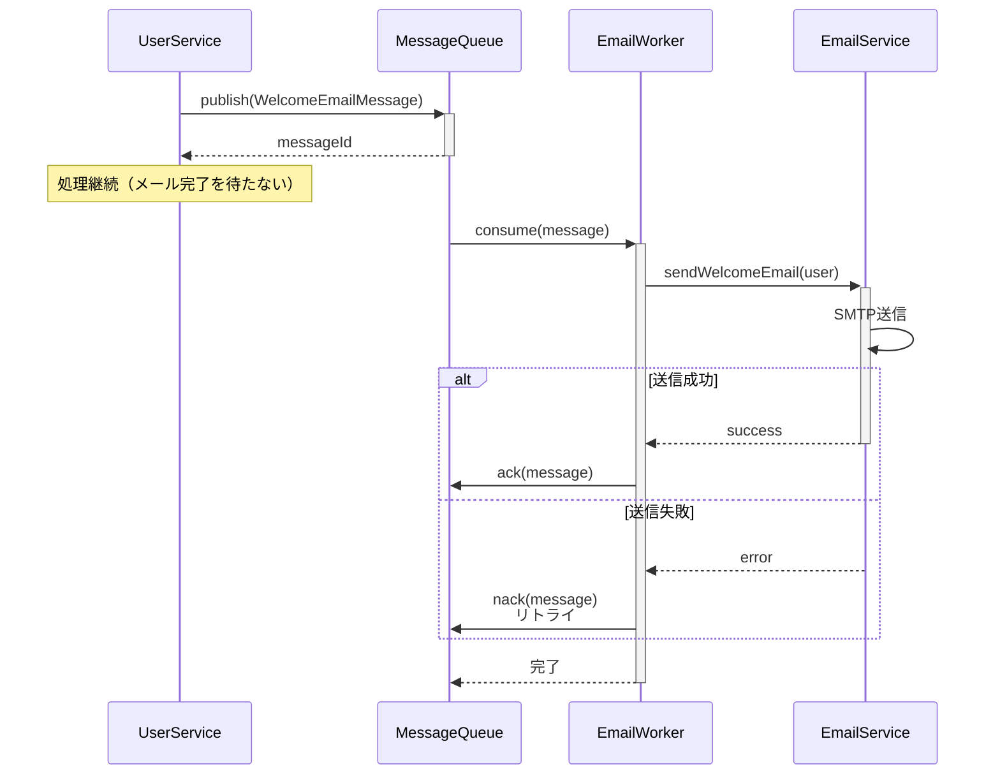

# シーケンス図作成ルール

**ドキュメント分類:** 詳細設計書  
**バージョン:** 1.0  
**最終更新日:** 2025-10-30

---

## 📋 1. 基本情報

### ドキュメント名
シーケンス図 (Sequence Diagram)

### 目的
- オブジェクト間の相互作用を時系列で表現する
- メソッド呼び出しの順序と処理フローを明確化する
- 複雑な処理の流れを視覚的に理解する
- 実装時の処理順序の指針を提供する

### 対象読者
- **主要読者**: プログラマー、開発リーダー
- **副次読者**: テスター、システムアーキテクト

### 関連成果物
- **入力**: 基本設計書、クラス図
- **出力**: 詳細設計書、ソースコード、テスト仕様書

---

## ⏰ 2. 作成タイミングと前提条件

### 作成タイミング
- **開始**: 詳細設計フェーズ中盤（クラス図完成後）
- **完了**: 詳細設計レビュー前
- **更新**: 処理フロー変更時に随時更新

### 前提条件
- [ ] クラス図完成
- [ ] 主要なユースケース明確化
- [ ] API仕様確定

### 作成にかかる標準期間
- **小規模（〜10シーケンス）**: 2-3日
- **中規模（10-30シーケンス）**: 1-2週間
- **大規模（30シーケンス〜）**: 2-3週間

---

## 📐 3. ドキュメント構成

### 必須セクション

#### 3.1 シーケンス図一覧
| ID | シーケンス名 | 概要 | 関連ユースケース |
|----|------------|------|----------------|
| SEQ-001 | ユーザー登録 | 新規ユーザー登録処理 | UC-001 |
| SEQ-002 | ログイン | 認証処理 | UC-002 |
| SEQ-003 | 商品検索 | 商品検索・一覧表示 | UC-005 |

#### 3.2 シーケンス図詳細

##### 3.2.1 基本構造

**ユーザー登録シーケンス（正常系）**


**ユーザー登録シーケンス（異常系: メール重複）**


##### 3.2.2 複雑な処理フロー

**注文処理シーケンス（トランザクション）**
```mermaid
sequenceDiagram
    participant Client
    participant OrderController
    participant OrderService
    participant ProductService
    participant PaymentService
    participant OrderRepository
    participant ProductRepository
    participant DB
    
    Client->>+OrderController: POST /api/orders
    OrderController->>+OrderService: createOrder(request)
    
    Note over OrderService,DB: トランザクション開始
    
    loop 各商品について
        OrderService->>+ProductService: checkStock(productId, quantity)
        ProductService->>+ProductRepository: findById(productId)
        ProductRepository->>+DB: SELECT * FROM products WHERE id = ?
        DB-->>-ProductRepository: Product
        ProductRepository-->>-ProductService: Product
        
        alt 在庫あり
            ProductService-->>OrderService: OK
        else 在庫不足
            ProductService-->>-OrderService: StockException
            OrderService-->>OrderService: ロールバック
            OrderService-->>-OrderController: StockException
            OrderController-->>Client: 400 Bad Request
        end
    end
    
    OrderService->>+PaymentService: processPayment(amount, card)
    PaymentService->>PaymentService: 外部決済API呼び出し
    
    alt 決済成功
        PaymentService-->>-OrderService: PaymentResult(success)
        
        OrderService->>+OrderRepository: save(order)
        OrderRepository->>+DB: INSERT INTO orders ...
        DB-->>-OrderRepository: orderId
        OrderRepository-->>-OrderService: Order
        
        OrderService->>+ProductService: decreaseStock(items)
        ProductService->>ProductRepository: updateStock(productId, -quantity)
        ProductRepository->>DB: UPDATE products SET stock = stock - ?
        ProductService-->>-OrderService: OK
        
        Note over OrderService,DB: コミット
        
        OrderService-->>-OrderController: Order
        OrderController-->>-Client: 201 Created
    else 決済失敗
        PaymentService-->>-OrderService: PaymentException
        OrderService-->>OrderService: ロールバック
        OrderService-->>-OrderController: PaymentException
        OrderController-->>Client: 402 Payment Required
    end
```

##### 3.2.3 非同期処理

**非同期メール送信**


#### 3.3 フラグメント（複合フラグメント）

##### 3.3.1 alt（代替）
条件分岐を表現
```
alt 条件1
    処理A
else 条件2
    処理B
else
    処理C
end
```

##### 3.3.2 opt（オプション）
条件付き実行
```
opt 条件
    処理
end
```

##### 3.3.3 loop（繰り返し）
繰り返し処理
```
loop [条件]
    処理
end
```

##### 3.3.4 par（並行）
並行実行
```
par
    処理A
and
    処理B
end
```

---

## ✍️ 4. 記載ルール

### 4.1 参加者（ライフライン）

#### 参加者の種類
- **Actor**: ユーザー、外部システム
- **Boundary**: コントローラー、ゲートウェイ
- **Control**: サービス、ユースケース
- **Entity**: エンティティ、リポジトリ

#### 命名規則
- 具体的な名前（UserController, OrderService）
- 役割が明確
- 左から右へ呼び出し順

### 4.2 メッセージ

#### メッセージの種類
| 種類 | 記法 | 意味 |
|-----|------|------|
| 同期呼び出し | `->>`| メソッド呼び出し（戻り値待ち） |
| 戻り値 | `-->>` | return |
| 非同期呼び出し | `-)` | 非同期メッセージ |
| 自己呼び出し | `->>`（自分自身） | private method call |

#### メッセージラベル
```
メソッド名(引数): 戻り値
例: createUser(request): User
    findById(userId): Optional<User>
```

### 4.3 活性化（Activation）

メソッド実行中を示す縦棒:
```
participant A
participant B

A->>+B: method()
B-->>-A: result
```

---

## ✅ 5. 品質基準

### 5.1 完成度チェックリスト

#### 網羅性
- [ ] 主要なユースケースが網羅されている
- [ ] 正常系と異常系が両方定義されている
- [ ] トランザクション境界が明確

#### 詳細度
- [ ] メソッド名と引数が明記されている
- [ ] 戻り値が明記されている
- [ ] 条件分岐の判断基準が明確

#### 一貫性
- [ ] 命名規則が統一されている
- [ ] クラス図と整合している
- [ ] API仕様と整合している

### 5.2 レビュー観点

- [ ] 処理の流れは論理的か
- [ ] エラーハンドリングは適切か
- [ ] トランザクション管理は正しいか
- [ ] パフォーマンスボトルネックはないか

---

## 🤖 6. AI作成時の具体的指示

### 6.1 必須記載項目

1. **完全な処理フロー**
   - すべてのメソッド呼び出し
   - 引数と戻り値
   - 条件分岐

2. **異常系の明記**
   - 例外発生条件
   - 例外の種類
   - エラー処理

3. **トランザクション境界**
   - 開始・コミット・ロールバック
   - データ整合性の保証

### 6.2 避けるべき表現

❌ **NG例**:
- "処理を実行" → ✅ "createUser(request): User"
- "データ取得" → ✅ "findById(userId): Optional<User>"
- "エラー処理" → ✅ "throw ValidationException"

---

## 📚 7. 関連ドキュメント

- [クラス図](./クラス図作成ルール.md)
- [詳細設計書](./詳細設計書作成ルール.md)
- [インターフェース設計書](../../03_基本設計/インターフェース設計書作成ルール.md)

---

## ⚠️ 8. よくある失敗例と対策

| 失敗例 | 原因 | 対策 |
|--------|------|------|
| **詳細度不足** | 抽象的な記述 | メソッド名・引数を明記 |
| **異常系の欠如** | ハッピーパスのみ | 例外パスも必ず記載 |
| **トランザクション不明確** | 境界が曖昧 | Note で明示 |
| **過度に複雑** | 1図に詰め込みすぎ | ユースケース単位で分割 |

---

**バージョン履歴**
- v1.0 (2025-10-30): 初版作成
