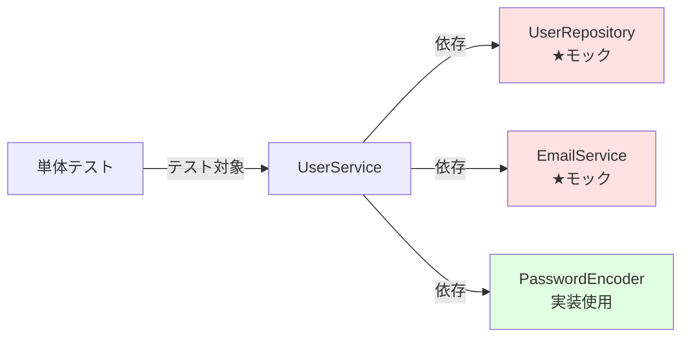
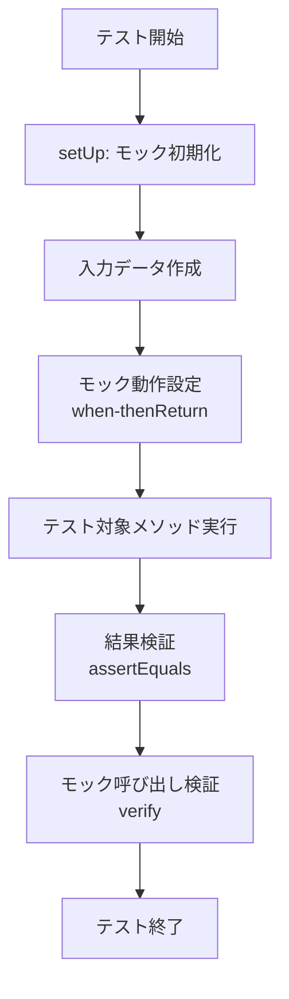

# 単体テスト仕様書作成ルール

## 1. 基本情報

### 1.1 ドキュメント名
単体テスト仕様書（Unit Test Specification）

### 1.2 目的
- 個々のクラス、メソッド、関数の動作を検証するテストケースを定義する
- 境界値分析、同値分割法等のテスト技法を適用し、網羅的なテストを実現する
- 実装者がテストコードを作成するための明確な指針を提供する
- コードカバレッジ目標を設定し、品質基準を明確にする

### 1.3 対象読者
- 開発者（実装担当者）
- テストエンジニア
- コードレビュアー
- 品質保証担当者

### 1.4 関連成果物
- **前提**：詳細設計書、クラス図、シーケンス図
- **参照**：コーディング規約、テスト戦略書
- **出力先**：単体テストコード、単体テスト報告書

---

## 2. 作成タイミングと前提条件

### 2.2 作成タイミング
- 詳細設計完了後
- 実装開始前、または実装と並行（TDD: Test-Driven Development）
- コードレビュー前

### 2.2 前提条件
- 詳細設計書が完成している
- テスト対象クラス・メソッドのインターフェースが確定している
- 使用するテストフレームワークが決定している（JUnit、pytest、Jest等）
- モックライブラリが選定されている（Mockito、unittest.mock等）

### 2.3 標準作成期間
- 小規模機能（5クラス以下）：1～2日
- 中規模機能（10～20クラス）：3～5日
- 大規模機能（20クラス以上）：1～2週間

---

## 3. ドキュメント構成

### 3.1 必須セクション

#### 3.1.1 テスト方針
- テスト対象範囲（対象クラス・メソッド一覧）
- 使用するテストフレームワーク
- コードカバレッジ目標（C0, C1, C2）
- テスト環境（OS、言語バージョン、依存ライブラリ）

#### 3.1.2 テストケース一覧
- テストケースID
- テスト項目名
- テスト観点（正常系、異常系、境界値等）
- 前提条件
- 入力値
- 期待結果
- 優先度

#### 3.1.3 テストデータ設計
- テストデータの作成方法
- テストフィクスチャ（初期データ）
- モック・スタブの使用方針

#### 3.1.4 カバレッジ目標
- ステートメントカバレッジ（C0）: 80%以上
- ブランチカバレッジ（C1）: 70%以上
- 条件カバレッジ（C2）: 必要に応じて

#### 3.1.5 依存関係の扱い
- 外部API、データベース、ファイルシステムへの依存
- モック・スタブによる依存解消方法
- テストダブルの種類（Dummy、Stub、Spy、Mock、Fake）

---

## 4. 記載ルール

### 4.1 テストケース表記規則

#### 4.1.1 テストケース一覧表
```markdown
### クラス: UserService

| テストケースID | テスト項目 | テスト観点 | 前提条件 | 入力値 | 期待結果 | 優先度 |
|----------------|------------|------------|----------|--------|----------|--------|
| UT_US_001 | ユーザー登録_正常系 | 正常系 | DBが空 | email="test@example.com", password="Pass123!" | ユーザーIDが返される、DBに1件登録 | 高 |
| UT_US_002 | ユーザー登録_重複メール | 異常系 | 同じメールが存在 | email="existing@example.com" | DuplicateEmailException発生 | 高 |
| UT_US_003 | ユーザー登録_不正メール | 異常系 | - | email="invalid-email" | ValidationException発生 | 中 |
| UT_US_004 | ユーザー登録_空パスワード | 境界値 | - | password="" | ValidationException発生 | 中 |
| UT_US_005 | ユーザー登録_最小長パスワード | 境界値 | - | password="Pass1!" (6文字) | ユーザーIDが返される | 低 |
```

#### 4.1.2 詳細テストケース
```markdown
### テストケース詳細: UT_US_001

**テストケースID**: UT_US_001  
**テスト項目**: ユーザー登録_正常系  
**テスト観点**: 正常系

**前提条件**:
- データベースが空の状態
- UserRepositoryはモックを使用

**入力値**:
```java
RegisterUserRequest request = RegisterUserRequest.builder()
    .email("test@example.com")
    .password("Pass123!")
    .name("Test User")
    .build();
```

**期待結果**:
1. `userService.registerUser(request)`が成功する
2. 戻り値として`userId`（Long型）が返される
3. `userRepository.save()`が1回呼び出される
4. 保存されるUserエンティティの`email`が"test@example.com"である
5. 保存されるUserエンティティの`passwordHash`がbcryptでハッシュ化されている

**検証方法**:
```java
@Test
void testRegisterUser_Success() {
    // Arrange
    RegisterUserRequest request = new RegisterUserRequest("test@example.com", "Pass123!", "Test User");
    User savedUser = new User(1L, "test@example.com", "hashed_password", "Test User");
    when(userRepository.existsByEmail(anyString())).thenReturn(false);
    when(userRepository.save(any(User.class))).thenReturn(savedUser);
    
    // Act
    Long userId = userService.registerUser(request);
    
    // Assert
    assertNotNull(userId);
    assertEquals(1L, userId);
    verify(userRepository, times(1)).save(argThat(user -> 
        user.getEmail().equals("test@example.com") && 
        user.getPasswordHash() != null
    ));
}
```
```

### 4.2 テスト技法の適用

#### 4.2.1 同値分割法
```markdown
### メソッド: validateAge(int age)

**有効同値クラス**:
- クラス1: 18 ≤ age ≤ 120 → 有効（成人）
- 代表値: 18, 30, 65, 120

**無効同値クラス**:
- クラス2: age < 18 → 無効（未成年）
  - 代表値: 0, 10, 17
- クラス3: age > 120 → 無効（異常値）
  - 代表値: 121, 150, 999

| テストケースID | 入力値 | 同値クラス | 期待結果 |
|----------------|--------|------------|----------|
| UT_VA_001 | 18 | クラス1 | true |
| UT_VA_002 | 65 | クラス1 | true |
| UT_VA_003 | 17 | クラス2 | false |
| UT_VA_004 | 121 | クラス3 | false |
```

#### 4.2.2 境界値分析
```markdown
### メソッド: validatePassword(String password)

**仕様**: パスワードは6文字以上、20文字以下

**境界値**:
- 最小値 - 1: 5文字 → 無効
- 最小値: 6文字 → 有効
- 最小値 + 1: 7文字 → 有効
- 最大値 - 1: 19文字 → 有効
- 最大値: 20文字 → 有効
- 最大値 + 1: 21文字 → 無効

| テストケースID | 入力値 | 境界値 | 期待結果 |
|----------------|--------|--------|----------|
| UT_VP_001 | "Pass1" (5文字) | 最小値 - 1 | ValidationException |
| UT_VP_002 | "Pass1!" (6文字) | 最小値 | OK |
| UT_VP_003 | "Pass12!" (7文字) | 最小値 + 1 | OK |
| UT_VP_004 | "Pass123456789012" (19文字) | 最大値 - 1 | OK |
| UT_VP_005 | "Pass1234567890123" (20文字) | 最大値 | OK |
| UT_VP_006 | "Pass12345678901234" (21文字) | 最大値 + 1 | ValidationException |
```

### 4.3 モック・スタブの使用方針

```markdown
### 依存関係のモック化

**対象クラス**: UserService  
**依存関係**:
- UserRepository（データベースアクセス）→ **モック**
- EmailService（外部メール送信）→ **モック**
- PasswordEncoder（暗号化）→ **実装を使用**（処理が軽量）

**モック設定例**:
```java
@Mock
private UserRepository userRepository;

@Mock
private EmailService emailService;

@InjectMocks
private UserService userService;

@BeforeEach
void setUp() {
    MockitoAnnotations.openMocks(this);
}

@Test
void testRegisterUser_SendsWelcomeEmail() {
    // Arrange
    when(userRepository.save(any(User.class))).thenReturn(new User(1L, "test@example.com"));
    
    // Act
    userService.registerUser(new RegisterUserRequest("test@example.com", "Pass123!"));
    
    // Assert
    verify(emailService, times(1)).sendWelcomeEmail("test@example.com");
}
```
```

### 4.4 Mermaid図の使用

#### 4.4.1 テスト対象クラスの依存関係


#### 4.4.2 テストケースのフローチャート


---

## 5. 品質基準

### 5.1 チェックリスト

- [ ] 全ての公開メソッド（public）にテストケースが存在するか
- [ ] 正常系、異常系、境界値のテストケースが揃っているか
- [ ] 同値分割法、境界値分析が適用されているか
- [ ] モック・スタブの使用方針が明確か
- [ ] テストケースIDの命名規則が統一されているか
- [ ] 期待結果が具体的に記載されているか（曖昧な表現は避ける）
- [ ] カバレッジ目標が設定されているか
- [ ] 実行順序に依存しないテストケースか（テストの独立性）
- [ ] テストデータの作成方法が明確か

### 5.2 レビュー観点

#### 5.2.1 網羅性
- 全ての分岐（if, switch）がカバーされているか
- 例外処理のテストケースがあるか
- null入力のテストケースがあるか

#### 5.2.2 独立性
- テストケース間の実行順序依存がないか
- 共有状態（static変数等）への依存がないか

#### 5.2.3 保守性
- テストコードの可読性は高いか
- テストメソッド名から目的が理解できるか
- マジックナンバーがないか（定数化されているか）

### 5.3 承認基準
- 開発者によるテストケースレビュー完了
- カバレッジ目標達成の見込みがあること
- テスト実装可能性の確認

---

## 6. AI作成時の具体的指示

### 6.1 必須項目

1. **テストケースの具体性**
   - 入力値を具体的に記載（"適切な値"等の曖昧な表現を避ける）
   - 期待結果を検証可能な形で記載

2. **テスト技法の適用**
   - 同値分割法、境界値分析を明示的に適用
   - 各テストケースがどのテスト技法に基づくか記載

3. **モック戦略の明確化**
   - どの依存関係をモック化するか理由とともに記載
   - モックの設定内容（when-thenReturn等）を具体的に記載

4. **カバレッジ目標の設定**
   - C0（ステートメント）、C1（ブランチ）の目標値を明記
   - 達成困難な箇所があれば理由を記載

### 6.2 避けるべき表現

❌ **NG例**：
```markdown
- "適切な入力値でテストする"
- "正しい結果が返されることを確認"
- "エラーが発生しないこと"
- "正常に動作すること"
```

✅ **OK例**：
```markdown
- "email='test@example.com', password='Pass123!'を入力"
- "戻り値がLong型のuserIdであり、値が1L以上であること"
- "ValidationException（エラーコード: E001）が発生すること"
- "userRepository.save()が1回だけ呼び出され、引数のUserエンティティのemailが'test@example.com'であること"
```

### 6.3 推奨構成

1. **テストケース一覧表→詳細→実装例の順で記載**
   - まず全体像（一覧表）を示す
   - 次に代表的なテストケースの詳細を記載
   - 最後に実装コード例を提示

2. **AAA（Arrange-Act-Assert）パターンの適用**
   ```java
   @Test
   void testMethodName() {
       // Arrange（準備）
       // テストデータ、モック設定
       
       // Act（実行）
       // テスト対象メソッドの呼び出し
       
       // Assert（検証）
       // 結果の検証、モック呼び出しの検証
   }
   ```

3. **テストメソッド命名規則**
   - `test<メソッド名>_<条件>_<期待結果>`
   - 例: `testRegisterUser_DuplicateEmail_ThrowsException`

---

## 7. 関連ドキュメント

### 7.1 参照すべき成果物
- **詳細設計書**：テスト対象メソッドの仕様
- **クラス図**：依存関係、モック対象の特定
- **コーディング規約**：テストコードの命名規則

### 7.2 次工程で使用される成果物
- **単体テストコード**：本仕様書に基づいて実装
- **単体テスト報告書**：テスト結果、カバレッジ実績
- **結合テスト仕様書**：単体テストでカバーできない箇所を補完

---

## 8. よくある失敗例と対策

| 失敗例 | 原因 | 対策 |
|--------|------|------|
| テストケースが少なすぎる | 正常系のみテスト | 異常系、境界値、null入力を必ずテスト。同値分割法・境界値分析を適用 |
| 期待結果が曖昧 | "正常に動作する"等の表現 | 具体的な値、例外クラス、メソッド呼び出し回数を明記 |
| モックの設定漏れ | 依存関係の見落とし | クラス図から依存関係を洗い出し、全ての外部依存をモック化 |
| テストの実行順序依存 | static変数、共有リソースの使用 | @BeforeEachで状態を初期化。テストごとに独立したデータを使用 |
| カバレッジが低い | 例外処理、elseブロックのテスト漏れ | ブランチカバレッジを確認し、全ての分岐をテスト |
| テストが遅い | 実データベース、実APIの使用 | モック・スタブで外部依存を排除。テストDBはインメモリ（H2等）を使用 |
| テストが不安定（Flaky Test） | 時刻依存、ランダム値の使用 | 時刻はモック化。ランダム値は固定シードまたはモック化 |
| private メソッドのテスト | privateメソッドを直接テスト | publicメソッド経由でテスト。どうしても必要ならリフレクション使用 |

---

## 9. 補足：テストフレームワーク別のポイント

### 9.1 Java (JUnit 5 + Mockito)
```java
@ExtendWith(MockitoExtension.class)
class UserServiceTest {
    @Mock private UserRepository userRepository;
    @InjectMocks private UserService userService;
    
    @Test
    void testRegisterUser_Success() {
        // テストコード
    }
}
```

### 9.2 Python (pytest + unittest.mock)
```python
from unittest.mock import Mock, patch
import pytest

def test_register_user_success():
    # Arrange
    user_repository = Mock()
    user_repository.exists_by_email.return_value = False
    user_service = UserService(user_repository)
    
    # Act
    user_id = user_service.register_user("test@example.com", "Pass123!")
    
    # Assert
    assert user_id is not None
    user_repository.save.assert_called_once()
```

### 9.3 JavaScript (Jest)
```javascript
describe('UserService', () => {
  let userService;
  let userRepository;
  
  beforeEach(() => {
    userRepository = {
      save: jest.fn(),
      existsByEmail: jest.fn()
    };
    userService = new UserService(userRepository);
  });
  
  test('registerUser - success', async () => {
    // Arrange
    userRepository.existsByEmail.mockResolvedValue(false);
    userRepository.save.mockResolvedValue({ id: 1 });
    
    // Act
    const userId = await userService.registerUser('test@example.com', 'Pass123!');
    
    // Assert
    expect(userId).toBe(1);
    expect(userRepository.save).toHaveBeenCalledTimes(1);
  });
});
```

---

**ドキュメントバージョン**: 1.0  
**最終更新日**: 2025-10-30
