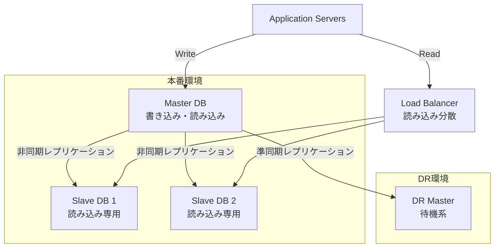
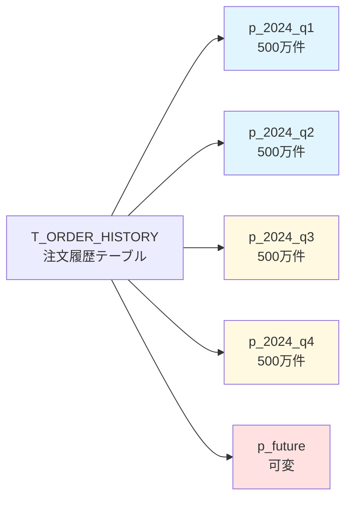

# 物理DB設計書作成ルール

## 1. 基本情報

### 1.1 ドキュメント名
物理DB設計書（Physical Database Design Document）

### 1.2 目的
- 論理DB設計を物理的な実装仕様に変換する
- パフォーマンス、ストレージ、可用性を考慮した最適化設計を行う
- インデックス、パーティショニング、レプリケーション等の物理的実装を定義する
- DBA（データベース管理者）が実装可能なレベルまで詳細化する

### 1.3 対象読者
- データベース管理者（DBA）
- インフラエンジニア
- バックエンド開発者
- 性能チューニング担当者

### 1.4 関連成果物
- **前提**：データベース設計書（論理設計）、アーキテクチャ設計書
- **参照**：詳細設計書、非機能要件定義書
- **出力先**：DDLスクリプト、データベース構築手順書

---

## 2. 作成タイミングと前提条件

### 2.1 作成タイミング
- 論理DB設計完了後
- 非機能要件（性能、可用性、拡張性）が確定した後
- 詳細設計フェーズの中盤～後半

### 2.2 前提条件
- 論理ER図、テーブル定義が完成している
- 想定データ量、トランザクション量が明確
- 使用するDBMS（MySQL、PostgreSQL、Oracle等）が確定している
- インフラ構成（単一DB、レプリケーション、シャーディング等）が決定している

### 2.3 標準作成期間
- 小規模システム：3～5日
- 中規模システム：1～2週間
- 大規模システム：2～4週間

---

## 3. ドキュメント構成

### 3.1 必須セクション

#### 3.1.1 物理設計概要
- 使用DBMS、バージョン
- 文字コード、照合順序（Collation）
- ストレージエンジン（MySQL: InnoDB/MyISAM等）
- データベース容量見積もり

#### 3.1.2 テーブル物理定義
- 物理テーブル名（命名規則適用後）
- カラム物理定義（データ型、サイズ、デフォルト値）
- 主キー、外部キー制約
- NOT NULL、UNIQUE制約
- チェック制約

#### 3.1.3 インデックス設計
- 主キーインデックス
- セカンダリインデックス（単一カラム/複合）
- ユニークインデックス
- フルテキストインデックス
- 空間インデックス（GIS）

#### 3.1.4 パーティショニング設計
- パーティショニング方式（Range、List、Hash、Key）
- パーティションキー
- パーティション境界値
- サブパーティション設計

#### 3.1.5 ストレージ設計
- テーブルスペース設計
- データファイル配置
- ログファイル配置
- 一時領域設計
- バックアップ領域設計

#### 3.1.6 性能最適化設計
- クエリ最適化方針
- キャッシュ設定（バッファプール等）
- 接続プール設計
- 実行計画の想定

#### 3.1.7 可用性設計
- レプリケーション構成（マスター・スレーブ、マルチマスター）
- フェイルオーバー方式
- バックアップ・リストア方式
- ポイントインタイムリカバリ（PITR）

#### 3.1.8 セキュリティ設計
- ユーザー・ロール定義
- 権限設計（SELECT、INSERT、UPDATE、DELETE）
- 暗号化設定（TDE、列レベル暗号化）
- 監査ログ設定

---

## 4. 記載ルール

### 4.1 テーブル物理定義の表記規則

#### 4.1.1 物理テーブル名
```markdown
| 論理名 | 物理名 | 備考 |
|--------|--------|------|
| ユーザー | T_USER | トランザクションテーブル |
| 注文 | T_ORDER | トランザクションテーブル |
| 商品カテゴリ | M_CATEGORY | マスターテーブル |
```

#### 4.1.2 カラム物理定義
```markdown
### テーブル: T_USER

| 物理名 | データ型 | サイズ | NULL | デフォルト | 備考 |
|--------|----------|--------|------|------------|------|
| user_id | BIGINT | - | NOT NULL | AUTO_INCREMENT | PK |
| email | VARCHAR | 255 | NOT NULL | - | UNIQUE |
| password_hash | CHAR | 60 | NOT NULL | - | bcrypt hash |
| created_at | TIMESTAMP | - | NOT NULL | CURRENT_TIMESTAMP | |
| updated_at | TIMESTAMP | - | NOT NULL | CURRENT_TIMESTAMP ON UPDATE | |
```

### 4.2 インデックス設計の表記規則

```markdown
### テーブル: T_ORDER

| インデックス名 | 種別 | カラム | 目的・備考 |
|----------------|------|--------|------------|
| PK_ORDER | PRIMARY | order_id | 主キー |
| IDX_ORDER_USER | BTREE | user_id | ユーザー別注文検索 |
| IDX_ORDER_STATUS_DATE | BTREE | status, order_date | ステータス別日付検索（複合） |
| UQ_ORDER_NUMBER | UNIQUE | order_number | 注文番号の一意性保証 |

**インデックス選定理由**：
- `IDX_ORDER_USER`：ユーザーの注文履歴取得クエリ（頻度：高）で使用
- `IDX_ORDER_STATUS_DATE`：管理画面でのステータス別注文一覧（頻度：中）で使用
- カラム順序：カーディナリティの低い`status`を先頭に配置（範囲検索の効率化）
```

### 4.3 パーティショニング設計の表記規則

```markdown
### テーブル: T_ORDER_HISTORY（注文履歴）

**パーティショニング方式**: RANGE (order_date)

| パーティション名 | 境界値 | 想定データ量 | 備考 |
|------------------|--------|--------------|------|
| p_2024_q1 | < '2024-04-01' | 500万件 | 2024年Q1 |
| p_2024_q2 | < '2024-07-01' | 500万件 | 2024年Q2 |
| p_2024_q3 | < '2024-10-01' | 500万件 | 2024年Q3 |
| p_2024_q4 | < '2025-01-01' | 500万件 | 2024年Q4 |
| p_future | MAXVALUE | - | 未来データ用 |

**パーティショニング理由**：
- 注文履歴は時系列データで、直近3ヶ月以外はほぼ参照のみ
- 四半期ごとにパーティションを分割し、古いデータのアーカイブを容易にする
- パーティションプルーニングにより、日付範囲指定クエリの性能を向上
```

### 4.4 ストレージ設計の表記規則

```markdown
### テーブルスペース設計

| テーブルスペース名 | 用途 | 初期サイズ | 自動拡張 | 最大サイズ | 配置先 |
|--------------------|------|------------|----------|------------|--------|
| TBS_MASTER | マスターデータ | 100MB | 50MB | 5GB | /data01/master |
| TBS_TRANSACTION | トランザクションデータ | 1GB | 500MB | 100GB | /data02/transaction |
| TBS_HISTORY | 履歴データ | 5GB | 1GB | 500GB | /data03/history |
| TBS_INDEX | インデックス | 500MB | 200MB | 50GB | /data04/index |
| TBS_TEMP | 一時領域 | 500MB | 100MB | 10GB | /data05/temp |
```

### 4.5 Mermaid図の使用

#### 4.5.1 レプリケーション構成図


#### 4.5.2 パーティション構造図


---

## 5. 品質基準

### 5.1 チェックリスト

- [ ] 全テーブルに主キーインデックスが定義されているか
- [ ] 外部キーカラムにインデックスが設定されているか
- [ ] WHERE句で頻繁に使用されるカラムにインデックスがあるか
- [ ] 複合インデックスのカラム順序が適切か（カーディナリティ考慮）
- [ ] 大量データテーブルにパーティショニングが検討されているか
- [ ] レプリケーション遅延への対応策が明記されているか
- [ ] バックアップ・リストアの所要時間が見積もられているか
- [ ] ディスク容量の見積もりが3年分以上行われているか
- [ ] 文字コードの一貫性が保たれているか
- [ ] 論理設計との対応関係が明確か

### 5.2 レビュー観点

#### 5.2.1 性能面
- インデックスの過不足はないか
- クエリ実行計画は最適化されているか
- キャッシュ設定は適切か
- パーティショニングは効果的か

#### 5.2.2 可用性面
- レプリケーション構成は要件を満たすか
- フェイルオーバー時間は許容範囲内か
- バックアップ方式は要件を満たすか

#### 5.2.3 保守性面
- パーティション追加・削除の手順は明確か
- 容量拡張の手順は明確か
- モニタリング項目は定義されているか

### 5.3 承認基準
- DBAによる技術レビュー合格
- インフラチームによる実装可能性確認
- 性能要件を満たすことの理論的根拠提示
- セキュリティチームによる承認

---

## 6. AI作成時の具体的指示

### 6.1 必須項目

1. **DBMS固有機能の明示**
   - 使用DBMSのバージョンを明記
   - DBMSごとの最適化手法を適用（MySQL: InnoDB、PostgreSQL: BRIN index等）

2. **データ量ベースの設計**
   - 初期データ量、1年後、3年後、5年後の見積もりを記載
   - トランザクション量（TPS、QPSの想定）を明記

3. **インデックス設計の根拠**
   - 各インデックスの使用クエリを明示
   - クエリ実行頻度を記載（高/中/低）
   - 複合インデックスの場合、カラム順序の理由を説明

4. **パーティショニングの効果測定**
   - パーティションプルーニングによる性能改善見込みを記載
   - 保守性向上（古いデータの削除・アーカイブ）の効果を明示

### 6.2 避けるべき表現

❌ **NG例**：
```markdown
- "適切なインデックスを設定する"
- "必要に応じてパーティショニングを検討する"
- "性能要件を満たすように設計する"
```

✅ **OK例**：
```markdown
- "user_idカラムにBTREEインデックス`IDX_ORDER_USER`を作成。理由：ユーザー別注文履歴取得クエリ（頻度：高、1秒あたり100回）で使用"
- "T_ORDER_HISTORYテーブルはRANGEパーティショニング（order_date、四半期単位）を適用。理由：3年分の履歴データ（1億件）を保持し、直近1年以外は参照頻度が低い"
- "レプリケーション遅延は平均0.5秒、最大2秒を想定。読み込み専用クエリは最大2秒のデータ遅延を許容"
```

### 6.3 推奨構成

1. **テーブルごとに物理設計をまとめる**
   - カラム定義、インデックス、パーティショニングを1つのセクションに記載

2. **実装DDLスクリプトを含める**
   ```sql
   -- T_USER テーブル作成
   CREATE TABLE T_USER (
       user_id BIGINT NOT NULL AUTO_INCREMENT,
       email VARCHAR(255) NOT NULL,
       password_hash CHAR(60) NOT NULL,
       created_at TIMESTAMP NOT NULL DEFAULT CURRENT_TIMESTAMP,
       updated_at TIMESTAMP NOT NULL DEFAULT CURRENT_TIMESTAMP ON UPDATE CURRENT_TIMESTAMP,
       PRIMARY KEY (user_id),
       UNIQUE KEY UQ_USER_EMAIL (email),
       KEY IDX_USER_CREATED (created_at)
   ) ENGINE=InnoDB DEFAULT CHARSET=utf8mb4 COLLATE=utf8mb4_unicode_ci;
   ```

3. **性能試算を含める**
   ```markdown
   ### 性能試算：注文検索クエリ
   
   **クエリ**: `SELECT * FROM T_ORDER WHERE user_id = ? ORDER BY order_date DESC LIMIT 20`
   
   - データ量：1,000万件
   - インデックス：`IDX_ORDER_USER (user_id, order_date)`
   - 推定実行時間：10ms以内
   - 実行計画：Index Range Scan on IDX_ORDER_USER
   ```

---

## 7. 関連ドキュメント

### 7.1 参照すべき成果物
- **データベース設計書（論理設計）**：論理ER図、テーブル定義
- **非機能要件定義書**：性能要件、可用性要件
- **アーキテクチャ設計書**：インフラ構成、DBMS選定理由

### 7.2 次工程で使用される成果物
- **DDLスクリプト**：物理設計書を基に作成
- **データベース構築手順書**：物理設計を実装する手順
- **性能テスト仕様書**：物理設計の妥当性を検証

---

## 8. よくある失敗例と対策

| 失敗例 | 原因 | 対策 |
|--------|------|------|
| インデックスが多すぎて更新性能が劣化 | 全カラムにインデックスを作成 | 使用クエリを分析し、本当に必要なインデックスのみ作成。更新頻度とのトレードオフを考慮 |
| 複合インデックスのカラム順序が不適切 | カーディナリティを考慮せず作成 | 等価条件→範囲条件の順に配置。カーディナリティの高いカラムを前方に配置 |
| パーティショニングキーにインデックスがない | パーティションキーとクエリの不一致 | パーティショニングキーは必ずWHERE句で使用されるカラムを選択 |
| レプリケーション遅延を考慮していない | 同期レプリケーション前提の設計 | 非同期レプリケーションの遅延を考慮。読み取り一貫性が必要な場合はマスターから読み込む |
| ディスク容量の見積もりが甘い | インデックス、ログ領域を考慮していない | データ量の2～3倍の容量を確保（インデックス、バックアップ、ログを含む） |
| 文字コードの不統一 | テーブルごとに異なる文字コードを使用 | 全テーブルで統一（UTF-8推奨）。Collationも統一 |
| バックアップ時間が長すぎる | 全体バックアップのみ実施 | 増分バックアップ、差分バックアップを組み合わせる。ホットバックアップを使用 |
| パーティション境界値が固定的 | 将来のパーティション追加を考慮していない | MAXVALUEパーティションを用意。パーティション追加スクリプトを事前に作成 |

---

## 9. 補足：DBMS別の最適化ポイント

### 9.1 MySQL (InnoDB)
- クラスタードインデックス（主キー）の設計が重要
- `innodb_buffer_pool_size`の適切な設定
- パーティショニングはMySQL 8.0以降推奨

### 9.2 PostgreSQL
- VACUUMの定期実行設定
- BRINインデックス（大量データの時系列テーブル）
- パーティショニングは継承またはネイティブパーティション

### 9.3 Oracle
- 表領域の適切な設計
- マテリアライズドビューの活用
- パーティショニングオプション（Enterprise Edition）

---

**ドキュメントバージョン**: 1.0  
**最終更新日**: 2025-10-30
