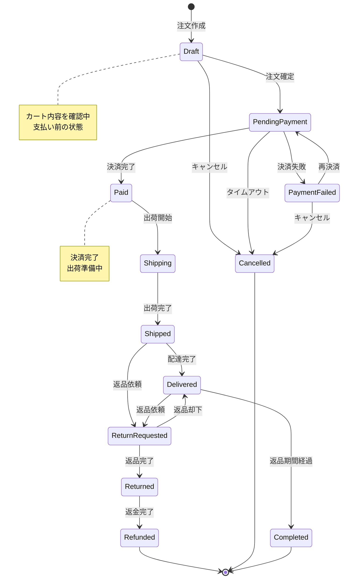
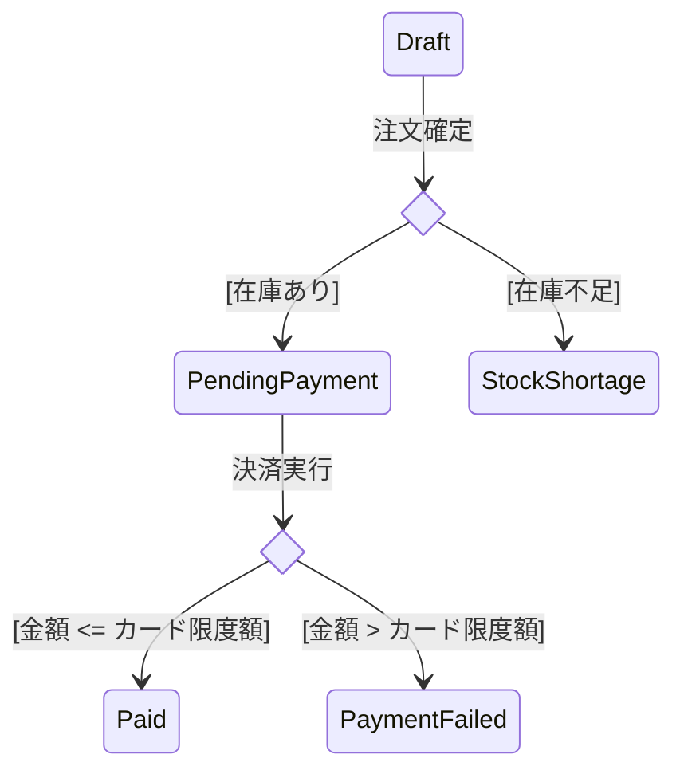
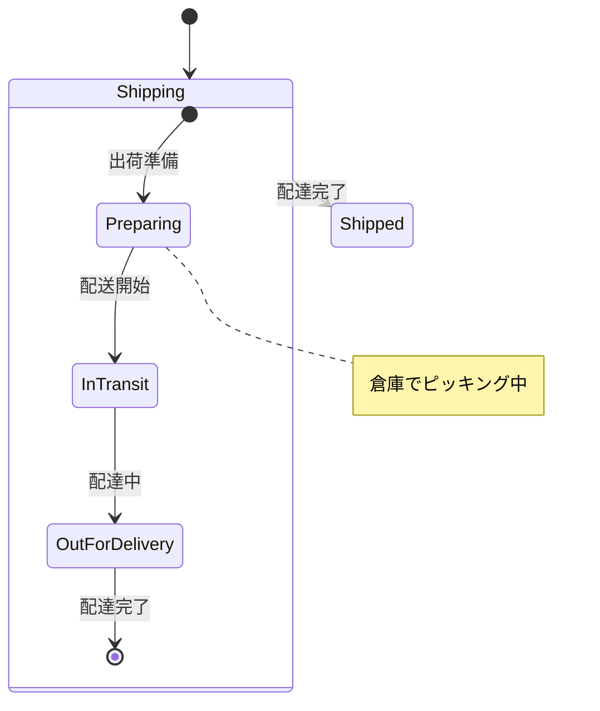

# 状態遷移図作成ルール

**ドキュメント分類:** 詳細設計書  
**バージョン:** 1.0  
**最終更新日:** 2025-10-30

---

## 📋 1. 基本情報

### ドキュメント名
状態遷移図 (State Diagram / State Machine Diagram)

### 目的
- オブジェクトのライフサイクルと状態変化を表現する
- 状態間の遷移条件とイベントを明確化する
- ビジネスルールに基づく状態管理を設計する
- ワークフローやステータス管理の実装指針を提供する

### 対象読者
- **主要読者**: プログラマー、開発リーダー
- **副次読者**: ビジネスアナリスト、テスター

### 関連成果物
- **入力**: 要件定義書、業務フロー図、クラス図
- **出力**: 詳細設計書、ソースコード、テスト仕様書

---

## ⏰ 2. 作成タイミングと前提条件

### 作成タイミング
- **開始**: 詳細設計フェーズ中盤
- **完了**: 詳細設計レビュー前
- **更新**: 状態定義変更時に随時更新

### 前提条件
- [ ] 業務要件における状態の明確化
- [ ] クラス図完成
- [ ] ビジネスルール確定

### 作成にかかる標準期間
- **小規模（〜5状態図）**: 1-2日
- **中規模（5-15状態図）**: 3-5日
- **大規模（15状態図〜）**: 1-2週間

---

## 📐 3. ドキュメント構成

### 必須セクション

#### 3.1 状態遷移図一覧
| ID | 対象エンティティ | 状態数 | 概要 |
|----|----------------|--------|------|
| STD-001 | 注文（Order） | 6 | 注文の状態管理 |
| STD-002 | ユーザー（User） | 4 | ユーザーアカウント状態 |
| STD-003 | 商品（Product） | 3 | 商品公開状態 |

#### 3.2 状態遷移図詳細

##### 3.2.1 基本構造

**注文状態遷移図**


##### 3.2.2 詳細な状態定義

**注文状態の詳細**
| 状態名 | 状態コード | 説明 | 許可アクション |
|-------|-----------|------|--------------|
| Draft | DRAFT | 下書き（カート） | 編集、確定、削除 |
| PendingPayment | PENDING_PAYMENT | 決済待ち | 決済、キャンセル |
| Paid | PAID | 決済完了 | 出荷開始 |
| Shipping | SHIPPING | 出荷中 | 配送状況更新 |
| Shipped | SHIPPED | 配送完了 | 受取確認、返品 |
| Delivered | DELIVERED | 配達完了 | 返品依頼 |
| Completed | COMPLETED | 完了 | なし（終了状態） |
| Cancelled | CANCELLED | キャンセル | なし（終了状態） |
| ReturnRequested | RETURN_REQUESTED | 返品依頼中 | 返品承認、却下 |
| Returned | RETURNED | 返品完了 | 返金処理 |
| Refunded | REFUNDED | 返金完了 | なし（終了状態） |

##### 3.2.3 遷移条件の詳細

**遷移テーブル**
| 現在状態 | イベント | 条件 | 次状態 | アクション |
|---------|---------|------|--------|-----------|
| Draft | confirm() | カート内に商品あり | PendingPayment | 在庫確保 |
| Draft | cancel() | - | Cancelled | カートクリア |
| PendingPayment | pay() | 決済成功 | Paid | 決済情報保存、メール送信 |
| PendingPayment | pay() | 決済失敗 | PaymentFailed | エラーログ記録 |
| PendingPayment | timeout() | 30分経過 | Cancelled | 在庫解放、通知送信 |
| Paid | ship() | - | Shipping | 配送番号発行、追跡開始 |
| Shipping | complete() | - | Shipped | 配送完了通知 |
| Shipped | confirm() | - | Delivered | ポイント付与 |
| Delivered | requestReturn() | 7日以内 | ReturnRequested | 返品受付メール |
| Delivered | auto() | 7日経過 | Completed | - |

##### 3.2.4 ガード条件

**条件付き遷移の例**


##### 3.2.5 複合状態（サブ状態）

**配送中の詳細状態**


##### 3.2.6 並行状態

**注文と通知の並行処理**
```mermaid
stateDiagram-v2
    [*] --> Active
    
    state Active {
        [*] --> Processing
        
        state Processing {
            --
            [*] --> OrderProcessing
            OrderProcessing --> OrderComplete
            --
            [*] --> NotificationSending
            NotificationSending --> NotificationSent
        }
        
        Processing --> Completed: 両方完了
    }
    
    Active --> [*]
```

#### 3.3 状態の実装

##### 3.3.1 Enum定義
```java
public enum OrderStatus {
    DRAFT("下書き", true, false),
    PENDING_PAYMENT("決済待ち", true, false),
    PAID("決済完了", false, false),
    SHIPPING("出荷中", false, false),
    SHIPPED("配送完了", false, false),
    DELIVERED("配達完了", false, false),
    COMPLETED("完了", false, true),
    CANCELLED("キャンセル", false, true),
    RETURN_REQUESTED("返品依頼中", false, false),
    RETURNED("返品完了", false, false),
    REFUNDED("返金完了", false, true);
    
    private final String displayName;
    private final boolean editable;      // 編集可能か
    private final boolean terminal;      // 終了状態か
    
    // コンストラクタ、ゲッター省略
    
    public boolean canTransitionTo(OrderStatus nextStatus) {
        // 遷移可能性のチェックロジック
    }
}
```

##### 3.3.2 状態遷移メソッド
```java
@Entity
public class Order {
    @Enumerated(EnumType.STRING)
    private OrderStatus status;
    
    public void confirm() {
        if (status != OrderStatus.DRAFT) {
            throw new IllegalStateException("下書き状態でのみ確定可能");
        }
        if (items.isEmpty()) {
            throw new BusinessException("商品が選択されていません");
        }
        this.status = OrderStatus.PENDING_PAYMENT;
        reserveStock();
    }
    
    public void pay(PaymentResult payment) {
        if (status != OrderStatus.PENDING_PAYMENT) {
            throw new IllegalStateException("決済待ち状態でのみ決済可能");
        }
        if (payment.isSuccess()) {
            this.status = OrderStatus.PAID;
            savePaymentInfo(payment);
            sendConfirmationEmail();
        } else {
            this.status = OrderStatus.PAYMENT_FAILED;
            logPaymentError(payment);
        }
    }
    
    // その他の遷移メソッド
}
```

---

## ✍️ 4. 記載ルール

### 4.1 状態の命名規則

#### 状態名
- 名詞または形容詞
- 過去分詞形を推奨（Paid, Shipped, Completed）
- 現在進行形（Shipping, Processing）
- 具体的で一意

#### イベント名
- 動詞の原形（create, confirm, cancel）
- 具体的なアクション

### 4.2 Mermaid記法

#### 基本構文
```
stateDiagram-v2
    [*] --> State1: イベント/条件
    State1 --> State2: イベント/条件
    State2 --> [*]
```

#### 注釈の追加
```
note right of State1
    この状態の説明
end note
```

---

## ✅ 5. 品質基準

### 5.1 完成度チェックリスト

- [ ] すべての状態が定義されている
- [ ] すべての遷移が定義されている
- [ ] 遷移条件が明確
- [ ] 初期状態と終了状態が明確
- [ ] 到達不能な状態がない
- [ ] 無限ループがない

### 5.2 レビュー観点

- [ ] ビジネスルールと整合しているか
- [ ] すべての遷移パスが妥当か
- [ ] エラー状態の処理は適切か
- [ ] 状態の粒度は適切か

---

## 🤖 6. AI作成時の具体的指示

### 6.1 必須記載項目

1. **完全な状態定義**
   - 状態名、状態コード
   - 各状態の説明
   - 許可アクション

2. **明確な遷移条件**
   - トリガーイベント
   - ガード条件
   - 遷移アクション

### 6.2 避けるべき表現

❌ "適切な状態" → ✅ "PAID（決済完了）"
❌ "処理中" → ✅ "SHIPPING（出荷中）"

---

## 📚 7. 関連ドキュメント

- [クラス図](./クラス図作成ルール.md)
- [詳細設計書](./詳細設計書作成ルール.md)

---

## ⚠️ 8. よくある失敗例と対策

| 失敗例 | 原因 | 対策 |
|--------|------|------|
| **状態爆発** | 状態の細分化しすぎ | 複合状態で階層化 |
| **遷移漏れ** | 例外パスの見落とし | すべてのイベントで遷移を確認 |
| **到達不能状態** | 遷移パスの不備 | 状態遷移表で検証 |

---

**バージョン履歴**
- v1.0 (2025-10-30): 初版作成
