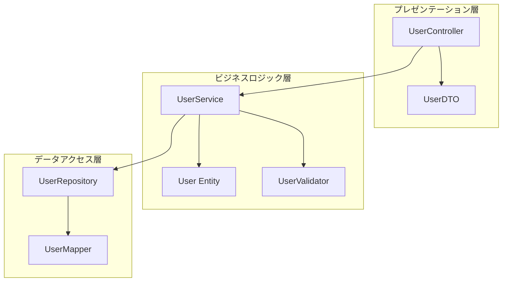
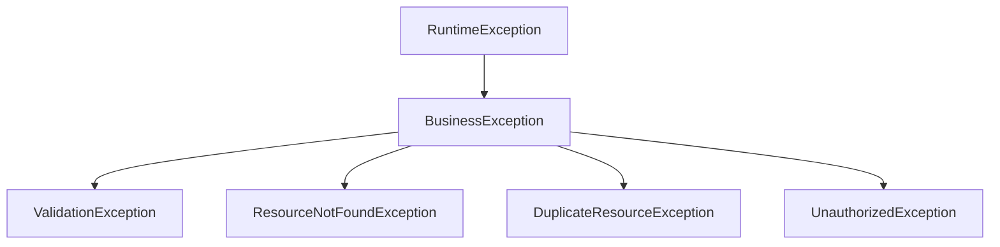

# 詳細設計書作成ルール

**ドキュメント分類:** 詳細設計書  
**バージョン:** 1.0  
**最終更新日:** 2025-10-30

---

## 📋 1. 基本情報

### ドキュメント名
詳細設計書 (Detailed Design Document / DDD)

### 目的
- プログラマーが直接コーディングできるレベルまで設計を詳細化する
- クラス、メソッド、アルゴリズムを具体的に定義する
- 実装上の判断基準と技術的な詳細を明確にする
- コードレビューの基準となる設計意図を記録する

### 対象読者
- **主要読者**: プログラマー、開発リーダー
- **副次読者**: テスター、コードレビュアー、保守担当者

### 関連成果物
- **入力**: 基本設計書（システム構成図、DB設計書、画面設計書）
- **出力**: ソースコード、単体テスト仕様書、コードレビュー記録

---

## ⏰ 2. 作成タイミングと前提条件

### 作成タイミング
- **開始**: 詳細設計フェーズ開始（基本設計完了後）
- **完了**: 詳細設計レビュー完了、実装開始前
- **更新**: 実装中の設計変更時に随時更新

### 前提条件
- [ ] 基本設計書完成（すべて）
- [ ] データベース設計書完成
- [ ] インターフェース設計書完成
- [ ] 開発環境構築完了

### 作成にかかる標準期間
- **小規模（〜50クラス）**: 2-3週間
- **中規模（50-150クラス）**: 4-6週間
- **大規模（150クラス〜）**: 6-10週間

---

## 📐 3. ドキュメント構成

### 必須セクション

#### 3.1 ドキュメント情報
- タイトル
- バージョン
- 作成日・更新日
- 作成者・レビュアー

#### 3.2 設計概要
- 担当機能・モジュールの概要
- 基本設計との対応関係
- 設計方針とアプローチ

#### 3.3 モジュール構成


#### 3.4 クラス詳細設計

各クラスごとに以下を記載:

##### 3.4.1 クラス基本情報
| 項目 | 内容 |
|-----|------|
| **クラス名** | UserService |
| **パッケージ** | com.example.service |
| **責務** | ユーザー管理のビジネスロジック |
| **依存クラス** | UserRepository, UserValidator, EmailService |
| **設計パターン** | Service Layer Pattern |

##### 3.4.2 クラス構造
```java
@Service
public class UserService {
    // フィールド
    private final UserRepository userRepository;
    private final UserValidator userValidator;
    private final EmailService emailService;
    private final PasswordEncoder passwordEncoder;
    
    // コンストラクタ（DI）
    @Autowired
    public UserService(
        UserRepository userRepository,
        UserValidator userValidator,
        EmailService emailService,
        PasswordEncoder passwordEncoder
    ) {
        this.userRepository = userRepository;
        this.userValidator = userValidator;
        this.emailService = emailService;
        this.passwordEncoder = passwordEncoder;
    }
    
    // パブリックメソッド
    public User createUser(UserCreateRequest request);
    public User getUserById(Long userId);
    public List<User> searchUsers(UserSearchCriteria criteria);
    public User updateUser(Long userId, UserUpdateRequest request);
    public void deleteUser(Long userId);
    
    // プライベートメソッド
    private void validateUserCreation(UserCreateRequest request);
    private String encodePassword(String rawPassword);
    private void sendWelcomeEmail(User user);
}
```

##### 3.4.3 メソッド詳細設計

**メソッド: createUser**

| 項目 | 内容 |
|-----|------|
| **メソッド名** | createUser |
| **可視性** | public |
| **戻り値** | User（作成されたユーザーエンティティ） |
| **引数** | UserCreateRequest request（ユーザー作成リクエスト） |
| **例外** | ValidationException, DuplicateEmailException |
| **トランザクション** | @Transactional |

**処理フロー**
```java
/**
 * ユーザーを新規作成する
 * 
 * @param request ユーザー作成リクエスト
 * @return 作成されたユーザー
 * @throws ValidationException 入力値が不正な場合
 * @throws DuplicateEmailException メールアドレスが重複している場合
 */
@Transactional
public User createUser(UserCreateRequest request) {
    // 1. 入力値検証
    validateUserCreation(request);
    
    // 2. メールアドレスの重複チェック
    if (userRepository.existsByEmail(request.getEmail())) {
        throw new DuplicateEmailException("このメールアドレスは既に登録されています");
    }
    
    // 3. パスワードのハッシュ化
    String encodedPassword = encodePassword(request.getPassword());
    
    // 4. ユーザーエンティティの生成
    User user = User.builder()
        .email(request.getEmail())
        .passwordHash(encodedPassword)
        .name(request.getName())
        .phone(request.getPhone())
        .status(UserStatus.ACTIVE)
        .createdAt(LocalDateTime.now())
        .build();
    
    // 5. データベースに保存
    User savedUser = userRepository.save(user);
    
    // 6. ウェルカムメール送信（非同期）
    sendWelcomeEmail(savedUser);
    
    // 7. 作成されたユーザーを返却
    return savedUser;
}
```

**アルゴリズム詳細**
```
1. 入力値検証
   - 必須項目チェック（email, password, name）
   - フォーマット検証（email: RFC 5322, phone: 10-11桁数字）
   - パスワード強度チェック（8文字以上、英数記号含む）

2. 重複チェック
   - SELECT COUNT(*) FROM users WHERE email = ?
   - 結果が0より大きい場合、DuplicateEmailExceptionをスロー

3. パスワードハッシュ化
   - bcryptアルゴリズム（cost factor: 12）
   - ソルトは自動生成

4. エンティティ生成
   - Builderパターンで生成
   - status: ACTIVE（初期値）
   - createdAt: 現在時刻

5. データベース保存
   - userRepository.save()呼び出し
   - 自動採番されたIDを取得

6. メール送信
   - 非同期実行（@Async）
   - 送信失敗してもロールバックしない

7. 戻り値
   - 保存されたUserエンティティ（IDを含む）
```

**例外処理**
| 例外 | 発生条件 | 処理 |
|-----|---------|------|
| ValidationException | 入力値不正 | 400 Bad Request、エラーメッセージ返却 |
| DuplicateEmailException | メール重複 | 409 Conflict、重複エラー返却 |
| DataAccessException | DB接続エラー | 500 Internal Server Error、ログ記録 |

**パフォーマンス考慮**
- メール送信は非同期実行（処理時間: 数秒）
- データベースアクセスは1回のみ（N+1問題なし）
- トランザクション時間: 平均50ms以内

#### 3.5 データ構造設計

##### 3.5.1 エンティティクラス
```java
@Entity
@Table(name = "users")
@Getter
@Builder
public class User {
    @Id
    @GeneratedValue(strategy = GenerationType.IDENTITY)
    private Long userId;
    
    @Column(nullable = false, unique = true, length = 255)
    private String email;
    
    @Column(nullable = false, length = 255)
    private String passwordHash;
    
    @Column(nullable = false, length = 100)
    private String name;
    
    @Column(length = 20)
    private String phone;
    
    @Enumerated(EnumType.STRING)
    @Column(nullable = false, length = 20)
    private UserStatus status;
    
    @Column(nullable = false, updatable = false)
    private LocalDateTime createdAt;
    
    @Column(nullable = false)
    private LocalDateTime updatedAt;
    
    @Version
    private Integer version;  // 楽観的ロック
}
```

##### 3.5.2 DTOクラス
```java
@Data
public class UserCreateRequest {
    @NotBlank(message = "メールアドレスは必須です")
    @Email(message = "メールアドレスの形式が正しくありません")
    private String email;
    
    @NotBlank(message = "パスワードは必須です")
    @Pattern(regexp = "^(?=.*[A-Za-z])(?=.*\\d)(?=.*[@$!%*#?&])[A-Za-z\\d@$!%*#?&]{8,}$",
             message = "パスワードは8文字以上で、英字、数字、記号を含む必要があります")
    private String password;
    
    @NotBlank(message = "氏名は必須です")
    @Size(max = 100, message = "氏名は100文字以内で入力してください")
    private String name;
    
    @Pattern(regexp = "^[0-9]{10,11}$", message = "電話番号は10-11桁の数字で入力してください")
    private String phone;
}
```

#### 3.6 エラーハンドリング設計

##### 3.6.1 例外階層


##### 3.6.2 エラーレスポンス
```java
@ControllerAdvice
public class GlobalExceptionHandler {
    
    @ExceptionHandler(ValidationException.class)
    public ResponseEntity<ErrorResponse> handleValidation(ValidationException ex) {
        ErrorResponse error = ErrorResponse.builder()
            .status("error")
            .code("VALIDATION_ERROR")
            .message(ex.getMessage())
            .details(ex.getFieldErrors())
            .timestamp(LocalDateTime.now())
            .build();
        return ResponseEntity.status(HttpStatus.BAD_REQUEST).body(error);
    }
    
    @ExceptionHandler(DuplicateEmailException.class)
    public ResponseEntity<ErrorResponse> handleDuplicate(DuplicateEmailException ex) {
        ErrorResponse error = ErrorResponse.builder()
            .status("error")
            .code("DUPLICATE_EMAIL")
            .message(ex.getMessage())
            .timestamp(LocalDateTime.now())
            .build();
        return ResponseEntity.status(HttpStatus.CONFLICT).body(error);
    }
}
```

#### 3.7 テスト設計方針

##### 3.7.1 単体テスト対象
- すべてのpublicメソッド
- 境界値のテスト
- 例外パスのテスト
- エッジケースのテスト

##### 3.7.2 モック対象
- 外部依存（Repository, EmailService）
- 時刻依存（LocalDateTime.now()）

---

## ✍️ 4. 記載ルール

### 4.1 命名規則

#### クラス命名
- **Entity**: 名詞単数形（User, Product）
- **Service**: {Entity}Service（UserService）
- **Repository**: {Entity}Repository（UserRepository）
- **Controller**: {Entity}Controller（UserController）
- **DTO**: {Entity}{目的}（UserCreateRequest, UserResponse）

#### メソッド命名
- **取得**: get{Entity}（getUser, getUserList）
- **作成**: create{Entity}（createUser）
- **更新**: update{Entity}（updateUser）
- **削除**: delete{Entity}（deleteUser）
- **検証**: validate{対象}（validateEmail）
- **変換**: to{変換先}（toEntity, toDto）

#### 変数命名
- **ローカル変数**: camelCase（userId, userName）
- **定数**: UPPER_SNAKE_CASE（MAX_RETRY_COUNT）
- **コレクション**: 複数形（users, products）

### 4.2 コメント規則

#### クラスコメント（必須）
```java
/**
 * ユーザー管理のビジネスロジックを提供するサービスクラス
 * 
 * <p>このクラスは以下の責務を持つ：
 * <ul>
 *   <li>ユーザーの作成、更新、削除</li>
 *   <li>ユーザー情報の検証</li>
 *   <li>パスワードのハッシュ化</li>
 * </ul>
 * 
 * @author システム開発チーム
 * @version 1.0
 * @since 2025-10-30
 */
```

#### メソッドコメント（public/protectedは必須）
```java
/**
 * 新規ユーザーを作成する
 * 
 * <p>入力値の検証、メールアドレスの重複チェック、パスワードのハッシュ化を行い、
 * データベースに保存する。保存後、ウェルカムメールを非同期で送信する。
 * 
 * @param request ユーザー作成リクエスト（必須項目: email, password, name）
 * @return 作成されたユーザーエンティティ（自動採番されたIDを含む）
 * @throws ValidationException 入力値が不正な場合
 * @throws DuplicateEmailException メールアドレスが既に登録されている場合
 */
```

### 4.3 設計パターンの適用

記載すべき設計パターン:
- **使用パターン**: パターン名
- **適用理由**: なぜこのパターンを選択したか
- **実装クラス**: どのクラスがどの役割を担うか

---

## ✅ 5. 品質基準

### 5.1 完成度チェックリスト

#### 網羅性
- [ ] すべてのクラスが定義されている
- [ ] すべてのpublicメソッドが定義されている
- [ ] データ構造（Entity, DTO）が明確
- [ ] 例外処理が網羅されている

#### 詳細度
- [ ] プログラマーが迷わないレベルの詳細さ
- [ ] アルゴリズムが疑似コードレベルで記載
- [ ] データ型、引数、戻り値が明記
- [ ] 境界条件、エラーケースが明記

#### 品質
- [ ] SOLID原則に準拠
- [ ] DRY原則（重複なし）
- [ ] YAGNI原則（過剰設計なし）
- [ ] 疎結合・高凝集

### 5.2 レビュー観点

#### 設計品質
- [ ] 責務が明確で単一か（SRP）
- [ ] 依存関係が適切か（DIP）
- [ ] テスタビリティが確保されているか

#### 実装可能性
- [ ] プログラマーが理解できる詳細度か
- [ ] 曖昧さがないか
- [ ] 実装上の判断基準が明確か

---

## 🤖 6. AI作成時の具体的指示

### 6.1 必須記載項目

1. **完全なクラス定義**
   - フィールド（型、アクセス修飾子）
   - メソッドシグネチャ（引数、戻り値、例外）
   - 依存関係

2. **詳細な処理フロー**
   - ステップバイステップのアルゴリズム
   - 条件分岐の判断基準
   - エラーハンドリング

3. **具体的なコード例**
   - 疑似コードまたは実装例
   - 重要なロジックは実コード

### 6.2 避けるべき表現

❌ **NG例**:
- "適切に処理する" → ✅ "bcrypt（cost 12）でハッシュ化"
- "データを取得する" → ✅ "userRepository.findById(userId).orElseThrow(() -> new NotFoundException())"
- "エラーチェック" → ✅ "email: RFC 5322準拠、password: 8文字以上英数記号含む"

---

## 📚 7. 関連ドキュメント

- [基本設計書](../../03_基本設計/README.md)
- [クラス図](./クラス図作成ルール.md)
- [シーケンス図](./シーケンス図作成ルール.md)
- [単体テスト仕様書](./単体テスト仕様書作成ルール.md)

---

## ⚠️ 8. よくある失敗例と対策

| 失敗例 | 原因 | 対策 |
|--------|------|------|
| **詳細度が不足** | 基本設計との区別不明確 | メソッドレベルまで詳細化 |
| **過度な設計** | 将来の拡張を考えすぎ | YAGNI原則、現在必要なものだけ |
| **実装との乖離** | 設計書の更新漏れ | コードレビュー時に設計書も確認 |
| **例外処理の不備** | ハッピーパスのみ考慮 | すべての例外パスを明記 |

---

**バージョン履歴**
- v1.0 (2025-10-30): 初版作成
