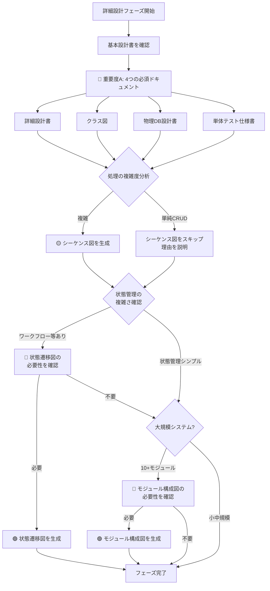

# 04_詳細設計フェーズ - ドキュメント作成ルール

## 📋 フェーズ概要

**目的:** 実装可能なレベルまで設計を詳細化する

**主要成果物:** 詳細設計書、クラス図、シーケンス図、状態遷移図、物理DB設計書、単体テスト仕様書

**前工程:** 03_基本設計フェーズ  
**次工程:** 05_実装フェーズ

---

## 🎯 成果物の重要度と自動生成ルール

### 🔴 重要度A：生成必須（MANDATORY）- 常に自動生成

| No | 成果物名 | ルールファイル | 理由 |
|----|---------|--------------|------|
| 1 | **詳細設計書** | [04_詳細設計書作成ルール.md](04_詳細設計書作成ルール.md) | 実装の直接的な指針となる最重要ドキュメント |
| 2 | **クラス図** | [04_クラス図作成ルール.md](04_クラス図作成ルール.md) | オブジェクト指向設計の構造定義に必須 |
| 3 | **物理DB設計書** | [04_物理DB設計書作成ルール.md](04_物理DB設計書作成ルール.md) | インデックス・パーティション等の性能設計に必須 |
| 4 | **単体テスト仕様書** | [04_単体テスト仕様書作成ルール.md](04_単体テスト仕様書作成ルール.md) | コード品質保証の基礎 |

**AI動作:**
```
✅ ユーザーの明示的な指示がなくても自動的に生成する
✅ 該当フェーズに入ったら必ず生成対象として認識する
⚠️  省略する場合は、ユーザーに理由を説明し確認を求める
```

---

### 🟡 重要度B：生成推奨（RECOMMENDED）- デフォルトで自動生成

| No | 成果物名 | ルールファイル | 理由 | 省略可能なケース |
|----|---------|--------------|------|-----------------|
| 1 | **シーケンス図** | [04_シーケンス図作成ルール.md](04_シーケンス図作成ルール.md) | 複雑な処理フローの理解に有用 | 単純なCRUD処理のみ、小規模プロジェクト |

**AI動作:**
```
✅ デフォルトで自動生成する
🔄 プロジェクト規模や複雑度に応じて省略判断可能
💬 省略する場合は、その理由をユーザーに説明する
```

**判断基準:**
- **生成すべきケース:**
  - 複数システム間の連携処理
  - 複雑なビジネスロジック
  - 非同期処理・イベント駆動
  - トランザクション境界が複雑

- **省略可能なケース:**
  - 単純なCRUD操作のみ
  - 1-3人月の小規模プロジェクト
  - 詳細設計書のフロー図で十分な場合

---

### 🟢 重要度C：生成任意（OPTIONAL）- 指示時のみ生成

| No | 成果物名 | ルールファイル | 必要なケース | 確認フレーズ例 |
|----|---------|--------------|------------|---------------|
| 1 | **状態遷移図** | [04_状態遷移図作成ルール.md](04_状態遷移図作成ルール.md) | 状態管理が複雑なシステム | 「ワークフロー、注文ステータス、承認フロー等の複雑な状態管理はありますか？ある場合は状態遷移図を作成します」 |
| 2 | **モジュール構成図** | ルールなし | 大規模システムの依存関係管理 | 「システムが大規模で、モジュール間の依存関係を明確にする必要がありますか？」 |
| 3 | **アクティビティ図** | ルールなし | 複雑な業務ロジックの可視化 | 「複雑な業務フローをアクティビティ図で表現する必要がありますか？」 |
| 4 | **IPO（処理機能記述）** | ルールなし | 古典的な開発手法 | 「IPO形式での処理記述が必要ですか？（モダン開発では通常不要）」 |

**AI動作:**
```
❌ ユーザーからの明示的な指示がない限り生成しない
💬 該当する可能性がある場合、ユーザーに確認を促す
📝 必要性の判断はユーザーに委ねる
```

**確認が必要な状況:**
- **状態遷移図:** 要件定義に「ステータス」「状態」「ワークフロー」「承認」等のキーワード
- **モジュール構成図:** 10以上のマイクロサービス、複雑な依存関係
- **アクティビティ図:** 複雑な分岐・並行処理を含む業務フロー

---

## 🤖 AI自動生成フロー（詳細設計フェーズ）



---

## 📊 統計情報

### 成果物数サマリー

| 重要度 | 件数 | 割合 | 自動生成 |
|--------|------|------|----------|
| 🔴 A（必須） | 4件 | 44% | ✅ すべて |
| 🟡 B（推奨） | 1件 | 11% | ✅ デフォルト |
| 🟢 C（任意） | 4件 | 45% | ❌ 指示時のみ |
| **合計** | **9件** | **100%** | 5件がデフォルト生成 |

### 作成時間の目安（AI生成）

| 成果物名 | 規模（小） | 規模（中） | 規模（大） |
|---------|-----------|-----------|-----------|
| 詳細設計書 | 2時間 | 6時間 | 16時間 |
| クラス図 | 1時間 | 3時間 | 8時間 |
| シーケンス図 | 1時間 | 2時間 | 6時間 |
| 状態遷移図 | 30分 | 1時間 | 3時間 |
| 物理DB設計書 | 1時間 | 3時間 | 8時間 |
| 単体テスト仕様書 | 2時間 | 5時間 | 12時間 |

---

## ⚙️ プロジェクト特性別の推奨構成

### 小規模プロジェクト（1-3人月）

**必須（重要度A）:**
- ✅ 詳細設計書（簡易版、主要機能のみ）
- ✅ クラス図（コアドメイン中心）
- ✅ 物理DB設計書
- ✅ 単体テスト仕様書

**推奨（重要度B）:**
- 🔄 シーケンス図 → 詳細設計書のフロー図で代替可

**任意（重要度C）:**
- ❌ 通常は不要

---

### 中規模プロジェクト（4-12人月）

**必須（重要度A）:**
- ✅ すべての重要度A成果物を標準レベルで作成

**推奨（重要度B）:**
- ✅ シーケンス図（主要な処理フロー）

**任意（重要度C）:**
- 🔍 状態遷移図 → ワークフロー機能があれば作成
- ❌ その他は通常不要

---

### 大規模プロジェクト（13人月以上）

**必須（重要度A）:**
- ✅ すべての重要度A成果物を詳細レベルで作成

**推奨（重要度B）:**
- ✅ シーケンス図（すべての重要な処理フロー）

**任意（重要度C）:**
- ✅ 状態遷移図（複雑な状態管理）
- ✅ モジュール構成図（マイクロサービス等）
- 🔍 アクティビティ図（業務ロジックが複雑な場合）

---

## 🎨 システム特性別の推奨構成

### マイクロサービス・分散システム

**追加で重要:**
- ✅ シーケンス図（必須級） - サービス間通信の可視化
- ✅ モジュール構成図 - 依存関係の管理
- 🔍 状態遷移図 - サガパターン等の複雑な状態管理

### 単純なCRUD Web アプリ

**簡略化可能:**
- 🔄 シーケンス図 → 省略可（詳細設計書で十分）
- ❌ 状態遷移図 → 通常不要
- ❌ モジュール構成図 → 不要

### ワークフローエンジン・承認システム

**追加で重要:**
- ✅ 状態遷移図（必須級） - ステータス管理の明確化
- ✅ シーケンス図 - 承認フローの可視化

---

## 🔗 関連ドキュメント

- [ドキュメント作成基本ルール](../00_ドキュメント作成ルール/ドキュメント作成基本ルール.md) - 全体の基本ルール
- [README_成果物重要度定義](../README_成果物重要度定義.md) - 全フェーズの重要度定義
- [03_基本設計フェーズ](../03_基本設計/README.md) - 前工程
- [05_実装フェーズ](../05_実装/README.md) - 次工程

---

**最終更新日:** 2025年10月30日  
**バージョン:** 1.0  
**対象:** AI開発アシスタント、詳細設計者

---

## 📚 サンプルファイル

実際のルールを適用した実践的なサンプルファイルが[samplesディレクトリ](./samples/)に用意されています。

### 提供サンプル（ECサイトプロジェクト）

1. **[sample_04_詳細設計書_UserService.md](./samples/sample_04_詳細設計書_UserService.md)** (15.4 KB)
   - サービスクラスの詳細設計（4メソッド、処理フロー図、トランザクション設計）

2. **[sample_04_クラス図_UserManagement.md](./samples/sample_04_クラス図_UserManagement.md)** (11.6 KB)
   - Controller/Service/Repository/Entity層の完全クラス図、DTOパターン

3. **[sample_04_物理DB設計書.md](./samples/sample_04_物理DB設計書.md)** (9.8 KB)
   - DDL定義、パーティショニング戦略、レプリケーション設計、バックアップ方針

4. **[sample_04_単体テスト仕様書_UserService.md](./samples/sample_04_単体テスト仕様書_UserService.md)** (25.7 KB)
   - JUnit 5 + Mockitoのテストケース、カバレッジ目標、正常系・異常系・境界値テスト

**題材**: ECサイト構築プロジェクト（Spring Boot 3.2 + React 18 + PostgreSQL 15）

**活用方法**:
- 自プロジェクトの参考として
- AI生成時のプロンプトの具体例として
- ルール適用の品質チェック基準として

