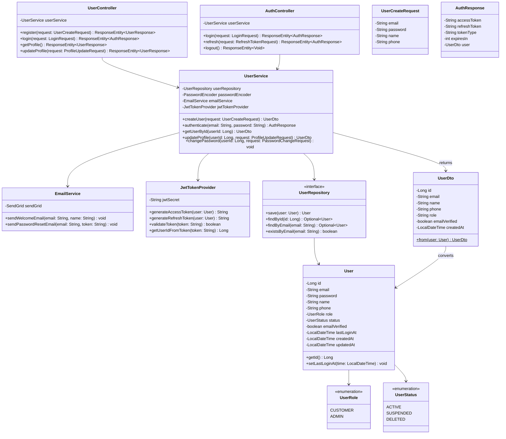
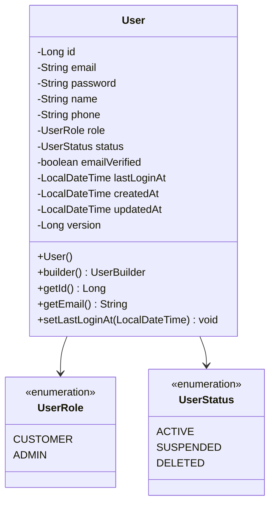
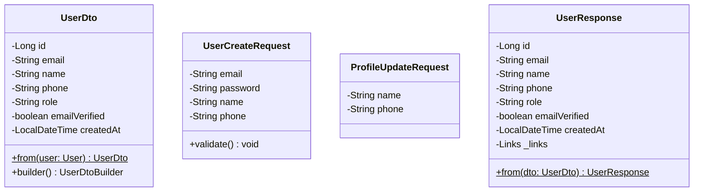
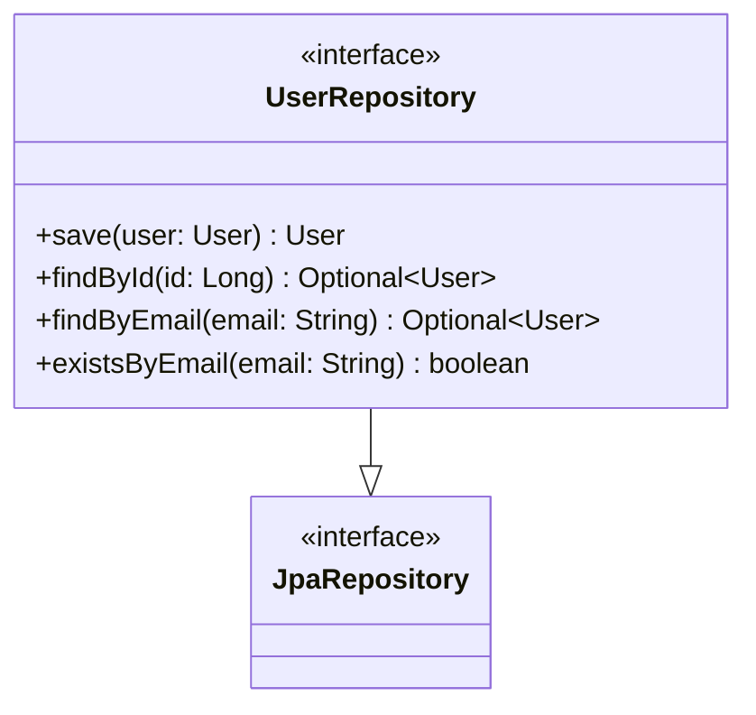
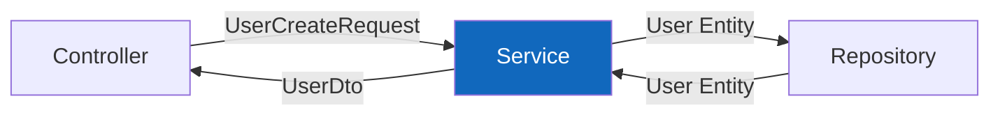
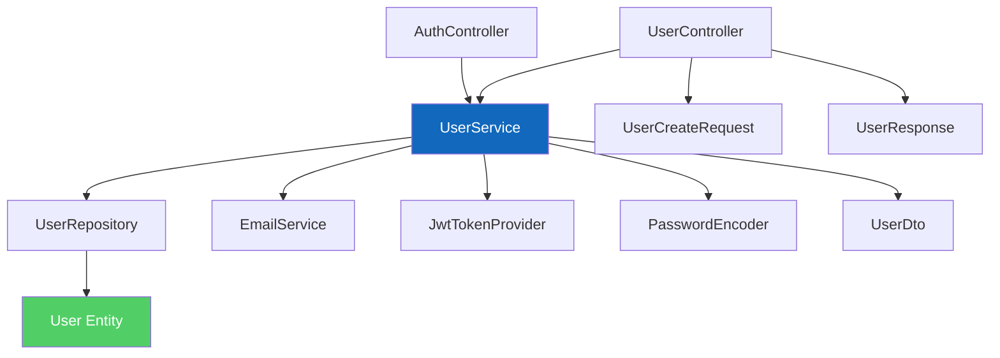
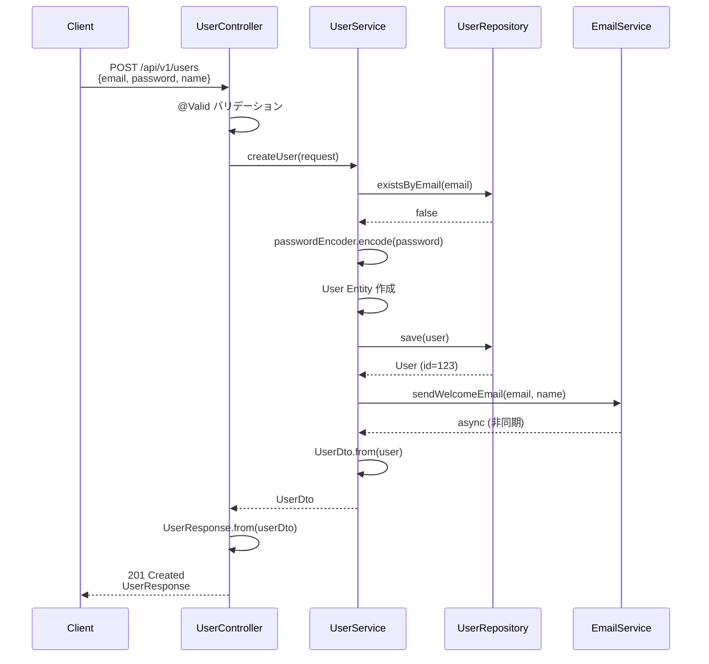

# クラス図 - ユーザー管理モジュール

**プロジェクト名:** ECサイト構築プロジェクト  
**ドキュメントID:** CLASS-USER-001  
**バージョン:** 1.0  
**作成日:** 2025-10-30  
**作成者:** 詳細設計者

---

## 1. 基本情報

### 1.1 目的

ユーザー管理モジュールのクラス構造を定義し、クラス間の関係を明確にする。

### 1.2 対象範囲

- Controller層（プレゼンテーション）
- Service層（ビジネスロジック）
- Repository層（データアクセス）
- Entity層（ドメインモデル）
- DTO層（データ転送オブジェクト）

---

## 2. 全体クラス図



---

## 3. 層別クラス詳細

### 3.1 Controller層

#### UserController

```java
@RestController
@RequestMapping("/api/v1/users")
@RequiredArgsConstructor
public class UserController {
    
    private final UserService userService;
    
    @PostMapping
    public ResponseEntity<UserResponse> register(
            @Valid @RequestBody UserCreateRequest request) {
        UserDto userDto = userService.createUser(request);
        return ResponseEntity.status(HttpStatus.CREATED)
                .body(UserResponse.from(userDto));
    }
    
    @GetMapping("/me")
    @PreAuthorize("isAuthenticated()")
    public ResponseEntity<UserResponse> getProfile(
            @AuthenticationPrincipal UserPrincipal principal) {
        UserDto userDto = userService.getUserById(principal.getId());
        return ResponseEntity.ok(UserResponse.from(userDto));
    }
    
    @PutMapping("/me")
    @PreAuthorize("isAuthenticated()")
    public ResponseEntity<UserResponse> updateProfile(
            @AuthenticationPrincipal UserPrincipal principal,
            @Valid @RequestBody ProfileUpdateRequest request) {
        UserDto userDto = userService.updateProfile(principal.getId(), request);
        return ResponseEntity.ok(UserResponse.from(userDto));
    }
}
```

---

### 3.2 Entity層

#### User（ユーザーエンティティ）



**実装:**

```java
@Entity
@Table(name = "users")
@Getter
@NoArgsConstructor
@AllArgsConstructor
@Builder
public class User extends BaseEntity {
    
    @Id
    @GeneratedValue(strategy = GenerationType.IDENTITY)
    private Long id;
    
    @Column(nullable = false, unique = true, length = 255)
    private String email;
    
    @Column(nullable = false, length = 255)
    private String password;
    
    @Column(nullable = false, length = 100)
    private String name;
    
    @Column(length = 20)
    private String phone;
    
    @Enumerated(EnumType.STRING)
    @Column(nullable = false, length = 20)
    private UserRole role;
    
    @Enumerated(EnumType.STRING)
    @Column(nullable = false, length = 20)
    private UserStatus status;
    
    @Column(nullable = false)
    private boolean emailVerified;
    
    @Column
    private LocalDateTime lastLoginAt;
    
    @Version
    private Long version;  // 楽観的ロック
    
    // Setterメソッド
    public void setLastLoginAt(LocalDateTime lastLoginAt) {
        this.lastLoginAt = lastLoginAt;
    }
}
```

---

### 3.3 DTO層

#### UserDto（データ転送オブジェクト）



**実装:**

```java
@Data
@Builder
@NoArgsConstructor
@AllArgsConstructor
public class UserDto {
    private Long id;
    private String email;
    private String name;
    private String phone;
    private String role;
    private boolean emailVerified;
    private LocalDateTime createdAt;
    
    /**
     * EntityからDTOへの変換
     */
    public static UserDto from(User user) {
        return UserDto.builder()
                .id(user.getId())
                .email(user.getEmail())
                .name(user.getName())
                .phone(user.getPhone())
                .role(user.getRole().name())
                .emailVerified(user.isEmailVerified())
                .createdAt(user.getCreatedAt())
                .build();
    }
}

@Data
@NoArgsConstructor
@AllArgsConstructor
public class UserCreateRequest {
    
    @NotBlank(message = "メールアドレスは必須です")
    @Email(message = "メールアドレスの形式が不正です")
    private String email;
    
    @NotBlank(message = "パスワードは必須です")
    @Size(min = 8, message = "パスワードは8文字以上必要です")
    private String password;
    
    @NotBlank(message = "名前は必須です")
    @Size(max = 100, message = "名前は100文字以内です")
    private String name;
    
    @Pattern(regexp = "^0\\d{1,4}-\\d{1,4}-\\d{4}$", 
             message = "電話番号の形式が不正です")
    private String phone;
}
```

---

## 4. デザインパターン適用

### 4.1 Repository パターン



**利点:**
- データアクセス層の抽象化
- テスト容易性の向上
- ビジネスロジックとデータアクセスの分離

---

### 4.2 DTO パターン



**利点:**
- Entity の直接露出を防止
- レイヤー間のデータ転送最適化
- API バージョニングの容易化

---

## 5. クラス関係図

### 5.1 依存関係



### 5.2 パッケージ構成

```
com.ecshop
├── controller
│   ├── UserController.java
│   └── AuthController.java
├── service
│   ├── UserService.java
│   ├── EmailService.java
│   └── JwtTokenProvider.java
├── repository
│   └── UserRepository.java
├── entity
│   ├── User.java
│   ├── UserRole.java (enum)
│   └── UserStatus.java (enum)
└── dto
    ├── UserDto.java
    ├── UserCreateRequest.java
    ├── ProfileUpdateRequest.java
    ├── UserResponse.java
    └── AuthResponse.java
```

---

## 6. シーケンス図（ユーザー登録）



---

## 7. 変更履歴

| バージョン | 日付 | 変更内容 | 変更者 |
|-----------|------|---------|--------|
| 1.0 | 2025-10-30 | 初版作成 | 詳細設計者 |

---

**ドキュメント終了**
